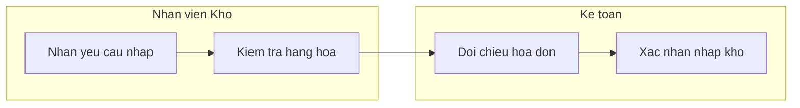
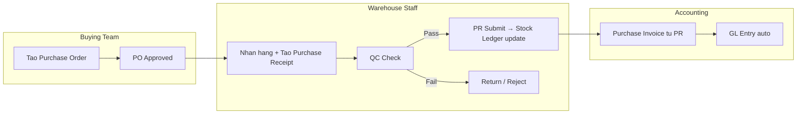
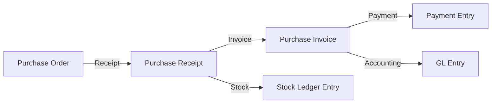
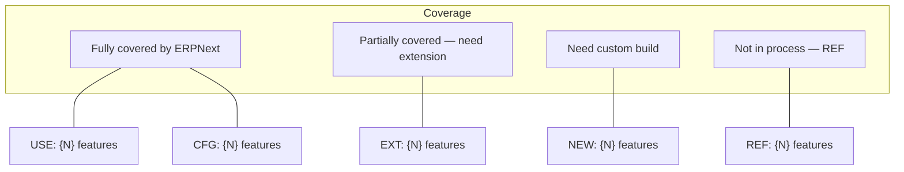

# /dcnet-ba — Business Analysis & Process Modeling

Generate comprehensive BA analysis for a DCNET Flow module: BPMN process diagrams (Mermaid), ERPNext workflow mapping, gap analysis, value stream mapping, process metrics, requirements traceability matrix, and workflow comparison docs. Powered by 7 analysis domains + workflow comparison based on BABOK v3 methodology.

## Quick Start

```bash
/dcnet-ba 07                  # Full BA analysis for module 07 (by STT)
/dcnet-ba "mua hàng"          # Full BA analysis (by module name)
/dcnet-ba "bán hàng" --update # Update existing analysis
/dcnet-ba 05 --workflow       # Generate workflow comparison only
/dcnet-ba "kế toán"           # Gộp nhiều STT (23-31)
```

## Prerequisites

- `SPEC_MAPPING.md` MUST exist for the module (run `/dcnet-module {STT}` first)
- If SPEC_MAPPING not found, warn user and stop

## Output

### 1. BA Analysis (analysis/)
Single file: `docs/modules/{STT}-{slug}/analysis/BA_ANALYSIS.md`

Contains up to 5 sections (depending on module complexity):
1. **BPMN Process Flows** — As-Is + To-Be swimlane diagrams
2. **ERPNext Process Detail** — DocType workflow with edge cases
3. **Requirements Traceability** — Spec feature → Process step → DocType/Field
4. **Gap Analysis** — BRAVO → ERPNext gap inventory with resolution options *(Medium+ modules)*
5. **Value Stream Analysis** — Flow efficiency, waste, bottlenecks, improvement targets *(Complex modules)*

### 2. Workflow Comparison (workflow/)
Two files in: `docs/modules/{STT}-{slug}/workflow/`

| File | Mục đích | Nội dung |
|------|----------|---------|
| `erpnext.md` | Reference kỹ thuật thuần ERPNext | Luồng chuẩn, DocType, fields, GL Entry, trạng thái, API, cấu hình |
| `nhatminh.md` | Luồng theo specs khách hàng | Bảng so sánh ✅/❌/🔧 → quy trình chi tiết → chỉ nội dung trong specs |

> Hiện tại luôn dùng `nhatminh.md`. Sau này nếu có thêm công ty khác sẽ bổ sung file riêng.

**Workflow docs luôn được tạo cùng BA_ANALYSIS** (trừ khi dùng `--workflow` để tạo riêng).

## 7 Domains — Knowledge References

Mỗi domain có reference file chi tiết. **ĐỌC references trước khi generate BA_ANALYSIS.**

> **QUAN TRỌNG:** Đọc [ba-orchestration.md](references/ba-orchestration.md) TRƯỚC để xác định Workflow (A/B/C/D) phù hợp cho module, từ đó biết domains nào cần dùng.

### Domain 1: BPMN Process Modeling

> Reference: [bpmn-notation.md](references/bpmn-notation.md)

**Kiến thức cần dùng:**
- BPMN Core Elements: Activities (7 task types), Events (6 types), Gateways (4 types), Connectors, Swimlanes
- Common Patterns: Sequential, Parallel Split/Join, Exclusive Decision, Loop, Exception Handling, Approval Workflow
- BPMN → ERPNext mapping: Pool=Company, Lane=Role, User Task=Form action, Service Task=Hook/Auto GL
- Validation checklist: paths connected, no dead ends, gateways balanced, roles assigned

**Khi generate diagram:**
- Vẽ As-Is (nếu có info) + To-Be (bắt buộc)
- So sánh As-Is vs To-Be table
- Swimlane theo DCNET roles (BLD, TP Mua hàng, NV Kho, Kế toán...)

### Domain 2: BA Methodology

> Reference: [ba-methodology.md](references/ba-methodology.md)

**Kiến thức cần dùng:**
- Decision Framework: Feature mới → User stories, Cải tiến → BPMN, Tích hợp → Interface spec
- Requirements Gathering: 7 bước (Identify → Discovery → Pain points → Metrics → Draft → Validate → Prioritize)
- MoSCoW Prioritization: Must (USE/CFG) → Should (EXT core) → Could (EXT nice) → Won't (deferred)
- RACI Matrix: R/A/C/I cho mỗi activity × role
- Stakeholder Analysis: Power-Interest grid
- Requirements Traceability: Spec → Requirement → Process → DocType → Field → Test Case
- Anti-patterns: Solution in requirements, Missing criteria, No validation, Gold plating

**Khi generate analysis:**
- Tạo RACI matrix cho từng quy trình
- Map stakeholders cho module
- Traceability matrix 100% coverage

### Domain 3: Mermaid BPMN Rendering

> Reference: [mermaid-bpmn-patterns.md](references/mermaid-bpmn-patterns.md)

**Kiến thức cần dùng:**
- Swimlane Pattern: `flowchart LR` + `subgraph "Role"` cho BPMN lanes
- Gateway Patterns: XOR (diamond), AND (multiple edges), OR (labeled)
- Start/End: `(("Label"))` circle, Task: `["Label"]` rect, Decision: `{"Label?"}` diamond
- Color convention: Green=auto, Orange=manual, Red=exception, Yellow=decision, Blue=external
- Sequence diagram cho API/Integration flows
- State diagram cho DocType lifecycle (ASCII IDs only!)
- Common mistakes: Vietnamese in state IDs, unquoted special chars, missing subgraph end

**Khi render:**
- Follow mermaid-validation.md rules
- Max ~25 nodes per diagram, tách nếu nhiều hơn
- Dùng color coding consistent cho automated vs manual steps

### Domain 4: Gap Analysis (BRAVO → ERPNext)

> Reference: [gap-analysis.md](references/gap-analysis.md)

**Kiến thức cần dùng:**
- Gap Types mapping: USE=No gap, CFG=Config gap, EXT=Extension gap, NEW=Capability gap
- 5-step workflow: Document As-Is → Define To-Be → Identify Gaps → Categorize → Resolution Options
- DCNET-specific categories: Data Migration, Process, Integration, Compliance gaps
- Risk Heat Map: Complexity × Risk → Green/Yellow/Orange/Red
- Resolution Options template: Option A (extend) vs Option B (custom) with effort estimates
- Effort benchmarks: USE=0.5d, CFG=1-2d, EXT=3-5d, NEW=5-15d

**Khi generate gap analysis:**
- Gap inventory table cho TỪNG feature có tag EXT hoặc NEW
- Resolution options cho mỗi gap (ít nhất 2 options)
- Risk heat map + effort estimate tổng
- Cross-module dependencies

### Domain 5: Value Stream Mapping (Lean)

> Reference: [value-stream-mapping.md](references/value-stream-mapping.md)

**Kiến thức cần dùng:**
- 8 loại lãng phí (TIMWOODS): Transportation, Inventory, Motion, Waiting, Overproduction, Overprocessing, Defects, Skills
- Core metrics: Process Time (PT), Lead Time (LT), Flow Efficiency, %C&A, WIP
- Benchmark: BRAVO flow efficiency ~2-5% → ERPNext target 15-25%
- Bottleneck analysis: Theory of Constraints, queue analysis
- Mermaid VSM diagrams with metrics on each node
- Kaizen event template for focused improvements

**Khi generate VSM:**
- Current State map với PT/LT/C&A cho mỗi step
- Future State map với ERPNext improvements
- Waste analysis theo TIMWOODS
- Bottleneck identification + giải pháp
- Improvement roadmap với impact/effort matrix

### Domain 6: BA Orchestration (BABOK v3)

> Reference: [ba-orchestration.md](references/ba-orchestration.md)

**Kiến thức cần dùng:**
- Module complexity classification: Simple / Medium / Complex / Special
- 4 Standard Workflows: A (Quick) → B (Standard) → C (Full) → D (Custom)
- Technique selection decision tree based on SPEC_MAPPING tags
- Parallel vs Sequential technique execution
- Quality checklist per workflow level
- Special handling for Accounting modules (22-30) as integrated cluster

**Khi bắt đầu analysis:**
- **LUÔN classify module trước** → chọn Workflow phù hợp
- Present workflow choice to user for confirmation
- Execute techniques theo đúng sequence
- Quality checklist trước khi finalize

### Domain 7: Process Metrics & KPIs

> Reference: [process-metrics.md](references/process-metrics.md)

**Kiến thức cần dùng:**
- Time metrics: PT, LT, WT, Cycle Time, Takt Time
- Quality metrics: %C&A, Error Rate, Rework Rate, First Pass Yield
- Efficiency metrics: Flow Efficiency, Automation Rate, Throughput, WIP
- ERPNext-specific KPIs: per module (Purchasing, Sales, Inventory, Accounting)
- YAML structured output for machine-readable metrics
- Benchmark data: industry averages cho retail/distribution

**Khi generate metrics:**
- Current state estimates (mark clearly as estimates)
- Target state after ERPNext implementation
- Improvement % calculation
- YAML block cho machine-readable output

---

## Process

### Step 0: Parse & Validate

**Input:** Chấp nhận cả STT (số) hoặc tên module (tiếng Việt).

```bash
/dcnet-ba 05                  # STT → lookup slug
/dcnet-ba mua hàng            # Tên module → lookup STT + slug
/dcnet-ba "bán hàng"          # Tên có dấu cách → quote
/dcnet-ba kế toán             # Gộp nhiều STT
```

**Bước xử lý:**

1. Parse argument → xác định input là STT hay tên module
2. Lookup trong **Module Name Mapping** (bên dưới) → STT, slug, satellites
3. Module path: `docs/modules/{STT}-{slug}/`
4. Check `SPEC_MAPPING.md` exists — if not, stop with message:
   ```
   Chua co SPEC_MAPPING.md cho module {STT}.
   Chay `/dcnet-module {STT}` truoc de tao SPEC_MAPPING.
   ```
5. If `analysis/BA_ANALYSIS.md` exists and no `--update`: ask update or skip
6. **Detect satellite modules** → hỏi user có muốn kèm không (xem Step 0.1)

#### Module Name Mapping

| Tên module (input) | Core STT | Slug | Vệ tinh (satellites) |
|---------------------|----------|------|---------------------|
| mua hàng | 05 | mua-hang | 04 (NCC), 24 (KT mua hàng), 06 (BC phân tích) |
| bán hàng | 12 | ban-hang | 09 (đơn hàng), 10 (bán buôn), 11 (bán lẻ), 13 (DM bán hàng), 17 (KH), 25 (KT bán hàng) |
| kho, kho hàng | 07 | kho-hang | 08 (BC kho), 27 (KT HTK) |
| sản phẩm | 03 | san-pham | — |
| ncc, nhà cung cấp | 04 | nha-cung-cap | — |
| đơn hàng | 09 | don-hang | 10 (bán buôn), 11 (bán lẻ), 18 (BC đơn hàng) |
| bán buôn | 10 | ban-buon | 09 (đơn hàng), 13 (DM bán hàng) |
| bán lẻ | 11 | ban-le | 09 (đơn hàng) |
| trade-in | 14 | trade-in | 12 (bán hàng), 07 (kho) |
| kế toán | 23 | ke-toan-tien | 24-31 (toàn bộ kế toán — gộp 1 khối) |
| kế toán mua hàng | 24 | ke-toan-mua-hang | 05 (mua hàng), 26 (công nợ) |
| kế toán bán hàng | 25 | ke-toan-ban-hang | 12 (bán hàng), 26 (công nợ) |
| công nợ | 26 | ke-toan-cong-no | 24 (KT mua), 25 (KT bán) |
| lead | 33 | lead | 17 (KH), 34 (fitting) |
| fitting | 34 | fitting | 33 (lead), 35 (coaching) |
| dashboard | 02 | dashboard | — |
| chi nhánh | 15 | chi-nhanh | — |
| nhân viên | 16 | nhan-vien | — |
| khách hàng | 17 | khach-hang | 33 (lead), 37 (CSKH) |
| tích điểm | 38 | tich-diem | 37 (CSKH), 17 (KH) |
| giao vận | 40 | giao-van | 12 (bán hàng) |

> Nếu input không match → tìm gần đúng (fuzzy) hoặc hỏi user.
> Nếu input là STT (số) → lookup trong [source-mapping.md](../dcnet-module/references/source-mapping.md) như cũ.

#### Step 0.1: Satellite Modules

Sau khi xác định core module, kiểm tra có vệ tinh không. Nếu có → **hỏi user:**

```
Module 05 - Mua hàng có các module liên quan:
  □ 04 - NCC (Supplier master, Price List)
  □ 24 - KT Mua hàng (GL Entry, hạch toán)
  □ 06 - BC Phân tích (Reports)
Có muốn kèm module nào vào phân tích không? (chọn số, hoặc "all", hoặc "skip")
```

Nếu user chọn kèm:
- Đọc thêm SPEC_MAPPING của modules vệ tinh
- Gộp vào phân tích (thêm section trong BA_ANALYSIS hoặc note trong workflow docs)
- **Output vẫn nằm trong folder core module** (`docs/modules/05-mua-hang/`)
- Trong workflow docs, thêm section reference tới module vệ tinh

### Step 1: Read Context & Classify (automatic)

Read these files silently:

1. **SPEC_MAPPING.md** (core module) — extract all features, tags, ERPNext DocTypes
2. **SPEC_MAPPING.md** (satellite modules, nếu user chọn) — extract related features
3. **CUSTOM_REQUIREMENTS.md** — if exists, extract EXT/NEW items
4. **ERPNext flows** — check `docs/erpnext-flows/` for related analysis
5. **ERPNext/Frappe skills** — understand standard DocType workflows

> Do NOT dump raw content. Summarize internally.

**Classify module** using [ba-orchestration.md](references/ba-orchestration.md):
- Count tags: USE={N}, CFG={N}, EXT={N}, NEW={N}, REF={N}
- Determine complexity: Simple / Medium / Complex / Special
- Select workflow: A (Quick) / B (Standard) / C (Full) / D (Custom)

**Present to user:**
```
Module {STT} - {Name}:
- Tags: USE={N}, CFG={N}, EXT={N}, NEW={N}, REF={N}
- Satellites: {list nếu có}
- Complexity: {Level}
- Workflow: {X} ({Description})
- Sections: 1-{N} (tùy complexity)
Đồng ý? Hoặc chọn workflow khác?
```

### Step 2: Identify Key Business Processes

From SPEC_MAPPING, group features into **business processes** (quy trinh nghiep vu):

Example for module 07 (Kho hang):
- QT1: Nhap kho (tu Mua hang / Chuyen kho)
- QT2: Xuat kho (Ban hang / Chuyen kho)
- QT3: Kiem ke kho
- QT4: Dieu chuyen kho

**Ask user:** "Da xac dinh {N} quy trinh chinh. Dung khong? Can them/bot?"

Present as multiple choice with option to add more.

### Step 3: Generate BA_ANALYSIS.md

Write file with sections based on selected workflow. Present EACH section to user for confirmation before moving to next.

| Workflow | Sections | Pages |
|----------|----------|-------|
| A (Simple) | 1, 2, 3 | 3-5 |
| B (Standard) | 1, 2, 3, 4 | 8-12 |
| C (Full) | 1, 2, 3, 4, 5 | 15-25 |
| D (Custom) | 1, 2, 3, 4 + custom | 10-20 |

### Step 4: Generate Workflow Comparison Docs

After BA_ANALYSIS is complete, generate 2 workflow files in `docs/modules/{STT}-{slug}/workflow/`.

> Nếu dùng `--workflow` flag → skip Step 1-3, chỉ chạy Step 4.

#### File 1: `erpnext.md` — ERPNext Reference

Tài liệu reference kỹ thuật thuần ERPNext cho luồng nghiệp vụ của module. **Không chứa yêu cầu đặc thù khách hàng.**

**Nội dung bắt buộc:**
1. **Tổng quan** — Sơ đồ luồng, vai trò, tác động DocType (kho/kế toán)
2. **Luồng chuẩn & biến thể** — Luồng đầy đủ + các luồng rút gọn + sơ đồ quyết định
3. **Chi tiết DocType** — Fields, child tables, naming series, trạng thái
4. **GL Entry** — Bút toán kế toán từng bước + ví dụ end-to-end
5. **Tính năng liên quan** — Batch/Serial/Barcode, Pricing Rule, Landed Cost... (tùy module)
6. **Báo cáo có sẵn** — Danh sách reports ERPNext standard
7. **Cấu hình** — Settings liên quan (Buying/Stock/Accounts Settings)
8. **API Endpoints** — CRUD + Actions

**Nguồn:** Kiến thức ERPNext standard, skill `erpnext`, skill `frappe`, `docs/erpnext-flows/`.

#### File 2: `{company}.md` — Luồng theo specs khách hàng

Tài liệu luồng nghiệp vụ **chỉ bao gồm nội dung trong specs**. Không thêm khái niệm ERPNext ngoài scope specs.

**File name:** Luôn là `nhatminh.md`. Sau này nếu cần thêm công ty khác sẽ bổ sung file riêng.

**Nội dung bắt buộc:**

**Section 1 (ĐẦU TIÊN): Bảng so sánh ERPNext vs Khách hàng**

> Đây là section quan trọng nhất — vào là thấy ngay cái nào dùng, cái nào bỏ.

Tạo các bảng so sánh với format:

```markdown
### 1.1 DocType & Luồng chính

| # | ERPNext DocType / Luồng | Khách hàng | Ghi chú |
|---|------------------------|:----------:|---------|
| 1 | {ERPNext DocType} | ✅ | {Mapping specs, custom cần thêm} |
| 2 | {ERPNext DocType} | ❌ | {Lý do không dùng: specs không đề cập / không phù hợp} |
| 3 | {ERPNext Feature} | 🔧 | {Cần custom: lý do} |

### 1.2 Tính năng trên DocType
(tương tự format ✅/❌/🔧)

### 1.3 Báo cáo
(tương tự format ✅/❌/🔧)

### 1.4 Custom DocType (Không có trong ERPNext)
(nếu có features tag NEW)

### 1.5 Tổng kết nhanh
(ASCII summary dễ scan)
```

**Legend:**
- ✅ = Khách hàng sử dụng (có trong specs)
- ❌ = Không dùng / Không có trong specs
- 🔧 = Cần custom build (EXT hoặc NEW)

**Quy tắc quan trọng:**
- Liệt kê **TOÀN BỘ** DocType/Feature ERPNext liên quan đến module → đánh dấu ✅/❌/🔧
- Cột "Ghi chú" phải reference đến spec number (VD: Feature 3.1.5, REQ-PURCH-003)
- Cái nào ❌ phải ghi rõ lý do (VD: "Specs không đề cập", "Không phù hợp ngành golf")

**Section 2+: Chi tiết luồng theo specs**

Sau bảng so sánh, viết chi tiết quy trình ĐÚNG theo specs:
- Sơ đồ luồng (copy từ specs nếu có)
- Chi tiết từng bước (thông tin cần có, màn hình, tính năng)
- Trạng thái, nhập liệu, báo cáo
- Vấn đề cần clarify

**Quy tắc:**
- **CHỈ** viết nội dung có trong specs. Không thêm VAT, GL Entry, Account Type nếu specs không đề cập
- Reference rõ nguồn: `> **Nguồn:** ERP_SPECIFICATION.md Section X.X`
- Nếu cần đối chiếu kỹ thuật → reader tham khảo `erpnext.md` cùng folder

#### Ví dụ tham khảo

Xem `docs/workflow/purchasing/` cho ví dụ hoàn chỉnh:
- `docs/workflow/purchasing/erpnext.md` — ERPNext reference
- `docs/workflow/purchasing/nhatminh.md` — Luồng theo specs Nhật Minh Sport

---

## BA_ANALYSIS.md Template

```markdown
# {STT} - {Ten module}: Business Analysis

> **Nguon:** SPEC_MAPPING.md + {SOURCE_FILE}
> **Ngay tao:** {date}
> **Cap nhat:** {date}

## Muc luc

1. [BPMN Process Flows](#1-bpmn-process-flows)
2. [ERPNext Process Detail](#2-erpnext-process-detail)
3. [Requirements Traceability](#3-requirements-traceability)
4. [Gap Analysis](#4-gap-analysis) *(Workflow B+)*
5. [Value Stream Analysis](#5-value-stream-analysis) *(Workflow C)*

> *Sections 4-5 chi generate khi module du phuc tap (xem BA Orchestration)*

---

## 1. BPMN Process Flows

### 1.1 Tong quan quy trinh

| # | Quy trinh | Actors | Trang thai | Muc do phuc tap |
|---|-----------|--------|------------|-----------------|
| QT1 | {Ten} | {Roles} | {As-Is/To-Be/Both} | {Don gian/Trung binh/Phuc tap} |

### 1.2 {QT1}: {Ten quy trinh}

**Actors:** {Role 1}, {Role 2}, {Role 3}
**Trigger:** {Su kien bat dau}
**End state:** {Ket qua mong muon}

#### As-Is (Hien tai — neu co)

> Chi ve As-Is neu biet quy trinh hien tai cua khach hang (tu spec hoac context).
> Neu khong co thong tin → ghi "Khong co thong tin As-Is, chi ve To-Be"



#### To-Be (Sau khi trien khai ERPNext)



#### So sanh As-Is vs To-Be

| Buoc | As-Is | To-Be | Loi ich |
|------|-------|-------|---------|
| 1 | {Manual step} | {ERPNext step} | {Benefit} |

{... lap lai cho moi quy trinh ...}

---

## 2. ERPNext Process Detail

### 2.1 DocType Flow tong quan



### 2.2 {QT1}: Chi tiet DocType Flow

| Step | Action | DocType | Status/Event | Ket qua |
|------|--------|---------|-------------|---------|
| 1 | Tao PO | Purchase Order | Draft → Submit | Dat hang NCC |
| 2 | Nhan hang | Purchase Receipt | Draft → Submit | Cap nhat ton kho |
| 3 | Hoa don | Purchase Invoice | Draft → Submit | Ghi nhan cong no |
| 4 | Thanh toan | Payment Entry | Draft → Submit | Giam cong no |

#### Edge Cases & Exception Handling

| Case | Xu ly | DocType | Ghi chu |
|------|-------|---------|---------|
| Hang loi | Purchase Return | Purchase Receipt (Return) | Giam ton kho, giam cong no |
| Thieu hang | Partial Receipt | Purchase Receipt | qty < PO qty, PO van Open |
| Huy PO | Cancel | Purchase Order | Chi huy khi chua co PR |

#### Automation & Hooks

| Event | Auto Action | ERPNext Feature |
|-------|-------------|-----------------|
| PR Submit | Stock Ledger Entry | Perpetual Inventory |
| PI Submit | GL Entry | Auto Accounting |
| PE Submit | Reconcile Outstanding | Payment Reconciliation |

{... lap lai cho moi quy trinh ...}

---

## 3. Requirements Traceability

### 3.1 Traceability Matrix

| Spec # | Feature | Process | Step | DocType | Field/Action | Tag |
|--------|---------|---------|------|---------|-------------|-----|
| 4.1.1 | {Feature name} | QT1 | 1 | Purchase Order | Create | USE |
| 4.1.2 | {Feature name} | QT1 | 2 | Purchase Receipt | Submit | CFG |
| 4.1.3 | {Feature name} | QT2 | 1 | Stock Entry | Transfer | EXT |

### 3.2 Coverage Analysis



### 3.3 Gap Summary (tu SPEC_MAPPING)

| Tag | So feature | % | Process coverage |
|-----|-----------|---|-----------------|
| USE | X | X% | Fully in standard flow |
| CFG | X | X% | Standard flow + config |
| EXT | X | X% | Extended flow |
| NEW | X | X% | Custom process |
| REF | X | X% | Other module |

---

## 4. Gap Analysis (Workflow B+)

> Chi generate khi module co features tag EXT hoac NEW.
> Reference: [gap-analysis.md](references/gap-analysis.md)

### 4.1 Gap Inventory

| Gap ID | Spec # | Feature | Current (BRAVO) | Target (ERPNext) | Gap Type | Tag | Complexity | Risk |
|--------|--------|---------|-----------------|------------------|----------|-----|------------|------|
| G1 | {spec#} | {name} | {BRAVO capability} | {ERPNext target} | {type} | EXT | {Low/Med/High} | {Low/Med/High} |

### 4.2 Gap Resolution

#### G1: {Feature Name}

**Current State:** {How it works in BRAVO / manually}
**Target State:** {How it should work in ERPNext}

| Option | Approach | Effort | Pros | Cons |
|--------|----------|--------|------|------|
| A | Extend {DocType} + custom field | X days | Leverage standard | Limited flexibility |
| B | Custom DocType | X days | Full control | More maintenance |

**Recommendation:** Option {X} — {rationale}

### 4.3 Gap Summary

| Category | Count | % | Effort (days) |
|----------|-------|---|---------------|
| No gap (USE) | X | X% | X |
| Config (CFG) | X | X% | X |
| Extension (EXT) | X | X% | X |
| Custom (NEW) | X | X% | X |
| **Total** | **X** | **100%** | **X** |

### 4.4 Risk Heat Map

| Risk \ Complexity | Low (CFG) | Medium (EXT) | High (NEW) |
|-------------------|-----------|--------------|------------|
| Low (isolated) | {features} | {features} | {features} |
| Medium (cross-module) | {features} | {features} | {features} |
| High (data/financial) | {features} | {features} | {features} |

---

## 5. Value Stream Analysis (Workflow C)

> Chi generate khi module phuc tap (3+ steps, cross-department, accounting).
> Reference: [value-stream-mapping.md](references/value-stream-mapping.md) + [process-metrics.md](references/process-metrics.md)

### 5.1 Value Stream Map

#### Current State

| Step | Actor | PT (phut) | LT (gio) | %C&A | WIP | Lang phi chinh |
|------|-------|-----------|----------|------|-----|----------------|
| {Step 1} | {Role} | X | X | X% | X | {TIMWOODS type} |

**Flow Efficiency:** {X}% (PT/LT)

#### Future State (ERPNext)

| Step | Actor | PT (phut) | LT (gio) | %C&A | WIP | Cai thien |
|------|-------|-----------|----------|------|-----|-----------|
| {Step 1} | {Role} | X | X | X% | X | {ERPNext feature} |

**Target Flow Efficiency:** {X}% ({Y}x improvement)

### 5.2 Waste Analysis (TIMWOODS)

| Loai lang phi | Hien tai | Giai phap ERPNext | Impact |
|---------------|----------|-------------------|--------|
| Waiting | {description} | {ERPNext solution} | LT -{X}% |
| Defects | {description} | {ERPNext solution} | C&A +{X}% |

### 5.3 Bottleneck Analysis

| Bottleneck | Nguyen nhan | Giai phap | Target LT |
|------------|-------------|-----------|-----------|
| {Step} | {Root cause} | {Solution} | {X} gio |

### 5.4 Process Metrics Summary

| Metric | Hien tai | Muc tieu | Cai thien |
|--------|----------|----------|-----------|
| Process Time | X phut | X phut | -{X}% |
| Lead Time | X gio | X gio | -{X}% |
| Flow Efficiency | X% | X% | +{X}x |
| Automation Rate | X% | X% | +{X}% |
| %C&A | X% | X% | +{X}% |

---

## Tong ket

### Quy trinh da phan tich

| # | Quy trinh | So buoc | Edge cases | Complexity |
|---|-----------|---------|------------|------------|
| QT1 | {Ten} | X | X | {Low/Med/High} |

### Khuyen nghi

1. **Uu tien:** {Quy trinh nao can lam truoc}
2. **Risk:** {Quy trinh nao phuc tap, can chu y}
3. **Dependencies:** {Module nao can lam truoc}
```

---

## Mermaid & BPMN Rules

> **Chi tiết:** Xem [mermaid-bpmn-patterns.md](references/mermaid-bpmn-patterns.md) và [bpmn-notation.md](references/bpmn-notation.md)

**Quick rules:**
1. Swimlanes: `flowchart LR` + `subgraph "Role Name"`
2. State IDs: ASCII only, Vietnamese in labels
3. Quote special chars: `A["text: value"]`
4. Gateways: XOR=1 path, AND=all paths, OR=1+ paths
5. Colors: Green=auto, Orange=manual, Red=exception
6. As-Is: OPTIONAL (chỉ khi có thông tin). To-Be: REQUIRED
7. Max ~25 nodes/diagram, tách nếu nhiều hơn

## Process Identification Guidelines

### How to extract processes from SPEC_MAPPING:

1. **Group by workflow:** Features that form a sequence → 1 process
2. **Group by actor:** Same role performing related tasks → may be 1 process
3. **Group by DocType lifecycle:** Create → Submit → Amendment → Cancel = 1 process
4. **Cross-module flows:** Note as dependency, reference other module's BA

### Typical process count by module complexity:

| Complexity | Processes | Example |
|-----------|-----------|---------|
| Don gian | 1-2 | Chi nhanh, Nhan vien |
| Trung binh | 3-5 | Don hang, Khach hang |
| Phuc tap | 5-10 | Kho hang, Ban hang, Ke toan |
| Dac thu | 3-7 | Trade-in, Fitting |

---

## Presentation Flow

### All Workflows (A/B/C/D):
1. Present **Module Classification + Workflow** → ask confirm
2. Present **Tong quan quy trinh** (Section 1.1) → ask confirm
3. For each process: present **BPMN diagram** → ask "Dung chua? Thieu gi?"
4. Present **DocType Flow** (Section 2) → ask confirm
5. Present **Traceability Matrix** (Section 3) → ask confirm

### Workflow B+ (Medium/Complex):
6. Present **Gap Analysis** (Section 4) → ask confirm

### Workflow C (Complex/Accounting):
7. Present **Value Stream Analysis** (Section 5) → ask confirm

### Final:
8. Present **Tong ket** with recommendations → ask confirm
9. Write BA_ANALYSIS.md
10. Generate **Workflow Comparison Docs** (Step 4):
    - Write `workflow/erpnext.md`
    - Write `workflow/nhatminh.md` (với bảng so sánh ✅/❌/🔧 ở đầu)
    - Present summary to user

### --workflow flag (skip BA, workflow only):
1. Parse & Validate (Step 0)
2. Read SPEC_MAPPING + source specs
3. Generate workflow docs directly (Step 4)
4. Present summary

**Key:** 1 section at a time, confirm each before moving on.

---

## Error Handling

| Error | Solution |
|-------|----------|
| SPEC_MAPPING not found | Stop, tell user to run /dcnet-module first |
| No ERPNext flow reference | Continue, note "Can bo sung ERPNext flow analysis" |
| Module too simple (all USE) | Generate minimal: 1-2 processes, basic flow |
| Module too complex (10+ processes) | Group into sub-categories, ask user to prioritize |

---

## Integration with /dcnet-module

When called from `/dcnet-module` Step 3.7:
- SPEC_MAPPING is already written
- Skip Step 0 validation (already in context)
- Start from Step 1 (Read Context)
- After completion, return to dcnet-module Step 4

When called standalone (`/dcnet-ba {STT}`):
- Full Step 0 validation
- Read SPEC_MAPPING independently
- Create/update `analysis/BA_ANALYSIS.md`

---

## Source Mapping

Reuses [source-mapping.md](../dcnet-module/references/source-mapping.md) from dcnet-module.
