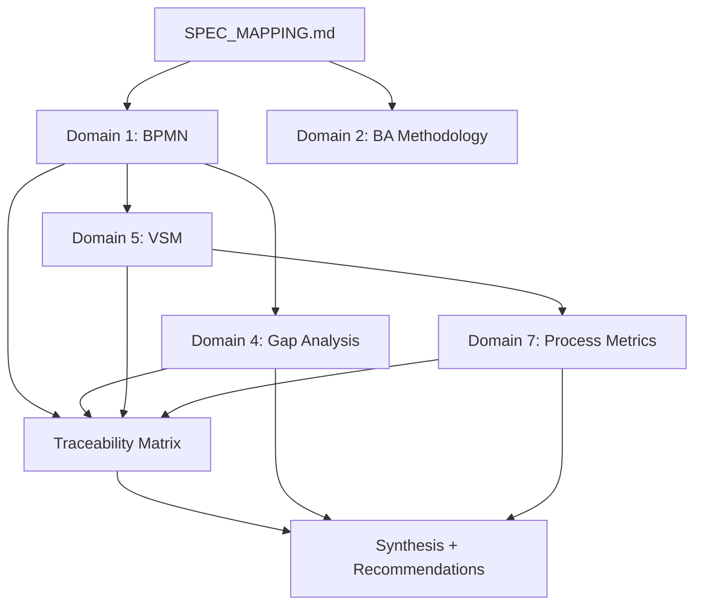

# BA Orchestration Reference - DCNET Modules

> Framework dieu phoi ky thuat BA theo BABOK v3, ap dung cho DCNET Flow modules.
> Xac dinh KY THUAT NAO can dung cho LOAI MODULE nao.

---

## 1. Available Techniques (7 Domains)

| # | Domain | Reference File | Khi nao dung |
|---|--------|---------------|--------------|
| 1 | BPMN Process Modeling | [bpmn-notation.md](bpmn-notation.md) | Moi module (bat buoc) |
| 2 | BA Methodology | [ba-methodology.md](ba-methodology.md) | Moi module (bat buoc) |
| 3 | Mermaid Rendering | [mermaid-bpmn-patterns.md](mermaid-bpmn-patterns.md) | Moi module (bat buoc) |
| 4 | Gap Analysis | [gap-analysis.md](gap-analysis.md) | Module co EXT/NEW tags |
| 5 | Value Stream Mapping | [value-stream-mapping.md](value-stream-mapping.md) | Module 3+ steps hoac cross-department |
| 6 | BA Orchestration | [ba-orchestration.md](ba-orchestration.md) | Meta-framework (this file) |
| 7 | Process Metrics | [process-metrics.md](process-metrics.md) | Module co performance requirements |

**Domains 1-3:** Bat buoc cho moi module — tao BPMN diagrams, ap dung BA methodology, render Mermaid.
**Domains 4-7:** Tuy theo do phuc tap — chi ap dung khi can thiet.

---

## 2. Module Complexity Classification

### Classification Matrix

| Complexity | Criteria | Processes | Techniques | Example modules |
|-----------|----------|-----------|------------|-----------------|
| **Simple** | All USE/CFG, 1-2 DocTypes, single role | 1-2 | Domains 1-3 only | Chi nhanh (10), Nhan vien (11) |
| **Medium** | Some EXT, 3-5 DocTypes, 2-3 roles | 3-5 | Domains 1-5 | Don hang (08), Khach hang (12) |
| **Complex** | Many EXT/NEW, 5+ DocTypes, 4+ roles, cross-module | 5-10 | ALL domains (1-7) | Kho hang (07), Ban hang (09), Ke toan (22-30) |
| **Special** | Unique business logic, no ERPNext standard | 3-7 | Domains 1-6 + custom analysis | Trade-in (14), Fitting (34), Coaching (35) |

### How to classify

Dem tags tu SPEC_MAPPING.md:

```
Simple:   USE >= 80%, EXT = 0, NEW = 0
Medium:   EXT > 0, NEW <= 2, DocTypes <= 5
Complex:  EXT + NEW >= 5, DocTypes > 5, hoac cross-module dependencies
Special:  NEW > EXT, hoac khong co ERPNext standard tuong duong
```

---

## 3. Standard Workflows for DCNET

### Workflow A: Simple Module (Quick Analysis)

```
1. Read SPEC_MAPPING → identify features + tags
2. BPMN: 1-2 To-Be process diagrams
3. Requirements Traceability matrix
4. Skip Gap Analysis (all USE/CFG)
5. Skip VSM (too simple)
→ Output: ~3-5 pages BA_ANALYSIS.md
```

**Thoi gian uoc tinh:** 1-2 gio
**Ap dung cho:** Module co <= 10 features, 1 role chinh, khong co EXT/NEW

### Workflow B: Medium Module (Standard Analysis)

```
1. Read SPEC_MAPPING → identify features + tags
2. BPMN: 3-5 To-Be process diagrams (with As-Is if available)
3. Gap Analysis: EXT/NEW features only
4. VSM: Main value stream with current/future metrics
5. Requirements Traceability matrix
6. RACI Matrix
→ Output: ~8-12 pages BA_ANALYSIS.md
```

**Thoi gian uoc tinh:** 3-5 gio
**Ap dung cho:** Module co 10-25 features, 2-3 roles, co EXT nhung it NEW

### Workflow C: Complex Module (Full Analysis)

```
1. Read SPEC_MAPPING + CUSTOM_REQUIREMENTS
2. BPMN: All processes with As-Is + To-Be + comparison
3. Gap Analysis: Full inventory with resolution options
4. VSM: All value streams with bottleneck analysis
5. Process Metrics: KPIs and targets
6. Stakeholder Analysis + RACI
7. Requirements Traceability (100% coverage)
8. Risk Assessment
→ Output: ~15-25 pages BA_ANALYSIS.md
```

**Thoi gian uoc tinh:** 5-10 gio
**Ap dung cho:** Module co 25+ features, 4+ roles, nhieu EXT/NEW, cross-module

### Workflow D: Special Module (Custom Analysis)

```
1. Read SPEC_MAPPING + CUSTOM_REQUIREMENTS + ERPNext flows
2. Research: How other ERP systems handle this
3. BPMN: Custom process design (no ERPNext standard to compare)
4. Gap Analysis: Focus on NEW capabilities
5. Technical Options: Multiple implementation approaches
6. VSM: If applicable (has value stream)
7. Process Metrics + Acceptance criteria
→ Output: ~10-20 pages BA_ANALYSIS.md
```

**Thoi gian uoc tinh:** 5-8 gio
**Ap dung cho:** Trade-in, Fitting, Coaching, Membership — business logic dac thu

---

## 4. Technique Selection Decision Tree

```
START: Read SPEC_MAPPING tags
├── All USE? → Workflow A (Simple)
├── Mix USE/CFG? → Workflow A (Simple)
├── Has EXT but no NEW? → Workflow B (Medium)
├── Has NEW? → Check complexity
│   ├── < 5 features NEW/EXT → Workflow B (Medium)
│   └── >= 5 features NEW/EXT → Workflow C (Complex)
└── Special module (Trade-in, Fitting, etc.)? → Workflow D (Special)
```

### Additional triggers — upgrade len workflow cao hon:

| Trigger | Action |
|---------|--------|
| Cross-module dependencies (nhieu REF tags) | +1 level (VD: A → B) |
| Accounting/financial module (STT 22-30) | Luon Workflow C |
| Data migration tu BRAVO | Them Gap Analysis |
| Performance-critical (response time, throughput) | Them Process Metrics |
| 4+ roles involved | +1 level |
| Customer chua confirm requirements | Them CLARIFY items, giu nguyen level |

---

## 5. Orchestration Process

### Step 1: Classify Module

1. Read `SPEC_MAPPING.md`
2. Dem tags: USE, CFG, EXT, NEW, REF
3. Dem DocTypes involved
4. Dem roles/actors
5. Check cross-module dependencies
6. Xac dinh complexity level
7. Select workflow (A/B/C/D)
8. **Present to user:**
   ```
   Module {STT} - {Ten module}:
   - Tags: USE={N}, CFG={N}, EXT={N}, NEW={N}, REF={N}
   - DocTypes: {N}
   - Roles: {list}
   - Complexity: {Simple/Medium/Complex/Special}
   - Workflow: {A/B/C/D}
   Dong y? Hoac muon dieu chinh?
   ```

### Step 2: Sequence Techniques

Based on selected workflow, xac dinh thu tu:

| Order | Technique | Depends on | Output |
|-------|-----------|------------|--------|
| 1 | BPMN Process Modeling | SPEC_MAPPING | Process diagrams |
| 2 | Gap Analysis | BPMN (process context) | Gap inventory |
| 3 | Value Stream Mapping | BPMN (process steps) | VSM with metrics |
| 4 | Process Metrics | VSM (lead time data) | KPIs and targets |
| 5 | Requirements Traceability | All above | Full traceability matrix |

**Rules:**
- BPMN luon lam dau tien (foundation cho moi thu khac)
- Gap Analysis can BPMN results de co process context
- VSM can BPMN results de biet process steps can do
- Metrics can VSM results de co lead time data
- Traceability lam cuoi cung (can tat ca ket qua phia tren)

### Step 3: Execute Each Technique

For each technique in sequence:

1. **Load** reference file tuong ung
2. **Gather** inputs tu SPEC_MAPPING + previous technique outputs
3. **Generate** output theo format trong reference
4. **Present** section to user: "Day la phan {X}. Review va confirm?"
5. **Incorporate** feedback neu co
6. **Move** to next technique

> **Key principle:** 1 section at a time, confirm each before moving on.
> Khong generate toan bo roi moi hoi — incremental approach.

### Step 4: Synthesize

Sau khi tat ca techniques hoan thanh:

1. **Cross-reference** findings across all techniques
2. **Identify conflicts** — VD: Gap Analysis noi can custom nhung VSM cho thay volume thap
3. **Identify overlaps** — VD: 2 processes co chung steps → co the merge
4. **Unified recommendations** — Tong hop tu tat ca techniques
5. **Priority matrix** — Impact x Effort cho moi recommendation

```
                High Impact
        ┌───────────────────────┐
        │  Quick Wins    │  Major │
        │  (do first)    │  Projects │
Low     │────────────────│────────│  High
Effort  │  Fill-ins      │  Thankless│
        │  (if time)     │  (avoid)  │
        └───────────────────────┘
                Low Impact
```

---

## 6. Parallel vs Sequential Analysis

### Parallel (co the chay dong thoi):

- BPMN diagrams cho **cac processes khac nhau** trong cung module
- Gap analysis cho **cac features doc lap**
- Stakeholder analysis + RACI (doc lap voi BPMN)

### Sequential (phai cho ket qua truoc):

| Step | Phai cho | Ly do |
|------|----------|-------|
| Gap Analysis | BPMN | Can process context de xac dinh gap |
| VSM | BPMN | Can process steps de do luong |
| Process Metrics | VSM | Can lead time data tu VSM |
| Traceability | All above | Can tat ca outputs de map |
| Risk Assessment | Gap + Metrics | Can biet gaps va performance targets |

### Dependency Diagram



---

## 7. Quality Checklist per Workflow

### Minimum Quality (tat ca workflows):

- [ ] Tat ca spec features xuat hien trong traceability matrix
- [ ] It nhat 1 To-Be BPMN diagram
- [ ] Gap summary voi tag counts (USE/CFG/EXT/NEW/REF)
- [ ] Process overview table (QT1, QT2...)
- [ ] Mermaid diagrams render dung (no syntax errors)

### Standard Quality (Workflow B+):

- [ ] RACI Matrix cho moi process
- [ ] Gap resolution options cho EXT/NEW features
- [ ] It nhat 1 VSM voi metrics (lead time, cycle time)
- [ ] As-Is vs To-Be comparison table
- [ ] Edge cases documented cho moi process
- [ ] Stakeholder register

### Comprehensive Quality (Workflow C):

- [ ] Tat ca processes co BPMN diagrams (As-Is + To-Be)
- [ ] Full gap inventory voi resolution options va estimated effort
- [ ] VSM cho moi major value stream
- [ ] Process metrics voi targets va measurement plan
- [ ] Stakeholder analysis (Power-Interest grid)
- [ ] Risk assessment voi mitigation strategies
- [ ] Cross-module dependency map
- [ ] 100% requirements traceability coverage

### Validation before output:

| Check | How |
|-------|-----|
| Feature coverage | Count features in traceability vs SPEC_MAPPING — must be equal |
| Mermaid syntax | All diagrams use ASCII IDs, quoted labels, balanced subgraphs |
| Consistency | Process names match between BPMN, VSM, Traceability |
| Vietnamese | Labels in Vietnamese, IDs in ASCII |
| Actionable | Moi recommendation co owner + timeline suggestion |

---

## 8. BA Orchestration for Accounting Modules (Special Case)

### Why accounting is special

Modules 22-30 (Ke toan) form **ONE integrated system** in ERPNext:

```
Module 22: Tien mat / Ngan hang     → Payment Entry
Module 23: Ke toan Mua hang         → Purchase Invoice → GL Entry
Module 24: Ke toan Ban hang         → Sales Invoice → GL Entry
Module 25: Cong no                  → Party balance (auto from 23+24)
Module 26: Hang ton kho (accounting)→ Stock Ledger → GL Entry (perpetual)
Module 27: Chi phi                  → Journal Entry
Module 28: Tai san co dinh          → Asset → Depreciation → GL Entry
Module 29: Thue                     → Tax templates → GL Entry
Module 30: Tong hop + Bao cao       → Trial Balance, P&L, BS
```

### Rules for accounting modules:

1. **CANNOT analyze individually** — submit 1 invoice = tao GL cho nhieu modules
2. **Must analyze as cluster** voi shared GL Entry flows
3. **Workflow C is MANDATORY** — luon dung full analysis
4. **Additional checks required:**
   - COA mapping (Chart of Accounts)
   - GL flow verification (No TK → Có TK)
   - TT200/TT99 compliance check
   - Multi-currency handling

### Recommended analysis order:

```
22 (Tien) → 23 (Mua) → 24 (Ban) → 25 (Cong no) → 26 (HTK) → 27 (Chi phi) → 28 (Tai san) → 29 (Thue) → 30 (Tong hop)
```

**Ly do thu tu nay:**
- 22: Foundation — Payment Entry dung cho tat ca
- 23-24: Core — Mua/Ban tao phan lon GL entries
- 25: Derived — Cong no = ket qua tu 23+24
- 26: Linked — HTK lien ket voi 23 (mua) va 24 (ban) qua perpetual inventory
- 27-28: Independent — Chi phi va Tai san tuong doi doc lap
- 29: Cross-cutting — Thue ap dung cho 23+24+27
- 30: Summary — Tong hop can tat ca phia tren

### Accounting-specific additions to BA_ANALYSIS:

```markdown
## X. GL Entry Flow Mapping

| Transaction | Debit Account | Credit Account | Trigger |
|-------------|--------------|----------------|---------|
| Ban hang | 131 (Phai thu) | 5111 (Doanh thu) | SI Submit |
| COGS | 632 (Gia von) | 1561 (Hang hoa) | SI Submit (perpetual) |
| Mua hang | 1561 (Hang hoa) | 331 (Phai tra) | PI Submit |
| Thu tien | 1111 (Tien mat) | 131 (Phai thu) | PE Submit |
| Chi tien | 331 (Phai tra) | 1111 (Tien mat) | PE Submit |

## Y. COA Compliance Check

| Account | TT200 Required | ERPNext Account | Status |
|---------|---------------|-----------------|--------|
| 111 | Tien mat | Cash - TLTM | OK |
| 131 | Phai thu KH | Debtors - TLTM | OK |
| ... | ... | ... | ... |
```

---

## 9. Cross-Module Dependency Handling

### When SPEC_MAPPING has many REF tags:

REF tags = feature thuoc module khac. Xu ly:

1. **Document dependency** — ghi ro module nao phu thuoc module nao
2. **Check target module status** — da co BA_ANALYSIS chua?
3. **If target done:** Reference ket qua, khong lap lai
4. **If target not done:** Ghi assumption, note "Can bo sung khi module {X} hoan thanh"

### Common dependency chains trong DCNET:

```
San pham (03) ← Kho (07) ← Mua hang (05) ← Ke toan Mua (23)
                         ← Ban hang (09) ← Ke toan Ban (24)
                         ← Don hang (08)

Khach hang (12) ← Ban hang (09) ← CSKH (37) ← Tich diem (38)

NCC (04) ← Mua hang (05) ← Nhap khau (06)

Lead (33) ← Fitting (34) ← Don hang (08) ← Ban hang (09)
```

### Cross-module process flows:

Khi 1 process span nhieu modules:

1. Ve BPMN voi swimlanes cho moi module
2. Ghi ro boundary: "Tu day thuoc module {X}"
3. Dung REF link thay vi lap lai chi tiet
4. Note trong Traceability: "Xem BA_ANALYSIS module {X} QT{N}"

---

## 10. Timeline Integration

### T3 Modules (31/03/2026 deadline):

| STT | Module | Expected Complexity | Workflow |
|-----|--------|-------------------|----------|
| 01 | Dang nhap | Simple | A |
| 02 | Dashboard | Simple | A |
| 03 | San pham | Medium | B |
| 04 | NCC | Medium | B |
| 05 | Mua hang | Complex | C |
| 06 | BC Phan tich | Medium | B |

### T4 Modules (30/04/2026 deadline):

| STT | Module | Expected Complexity | Workflow |
|-----|--------|-------------------|----------|
| 07 | Kho hang | Complex | C |
| 08 | Don hang | Medium | B |
| 09 | Ban hang | Complex | C |
| 10 | Chi nhanh | Simple | A |
| 11 | Nhan vien | Simple | A |
| 12 | Khach hang | Medium | B |
| 14 | Trade-in | Special | D |

### T5 Modules (30/05/2026 deadline):

| STT | Module | Expected Complexity | Workflow |
|-----|--------|-------------------|----------|
| 22-30 | Ke toan (9 sub-modules) | Complex (cluster) | C (all) |

### T6 Modules (30/06/2026 deadline):

| STT | Module | Expected Complexity | Workflow |
|-----|--------|-------------------|----------|
| 33 | Lead | Medium | B |
| 34 | Fitting | Special | D |
| 35 | Coaching | Special | D |
| 37 | CSKH | Medium | B |
| 38 | Tich diem | Special | D |

### T8 Modules (bo sung):

| STT | Module | Expected Complexity | Workflow |
|-----|--------|-------------------|----------|
| 39 | Membership | Special | D |
| 40 | Du bao DT | Medium | B |
| 41 | Workshop | Medium | B |

> **Luu y:** Complexity la du doan — se confirm sau khi doc SPEC_MAPPING thuc te.
> Mot so module chua co SPEC_MAPPING → chua the classify chinh xac.

---

## 11. Output Sizing Guidelines

### BA_ANALYSIS.md expected size by workflow:

| Workflow | Pages | Diagrams | Tables | Time to review |
|----------|-------|----------|--------|----------------|
| A (Simple) | 3-5 | 1-2 | 3-4 | 15-30 min |
| B (Medium) | 8-12 | 3-5 | 6-10 | 30-60 min |
| C (Complex) | 15-25 | 6-10 | 10-15 | 1-2 gio |
| D (Special) | 10-20 | 4-8 | 8-12 | 45-90 min |

### When output is too large:

- Tach thanh multiple files trong `analysis/` directory
- VD: `BA_ANALYSIS.md` (overview) + `BA_BPMN.md` (diagrams) + `BA_GAP.md` (gap details)
- Keep traceability matrix in main file

### When output is too small:

- Check: co thieu process nao khong?
- Check: co bo qua edge cases khong?
- Simple module voi 3 pages la binh thuong — khong can pad

---

## 12. Continuous Improvement

### After each module analysis:

1. **Review** — Ket qua co dung voi thuc te khong?
2. **Calibrate** — Classification co chinh xac khong? Can dieu chinh criteria?
3. **Learn** — Patterns moi phat hien → update reference files
4. **Share** — Findings co ich cho modules khac → note cross-references

### Feedback loop:

```
Classify → Select Workflow → Execute → Review → Calibrate
    ^                                              |
    └──────────────────────────────────────────────┘
```

### Metrics to track:

| Metric | Target | How to measure |
|--------|--------|----------------|
| Classification accuracy | > 80% | Module khong can re-classify sau khi bat dau |
| Feature coverage | 100% | All spec features in traceability |
| Review cycles | <= 2 | User confirm trong 1-2 lan review |
| Cross-module consistency | High | Process names, role names consistent across modules |
