# Mermaid BPMN Rendering Patterns

> Cách vẽ BPMN bằng Mermaid syntax cho BA_ANALYSIS.md
> Mermaid không hỗ trợ native BPMN — dùng flowchart + subgraph mô phỏng.

---

## 1. Swimlane Pattern (Core)

Dùng `flowchart LR` (left-to-right) + `subgraph` cho swimlanes:

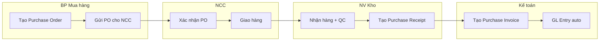

**Rules:**
- `flowchart LR` cho luồng trái → phải (swimlane ngang)
- `flowchart TB` cho luồng trên → dưới (swimlane dọc)
- Mỗi `subgraph` = 1 lane/role
- Quote tên subgraph: `subgraph "Tên Role"`
- Quote node labels có ký tự đặc biệt: `A["Label có dấu"]`

---

## 2. Gateway Patterns

### Exclusive Gateway (XOR) — Chỉ 1 đường

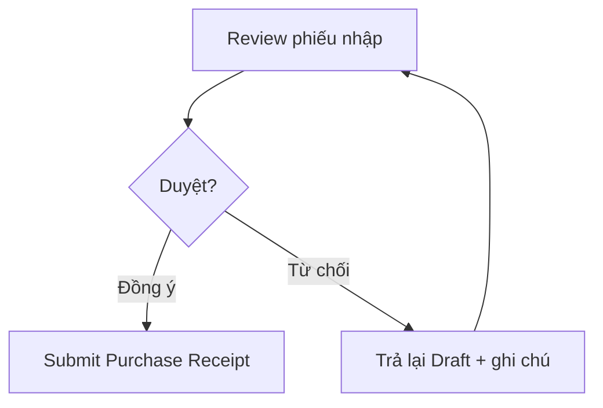

### Parallel Gateway (AND) — Tất cả cùng lúc

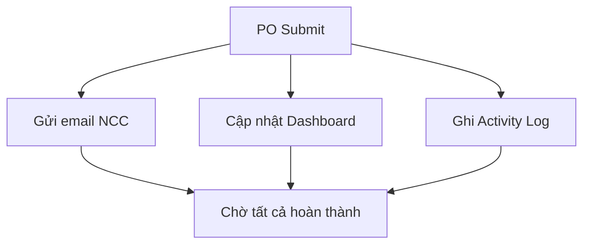

### Inclusive Gateway (OR) — 1 hoặc nhiều

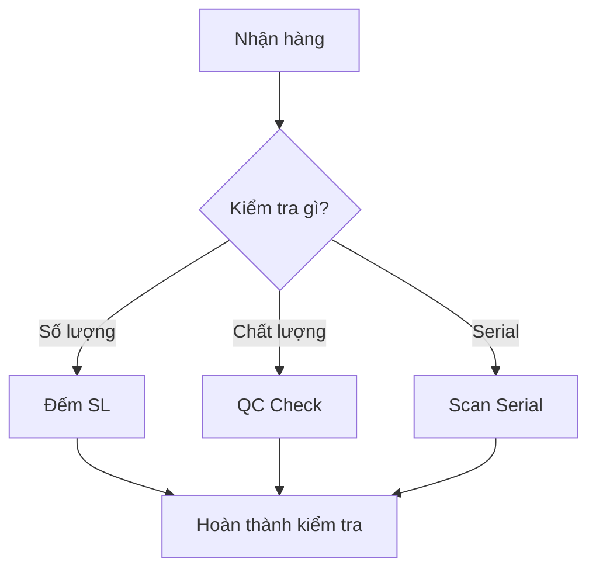

> **Lưu ý:** Mermaid không phân biệt XOR/AND/OR visually.
> Dùng label và ghi chú để phân biệt:
> - XOR: chỉ 1 edge có điều kiện true
> - AND: ghi "(song song)"
> - OR: ghi "(1 hoặc nhiều)"

---

## 3. Start/End Events

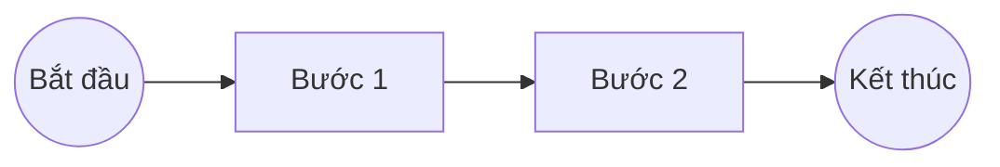

**Shapes:**
- Start/End: `(("Label"))` — hình tròn kép
- Task: `["Label"]` — hình chữ nhật
- Decision: `{"Label?"}` — hình thoi
- Sub-process: `[["Label"]]` — hình chữ nhật kép

---

## 4. Exception Handling Pattern

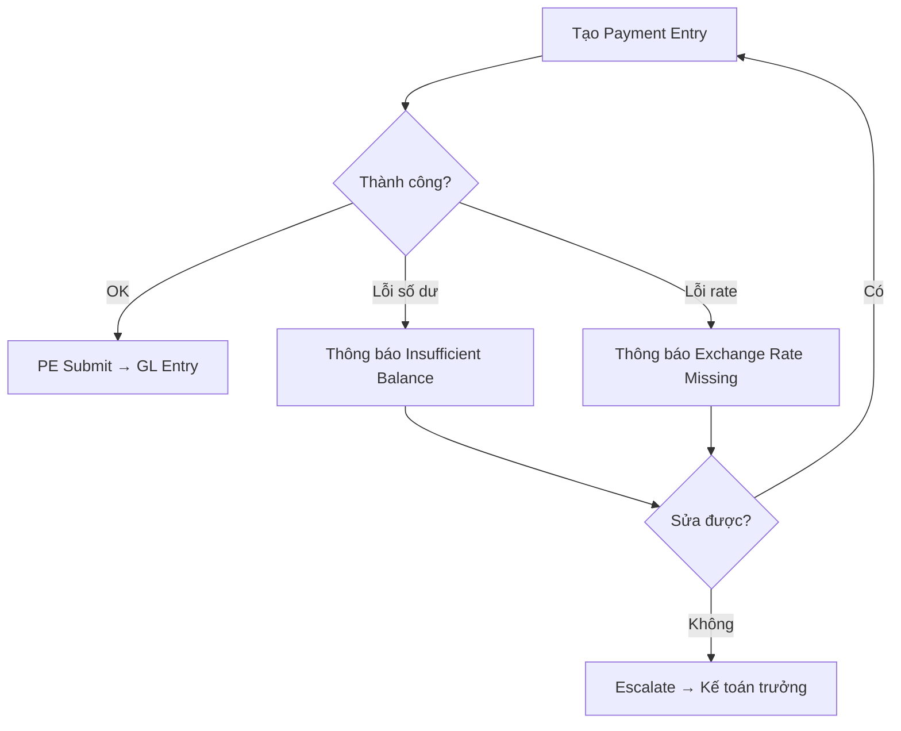

---

## 5. Approval Workflow Pattern (ERPNext)

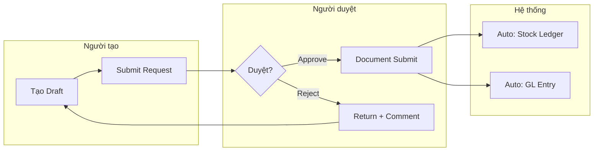

---

## 6. Multi-step Process with Partial Receipt

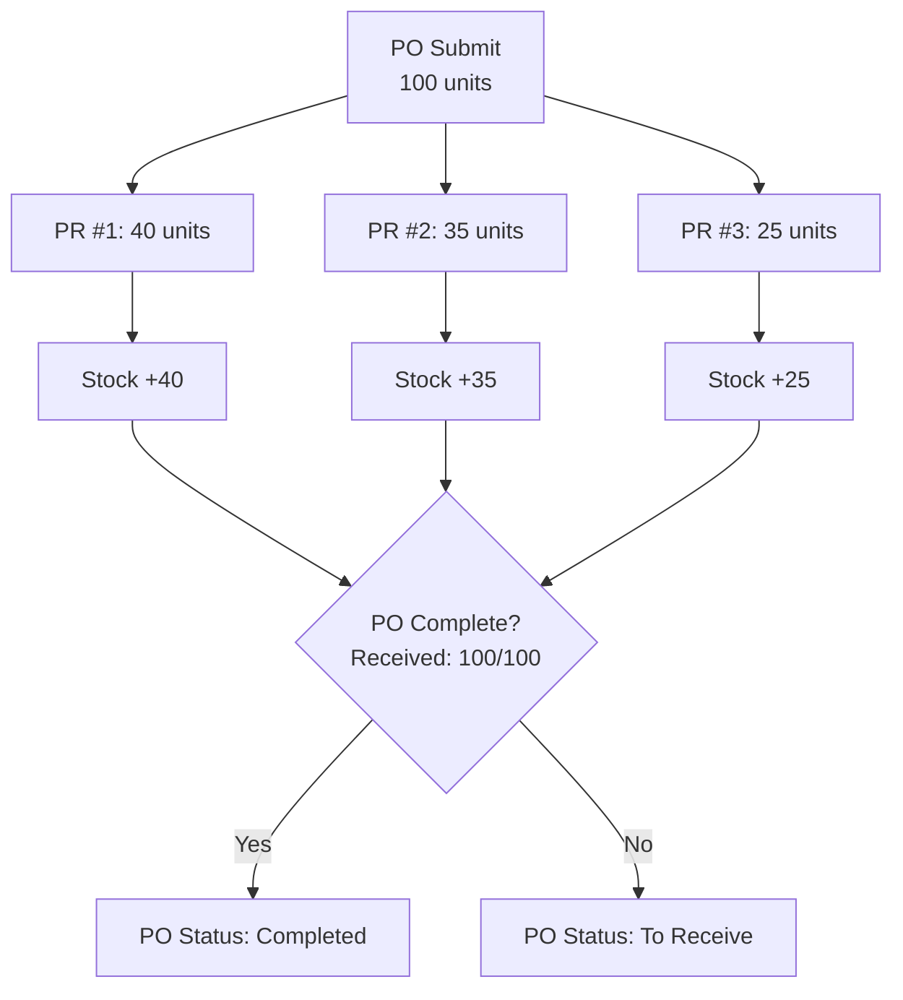

---

## 7. End-to-End Process (Full Module)

Pattern cho vẽ toàn bộ quy trình module:

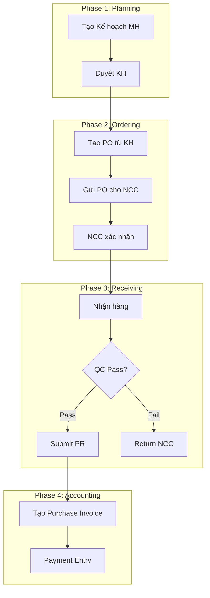

---

## 8. Process Status Colors (Optional)

Dùng `style` để tô màu theo loại:

```
%% Automated step (Green)
style F fill:#e8f5e9,stroke:#4caf50

%% Manual step (Orange)
style B fill:#fff3e0,stroke:#ff9800

%% Exception/Error (Red)
style D fill:#fce4ec,stroke:#f44336

%% Decision point (Yellow)
style C fill:#fff9c4,stroke:#f9a825

%% External party (Blue)
style E fill:#e3f2fd,stroke:#1976d2
```

**Color convention cho DCNET:**

| Loại | Fill | Stroke | Dùng cho |
|------|------|--------|----------|
| Auto (hệ thống) | `#e8f5e9` | `#4caf50` | Service task, auto GL, auto stock |
| Manual (người) | `#fff3e0` | `#ff9800` | User task, form fill |
| Error/Exception | `#fce4ec` | `#f44336` | Lỗi, reject, return |
| Decision | `#fff9c4` | `#f9a825` | Gateway, approval |
| External | `#e3f2fd` | `#1976d2` | NCC, khách hàng, bên ngoài |
| Milestone | `#f3e5f5` | `#7b1fa2` | Phase end, checkpoint |

---

## 9. Sequence Diagram (cho API/Integration flows)

Khi cần mô tả interaction giữa các hệ thống:

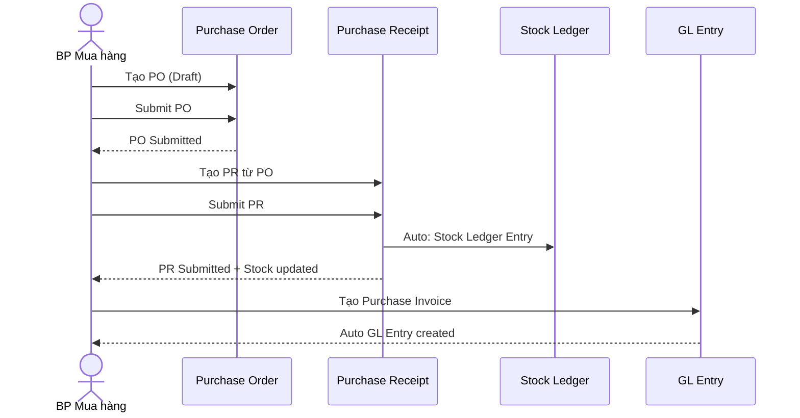

---

## 10. State Diagram (cho DocType lifecycle)

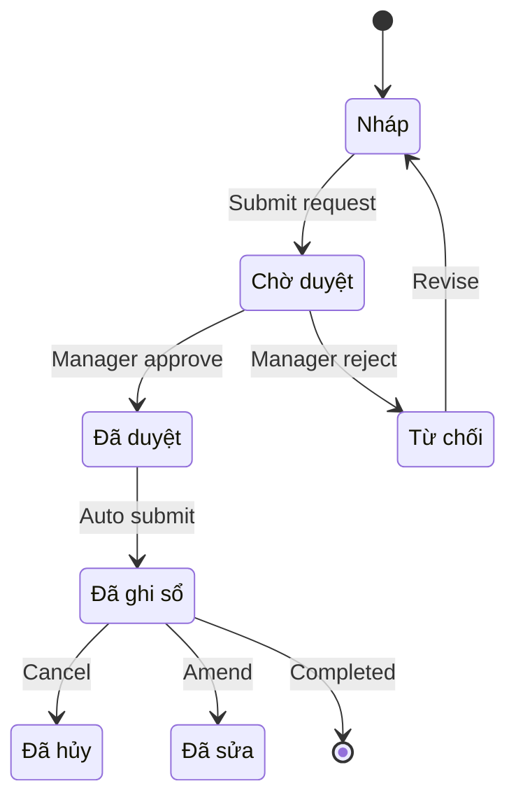

> **IMPORTANT:** State IDs phải là ASCII (không dùng tiếng Việt trong ID).
> Dùng label bên dưới để hiển thị tiếng Việt.

---

## 11. Mermaid Syntax Quick Reference

| Element | Syntax | Example |
|---------|--------|---------|
| Rectangle | `A["Label"]` | `A["Tạo PO"]` |
| Rounded rect | `A("Label")` | `A("Start")` |
| Circle | `A(("Label"))` | `A(("End"))` |
| Diamond | `A{"Label?"}` | `A{"Duyệt?"}` |
| Double rect | `A[["Label"]]` | `A[["Sub-process"]]` |
| Arrow | `-->` | `A --> B` |
| Arrow + label | `-->\|"label"\|` | `A -->\|"Yes"\| B` |
| Dotted arrow | `-.->` | `A -.-> B` |
| Thick arrow | `==>` | `A ==> B` |
| Subgraph | `subgraph "Name"` | `subgraph "Kho"` |

---

## 12. Common Mistakes & Fixes

| Mistake | Fix |
|---------|-----|
| Vietnamese in state IDs | Dùng ASCII IDs + label definitions |
| Unquoted special chars | Quote: `A["text: value"]` |
| Missing subgraph `end` | Mỗi `subgraph` phải có `end` |
| Crossing connections | Rearrange nodes, dùng hidden nodes |
| Too many nodes (>25) | Tách thành multiple diagrams |
| Label quá dài | Max ~40 chars, dùng `<br/>` xuống dòng |
| Duplicate node IDs | Mỗi node ID unique trong 1 diagram |

---

## 13. Reuse Rules from dcnet-module

Follow [mermaid-validation.md](../../dcnet-module/references/mermaid-validation.md):
1. State diagrams: ASCII IDs only
2. Flowcharts: Quote special characters
3. ERD: No Unicode in descriptions
4. Line endings: Unix (LF)
5. Code fences: Must be balanced
