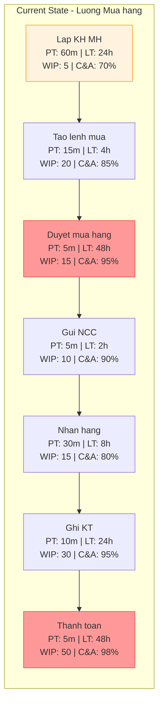
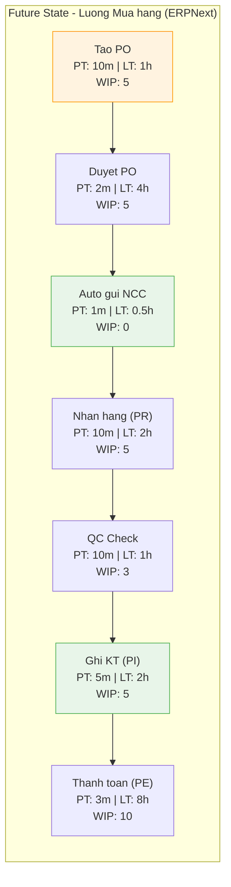
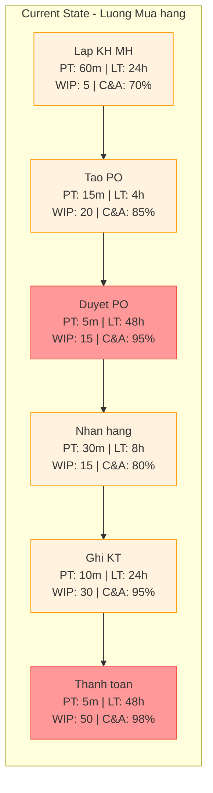
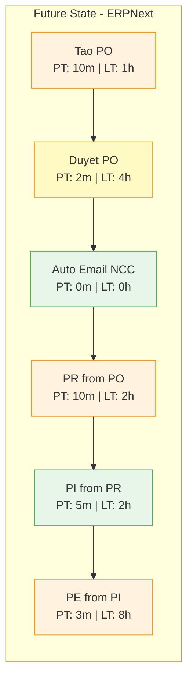
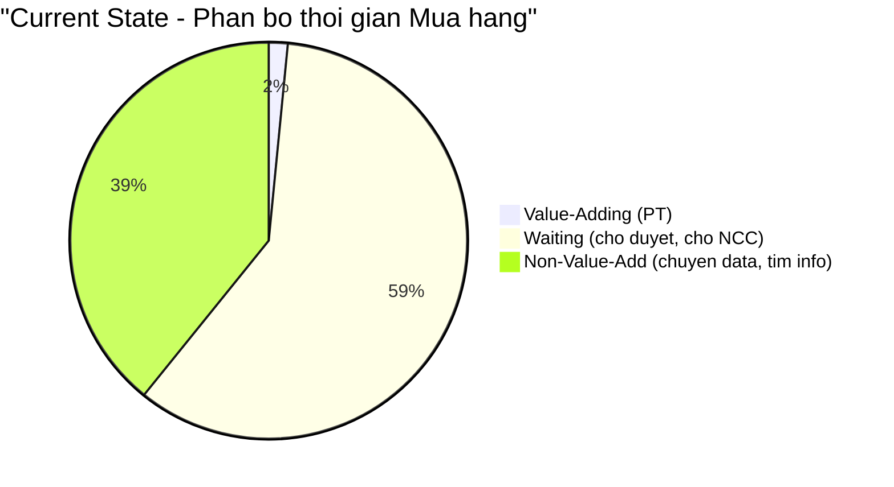
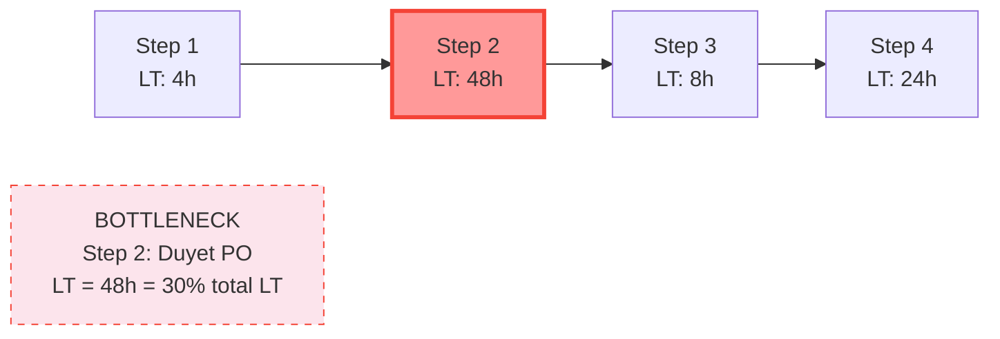

# Value Stream Mapping Reference - ERPNext Processes

> Lean Value Stream Mapping ap dung cho quy trinh nghiep vu ERPNext.
> Phan tich luong gia tri, phat hien lang phi, toi uu hoa.

---

## 1. Value Stream Mapping (VSM) cho ERPNext

### Khai niem

- **Value Stream** = chuoi hoat dong tu yeu cau -> giao gia tri cho khach hang
- **Muc tieu:** toi da hoa gia tri, toi thieu hoa lang phi
- **VSM trong ERPNext:** phan tich luong DocType tu trigger -> ket qua cuoi cung

```
Value Stream = [Trigger] → [Step 1] → [Step 2] → ... → [Gia tri cho khach hang]

VD: Mua hang:
  [Can hang] → [PO] → [PR] → [PI] → [PE] → [Hang trong kho, so sach dung]

VD: Ban hang:
  [KH dat hang] → [SO] → [DN] → [SI] → [PE] → [KH nhan hang, thu tien]
```

**Key principles:**
- Chi co 2 loai hoat dong: **Value-Adding** (khach hang san sang tra tien) va **Non-Value-Adding** (lang phi)
- Trong ERPNext: Value-Adding = submit DocType tao gia tri (PR -> co hang, SI -> ghi doanh thu)
- Non-Value-Adding = cho duyet, nhap lai data, copy paste, tim kiem thong tin

### 8 Loai Lang Phi (TIMWOODS) trong ERPNext

| # | Waste | Mo ta | Vi du ERPNext | Cach khac phuc |
|---|-------|-------|---------------|----------------|
| T | **Transportation** | Chuyen data giua he thong | Copy paste BRAVO -> Excel -> ERPNext | Nhap truc tiep, API import, Data Import Tool |
| I | **Inventory** | Cong viec do dang (WIP) | PO draft chua submit, hang chua nhap kho, PI cho doi | WIP limits, workflow approval SLA, dashboard tracking |
| M | **Motion** | Chuyen doi context | Mo nhieu tab, tim kiem thong tin, chuyen man hinh | Dashboard tap trung, linked documents, shortcut |
| W | **Waiting** | Cho doi | Cho duyet PO, cho NCC giao hang, cho ke toan ghi so | Workflow notification, auto-reminders, mobile approve |
| O | **Overproduction** | Lam thua | Tao qua nhieu report khong ai doc, PO thua hang | Chi build reports co trong spec, MRP planning |
| O | **Overprocessing** | Xu ly thua | Nhap cung data 2 lan (PO + PI rieng), doi chieu thu cong | PI from PO (1 click), auto-populate, auto reconcile |
| D | **Defects** | Loi can sua | Sai gia, sai so luong, sai TK ke toan, sai warehouse | Validation rules, auto-calculate, mandatory fields |
| S | **Skills** | Lang phi tai nang | Ke toan nhap data thay vi phan tich, kho dem tay | Auto GL entry, Script Report, barcode scan |

**DCNET-specific wastes (tu BRAVO -> ERPNext):**

| Hien tai (BRAVO) | Lang phi | Sau ERPNext |
|-------------------|---------|-------------|
| Nhap lieu tren BRAVO + ghi so Excel | Transportation, Overprocessing | Single source of truth |
| Gui giay de duyet, cho ky | Waiting, Motion | Workflow + mobile approval |
| Doi chieu cong no cuoi thang bang Excel | Overprocessing, Defects | Real-time Accounts Receivable/Payable |
| Kiem ke kho bang giay | Motion, Defects | Stock Reconciliation + barcode |
| Bao cao thang tu aggregate Excel | Overprocessing, Skills | Dashboard + Script Report auto |

---

## 2. ERPNext Value Stream Templates

### 2.1 Luong Mua hang (Procurement Value Stream)

#### Current State Map (AS-IS voi BRAVO)

| Step | Actor | Tool/DocType | PT (phut) | LT (gio) | %C&A | WIP | Lang phi chinh |
|------|-------|-------------|-----------|-----------|------|-----|----------------|
| Lap KH mua | TP Mua hang | Excel | 60 | 24 | 70% | 5 | Overprocessing, Defects |
| Tao lenh mua | NV Mua hang | BRAVO | 15 | 4 | 85% | 20 | Waiting (cho duyet) |
| Duyet mua hang | BLD | Giay/Email | 5 | 48 | 95% | 15 | Waiting (BLD ban) |
| Gui NCC | NV Mua hang | Email/Zalo | 5 | 2 | 90% | 10 | Transportation |
| Nhan hang | NV Kho | Giay + BRAVO | 30 | 8 | 80% | 15 | Motion, Defects |
| Kiem tra CL | NV Kho | Thu cong | 20 | 4 | 90% | 10 | Waiting, Motion |
| Ghi nhan KT | Ke toan | BRAVO | 10 | 24 | 95% | 30 | Waiting, Inventory |
| Thanh toan | Ke toan | BRAVO + NH | 5 | 48 | 98% | 50 | Waiting |

```
Current State Metrics:
  Total PT  = 150 phut (2.5h)
  Total LT  = 162 gio (6.75 ngay)
  Flow Efficiency = 2.5h / 162h = 1.5%
  Avg %C&A = 87%
```

#### Future State Map (TO-BE voi ERPNext)

| Step | Actor | DocType | PT (phut) | LT (gio) | %C&A | WIP | Cai tien |
|------|-------|---------|-----------|-----------|------|-----|----------|
| Tao Purchase Order | NV Mua hang | Purchase Order | 10 | 1 | 95% | 5 | Auto-populate from Material Request |
| Duyet PO | TP/BLD | Workflow Approval | 2 | 4 | 99% | 5 | Mobile notification, 1-click approve |
| Gui NCC | He thong | Email from PO | 1 | 0.5 | 99% | 0 | Auto email on approve |
| Nhan hang | NV Kho | Purchase Receipt | 10 | 2 | 95% | 5 | PR from PO, barcode scan |
| QC Check | NV Kho | Quality Inspection | 10 | 1 | 95% | 3 | Linked to PR, criteria template |
| Ghi nhan KT | Ke toan | Purchase Invoice | 5 | 2 | 98% | 5 | PI from PR (1 click), auto GL |
| Thanh toan | Ke toan | Payment Entry | 3 | 8 | 99% | 10 | PE from PI, bank reconciliation |

```
Future State Metrics:
  Total PT  = 41 phut (0.68h)
  Total LT  = 18.5 gio (0.77 ngay)
  Flow Efficiency = 0.68h / 18.5h = 3.7%
  Avg %C&A = 97%

Improvement:
  PT: 150 -> 41 phut (-73%)
  LT: 162 -> 18.5 gio (-89%)
  Flow Efficiency: 1.5% -> 3.7% (2.5x)
  %C&A: 87% -> 97% (+10%)
```

#### Current State VSM Diagram



#### Future State VSM Diagram



> **Ghi chu mau:**
> - Orange (#fff3e0): Manual step (nguoi thao tac)
> - Green (#e8f5e9): Auto step (he thong tu dong)
> - Red (#ff9999): Bottleneck (cho doi lau nhat)

---

### 2.2 Luong Ban hang (Sales Value Stream)

#### Current State Map

| Step | Actor | Tool/DocType | PT (phut) | LT (gio) | %C&A | WIP | Lang phi chinh |
|------|-------|-------------|-----------|-----------|------|-----|----------------|
| Tiep KH / nhan lead | Sale | Dien thoai/Zalo | 10 | 2 | 80% | 30 | Motion (tim thong tin KH) |
| Bao gia | Sale | Excel/Word | 20 | 8 | 75% | 20 | Defects (sai gia), Overprocessing |
| Xac nhan don | Sale | Email/Zalo | 5 | 24 | 90% | 15 | Waiting (KH confirm) |
| Lap phieu xuat | NV Kho | BRAVO | 10 | 4 | 85% | 10 | Motion, Defects |
| Giao hang | NV Giao hang | Giay | 30 | 24 | 90% | 10 | Transportation |
| Xuat hoa don | Ke toan | BRAVO | 10 | 8 | 95% | 20 | Waiting, Inventory |
| Thu tien | Ke toan | BRAVO + NH | 5 | 48 | 98% | 40 | Waiting |

#### Future State Map

| Step | Actor | DocType | PT (phut) | LT (gio) | %C&A | WIP | Cai tien |
|------|-------|---------|-----------|-----------|------|-----|----------|
| Tao Lead/Quotation | Sale | Lead, Quotation | 10 | 1 | 95% | 10 | CRM tracking, Pricing Rule |
| Tao Sales Order | Sale | Sales Order | 5 | 1 | 98% | 5 | SO from Quotation, auto pricing |
| Xuat kho | NV Kho | Delivery Note | 10 | 2 | 95% | 5 | DN from SO, barcode pick |
| Xuat hoa don | Ke toan | Sales Invoice | 5 | 1 | 98% | 5 | SI from DN, auto GL |
| Thu tien | Ke toan | Payment Entry | 3 | 8 | 99% | 10 | PE from SI, bank reconcile |

```
Improvement:
  PT: 90 -> 33 phut (-63%)
  LT: 118 -> 13 gio (-89%)
  %C&A: 87% -> 97%
```

---

### 2.3 Luong Kho (Inventory Value Stream)

#### Nhap kho tu Mua hang

| Step | Actor | DocType | PT (phut) | LT (gio) | %C&A | Cai tien |
|------|-------|---------|-----------|-----------|------|----------|
| Nhan hang vat ly | NV Kho | - | 20 | 1 | 90% | Barcode scan verify |
| Tao Purchase Receipt | NV Kho | Purchase Receipt | 10 | 0.5 | 95% | PR from PO (auto-fill) |
| QC Check | NV Kho | Quality Inspection | 15 | 1 | 95% | Template criteria |
| Submit PR | NV Kho / TP Kho | Purchase Receipt | 2 | 2 | 99% | Workflow approval |
| Stock Ledger update | He thong | Stock Ledger Entry | 0 | 0 | 100% | Auto on PR submit |

#### Xuat kho Ban hang

| Step | Actor | DocType | PT (phut) | LT (gio) | %C&A | Cai tien |
|------|-------|---------|-----------|-----------|------|----------|
| Pick items | NV Kho | Pick List | 15 | 1 | 90% | Pick List from SO |
| Pack | NV Kho | Packing Slip | 10 | 0.5 | 95% | Linked to DN |
| Tao Delivery Note | NV Kho | Delivery Note | 5 | 0.5 | 98% | DN from SO |
| Submit DN | TP Kho | Delivery Note | 2 | 1 | 99% | Workflow |
| Stock Ledger update | He thong | Stock Ledger Entry | 0 | 0 | 100% | Auto on DN submit |

#### Dieu chuyen kho

| Step | Actor | DocType | PT (phut) | LT (gio) | %C&A | Cai tien |
|------|-------|---------|-----------|-----------|------|----------|
| Yeu cau chuyen kho | NV Kho (nguon) | Material Request | 5 | 1 | 95% | Form request |
| Duyet chuyen kho | TP Kho | Workflow | 2 | 4 | 99% | Mobile approve |
| Xuat kho nguon | NV Kho (nguon) | Stock Entry (Transfer) | 10 | 1 | 95% | SE from MR |
| Nhan kho dich | NV Kho (dich) | Stock Entry | 10 | 2 | 95% | Confirm receipt |
| Stock Ledger update | He thong | Stock Ledger Entry | 0 | 0 | 100% | Auto (both WH) |

---

## 3. VSM Metrics cho DCNET

### Key Metrics

| Metric | Ky hieu | Dinh nghia | Cach tinh |
|--------|---------|------------|-----------|
| **Process Time** | PT | Thoi gian thuc su lam viec (tay hoac may) | Dem thoi gian thao tac |
| **Lead Time** | LT | Tong thoi gian tu dau -> cuoi (bao gom cho) | Timestamp end - timestamp start |
| **Flow Efficiency** | FE | Ty le thoi gian tao gia tri | PT / LT x 100% |
| **%C&A** | C&A | % xong dung ngay lan dau (Complete & Accurate) | Items dung / Total items x 100% |
| **WIP** | WIP | So luong items dang xu ly | Count documents in Draft/Pending |
| **Takt Time** | TT | Nhip do yeu cau cua khach hang | Available time / Customer demand |
| **Cycle Time** | CT | Thoi gian hoan thanh 1 don vi | Thoi gian trung binh / item |

### Flow Efficiency Interpretation

```
Flow Efficiency:
  < 5%   = Typical (most processes, BRAVO current state)
  5-15%  = Good (well-configured ERPNext)
  15-25% = Excellent (optimized ERPNext + automation)
  > 25%  = World-class (full automation, rare)
```

### Benchmark Targets cho DCNET

| Metric | Truoc (BRAVO) | Muc tieu (ERPNext) | Cai thien |
|--------|---------------|--------------------|-----------|
| Flow Efficiency (Mua) | 1-2% | 3-5% | 2-3x |
| Flow Efficiency (Ban) | 2-3% | 5-10% | 2-3x |
| Lead Time (Mua hang) | 5-10 ngay | 1-3 ngay | 50-70% |
| Lead Time (Ban hang) | 3-5 ngay | 0.5-1 ngay | 70-80% |
| %C&A (Nhap lieu) | 70-80% | 95%+ | Auto-validate |
| %C&A (Ke toan) | 90-95% | 99%+ | Auto GL Entry |
| WIP visibility | Khong tracking | Real-time dashboard | Full visibility |
| Kiem ke kho | 1 lan/thang (manual) | Real-time Stock Ledger | Continuous |
| Doi chieu cong no | Cuoi thang (Excel) | Real-time AR/AP report | On-demand |
| Bao cao tai chinh | 5-10 ngay sau ky | Real-time (auto GL) | Instant |

### Cach do luong trong ERPNext

| Metric | Cach lay tu ERPNext |
|--------|---------------------|
| PT | Custom field `custom_process_time` hoac estimate |
| LT | `modified` - `creation` (hoac workflow timestamp) |
| WIP | Count DocType where `docstatus=0` (Draft) |
| %C&A | Count amended docs / total docs |
| Cycle Time | Script Report: avg time per DocType per period |

---

## 4. Bottleneck Analysis

### Theory of Constraints (TOC) cho ERPNext

**5 Steps of TOC:**

1. **IDENTIFY** the bottleneck — buoc co queue dai nhat / lead time cao nhat
2. **EXPLOIT** — toi uu buoc do (VD: simplify form, reduce required fields)
3. **SUBORDINATE** — cac buoc khac phuc vu bottleneck (VD: chuẩn bi data truoc)
4. **ELEVATE** — them resource (VD: them nguoi duyet, parallel approval)
5. **REPEAT** — bottleneck chuyen sang buoc khac, lap lai

### Common Bottlenecks trong DCNET

| Bottleneck | Nguyen nhan | LT hien tai | Giai phap ERPNext | LT muc tieu |
|------------|-------------|-------------|--------------------| -------------|
| Duyet mua hang | BLD ban, email mat, giay to lung tung | 24-48h | Workflow + notification + mobile approve | 2-4h |
| Nhap kho cham | Dem thu cong + ghi giay + nhap BRAVO | 4-8h | Barcode scan + Purchase Receipt from PO | 1-2h |
| Doi chieu cong no | Cuoi thang batch tren Excel | 5-10 ngay | Real-time Accounts Receivable report | Instant |
| Bao cao cuoi thang | Manual aggregate tu nhieu nguon | 5-10 ngay | Dashboard + Script Report auto | Instant |
| Thanh toan NCC | Cho so lieu ke toan, doi ky | 48-72h | Payment Entry from PI, bank integration | 8-24h |
| Xuat hoa don | Cho thong tin tu ban hang + kho | 8-24h | Sales Invoice from Delivery Note | 1-2h |
| Trade-in dinh gia | Can chuyen gia danh gia | 24-48h | Trade-in workflow voi checklist, pricing guide | 4-8h |

### Bottleneck Identification trong VSM

```
Cach tim bottleneck tu VSM table:
1. Tim step co LT cao nhat → primary bottleneck
2. Tim step co WIP cao nhat → secondary bottleneck
3. Tim step co %C&A thap nhat → quality bottleneck
4. Tim step co PT/LT ratio thap nhat → efficiency bottleneck

VD tu Luong Mua hang Current State:
- LT cao nhat: Duyet (48h) + Thanh toan (48h) → waiting bottleneck
- WIP cao nhat: Thanh toan (50) → inventory bottleneck
- %C&A thap nhat: Lap KH (70%) → quality bottleneck
```

---

## 5. Mermaid VSM Diagram Patterns

### Pattern 1: Current State VSM (horizontal with metrics)



> **Color convention:**
> - Red = bottleneck (LT cao nhat)
> - Orange = manual step
> - Green = automated step

### Pattern 2: Future State VSM (with automation highlights)



### Pattern 3: Comparison Timeline (Current vs Future)

```mermaid
flowchart TB
    subgraph "Current State (162h total)"
        CS1["KH: 24h"] --> CS2["PO: 4h"] --> CS3["Duyet: 48h"] --> CS4["NCC: 2h"] --> CS5["Kho: 8h"] --> CS6["KT: 24h"] --> CS7["TT: 48h"]
    end
    subgraph "Future State (18.5h total)"
        FS1["PO: 1h"] --> FS2["Duyet: 4h"] --> FS3["Email: 0.5h"] --> FS4["PR: 2h"] --> FS5["PI: 2h"] --> FS6["PE: 8h"]
    end
    style CS3 fill:#ff9999,stroke:#f44336
    style CS7 fill:#ff9999,stroke:#f44336
    style FS3 fill:#e8f5e9,stroke:#4caf50
    style FS5 fill:#e8f5e9,stroke:#4caf50
```



### Pattern 4: Value-Add vs Non-Value-Add Breakdown



### Pattern 5: Bottleneck Highlight Diagram



---

## 6. Improvement Roadmap Template

### Kaizen Events for ERPNext

Template cho moi cai tien tap trung:

```markdown
## Kaizen: {Process Name}

**Module:** {STT} - {Ten module}
**Scope:** {Pham vi cai tien — VD: "Giam lead time duyet PO tu 48h xuong 4h"}
**Current Metric:** PT: Xm, LT: Xh, C&A: X%
**Target Metric:** PT: Xm, LT: Xh, C&A: X%
**Team:** {Roles lien quan — VD: TP Mua hang, BLD, Admin}
**ERPNext Features:** {DocTypes, Workflows, Reports can dung}
**Duration:** X ngay
**Deliverables:**
- [ ] ERPNext configuration (Workflow, Custom Field, etc.)
- [ ] Training materials (user guide)
- [ ] Test cases (acceptance criteria)
- [ ] Go-live checklist
```

### Kaizen Examples cho DCNET

#### Kaizen 1: Giam lead time duyet PO

```markdown
## Kaizen: Duyet Purchase Order

**Module:** 05 - Mua hang
**Scope:** Giam lead time duyet PO tu 48h xuong 4h
**Current Metric:** PT: 5m, LT: 48h, C&A: 95%
**Target Metric:** PT: 2m, LT: 4h, C&A: 99%
**Team:** TP Mua hang, BLD, Admin
**ERPNext Features:**
- Workflow (Purchase Order approval)
- Notification (email + system)
- Mobile app (approve on phone)
**Duration:** 2 ngay
**Deliverables:**
- [x] Workflow: Draft → Pending Approval → Approved → Submitted
- [x] Notification rule: email + system khi PO cho duyet
- [x] Role permission: TP duyet < 50M, BLD duyet >= 50M
- [ ] Training: huong dan duyet tren mobile
- [ ] Test: PO < 50M auto route TP, >= 50M route BLD
```

#### Kaizen 2: Auto GL Entry thay nhap thu cong

```markdown
## Kaizen: Tu dong ghi so ke toan

**Module:** 22-26 Ke toan
**Scope:** Loai bo viec nhap GL thu cong, tu dong tu PI/SI/PE submit
**Current Metric:** PT: 10m, LT: 24h, C&A: 95%
**Target Metric:** PT: 0m (auto), LT: 0h (instant), C&A: 100%
**Team:** Ke toan TT, Admin
**ERPNext Features:**
- Perpetual Inventory (auto COGS)
- Chart of Accounts (TT200 mapped)
- Account rules on Item/Supplier/Customer
**Duration:** 5 ngay (including COA setup)
**Deliverables:**
- [x] COA import (v2 — 254 accounts)
- [ ] Account mapping per Item Group
- [ ] Default accounts per Company
- [ ] Test: PI submit -> verify GL entries (No 1561, No 1331, Co 331)
- [ ] Test: SI submit -> verify GL entries (No 131, Co 5111, Co 33311)
```

### Improvement Priority Matrix

| Impact \ Effort | Low Effort (< 2 ngay) | Medium (2-5 ngay) | High (> 5 ngay) |
|-----------------|----------------------|-------------------|------------------|
| **High Impact** | Workflow approval, Auto email | Barcode scanning, Auto GL | HDDT integration, BRAVO migration |
| **Medium Impact** | Dashboard, Notification | Custom reports, Print format | Trade-in workflow, Fitting |
| **Low Impact** | Field rename, UX tweak | Permission fine-tune | - |

> **Rule:** Do "High Impact + Low Effort" truoc (quick wins).

---

## 7. VSM Integration voi BA_ANALYSIS.md

### Khi nao can VSM trong BA_ANALYSIS

| Dieu kien | Can VSM? | Ly do |
|-----------|----------|-------|
| Module co 3+ buoc tuan tu | Co | Du phuc tap de phan tich luong |
| Module don gian (1-2 buoc) | Khong | Ghi "Khong can VSM — module don gian" |
| Cross-department handoffs | Co | Handoff = potential waste |
| Module ke toan/kho | Luon co | High waste potential, nhieu buoc |
| Module CRM/Lead | Tuy | Co neu co nhieu buoc (Lead -> Opp -> Quotation -> SO) |
| Module config/setup | Khong | Khong phai business process |

### Module Classification cho DCNET

| STT | Module | Can VSM? | Ly do |
|-----|--------|----------|-------|
| 03 | San pham | Khong | Master data, khong co flow |
| 04 | NCC | Khong | Master data |
| 05 | Mua hang | Co | PO -> PR -> PI -> PE (4+ buoc) |
| 06 | BC Phan tich | Khong | Report, khong co flow |
| 07 | Kho hang | Co | Nhap/Xuat/Chuyen/Kiem ke (4 quy trinh) |
| 08 | Don hang | Co | SO -> DN -> SI (3+ buoc) |
| 09 | Ban buon/le | Co | Pricing + SO flow |
| 10 | Ban hang | Co | Full sales flow |
| 11 | Trade-in | Co | Dinh gia -> Thu cu -> Ban moi (dac thu) |
| 12 | Chi nhanh | Khong | Config, master data |
| 13 | Nhan vien | Khong | Master data |
| 14 | Khach hang | Khong | Master data |
| 22-30 | Ke toan | Co | GL flows, nhieu cross-module |
| 33 | Lead | Co | Lead -> Opp -> Quotation |
| 34 | Fitting | Co | Booking -> Measurement -> Record |
| 38 | Giao van | Co | Shipment flow |

### VSM Output trong BA_ANALYSIS.md

Khi can VSM, them **Section 4** vao BA_ANALYSIS.md template:

```markdown
## 4. Value Stream Analysis

### 4.1 Current State Map

{VSM table — xem template Section 2}

**Current State Metrics:**
- Total PT: Xm
- Total LT: Xh
- Flow Efficiency: X%
- Avg %C&A: X%

{VSM Mermaid diagram — Current State}

### 4.2 Future State Map

{VSM table — Future State voi ERPNext}

**Future State Metrics:**
- Total PT: Xm (giam X%)
- Total LT: Xh (giam X%)
- Flow Efficiency: X% (tang Xx)
- Avg %C&A: X%

{VSM Mermaid diagram — Future State}

### 4.3 Waste Identification

| # | Buoc | Lang phi | Loai (TIMWOODS) | Giai phap |
|---|------|---------|-----------------|-----------|

### 4.4 Bottleneck Analysis

| Bottleneck | LT hien tai | LT muc tieu | Giai phap ERPNext |
|------------|-------------|-------------|-------------------|

### 4.5 Improvement Summary

| Metric | Truoc | Sau | Cai thien |
|--------|-------|-----|-----------|
```

---

## 8. DCNET-Specific Notes

### 2 Companies — Khac biet Value Stream

| Aspect | Thang Long TM (Golf) | Nhat Minh Sport |
|--------|----------------------|-----------------|
| San pham chinh | Golf equipment (high value) | Sport equipment |
| Kho | It SKU, gia tri cao | Nhieu SKU, gia tri thap-trung |
| Ban hang | Ban buon + ban le + fitting | Ban buon + ban le |
| Trade-in | Co (golf clubs) | Co the co |
| Import | Co (nuoc ngoai) | Co the co |
| Bottleneck du kien | Fitting scheduling, Trade-in pricing | Inventory management (nhieu SKU) |

### BRAVO -> ERPNext Migration Impact on VSM

```
Migration khong chi la data — ma la THAY DOI QUY TRINH:

BRAVO (AS-IS):
  - Batch processing (nhap cuoi ngay/tuan)
  - Manual GL entry
  - Excel-based reporting
  - Paper-based approval

ERPNext (TO-BE):
  - Real-time processing (nhap ngay khi su kien xay ra)
  - Auto GL entry (on submit)
  - Dashboard + Script Report
  - Workflow + mobile approval

=> VSM thay doi TU GOC:
   - Nhieu buoc manual bi loai bo
   - Lead time giam manh (batch -> real-time)
   - WIP visibility tu 0 -> 100%
   - %C&A tang nho validation rules
```

### Luu y khi lam VSM cho DCNET

1. **Khong co data AS-IS chinh xac** — BRAVO metrics la estimate, ghi ro "Estimate dua tren spec va kinh nghiem"
2. **Target metrics la muc tieu** — can do luong thuc te sau go-live de verify
3. **Focus vao bottleneck chinh** — khong can toi uu tat ca, focus top 3 bottleneck
4. **VSM la cong cu giao tiep** — dung de trinh bay voi khach hang tai sao can thay doi quy trinh
5. **Lien ket voi SPEC_MAPPING tags** — EXT/NEW features thuong la cai tien cho bottleneck

---

## 9. Quick Reference Card

### VSM Table Template (Copy-paste)

```markdown
| Step | Actor | DocType | PT (phut) | LT (gio) | %C&A | WIP | Lang phi |
|------|-------|---------|-----------|-----------|------|-----|---------|
| {Step 1} | {Role} | {DocType} | X | X | X% | X | {TIMWOODS} |
```

### Metrics Summary Template

```markdown
**VSM Metrics:**
- Total PT: Xm ({X}h)
- Total LT: Xh ({X} ngay)
- Flow Efficiency: PT/LT = X%
- Avg %C&A: X%
- Total WIP: X items
- Bottleneck: {Step} (LT = Xh = X% total LT)
```

### Improvement Summary Template

```markdown
| Metric | Truoc (BRAVO) | Sau (ERPNext) | Cai thien |
|--------|---------------|---------------|-----------|
| Total PT | Xm | Xm | -X% |
| Total LT | Xh | Xh | -X% |
| Flow Efficiency | X% | X% | Xx |
| Avg %C&A | X% | X% | +X% |
| Bottleneck LT | Xh | Xh | -X% |
```

### TIMWOODS Quick Check

```
Cho moi buoc trong VSM, hoi:
  T - Co chuyen data giua he thong khong?
  I - Co items dang cho xu ly khong?
  M - Co phai chuyen doi context/man hinh khong?
  W - Co phai cho ai/cai gi khong?
  O - Co lam thua gi khong?
  O - Co nhap/xu ly trung lap khong?
  D - Co loi phai sua lai khong?
  S - Co dung nguoi lam viec gia tri thap khong?
```
