# Mermaid Diagram Validation Guidelines

> **Purpose:** Ensure all Mermaid diagrams in generated module docs are error-free and follow best practices

---

## 🎯 Overview

When generating module documentation, all Mermaid diagrams MUST follow these validation rules to prevent parsing errors.

**Reference:** Use `/mermaid-doctor` skill for automatic validation and fixes.

---

## ✅ Mandatory Rules

### 1. State Diagrams - ASCII IDs Only

**Rule:** State IDs MUST be ASCII (no Unicode/Vietnamese characters)

**❌ WRONG:**
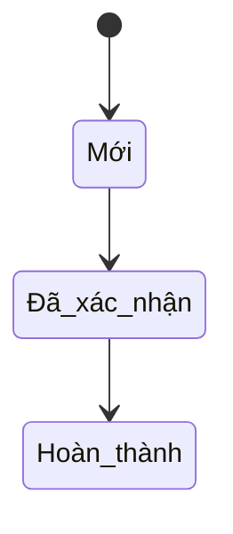

**✅ CORRECT:**
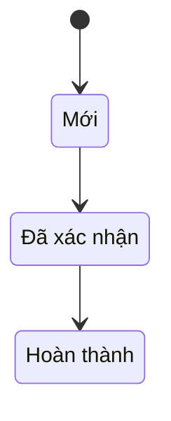

**State ID Mapping:**
| Vietnamese | ASCII ID | English |
|------------|----------|---------|
| Mới | NEW | New |
| Đã xác nhận | CONFIRMED | Confirmed |
| Đang xử lý | IN_PROGRESS | In Progress |
| Hoàn thành | COMPLETED | Completed |
| Hủy | CANCELLED | Cancelled |
| Chờ duyệt | PENDING_APPROVAL | Pending Approval |

---

### 2. Flowchart - Quote Special Characters

**Rule:** Node labels with special characters MUST be quoted with double quotes

**Special characters requiring quotes:**
- `:` Colon
- `=` Equals
- `{` `}` Braces
- `<` `>` Comparison operators
- `-` at start of label
- `/` Slash
- `@` At sign

**❌ WRONG:**
```mermaid
flowchart TB
    A[Click: Submit] --> B{count < 5}
    B --> C[status = active]
    C --> D[PATCH /leads/{id}]
    D --> E[- Item 1<br/>- Item 2]
```

**✅ CORRECT:**
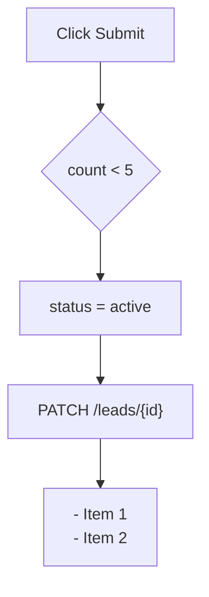

**Note:** Remove colon or quote the entire label. Do NOT use partial quotes.

---

### 3. ERD - No Duplicates + No Unicode Descriptions

**Rule 3a:** ERD does NOT support multiple relationships between the same entity pair

**Rule 3b:** ERD field descriptions should NOT contain Unicode (Vietnamese text)

**❌ WRONG:**
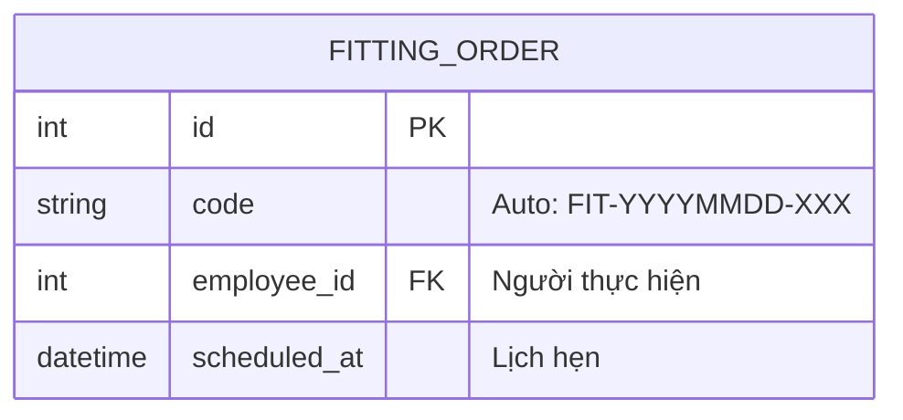

**✅ CORRECT (Option 1: Remove descriptions):**
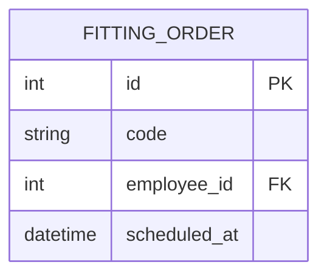

**✅ CORRECT (Option 2: Use external table):**
```markdown


**Field Descriptions:**
| Field | Vietnamese | Description |
|-------|------------|-------------|
| code | Mã đơn | Auto: FIT-YYYYMMDD-XXX |
| employee_id | Người thực hiện | Staff assigned |
| scheduled_at | Lịch hẹn | Appointment time |
```

**Recommended:** Use Option 1 (remove descriptions) for simplicity

**Rule 3a - Duplicate Relationships:**

**WRONG:**
```mermaid
erDiagram
    KHO ||--o{ PHIEU_DC : from
    KHO ||--o{ PHIEU_DC : to
```

**CORRECT:**
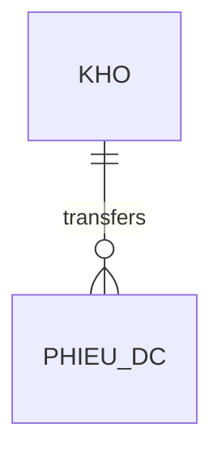

Express dual nature (from/to) in entity attributes instead of duplicate relationships.

---

### 4. Sequence Diagrams - No Special Characters in Messages/Notes

**Rule:** Do NOT use `"` (double quotes), `+` (plus), `;;` (double semicolons) in message text or Note content. These are reserved tokens in the Mermaid sequence diagram parser.

**WRONG:**
```mermaid
sequenceDiagram
    A->>B: Chạy "Tính giá vốn"
    Note over B: Mã = item + ";;" + lot
```

**CORRECT:**
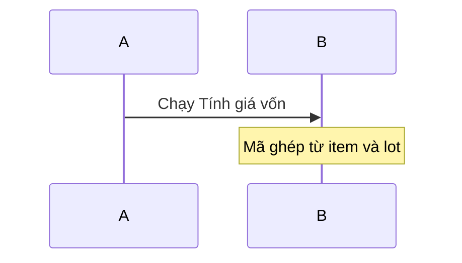

**Safe characters** (OK in messages/notes):
- `:` Colon (after first separator)
- `=` Equals, `/` Slash, `()` Parentheses
- `<br/>` Line break (HTML)
- Vietnamese diacritics, `→` Unicode arrow

**Problematic characters** (AVOID):
| Char | Risk | Fix |
|------|------|-----|
| `"` | String delimiter | Remove |
| `+` | Activation marker | Use text description |
| `;;` | Statement separator | Use text description |
| `;` | Statement separator | Avoid |

---

### 5. Line Endings - Unix (LF) Only

**Rule:** All Markdown files MUST use Unix line endings (LF), not Windows (CRLF)

**Check:**
```bash
# Should output "ASCII text" (NOT "ASCII text, with CRLF")
file docs/modules/warehouse/WAREHOUSE_STATUS.md
```

**Fix:**
```bash
# Convert CRLF to LF
perl -pi -e 's/\r\n/\n/g' docs/modules/warehouse/*.md
```

**Prevention:**
- Configure editor to use LF
- Git config: `git config core.autocrlf input`

---

### 6. Code Fences - Balanced

**Rule:** Every opening ` ```mermaid` MUST have closing ` ``` `

**Check:**
```bash
# Count should be EVEN
grep -c '```' file.md
```

**Common mistake:** Orphaned fence at end of file

---

## 📋 Generation Checklist

When generating module docs with Mermaid diagrams, follow this checklist:

### Before Writing Diagrams:

- [ ] Review this guide
- [ ] Prepare ASCII ID mapping for state diagrams
- [ ] Identify special characters in flowcharts

### While Writing:

- [ ] **State diagrams:** Use ASCII IDs + label definitions
- [ ] **Flowcharts:** Quote all special characters (`:` `=` `/` `;` `{}` `<>` `@`)
- [ ] **ERDs:** No duplicate entity-pair relationships; remove Unicode descriptions
- [ ] **Sequence diagrams:** No `"` `+` `;;` in messages/notes
- [ ] **All diagrams:** Use Unix line endings (LF)
- [ ] **Code fences:** Ensure balanced (even count)

### After Writing:

- [ ] Run validation in editor preview (if available)
- [ ] Check no parsing errors
- [ ] Verify diagrams render correctly
- [ ] Run `/mermaid-doctor` for final validation (optional)

---

## 🔧 Automatic Validation

After generating all files for a module, you can run:

```bash
/mermaid-doctor docs/modules/{module}/*.md
```

This will automatically:
- Detect and fix line ending issues
- Find Unicode in state IDs
- Find unquoted special characters
- Check ERD descriptions
- Validate code fence balance

---

## 📖 Examples from Lead Module

### Good Example 1: State Diagram (LEAD_STATUS.md)

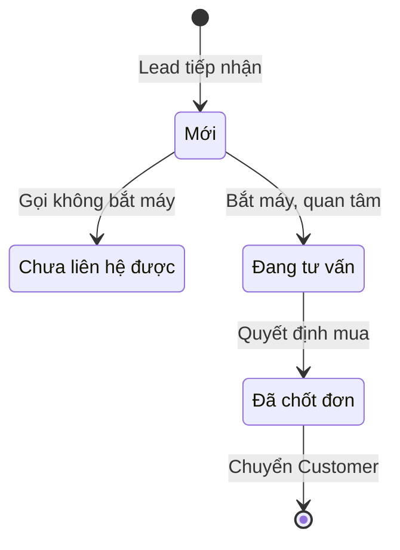

✅ **Correct:** ASCII IDs with Vietnamese labels

---

### Good Example 2: Flowchart with Special Chars (LEAD_STATUS.md)

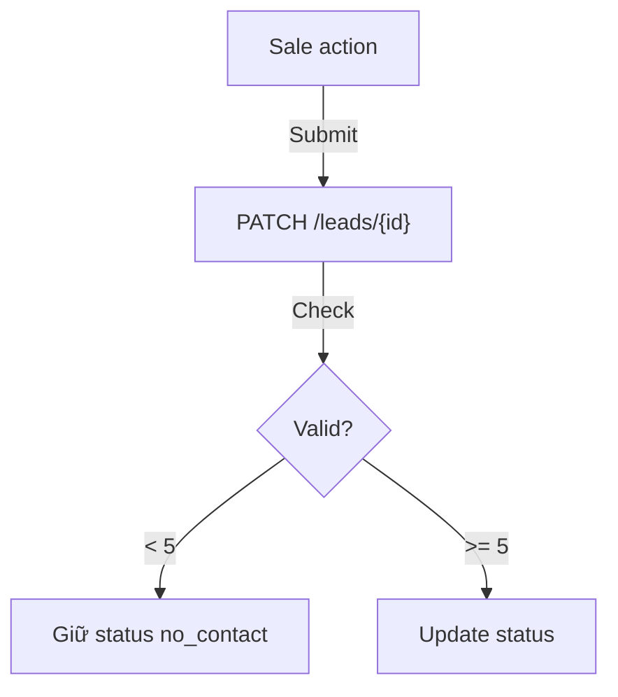

✅ **Correct:** All special characters quoted

---

### Good Example 3: ERD without Descriptions (LEAD_DIAGRAMS.md)

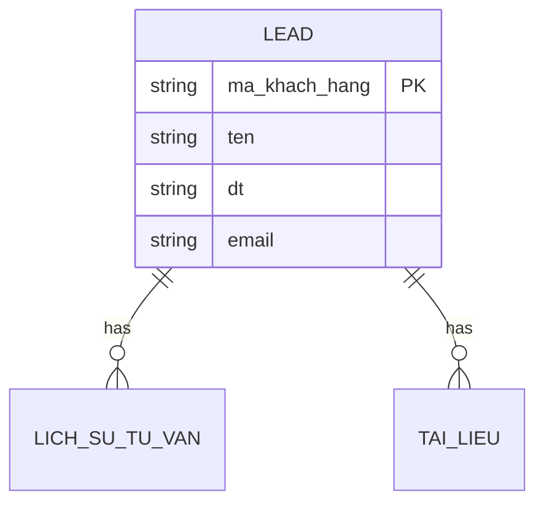

✅ **Correct:** No Unicode in field descriptions

---

## 🚨 Common Mistakes

### Mistake 1: Partial Quoting
```mermaid
flowchart TD
    A[Click "Submit"]  ❌ WRONG
    A["Click Submit"]  ✅ CORRECT
```

### Mistake 2: Single Quotes
```mermaid
flowchart TD
    A['status = won']  ❌ WRONG
    A["status = won"]  ✅ CORRECT
```

### Mistake 3: Mixing Unicode in State IDs
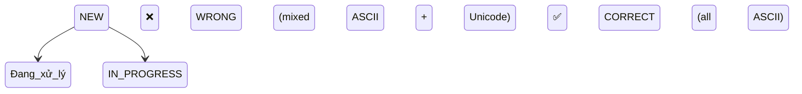

---

## 📚 References

- **Mermaid Doctor Skill:** `.claude/skills/mermaid-doctor/skill.md`
- **Official Mermaid Docs:** https://mermaid.js.org/
- **Lead Module Examples:** `docs/modules/lead/LEAD_STATUS.md`, `LEAD_DIAGRAMS.md`

---

**Last Updated:** 2026-02-16
**Related:** mermaid-doctor skill, DOCUMENTATION_CHECKLIST.md
