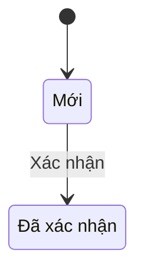
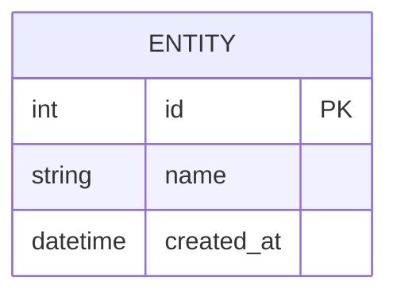
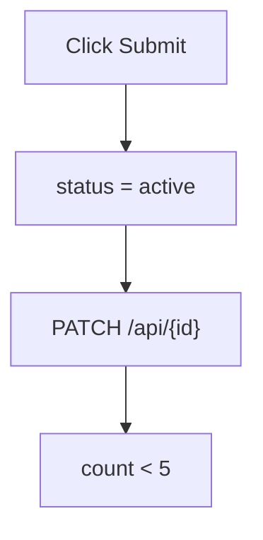

# 🩺 Mermaid Doctor

**Tự động chẩn đoán và sửa lỗi Mermaid diagrams trong Markdown files**

## 🎯 Mục đích

Skill này được tạo ra sau khi fix thành công file `FITTING_DIAGRAMS.md` với 3 lỗi phổ biến:
1. ✅ Windows line endings (CRLF) gây parse error
2. ✅ Unicode trong state IDs (`Đã_xác_nhận`) không được hỗ trợ
3. ✅ Unicode trong ERD field descriptions gây lỗi parser

## 🚀 Quick Start

```bash
# Fix file có lỗi
/mermaid-doctor docs/modules/fitting/FITTING_DIAGRAMS.md

# Chỉ validate, không fix
/mermaid-doctor --validate-only file.md

# Fix tất cả files diagram trong folder
/mermaid-doctor docs/modules/**/*_DIAGRAMS.md
```

## 📋 Lỗi thường gặp

### 1. Parse error on line 23: "State Machine - T"

**Nguyên nhân:** File dùng Windows line endings (CRLF)

**Fix:**
```bash
perl -pi -e 's/\r\n/\n/g' file.md
```

### 2. Unexpected character in state name

**Nguyên nhân:** State IDs có Unicode (`Mới`, `Đã_xác_nhận`)

**Fix:** Thay bằng ASCII IDs + labels riêng


### 3. ERD parse error on line 21

**Nguyên nhân:** Field descriptions có Unicode

**Fix:** Loại bỏ descriptions hoặc dùng ASCII


### 4. Flowchart parse error: Unexpected token

**Nguyên nhân:** Special characters trong labels không được quote

**Fix:** Quote labels có special chars


**Special chars cần quote:** `:`, `=`, `{`, `}`, `<`, `>`, `-` ở đầu

## 🔍 Cách hoạt động

1. **Phân tích file:** Đọc và detect các issues
2. **Tạo fix plan:** List các lỗi cần sửa
3. **Apply fixes:** Tự động sửa từng lỗi
4. **Validate:** Verify tất cả diagrams render được
5. **Report:** Tạo báo cáo chi tiết

## 📊 Conversion Rules

### State IDs
| Vietnamese | ASCII ID |
|------------|----------|
| Mới | NEW |
| Đã xác nhận | CONFIRMED |
| Đang xử lý | IN_PROGRESS |
| Hoàn thành | COMPLETED |
| Hủy | CANCELLED |

### ERD Fields
- ❌ Không dùng: `"Người thực hiện"`, `"Lịch hẹn"`
- ✅ Dùng: `"Assigned staff"`, `"Appointment time"`
- ✅ Hoặc: Bỏ description, dùng bảng riêng

## 🎓 Best Practices

### DO ✅
- Dùng ASCII cho IDs (state, entity names)
- Dùng Unix line endings (LF)
- Validate trước khi commit
- Đóng đủ code fences

### DON'T ❌
- Không dùng Unicode trong IDs
- Không copy từ Windows editors
- Không để orphaned ```
- Không dùng special chars không quote: `:`, `=`, `{`, `}`, `<`, `>`

## 🔧 Setup

### Git Config
```bash
git config core.autocrlf input
git config core.eol lf
```

### .gitattributes
```
*.md text eol=lf
```

### VS Code
```json
{
  "files.eol": "\n"
}
```

## 📚 Examples

### Trước khi fix:
```
Parse error on line 23: State Machine - T
Expecting 'SEMI', 'NEWLINE', 'EOF', ...
```

### Sau khi fix:
```
✅ Fixed 3 issues:
  - Converted CRLF to LF
  - Fixed state diagram Unicode
  - Removed orphaned fence
All diagrams rendering correctly!
```

## 🧪 Tested On

- ✅ `docs/modules/fitting/FITTING_DIAGRAMS.md` - Fixed successfully (12/01/2026)
  - Issue 1: CRLF line endings
  - Issue 2: State diagram Unicode IDs
  - Issue 3: ERD Unicode descriptions
  - Issue 4: Orphaned code fence

- ✅ `docs/modules/coaching/COACHING_STATUS.md` - Fixed successfully (12/01/2026)
  - Issue: Unicode state IDs (Mới, Đã_test, etc.)
  - Fixed: Replaced with ASCII IDs + Vietnamese labels

- ✅ `docs/modules/lead/LEAD_STATUS.md` - Fixed successfully (12/01/2026)
  - Issue: Flowchart special characters in Use Cases 2, 3, 4
  - Fixed: Quoted labels with `:`, `=`, `{`, `}`, `<`, `>`

**Total validated:** 13 files, 89 diagrams

## 🎓 Enhanced Features (v1.2)

### Official Mermaid v11.12.2 Syntax Reference

- ✅ **State Diagrams**: Complete syntax rules, valid ID formats, composite states
- ✅ **ERD Diagrams**: Relationship cardinality, attribute syntax, valid characters
- ✅ **Flowcharts**: 30+ node shapes, arrow types, subgraphs, CRITICAL warnings
- ✅ **Sequence Diagrams**: 10 arrow types, control flow, activations

### Advanced Debugging Techniques (5 methods)

1. **Binary Search**: Isolate errors in large files
2. **Diagram Extraction**: Extract and validate each diagram
3. **Character-Level Analysis**: Detect CRLF, Unicode, special chars
4. **Incremental Validation**: Line-by-line validation
5. **Syntax Pattern Matching**: Validate against official patterns

### Diagram-Specific Validation Checklists

- State Diagram: 8 validation rules
- ERD: 8 validation rules
- Flowchart: 7 validation rules
- Sequence Diagram: 6 validation rules

### Common Pitfalls from Official Docs

- ⚠️ Flowchart: Lowercase "end" breaks syntax
- ⚠️ Flowchart: Node IDs starting with "o"/"x" create edges
- ⚠️ **Flowchart: Special chars in labels need quotes** (NEW in v1.2)
- ⚠️ State: Cannot transition between composite internals
- ⚠️ ERD: Quotes within quoted descriptions fail
- ⚠️ Sequence: Destroyed participant error (v10.6.1)

## 📖 Documentation

### Contents (1,470+ lines)

- **Official Syntax Reference**: All 4 diagram types
- **7 Common Errors**: With detection and fix algorithms (NEW: Flowchart special chars)
- **5 Advanced Debugging Techniques**: With code examples
- **State ID Conversion Table**: Vietnamese → ASCII mapping
- **Auto-Fix Workflow**: 4-step process
- **Diagnostic Report Template**: Production-ready
- **Best Practices**: DO/DON'T with examples
- **Configuration**: Git, VS Code, EditorConfig
- **Common Pitfalls**: From official Mermaid docs
- **Validation Checklists**: Per diagram type (enhanced)
- **References**: Official docs, tools, community

Xem chi tiết tại [skill.md](./skill.md)

---

**Version:** 1.2
**Created:** 12/01/2026
**Last Updated:** 12/01/2026
**Status:** ✅ Production Ready
**Enhanced with:** ✅ Official Mermaid v11.12.2 documentation + Real-world fixes
