# Common Mermaid Errors & Fixes

> Detailed fixes for the 7 most common Mermaid parsing errors.

---

## Error 1: Windows Line Endings (CRLF)

**Symptom:**
```
Parse error on line 23: ... --> State Machine - T
Expecting 'SEMI', 'NEWLINE', 'EOF', 'AMP', 'START_LINK', ...
```

**Cause:**
- File uses Windows line endings (`\r\n`) instead of Unix (`\n`)
- Mermaid parser chokes on `\r` characters
- Common when editing on Windows or file copied from Windows

**Detection:**
```bash
# Check for CRLF
od -c file.md | grep "\\r"

# Or use file command
file file.md  # Should show "ASCII text" not "ASCII text, with CRLF"
```

**Fix:**
```bash
# Convert CRLF to LF
perl -pi -e 's/\r\n/\n/g' file.md

# Or using dos2unix (if available)
dos2unix file.md
```

**Prevention:**
- Configure git: `git config core.autocrlf input`
- Set editor to use LF: VS Code → "Files: Eol" = "\n"

---

## Error 2: Unicode in State IDs

**Symptom:**
```
Parse error in stateDiagram-v2
Unexpected character in state name: Đã_xác_nhận
```

**Cause:**
- State IDs contain Unicode characters (Vietnamese, Chinese, etc.)
- Mermaid state machine parser expects ASCII identifiers
- Labels can be Unicode, but IDs must be ASCII

**Example - WRONG:**
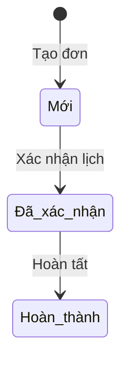

**Example - CORRECT:**
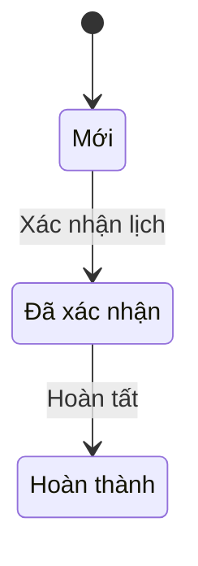

**State ID Mapping Table:**

| Vietnamese | ASCII ID | English Equivalent |
|------------|----------|-------------------|
| Mới | NEW | New |
| Đã xác nhận | CONFIRMED | Confirmed |
| Đang xử lý | IN_PROGRESS | In Progress |
| Hoàn thành | COMPLETED | Completed |
| Hủy | CANCELLED | Cancelled |
| Chờ duyệt | PENDING_APPROVAL | Pending Approval |
| Vắng mặt | NO_SHOW | No Show |
| Đã duyệt | APPROVED | Approved |
| Từ chối | REJECTED | Rejected |

---

## Error 3: Unicode in ERD Field Descriptions

**Symptom:**
```
Parse error on line 21: FITTING_SPECS
erDiagram attribute error
```

**Cause:**
- Entity attribute descriptions contain Unicode
- Special characters in quoted strings: `"Người thực hiện"`
- Mermaid ERD parser has limited Unicode support

**Example - WRONG:**
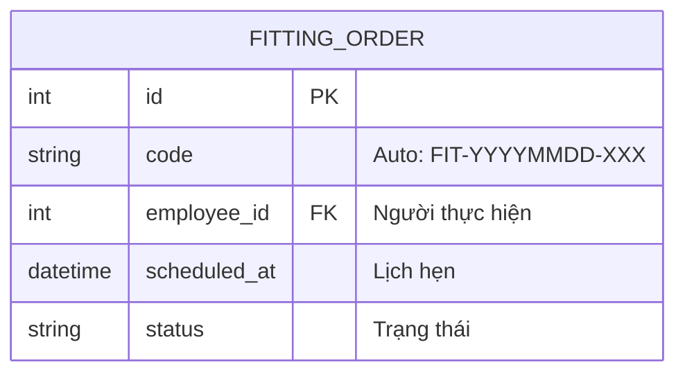

**Example - CORRECT (Option 1: Remove descriptions):**
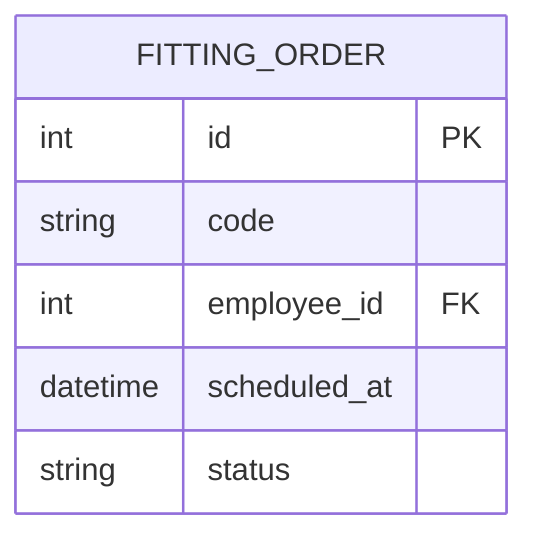

**Example - CORRECT (Option 2: ASCII descriptions):**
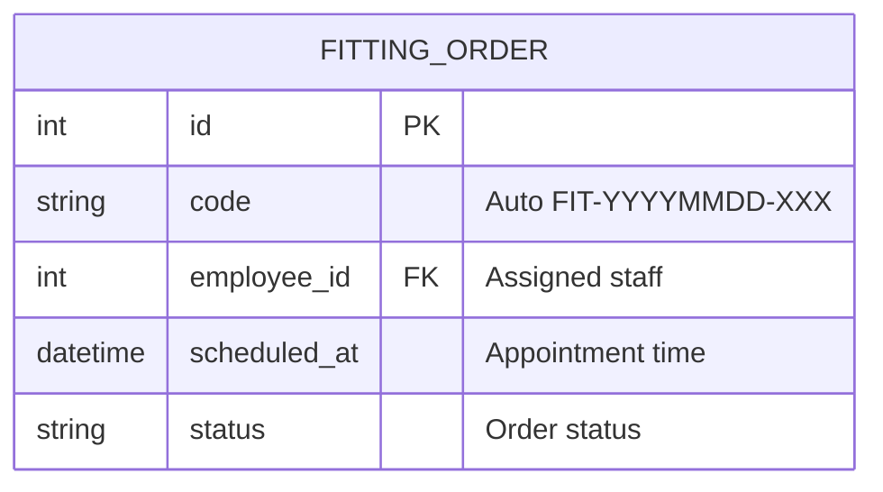

**Fix Strategy:**
1. **Preferred:** Remove all field descriptions (keep ERD simple)
2. **Alternative:** Translate to ASCII/English
3. **Workaround:** Add comment table below diagram

---

## Error 4: Unbalanced Code Fences

**Symptom:**
```
Entire document after line X is treated as code block
Multiple diagrams fail to render
```

**Cause:**
- Missing closing fence: ```
- Orphaned fence at end of file
- Mismatched fence types: ``` vs ~~~

**Detection:**
```bash
# Count all code fences
grep -n '```' file.md | wc -l
# Should be even number (opening + closing)

# List all fences with context
grep -n -B1 -A1 '```' file.md
```

**Fix:**
```bash
# Find orphaned fences
awk '/```/ {count++} END {if (count % 2 != 0) print "Unbalanced!"}' file.md

# Common orphan location: end of file
tail -5 file.md
# If last line is ```, remove it
```

**Prevention Checklist:**
- [ ] Every `mermaid` opening has closing ```
- [ ] Every `bash` opening has closing ```
- [ ] File does NOT end with ```
- [ ] Total fence count is even

---

## Error 5: Flowchart Special Characters in Node Labels

**Symptom:**
```
Parse error: Unexpected token ':'
Parse error: Unexpected token '='
Parse error: Unexpected token '{'
Diagram fails to render
```

**Cause:**
- Special characters in node labels without quotes
- Colons: `Node[Click: Action]`
- Equals signs: `Node[status = active]`
- Braces: `Node[PATCH /api/{id}]`
- Comparison operators: `Node[count < 5]`
- List markers at start: `Node[- Item 1<br/>- Item 2]`

**Critical Rule:**
> **ANY node label containing special characters MUST be quoted with double quotes**

**Example - WRONG:**
```mermaid
flowchart TB
    A[Click: Submit] --> B{count < 5}
    B --> C[status = active]
    C --> D[PATCH /leads/{id}]
    D --> E[- Lý do<br/>- Ngày]
```

**Example - CORRECT:**
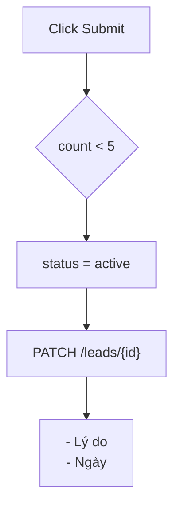

**Special Characters Requiring Quotes:**

| Character | Example | Fix |
|-----------|---------|-----|
| `:` Colon | `[Click: Submit]` | `["Click Submit"]` or remove `:` |
| `=` Equals | `[status = won]` | `["status = won"]` |
| `{` `}` Braces | `[/api/{id}]` | `["/api/{id}"]` |
| `<` `>` Comparison | `[count < 5]` | `["count < 5"]` |
| `-` at start | `[- Item 1]` | `["- Item 1"]` |
| `/` Slash | `[nhập/xuất]` | `["nhập/xuất"]` |
| `;` Semicolon | `[a ;; b]` | `["a ;; b"]` |
| `@` At sign | `[user@domain]` | `["user@domain"]` |

**Common Mistakes:**
- ❌ Partial quoting: `[Click "Submit"]`
- ❌ Single quotes: `['status = won']`
- ❌ Missing quotes on link text: `A -->|status = won| B`
- ✅ Full double quotes: `["Click Submit"]`
- ✅ Quote link text too: `A -->|"status = won"| B`

---

## Error 6: Special Characters in Other Contexts

**Symptom:**
```
Parse error: Unexpected token '/'
```

**Cause:**
- Slashes in text: `"Website/Cửa hàng/ĐT"`
- Special symbols: emoji, bullets
- Unquoted special characters

**Example - WRONG:**
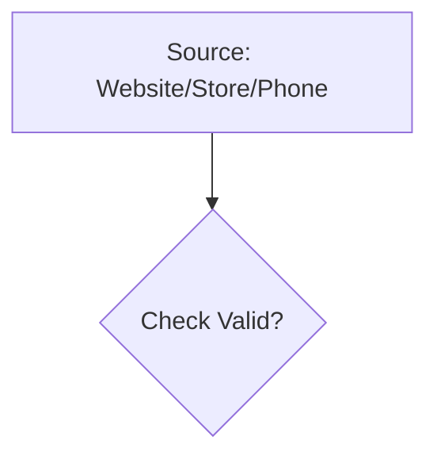

**Example - CORRECT:**
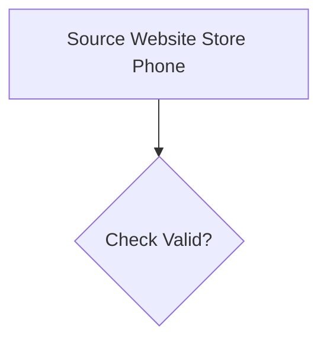

**Fix Rules:**
- Remove or quote: `:` (colon), `/` (slash)
- Remove: emoji, special bullets
- Keep: `-` (dash), `_` (underscore) in middle of text

---

## Error 7: Invalid Relationship Syntax (ERD)

**Symptom:**
```
Parse error: Invalid relationship
```

**Cause:**
- Wrong relationship symbols
- Incorrect cardinality notation

**Valid ERD Relationships:**
```
||--||   One to One
||--o{   One to Many
}o--o{   Many to Many
||--o|   One to Zero or One
```

**Example - WRONG:**
```mermaid
erDiagram
    ORDER -> CUSTOMER : belongs_to
    ORDER => ITEM : contains
```

**Example - CORRECT:**
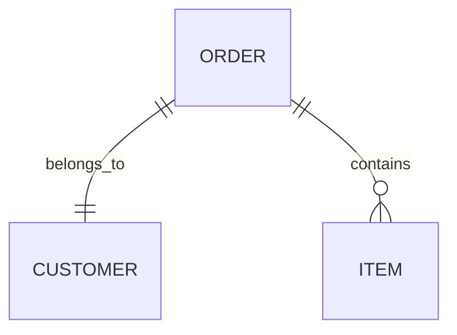

---

## Error 8: ERD Duplicate Relationships

**Symptom:**
```
Parse error on line 5:
...PHIEU_DIEU_CHUYEN : to    KHO ||--o{ LE
Expecting 'UNICODE_TEXT', 'ENTITY_NAME', 'WORD', got 'IDENTIFYING'
```

**Cause:**
- Two relationships defined between the SAME pair of entities
- Mermaid ERD does NOT support multiple relationships between the same entity pair
- Parser reads past the first relationship and encounters the second as a syntax error

**Example - WRONG:**
```mermaid
erDiagram
    KHO ||--o{ PHIEU_DIEU_CHUYEN : from
    KHO ||--o{ PHIEU_DIEU_CHUYEN : to
```

**Example - CORRECT:**
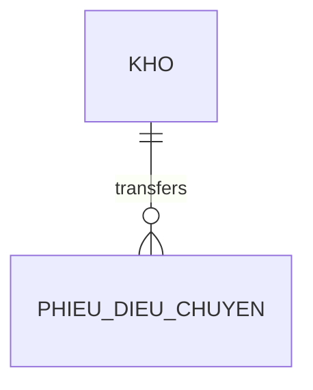

**Fix Strategy:**
1. Combine into a single relationship with descriptive label
2. Express the dual nature (from/to) in entity attributes instead
3. If truly different cardinality, consider splitting the entity

---

## Error 9: Sequence Diagram Special Characters in Messages/Notes

**Symptom:**
```
Parse error on line 15:
... = mã_vat_tu + ";;" + so_lo    else Tem
Expecting 'NEWLINE', 'AS', ... got '+'
```

**Cause:**
- `"` (double quotes) in message text or Note content → interpreted as string delimiters
- `+` in content → interpreted as activation marker
- `;;` → interpreted as double statement separator
- Combined, they break the parser by spanning across line boundaries

**Example - WRONG:**
```mermaid
sequenceDiagram
    A->>B: Chạy "Tính giá vốn"
    Note over B: Mã = item + ";;" + lot
```

**Example - CORRECT:**
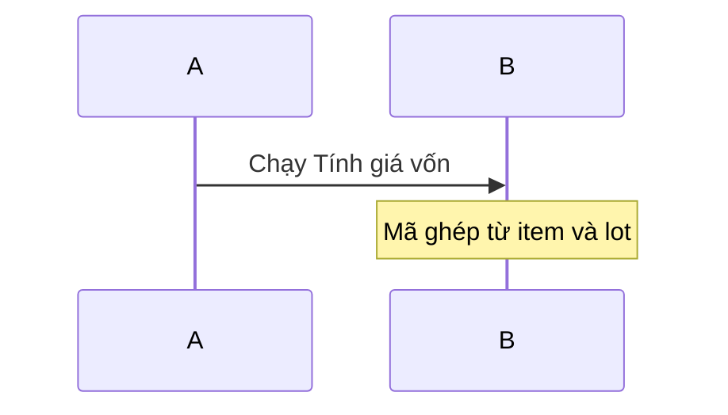

**Problematic characters in sequence diagram messages/notes:**

| Character | Risk | Fix |
|-----------|------|-----|
| `"` Double quote | String delimiter, breaks parsing | Remove or replace with single words |
| `+` Plus | Activation marker | Remove or use text description |
| `;;` Double semicolon | Statement separator | Remove or describe in words |
| `;` Semicolon | Statement separator | Avoid in messages |

**Safe characters** (OK in messages/notes after `:`):
- `:` Colon (only first one is separator, rest is content)
- `=` Equals (in Note content without `"`)
- `/` Slash
- `()` Parentheses
- `<br/>` Line break (HTML)
- `→` Unicode arrow
- Vietnamese diacritics

---

## Quick Reference: Fix Priority Order

1. **CRLF** → Fix first (affects all diagrams)
2. **Code Fences** → Check count is even
3. **State IDs** → Replace Unicode with ASCII
4. **ERD Descriptions** → Remove or translate
5. **ERD Duplicates** → Merge duplicate entity-pair relationships
6. **Flowchart Labels** → Quote special characters (`:` `=` `/` `;` `{}` `<>` `@`)
7. **Sequence Messages** → Remove `"` `+` `;;` from messages/notes
8. **ERD Relationships** → Use valid cardinality

---

**Last Updated:** 2026-02-16
