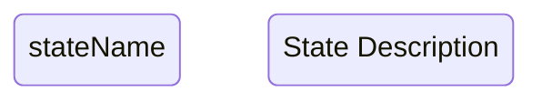
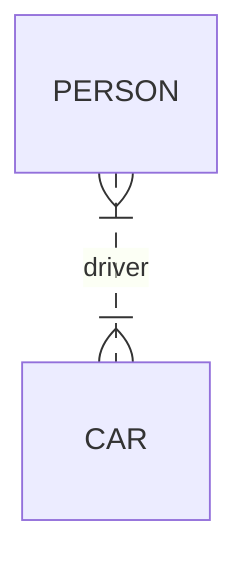
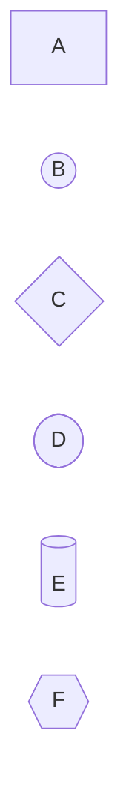

# Official Mermaid Syntax Reference

> Based on Mermaid v11.12.2 official documentation

---

## Supported Diagram Types (25+)

| Category | Diagrams |
|----------|----------|
| **Basic** | Flowchart, Sequence, Class Diagram |
| **Data Viz** | Gantt, Pie Chart, XY Chart, Sankey |
| **Architecture** | C4, ERD, Block Diagram |
| **Process** | State Diagram, User Journey, Timeline, Kanban |
| **Specialized** | GitGraph, Mindmaps, Quadrant, Radar, Treemap |

---

## State Diagram Syntax

**Valid State ID Formats:**


**Critical Rules:**

1. **State IDs**: Can be any alphanumeric string
   - ✅ Valid: `NEW`, `State1`, `waiting_approval`
   - ⚠️ Spaces require ID declaration first

2. **Special States:**
   - Start: `[*]`
   - End: `[*]`

3. **Transitions:**
   ```
   state1 --> state2: transition label
   ```

4. **Composite States:**
   ```mermaid
   state parentId {
       [*] --> childState
   }
   ```

5. **Restrictions:**
   - ❌ Cannot style start/end states
   - ❌ Cannot transition between internal states of different composite states

6. **Comments:**
   ```
   %% Comment on separate line
   ```

**Special Features:**
- **Concurrency**: `--` symbol (PlantUML-style)
- **Forks/Joins**: `<<fork>>` and `<<join>>` keywords
- **Choices**: `<<choice>>` keyword

---

## ERD Syntax

**Basic Statement Format:**
```
<first-entity> [<relationship> <second-entity> : <relationship-label>]
```

**Relationship Cardinality:**

| Notation | Meaning | Aliases |
|----------|---------|---------|
| `\|o` or `o\|` | Zero or one | "zero or one", "one or zero" |
| `\|\|` | Exactly one | "only one" |
| `}o` or `o{` | Zero or more | "zero or many", "0+" |
| `}\|` or `\|{` | One or more | "one or many", "many(1)" |

**Identification:**
- `--` (solid): Identifying relationship
- `..` (dotted): Non-identifying relationship

**Example:**


**Attribute Syntax:**
```
ENTITY {
    <type> <name> [key] ["comment"]
}
```

**Valid Keys:**
- `PK`: Primary Key
- `FK`: Foreign Key
- `UK`: Unique Key
- Combine with commas: `PK,FK`
- Alternative: `*` for primary key

**Valid Characters:**
- Entity names: Unicode supported, wrap spaces in quotes
- Type format: Start with alpha, may include digits, `-`, `_`, `()`, `[]`
- Comments: Double quotes, cannot contain quotes

---

## Flowchart Syntax

**Direction Declaration:**
- `TB` or `TD`: Top to Bottom
- `BT`: Bottom to Top
- `RL`: Right to Left
- `LR`: Left to Right

**CRITICAL WARNINGS:**

1. **Reserved Word "end":**
   - ❌ `end` breaks syntax
   - ✅ `End` or `END` works

2. **Starting with "o" or "x":**
   - ❌ `A---oB` creates circle edge (unintended)
   - ❌ `A---xB` creates cross edge (unintended)
   - ✅ `A--- oB` (add space)
   - ✅ `A---OB` (capitalize)

**Node Shapes (30+ available):**


**Arrow Types:**
- `-->`: Standard arrow
- `---`: Open link (no arrow)
- `-.->`: Dotted arrow
- `==>`: Thick arrow
- `-o`: Circle edge
- `-x`: Cross edge

**Link Text:**
```
A -->|text| B
A -- text --> B
```

**Link Length:**
```
A ---- B    %% Length 2
A ----- B   %% Length 3
```

**Subgraphs:**
```mermaid
subgraph id[title]
    graph definition
end
```

**Special Characters:**
- Enclose in quotes: `"text with #special chars"`
- Entity codes: `#35;` for `#`

---

## Sequence Diagram Syntax

**Basic Format:**
```
[Actor][Arrow][Actor]: Message text
```

**Participant Types (with symbols):**
- `actor`: Actor symbol
- `participant`: Default box
- `boundary`, `control`, `entity`: UML symbols
- `database`, `collections`, `queue`: Data symbols

**Message Arrows (10 types):**

| Arrow | Type | Description |
|-------|------|-------------|
| `->` | Solid | No arrowhead |
| `-->` | Dotted | No arrowhead |
| `->>` | Solid | With arrowhead |
| `-->>` | Dotted | With arrowhead |
| `<<->>` | Bidirectional | Both arrowheads (v11.0.0+) |
| `-x` | Solid | End cross |
| `--x` | Dotted | End cross |
| `-)` | Solid | Async (open arrow) |
| `--)` | Dotted | Async (open arrow) |

**Activations:**
```
activate Actor
deactivate Actor

%% Or shorthand
A->>+B: Message (activate B)
B-->>-A: Response (deactivate B)
```

**Control Flow:**
```mermaid
sequenceDiagram
    %% Loops
    loop Every minute
        Check status
    end

    %% Alternatives
    alt is sick
        Go to doctor
    else is well
        Go to work
    end

    %% Optional
    opt Extra response
        Do something
    end

    %% Parallel
    par Alice to Bob
        Alice->>Bob: Hello
    and Alice to John
        Alice->>John: Hello
    end

    %% Critical
    critical Establish connection
        Service-->DB: connect
    option Network timeout
        Service-->Service: Log error
    end

    %% Break
    break when too much load
        Service-->Service: Shutdown
    end
```

**Notes:**
```
Note right of Actor: Single note
Note over Actor1,Actor2: Span note
```

**Background Highlighting:**
```
rect rgb(200, 150, 255)
    Alice->>Bob: Flow
end
```

---

## External References

- [Mermaid Official Site](https://mermaid.js.org/)
- [Mermaid Live Editor](https://mermaid.live/edit)
- [State Diagram Syntax](https://mermaid.js.org/syntax/stateDiagram.html)
- [ERD Syntax](https://mermaid.js.org/syntax/entityRelationshipDiagram.html)
- [Flowchart Syntax](https://mermaid.js.org/syntax/flowchart.html)
- [Sequence Diagram Syntax](https://mermaid.js.org/syntax/sequenceDiagram.html)

---

**Last Updated:** 2026-01-16 | **Mermaid Version:** v11.12.2
