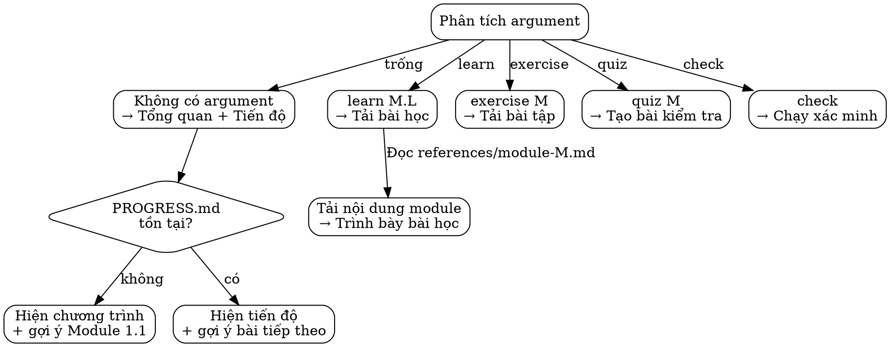

# /frappe-academy — Interactive Frappe & ERPNext Tutor

> "Học đi đôi với hành — mỗi bài học đều chạy được trên devcontainer."

Hệ thống học tương tác, từng bước dạy Frappe Framework và ERPNext development
thông qua lý thuyết, live code, và bài tập thực hành. Tất cả thực hành chạy trên
`devcontainer-frappe-1`.

## Cách dùng

```
/frappe-academy                  # Tổng quan + tiến độ hiện tại
/frappe-academy learn 2.3        # Bắt đầu Module 2, Bài 3
/frappe-academy exercise 3       # Làm bài tập Module 3
/frappe-academy quiz 4           # Kiểm tra Module 4
/frappe-academy check            # Xác minh bài tập trên devcontainer
```

## Command Router



## Luồng bài học

Mỗi bài học theo cấu trúc sau:

1. **Lý thuyết** — Giải thích khái niệm (tiếng Việt) + ví dụ code
   - Giải thích ngắn gọn, dùng ví dụ tương tự khi cần
   - Code examples phải copy-paste và chạy được

2. **Tham khảo Skill** — Trỏ đến tài liệu chuyên sâu
   - `frappe` skill (3,893 files) cho framework internals
   - `erpnext` skill (3,616 files) cho business logic
   - `dcnet_quality` skill (222 files) cho code quality patterns
   - Format: `>>> Đọc thêm: frappe skill > references/doctype-patterns.md`

3. **Live Code** — Chạy được trên devcontainer
   ```bash
   docker exec devcontainer-frappe-1 bash -c "cd /workspace/development/frappe-bench && <command>"
   ```
   - Luôn hiển thị kết quả mong đợi
   - Giải thích output bằng tiếng Việt

4. **Mini Quiz** — 2-3 câu hỏi kiểm tra hiểu biết
   - Trắc nghiệm hoặc trả lời ngắn
   - Hiện đáp án sau khi người học trả lời (hoặc khi được yêu cầu)

5. **Bài tập thực hành** — Thực hành trực tiếp
   - Yêu cầu rõ ràng với kết quả mong đợi
   - File bài tập trong `exercises/module-M/`
   - Xác minh qua `/frappe-academy check`

## Theo dõi tiến độ

Theo dõi trong `docs/learning/PROGRESS.md`. Tạo nếu chưa có.

### Định dạng

```markdown
# Frappe Academy Progress

> Last updated: {date}
> Current: Module {M}, Lesson {L}

## Progress

| Module | Lesson | Status | Date |
|--------|--------|--------|------|
| 1.1 | Frappe Architecture | done | 2026-03-17 |
| 1.2 | Bench CLI | done | 2026-03-17 |
| 1.3 | App Structure | in-progress | 2026-03-18 |
| 2.1 | DocType Basics | not-started | — |

## Exercise Results

| Module | Score | Date |
|--------|-------|------|
| 1 | 5/5 | 2026-03-17 |

## Quiz Results

| Module | Score | Date |
|--------|-------|------|
| 1 | 8/10 | 2026-03-17 |
```

### Quy tắc cập nhật

- Đánh dấu bài học `done` sau khi hoàn thành lý thuyết + quiz
- Đánh dấu `in-progress` khi đã bắt đầu nhưng chưa xong
- Cập nhật điểm exercise/quiz sau `/frappe-academy exercise` hoặc `quiz`
- Khi `/frappe-academy` (tổng quan), đọc file này để hiện trạng thái hiện tại

## Tham chiếu chéo đến các Skill có sẵn

| Skill | Files | Khi nào tham chiếu |
|-------|-------|-------------------|
| `frappe` | 3,893 | Khái niệm Framework: DocType, hooks, API, bench, testing |
| `erpnext` | 3,616 | Modules nghiệp vụ: Selling, Buying, Stock, Accounting |
| `dcnet_quality` | 222 | Chất lượng code: 28 sub-skills, 5 layers, validation patterns |

Mẫu tham chiếu — khi dạy khái niệm đã có trong skill khác:
```
>>> Tham khảo chi tiết: .claude/skills/frappe/references/{relevant-file}.md
```

KHÔNG sao chép nội dung từ các skill này. Trỏ người học đến chúng để đọc sâu.

## Tổng quan Module

| Module | Tên | Bài học | Chủ đề |
|:------:|-----|:-------:|--------|
| 1 | Frappe Foundation | 5 | Architecture, Bench CLI, App structure, Sites, Config |
| 2 | DocType Mastery | 6 | Fields, Naming, Permissions, Workflows, Child tables, Virtual |
| 3 | Server-Side | 5 | Controllers, Whitelisted API, Server Script, Hooks, Scheduler |
| 4 | Client-Side | 5 | Client Script, Form events, List/Page customization, frappe.call |
| 5 | Data & Query | 4 | frappe.db, Report Builder, Script Report, Query Report |
| 6 | Web & API | 5 | REST API, Web pages, Portal, Jinja templates, Print Format |
| 7 | ERPNext Modules | 5 | Selling, Buying, Stock, Accounting, CRM flows |
| 8 | Custom App | 5 | App scaffold, Custom DocType, Fixtures, Testing, Deployment |

**Tổng cộng: ~40 bài học**

Nội dung chi tiết từng module: `references/module-{M}.md`

## Cách trình bày nội dung

### Cho `/frappe-academy` (Tổng quan)

1. Đọc `docs/learning/PROGRESS.md` (tạo nếu chưa có, tất cả bài ở trạng thái `not-started`)
2. Hiện bảng module với chỉ báo tiến độ
3. Gợi ý bài tiếp theo dựa trên bài đã hoàn thành gần nhất

### Cho `/frappe-academy learn M.L`

1. Đọc `references/module-{M}.md` để lấy nội dung bài học
2. Trình bày theo 5 bước (Lý thuyết → Tham khảo → Live Code → Quiz → Bài tập)
3. Cập nhật PROGRESS.md thành `in-progress`
4. Sau khi hoàn thành quiz, cập nhật thành `done`

### Cho `/frappe-academy exercise M`

1. Đọc `exercises/module-{M}/` để lấy đề bài tập
2. Trình bày từng bài tập một
3. Hướng dẫn người học triển khai
4. Sau tất cả bài tập, cập nhật điểm exercise trong PROGRESS.md

### Cho `/frappe-academy quiz M`

1. Tạo 10 câu hỏi bao phủ tất cả bài học trong Module M
2. Phối hợp: 6 trắc nghiệm + 2 trả lời ngắn + 2 viết code
3. Chấm điểm sau khi nộp, cập nhật điểm quiz trong PROGRESS.md

### Cho `/frappe-academy check`

1. Chạy script xác minh trong devcontainer:
   ```bash
   docker exec devcontainer-frappe-1 bash -c "cd /workspace/development/frappe-bench && bench --site flow.local run-tests --app dcnet_apps -v" 2>&1 | tail -20
   ```
2. Kiểm tra các xác minh riêng cho từng bài tập trong `scripts/`
3. Báo cáo đạt/không đạt kèm gợi ý cho các lỗi

## Quy tắc quan trọng

- **Song ngữ**: Giải thích bằng tiếng Việt, giữ code/thuật ngữ bằng tiếng Anh
- **Tuần tự**: Không được bỏ qua bài — mỗi module xây dựng trên module trước
- **Thực hành**: Mỗi bài học phải có code chạy được
- **Không giả định**: Nếu người học có vẻ chưa hiểu, đề nghị giải thích lại bằng ví dụ khác
- **Tham chiếu, không sao chép**: Trỏ đến frappe/erpnext/dcnet_quality skills cho nội dung chuyên sâu
- **Ưu tiên container**: Tất cả code chạy trên `devcontainer-frappe-1`, không bao giờ chạy trên host
