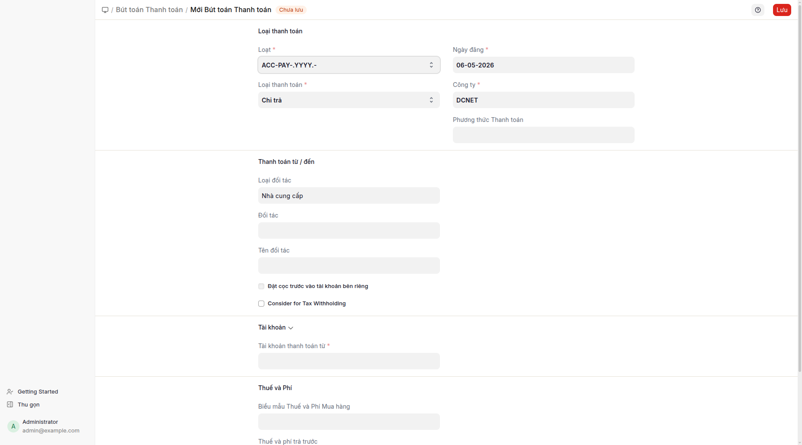

## Mục đích

**Phiếu thanh toán loại Chi** là chứng từ chi tiền chuẩn — dùng để thanh toán cho 1 hoặc nhiều hóa đơn mua hàng. Có thể là tiền mặt (phương thức Tiền mặt → ghi vào TK 1111) hoặc chuyển khoản (phương thức Chuyển khoản → ghi vào TK 1121). Khi phương thức là Tiền mặt, giao dịch tự hiện trên báo cáo Phiếu chi.

## Khi nào dùng

- **Trả nhà cung cấp từ hóa đơn mua hàng:** quy trình chuẩn từ hóa đơn mua hàng → "Tạo > Phiếu thanh toán". Phiếu thanh toán tự động điền sẵn đối tượng + tham chiếu hóa đơn + số tiền.
- **Trả nhiều hóa đơn cùng lúc:** phiếu thanh toán tham chiếu nhiều hóa đơn; phân bổ theo thứ tự (hóa đơn cũ trước).
- **Trả ứng trước cho nhà cung cấp chưa có hóa đơn:** phiếu thanh toán loại Chi không có tham chiếu → ghi Có TK 331 ứng trước → phân bổ lại khi có hóa đơn.
- **Trả vay/lãi vay/nợ khác có đối tượng:** dùng phiếu thanh toán loại Chi với tài khoản tương ứng (335/342/...).

## Cách thực hiện

### Quy trình tự nhiên (khuyến nghị)

1. Mở **hóa đơn mua hàng** đã ghi sổ → bấm **Tạo > Phiếu thanh toán**.
2. Biểu mẫu phiếu thanh toán mở với các trường đã điền sẵn:
   - Loại Chi, Loại đối tượng = Nhà cung cấp, Đối tượng = nhà cung cấp của hóa đơn
   - Tham chiếu = hóa đơn mua hàng đó, Số tiền = số tiền còn nợ
   - Ngày ghi sổ = hôm nay
   
3. Chọn **Phương thức thanh toán**: Tiền mặt (TK 1111) hoặc Chuyển khoản (TK 1121).
4. (Tùy chọn) Điều chỉnh số tiền nếu trả một phần.
5. Lưu và ghi sổ.

### Quy trình thủ công (không qua hóa đơn mua hàng)

1. Mở **danh sách phiếu thanh toán** → "+ Thêm" → biểu mẫu mới.
2. Chọn loại Chi, Loại đối tượng = Nhà cung cấp, Đối tượng = nhà cung cấp.
3. Nhập số tiền, chọn phương thức thanh toán.
4. (Tùy chọn) Thêm tham chiếu → chọn 1 hoặc nhiều hóa đơn mua hàng còn nợ.
5. Lưu và ghi sổ.

## Định khoản tự động

| Phương thức | TK Nợ | TK Có | Ghi chú |
|---|---|---|---|
| Tiền mặt | 331 (NCC) | 1111 | Hiện trên báo cáo Phiếu chi |
| Chuyển khoản | 331 (NCC) | 1121 | Hiện trên đối chiếu ngân hàng |
| Chuyển khoản (USD) | 331 (NCC USD) | 1121 (USD) | Tỷ giá theo ngày |

Nếu trả ứng (không tham chiếu hóa đơn): TK 331 ghi Nợ như "ứng trước cho nhà cung cấp" → khi hóa đơn ra, phân bổ lại.

## Tình huống đặc biệt & cảnh báo

- **Tỷ giá ngoại tệ:** Phiếu thanh toán đa tiền tệ có chênh lệch tỷ giá thực hiện → hệ thống tự ghi vào TK 515/635 khi tỷ giá ngày trả khác ngày phát hóa đơn.
- **Phân bổ theo thứ tự:** Phiếu thanh toán > tổng hóa đơn → số tiền dư ghi vào TK 331 (ứng trước). Phiếu thanh toán < tổng hóa đơn → hóa đơn vẫn còn nợ một phần.
- **Giữ menu khi mở chứng từ gốc:** Phiếu thanh toán được đăng ký thuộc về phân hệ VN Accounting → mở từ báo cáo Phiếu chi, menu không nhảy.
- **Hủy phiếu thanh toán:** Hủy phiếu thanh toán sẽ mở lại hóa đơn liên quan (số tiền còn nợ tăng lại). Không nên hủy khi tiền đã chi thực — dùng phiếu kế toán điều chỉnh.
- **Nhiều nhà cung cấp trên 1 phiếu thanh toán:** Phiếu thanh toán chỉ 1 đối tượng. Trả 1 lần cho nhiều nhà cung cấp → tạo nhiều phiếu thanh toán riêng.
- **Khấu trừ thuế nhà thầu:** Phiếu thanh toán có phần "Khấu trừ" để ghi nhận khoản giữ lại; định khoản TK 3338 (thuế nhà thầu) tự động ghi.

## Báo cáo liên quan

- **Phiếu chi**: hiện phiếu thanh toán loại Chi phương thức Tiền mặt.
- **Sổ quỹ tiền mặt**: phát sinh Có TK 1111.
- **Bảng tổng hợp công nợ NCC**: công nợ nhà cung cấp theo từng đối tượng.
- **Sổ chi tiết mua hàng**: danh sách hóa đơn mua hàng theo trạng thái thanh toán.

## FAQ

**Q: Khi nào dùng phiếu thanh toán loại Chi so với phiếu kế toán Cash Entry (PC-)?**
**A:** Phiếu thanh toán loại Chi khi có hóa đơn mua hàng cần thanh toán (gắn với hóa đơn, tự cập nhật số nợ). Phiếu kế toán PC- cho bút toán không gắn hóa đơn mua hàng (nộp thuế, BHXH, lương, tạm ứng, chi khác).

**Q: Phiếu thanh toán bị kẹt ở "Đã ghi sổ nhưng chưa đối chiếu" — sao?**
**A:** Phương thức Chuyển khoản cần đối chiếu với giao dịch ngân hàng (qua phân hệ Ngân hàng). Phương thức Tiền mặt ghi sổ là xong.

**Q: Nhà cung cấp ứng trước nhưng chưa có hóa đơn — quy trình?**
**A:** Tạo phiếu thanh toán loại Chi không có tham chiếu → ghi Nợ TK 331 ứng trước. Khi hóa đơn ra sau, mở hóa đơn → "Phân bổ thanh toán" → chọn phiếu thanh toán ứng trước → hệ thống tự gắn lại.

**Q: Phiếu thanh toán chi cho 1 nhân viên (lương, tạm ứng) — dùng được không?**
**A:** Có. Loại đối tượng = Nhân viên, Đối tượng = nhân viên, phương thức Tiền mặt → ghi Nợ TK 334/141 / Có TK 1111. Tuy nhiên cho tạm ứng/lương, phiếu kế toán PC- với hộp thoại chọn loại thường rõ ràng hơn (xem [Tạo bút toán](tao-but-toan.md)).
