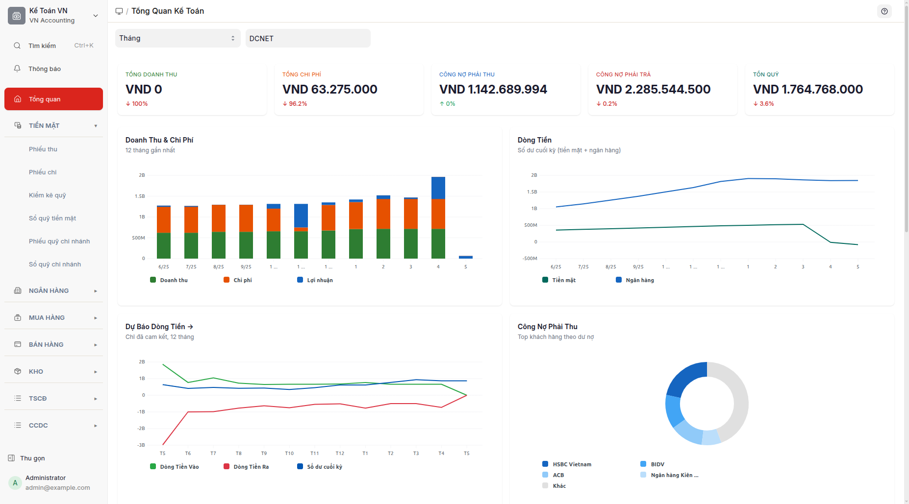

## Mục đích

Phân hệ **Tiền mặt** quản lý mọi nghiệp vụ thu/chi/luân chuyển/kiểm kê liên quan đến quỹ tiền mặt (TK 111). Menu bên trái tập trung vào việc **tra cứu** giao dịch tiền mặt qua các báo cáo chuyên dụng — kế toán viên tạo chứng từ trực tiếp từ hóa đơn bán hàng / hóa đơn mua hàng hoặc từ danh sách phiếu kế toán, không qua menu tạo phiếu.

## Khi nào dùng

- Hằng ngày: tạo phiếu thu/phiếu chi từ nút "Tạo > Phiếu thanh toán" trên hóa đơn bán hàng / hóa đơn mua hàng, hoặc bấm "+ Thêm" trong danh sách phiếu kế toán.
- Cuối ngày: kiểm kê quỹ thực tế, đối chiếu với sổ sách.
- Định kỳ: xem **Sổ quỹ tiền mặt** và **Sổ quỹ chi nhánh** để chốt số dư.
- Cuối tháng/quý/năm: in sổ quỹ và biên bản kiểm kê.

## Cách thực hiện

Cấu trúc menu **Tiền mặt** gồm 6 mục:

| # | Mục | Loại | Mô tả ngắn |
|---|---|---|---|
| 1 | Phiếu thu | Báo cáo | Tổng hợp THU tiền mặt (gồm phiếu kế toán và phiếu thanh toán) |
| 2 | Phiếu chi | Báo cáo | Tổng hợp CHI tiền mặt (gồm phiếu kế toán và phiếu thanh toán) |
| 3 | Kiểm kê quỹ | Danh sách | Biên bản kiểm kê quỹ tiền mặt |
| 4 | Sổ quỹ tiền mặt | Báo cáo | Sổ chi tiết TK 111 |
| 5 | Phiếu quỹ chi nhánh | Danh sách | Phiếu quỹ riêng cho từng chi nhánh |
| 6 | Sổ quỹ chi nhánh | Báo cáo | Tổng hợp quỹ tiền mặt theo chi nhánh |

### Quy trình điển hình

1. **Hằng ngày — tạo chứng từ:** mở hóa đơn bán hàng / hóa đơn mua hàng → bấm "Tạo > Phiếu thanh toán" để sinh phiếu thanh toán; hoặc mở danh sách phiếu kế toán (mục Tổng hợp) → "+ Thêm" để tạo phiếu kế toán PT-/PC-/Cash Entry.
2. **Tra cứu trong ngày:** bấm "Phiếu thu" / "Phiếu chi" để xem báo cáo tổng hợp.
3. **Cuối ngày:** bấm "Kiểm kê quỹ" → "+ Thêm" để lập biên bản; đối chiếu thực tế với "Sổ quỹ tiền mặt".
4. **Định kỳ:** xem "Sổ quỹ chi nhánh" nếu có nhiều chi nhánh; in các báo cáo theo TT133/TT200/TT99.

### Liên kết tới các bài hướng dẫn chi tiết

- **Tạo phiếu thanh toán**: [Thu thanh toán](thu-thanh-toan.md), [Chi thanh toán](chi-thanh-toan.md).
- **Tạo phiếu kế toán**: [Tạo bút toán](tao-but-toan.md) (gồm số hiệu chứng từ PT-/PC-/Cash Entry/Contra).
- **Báo cáo**: [Phiếu thu](phieu-thu.md), [Phiếu chi](phieu-chi.md), [Sổ quỹ tiền mặt](so-quy-tien-mat.md), [Sổ quỹ chi nhánh](so-quy-chi-nhanh.md).
- **Kiểm kê và chi nhánh**: [Kiểm kê quỹ](kiem-ke-quy.md), [Phiếu quỹ chi nhánh](phieu-quy-chi-nhanh.md).

## Định khoản tự động

Phân hệ này không tự động tạo bút toán — kế toán viên định khoản thủ công trong từng phiếu kế toán hoặc phiếu thanh toán. Riêng **Phiếu chi** (phiếu kế toán có số hiệu chứng từ PC-) có hộp thoại chọn loại để gợi ý TK đối ứng phù hợp.

## Tình huống đặc biệt & cảnh báo

- **Hai loại chứng từ tiền mặt:** Phiếu kế toán loại Cash Entry (số hiệu chứng từ PT-/PC-) cho bút toán tổng quát; Phiếu thanh toán phương thức Tiền mặt cho việc thanh toán hóa đơn bán/mua. Hai mục báo cáo **Phiếu thu** / **Phiếu chi** tổng hợp CẢ HAI nguồn — không cần phân biệt khi tra cứu.
- **Giữ menu khi mở chứng từ gốc:** Khi bấm vào dòng trên báo cáo để mở phiếu kế toán hoặc phiếu thanh toán, hệ thống giữ menu ở "VN Accounting" — không bị nhảy sang menu khác.
- **Mất tiền/thừa tiền sau kiểm kê:** xử lý bằng phiếu thu/phiếu chi điều chỉnh với TK 1388/3388 (chờ xử lý) → quyết định ban giám đốc.
- **Quỹ ngoại tệ:** dùng TK 1112; tỷ giá ghi nhận theo ngày phát sinh.

## Báo cáo liên quan

- **Phiếu thu**: tổng hợp THU theo ngày và đối tượng.
- **Phiếu chi**: tổng hợp CHI theo ngày và loại.
- **Sổ quỹ tiền mặt**: sổ chi tiết TK 111 với cột số dư lũy kế.
- **Sổ quỹ chi nhánh**: tổng hợp theo chi nhánh.

## FAQ

**Q: Tại sao không có mục "+ Phiếu thu" / "+ Phiếu chi" trên menu?**
**A:** Menu đã được thiết kế lại theo hướng báo cáo. Tạo phiếu thu/phiếu chi đi qua đường tự nhiên: hóa đơn bán hàng → "Tạo > Phiếu thanh toán"; hoặc danh sách phiếu kế toán → "+ Thêm" với số hiệu chứng từ PT-/PC-. Cách này phản ánh đúng quy trình thực tế (chứng từ đi kèm hóa đơn) và tránh được tình trạng menu nhảy sang phân hệ khác khi bấm vào URL tạo phiếu.

**Q: Mục Phiếu thu/Phiếu chi hiện là báo cáo — có thể tạo phiếu mới từ đó không?**
**A:** Không trực tiếp. Bấm vào dòng trên báo cáo để **mở chứng từ gốc** (xem chi tiết); để tạo mới, mở hóa đơn bán hàng / hóa đơn mua hàng rồi "Tạo > Phiếu thanh toán", hoặc danh sách phiếu kế toán "+ Thêm".

**Q: Có thể đính kèm chứng từ gốc (ảnh giấy biên nhận) lên phiếu không?**
**A:** Có. Mọi chứng từ (phiếu kế toán / phiếu thanh toán / biên bản kiểm kê quỹ / phiếu quỹ chi nhánh) đều có nút "Đính kèm" ở góc dưới.
