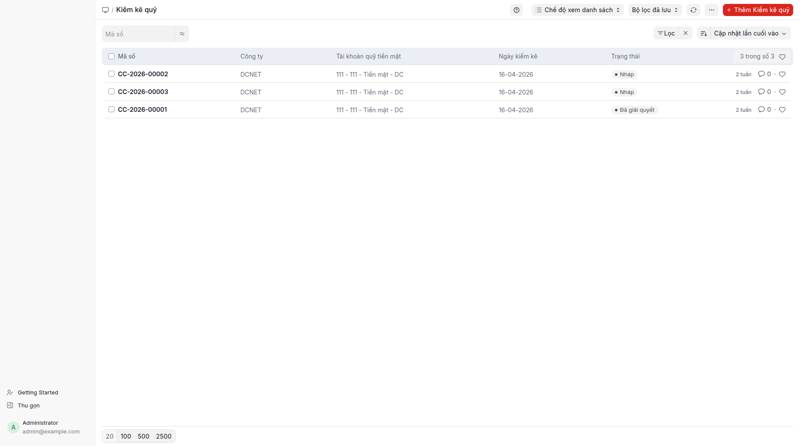

## Mục đích

Biên bản kiểm kê quỹ ghi nhận **kết quả đếm tiền thực tế trong két** so với số dư trên sổ sách kế toán. Đây là chứng từ kiểm soát nội bộ — KHÔNG tạo bút toán tự động. Nếu có chênh lệch, kế toán viên xử lý bằng phiếu thu/phiếu chi điều chỉnh sau khi có quyết định của ban giám đốc.

## Khi nào dùng

- **Cuối ngày làm việc:** kiểm kê quỹ định kỳ (đối với doanh nghiệp tiền mặt nhiều).
- **Cuối tháng/quý:** chốt quỹ định kỳ cho báo cáo tài chính.
- **Cuối năm tài chính:** kiểm kê bắt buộc theo quy định kế toán Việt Nam.
- **Bàn giao thủ quỹ:** thủ quỹ cũ nghỉ → thủ quỹ mới nhận → biên bản kiểm kê là chứng từ pháp lý.
- **Phát hiện nghi vấn mất mát:** kiểm kê đột xuất.

## Cách thực hiện

1. Bấm **Kiểm kê quỹ** trên menu Tiền mặt → danh sách biên bản kiểm kê quỹ mở.
2. Bấm **+ Thêm** (góc trên phải) để tạo biên bản mới → biểu mẫu kiểm kê quỹ mở.
   
3. Chọn **Ngày kiểm kê**, **Công ty**, **Thủ quỹ** (Nhân viên).
4. Trong bảng đếm tiền, nhập số lượng theo từng **mệnh giá** (500.000đ, 200.000đ, 100.000đ, 50.000đ, ...). Hệ thống tự tính tổng = số lượng × mệnh giá.
5. So sánh **Số dư thực tế** (tổng đếm) với **Số dư sổ sách** (TK 1111 trên ngày kiểm kê — lấy từ Sổ quỹ tiền mặt).
6. Ghi chú **Chênh lệch** nếu có (số dư thực tế lớn hơn = thừa, nhỏ hơn = thiếu).
7. Đính kèm chữ ký số/giấy của 3 bên: thủ quỹ, kế toán trưởng, ban giám đốc.
8. Lưu và in biên bản (đã có mẫu in sẵn).

## Định khoản tự động

**Không có** — biên bản kiểm kê quỹ chỉ là chứng từ ghi nhận, không cần ghi sổ. Nếu có chênh lệch:

| Trường hợp | Xử lý |
|---|---|
| Thừa quỹ (đếm > sổ) | Tạo phiếu thu PT-: Nợ 1111 / Có 711 (thu nhập khác — sau khi xử lý nghi vấn) hoặc 3388 (chờ xử lý) |
| Thiếu quỹ (đếm < sổ) | Tạo phiếu chi PC-: Nợ 1388 (phải thu khác — chờ xử lý) / Có 1111 |
| Sau khi có quyết định BGĐ | Phải thu khác 1388 → 642x (chi phí) hoặc 334 (trừ lương thủ quỹ) |

## Tình huống đặc biệt & cảnh báo

- **Thiếu nhỏ (vd 1.000-5.000đ):** thường do làm tròn — xử lý ngay bằng PC- vào TK 6428 (chi phí khác).
- **Thiếu lớn (>100.000đ):** lập biên bản nghi vấn → đợi quyết định BGĐ → xử lý bồi thường thủ quỹ qua TK 1388 → 334.
- **Thừa lớn:** nghi vấn quỹ chưa ghi phiếu thu → kiểm tra lại các giao dịch chưa hạch toán.
- **Quỹ ngoại tệ:** kiểm kê riêng, theo từng loại ngoại tệ (USD, EUR, ...).
- **Quỹ chi nhánh:** mỗi chi nhánh kiểm kê riêng → xem mục **Phiếu quỹ chi nhánh** và **Sổ quỹ chi nhánh**.
- **Biên bản không cần ghi sổ:** lưu là xong. Có thể chỉnh sửa lại sau (vd: thêm chữ ký).

## Báo cáo liên quan

- **Sổ quỹ tiền mặt**: cung cấp số dư sổ sách cho cột "Số dư sổ sách" trong biên bản.
- **Lịch sử kiểm kê:** danh sách các biên bản đã lập.
- **Sổ quỹ chi nhánh**: nếu kiểm kê theo chi nhánh.

## FAQ

**Q: Biên bản kiểm kê quỹ có cần ghi sổ không?**
**A:** Không — biên bản kiểm kê quỹ là chứng từ ghi nhận. Lưu xong là xong, không cần ghi sổ. Nếu có chênh lệch, dùng PT-/PC- riêng để hạch toán.

**Q: Có thể đính kèm ảnh quỹ vào biên bản không?**
**A:** Có. Biểu mẫu kiểm kê quỹ có nút Đính kèm để gắn ảnh khoanh quỹ và giấy biên nhận chữ ký 3 bên.

**Q: Mỗi ngày phải kiểm kê không?**
**A:** Không bắt buộc theo TT133/TT200, nhưng khuyến nghị mạnh đối với doanh nghiệp tiền mặt nhiều (bán lẻ, F&B). Tối thiểu cuối tháng/quý/năm.

**Q: Lỡ ghi sổ phiếu thu sai dẫn đến quỹ sổ sai → kiểm kê thực tế đúng → làm thế nào?**
**A:** Hủy phiếu thu sai → tạo phiếu thu đúng → ghi sổ lại. Biên bản kiểm kê quỹ chỉ là ghi nhận tại thời điểm; nếu sau đó sửa số sổ thì biên bản cũ vẫn hợp lệ (nhưng có thể chỉnh sửa lại để cập nhật số sổ mới).
