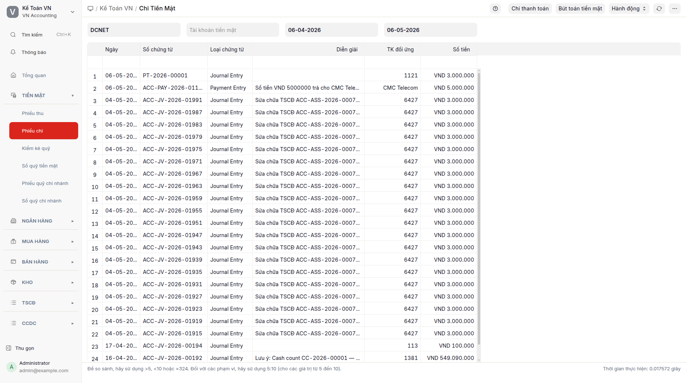
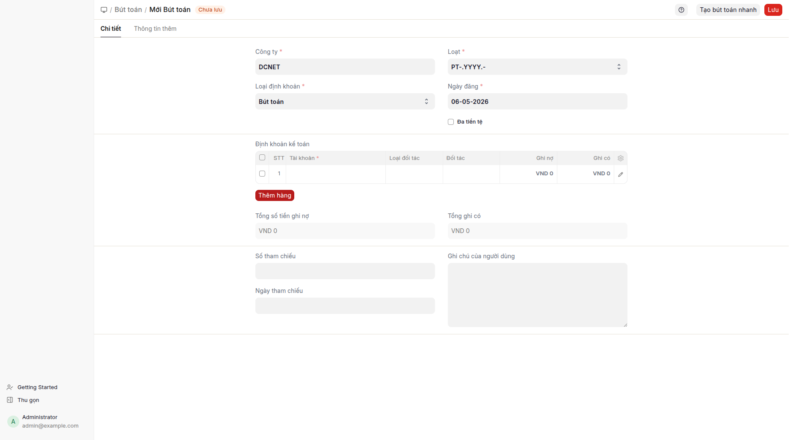

## Mục đích

Báo cáo **Phiếu chi** tổng hợp tất cả giao dịch CHI tiền mặt trong kỳ — gồm phiếu kế toán loại Cash Entry (TK 111 ở vế Có) VÀ phiếu thanh toán phương thức Tiền mặt loại Chi. Mục này là báo cáo; muốn tạo phiếu chi mới, xem [Chi thanh toán](chi-thanh-toan.md) hoặc [Tạo bút toán](tao-but-toan.md).

## Khi nào dùng

- Xem lịch sử CHI tiền mặt theo ngày, theo đối tượng (nhà cung cấp / nhân viên), theo loại chi.
- Bấm vào từng dòng để mở chứng từ gốc.
- Đối chiếu công nợ TK 331 / TK 334 / TK 141 với Sổ quỹ.
- In báo cáo CHI định kỳ cho ban giám đốc.

## Cách thực hiện

1. Bấm **Phiếu chi** trên menu Tiền mặt → báo cáo Phiếu chi mở.
   
2. Lọc theo: Công ty + Từ ngày / Đến ngày + Đối tượng (tùy chọn). Sắp xếp mặc định mới nhất trên cùng theo Ngày ghi sổ.
3. Bấm vào dòng để mở chứng từ gốc; menu vẫn được giữ ở VN Accounting.

### Tạo phiếu chi mới

- **Trả nhà cung cấp từ hóa đơn mua hàng:** mở hóa đơn mua hàng → "Tạo > Phiếu thanh toán" → biểu mẫu phiếu thanh toán đã điền sẵn. Xem [Chi thanh toán](chi-thanh-toan.md).
- **Bút toán tổng quát PC- (nộp thuế, BHXH, lương, tạm ứng, khác):** mở danh sách phiếu kế toán đã lọc theo số hiệu chứng từ `PC-.YYYY.-` → "+ Thêm" → **hộp thoại chọn loại** xuất hiện.

#### Hộp thoại chọn loại (PC-)

Khi mở trực tiếp đường dẫn tạo phiếu kế toán có số hiệu chứng từ PC- (không qua menu), hộp thoại **"Chọn loại phiếu chi"** tự động hiện ra với 6 loại:

| Loại | TK đối ứng | Loại đối tượng |
|---|---|---|
| Trả NCC | 331 | Nhà cung cấp |
| Nộp thuế | 3331 | — |
| Đóng BHXH | 338 | — |
| Trả lương | 334 | Nhân viên |
| Tạm ứng nhân viên | 141 | Nhân viên |
| Khác | (để trống) | — |

Sau khi chọn, biểu mẫu điền sẵn 2 dòng (TK đối ứng ở Nợ, TK 1111 ở Có) với số tiền = 0; kế toán viên nhập số tiền + đối tượng + diễn giải → ghi sổ.

## Định khoản tự động

| Trường hợp | TK Nợ (đối ứng) | TK Có | Ghi chú |
|---|---|---|---|
| Trả nhà cung cấp | 331 (NCC) | 1111 | Cần đối tượng = Nhà cung cấp |
| Nộp thuế GTGT | 3331 | 1111 | Nộp thẳng kho bạc |
| Nộp thuế TNDN | 3334 | 1111 | Quý hoặc năm |
| Đóng BHXH/BHYT/BHTN | 338 | 1111 | Đóng theo tháng |
| Trả lương | 334 (NV) | 1111 | Cần đối tượng = Nhân viên |
| Tạm ứng nhân viên | 141 (NV) | 1111 | Cần đối tượng = Nhân viên |
| Chi văn phòng, tiếp khách | 642x | 1111 | Theo tài khoản chi tiết |
| Mua TSCĐ tiền mặt | 211 + 133 | 1111 | Hiếm — TSCĐ thường mua qua hóa đơn mua hàng |

## Tình huống đặc biệt & cảnh báo

- **Quỹ không đủ tiền:** Hệ thống không chặn — kiểm tra số dư trước khi ghi sổ. Nếu quỹ âm, thường là quên ghi phiếu thu trước hoặc sai ngày.
- **Trả nhà cung cấp nhiều hóa đơn cùng lúc:** Tạo 1 phiếu thanh toán loại Chi với nhiều tham chiếu (hệ thống tự phân bổ), HOẶC 1 phiếu kế toán PC- với nhiều dòng Nợ TK 331 + 1 dòng Có TK 1111.
- **Tạm ứng và quyết toán:** Tạm ứng dùng PC- với TK 141. Quyết toán (nhân viên trả lại dư hoặc bổ sung chi phí) dùng PT- (hoàn) hoặc PC- bổ sung.
- **Nộp thuế nhiều loại trong 1 lần chuyển:** Tách thành nhiều dòng Nợ (3331, 3334, 3335) trong cùng 1 PC-.
- **Sai loại sau khi đã điền sẵn:** Đóng hộp thoại → biểu mẫu trống có 2 dòng đã điền sẵn. Xóa 2 dòng (icon thùng rác) và bắt đầu lại bằng cách tải lại biểu mẫu hoặc bấm lại "+ Thêm".

## Báo cáo liên quan

- **Phiếu thu**: cặp đối ứng.
- **Sổ quỹ tiền mặt**: sổ chi tiết TK 111.
- **Bảng tổng hợp công nợ NCC**: công nợ phải trả theo từng nhà cung cấp.
- **Sổ quỹ chi nhánh**: chi tiết theo chi nhánh.

## FAQ

**Q: Có thể bỏ qua hộp thoại không?**
**A:** Có — chọn **Khác** thì hộp thoại đóng, biểu mẫu trống không điền sẵn, kế toán viên tự định khoản.

**Q: Chọn sai loại có ảnh hưởng đến báo cáo không?**
**A:** Loại chỉ là gợi ý điền sẵn TK đối ứng. Báo cáo dựa vào TK ghi trong bảng định khoản — kế toán viên có thể đổi TK trước khi ghi sổ, loại không thay đổi báo cáo.

**Q: Khi nào dùng phiếu thanh toán loại Chi so với phiếu kế toán PC-?**
**A:** Phiếu thanh toán loại Chi khi trả nhà cung cấp từ hóa đơn mua hàng (thanh toán hóa đơn, phân bổ tự động). Phiếu kế toán PC- cho bút toán tổng quát không gắn với hóa đơn mua hàng (nộp thuế, BHXH, lương, tạm ứng, chi khác).

**Q: Có thể tạo PC- mà không cần chọn đối tượng (cho trả nhà cung cấp) không?**
**A:** Trên phiếu kế toán, đối tượng là tùy chọn. Nếu TK 331 là chung (không chi tiết theo nhà cung cấp), có thể bỏ — nhưng báo cáo công nợ nhà cung cấp sẽ thiếu dữ liệu. Luôn nên chỉ định đối tượng khi TK = 331/334/141.
