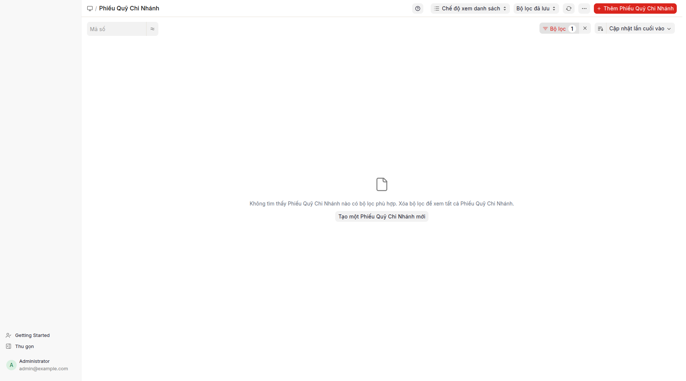

## Mục đích

**Phiếu quỹ chi nhánh** là chứng từ ghi nhận thu/chi tiền mặt riêng cho từng chi nhánh. Dùng khi doanh nghiệp có nhiều chi nhánh, mỗi chi nhánh giữ quỹ tiền mặt riêng (TK 111-CN<X>). Mỗi chi nhánh thu/chi cục bộ; cuối ngày/tháng tổng hợp về quỹ trụ sở chính qua TK 111-NB (luân chuyển nội bộ).

## Khi nào dùng

- Doanh nghiệp đa chi nhánh, mỗi chi nhánh có thủ quỹ riêng.
- Chi nhánh nhỏ thu/chi tiền mặt cục bộ (vd: bán lẻ, dịch vụ tại điểm).
- Cần báo cáo quỹ tách bạch theo chi nhánh (không gộp vào TK 1111 chung).
- Cuối ngày/tháng cần tổng hợp tiền chi nhánh về văn phòng tổng.

## Cách thực hiện

1. Bấm **Phiếu quỹ chi nhánh** trên menu Tiền mặt → danh sách phiếu quỹ chi nhánh mở (đã lọc trạng thái "Đã ghi sổ" để chỉ hiển thị phiếu đã ghi sổ).
   
2. Bấm **+ Thêm** để tạo phiếu mới → biểu mẫu phiếu quỹ chi nhánh mở.
3. Điền các trường:
   - **Chi nhánh**: bắt buộc.
   - **Loại phiếu**: Thu / Chi / Chuyển khoản (chuyển CN ↔ trụ sở chính).
   - **Ngày ghi sổ**: ngày phát sinh.
   - **Số tiền**: VND.
   - **Đối tượng** (tùy chọn): Khách hàng / Nhà cung cấp / Nhân viên tùy loại phiếu.
   - **Diễn giải**: nội dung nghiệp vụ.
4. Lưu và ghi sổ.

## Định khoản tự động

Phiếu quỹ chi nhánh tự định khoản theo loại phiếu. TK chi nhánh dùng tài khoản con `111-CN<X>` của chi nhánh:

| Loại phiếu | TK Nợ | TK Có | Ghi chú |
|---|---|---|---|
| Thu CN | 111-CN<X> | 131/141/511/... | Tùy nguồn thu, chỉ định đối tượng nếu cần |
| Chi CN | 331/334/642x/... | 111-CN<X> | Tùy loại chi, đối tượng theo TK |
| Chuyển CN→trụ sở chính | 111-NB | 111-CN<X> | Chuyển tiền về văn phòng tổng |
| Chuyển trụ sở chính→CN | 111-CN<X> | 111-NB | Văn phòng cấp tiền cho chi nhánh |

## Tình huống đặc biệt & cảnh báo

- **Thiết lập TK chi tiết theo chi nhánh:** Cần cấu hình TK 1111 có tài khoản con `1111-CN1`, `1111-CN2` trong hệ thống tài khoản, hoặc dùng trung tâm chi phí theo chi nhánh để phân quyền.
- **Quyền truy cập:** Thủ quỹ chi nhánh chỉ thấy phiếu của chi nhánh mình. Văn phòng tổng thấy tất cả. Cần cấu hình quyền truy cập theo chi nhánh.
- **Đối chiếu:** Cuối tháng, in **Sổ quỹ chi nhánh** + **Sổ quỹ tiền mặt TK 111-NB** → quỹ TK 111-NB phải bằng sổ tổng. Chênh lệch = phiếu chuyển CN→trụ sở chính chưa hạch toán cả 2 đầu.
- **Đóng kỳ kế toán theo chi nhánh:** Nếu doanh nghiệp đóng kỳ riêng theo chi nhánh, cần phiếu kết chuyển kỳ kế toán với điều kiện lọc theo chi nhánh (không trong phạm vi tài liệu này).
- **Không nhầm với phiếu thu/phiếu chi (TK 1111 chung):** Phiếu quỹ chi nhánh ghi vào TK 111-CN<X> riêng. Phiếu thu/phiếu chi (PT-/PC-) ghi vào TK 1111 chung. Hai luồng khác nhau, báo cáo tách bạch.

## Báo cáo liên quan

- **Sổ quỹ chi nhánh**: tổng hợp phiếu quỹ chi nhánh theo chi nhánh và kỳ.
- **Sổ quỹ tiền mặt**: chỉ TK 1111 chung, không gồm TK 111-CN<X>.
- **Sổ cái kế toán** lọc Tài khoản = 111-CN<X>: chi tiết theo từng chi nhánh.

## FAQ

**Q: Phiếu quỹ chi nhánh khác phiếu kế toán thế nào?**
**A:** Phiếu quỹ chi nhánh chuyên dụng cho luồng quỹ chi nhánh — tự định khoản theo loại phiếu, gắn với chi nhánh. Phiếu kế toán là tổng quát, kế toán viên định khoản thủ công. Phiếu quỹ chi nhánh dễ dùng hơn cho thủ quỹ chi nhánh không rành kế toán.

**Q: Tại sao danh sách lọc trạng thái "Đã ghi sổ"?**
**A:** Mục menu lọc trạng thái "Đã ghi sổ" để chỉ hiển thị phiếu đã ghi sổ (loại trừ nháp và đã hủy). Nếu cần xem nháp, bấm "Filters" → bỏ điều kiện trạng thái → tải lại.

**Q: Phiếu quỹ chi nhánh có in được mẫu không?**
**A:** Có. Mẫu in chuẩn TT133/TT200 đã có sẵn (chữ ký 3 bên: thủ quỹ CN, kế toán CN, lãnh đạo CN).

**Q: Chuyển tiền CN→trụ sở chính thế nào?**
**A:** Tạo phiếu quỹ chi nhánh loại Chuyển khoản, chi nhánh = CN nguồn → ghi Có TK 111-CN, Nợ TK 111-NB. Văn phòng tổng nhận tiền cần ghi đối ứng (phiếu quỹ chi nhánh hoặc phiếu kế toán Contra Entry).
