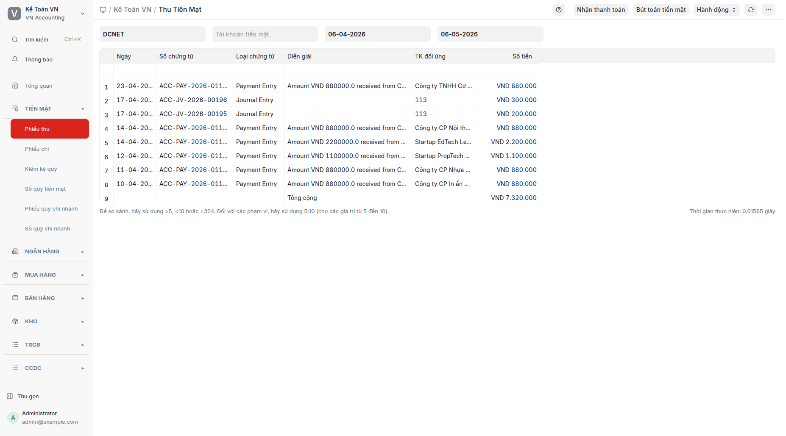

## Mục đích

Báo cáo **Phiếu thu** tổng hợp tất cả giao dịch THU tiền mặt trong kỳ — gồm phiếu kế toán loại Cash Entry (TK 111 ở vế Nợ) VÀ phiếu thanh toán phương thức Tiền mặt loại Thu. Mục này không phải là biểu mẫu tạo phiếu; muốn tạo phiếu thu mới, xem [Thu thanh toán](thu-thanh-toan.md) hoặc [Tạo bút toán](tao-but-toan.md).

## Khi nào dùng

- Xem lịch sử THU tiền mặt theo ngày, theo đối tượng (khách hàng / nhân viên), theo diễn giải.
- Bấm vào từng dòng để mở chứng từ gốc (phiếu kế toán hoặc phiếu thanh toán).
- Đối chiếu với Sổ quỹ tiền mặt cuối ngày/tháng.
- Lọc theo công ty và khoảng ngày để báo cáo định kỳ.

## Cách thực hiện

1. Bấm **Phiếu thu** trên menu Tiền mặt → báo cáo Phiếu thu mở.
   
2. Nhập điều kiện lọc: **Công ty** (mặc định là công ty đang làm việc), **Từ ngày / Đến ngày**, **Đối tượng** (tùy chọn).
3. Bấm **Refresh** → bảng hiển thị các dòng thu, sắp xếp mặc định mới nhất trên cùng (theo Ngày ghi sổ giảm dần).
4. **Xem chứng từ gốc**: bấm vào dòng → mở chứng từ trong tab mới. Menu vẫn được giữ ở "VN Accounting" — không bị nhảy sang phân hệ khác.

### Tạo phiếu thu mới

- Thanh toán hóa đơn bán hàng: mở hóa đơn bán hàng → bấm "Tạo > Phiếu thanh toán" → biểu mẫu phiếu thanh toán đã điền sẵn. Xem [Thu thanh toán](thu-thanh-toan.md).
- Bút toán tổng quát (hoàn tạm ứng, lãi vay, thu khác): mở danh sách phiếu kế toán → "+ Thêm" với số hiệu chứng từ `PT-.YYYY.-`. Xem [Tạo bút toán](tao-but-toan.md).

## Định khoản tự động

Phiếu thu không tự định khoản — kế toán viên chọn TK đối ứng phù hợp. Bảng các bút toán phổ biến:

| Trường hợp | TK Nợ | TK Có | Ghi chú |
|---|---|---|---|
| Khách hàng thanh toán hóa đơn | 1111 | 131 (KH) | Phương thức Tiền mặt; tham chiếu hóa đơn bán hàng |
| Hoàn tạm ứng | 1111 | 141 (NV) | Nhân viên trả lại số tạm ứng dư |
| Doanh thu trực tiếp tiền mặt | 1111 | 511 + 3331 | Bán lẻ không lập hóa đơn |
| Thu nhập khác | 1111 | 711 | Lãi vay, bồi thường |
| Rút tiền ngân hàng về quỹ | 1111 | 1121 | Phiếu kế toán loại Contra Entry |
| Vay ngắn hạn nhập quỹ | 1111 | 341 | Vay tiền mặt từ ngân hàng / cá nhân |

## Tình huống đặc biệt & cảnh báo

- **Tỷ giá ngoại tệ:** Nếu thu USD vào quỹ ngoại tệ (TK 1112), tỷ giá theo ngày phát sinh; chênh lệch tỷ giá ghi vào TK 515/635.
- **Thu kèm thuế GTGT đầu ra:** Khi bán lẻ thu trực tiếp và có hóa đơn GTGT, định khoản 511 + 3331 ở phía Có.
- **Phiếu thu khống/sai:** Đã ghi sổ rồi mới phát hiện sai → Hủy chứng từ và tạo phiếu điều chỉnh, KHÔNG sửa trực tiếp phiếu cũ.
- **Quỹ âm sau lọc:** Hệ thống không chặn quỹ âm trong báo cáo; nếu Sổ quỹ báo số dư âm, kiểm tra ngay (thường do quên ghi phiếu thu hoặc sai ngày).
- **Đối chiếu cuối kỳ:** Tổng cột Nợ của báo cáo Phiếu thu trong kỳ phải khớp với tổng phát sinh Nợ TK 111 trên Sổ quỹ tiền mặt cùng kỳ.

## Báo cáo liên quan

- **Phiếu chi**: cặp đối ứng với Phiếu thu.
- **Sổ quỹ tiền mặt**: sổ chi tiết TK 111 với cột số dư lũy kế.
- **Sổ quỹ chi nhánh**: tổng hợp theo chi nhánh.
- **Bảng cân đối số phát sinh**: kiểm tra tổng phát sinh và số dư TK 111 cuối kỳ.

## FAQ

**Q: Tại sao Phiếu thu lại là báo cáo chứ không phải biểu mẫu?**
**A:** Trước đây menu có URL tạo phiếu trực tiếp. Cách này có 2 vấn đề: (1) không bao quát phiếu thanh toán — khách hàng thanh toán hóa đơn qua phiếu thanh toán chứ không qua phiếu kế toán; (2) URL tạo phiếu gây hiện tượng menu nhảy sang phân hệ khác. Thiết kế lại theo hướng báo cáo giải quyết cả hai: bao quát cả hai nguồn chứng từ, dùng đường tự nhiên (Tạo > Phiếu thanh toán từ hóa đơn) cho việc tạo mới.

**Q: Khi mở chứng từ gốc có giữ được menu VN Accounting không?**
**A:** Có. Hệ thống đăng ký phiếu kế toán và phiếu thanh toán thuộc về phân hệ VN Accounting → bấm vào dòng → mở chứng từ → menu vẫn ở VN Accounting.

**Q: Khi nào dùng phiếu kế toán PT- so với phiếu thanh toán loại Thu?**
**A:** Phiếu thanh toán loại Thu khi có hóa đơn bán hàng cần thanh toán. Phiếu kế toán PT- cho bút toán tổng quát không có hóa đơn (hoàn tạm ứng, lãi vay, thu khác). Cả hai cùng xuất hiện trong báo cáo Phiếu thu.

**Q: Một dòng trên báo cáo có thể là phiếu thanh toán hoặc phiếu kế toán — phân biệt thế nào?**
**A:** Cột "Loại chứng từ" hiển thị "Phiếu thanh toán" hoặc "Phiếu kế toán". Bấm vào dòng để xem chi tiết chứng từ.
