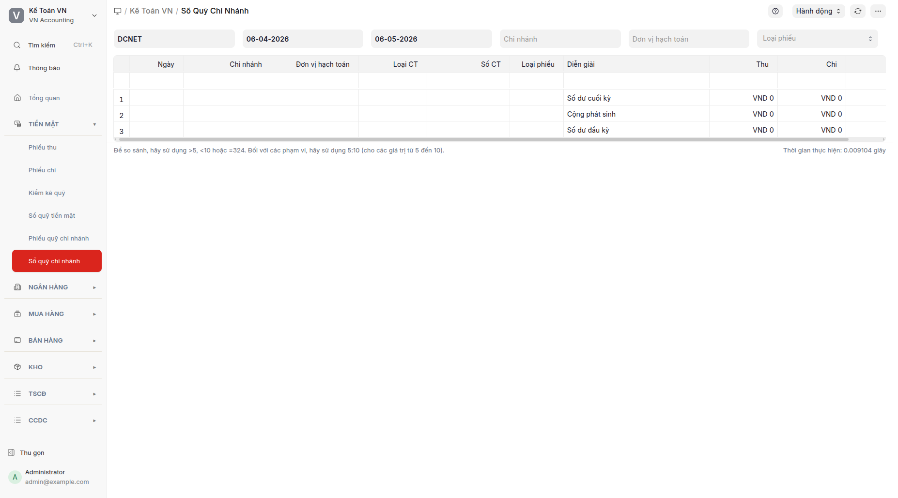

## Mục đích

Đối với doanh nghiệp **đa chi nhánh**, mỗi chi nhánh có quỹ tiền mặt riêng (TK 111-CN1, TK 111-CN2, ...). Báo cáo **Sổ quỹ chi nhánh** tổng hợp các phiếu quỹ phát sinh tại từng chi nhánh và cho phép đối chiếu liên chi nhánh ↔ quỹ tổng. Mục này là báo cáo; phiếu quỹ chi nhánh được tạo từ [Phiếu quỹ chi nhánh](phieu-quy-chi-nhanh.md).

## Khi nào dùng

- Doanh nghiệp có nhiều chi nhánh, mỗi chi nhánh có thủ quỹ riêng.
- Cuối tháng: in sổ quỹ từng chi nhánh để gửi về văn phòng tổng.
- Đối chiếu sổ quỹ giữa chi nhánh và sổ tổng (TK 111-NB ↔ TK 111-CN).
- Theo dõi luân chuyển tiền giữa các chi nhánh (vd: CN1 chuyển tiền ra CN2 qua TK trung gian).

## Cách thực hiện

1. Bấm **Sổ quỹ chi nhánh** trên menu Tiền mặt → báo cáo Sổ quỹ chi nhánh mở.
   
2. Lọc theo: **Chi nhánh**, **Từ ngày / Đến ngày**, **Công ty**.
3. Bấm **Refresh** → bảng hiển thị các phiếu thu/phiếu chi của chi nhánh trong kỳ + số dư đầu kỳ + số dư cuối kỳ. Sắp xếp mặc định mới nhất trên cùng theo Ngày ghi sổ.
4. Bấm vào dòng để xem chứng từ gốc (phiếu quỹ chi nhánh).

### Tạo phiếu quỹ chi nhánh

Từ mục **Phiếu quỹ chi nhánh** → danh sách → "+ Thêm". Xem [Phiếu quỹ chi nhánh](phieu-quy-chi-nhanh.md) cho hướng dẫn chi tiết.

## Định khoản tự động

Báo cáo này chỉ hiển thị các bút toán đã ghi sổ. Định khoản gốc nằm trong phiếu quỹ chi nhánh — xem [Phiếu quỹ chi nhánh](phieu-quy-chi-nhanh.md):

| Loại | TK Nợ | TK Có | Ghi chú |
|---|---|---|---|
| Thu chi nhánh | 1111-CN | 131/141/511/... | Đồng bộ vào sổ chi nhánh |
| Chi chi nhánh | 331/334/.../642x | 1111-CN | Đồng bộ vào sổ chi nhánh |
| Chuyển tiền CN→Tổng | 1111-NB | 1111-CN | Khi CN chuyển tiền về văn phòng tổng |
| Chuyển tiền Tổng→CN | 1111-CN | 1111-NB | Khi văn phòng tổng cấp tiền cho CN |

## Tình huống đặc biệt & cảnh báo

- **Thiết lập TK chi tiết theo chi nhánh:** Cần cấu hình TK 1111 có tài khoản con `1111-CN1`, `1111-CN2` trong hệ thống tài khoản, hoặc dùng trung tâm chi phí để phân quyền chi nhánh.
- **Quyền truy cập:** Thủ quỹ chi nhánh chỉ thấy phiếu quỹ của chi nhánh mình. Văn phòng tổng thấy tất cả. Quyền này được kiểm soát qua cấu hình quyền truy cập trong phần mềm.
- **Đối chiếu:** Cuối tháng, in **Sổ quỹ chi nhánh** + **Sổ tổng** → quỹ TK 1111-NB phải = sổ tổng. Nếu chênh lệch → có phiếu chuyển CN→Tổng chưa hạch toán cả 2 đầu.
- **Báo cáo Sổ quỹ chi nhánh** là báo cáo nội bộ, dự kiến đổi tên hiển thị trong bản phát hành tiếp theo (giữ nguyên đường dẫn để liên kết không vỡ).

## Báo cáo liên quan

- **Sổ quỹ tiền mặt**: TK 1111 chung của công ty.
- **Sổ cái kế toán**: lọc Tài khoản = 111-CN<X> cho chi tiết hơn.

## FAQ

**Q: Phiếu quỹ chi nhánh khác phiếu thu/phiếu chi tổng (PT-/PC-) thế nào?**
**A:** Phiếu thu/phiếu chi tổng (PT-/PC-) ghi vào TK 1111 chung của công ty. Phiếu quỹ chi nhánh ghi vào TK 1111-CN<X> riêng của chi nhánh. Quy mô báo cáo và quyền truy cập khác nhau.

**Q: Cần cấu hình gì để dùng phiếu quỹ chi nhánh?**
**A:** Cần (1) tạo Chi nhánh trong hệ thống, (2) cấu hình tài khoản con TK 1111-CN<X> cho từng chi nhánh, (3) phân quyền người dùng theo chi nhánh.

**Q: Tại sao tên báo cáo nội bộ không có dấu tiếng Việt?**
**A:** Hệ thống bỏ dấu khỏi tên báo cáo theo quy tắc đặt tên kỹ thuật. Hiển thị ra giao diện đã được dịch sang tiếng Việt đầy đủ. Dự kiến sẽ đổi tên hiển thị trong bản phát hành sau (giữ đường dẫn để liên kết không vỡ).
