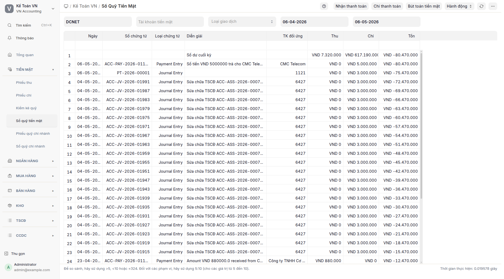

## Mục đích

**Sổ quỹ tiền mặt** là sổ kế toán chi tiết quỹ tiền mặt — TK 111 (1111 nội tệ, 1112 ngoại tệ). Hiển thị toàn bộ phát sinh Nợ/Có theo trình tự thời gian và cột số dư lũy kế. Mẫu sổ tương ứng với S07-DN (TT133), S07-DNN (TT200) hoặc S07 (TT99/2025).

## Khi nào dùng

- **Cuối ngày/tuần:** đối chiếu sổ với thực tế quỹ. Số dư cuối kỳ trên Sổ quỹ tiền mặt = tổng đếm trong biên bản kiểm kê quỹ.
- **Cuối tháng/quý/năm:** in sổ quỹ theo mẫu thông tư để đóng quyển và ký chữ.
- **Tra cứu chi tiết:** xem 1 dòng cụ thể (PT/PC/Cash Entry) → mở chứng từ gốc.
- **Đối chiếu công nợ:** so sánh tổng phát sinh Nợ/Có với báo cáo Phiếu thu / Phiếu chi cùng kỳ.

## Cách thực hiện

1. Bấm **Sổ quỹ tiền mặt** trên menu Tiền mặt → báo cáo Sổ quỹ tiền mặt mở.
   
2. Lọc theo: **Công ty** (mặc định) + **Từ ngày / Đến ngày** + **Tài khoản** (mặc định 1111). Bấm **Refresh**.
3. Bảng hiển thị: Ngày | Chứng từ | Diễn giải | Nợ | Có | Số dư.
4. **Logic sắp xếp**: số dư lũy kế được tính theo thứ tự thời gian tăng dần (cũ trước → mới sau, cộng dồn) rồi đảo ngược để hiển thị mới nhất trên cùng. Mỗi dòng vẫn giữ đúng số dư tại thời điểm phát sinh.
5. Bấm vào một dòng để xem chứng từ gốc.

## Định khoản tự động

Sổ quỹ tiền mặt là báo cáo, không tự định khoản. Hiển thị các phát sinh từ:

| Nguồn chứng từ | TK ghi sổ | Ghi chú |
|---|---|---|
| Phiếu kế toán PT- | Nợ 1111 | Thu tiền mặt |
| Phiếu kế toán PC- | Có 1111 | Chi tiền mặt |
| Phiếu kế toán Cash Entry / Contra Entry | Nợ/Có 1111 | Bút toán tiền mặt khác |
| Phiếu thanh toán phương thức Tiền mặt loại Thu | Nợ 1111 | Thu thanh toán |
| Phiếu thanh toán phương thức Tiền mặt loại Chi | Có 1111 | Chi thanh toán |

## Tình huống đặc biệt & cảnh báo

- **Phiếu kết chuyển kỳ kế toán:** nếu kỳ chứa phiếu kết chuyển (đóng kỳ kế toán), số dư lũy kế reset về 0 ở thời điểm đóng kỳ → số dư sau đó tính lại từ 0. Đây là hành vi đúng theo TT133/TT200.
- **Phiếu ghi lùi ngày:** chứng từ ghi sổ ngược thời gian (ngày ghi sổ trong quá khứ) cần kiểm tra lại trước khi lưu, vì hệ thống có thể tự đổi về hôm nay → số dư bị lệch tại các điểm cũ.
- **Quỹ ngoại tệ (TK 1112):** đổi điều kiện lọc Tài khoản = 1112 để xem sổ riêng cho từng ngoại tệ; tỷ giá hiển thị theo từng dòng.
- **Số dư âm:** nếu số dư âm tại bất kỳ điểm nào, có dấu hiệu sai (quên PT- hoặc PC- thừa). Đối chiếu chéo với báo cáo Phiếu thu và Phiếu chi.
- **Mẫu in S07-DN:** in chính thức theo TT133/TT200 đã có mẫu in riêng (không trong phạm vi tài liệu này).

## Báo cáo liên quan

- **Phiếu thu**: chỉ riêng phát sinh Nợ.
- **Phiếu chi**: chỉ riêng phát sinh Có.
- **Sổ quỹ chi nhánh**: tổng hợp theo chi nhánh (TK 111-CN).
- **Bảng cân đối số phát sinh**: tổng phát sinh và số dư TK 111 cuối kỳ.
- **Sổ cái kế toán**: chi tiết hơn cả Sổ quỹ tiền mặt (gồm tất cả TK).

## FAQ

**Q: Tại sao mặc định sắp xếp mới nhất trên cùng?**
**A:** Cách "mới nhất trên cùng" giúp kế toán mở sổ thấy ngay giao dịch hôm nay (trường hợp phổ biến nhất là tra cứu mới). Số dư lũy kế vẫn tính theo thứ tự thời gian đúng (cộng dồn từ cũ → mới) → từng dòng vẫn đúng số dư tại thời điểm phát sinh, chỉ thứ tự hiển thị là mới trước.

**Q: Sổ quỹ tiền mặt khác Sổ cái TK 111 thế nào?**
**A:** Sổ quỹ tiền mặt là cách gọi của S07 (sổ quỹ chi tiết), tập trung vào quỹ tiền mặt với cột số dư lũy kế. Sổ cái TK 111 (Sổ cái kế toán lọc Tài khoản=1111) hiển thị định dạng kế toán chuẩn hơn (Nợ/Có 2 cột rõ rệt). Cùng dữ liệu nhưng cách trình bày khác.

**Q: In Sổ quỹ tiền mặt theo TT133/TT200 thế nào?**
**A:** Sau khi mở báo cáo, bấm "In" → chọn mẫu in "S07-DN" (đã có sẵn). Mẫu này đúng TT133/TT200/TT99 với chữ ký 3 bên.

**Q: Khi mở chứng từ gốc có giữ menu VN Accounting không?**
**A:** Có. Phiếu kế toán và phiếu thanh toán đều được đăng ký thuộc về phân hệ VN Accounting → bấm vào dòng → mở chứng từ → menu không nhảy.
