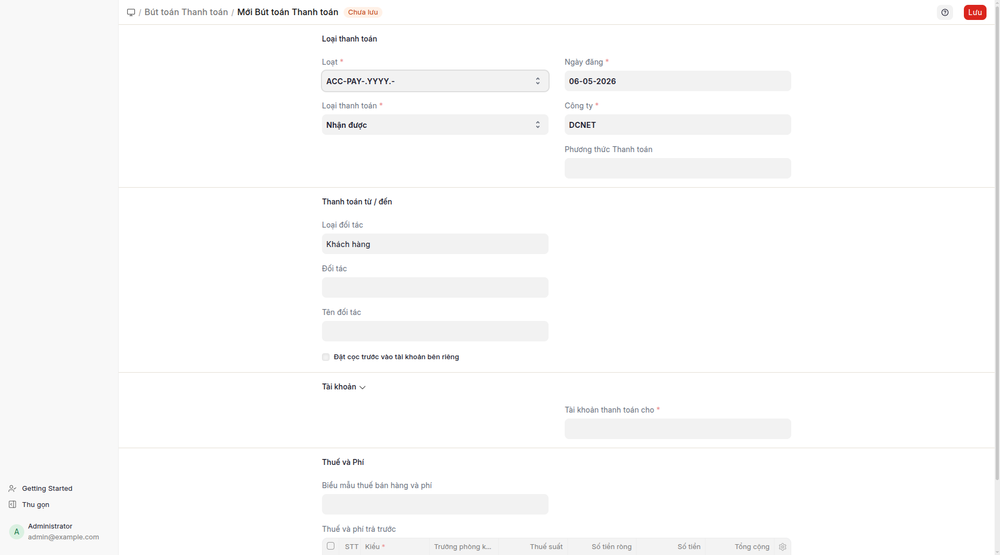

## Mục đích

**Phiếu thanh toán loại Thu** là chứng từ thu tiền chuẩn — dùng để thanh toán cho 1 hoặc nhiều hóa đơn bán hàng. Có thể là tiền mặt (phương thức Tiền mặt → ghi vào TK 1111) hoặc chuyển khoản (phương thức Chuyển khoản → ghi vào TK 1121). Khi phương thức là Tiền mặt, giao dịch tự động hiện trên báo cáo Phiếu thu.

## Khi nào dùng

- **Khách hàng thanh toán hóa đơn bán hàng:** quy trình chuẩn từ hóa đơn bán hàng → "Tạo > Phiếu thanh toán". Phiếu thanh toán tự động điền sẵn đối tượng + tham chiếu hóa đơn + số tiền.
- **Thu tạm ứng từ khách hàng chưa có hóa đơn:** phiếu thanh toán loại Thu không có tham chiếu hóa đơn (thu trước) → sau này phân bổ khi có hóa đơn.
- **Thu nhiều hóa đơn cùng lúc:** phiếu thanh toán tham chiếu nhiều hóa đơn; người dùng nhập số tiền → hệ thống tự động phân bổ theo thứ tự (hóa đơn cũ trước).
- **Thu tiền cho ứng trước:** phiếu thanh toán với tài khoản ghi nhận = TK 131 (KH ứng trước) thay vì xóa nợ trên hóa đơn.

## Cách thực hiện

### Quy trình tự nhiên (khuyến nghị)

1. Mở **hóa đơn bán hàng** đã ghi sổ → bấm **Tạo > Phiếu thanh toán**.
2. Biểu mẫu phiếu thanh toán mở với các trường đã điền sẵn:
   - Loại Thu, Loại đối tượng = Khách hàng, Đối tượng = khách hàng của hóa đơn
   - Tham chiếu = hóa đơn bán hàng đó, Số tiền = số tiền còn nợ
   - Ngày ghi sổ = hôm nay
   
3. Chọn **Phương thức thanh toán**: Tiền mặt (TK 1111) hoặc Chuyển khoản (TK 1121, kèm số tham chiếu, ngày tham chiếu).
4. (Tùy chọn) Điều chỉnh số tiền nếu chỉ thu một phần.
5. Lưu và ghi sổ.

### Quy trình thủ công (không qua hóa đơn bán hàng)

1. Mở **danh sách phiếu thanh toán** → "+ Thêm" → biểu mẫu mới.
2. Chọn loại Thu, Loại đối tượng = Khách hàng, Đối tượng = khách hàng.
3. Nhập số tiền, chọn phương thức thanh toán.
4. (Tùy chọn) Thêm tham chiếu → chọn 1 hoặc nhiều hóa đơn bán hàng còn nợ.
5. Lưu và ghi sổ.

## Định khoản tự động

Phiếu thanh toán loại Thu tự định khoản dựa trên phương thức thanh toán và tham chiếu:

| Phương thức | TK Nợ | TK Có | Ghi chú |
|---|---|---|---|
| Tiền mặt | 1111 | 131 (KH) | Hiện trên báo cáo Phiếu thu |
| Chuyển khoản | 1121 | 131 (KH) | Hiện trên đối chiếu ngân hàng |
| Chuyển khoản (USD) | 1121 (USD) | 131 (KH USD) | Tỷ giá theo ngày |

Nếu là thu trước (không tham chiếu hóa đơn): TK 131 (KH) ghi Có như "thu trước" → khi gắn với hóa đơn sau, tự phân bổ lại.

## Tình huống đặc biệt & cảnh báo

- **Tỷ giá ngoại tệ:** Phiếu thanh toán đa tiền tệ có chênh lệch tỷ giá thực hiện → hệ thống tự ghi vào TK 515/635 khi tỷ giá ngày thu khác ngày phát hóa đơn.
- **Số tiền không khớp:** Phiếu thanh toán > tổng hóa đơn → số tiền dư ghi vào TK 131 (thu trước). Phiếu thanh toán < tổng hóa đơn → hóa đơn vẫn còn nợ một phần.
- **Giữ menu khi mở chứng từ gốc:** Phiếu thanh toán được đăng ký thuộc về phân hệ VN Accounting. Mở phiếu thanh toán từ báo cáo Phiếu thu → menu không nhảy sang phân hệ khác.
- **Nhiều hóa đơn trên 1 phiếu thanh toán:** Hệ thống tự phân bổ theo thứ tự (hóa đơn cũ trước). Nếu kế toán muốn phân bổ khác → chỉnh thủ công trong bảng tham chiếu.
- **Hủy phiếu thanh toán:** Hủy phiếu thanh toán sẽ mở lại hóa đơn liên quan (số tiền còn nợ tăng lại). Không nên hủy khi tiền đã thu thực — dùng phiếu kế toán điều chỉnh thay thế.
- **Gắn nhiều đối tượng:** Phiếu thanh toán chỉ 1 đối tượng. Nếu thu 1 lần cho nhiều khách hàng khác nhau → tạo nhiều phiếu thanh toán riêng (1 phiếu/khách hàng).

## Báo cáo liên quan

- **Phiếu thu**: hiện phiếu thanh toán loại Thu phương thức Tiền mặt.
- **Sổ quỹ tiền mặt**: hiện đầy đủ phát sinh Nợ TK 1111.
- **Bảng tổng hợp công nợ KH**: công nợ khách hàng theo từng đối tượng.
- **Sổ chi tiết bán hàng**: danh sách hóa đơn bán hàng theo trạng thái thanh toán.

## FAQ

**Q: Khi nào dùng phiếu thanh toán loại Thu so với phiếu kế toán Cash Entry (PT-)?**
**A:** Phiếu thanh toán loại Thu khi có hóa đơn bán hàng cần thanh toán (gắn với hóa đơn, tự động cập nhật số nợ). Phiếu kế toán PT- cho bút toán không gắn hóa đơn (hoàn tạm ứng, lãi vay, thu khác). Cả hai cùng xuất hiện trên báo cáo Phiếu thu.

**Q: Phiếu thanh toán bị kẹt ở "Đã ghi sổ nhưng chưa đối chiếu" — sao?**
**A:** Nếu phương thức là Chuyển khoản, phiếu thanh toán cần đối chiếu với giao dịch ngân hàng (qua phân hệ Ngân hàng). Phương thức Tiền mặt không cần đối chiếu, ghi sổ là xong.

**Q: Khách hàng ứng trước nhưng chưa có hóa đơn — quy trình?**
**A:** Tạo phiếu thanh toán loại Thu không có tham chiếu → ghi Có TK 131 thu trước. Khi hóa đơn ra sau, mở hóa đơn → "Phân bổ thanh toán" → chọn phiếu thanh toán thu trước → hệ thống tự gắn lại.

**Q: Sau khi bấm "Tạo > Phiếu thanh toán", biểu mẫu không điền sẵn — sao?**
**A:** Có thể hóa đơn chưa ghi sổ (vẫn nháp) hoặc đã thanh toán đủ (hết nợ). Kiểm tra trạng thái hóa đơn trước.
