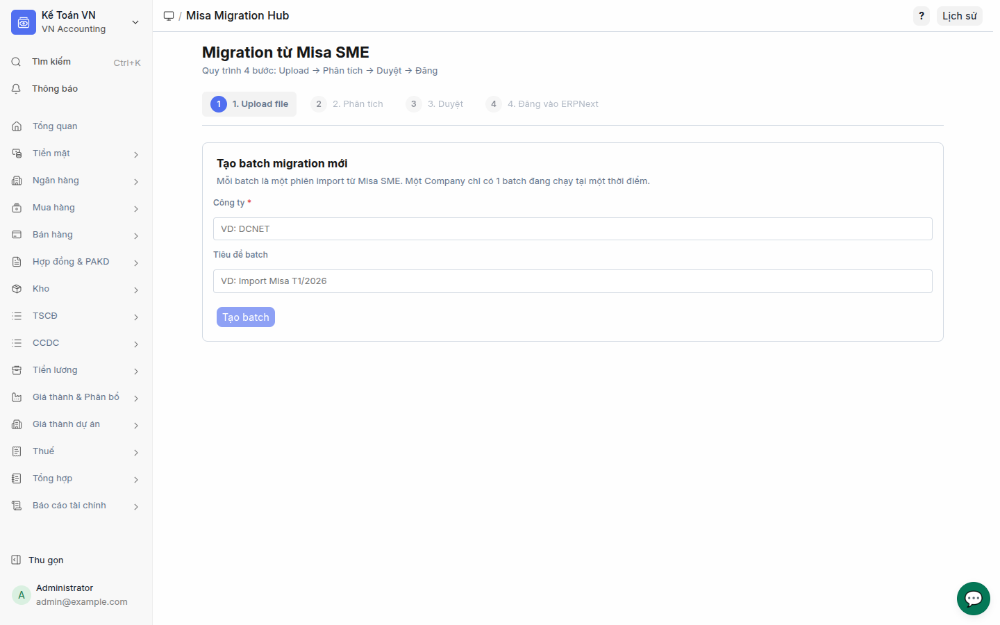
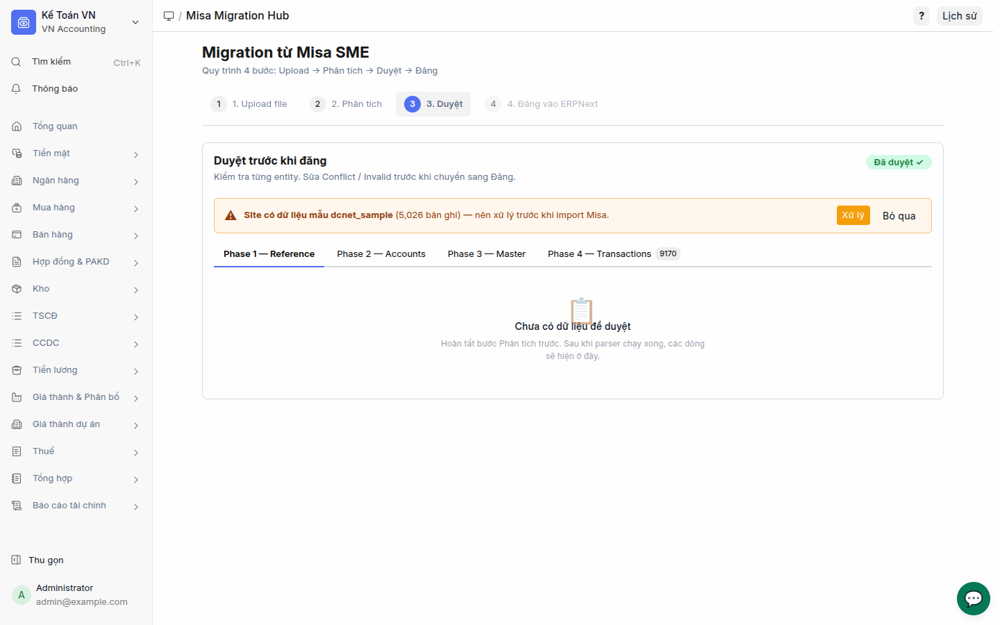
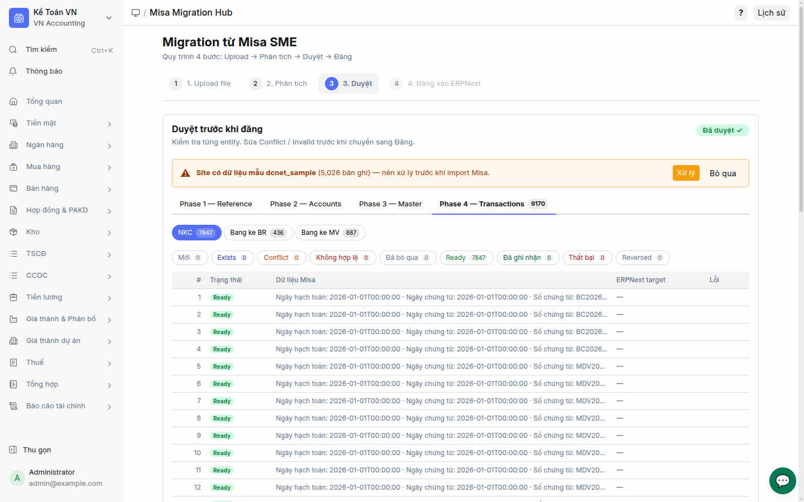
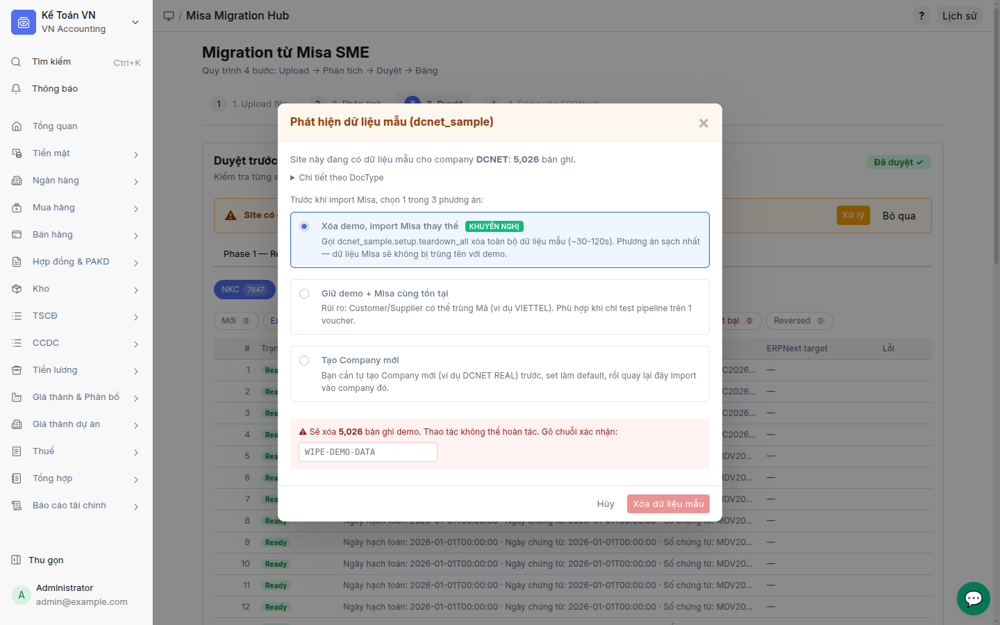
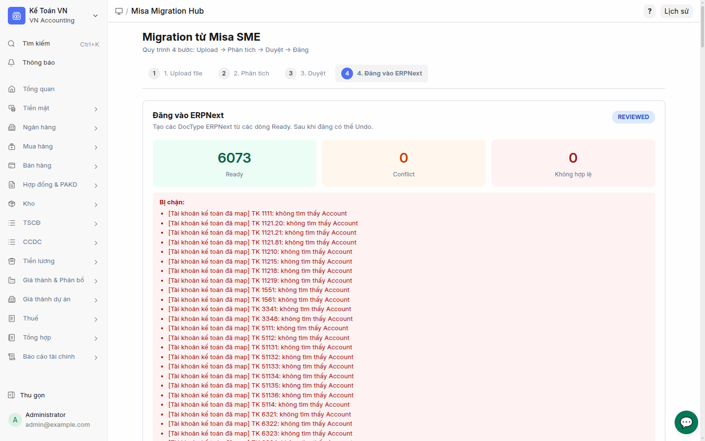
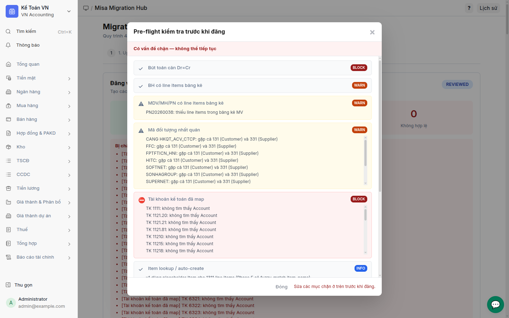
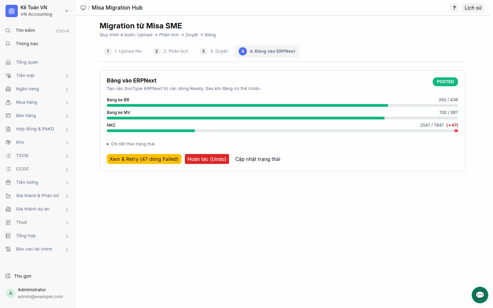
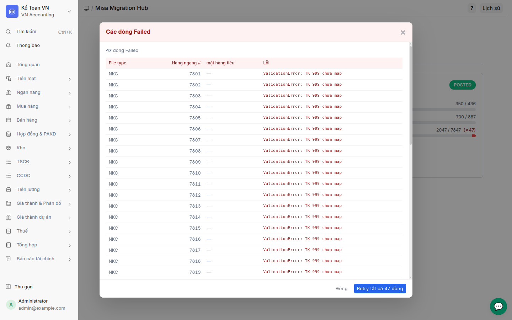
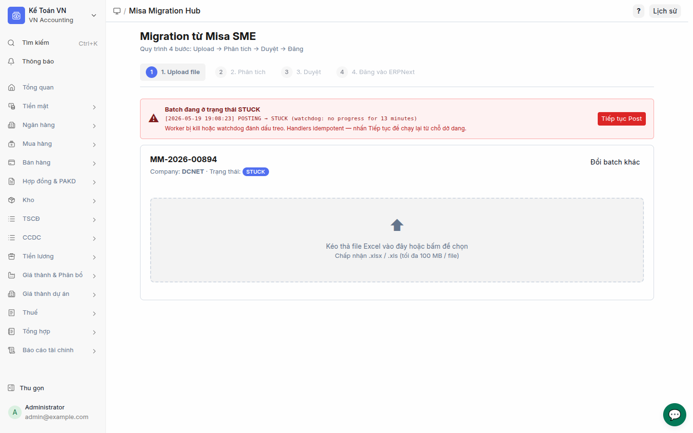

# Misa Migration — Screenshot Tour

A walkthrough of `/app/misa-migration-hub` with the actual T1/2026 dataset
loaded. Screenshots captured 2026-05-19 via Playwright on dev site.

All screenshots are in `screenshots/` next to this file.

## 1. Upload step — empty hub



First-time view. Stepper shows 4 steps; **Step 1 — Upload file** is active.
"Tạo batch migration mới" card asks for Company + Batch title. After
clicking **Tạo batch** the form switches to a drag-and-drop file area.

## 2. Review step with demo data banner



After Parse completes the batch reaches **REVIEWED** status. The
**ReviewStep** opens with:

- **"Đã duyệt ✓"** green badge top right — confirms parse + review pass
- **Yellow demo-data banner** (E2): _"Site có dữ liệu mẫu dcnet_sample
  (5,026 bản ghi) — nên xử lý trước khi import Misa."_ with **Xử lý** /
  **Bỏ qua** actions
- **4 phase tabs**: Phase 1 — Reference / Phase 2 — Accounts /
  Phase 3 — Master / **Phase 4 — Transactions (9170)** — Phase 4 was
  the deferred tab pre-D-C14; now enabled with row count
- **Empty state** (E8): _"Chưa có dữ liệu để duyệt — Hoàn tất bước
  Phân tích trước. Sau khi parser chạy xong, các dòng sẽ hiện ở đây."_
  shown when current phase has no rows. Reusable `EmptyState.vue`.

## 3. Review step — Phase 4 sub-tabs



Clicking **Phase 4 — Transactions** reveals three file-type sub-tabs:
**NKC (7847) / Bang ke BR (436) / Bang ke MV (887)**. Each row shows:

- Status badge (New / Ready / Conflict / Invalid / Posted / Failed)
- Raw Misa payload preview (Vietnamese keys verbatim)
- ERPNext target (filled after Post)
- Error message column for Failed / Invalid

## 4. DemoDataDialog — 3 options



Click **Xử lý** on the demo banner → `DemoDataDialog.vue` opens. Three
options:

1. **Xóa demo, import Misa thay thế (Khuyến nghị)** — calls
   `dcnet_sample.setup.teardown_all`. Requires typing **`WIPE-DEMO-DATA`**
   as the safety token before the **Xóa dữ liệu mẫu** button enables.
   Synchronous; sites with 5-15k rows take 30-120s.
2. **Giữ demo + Misa cùng tồn tại** — coexist mode; warning about name
   collisions (Customer "VIETTEL" demo vs real, etc.).
3. **Tạo Company mới** — user creates "DCNET REAL" Company manually then
   re-runs the import into the new company.

Details breakdown by DocType (Customer/Supplier/Item/SI/PI/PE/JE/SE/
Project/Cost Center) available under the **Chi tiết theo DocType**
collapsible.

## 5. Post step — REVIEWED with preflight



After Mark Reviewed, **Step 4 — Đăng vào ERPNext** becomes active. The
PostStep shows:

- **3 metric cards**: Ready (6073) / Conflict (0) / Invalid (0)
- **Inline blocked list** — real preflight output. Each line is one
  block-level check failure. In this screenshot: Phase D's TK-mapping
  check is catching ~6k vouchers whose accounts (TK 11218 / 11215 /
  11219 / 1561 / ...) aren't yet mapped to ERPNext Account names. The
  dev site has only 3 of the ~260 mappings populated.
- **Xem chi tiết pre-flight** link below opens the structured dialog.

This screenshot is the **acceptance gate evidence** for D-C13: the
preflight pipeline runs on real T1/2026 data and blocks Post until
mappings are complete.

## 6. PreflightDialog — structured 10-check breakdown



`PreflightDialog.vue` consumes the C13 structured envelope
(`{status, checks: [{name, label, level, passed, issues}]}`). Each row
shows:

- **Icon** (✓ pass / ⛔ block / ⚠ warn / ℹ info)
- **Label** in Vietnamese
- **Level badge** (block / warn / info)
- **Issues list** when the check failed (collapsed with max-height +
  overflow scroll for huge lists like the TK-mapping case here)

Status banner at the top: _"Có vấn đề chặn — không thể tiếp tục"_ when
any block-level check fails. Footer shows _"Sửa các mục chặn ở trên
trước khi đăng."_ instead of the Tiếp tục button.

## 7. Post step — POSTED with progress + retry



After a successful (or partial) Post run:

- **POSTED** green badge top right
- **Per-entity progress bars** (E8 + D-C14):
  - Bang ke BR: 350 / 436 (green ~80%)
  - Bang ke MV: 700 / 887 (green ~79%)
  - NKC: 2047 / 7847 + **`✗47`** in red — 47 rows ended Failed
- **Chi tiết theo trạng thái** collapsible — full count breakdown per
  status (Posted / Failed / Ready / Reversed)
- **Three actions**:
  - **Xem & Retry (47 dòng Failed)** yellow — opens FailedRowsModal
  - **Hoàn tác (Undo)** red — runs constraint check first; if external
    dependents exist, prompts for `force=true` bypass
  - **Cập nhật trạng thái** — refresh batch state from server

## 8. FailedRowsModal — error inspection



Lists every Failed row with full error message and Misa context.
Columns: **File type / Hàng ngang # / Mặt hàng tiêu / Lỗi**. Footer
shows **Retry tất cả 47 dòng** which:

1. Resets the Failed rows back to Ready
2. Force-transitions the batch from POSTED → REVIEWED via
   `frappe.db.set_value` (POSTED → REVIEWED is not a state-machine
   transition, so this bypass is auditeded in the batch's notes field)
3. Delegates to `start_post` for a re-run; handlers' `frappe.db.exists`
   idempotency check leaves already-Posted vouchers untouched

## 9. ResumeBanner — STUCK recovery



When `jobs/watchdog.check_stuck_batches` (cron every 5 min) marks a
batch STUCK after 10 minutes of idle, this red banner appears on every
step view (mounted in `App.vue`). It surfaces:

- Status callout: _"Batch đang ở trạng thái STUCK"_
- **Last STUCK transition line** parsed from `batch.notes`, showing the
  watchdog's audit entry: `[ts] POSTING → STUCK (watchdog: no progress
  for 13 minutes)`
- Reassurance: _"Worker bị kill hoặc watchdog đánh dấu treo. Handlers
  idempotent — nhấn Tiếp tục để chạy lại từ chỗ dở dang."_
- **Tiếp tục Post** red button → `store.resumePost()` transitions
  STUCK → REVIEWED + re-enqueues `post_batch`

## How to reproduce the tour

Programmatic batch injection (no UI upload needed) — used to capture
these screenshots without doing a full multi-hour Phase 1+2+3 import:

```python
# Inject T1/2026 NKC+BR+MV rows into a fresh batch in REVIEWED state.
# Save the script under apps/vn_accounting/vn_accounting/misa_migration/
# scripts/inject_demo_batch.py (already runnable from any bench env).
import sys
sys.path.insert(0, '/home/long/long/frappe-bench-dcnet/apps/vn_accounting')
import frappe
frappe.init(site='dcnet.localhost', sites_path='/home/long/long/frappe-bench-dcnet/sites')
frappe.connect(); frappe.set_user('Administrator')

import json
from pathlib import Path
from openpyxl import load_workbook

REALDATA = Path('/home/long/long/frappe-bench-dcnet/docs/accounting-requirements/realdata')

def load_rows(p):
    wb = load_workbook(str(p), read_only=True, data_only=True)
    rows = list(wb.active.iter_rows(values_only=True))
    wb.close()
    headers = [str(c).strip() if c else '' for c in rows[3]]
    out = []
    for r in rows[4:]:
        if all(c is None for c in r): continue
        d = {h: (v.isoformat() if hasattr(v, 'isoformat') else v)
             for h, v in zip(headers, r) if h and v is not None}
        if d: out.append(d)
    return out

batch = frappe.get_doc({
    'doctype': 'Misa Migration Batch',
    'title': 'Screenshot tour',
    'company': 'DCNET',
    'status': 'REVIEWED',
})
batch.flags.ignore_permissions = True
batch.insert()

for ft, fn in (
    ('NKC', 'so_nhat_ky_chung/So_nhat_ky_chung_01-2026.xlsx'),
    ('Bang ke BR', 'bang_ke_hoa_don_mua_ban/Bang_ke_hoa_don_chung_tu_hang_hoa_dich_vu_ban_ra_mau_quan_tri 01-2026.xlsx'),
    ('Bang ke MV', 'bang_ke_hoa_don_mua_ban/Bang_ke_hoa_don_chung_tu_hang_hoa_dich_vu_mua_vao_mau_quan_tri 01-2026.xlsx'),
):
    rows = load_rows(REALDATA / fn)
    for i, r in enumerate(rows, 1):
        frappe.get_doc({
            'doctype': 'Misa Migration Row',
            'batch': batch.name, 'file_type': ft, 'row_index': i,
            'status': 'Ready',
            'raw_payload': json.dumps(r, ensure_ascii=False, default=str),
        }).db_insert()
    frappe.db.commit()
print(batch.name)
```

Then in browser console on `/app/misa-migration-hub`:

```js
const app = document.querySelector('.misa-migration-app').__vue_app__;
let misa; app.config.globalProperties.$pinia._s.forEach((s, id) => { if (id === 'misaMigration') misa = s; });
misa.batch_name = '<batch_name_from_python>';
await misa.refreshBatch();
```
