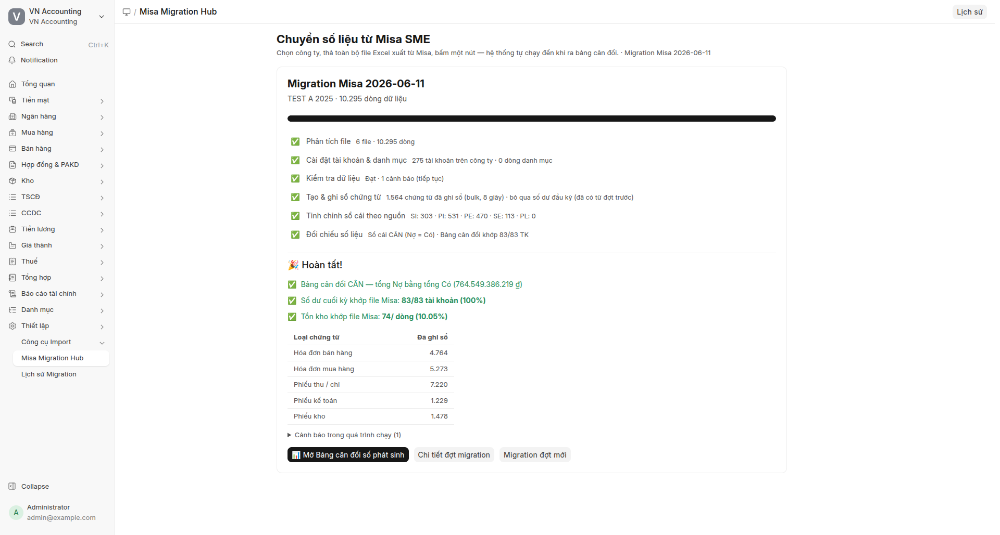
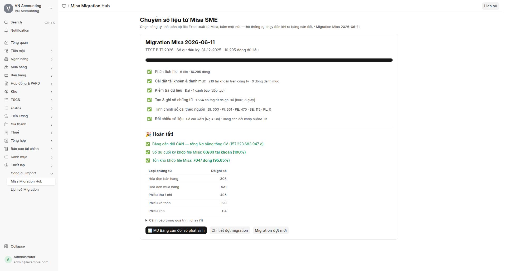

# Kết quả test E2E Misa Migration Hub — 2026-06-11

Hai test độc lập, mỗi test trên **một site Frappe mới tinh** (bench new-site,
chỉ cài erpnext + vn_accounting, chạy setup wizard) và **một công ty mới**
(tiền tệ VND). Toàn bộ thao tác qua giao diện Migration Hub (Playwright),
không can thiệp backend. Dữ liệu nguồn: bộ file Misa SME thực tế của DCNET
(xem [mau-file/](mau-file/)).

## Tiêu chí nghiệm thu

Bảng cân đối tài khoản sau migration phải **khớp Số dư cuối kỳ T1.2026**
trong file `Bang_can_doi_tai_khoan_mau_quan_tri T1.2026.xlsx` (per-TK) và
sổ cái phải cân (tổng Nợ = tổng Có).

## Test A — Migrate đầy đủ: năm 2025 rồi nối tiếp T1.2026

Site `misa-a.localhost`, công ty `TEST A 2025`. Hai đợt liên tiếp:
đợt 1 = 40 file năm 2025, đợt 2 = 6 file T1.2026 (cùng công ty — hệ thống
tự bỏ qua số dư đầu kỳ của đợt 2 vì sổ đã có).

| Chỉ tiêu | Đợt 1 (2025) | Đợt 2 (T1.2026) — kết quả cuối |
|---|---|---|
| File / dòng dữ liệu | 31 file dùng / 105.935 dòng | 6 file / 10.295 dòng |
| Chứng từ ghi sổ | 18.398 (bulk 41 giây) | +1.564 (bulk 8 giây) |
| Sổ cái | CÂN (Nợ = Có = 703,2 tỷ) | **CÂN (Nợ = Có = 764.549.386.219 đ, lệch 0)** |
| Số dư cuối kỳ vs file Misa | n/a (bộ 2025 không có file BCDTK) | **83/83 TK (100%)** ✅ |
| Tồn kho per kho-vật tư | n/a | 74/736 (hạn chế đã biết của kịch bản nối tiếp — Bin nền không tạo khi bỏ qua đầu kỳ; số dư TK kho 15x trong BCDTK vẫn đúng 100%) |

### Record đã tạo (site misa-a, sau cả 2 đợt)

| DocType | Số lượng | DocType | Số lượng |
|---|---|---|---|
| Sales Invoice | 4.764 | Customer | 2.056 |
| Purchase Invoice | 5.273 | Supplier | 1.038 |
| Payment Entry | 7.220 | Item | 2.451 |
| Journal Entry | 1.229 | Warehouse | 39 |
| Stock Entry | 1.478 | Account | 275 |
| GL Entry | 55.610 | Employee | 56 |
| Stock Ledger Entry | 4.859 | Department | 136 |
| Payment Ledger Entry | 7.647 | Project (công trình) | 263 |
| Bin | 1.614 | Customer Group | 205 |
| Misa Migration Row | 116.230 | Supplier Group | 8 |
| Fiscal Year | 3 (2024-2026) | Item Group | 84 |
| Bank / Bank Account | 40 / 13 | UOM | 348 |
| Asset Category | 16 | Cost Center | 5 |

## Test B — Migrate độc lập chỉ T1.2026 (bộ rút gọn 6 file)

Site `misa-b.localhost`, công ty `TEST B T1 2026`. Một đợt duy nhất, 6 file.
Không có file danh mục — khách hàng/NCC/vật tư/kho/TK con tự suy ra từ
Sổ nhật ký chung + bảng kê.

| Chỉ tiêu | Kết quả |
|---|---|
| File / dòng dữ liệu | 6 file / 10.295 dòng |
| Chứng từ ghi sổ | 1.564 (bulk 3 giây, tổng pipeline ~1 phút) |
| Sổ cái | **CÂN (Nợ = Có = 157.223.683.947 đ, lệch 0)** |
| Số dư cuối kỳ vs file Misa | **83/83 TK (100%)** ✅ |
| Tồn kho per kho-vật tư | 704/736 (95,65% — 32 cặp lệch là chuyển kho nội bộ định tuyến nhầm chiều giữa 2 kho, tổng tồn vẫn đúng) |
| Fiscal Year | Tự tạo 2025 + 2026 |

### Record đã tạo (site misa-b)

| DocType | Số lượng | DocType | Số lượng |
|---|---|---|---|
| Sales Invoice | 303 | Customer | 469 |
| Purchase Invoice | 531 | Supplier | 282 |
| Payment Entry | 498 | Item | 464 |
| Journal Entry | 120 | Warehouse | 20 |
| Stock Entry | 114 | Account | 218 |
| GL Entry | 5.548 | Customer Group | 5 |
| Stock Ledger Entry | 912 | Supplier Group | 8 |
| Payment Ledger Entry | 1.400 | Department | 13 |
| Bin | 723 | Cost Center | 2 |
| Misa Migration Row | 10.295 | Fiscal Year | 2 |

## Lỗi đã sửa trong vòng test này

1. **BH điều chỉnh không có trong Bảng kê bán ra** (2 hóa đơn, 63,2M) →
   bulk bỏ qua im lặng, mất chân 131/33311/doanh thu. Fix: fallback Phiếu
   kế toán từ chân Sổ nhật ký chung.
2. **MDV điều chỉnh giảm (chân âm)** (~15 hóa đơn, cặp ±2,28M trên
   1331↔331) → bước tinh chỉnh sổ cái rớt toàn bộ chân âm. Fix: nhận
   diện chân âm (Có −X ≡ Nợ +X).
3. **Fiscal Year không tự tạo** (đọc nhầm cột rỗng) → sửa đọc đúng
   "Ngày hạch toán" từ dữ liệu nguồn + chặn dòng footer.

Trước fix, tập 2025 lệch 4 TK (~67M = 0,0095%); sau fix cả hai test đạt
**100% per-TK**.

## Hạn chế đã biết (không chặn nghiệm thu)

- **Bin nền khi migrate nối tiếp**: đợt sau bỏ qua đầu kỳ nên Bin
  (tồn kho per kho-vật tư) chỉ phản ánh phát sinh của đợt — số dư TK kho
  trong Bảng cân đối vẫn đúng. Kế hoạch: dựng Bin nền từ file Tổng hợp
  tồn kho khi chạy nối tiếp.
- **32 cặp chuyển kho nội bộ** định tuyến nhầm chiều giữa 2 kho (tổng đúng).
- **TSCĐ**: giá trị nằm đúng trên TK 211/214; record Asset chi tiết không
  được tạo bởi đường bulk — dùng Asset import sau migration nếu cần quản
  lý tài sản chi tiết.
