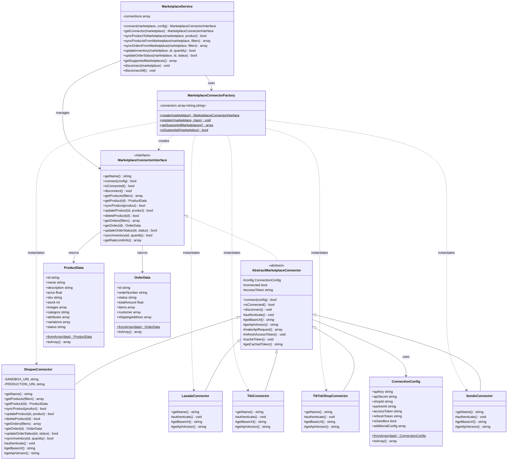
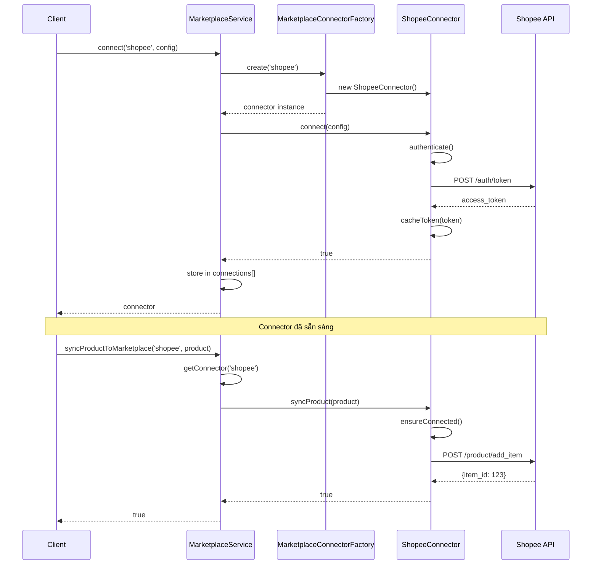
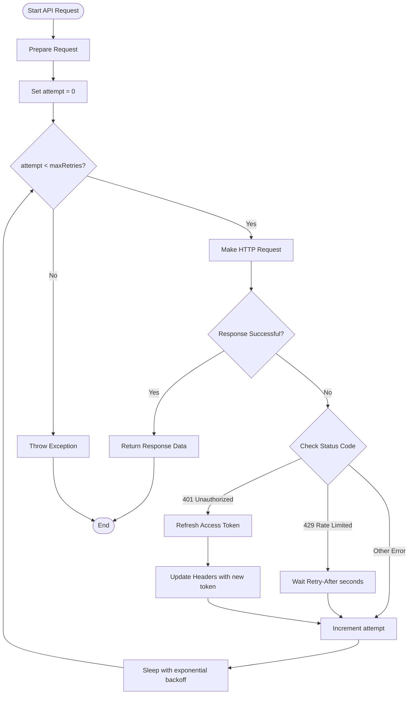
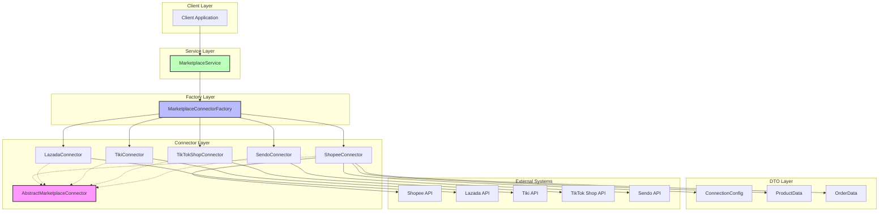
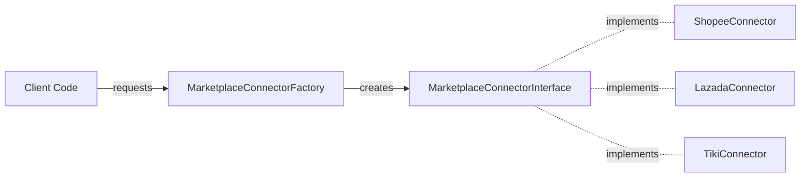
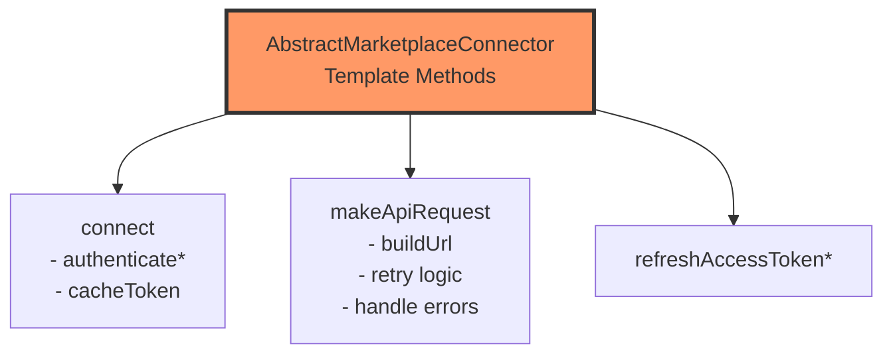
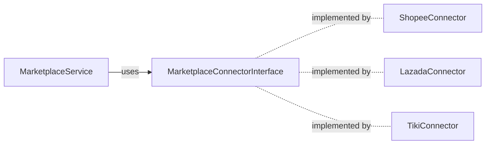

# Marketplace Connector - Architecture Diagram

## Class Diagram

## Sequence Diagram - Kết nối và Đồng bộ Sản phẩm

## Flow Diagram - Quy trình xử lý API Request với Retry

## Component Diagram - Tổng quan hệ thống

## Design Patterns Applied

### 1. Factory Method Pattern

### 2. Template Method Pattern

### 3. Strategy Pattern

