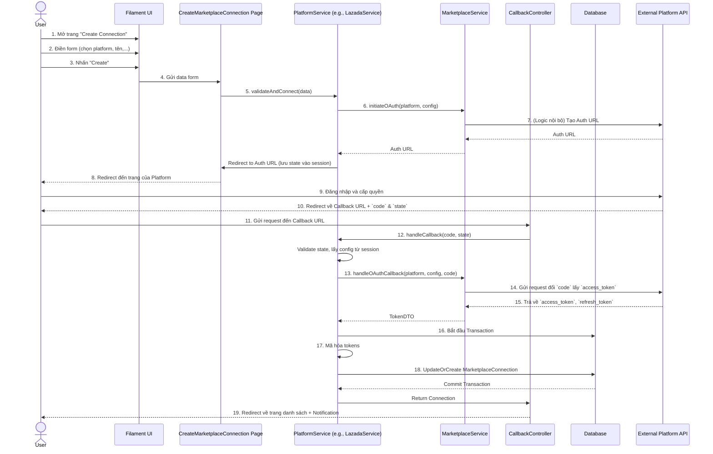

# Luồng kết nối OAuth2 cho Marketplace

Tài liệu này mô tả chi tiết luồng xác thực OAuth2 được sử dụng để kết nối an toàn với các sàn TMĐT (Marketplace) như Lazada, TikTok Shop từ trong trang quản trị Filament.

## 🎯 Mục tiêu

Mục tiêu của luồng này là cho phép người dùng cấp quyền cho ứng dụng truy cập vào dữ liệu cửa hàng của họ trên sàn TMĐT một cách an toàn, mà không cần lưu trữ mật khẩu. Ứng dụng sẽ nhận được một `access_token` để thay mặt người dùng thực hiện các API call.

## 📊 Sơ đồ tổng quan (Flowchart)

```mermaid
flowchart TD
    subgraph "Người dùng trong Filament"
        A[1. Mở trang Tạo Connection] --> B{2. Chọn Platform & điền thông tin};
        B --> C[3. Nhấn nút "Create"];
    end

    subgraph "Hệ thống CRM (Backend)"
        C --> D[4. CreateMarketplaceConnection::mutateFormDataBeforeCreate];
        D --> E[5. Gọi Service tương ứng (vd: LazadaService)];
        E --> F[6. MarketplaceService::initiateOAuth];
        F --> G{7. Lấy Auth URL & Lưu config vào Session};
    end

    G --> H[8. Redirect người dùng đến trang xác thực của Platform];

    subgraph "Sàn TMĐT (Platform)"
        H --> I[9. Người dùng đăng nhập & cấp quyền];
        I --> J[10. Platform redirect về Callback URL với `code` & `state`];
    end

    subgraph "Hệ thống CRM (Backend)"
        J --> K[11. CallbackController (vd: LazadaCallbackController)];
        K --> L{12. Validate `state` & lấy config từ Session};
        L --> M[13. Service::handleCallback];
        M --> N[14. MarketplaceService::handleOAuthCallback];
        N --> O[15. Gửi `code` đến Platform để đổi lấy Access Token];
    end
    
    subgraph "Sàn TMĐT (Platform)"
        O --> P[16. Trả về Access Token & Refresh Token];
    end

    subgraph "Hệ thống CRM (Backend)"
        P --> Q[17. Service::handleCallback tiếp tục];
        Q --> R[18. Mã hóa và chuẩn bị dữ liệu];
        R --> S[19. Lưu/Cập nhật record `MarketplaceConnection` vào DB];
        S --> T[20. Xóa Session & Redirect về trang danh sách];
    end

    subgraph "Người dùng trong Filament"
        T --> U[21. Thấy kết nối mới & nhận thông báo thành công];
    end
```

## SEQUENCE DIAGRAM



## 📝 Chi tiết các thành phần tham gia

1.  **`MarketplaceConnectionResource.php`**
    *   **Vai trò**: Định nghĩa UI của form trong Filament.
    *   Các trường `api_key`, `api_secret` được thu thập ở đây.

2.  **`CreateMarketplaceConnection.php`**
    *   **Vai trò**: Trang xử lý logic khi tạo mới một connection.
    *   **Phương thức chính**: `mutateFormDataBeforeCreate(array $data)`
    *   Đây là điểm khởi đầu của luồng OAuth2. Nó không tạo record ngay mà gọi đến `PlatformService` tương ứng và `halt()` tiến trình của Filament.

3.  **`LazadaService.php` / `TikTokShopService.php`**
    *   **Vai trò**: Chứa logic nghiệp vụ cụ thể cho từng platform.
    *   **`validateAndConnect()`**: Được gọi từ `CreateMarketplaceConnection`, chuẩn bị `config`, gọi `MarketplaceService` để lấy URL, lưu thông tin vào session và thực hiện redirect.
    *   **`handleCallback()`**: Được gọi từ `CallbackController`, điều phối việc đổi token và lưu kết quả vào database.

4.  **`MarketplaceService.php`**
    *   **Vai trò**: Service lõi, chứa logic chung cho việc xác thực OAuth2, có thể tái sử dụng cho nhiều platform.
    *   **`initiateOAuth()`**: Tạo URL xác thực của platform.
    *   **`handleOAuthCallback()`**: Gửi request đến platform để đổi `code` lấy `access_token`.
    *   **`buildCredentialUpdateData()`**: Chuẩn bị mảng dữ liệu chứa token đã được mã hóa để lưu vào DB.

5.  **`LazadaCallbackController.php` / `TikTokShopCallbackController.php`**
    *   **Vai trò**: Endpoint mà platform sẽ gọi lại sau khi người dùng cấp quyền.
    *   **`handleCallback()`**: Nhận `code` và `state` từ request, gọi `PlatformService` để xử lý. Cuối cùng, redirect người dùng về lại trang quản trị.

6.  **`routes/web.php`**
    *   **Vai trò**: Đăng ký các route cho callback, ví dụ: `marketplace/connections/lazada/callback`.

7.  **Session & State**
    *   **Vai trò**: `state` là một chuỗi ngẫu nhiên dùng để chống tấn công CSRF. Nó được tạo ra ở đầu luồng, gửi cho platform và nhận lại ở bước callback để xác thực.
    *   Session được dùng để lưu trữ `config` và `data` từ form ban đầu, giúp `CallbackController` có đủ thông tin để tạo connection sau khi đã có token.

8.  **Database (`marketplace_connections` table)**
    *   **Vai trò**: Nơi lưu trữ cuối cùng. Các thông tin nhạy cảm như `access_token`, `refresh_token`, `api_key`, `api_secret` đều được mã hóa trước khi lưu.

## 🔐 Vấn đề bảo mật

*   **Chống CSRF**: Tham số `state` được sử dụng để đảm bảo request callback là hợp lệ và đến từ đúng người dùng đã khởi tạo.
*   **Mã hóa Credentials**: Tất cả các thông tin nhạy cảm (token, secret, key) đều được mã hóa bằng `Crypt::encryptString()` của Laravel trước khi lưu vào database, giúp bảo vệ thông tin ngay cả khi database bị lộ.

Luồng xử lý này đảm bảo một quy trình kết nối an toàn, linh hoạt và dễ dàng mở rộng cho các platform mới trong tương lai.