# DCNET Flow - Workflow Tổng Thể Dự Án

> **Phiên bản**: 1.0.0 | **Cập nhật**: 10/01/2026 | **Khách hàng**: Nhật Minh Sport

---

## 1. Bức Tranh Tổng Thể (Big Picture)

```
┌─────────────────────────────────────────────────────────────────────────────────────────┐
│                              DCNET FLOW - BUSINESS FLOW PLATFORM                        │
│                                   (CRM + ERP + Integration)                             │
├─────────────────────────────────────────────────────────────────────────────────────────┤
│                                                                                         │
│   ┌─────────────┐     ┌─────────────┐     ┌─────────────┐     ┌─────────────┐           │
│   │   NGUỒN     │     │    LEAD     │     │  KHÁCH HÀNG │     │  ĐƠN HÀNG   │           │
│   │   KHÁCH     │────►│  MANAGEMENT │────►│  MANAGEMENT │────►│  MANAGEMENT │           │
│   │   HÀNG      │     │             │     │             │     │             │           │
│   └─────────────┘     └─────────────┘     └─────────────┘     └──────┬──────┘           │
│         │                                                            │                  │
│         ▼                                                            ▼                  │
│   ┌─────────────┐                                           ┌─────────────┐             │
│   │ • Offline   │                                           │ • Bán lẻ/sỉ │             │
│   │ • Online    │                                           │ • Fitting   │             │
│   │ • Sàn TMĐT  │                                           │ • Coaching  │             │
│   │ • B2B       │                                           │ • Thu đổi   │             │
│   └─────────────┘                                           └──────┬──────┘             │
│                                                                    │                    │
│         ┌──────────────────────────────────────────────────────────│    								│
│         │                                                          │                    │
│         ▼                                                          ▼                    │
│   ┌─────────────┐     ┌─────────────┐     ┌─────────────┐   ┌─────────────┐             │
│   │   SẢN PHẨM  │     │     KHO     │     │  GIAO VẬN   │   │  THANH TOÁN │             │
│   │             │◄───►│             │────►│             │   │             │             │
│   └──────┬──────┘     └──────┬──────┘     └─────────────┘   └──────┬──────┘             │
│          │                   │                                     │                    │
│          │                   │                ┌────────────────────┘                    │
│          │                   ▼                ▼                                         │
│   ┌──────▼──────┐     ┌─────────────┐   ┌─────────────┐                                 │
│   │  MUA HÀNG   │────►│  KẾ TOÁN    │◄──│  CÔNG NỢ    │                                 │
│   │   (PO)      │     │  (GL/AR/AP) │   │  (Credit)   │                                 │
│   └─────────────┘     └─────────────┘   └─────────────┘                                 │
│                                                                                         │
│                                                                                         │
│   ┌────────────────────────────────────────────────────────────────────────────────┐    │
│   │                           TÍCH HỢP BÊN NGOÀI                                   │    │
│   │  ┌──────────┐  ┌──────────┐  ┌──────────┐  ┌──────────┐  ┌──────────┐          │    │
│   │  │ WEBSITE  │  │  SHOPEE  │  │  TIKTOK  │  │  LAZADA  │  │ VIETTEL  │          │    │
│   │  │ NHATMINH │  │          │  │   SHOP   │  │          │  │   POST   │          │    │
│   │  │   (WP)   │  └──────────┘  └──────────┘  └──────────┘  └──────────┘          │    │
│   │  └──────────┘                                                                  │    │
│   └────────────────────────────────────────────────────────────────────────────────┘    │
│                                                                                         │
│   ┌────────────────────────────────────────────────────────────────────────────────┐    │
│   │                              HỆ THỐNG NỘI BỘ                                   │    │
│   │  ┌──────────┐  ┌──────────┐  ┌──────────┐  ┌──────────┐  ┌──────────┐          │    │
│   │  │ NHÂN VIÊN│  │ CHI NHÁNH│  │   ROLE   │  │  BÁO CÁO │  │ ANALYTICS│          │    │
│   │  └──────────┘  └──────────┘  └──────────┘  └──────────┘  └──────────┘          │    │
│   └────────────────────────────────────────────────────────────────────────────────┘    │
│                                                                                         │
└─────────────────────────────────────────────────────────────────────────────────────────┘
```

---

## 2. Luồng Chính: Lead → Customer → Order

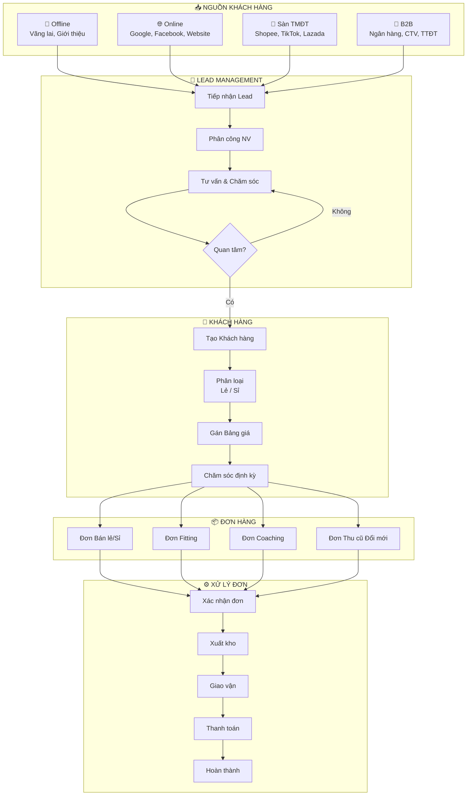

---

## 3. Các Module Chức Năng

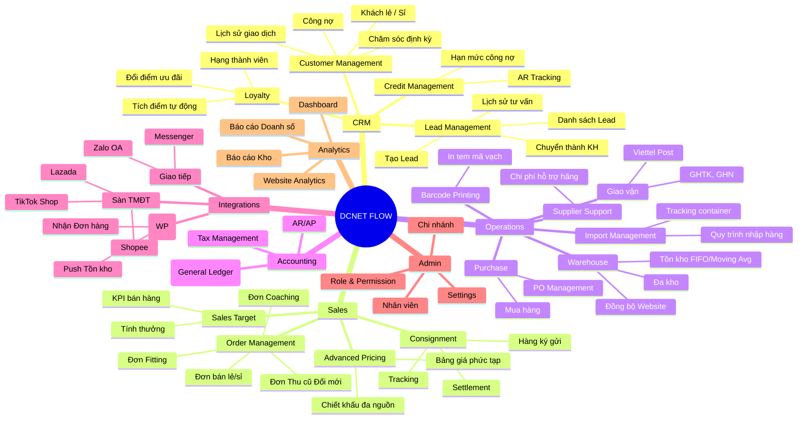

---

## 4. Luồng Đơn Hàng Chi Tiết

### 4.1. Đơn Bán Lẻ/Sỉ (Sản phẩm thông thường)

```mermaid
flowchart LR
    subgraph INPUT["📝 TẠO ĐƠN"]
        A1[Chọn KH/Tạo mới]
        A2[Chọn Sản phẩm]
        A3[Áp dụng Bảng giá]
        A4[Áp Voucher/Coupon]
    end

    subgraph PRICING["💰 TÍNH GIÁ"]
        B1["Giá niêm yết"]
        B2["- Chiết khấu nguồn"]
        B3["- Giảm giá web"]
        B4["- Coupon"]
        B5["- Voucher"]
        B6["= Giá cuối"]
    end

    subgraph PROCESS["⚙️ XỬ LÝ"]
        C1[Xác nhận đơn]
        C2[Chuyển Kho]
        C3[Xuất hàng]
        C4[Tạo vận đơn]
    end

    subgraph DELIVERY["🚚 GIAO HÀNG"]
        D1[Viettel Post]
        D2[Tracking]
        D3[Giao thành công]
    end

    subgraph COMPLETE["✅ HOÀN TẤT"]
        E1[Thanh toán]
        E2[Cập nhật công nợ]
        E3[Tích điểm]
        E4[Đơn hoàn thành]
    end

    A1 --> A2 --> A3 --> A4
    A4 --> B1 --> B2 --> B3 --> B4 --> B5 --> B6
    B6 --> C1 --> C2 --> C3 --> C4
    C4 --> D1 --> D2 --> D3
    D3 --> E1 --> E2 --> E3 --> E4
```

### 4.2. Đơn Fitting

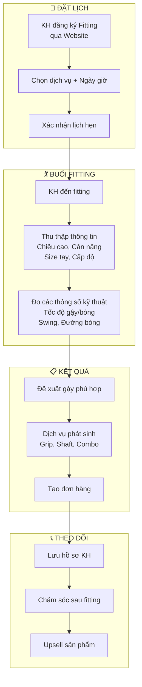

### 4.3. Đơn Coaching

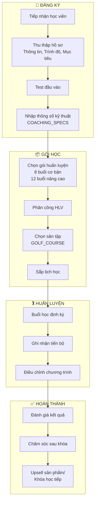

#### Entities chính của Coaching:

| Entity | Mô tả |
| --- | --- |
| `COACHING_ORDER` | Đơn đăng ký khóa học |
| `COACHING_PACKAGE` | Gói huấn luyện (8 buổi, 12 buổi...) |
| `COACH` | HLV (extend từ Employee) |
| `GOLF_COURSE` | Sân tập (đối tác hoặc của NM) |
| `COACHING_SESSION` | Từng buổi học, điểm danh |
| `COACHING_TEST` | Bài test đầu vào |
| `COACHING_SPECS` | Thông số kỹ thuật học viên (tương tự Fitting) |

### 4.4. Đơn Thu Cũ Đổi Mới

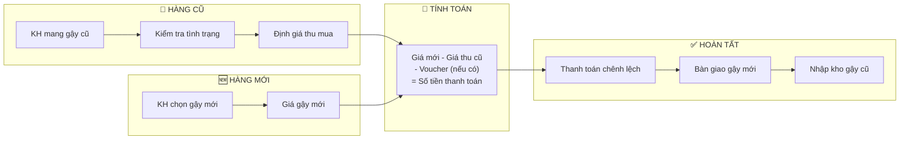

---

## 5. Tích Hợp Website NhatMinh (WordPress/WooCommerce)

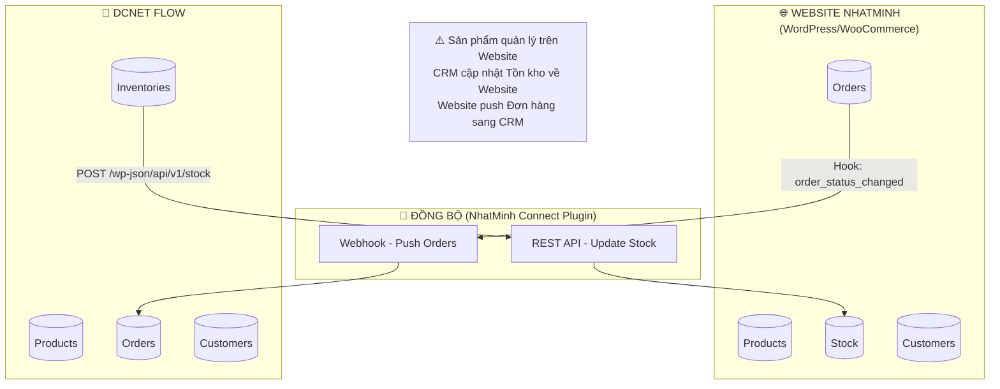

### 5.1 Workflow Đồng Bộ Chi Tiết

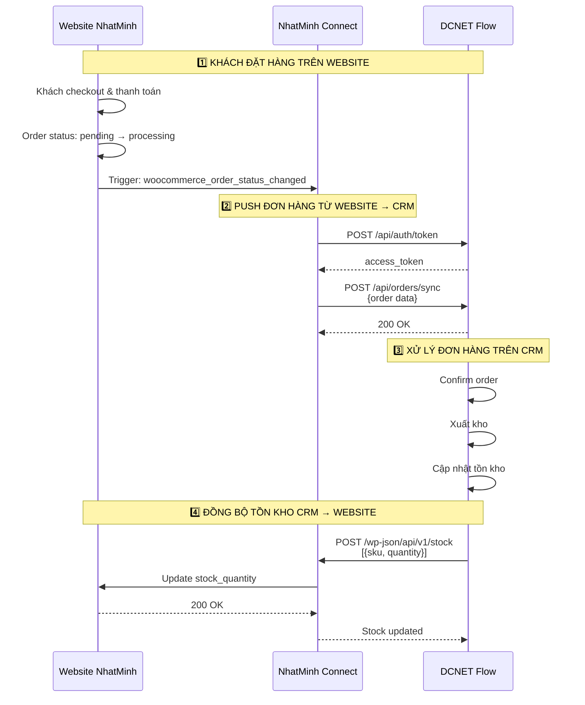

### 5.2 REST API Endpoints

**A. Website → CRM (Push - Đơn hàng)**

| Endpoint | Method | Mô tả | Trigger |
| --- | --- | --- | --- |
| `/api/orders/sync` | POST | Nhận đơn hàng từ Website | Webhook (real-time) |

**B. CRM → Website (Push - Tồn kho)**

| Endpoint | Method | Mô tả | Trigger |
| --- | --- | --- | --- |
| `/wp-json/api/v1/stock` | POST | Cập nhật tồn kho | After xuất kho |

**Header:** `api-key: <API_KEY>`

**Đơn hàng - Payload (Website → CRM):**

```json
{
  "WebId": 12345,
  "DocNo": "ORIGIN12345",
  "DocDate": "01/10/2026",
  "CustomerCode": "0912345678",
  "CustomerName": "Nguyễn Văn A",
  "Tel": "0912345678",
  "Address": "123 Đường ABC, Q1, TP.HCM",
  "OrderSource": "ORIGIN",
  "Description": "Ghi chú của khách",
  "PaymentStatus": "COD",
  "DeliveryAmount": 30000,
  "Consignee": "Người nhận",
  "DeliveryAddress": "Địa chỉ giao hàng",
  "ConsigneeTel": "0987654321",
  "DetailInfo": [
    {
      "ItemCode": "SKU001",
      "Quantity": 2,
      "OriginalAmount9": 500000,
      "OriginalAmount": 450000
    }
  ]
}
```

**Tồn kho - Payload (CRM → Website):**

```json
[
  {"itemCode": "SKU001", "quantity": 50},
  {"itemCode": "SKU002", "quantity": 100}
]
```

### 5.3 Data Mapping

**Order Status Mapping:**

| WooCommerce Status | CRM PaymentStatus |
| --- | --- |
| `processing` | "COD" |
| `completed` | "Đã chuyển khoản" |

**Field Mapping:**

| CRM Field | Website Source | Ghi chú |
| --- | --- | --- |
| `WebId` | Order number | ID đơn hàng |
| `DocNo` | PREFIX + Order number | ORIGIN12345 |
| `DocDate` | Order created date | Format: m/d/Y |
| `CustomerCode` | Billing phone | SĐT khách |
| `CustomerName` | Billing full name | Tên đầy đủ |
| `Address` | Billing address 1 | Địa chỉ xuất hóa đơn |
| `PaymentStatus` | Order status | COD / Đã CK |
| `DeliveryAmount` | Shipping total | Phí ship |
| `Consignee` | Shipping first name | Người nhận |
| `DeliveryAddress` | Shipping address full | Địa chỉ giao hàng |
| `ConsigneeTel` | Shipping phone | SĐT người nhận |
| `DetailInfo[]` | Order items | Chỉ sản phẩm có SKU |

### 5.4 Quy Tắc Đồng Bộ

| Dữ liệu | Chiều | Frequency | Ghi chú |
| --- | --- | --- | --- |
| Đơn hàng | Website → CRM | Real-time (webhook) | Khi status changed |
| Tồn kho | CRM → Website | Real-time | Sau khi xuất kho |

**⚠️ LƯU Ý:**
- **Sản phẩm**: Quản lý trực tiếp trên Website (không đồng bộ)
- **Đơn hàng**: Website push sang CRM khi có đơn mới
- **Tồn kho**: CRM push về Website sau khi xuất kho
- CRM có thể đọc Sản phẩm/Khách hàng từ Website nếu cần (qua API)

### 5.5 Multi-site Support

Plugin tự động xác định `PREFIX` dựa trên subdomain:

| Domain | PREFIX | OrderSource |
| --- | --- | --- |
| `nhatminhsports.vn` | ORIGIN | ORIGIN |
| `shop.nhatminhsports.vn` | SHOP | SHOP |

### 5.6 Plugin Architecture

```
nhatminh-connect/              # WordPress Plugin (cài trên Website)
├── index.php                  # Plugin entry point
├── composer.json              # Dependencies (Guzzle, Monolog)
├── logs.log                   # Log file
├── Inc/
│   ├── Init.php               # Service registration
│   └── Core/
│       ├── Api.php            # REST API & Order hooks
│       │                      # - Hook: woocommerce_order_status_changed
│       │                      # - Endpoint: /api/v1/stock (receive)
│       │                      # - Endpoint: /api/v1/product (read)
│       │                      # - Endpoint: /api/v1/customer (read)
│       ├── StockUpdater.php   # Admin bulk stock update tool
│       ├── Helpers.php        # CRM API functions
│       │                      # - crmAuth()
│       │                      # - orderToCRM($token, $order)
│       └── Middleware.php     # API key authentication
└── vendor/                    # Composer dependencies
```

**Dependencies:**
- `monolog/monolog` ^3.9 - Logging
- `guzzlehttp/guzzle` ^7.9 - HTTP Client

---

## 6. Tích Hợp Sàn TMĐT

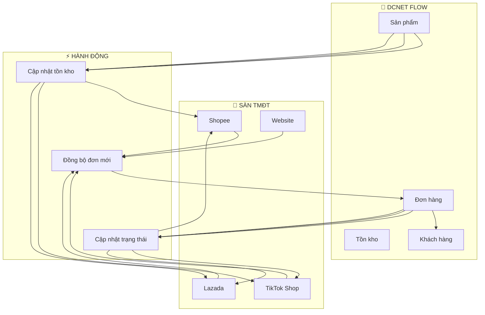

---

## 7. Luồng Giao Vận

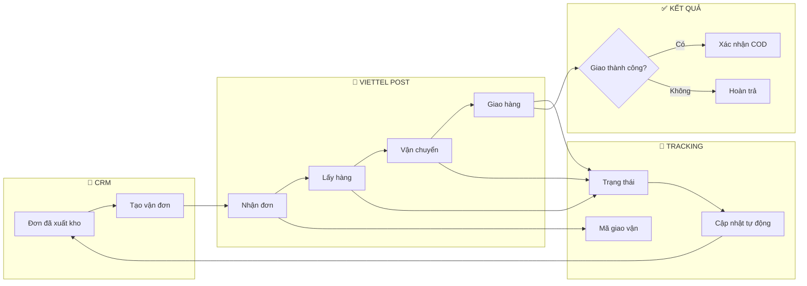

---

## 8. Dashboard & Báo Cáo

```mermaid
flowchart TB
    subgraph DATA["📊 NGUỒN DỮ LIỆU"]
        D1[Đơn hàng]
        D2[Khách hàng]
        D3[Sản phẩm]
        D4[Kho]
        D5[Fitting/Coaching]
    end

    subgraph DASHBOARD["📈 DASHBOARD"]
        DB1[Doanh số ngày/tuần/tháng]
        DB2[Doanh số bán sỉ/lẻ]
        DB3[Doanh số theo nguồn]
        DB4[Top 20 SP bán chạy]
    end

    subgraph REPORTS["📋 BÁO CÁO"]
        R1[Báo cáo Doanh số]
        R2[Báo cáo Đơn hàng]
        R3[Báo cáo Khách hàng]
        R4[Báo cáo Kho]
        R5[Báo cáo Fitting]
        R6[Báo cáo Coaching]
    end

    subgraph ANALYTICS["🔍 WEBSITE ANALYTICS"]
        A1[Lưu lượng truy cập]
        A2[Tỉ lệ chuyển đổi]
        A3[Heatmap]
        A4[Session Recording]
    end

    D1 --> DB1
    D1 --> DB2
    D2 --> DB3
    D3 --> DB4

    D1 --> R1
    D1 --> R2
    D2 --> R3
    D4 --> R4
    D5 --> R5
    D5 --> R6

    D1 --> A1
    D1 --> A2
```

---

## 9. Phân Quyền Hệ Thống

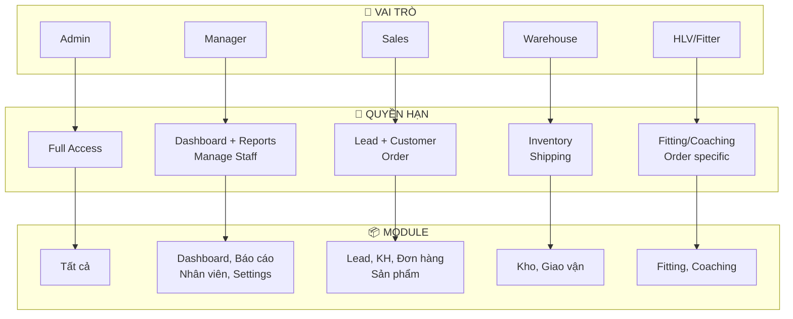

---

## 10. Timeline Triển Khai

> **⚠️ Đang được update** - Timeline chi tiết đang được lên kế hoạch

---

## 11. Tech Stack

```
```

---

## 12. Tổng Kết Module

| # | Module | Chức năng chính |
| --- | --- | --- |
| 1 | **Lead Management** | Pipeline, tư vấn, chuyển KH |
| 2 | **Warehouse** | Đa kho, tồn kho, FIFO/Moving Avg |
| 3 | **Accounting** | Kế toán, GL, AR/AP |
| 4 | **Advanced Pricing** | Bảng giá phức tạp, chiết khấu đa nguồn |
| 5 | **Credit Management** | Hạn mức công nợ, AR tracking |
| 6 | **Fitting Service** | Đơn Fitting, test thông số, đề xuất gậy |
| 7 | **Coaching Program** | Đăng ký khóa học, quản lý buổi học, HLV |
| 8 | **Consignment** | Hàng ký gửi, tracking, settlement |
| 9 | **Purchase Management** | Quản lý Mua hàng, PO |
| 10 | **Sales Target** | KPI bán hàng, tính thưởng |
| 11 | **Supplier Support** | Chi phí hỗ trợ hãng |
| 12 | **Import Management** | Quy trình nhập hàng, tracking container |
| 13 | **Barcode Printing** | In tem mã vạch |
| 14 | **WooCommerce** | ⭐ PRIORITY - WordPress sync (đang chạy) |
| 15 | **E-commerce** | Shopee, TikTok, Lazada |
| 16 | **Shipping** | Viettel Post, GHTK, GHN |
| 17 | **Partners** | Quản lý KH, NCC, Đại lý (có sẵn) |
| 18 | **Loyalty** | Tích điểm, hạng thành viên |

**Tổng:** 18 modules

---

**© 2026 DCNET**
