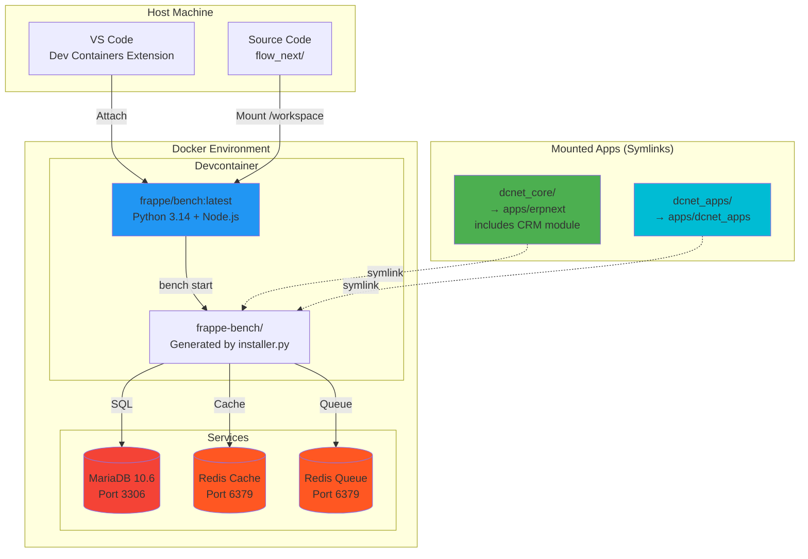
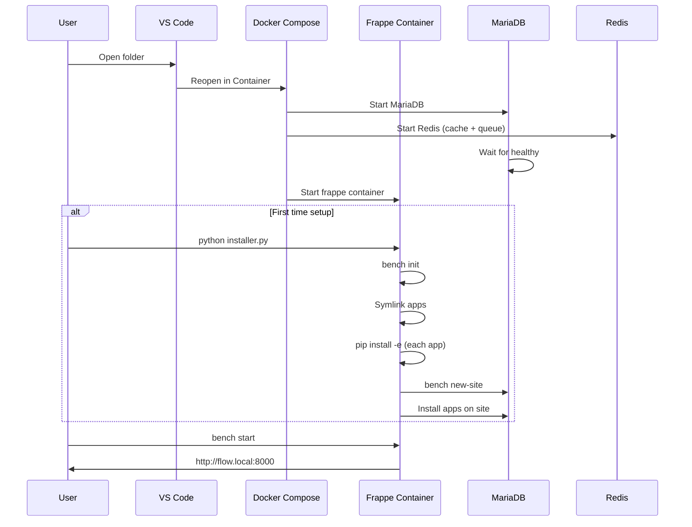

# DCNET Flow - Devcontainer Architecture

**Last Updated:** 2026-01-27
**Version:** Frappe v16 + ERPNext v16 (includes CRM module)
**Architecture:** VS Code Devcontainer with Symlink Strategy

---

## Overview

DCNET Flow uses **VS Code Devcontainer** for development, based on the official [frappe_docker](https://github.com/frappe/frappe_docker) approach. This provides a clean, reproducible development environment.

---

## Architecture Diagram



---

## Container Structure

### Services (docker-compose.yml)

| Service | Image | Purpose | Port |
| --- | --- | --- | --- |
| **frappe** | frappe/bench:latest | Development container | 8000-8005, 9000-9005 |
| **mariadb** | mariadb:10.6 | Database | 3306 (internal) |
| **redis-cache** | redis:6.2-alpine | Application cache | 6379 (internal) |
| **redis-queue** | redis:6.2-alpine | Job queue | 6379 (internal) |

### Frappe Container Details

```yaml
Image: frappe/bench:latest
Working Dir: /workspace/development
Command: sleep infinity (keeps container running)
Environment:
  - FRAPPE_BRANCH=version-16
  - ERPNEXT_BRANCH=version-16
Volumes:
  - ../:/workspace:cached  # Entire project mounted
Ports:
  - 8000-8005:8000-8005    # Bench dev server
  - 9000-9005:9000-9005    # Socket.IO
```

---

## Directory Structure

```
flow_next/                          # Root repository
├── .devcontainer/                  # VS Code devcontainer config
│   ├── docker-compose.yml          # Services definition
│   └── devcontainer.json           # VS Code settings
│
├── development/                    # Development workspace
│   ├── installer.py                # Auto-setup script
│   ├── README.md                   # Development guide
│   └── frappe-bench/               # Generated by installer (gitignored)
│       ├── apps/
│       │   ├── frappe/             # Frappe framework (cloned)
│       │   ├── erpnext → /workspace/dcnet_core    # Symlink (includes CRM)
│       │   └── dcnet_apps → /workspace/dcnet_apps # Symlink
│       ├── sites/
│       │   ├── flow.local/         # Development site
│       │   └── common_site_config.json
│       └── env/                    # Python virtualenv
│
├── dcnet_core/                     # ERPNext v16 source (includes CRM module)
│   └── erpnext/                    # ERPNext package
│
└── dcnet_apps/                     # Custom DCNET modules
    └── dcnet_apps/                 # Custom package
```

---

## App Installation Strategy

### Symlink + Pip Install

Instead of `bench get-app`, we use **symlinks** for local development:

```python
# From installer.py
for app_name, app_path in APPS.items():
    # Create symlink: apps/erpnext → /workspace/dcnet_core
    os.symlink(app_path, f"{apps_dir}/{app_name}")

    # Install in editable mode
    run(f"./env/bin/pip install -e {target_path}")

    # Add to apps.txt
    with open(apps_txt, "a") as f:
        f.write(f"{app_name}\n")
```

### Benefits

- Hot-reload: Code changes reflect immediately
- No git clone: Uses existing source directories
- Editable install: Python changes work instantly
- Shared source: Same code for dev and production builds

---

## Startup Sequence



---

## Configuration

### Environment Variables

| Variable | Default | Description |
| --- | --- | --- |
| FRAPPE_BRANCH | version-16 | Frappe framework version |
| SITE_NAME | flow.local | Development site name |
| DB_ROOT_PASSWORD | 123 | MariaDB root password |
| ADMIN_PASSWORD | 123456 | Site admin password |

### Bench Configuration

```json
// common_site_config.json (auto-generated)
{
  "db_host": "mariadb",
  "redis_cache": "redis://redis-cache:6379",
  "redis_queue": "redis://redis-queue:6379",
  "redis_socketio": "redis://redis-queue:6379",
  "developer_mode": 1
}
```

---

## Development Workflow

### Starting Development

```bash
# Option 1: VS Code (Recommended)
# 1. Open flow_next/ in VS Code
# 2. Click "Reopen in Container"
# 3. Wait for build (~5-10 min first time)

# Option 2: Manual
cd .devcontainer
docker compose up -d
docker compose exec frappe bash
cd /workspace/development
python installer.py
```

### Daily Commands

```bash
# Start development server
cd /workspace/development/frappe-bench
bench start

# After code changes (Python: auto-reload, JS/CSS: need build)
bench build

# After DocType changes
bench --site flow.local migrate
bench --site flow.local clear-cache

# Run tests
bench --site flow.local run-tests --app dcnet_apps
```

### Reinstall from Scratch

```bash
cd /workspace/development
rm -rf frappe-bench
python installer.py
```

---

## Installed Apps

| App | Source | Mount Path | Description |
| --- | --- | --- | --- |
| **frappe** | Official repo | apps/frappe/ | Framework (cloned by bench init) |
| **erpnext** | dcnet_core/ | apps/erpnext/ | ERPNext v16 with CRM module (symlink) |
| **dcnet\_apps** | dcnet_apps/ | apps/dcnet_apps/ | Custom modules (symlink) |

> **Note:** Using ERPNext built-in CRM module (Lead, Opportunity, Customer, etc.), not separate Frappe CRM app.

---

## Network & Ports

### Internal Network

| From | To | Protocol | Port |
| --- | --- | --- | --- |
| frappe | mariadb | MySQL | 3306 |
| frappe | redis-cache | Redis | 6379 |
| frappe | redis-queue | Redis | 6379 |

### Host Access

| Service | Host Port | Container Port | URL |
| --- | --- | --- | --- |
| Web UI | 8000 | 8000 | http://flow.local:8000 |
| Socket.IO | 9000 | 9000 | ws://flow.local:9000 |

> Add `127.0.0.1 flow.local` to `/etc/hosts` on host machine

---

## Volumes

| Volume | Purpose | Persistence |
| --- | --- | --- |
| mariadb-data | Database files | Persistent |
| /workspace | Source code | Host mounted |

### What's Persisted

- Database (mariadb-data volume)
- Source code (host mounted)

### What's Regenerated

- frappe-bench/ folder (by installer.py)
- Python virtualenv
- Node modules
- Built assets

---

## Troubleshooting

### Database Connection Issues

```bash
bench set-config -g db_host mariadb
bench --site flow.local migrate
```

### Redis Connection Issues

```bash
bench set-config -g redis_cache redis://redis-cache:6379
bench set-config -g redis_queue redis://redis-queue:6379
```

### Build Errors (ARM64/M1 Mac)

```bash
# If node_modules built for wrong platform
cd /workspace/development/frappe-bench/apps/erpnext
rm -rf node_modules
yarn install
bench build
```

---

## Comparison: Old Docker vs New Devcontainer

| Aspect | Old (docker/) | New (.devcontainer/) |
| --- | --- | --- |
| Approach | Production image + overlay mount | Development bench image |
| Base Image | frappe/erpnext:v16 | frappe/bench:latest |
| App Install | Mount on top of existing | Symlink + pip install |
| Frappe Source | From image (read-only) | Cloned (editable) |
| Setup | docker compose up | bench init + installer.py |
| Hot-reload | Via volume mounts | Native bench dev mode |
| Complexity | High (many services) | Low (single container) |

---

## Related Documentation

- **Development Guide:** `development/README.md`
- **Frappe Architecture:** `FRAPPE_ARCHITECTURE.md`
- **Project Guide:** `CLAUDE.md`
- **Official Docs:** [frappe_docker](https://github.com/frappe/frappe_docker)

---

**Architecture:** VS Code Devcontainer
**Base Image:** frappe/bench:latest
**Apps:** frappe + erpnext (dcnet_core, includes CRM module) + dcnet_apps
