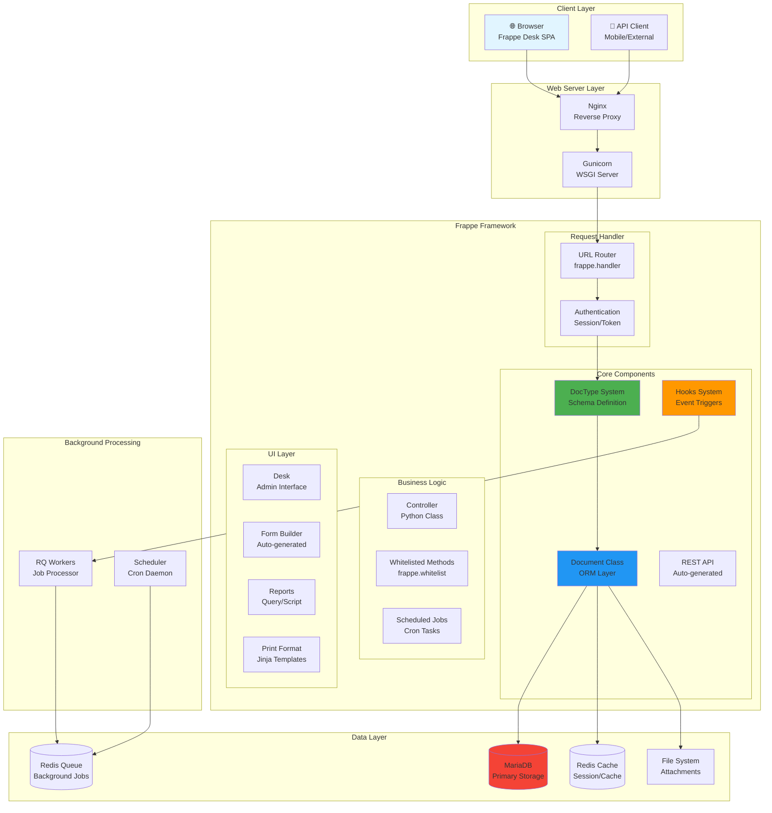
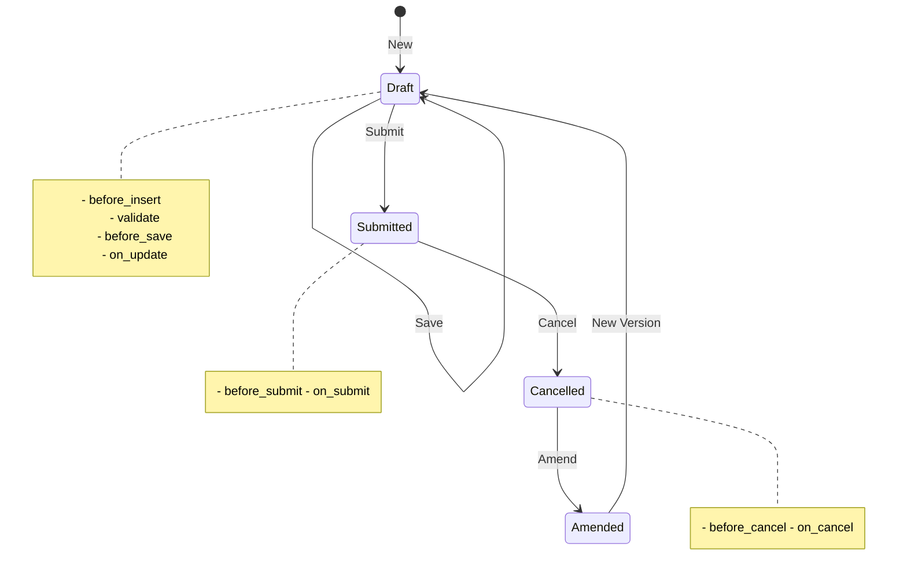
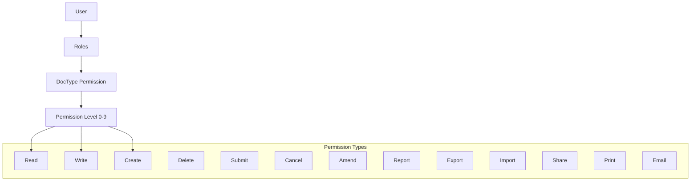
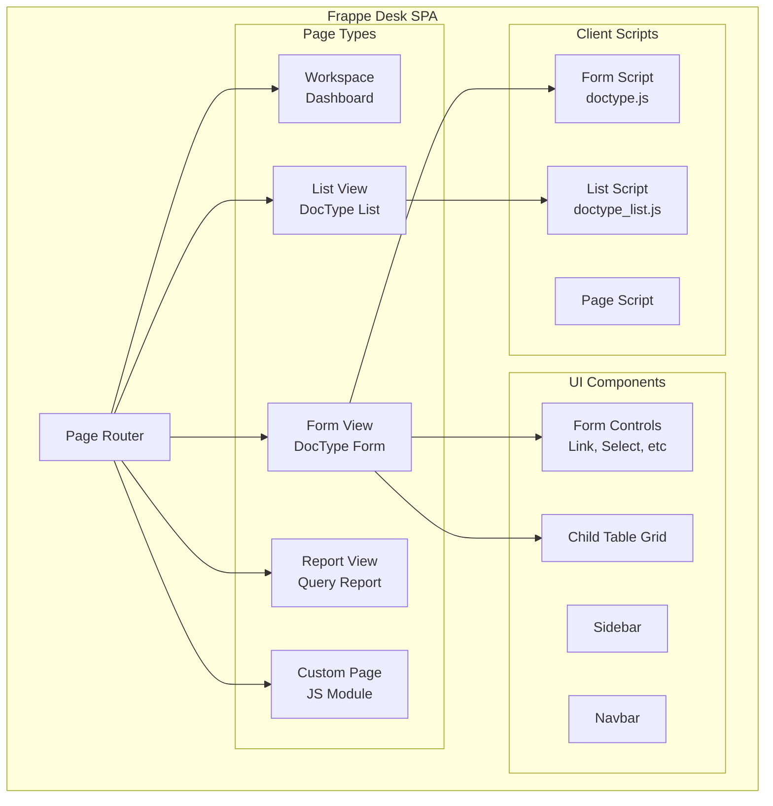
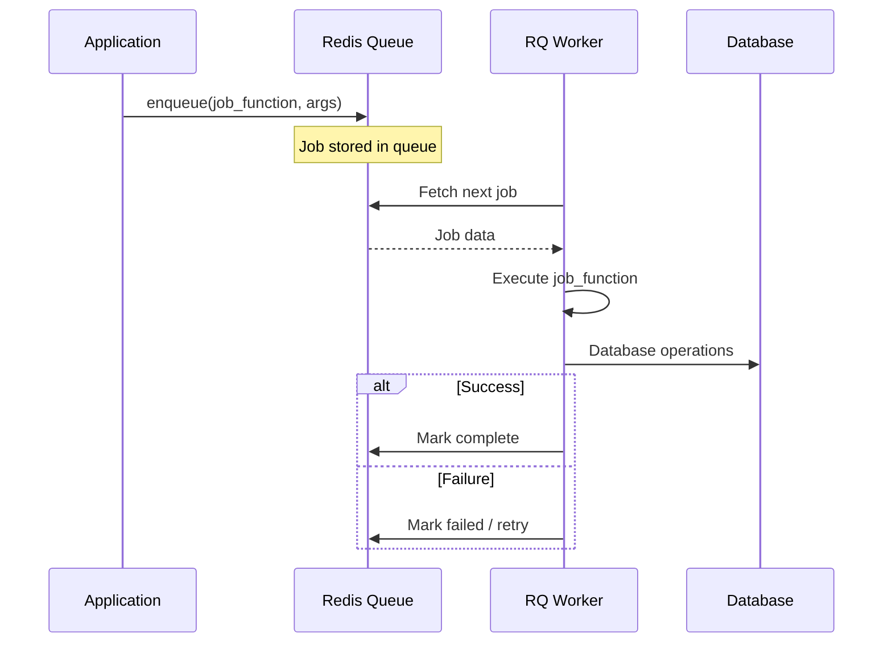
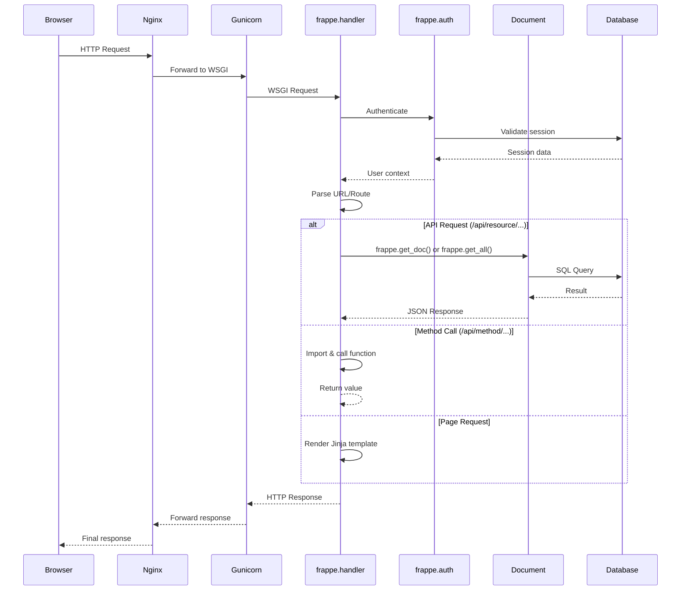

# Frappe Framework - Architecture

## 📊 Overview Diagram



---

## 🏗️ Core Concepts

### 1. DocType - The Heart of Frappe

**DocType** là khái niệm trung tâm của Frappe. Mọi thứ trong Frappe đều là DocType.

```
DocType = Database Table + Form UI + API + Permissions + Business Logic
```

#### DocType Types

| Type | Description | Example |
| --- | --- | --- |
| **Standard** | Có form UI đầy đủ | Customer, Sales Order |
| **Single** | Chỉ 1 record (settings) | System Settings |
| **Child Table** | Nested trong DocType khác | Sales Order Item |
| **Virtual** | Không lưu DB, chỉ hiển thị | Dashboard |

#### DocType Structure

```
# Core modules (in dcnet_core)
dcnet_core/
└── selling/
    └── doctype/
        └── sales_order/
            ├── sales_order.json      # Schema definition
            ├── sales_order.py        # Controller (business logic)
            ├── sales_order.js        # Client-side script
            ├── sales_order_list.js   # List view customization
            └── test_sales_order.py   # Unit tests

# DCNET Apps (Custom modules)
dcnet_core/
└── dcnet_apps/
    └── fitting/
        └── doctype/
            └── fitting_session/
                ├── fitting_session.json
                ├── fitting_session.py
                └── fitting_session.js
```

#### sales_order.json (Schema)
```json
{
  "doctype": "DocType",
  "name": "Sales Order",
  "module": "Selling",
  "fields": [
    {
      "fieldname": "customer",
      "fieldtype": "Link",
      "options": "Customer",
      "reqd": 1
    },
    {
      "fieldname": "items",
      "fieldtype": "Table",
      "options": "Sales Order Item"
    },
    {
      "fieldname": "total",
      "fieldtype": "Currency",
      "read_only": 1
    }
  ],
  "permissions": [
    {"role": "Sales User", "read": 1, "write": 1}
  ]
}
```

---

### 2. Document Class - ORM Layer

**Document** là Python class đại diện cho 1 record trong database.

```python
import frappe
from frappe.model.document import Document

class SalesOrder(Document):
    def validate(self):
        """Called before save - validation logic"""
        self.calculate_total()

    def on_submit(self):
        """Called when document is submitted"""
        self.update_stock()

    def calculate_total(self):
        self.total = sum(item.amount for item in self.items)
```

#### Document Lifecycle



#### Document Hooks (Methods)

| Hook | When Called | Use Case |
| --- | --- | --- |
| `before_insert` | Before first save | Generate naming series |
| `validate` | Before every save | Validation, calculations |
| `before_save` | Before DB write | Final modifications |
| `on_update` | After save | Trigger notifications |
| `before_submit` | Before submit | Pre-submit checks |
| `on_submit` | After submit | Stock update, accounting |
| `before_cancel` | Before cancel | Validation |
| `on_cancel` | After cancel | Reverse entries |
| `on_trash` | Before delete | Cleanup |

---

### 3. API Layer

Frappe tự động tạo REST API cho mọi DocType.

#### Auto-generated Endpoints

```
# CRUD Operations
GET    /api/resource/Sales Order              # List
GET    /api/resource/Sales Order/SO-00001     # Read
POST   /api/resource/Sales Order              # Create
PUT    /api/resource/Sales Order/SO-00001     # Update
DELETE /api/resource/Sales Order/SO-00001     # Delete

# Document Actions
POST   /api/resource/Sales Order/SO-00001     # Submit (with docstatus=1)

# Run Method (Core modules)
POST   /api/method/dcnet_core.selling.doctype.sales_order.sales_order.make_delivery_note

# Run Method (DCNET Apps)
POST   /api/method/dcnet_core.dcnet_apps.fitting.doctype.fitting_session.fitting_session.complete_session
```

#### Whitelisted Methods

```python
@frappe.whitelist()
def get_customer_details(customer):
    """Exposed as API endpoint"""
    return frappe.get_doc("Customer", customer).as_dict()

# Call from JS (Core modules):
# frappe.call({
#     method: "dcnet_core.selling.doctype.customer.customer.get_customer_details",
#     args: { customer: "CUST-001" }
# })

# Call from JS (DCNET Apps):
# frappe.call({
#     method: "dcnet_core.dcnet_apps.fitting.doctype.fitting_session.fitting_session.complete_session",
#     args: { session_id: "FIT-001" }
# })
```

#### API Authentication

| Method | Use Case | Header |
| --- | --- | --- |
| **Cookie Session** | Browser (Desk) | Automatic |
| **Token** | API Client | `Authorization: token api_key:api_secret` |
| **OAuth 2.0** | Third-party apps | `Authorization: Bearer access_token` |

---

### 4. Hooks System

**Hooks** cho phép apps mở rộng/override behavior của apps khác.

#### hooks.py

```python
# dcnet_core/hooks.py

app_name = "dcnet_core"
app_title = "DCNET Core"

# DocType Events
doc_events = {
    "Sales Order": {
        "on_submit": "dcnet_core.selling.utils.update_customer_credit",
        "validate": ["dcnet_core.selling.utils.validate_items"]
    },
    "Fitting Session": {
        "on_submit": "dcnet_core.dcnet_apps.fitting.utils.update_inventory",
        "validate": ["dcnet_core.dcnet_apps.fitting.utils.validate_items"]
    },
    "*": {  # All DocTypes
        "on_update": "dcnet_core.utils.clear_cache"
    }
}

# Scheduled Tasks
scheduler_events = {
    "daily": [
        "dcnet_core.accounts.utils.run_daily_digest",
        "dcnet_core.dcnet_apps.fitting.utils.send_fitting_reminders"
    ],
    "hourly": [
        "dcnet_core.stock.utils.reorder_item"
    ],
    "cron": {
        "0 9 * * *": [  # 9 AM daily
            "dcnet_core.hr.utils.send_birthday_reminders"
        ]
    }
}

# Override Whitelisted Methods
override_whitelisted_methods = {
    "frappe.client.get_count": "dcnet_core.utils.custom_get_count"
}

# Fixtures (Master Data)
fixtures = [
    {"dt": "Role", "filters": [["name", "in", ["Sales User", "Sales Manager"]]]},
    {"dt": "Custom Field"}
]
```

---

### 5. Permission System

Frappe có hệ thống permission đa tầng.



#### Permission Levels

| Level | Description | Example |
| --- | --- | --- |
| **0** | Default, all fields | Basic access |
| **1-9** | Restricted fields | Sensitive data |

#### User Permission (Row-level)

```python
# Restrict user to only see their own territory
frappe.permissions.add_user_permission("Territory", "Vietnam", "user@example.com")

# Now user can only see Sales Orders where territory = "Vietnam"
```

#### Permission Query

```python
def get_permission_query_conditions(user):
    """Dynamic permission filter"""
    if "Sales Manager" not in frappe.get_roles(user):
        return f"(`tabSales Order`.owner = '{user}')"
    return ""  # No restriction for managers
```

---

### 6. Frontend Architecture (Desk)



#### Form Script Example

```javascript
// sales_order.js
frappe.ui.form.on('Sales Order', {
    // Trigger when form loads
    refresh: function(frm) {
        if (frm.doc.docstatus === 1) {
            frm.add_custom_button(__('Delivery Note'), function() {
                frappe.call({
                    method: 'dcnet_core.selling.doctype.sales_order.sales_order.make_delivery_note',
                    args: { source_name: frm.doc.name },
                    callback: function(r) {
                        frappe.set_route('Form', 'Delivery Note', r.message.name);
                    }
                });
            }, __('Create'));
        }
    },

    // Trigger when customer field changes
    customer: function(frm) {
        if (frm.doc.customer) {
            frappe.call({
                method: 'dcnet_core.selling.utils.get_customer_details',
                args: { customer: frm.doc.customer },
                callback: function(r) {
                    frm.set_value('customer_name', r.message.customer_name);
                    frm.set_value('territory', r.message.territory);
                }
            });
        }
    }
});

// Child table events
frappe.ui.form.on('Sales Order Item', {
    item_code: function(frm, cdt, cdn) {
        var row = locals[cdt][cdn];
        // Fetch item details
    },

    qty: function(frm, cdt, cdn) {
        var row = locals[cdt][cdn];
        frappe.model.set_value(cdt, cdn, 'amount', row.qty * row.rate);
    }
});
```

---

### 7. Background Jobs (RQ)



#### Queue Types

| Queue | Timeout | Use Case |
| --- | --- | --- |
| **short** | 300s | Quick tasks (emails, notifications) |
| **default** | 300s | Standard operations |
| **long** | 1500s | Reports, bulk operations |

#### Enqueue Job

```python
import frappe

# Simple enqueue (Core modules)
frappe.enqueue(
    "dcnet_core.accounts.utils.send_payment_reminder",
    customer="CUST-001",
    queue="short"
)

# DCNET Apps
frappe.enqueue(
    "dcnet_core.dcnet_apps.fitting.utils.send_fitting_reminder",
    session="FIT-001",
    queue="short"
)

# With options
frappe.enqueue(
    "dcnet_core.stock.utils.reindex_stock",
    queue="long",
    timeout=3600,
    is_async=True,
    job_name="Stock Reindex"
)

# Scheduled
frappe.enqueue(
    "dcnet_core.hr.utils.process_payroll",
    queue="long",
    enqueue_after_commit=True  # Run after transaction commits
)
```

---

### 8. Database Layer

#### Query Builder

```python
import frappe

# Get single value
customer_name = frappe.db.get_value("Customer", "CUST-001", "customer_name")

# Get document
customer = frappe.get_doc("Customer", "CUST-001")

# Get list
orders = frappe.get_all("Sales Order",
    filters={"customer": "CUST-001", "docstatus": 1},
    fields=["name", "grand_total", "transaction_date"],
    order_by="transaction_date desc",
    limit=10
)

# SQL Query
result = frappe.db.sql("""
    SELECT customer, SUM(grand_total) as total
    FROM `tabSales Order`
    WHERE docstatus = 1
    GROUP BY customer
    ORDER BY total DESC
""", as_dict=True)

# Query Builder (safe from SQL injection)
from frappe.query_builder import DocType

SalesOrder = DocType("Sales Order")
query = (
    frappe.qb.from_(SalesOrder)
    .select(SalesOrder.customer, frappe.qb.fn.Sum(SalesOrder.grand_total))
    .where(SalesOrder.docstatus == 1)
    .groupby(SalesOrder.customer)
)
result = query.run(as_dict=True)
```

#### Database Schema

```
# DocType → Table mapping
Sales Order → tabSales Order
Sales Order Item → tabSales Order Item (child table)

# Common columns (all tables)
- name (VARCHAR 140) - Primary key
- creation (DATETIME)
- modified (DATETIME)
- modified_by (VARCHAR 140)
- owner (VARCHAR 140)
- docstatus (INT) - 0=Draft, 1=Submitted, 2=Cancelled
- idx (INT) - For child tables, row order
```

---

### 9. File Structure

```
frappe-bench/
├── apps/
│   ├── frappe/                    # Frappe Framework
│   │   ├── frappe/
│   │   │   ├── core/              # Core DocTypes
│   │   │   ├── email/             # Email module
│   │   │   ├── utils/             # Utilities
│   │   │   ├── handler.py         # Request handler
│   │   │   ├── api.py             # REST API
│   │   │   ├── auth.py            # Authentication
│   │   │   └── model/
│   │   │       ├── document.py    # Document base class
│   │   │       └── db_query.py    # Query builder
│   │   └── hooks.py
│   │
│   └── dcnet_core/                # DCNET Core App
│       ├── dcnet_core/
│       │   ├── accounts/          # Accounting module (Core)
│       │   ├── selling/           # Sales module (Core)
│       │   ├── buying/            # Purchase module (Core)
│       │   ├── stock/             # Inventory module (Core)
│       │   ├── setup/             # Setup wizard (Core)
│       │   ├── ... (40 modules)   # Other Core modules
│       │   └── dcnet_apps/        # DCNET Apps (Custom modules)
│       │       ├── fitting/       # Fitting module
│       │       │   ├── doctype/
│       │       │   │   └── fitting_session/
│       │       │   └── utils.py
│       │       ├── coaching/      # Coaching module (coming)
│       │       └── ...            # Other custom modules
│       ├── pyproject.toml
│       └── hooks.py
│
├── sites/
│   ├── common_site_config.json    # Global config
│   └── flow.local/                # Site
│       ├── site_config.json       # Site config
│       ├── private/               # Private files
│       │   └── files/             # Attachments
│       └── public/                # Public files
│           └── files/             # Public attachments
│
├── env/                           # Python virtualenv
└── logs/                          # Application logs
```

---

### 10. Request Flow



---

## 📚 Key Files Reference

| File | Purpose |
| --- | --- |
| `frappe/__init__.py` | Core frappe module, global functions |
| `frappe/handler.py` | HTTP request handler |
| `frappe/api.py` | REST API implementation |
| `frappe/auth.py` | Authentication logic |
| `frappe/model/document.py` | Document base class |
| `frappe/model/db_query.py` | Database query builder |
| `frappe/database/database.py` | Database connection |
| `frappe/utils/__init__.py` | Utility functions |
| `frappe/www/` | Web pages (Jinja templates) |
| `frappe/public/` | Static assets (JS, CSS) |

---

## 🔗 Related Documentation

- [DOCKER_ARCHITECTURE.md](./DOCKER_ARCHITECTURE.md)
- [Frappe Official Docs](https://frappeframework.com/docs)

---

**Last Updated:** 2026-01-12
**DCNET Core Version:** Based on Frappe v15.x
