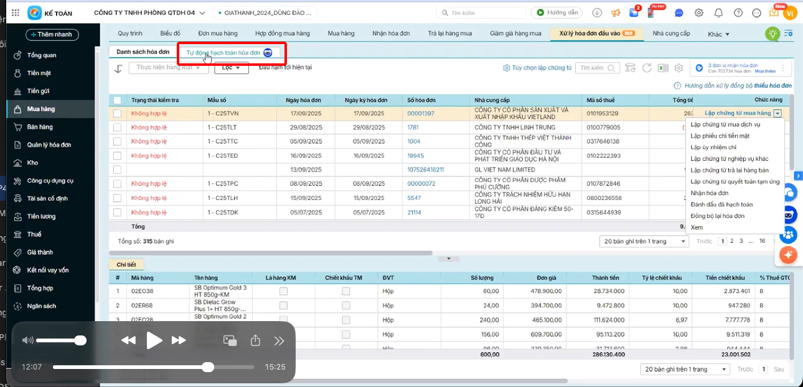
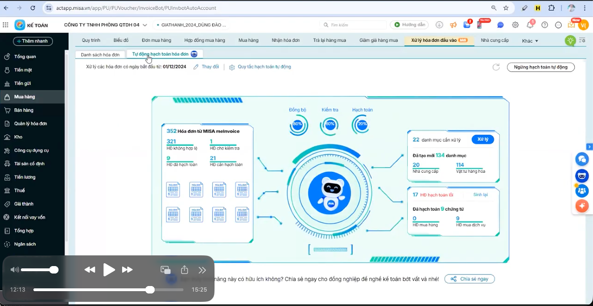
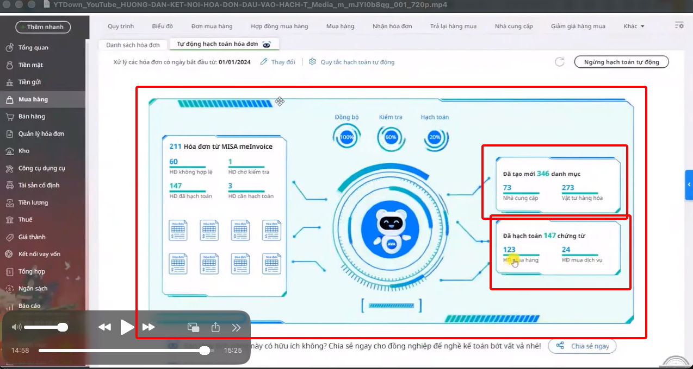

# CÁC CHỨC NĂNG CHÍNH CỦA HỆ THỐNG

---

### A. Kết nối dịch vụ hóa đơn đầu vào
*Tối ưu hóa quá trình thu thập và quản lý hóa đơn ngay trên hệ thống.*

- **Thiết lập:** Kết nối tài khoản  Invoice trực tiếp trên giao diện  Kế toán.
- **Đồng bộ hóa:** Tự động lấy dữ liệu hóa đơn từ cơ quan thuế hoặc từ email nhận hóa đơn về phần mềm.
- **Quản lý cơ cấu:** Cho phép chọn cụ thể các đơn vị/chi nhánh cần nhận hóa đơn đồng bộ.

---

### B. Kiểm tra tính hợp lệ (Auto-Check)
*Hệ thống tự động rà soát các thông tin quan trọng trên hóa đơn, đảm bảo tính hợp pháp và chính xác:*

- **Thông tin người mua/bán:** Tên công ty, mã số thuế, địa chỉ *(hệ thống sẽ tự động cảnh báo nếu có sai sót)*.
- **Trạng thái hóa đơn:** Kiểm tra hóa đơn có hợp lệ, hợp pháp theo quy định của cơ quan Thuế hay không.
- **Chữ ký số:** Xác thực tính hiệu lực và an toàn của chữ ký số trên hóa đơn điện tử.

---

### C. Xử lý danh mục tự động (Master Data Management)
*Mục tiêu: Đảm bảo tính nhất quán của dữ liệu (Data Integrity) giữa hóa đơn và hệ thống ERP.*

- **Tự động nhận diện Nhà cung cấp (Vendor Recognition):**
  - **Cơ chế:** Hệ thống trích xuất Mã số thuế (MST) từ file XML của hóa đơn.
  - **Xử lý:**
    - *Nếu MST đã tồn tại trong danh mục:* Hệ thống tự động liên kết (map) hóa đơn với nhà cung cấp đó.
    - *Nếu MST chưa tồn tại:* Hệ thống sử dụng API kết nối trực tiếp với Tổng cục Thuế để lấy các thông tin: Tên chính thức, địa chỉ, trạng thái hoạt động (đang hoạt động, tạm ngừng...) và tự động khởi tạo mã NCC mới.
  - **Lợi ích:** Tránh việc tạo trùng lặp NCC và đảm bảo thông tin pháp lý luôn chính xác theo dữ liệu cơ quan Thuế.

- **Tự động nhận diện Vật tư hàng hóa (Item Mapping):**
  - **Cơ chế:** Đối soát tên hàng hóa trên hóa đơn với danh mục trong kho.
  - **Thông minh (Smart Mapping):** Kế toán chỉ cần thiết lập mapping một lần *(Ví dụ: Tên trên hóa đơn là "Máy tính Dell Vostro" tương ứng với mã kho "MT-DELL")*. Hệ thống sẽ ghi nhớ quy tắc này cho các lần sau.
  - **Thêm mới nhanh:** Cho phép tạo nhanh mã vật tư ngay tại giao diện xử lý hóa đơn nếu hàng hóa đó lần đầu nhập về.

---

### D. Hạch toán tự động  

 
- **Phân loại (Intelligent Classification):**
  Dựa trên tính chất mặt hàng và lịch sử hạch toán, trợ lý sẽ gợi ý loại chứng từ phù hợp:
  - Mua hàng hóa nhập kho (611, 152, 156...)
  - Mua dịch vụ (641, 642, 242...)
  - Mua tài sản cố định/Công cụ dụng cụ.

- **Sinh chứng từ tự động (Auto-Generation):**
  - **Định khoản:** Tự động điền các cặp tài khoản Nợ/Có dựa trên "Quy tắc hạch toán" đã thiết lập sẵn cho từng nhóm hàng hoặc nhà cung cấp.
  - **Trích xuất số liệu:** Tự động tách tiền hàng, tiền thuế (8%, 10%), tổng thanh toán và các thông tin số hóa đơn, ký hiệu, ngày hóa đơn vào chứng từ kế toán.
  - **Khớp hóa đơn:** Chứng từ được tạo ra sẽ tự động đính kèm file gốc (PDF/XML) để phục vụ việc tra soát sau này.

- **Ghi sổ hàng loạt (Batch Processing):**
  - Thay vì duyệt từng tờ, kế toán có thể chọn hàng trăm hóa đơn cùng lúc.Hệ thống kiểm tra điều kiện (Nếu đủ thông tin tài khoản, đủ vật tư kho) -> tự động ghi sổ toàn bộ.
