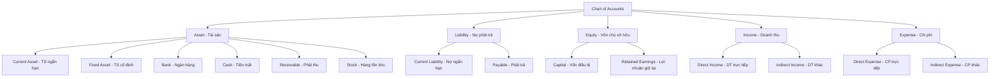
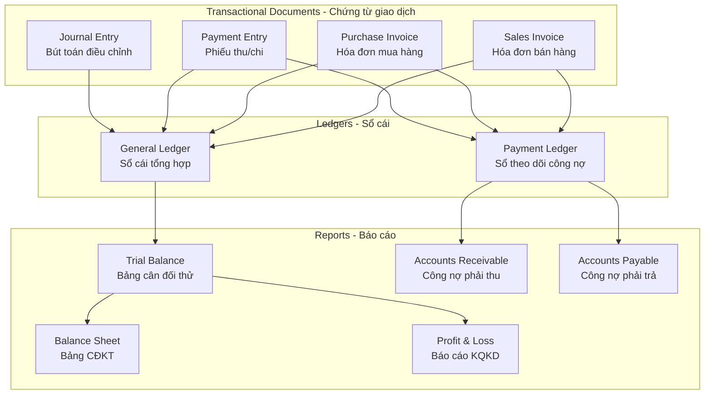
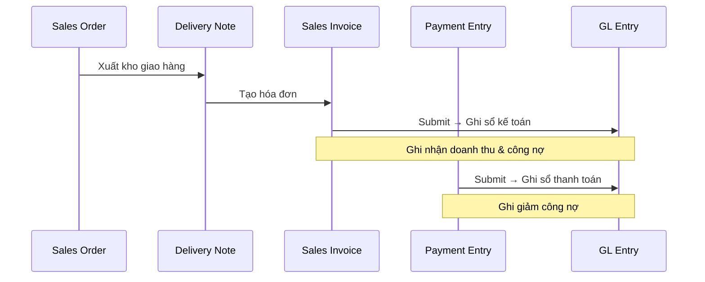
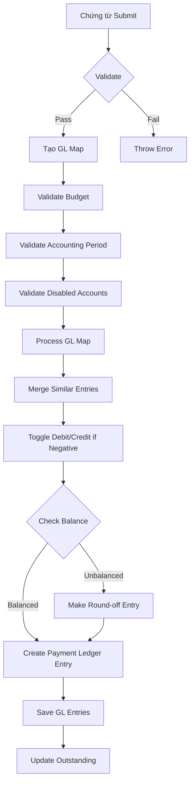
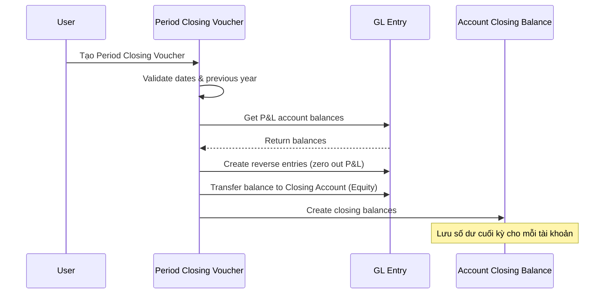
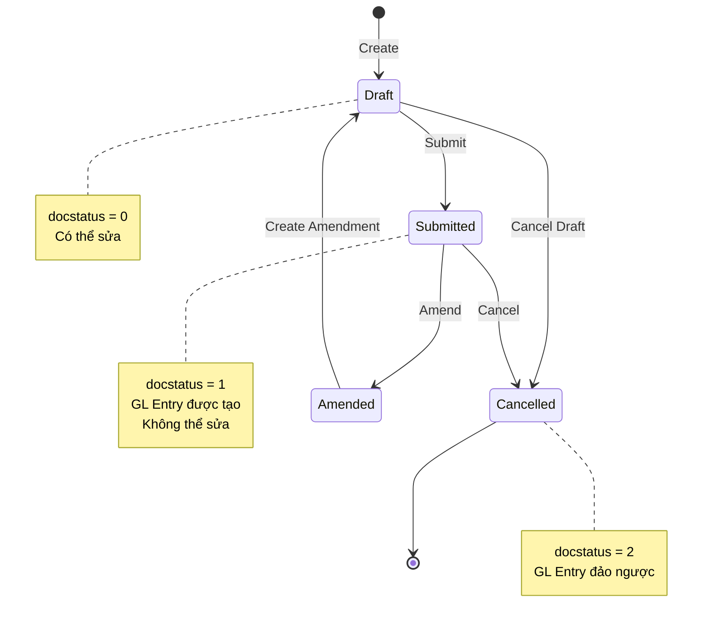
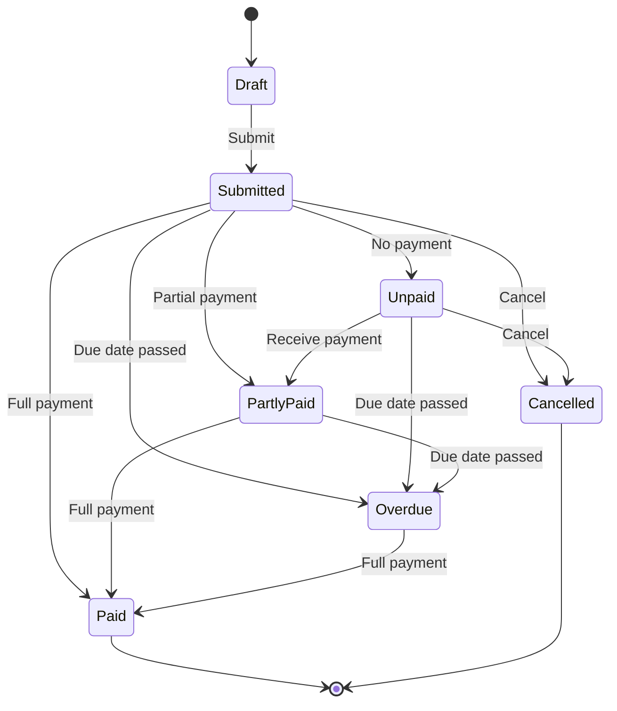

# Phân Tích Chi Tiết Luồng Nghiệp Vụ Kế Toán (Accounting Workflow)

> **Mục đích:** Document này giải thích toàn diện về quy trình kế toán, các khái niệm cơ bản, và cách ERPNext triển khai các nghiệp vụ kế toán.

---

## 1. Tổng Quan Về Kế Toán

### 1.1. Kế Toán Là Gì?

**Kế toán** (Accounting) là hệ thống ghi chép, phân loại, và tổng hợp các giao dịch tài chính của doanh nghiệp để cung cấp thông tin cho việc ra quyết định kinh doanh.

**Mục đích chính:**
- ✅ Theo dõi tài sản và nợ phải trả
- ✅ Ghi nhận doanh thu và chi phí
- ✅ Tính toán lợi nhuận/lỗ
- ✅ Cung cấp báo cáo tài chính cho ban lãnh đạo, cổ đông, cơ quan thuế

### 1.2. Nguyên Tắc Kế Toán Kép (Double-Entry Accounting)

**Đây là nguyên tắc nền tảng của mọi hệ thống kế toán:**

```
Mỗi giao dịch phải ghi vào ít nhất 2 tài khoản:
- Một bên GHI NỢ (Debit)
- Một bên GHI CÓ (Credit)

⚖️ TỔNG DEBIT = TỔNG CREDIT (luôn luôn cân bằng)
```

**Ví dụ đơn giản:**
```
Bán hàng 10.000.000 VND, khách hàng trả tiền mặt:

📊 Bút toán:
┌────────────────────────┬────────────┬────────────┐
│ Tài khoản              │ Nợ (Debit) │ Có (Credit)│
├────────────────────────┼────────────┼────────────┤
│ Tiền mặt (Cash)        │ 10.000.000 │            │
│ Doanh thu (Revenue)    │            │ 10.000.000 │
├────────────────────────┼────────────┼────────────┤
│ TỔNG                   │ 10.000.000 │ 10.000.000 │
└────────────────────────┴────────────┴────────────┘
✅ Cân bằng!
```

---

## 2. Các Khái Niệm Cơ Bản Trong Kế Toán

### 2.1. Hệ Thống Tài Khoản (Chart of Accounts - COA)

**Chart of Accounts** là bảng liệt kê tất cả các tài khoản kế toán được sử dụng để ghi nhận giao dịch.

#### 5 Loại Tài Khoản Gốc (Root Types)



#### Phân Loại Báo Cáo (Report Types)

| Loại tài khoản | Báo cáo | Giải thích |
|----------------|---------|------------|
| Asset, Liability, Equity | **Balance Sheet** (Bảng cân đối kế toán) | Thể hiện tình trạng tài chính tại một thời điểm |
| Income, Expense | **Profit and Loss** (Báo cáo kết quả kinh doanh) | Thể hiện lợi nhuận/lỗ trong một kỳ |

### 2.2. Quy Tắc Ghi Nợ/Có

```
📌 QUY TẮC GHI NỢ (DEBIT):
┌────────────────────────────────────────────────────┐
│ ✅ Tài sản TĂNG        → Ghi Nợ (Debit)            │
│ ✅ Chi phí TĂNG        → Ghi Nợ (Debit)            │
│ ✅ Nợ phải trả GIẢM    → Ghi Nợ (Debit)            │
│ ✅ Vốn chủ sở hữu GIẢM → Ghi Nợ (Debit)            │
│ ✅ Doanh thu GIẢM      → Ghi Nợ (Debit)            │
└────────────────────────────────────────────────────┘

📌 QUY TẮC GHI CÓ (CREDIT):
┌────────────────────────────────────────────────────┐
│ ✅ Tài sản GIẢM        → Ghi Có (Credit)           │
│ ✅ Chi phí GIẢM        → Ghi Có (Credit)           │
│ ✅ Nợ phải trả TĂNG    → Ghi Có (Credit)           │
│ ✅ Vốn chủ sở hữu TĂNG → Ghi Có (Credit)           │
│ ✅ Doanh thu TĂNG      → Ghi Có (Credit)           │
└────────────────────────────────────────────────────┘
```

**Bảng tóm tắt:**

| Loại tài khoản | Số dư bình thường | Tăng | Giảm |
|----------------|-------------------|------|------|
| Asset (Tài sản) | Debit | Debit | Credit |
| Expense (Chi phí) | Debit | Debit | Credit |
| Liability (Nợ) | Credit | Credit | Debit |
| Equity (Vốn) | Credit | Credit | Debit |
| Income (Doanh thu) | Credit | Credit | Debit |

### 2.3. Phương Trình Kế Toán Cơ Bản

```
┌─────────────────────────────────────────────────────────────┐
│                                                             │
│   ASSET = LIABILITY + EQUITY                                │
│   (Tài sản = Nợ phải trả + Vốn chủ sở hữu)                 │
│                                                             │
└─────────────────────────────────────────────────────────────┘
```

**Mở rộng:**
```
ASSET = LIABILITY + EQUITY + (INCOME - EXPENSE)

Trong đó:
- INCOME - EXPENSE = Lợi nhuận/Lỗ ròng
- Lợi nhuận sẽ làm tăng Vốn chủ sở hữu
- Lỗ sẽ làm giảm Vốn chủ sở hữu
```

---

## 3. Cấu Trúc Module Kế Toán Trong ERPNext

### 3.1. Kiến Trúc Tổng Quan



### 3.2. Các DocType Chính

#### A. Account (Tài khoản kế toán)

**File:** `dcnet_core/erpnext/accounts/doctype/account/account.py`

```python
# Cấu trúc Account sử dụng NestedSet (cây phân cấp)
class Account(NestedSet):
    # Các trường quan trọng:
    account_name: str           # Tên tài khoản
    account_number: str         # Mã tài khoản (VD: 111, 131, 511...)
    account_type: str           # Loại: Bank, Cash, Receivable, Payable...
    root_type: str              # Loại gốc: Asset, Liability, Income, Expense, Equity
    report_type: str            # Báo cáo: Balance Sheet / Profit and Loss
    parent_account: str         # Tài khoản cha
    company: str                # Công ty
    is_group: bool              # Là nhóm hay là tài khoản chi tiết
```

**Account Types (30+ loại):**
- `Bank` - Tài khoản ngân hàng
- `Cash` - Tiền mặt
- `Receivable` - Phải thu khách hàng
- `Payable` - Phải trả nhà cung cấp
- `Stock` - Hàng tồn kho
- `Fixed Asset` - Tài sản cố định
- `Depreciation` - Khấu hao
- `Income Account` - Tài khoản doanh thu
- `Expense Account` - Tài khoản chi phí
- `Tax` - Thuế

#### B. GL Entry (Bút toán sổ cái)

**File:** `dcnet_core/erpnext/accounts/doctype/gl_entry/gl_entry.py`

```python
class GLEntry(Document):
    # Các trường quan trọng:
    posting_date: date          # Ngày ghi sổ
    account: str                # Tài khoản
    debit: float                # Số tiền ghi Nợ (đồng công ty)
    credit: float               # Số tiền ghi Có (đồng công ty)
    debit_in_account_currency: float   # Nợ theo tiền tài khoản
    credit_in_account_currency: float  # Có theo tiền tài khoản
    party_type: str             # Loại đối tác: Customer/Supplier
    party: str                  # Tên đối tác
    voucher_type: str           # Loại chứng từ: Sales Invoice, Payment Entry...
    voucher_no: str             # Số chứng từ
    against_voucher_type: str   # Chứng từ đối ứng
    against_voucher: str        # Số chứng từ đối ứng
    cost_center: str            # Trung tâm chi phí
    remarks: str                # Ghi chú
```

**Đặc điểm quan trọng:**
- GL Entry là **READ-ONLY** - không thể sửa trực tiếp
- Được tạo tự động khi submit chứng từ
- Cancellation tạo bút toán đảo ngược (reverse entry)

#### C. Journal Entry (Bút toán điều chỉnh)

**File:** `dcnet_core/erpnext/accounts/doctype/journal_entry/journal_entry.py`

```python
class JournalEntry(AccountsController):
    voucher_type: Literal[
        "Journal Entry",              # Bút toán thông thường
        "Bank Entry",                 # Thu/chi ngân hàng
        "Cash Entry",                 # Thu/chi tiền mặt
        "Opening Entry",              # Số dư đầu kỳ
        "Depreciation Entry",         # Khấu hao
        "Write Off Entry",            # Xóa sổ
        "Exchange Gain Or Loss",      # Chênh lệch tỷ giá
        "Deferred Revenue",           # Doanh thu chưa thực hiện
        "Deferred Expense",           # Chi phí trả trước
        ...
    ]
```

**Khi nào dùng Journal Entry:**
- ✅ Bút toán điều chỉnh cuối kỳ
- ✅ Ghi nhận khấu hao tài sản
- ✅ Xóa sổ công nợ khó đòi
- ✅ Điều chỉnh chênh lệch tỷ giá
- ✅ Ghi nhận doanh thu/chi phí chưa thực hiện
- ✅ Số dư đầu kỳ khi bắt đầu sử dụng hệ thống

---

## 4. Luồng Nghiệp Vụ Bán Hàng (Sales → Accounting)

### 4.1. Quy Trình Tổng Quan



### 4.2. Sales Invoice (Hóa đơn Bán Hàng)

**File:** `dcnet_core/erpnext/accounts/doctype/sales_invoice/sales_invoice.py`

#### Khi Submit Sales Invoice, hệ thống tự động:

```
📊 Bút toán khi bán hàng 10.000.000 VND (chưa thu tiền):

┌────────────────────────┬────────────┬────────────┐
│ Tài khoản              │ Nợ (Debit) │ Có (Credit)│
├────────────────────────┼────────────┼────────────┤
│ Phải thu khách hàng    │ 10.000.000 │            │
│ (Receivable - 131)     │            │            │
├────────────────────────┼────────────┼────────────┤
│ Doanh thu bán hàng     │            │ 10.000.000 │
│ (Revenue - 511)        │            │            │
├────────────────────────┼────────────┼────────────┤
│ TỔNG                   │ 10.000.000 │ 10.000.000 │
└────────────────────────┴────────────┴────────────┘

Giải thích:
- Phải thu TĂNG → Ghi Nợ (Asset tăng)
- Doanh thu TĂNG → Ghi Có (Income tăng)
```

#### Khi có thuế VAT 10%:

```
📊 Bán hàng 10.000.000 + VAT 10% = 11.000.000 VND:

┌────────────────────────┬────────────┬────────────┐
│ Tài khoản              │ Nợ (Debit) │ Có (Credit)│
├────────────────────────┼────────────┼────────────┤
│ Phải thu khách hàng    │ 11.000.000 │            │
│ (Receivable - 131)     │            │            │
├────────────────────────┼────────────┼────────────┤
│ Doanh thu bán hàng     │            │ 10.000.000 │
│ (Revenue - 511)        │            │            │
├────────────────────────┼────────────┼────────────┤
│ Thuế VAT đầu ra        │            │  1.000.000 │
│ (Tax Payable - 33311)  │            │            │
├────────────────────────┼────────────┼────────────┤
│ TỔNG                   │ 11.000.000 │ 11.000.000 │
└────────────────────────┴────────────┴────────────┘
```

#### Code Reference - GL Entry Creation:

```python
# sales_invoice.py:474
def on_submit(self):
    # ...
    self.make_gl_entries()  # Tạo GL Entry
```

### 4.3. Payment Entry (Phiếu Thu/Chi)

**File:** `dcnet_core/erpnext/accounts/doctype/payment_entry/payment_entry.py`

#### Khi khách hàng thanh toán:

```
📊 Khách hàng thanh toán 11.000.000 VND qua ngân hàng:

┌────────────────────────┬────────────┬────────────┐
│ Tài khoản              │ Nợ (Debit) │ Có (Credit)│
├────────────────────────┼────────────┼────────────┤
│ Ngân hàng              │ 11.000.000 │            │
│ (Bank - 112)           │            │            │
├────────────────────────┼────────────┼────────────┤
│ Phải thu khách hàng    │            │ 11.000.000 │
│ (Receivable - 131)     │            │            │
├────────────────────────┼────────────┼────────────┤
│ TỔNG                   │ 11.000.000 │ 11.000.000 │
└────────────────────────┴────────────┴────────────┘

Giải thích:
- Tiền ngân hàng TĂNG → Ghi Nợ (Asset tăng)
- Phải thu GIẢM → Ghi Có (Asset giảm)
```

#### Payment Types:

| Payment Type | Từ tài khoản | Đến tài khoản | Mục đích |
|--------------|--------------|---------------|----------|
| **Receive** | Customer Account (Receivable) | Bank/Cash | Thu tiền từ khách hàng |
| **Pay** | Bank/Cash | Supplier Account (Payable) | Trả tiền cho nhà cung cấp |
| **Internal Transfer** | Bank A | Bank B | Chuyển nội bộ giữa các TK ngân hàng |

---

## 5. Luồng Nghiệp Vụ Mua Hàng (Purchase → Accounting)

### 5.1. Quy Trình Tổng Quan


### 5.2. Purchase Invoice (Hóa đơn Mua Hàng)

**File:** `dcnet_core/erpnext/accounts/doctype/purchase_invoice/purchase_invoice.py`

#### Khi Submit Purchase Invoice:

```
📊 Mua hàng 8.000.000 + VAT 10% = 8.800.000 VND (chưa trả tiền):

┌────────────────────────┬────────────┬────────────┐
│ Tài khoản              │ Nợ (Debit) │ Có (Credit)│
├────────────────────────┼────────────┼────────────┤
│ Giá vốn hàng bán       │  8.000.000 │            │
│ (COGS - 632)           │            │            │
├────────────────────────┼────────────┼────────────┤
│ Thuế VAT đầu vào       │    800.000 │            │
│ (Input VAT - 1331)     │            │            │
├────────────────────────┼────────────┼────────────┤
│ Phải trả nhà cung cấp  │            │  8.800.000 │
│ (Payable - 331)        │            │            │
├────────────────────────┼────────────┼────────────┤
│ TỔNG                   │  8.800.000 │  8.800.000 │
└────────────────────────┴────────────┴────────────┘

Giải thích:
- Chi phí TĂNG → Ghi Nợ (Expense tăng)
- VAT được khấu trừ → Ghi Nợ (Asset - tài sản trả trước)
- Phải trả TĂNG → Ghi Có (Liability tăng)
```

#### Khi thanh toán cho nhà cung cấp:

```
📊 Thanh toán 8.800.000 VND qua ngân hàng:

┌────────────────────────┬────────────┬────────────┐
│ Tài khoản              │ Nợ (Debit) │ Có (Credit)│
├────────────────────────┼────────────┼────────────┤
│ Phải trả nhà cung cấp  │  8.800.000 │            │
│ (Payable - 331)        │            │            │
├────────────────────────┼────────────┼────────────┤
│ Ngân hàng              │            │  8.800.000 │
│ (Bank - 112)           │            │            │
├────────────────────────┼────────────┼────────────┤
│ TỔNG                   │  8.800.000 │  8.800.000 │
└────────────────────────┴────────────┴────────────┘

Giải thích:
- Phải trả GIẢM → Ghi Nợ (Liability giảm)
- Tiền ngân hàng GIẢM → Ghi Có (Asset giảm)
```

---

## 6. Quy Trình Xử Lý GL Entry

### 6.1. Flow Chart



### 6.2. Code Flow - make_gl_entries()

**File:** `dcnet_core/erpnext/accounts/general_ledger.py`

```python
def make_gl_entries(
    gl_map,
    cancel=False,
    adv_adj=False,
    merge_entries=True,
    update_outstanding="Yes",
    from_repost=False,
):
    if gl_map:
        # 1. Validate budget
        bud_val = BudgetValidation(gl_map=gl_map)
        bud_val.validate()

        if not cancel:
            # 2. Xử lý accounting dimensions
            make_acc_dimensions_offsetting_entry(gl_map)

            # 3. Kiểm tra accounting period đóng chưa
            validate_accounting_period(gl_map)

            # 4. Kiểm tra tài khoản disabled
            validate_disabled_accounts(gl_map)

            # 5. Process GL Map (merge, toggle)
            gl_map = process_gl_map(gl_map, merge_entries, from_repost)

            # 6. Tạo Payment Ledger Entry (cho công nợ)
            create_payment_ledger_entry(gl_map, ...)

            # 7. Lưu GL Entries
            save_entries(gl_map, adv_adj, update_outstanding, from_repost)
        else:
            # Nếu cancel, tạo bút toán đảo ngược
            make_reverse_gl_entries(gl_map, ...)
```

### 6.3. Validate Debit = Credit

```python
# general_ledger.py:503-520
def get_debit_credit_difference(gl_map, precision):
    debit_credit_diff = 0.0
    for entry in gl_map:
        entry.debit = flt(entry.debit, precision)
        entry.credit = flt(entry.credit, precision)
        debit_credit_diff += entry.debit - entry.credit

    return debit_credit_diff

# Nếu có chênh lệch nhỏ (do làm tròn), tự động tạo round-off entry
# Nếu chênh lệch lớn → Throw error
```

---

## 7. Khóa Sổ Cuối Kỳ (Period Closing)

### 7.1. Tại Sao Cần Khóa Sổ?

**Period Closing Voucher** được sử dụng để:
1. ✅ Chuyển số dư các tài khoản Profit & Loss sang tài khoản Equity
2. ✅ Chuẩn bị cho năm tài chính mới
3. ✅ Ngăn không cho sửa đổi các giao dịch trong kỳ đã đóng

### 7.2. Quy Trình Khóa Sổ

**File:** `dcnet_core/erpnext/accounts/doctype/period_closing_voucher/period_closing_voucher.py`



### 7.3. Bút Toán Kết Chuyển

```
📊 Ví dụ cuối năm:
- Tổng Doanh thu: 100.000.000 VND
- Tổng Chi phí:    60.000.000 VND
- Lợi nhuận:       40.000.000 VND

Bút toán kết chuyển:

┌────────────────────────┬─────────────┬─────────────┐
│ Tài khoản              │ Nợ (Debit)  │ Có (Credit) │
├────────────────────────┼─────────────┼─────────────┤
│ Doanh thu bán hàng     │ 100.000.000 │             │
│ (Revenue - 511)        │             │             │
├────────────────────────┼─────────────┼─────────────┤
│ Chi phí                │             │  60.000.000 │
│ (Expense - 6xx)        │             │             │
├────────────────────────┼─────────────┼─────────────┤
│ Lợi nhuận giữ lại      │             │  40.000.000 │
│ (Retained Earnings)    │             │             │
├────────────────────────┼─────────────┼─────────────┤
│ TỔNG                   │ 100.000.000 │ 100.000.000 │
└────────────────────────┴─────────────┴─────────────┘

Kết quả:
- Các tài khoản P&L được RESET về 0
- Lợi nhuận chuyển vào Vốn chủ sở hữu
```

---

## 8. Báo Cáo Tài Chính

### 8.1. Trial Balance (Bảng Cân Đối Thử)

**Mục đích:** Kiểm tra tổng Nợ = tổng Có trước khi lập báo cáo chính thức.

```
📊 Bảng Cân Đối Thử (Trial Balance)

┌────────────────────────┬────────────┬────────────┐
│ Tài khoản              │ Số dư Nợ   │ Số dư Có   │
├────────────────────────┼────────────┼────────────┤
│ Tiền mặt               │  5.000.000 │            │
│ Ngân hàng              │ 50.000.000 │            │
│ Phải thu khách hàng    │ 20.000.000 │            │
│ Hàng tồn kho           │ 30.000.000 │            │
├────────────────────────┼────────────┼────────────┤
│ Phải trả NCC           │            │ 15.000.000 │
│ Vốn điều lệ            │            │ 50.000.000 │
│ Lợi nhuận giữ lại      │            │ 40.000.000 │
├────────────────────────┼────────────┼────────────┤
│ TỔNG                   │105.000.000 │105.000.000 │
└────────────────────────┴────────────┴────────────┘
✅ Cân bằng!
```

### 8.2. Balance Sheet (Bảng Cân Đối Kế Toán)

**Mục đích:** Thể hiện tình trạng tài chính tại một thời điểm.

```
📊 Bảng Cân Đối Kế Toán
   Ngày 31/12/2025

TÀI SẢN (ASSETS)
├── Tài sản ngắn hạn
│   ├── Tiền mặt                    5.000.000
│   ├── Ngân hàng                  50.000.000
│   ├── Phải thu khách hàng        20.000.000
│   └── Hàng tồn kho               30.000.000
│       Tổng TS ngắn hạn:         105.000.000
│
├── Tài sản dài hạn
│   ├── Tài sản cố định            80.000.000
│   └── Khấu hao lũy kế           (20.000.000)
│       Tổng TS dài hạn:           60.000.000
│
└── TỔNG TÀI SẢN:                 165.000.000

NỢ PHẢI TRẢ & VỐN (LIABILITIES & EQUITY)
├── Nợ phải trả
│   ├── Phải trả NCC               15.000.000
│   └── Thuế phải nộp              10.000.000
│       Tổng nợ phải trả:          25.000.000
│
├── Vốn chủ sở hữu
│   ├── Vốn điều lệ               100.000.000
│   └── Lợi nhuận giữ lại          40.000.000
│       Tổng vốn CSH:             140.000.000
│
└── TỔNG NỢ & VỐN:                165.000.000

✅ Tài sản = Nợ + Vốn (165 = 25 + 140)
```

### 8.3. Profit & Loss (Báo Cáo Kết Quả Kinh Doanh)

**Mục đích:** Thể hiện lợi nhuận/lỗ trong một kỳ.

```
📊 Báo Cáo Kết Quả Kinh Doanh
   Từ 01/01/2025 đến 31/12/2025

DOANH THU (INCOME)
├── Doanh thu bán hàng            200.000.000
├── Doanh thu dịch vụ              50.000.000
└── Thu nhập khác                   5.000.000
    ─────────────────────────────────────────
    TỔNG DOANH THU:               255.000.000

CHI PHÍ (EXPENSES)
├── Giá vốn hàng bán              120.000.000
├── Chi phí lương                  50.000.000
├── Chi phí thuê mặt bằng          24.000.000
├── Chi phí điện nước               6.000.000
├── Chi phí khấu hao               10.000.000
└── Chi phí khác                    5.000.000
    ─────────────────────────────────────────
    TỔNG CHI PHÍ:                 215.000.000

LỢI NHUẬN TRƯỚC THUẾ:              40.000.000
Thuế TNDN (20%):                   (8.000.000)
    ─────────────────────────────────────────
LỢI NHUẬN SAU THUẾ:                32.000.000
```

---

## 9. Các Tình Huống Đặc Biệt

### 9.1. Multi-Currency (Đa Tiền Tệ)

ERPNext hỗ trợ giao dịch đa tiền tệ:

```
📊 Bán hàng 1.000 USD (tỷ giá 24.000):

┌────────────────────────┬────────────┬────────────┬────────────┐
│ Tài khoản              │ Nợ (VND)   │ Có (VND)   │ Tiền gốc   │
├────────────────────────┼────────────┼────────────┼────────────┤
│ Phải thu (USD)         │ 24.000.000 │            │ $1,000     │
│ Doanh thu              │            │ 24.000.000 │ $1,000     │
└────────────────────────┴────────────┴────────────┴────────────┘

Khi thanh toán (tỷ giá 24.500):

┌────────────────────────┬────────────┬────────────┬────────────┐
│ Tài khoản              │ Nợ (VND)   │ Có (VND)   │ Tiền gốc   │
├────────────────────────┼────────────┼────────────┼────────────┤
│ Ngân hàng (USD)        │ 24.500.000 │            │ $1,000     │
│ Phải thu (USD)         │            │ 24.000.000 │ $1,000     │
│ Lãi chênh lệch tỷ giá  │            │    500.000 │            │
└────────────────────────┴────────────┴────────────┴────────────┘
```

### 9.2. Credit Note / Debit Note (Hóa đơn Điều Chỉnh)

**Credit Note (Giảm giá cho khách):**
```
Khách hàng trả lại hàng 2.000.000 VND:

┌────────────────────────┬────────────┬────────────┐
│ Tài khoản              │ Nợ (Debit) │ Có (Credit)│
├────────────────────────┼────────────┼────────────┤
│ Doanh thu              │  2.000.000 │            │
│ Phải thu khách hàng    │            │  2.000.000 │
└────────────────────────┴────────────┴────────────┘
(Đảo ngược bút toán bán hàng)
```

**Debit Note (Giảm giá từ NCC):**
```
NCC giảm giá 1.000.000 VND:

┌────────────────────────┬────────────┬────────────┐
│ Tài khoản              │ Nợ (Debit) │ Có (Credit)│
├────────────────────────┼────────────┼────────────┤
│ Phải trả NCC           │  1.000.000 │            │
│ Chi phí mua hàng       │            │  1.000.000 │
└────────────────────────┴────────────┴────────────┘
```

### 9.3. Advance Payment (Thanh toán trước)

```
Khách hàng đặt cọc 5.000.000 VND:

┌────────────────────────┬────────────┬────────────┐
│ Tài khoản              │ Nợ (Debit) │ Có (Credit)│
├────────────────────────┼────────────┼────────────┤
│ Ngân hàng              │  5.000.000 │            │
│ Người mua trả tiền trước│           │  5.000.000 │
│ (Advance Received)     │            │            │
└────────────────────────┴────────────┴────────────┘

Khi xuất hóa đơn, tiền đặt cọc được khấu trừ tự động.
```

---

## 10. State Machine - Trạng Thái Chứng Từ

### 10.1. Document Status



### 10.2. Invoice Status



---

## 11. Code References

### 11.1. Key Files

| File | Lines | Purpose |
|------|-------|---------|
| `accounts/general_ledger.py` | 880 | GL Entry processing pipeline |
| `accounts/utils.py` | 2,609 | Utility functions (balances, fiscal year) |
| `accounts/party.py` | 1,083 | Party account management |
| `accounts/doctype/account/account.py` | 687 | Account master with hierarchy |
| `accounts/doctype/gl_entry/gl_entry.py` | 493 | GL Entry document |
| `accounts/doctype/sales_invoice/sales_invoice.py` | 3,072 | Sales invoice logic |
| `accounts/doctype/purchase_invoice/purchase_invoice.py` | 2,068 | Purchase invoice logic |
| `accounts/doctype/payment_entry/payment_entry.py` | 3,560 | Payment processing |
| `accounts/doctype/journal_entry/journal_entry.py` | 1,765 | Journal entry |
| `accounts/doctype/period_closing_voucher/period_closing_voucher.py` | 542 | Period closing |

### 11.2. Key Functions

| Function | File:Line | Purpose |
|----------|-----------|---------|
| `make_gl_entries()` | general_ledger.py:29-68 | Create GL entries from document |
| `process_gl_map()` | general_ledger.py:189-201 | Merge & validate GL entries |
| `make_reverse_gl_entries()` | general_ledger.py:680-789 | Reverse GL on cancel |
| `create_payment_ledger_entry()` | utils.py | Track outstanding amounts |
| `get_balance_on()` | utils.py | Get account balance on date |
| `validate_accounting_period()` | general_ledger.py:154-186 | Check closed periods |

---

## 12. Key Takeaways

### 12.1. Nguyên Tắc Quan Trọng

1. **Double-Entry Accounting**: Mọi giao dịch đều có 2 bên, Debit = Credit
2. **GL Entry là Read-Only**: Chỉ tạo từ chứng từ, không sửa trực tiếp
3. **Cancel = Reverse Entry**: Hủy chứng từ = Tạo bút toán đảo ngược
4. **Period Closing**: Phải đóng sổ cuối kỳ để chuyển lợi nhuận sang vốn

### 12.2. Flow Summary

```
1. SALES FLOW:
   Sales Order → Delivery Note → Sales Invoice → Payment Entry
   (Đơn hàng → Giao hàng → Hóa đơn → Thu tiền)

2. PURCHASE FLOW:
   Purchase Order → Purchase Receipt → Purchase Invoice → Payment Entry
   (Đặt hàng → Nhập kho → Hóa đơn → Trả tiền)

3. ACCOUNTING FLOW:
   Transaction Document → Submit → GL Entry → Reports
   (Chứng từ → Duyệt → Bút toán → Báo cáo)

4. PERIOD CLOSING FLOW:
   End of Period → Period Closing Voucher → Reset P&L → Transfer to Equity
   (Cuối kỳ → Khóa sổ → Reset thu chi → Chuyển vốn)
```

### 12.3. Công Thức Nhớ

```
📌 Công thức tính lợi nhuận:
   Profit = Income - Expense

📌 Phương trình kế toán:
   Asset = Liability + Equity + (Income - Expense)

📌 Quy tắc ghi sổ:
   Asset/Expense tăng → Debit
   Asset/Expense giảm → Credit
   Liability/Equity/Income tăng → Credit
   Liability/Equity/Income giảm → Debit
```

---

## 13. Glossary (Từ Điển Thuật Ngữ)

| Thuật ngữ | Tiếng Việt | Giải thích |
|-----------|------------|------------|
| Account | Tài khoản | Đơn vị ghi nhận giao dịch |
| Asset | Tài sản | Nguồn lực kinh tế của DN |
| Liability | Nợ phải trả | Nghĩa vụ tài chính |
| Equity | Vốn chủ sở hữu | Phần còn lại sau khi trừ nợ |
| Income/Revenue | Doanh thu | Tiền bán hàng/dịch vụ |
| Expense | Chi phí | Tiền chi ra để tạo doanh thu |
| Debit | Ghi Nợ | Bên trái của bút toán |
| Credit | Ghi Có | Bên phải của bút toán |
| GL Entry | Bút toán sổ cái | Mỗi dòng ghi trong sổ cái |
| Journal Entry | Bút toán điều chỉnh | Bút toán thủ công |
| Receivable | Phải thu | Tiền khách hàng còn nợ |
| Payable | Phải trả | Tiền DN còn nợ NCC |
| Trial Balance | Bảng cân đối thử | Kiểm tra cân bằng Nợ/Có |
| Balance Sheet | Bảng CĐKT | Báo cáo tài sản & nguồn vốn |
| Profit & Loss | Báo cáo KQKD | Báo cáo lãi/lỗ |
| Fiscal Year | Năm tài chính | Kỳ kế toán 12 tháng |
| Period Closing | Khóa sổ | Đóng kỳ kế toán |
| Cost Center | Trung tâm chi phí | Nơi phát sinh chi phí |
| VAT | Thuế GTGT | Thuế giá trị gia tăng |

---

**Document Version:** 1.0
**Created:** 20/01/2026
**Author:** Claude Code Assistant
**Based on:** ERPNext v16 (dcnet_core)
