# ERPNext v16 — State Machine Chi Tiết: Selling · Stock · Buying · Accounting

> 4 module lõi vận hành tạo thành chu trình khép kín:
> **Bán → Xuất kho → Xuất HĐ → Thu tiền** và **Mua → Nhập kho → Nhận HĐ → Chi tiền**
>
> Mọi điều kiện status trong file này được trích **trực tiếp từ source code** ERPNext v16
> (`dcnet_core/erpnext/controllers/status_updater.py` + từng doctype `.py`)

---

## 0. Bức Tranh Toàn Cảnh — 4 Module Liên Kết

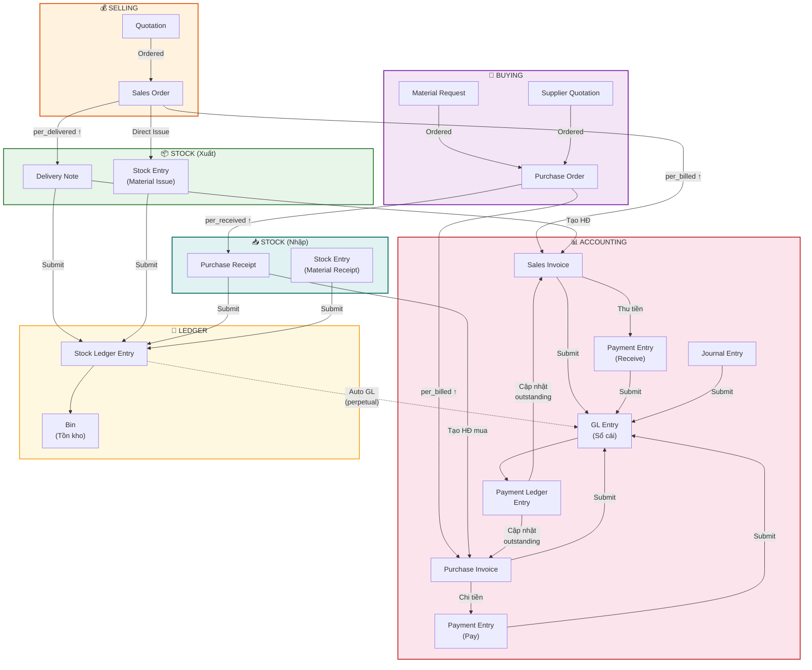
```mermaid
flowchart TB
    subgraph SELLING["💰 SELLING"]
        direction TB
        QTN["Quotation"]
        SO["Sales Order"]
        QTN -->|"Ordered"| SO
    end

    subgraph STOCK_OUT["📦 STOCK (Xuất)"]
        DN["Delivery Note"]
        SE_issue["Stock Entry\n(Material Issue)"]
    end

    subgraph STOCK_IN["📥 STOCK (Nhập)"]
        PR["Purchase Receipt"]
        SE_receipt["Stock Entry\n(Material Receipt)"]
    end

    subgraph BUYING["🛒 BUYING"]
        direction TB
        MR["Material Request"]
        SQ["Supplier Quotation"]
        PO["Purchase Order"]
        MR -->|"Ordered"| PO
        SQ -->|"Ordered"| PO
    end

    subgraph ACCOUNTING["📊 ACCOUNTING"]
        SI["Sales Invoice"]
        PI["Purchase Invoice"]
        PE_recv["Payment Entry\n(Receive)"]
        PE_pay["Payment Entry\n(Pay)"]
        JE["Journal Entry"]
        GL["GL Entry\n(Sổ cái)"]
        PLE["Payment Ledger\nEntry"]
    end

    subgraph LEDGER["📒 LEDGER"]
        SLE["Stock Ledger Entry"]
        BIN["Bin\n(Tồn kho)"]
    end

    %% === SELLING -> STOCK OUT ===
    SO -->|"per_delivered ↑"| DN
    SO -->|"Direct Issue"| SE_issue

    %% === SELLING -> ACCOUNTING ===
    SO -->|"per_billed ↑"| SI

    %% === STOCK OUT -> ACCOUNTING ===
    DN -->|"Tạo HĐ"| SI

    %% === STOCK OUT -> LEDGER ===
    DN -->|"Submit"| SLE
    SE_issue -->|"Submit"| SLE
    SLE --> BIN

    %% === BUYING -> STOCK IN ===
    PO -->|"per_received ↑"| PR

    %% === BUYING -> ACCOUNTING ===
    PO -->|"per_billed ↑"| PI

    %% === STOCK IN -> ACCOUNTING ===
    PR -->|"Tạo HĐ mua"| PI

    %% === STOCK IN -> LEDGER ===
    PR -->|"Submit"| SLE
    SE_receipt -->|"Submit"| SLE

    %% === ACCOUNTING -> GL ===
    SI -->|"Submit"| GL
    PI -->|"Submit"| GL
    PE_recv -->|"Submit"| GL
    PE_pay -->|"Submit"| GL
    JE -->|"Submit"| GL

    %% === PAYMENT -> OUTSTANDING ===
    GL --> PLE
    PLE -->|"Cập nhật\noutstanding"| SI
    PLE -->|"Cập nhật\noutstanding"| PI

    %% === PAYMENT FLOW ===
    SI -->|"Thu tiền"| PE_recv
    PI -->|"Chi tiền"| PE_pay

    %% === STOCK -> GL (Perpetual Inventory) ===
    SLE -.->|"Auto GL\n(perpetual)"| GL

    style SELLING fill:#fff3e0,stroke:#e65100,stroke-width:2px
    style STOCK_OUT fill:#e8f5e9,stroke:#2e7d32,stroke-width:2px
    style STOCK_IN fill:#e0f2f1,stroke:#00695c,stroke-width:2px
    style BUYING fill:#f3e5f5,stroke:#7b1fa2,stroke-width:2px
    style ACCOUNTING fill:#fce4ec,stroke:#c62828,stroke-width:2px
    style LEDGER fill:#fff8e1,stroke:#f9a825,stroke-width:2px
```

---

## 1. Cross-Document Status Update — Cơ Chế Trung Tâm

> Đây là "hệ thần kinh" của ERPNext — khi submit 1 document, nó tự động
> cập nhật `per_delivered`, `per_billed`, `per_received` trên document cha,
> và từ đó **tự động đổi status** của document cha.

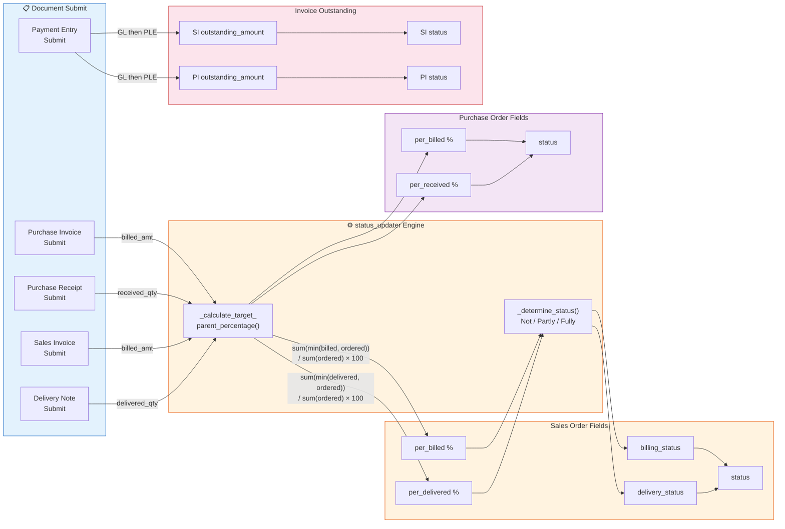
```mermaid
flowchart LR
    subgraph Triggers["📋 Document Submit"]
        DN_submit["Delivery Note\nSubmit"]
        SI_submit["Sales Invoice\nSubmit"]
        PR_submit["Purchase Receipt\nSubmit"]
        PI_submit["Purchase Invoice\nSubmit"]
        PE_submit["Payment Entry\nSubmit"]
    end

    subgraph Engine["⚙️ status_updater Engine"]
        calc["_calculate_target_\nparent_percentage()"]
        determine["_determine_status()\nNot / Partly / Fully"]
    end

    subgraph SO_update["Sales Order Fields"]
        SO_per_del["per_delivered %"]
        SO_per_bill["per_billed %"]
        SO_del_status["delivery_status"]
        SO_bill_status["billing_status"]
        SO_status["status"]
    end

    subgraph PO_update["Purchase Order Fields"]
        PO_per_recv["per_received %"]
        PO_per_bill["per_billed %"]
        PO_status["status"]
    end

    subgraph Invoice_update["Invoice Outstanding"]
        SI_out["SI outstanding_amount"]
        PI_out["PI outstanding_amount"]
        SI_status["SI status"]
        PI_status["PI status"]
    end

    DN_submit -->|"delivered_qty"| calc
    calc -->|"sum(min(delivered, ordered))\n/ sum(ordered) × 100"| SO_per_del
    SO_per_del --> determine --> SO_del_status --> SO_status

    SI_submit -->|"billed_amt"| calc
    calc -->|"sum(min(billed, ordered))\n/ sum(ordered) × 100"| SO_per_bill
    SO_per_bill --> determine --> SO_bill_status --> SO_status

    PR_submit -->|"received_qty"| calc
    calc --> PO_per_recv --> PO_status

    PI_submit -->|"billed_amt"| calc
    calc --> PO_per_bill --> PO_status

    PE_submit -->|"GL then PLE"| SI_out --> SI_status
    PE_submit -->|"GL then PLE"| PI_out --> PI_status

    style Triggers fill:#e3f2fd,stroke:#1565c0
    style Engine fill:#fff3e0,stroke:#e65100
    style SO_update fill:#fff3e0,stroke:#e65100
    style PO_update fill:#f3e5f5,stroke:#7b1fa2
    style Invoice_update fill:#fce4ec,stroke:#c62828
```

### Công thức tính percentage (chính xác từ source code)

```python
# status_updater.py → _calculate_target_parent_percentage()
percentage = round(
    sum(min(abs(item.target_field), abs(item.ref_field)) for item in children)
    / sum(abs(item.ref_field) for item in children)
    * 100, 6
)

# Ý nghĩa: min() đảm bảo không bao giờ vượt 100%
# Ví dụ: SO có 10 cái, DN giao 12 cái → min(12, 10) = 10 → per_delivered = 100%
```

---

## 2. SELLING — Sales Order State Machine

### 2.1 Quotation

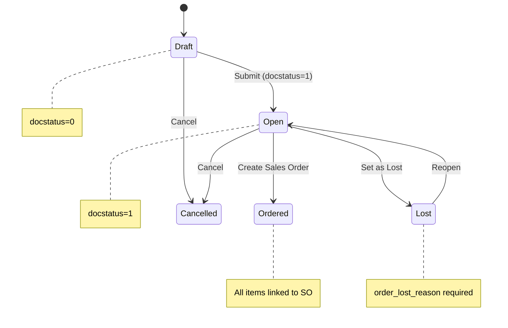
```mermaid
stateDiagram-v2
    [*] --> Draft

    Draft --> Open : Submit (docstatus=1)
    Open --> Ordered : Create Sales Order

    Open --> Lost : Set as Lost
    Lost --> Open : Reopen

    Draft --> Cancelled : Cancel
    Open --> Cancelled : Cancel

    note right of Draft : docstatus=0
    note right of Open : docstatus=1
    note right of Ordered : All items linked to SO
    note right of Lost : order_lost_reason required
```

### 2.2 Sales Order ⭐ (Chi tiết nhất)

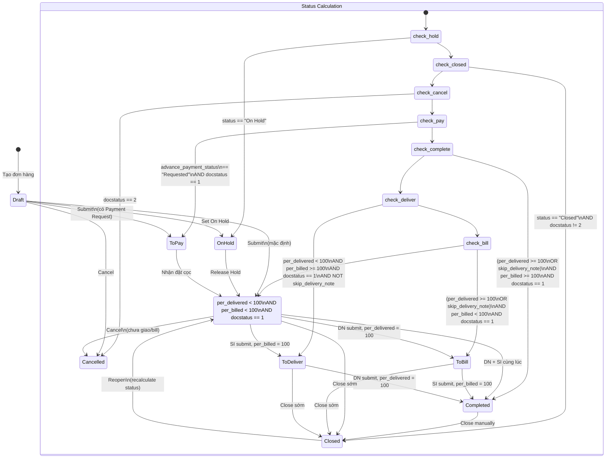
```mermaid
stateDiagram-v2
    [*] --> Draft : Tạo đơn hàng

    state "Status Calculation" as calc {
        [*] --> check_hold
        check_hold --> OnHold : status == "On Hold"
        check_hold --> check_closed
        check_closed --> Closed : status == "Closed"\nAND docstatus != 2
        check_closed --> check_cancel
        check_cancel --> Cancelled : docstatus == 2
        check_cancel --> check_pay
        check_pay --> ToPay : advance_payment_status\n== "Requested"\nAND docstatus == 1
        check_pay --> check_complete
        check_complete --> Completed : (per_delivered >= 100\nOR skip_delivery_note)\nAND per_billed >= 100\nAND docstatus == 1
        check_complete --> check_deliver
        check_deliver --> ToDeliver : per_delivered < 100\nAND per_billed >= 100\nAND docstatus == 1\nAND NOT skip_delivery_note
        check_deliver --> check_bill
        check_bill --> ToBill : (per_delivered >= 100\nOR skip_delivery_note)\nAND per_billed < 100\nAND docstatus == 1
        check_bill --> ToDeliverAndBill
        ToDeliverAndBill : per_delivered < 100\nAND per_billed < 100\nAND docstatus == 1
    }

    Draft --> ToDeliverAndBill : Submit\n(mặc định)
    Draft --> ToPay : Submit\n(có Payment Request)
    Draft --> OnHold : Set On Hold

    OnHold --> ToDeliverAndBill : Release Hold

    ToPay --> ToDeliverAndBill : Nhận đặt cọc

    ToDeliverAndBill --> ToBill : DN submit, per_delivered = 100
    ToDeliverAndBill --> ToDeliver : SI submit, per_billed = 100
    ToDeliverAndBill --> Completed : DN + SI cùng lúc

    ToBill --> Completed : SI submit, per_billed = 100
    ToDeliver --> Completed : DN submit, per_delivered = 100

    Completed --> Closed : Close manually
    ToDeliverAndBill --> Closed : Close sớm
    ToBill --> Closed : Close sớm
    ToDeliver --> Closed : Close sớm

    Closed --> ToDeliverAndBill : Reopen\n(recalculate status)

    Draft --> Cancelled : Cancel
    ToDeliverAndBill --> Cancelled : Cancel\n(chưa giao/bill)
```

### 2.3 Sales Order — Fields & Conditions (Exact)

```
┌─────────────────────────────────────────────────────────────────────┐
│                        SALES ORDER                                  │
├────────────────────┬────────────────────────────────────────────────┤
│ per_delivered      │ 0..100 (← Delivery Note status_updater)       │
│ per_billed         │ 0..100 (← Sales Invoice status_updater)       │
│ delivery_status    │ Not Delivered │ Partly │ Fully │ Closed │ N/A │
│ billing_status     │ Not Billed │ Partly Billed │ Fully Billed     │
│ advance_payment_   │ Not Requested │ Requested │ Partially Paid │  │
│   status           │ Fully Paid                                     │
│ skip_delivery_note │ 0/1 (bỏ qua giao hàng, chỉ xuất HĐ)         │
├────────────────────┴────────────────────────────────────────────────┤
│ STATUS MAP (ưu tiên từ CAO → THẤP — evaluated REVERSE):            │
│                                                                      │
│  🔴 On Hold         ← status == "On Hold"               [cao nhất] │
│  🔴 Closed          ← status == "Closed" AND ds != 2               │
│  ⚫ Cancelled       ← docstatus == 2                               │
│  🟡 To Pay          ← advance_payment == "Requested" AND ds == 1   │
│  🟢 Completed       ← (per_del ≥ 100 OR skip) AND per_bill ≥ 100  │
│  🔵 To Deliver      ← per_del < 100 AND per_bill ≥ 100 AND !skip  │
│  🔵 To Bill         ← (per_del ≥ 100 OR skip) AND per_bill < 100  │
│  🔵 To Deliver+Bill ← per_del < 100 AND per_bill < 100   [default]│
│  ⚪ Draft           ← fallback                          [thấp nhất]│
└──────────────────────────────────────────────────────────────────────┘
```

### 2.4 Sales Order — Partial Delivery / Billing Timeline

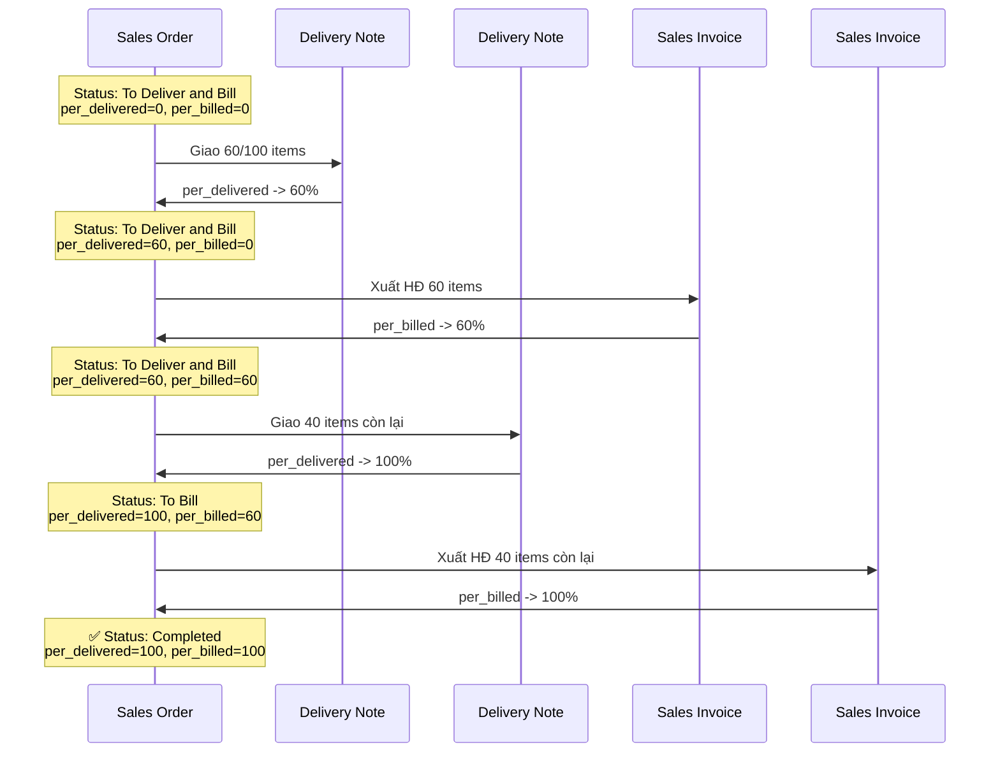
```mermaid
sequenceDiagram
    participant SO as Sales Order
    participant DN1 as Delivery Note #1
    participant DN2 as Delivery Note #2
    participant SI1 as Sales Invoice #1
    participant SI2 as Sales Invoice #2

    Note over SO: Status: To Deliver and Bill<br/>per_delivered=0, per_billed=0

    SO->>DN1: Giao 60/100 items
    DN1->>SO: per_delivered -> 60%
    Note over SO: Status: To Deliver and Bill<br/>per_delivered=60, per_billed=0

    SO->>SI1: Xuất HĐ 60 items
    SI1->>SO: per_billed -> 60%
    Note over SO: Status: To Deliver and Bill<br/>per_delivered=60, per_billed=60

    SO->>DN2: Giao 40 items còn lại
    DN2->>SO: per_delivered -> 100%
    Note over SO: Status: To Bill<br/>per_delivered=100, per_billed=60

    SO->>SI2: Xuất HĐ 40 items còn lại
    SI2->>SO: per_billed -> 100%
    Note over SO: ✅ Status: Completed<br/>per_delivered=100, per_billed=100
```

---

## 3. STOCK — Delivery Note & Purchase Receipt

### 3.1 Delivery Note (Phiếu xuất kho)

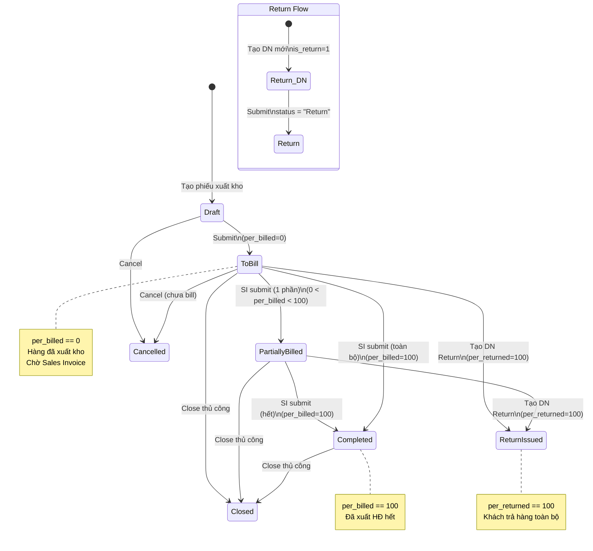
```mermaid
stateDiagram-v2
    [*] --> Draft : Tạo phiếu xuất kho

    Draft --> ToBill : Submit\n(per_billed=0)

    ToBill --> PartiallyBilled : SI submit (1 phần)\n(0 < per_billed < 100)
    PartiallyBilled --> Completed : SI submit (hết)\n(per_billed=100)
    ToBill --> Completed : SI submit (toàn bộ)\n(per_billed=100)

    ToBill --> ReturnIssued : Tạo DN Return\n(per_returned=100)
    PartiallyBilled --> ReturnIssued : Tạo DN Return\n(per_returned=100)

    Draft --> Cancelled : Cancel
    ToBill --> Cancelled : Cancel (chưa bill)

    ToBill --> Closed : Close thủ công
    PartiallyBilled --> Closed : Close thủ công
    Completed --> Closed : Close thủ công

    state "Return Flow" as return_flow {
        [*] --> Return_DN : Tạo DN mới\nis_return=1
        Return_DN --> Return : Submit\nstatus = "Return"
    }

    note right of ToBill
        per_billed == 0
        Hàng đã xuất kho
        Chờ Sales Invoice
    end note

    note right of Completed
        per_billed == 100
        Đã xuất HĐ hết
    end note

    note right of ReturnIssued
        per_returned == 100
        Khách trả hàng toàn bộ
    end note
```

**Delivery Note → cập nhật Sales Order:**

```
┌──────────────────────────────────────────────────────────────┐
│ DN submit → status_updater:                                   │
│                                                                │
│   DN Item.qty                                                  │
│     → SO Item.delivered_qty += DN Item.qty                     │
│     → SO.per_delivered = Σ min(delivered, ordered) / Σ ordered │
│     → SO.delivery_status = "Not" / "Partly" / "Fully"         │
│     → SO.status recalculated                                   │
│                                                                │
│ DN submit → Stock Ledger Entry:                                │
│     → actual_qty -= item.qty (source warehouse)                │
│     → Bin.actual_qty updated                                   │
│     → GL Entry: Nợ 632 (Giá vốn), Có 156 (Hàng hóa)         │
│       (nếu perpetual inventory + update_stock trên SI)         │
└──────────────────────────────────────────────────────────────┘
```

### 3.2 Purchase Receipt (Phiếu nhập kho)

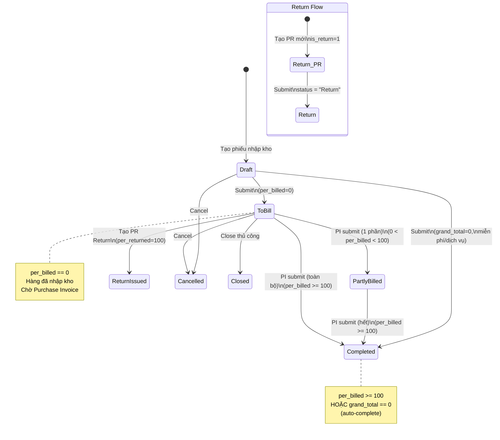
```mermaid
stateDiagram-v2
    [*] --> Draft : Tạo phiếu nhập kho

    Draft --> ToBill : Submit\n(per_billed=0)
    Draft --> Completed : Submit\n(grand_total=0,\nmiễn phí/dịch vụ)

    ToBill --> PartlyBilled : PI submit (1 phần)\n(0 < per_billed < 100)
    PartlyBilled --> Completed : PI submit (hết)\n(per_billed >= 100)
    ToBill --> Completed : PI submit (toàn bộ)\n(per_billed >= 100)

    ToBill --> ReturnIssued : Tạo PR Return\n(per_returned=100)

    Draft --> Cancelled : Cancel
    ToBill --> Cancelled : Cancel

    ToBill --> Closed : Close thủ công

    state "Return Flow" as return_pr {
        [*] --> Return_PR : Tạo PR mới\nis_return=1
        Return_PR --> Return : Submit\nstatus = "Return"
    }

    note right of ToBill
        per_billed == 0
        Hàng đã nhập kho
        Chờ Purchase Invoice
    end note

    note right of Completed
        per_billed >= 100
        HOẶC grand_total == 0
        (auto-complete)
    end note
```

**Purchase Receipt → cập nhật Purchase Order:**

```
┌──────────────────────────────────────────────────────────────┐
│ PR submit → status_updater:                                   │
│                                                                │
│   PR Item.received_qty                                         │
│     → PO Item.received_qty += PR Item.received_qty             │
│     → PO.per_received = Σ min(received, ordered) / Σ ordered   │
│     → PO.status recalculated                                   │
│                                                                │
│ PR submit → Stock Ledger Entry:                                │
│     → actual_qty += item.qty (target warehouse)                │
│     → Bin.actual_qty updated                                   │
│     → GL Entry: Nợ 156 (Hàng hóa), Có 3231 (Nhận hàng chờ HĐ)│
│       (nếu perpetual inventory)                                │
└──────────────────────────────────────────────────────────────┘
```

### 3.3 Stock Entry (7 loại chính)

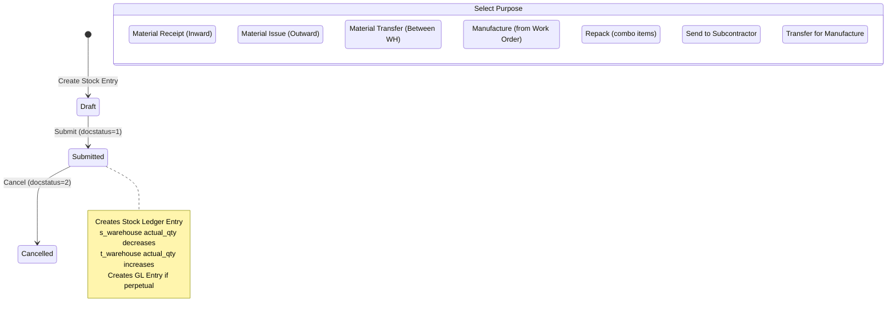
```mermaid
stateDiagram-v2
    [*] --> Draft : Create Stock Entry

    state "Select Purpose" as purpose_select {
        MaterialReceipt : Material Receipt (Inward)
        MaterialIssue : Material Issue (Outward)
        MaterialTransfer : Material Transfer (Between WH)
        Manufacture : Manufacture (from Work Order)
        Repack : Repack (combo items)
        SendToSubcontractor : Send to Subcontractor
        MaterialTransferMfg : Transfer for Manufacture
    }

    Draft --> Submitted : Submit (docstatus=1)
    Submitted --> Cancelled : Cancel (docstatus=2)

    note right of Submitted
        Creates Stock Ledger Entry
        s_warehouse actual_qty decreases
        t_warehouse actual_qty increases
        Creates GL Entry if perpetual
    end note
```

**Stock Entry — Warehouse Impact:**

```
┌─────────────────────────────────────────────────────────────────┐
│  Purpose              │ s_warehouse  │ t_warehouse  │ Impact    │
│───────────────────────│──────────────│──────────────│───────────│
│  Material Receipt     │ —            │ ✅ Required  │ +qty      │
│  Material Issue       │ ✅ Required  │ —            │ -qty      │
│  Material Transfer    │ ✅ Required  │ ✅ Required  │ -s / +t   │
│  Manufacture          │ ✅ NVL wh    │ ✅ FG wh     │ -NVL +FG  │
│  Repack               │ ✅ Required  │ ✅ Required  │ -old +new │
│  Send to Subcontract  │ ✅ Required  │ ✅ Supplier  │ -s / +t   │
│  Transfer for Mfg     │ ✅ Stores    │ ✅ WIP wh    │ -s / +t   │
└─────────────────────────────────────────────────────────────────┘
```

---

## 4. BUYING — Purchase Order State Machine

### 4.1 Material Request

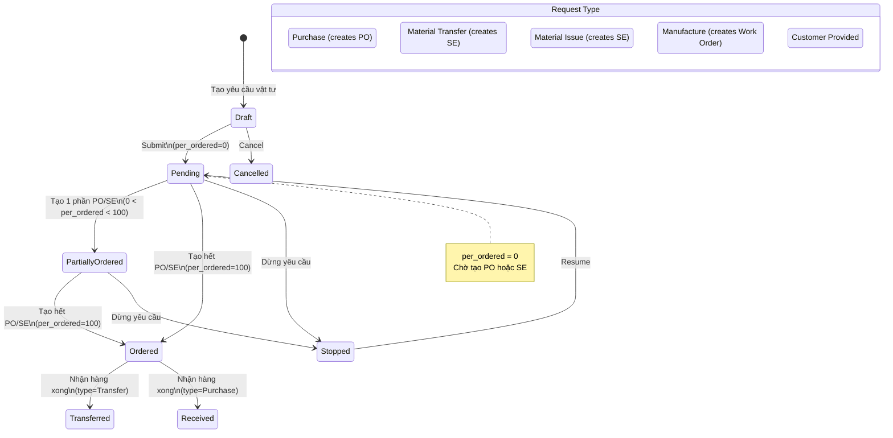
```mermaid
stateDiagram-v2
    [*] --> Draft : Tạo yêu cầu vật tư

    state "Request Type" as mr_type {
        Purchase : Purchase (creates PO)
        Transfer : Material Transfer (creates SE)
        Issue : Material Issue (creates SE)
        Mfg : Manufacture (creates Work Order)
        CustProvided : Customer Provided
    }

    Draft --> Pending : Submit\n(per_ordered=0)

    Pending --> PartiallyOrdered : Tạo 1 phần PO/SE\n(0 < per_ordered < 100)
    PartiallyOrdered --> Ordered : Tạo hết PO/SE\n(per_ordered=100)
    Pending --> Ordered : Tạo hết PO/SE\n(per_ordered=100)

    Ordered --> Transferred : Nhận hàng xong\n(type=Transfer)
    Ordered --> Received : Nhận hàng xong\n(type=Purchase)

    Pending --> Stopped : Dừng yêu cầu
    PartiallyOrdered --> Stopped : Dừng yêu cầu
    Stopped --> Pending : Resume

    Draft --> Cancelled : Cancel

    note right of Pending
        per_ordered = 0
        Chờ tạo PO hoặc SE
    end note
```

### 4.2 Purchase Order ⭐

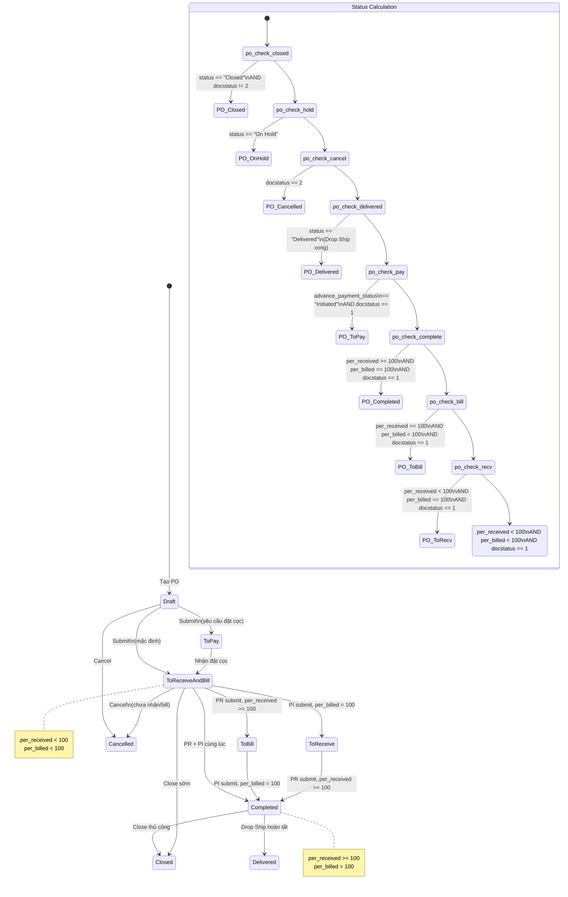
```mermaid
stateDiagram-v2
    [*] --> Draft : Tạo PO

    state "Status Calculation" as po_calc {
        [*] --> po_check_closed
        po_check_closed --> PO_Closed : status == "Closed"\nAND docstatus != 2
        po_check_closed --> po_check_hold
        po_check_hold --> PO_OnHold : status == "On Hold"
        po_check_hold --> po_check_cancel
        po_check_cancel --> PO_Cancelled : docstatus == 2
        po_check_cancel --> po_check_delivered
        po_check_delivered --> PO_Delivered : status == "Delivered"\n(Drop Ship xong)
        po_check_delivered --> po_check_pay
        po_check_pay --> PO_ToPay : advance_payment_status\n== "Initiated"\nAND docstatus == 1
        po_check_pay --> po_check_complete
        po_check_complete --> PO_Completed : per_received >= 100\nAND per_billed == 100\nAND docstatus == 1
        po_check_complete --> po_check_bill
        po_check_bill --> PO_ToBill : per_received >= 100\nAND per_billed < 100\nAND docstatus == 1
        po_check_bill --> po_check_recv
        po_check_recv --> PO_ToRecv : per_received < 100\nAND per_billed == 100\nAND docstatus == 1
        po_check_recv --> PO_ToRecvBill
        PO_ToRecvBill : per_received < 100\nAND per_billed < 100\nAND docstatus == 1
    }

    Draft --> ToReceiveAndBill : Submit\n(mặc định)
    Draft --> ToPay : Submit\n(yêu cầu đặt cọc)

    ToPay --> ToReceiveAndBill : Nhận đặt cọc

    ToReceiveAndBill --> ToBill : PR submit, per_received >= 100
    ToReceiveAndBill --> ToReceive : PI submit, per_billed = 100
    ToReceiveAndBill --> Completed : PR + PI cùng lúc

    ToBill --> Completed : PI submit, per_billed = 100
    ToReceive --> Completed : PR submit, per_received >= 100

    Completed --> Closed : Close thủ công
    ToReceiveAndBill --> Closed : Close sớm
    Completed --> Delivered : Drop Ship hoàn tất

    Draft --> Cancelled : Cancel
    ToReceiveAndBill --> Cancelled : Cancel\n(chưa nhận/bill)

    note right of ToReceiveAndBill
        per_received < 100
        per_billed < 100
    end note

    note right of Completed
        per_received >= 100
        per_billed = 100
    end note
```

### 4.3 Purchase Order — Fields & Conditions (Exact)

```
┌─────────────────────────────────────────────────────────────────────┐
│                       PURCHASE ORDER                                 │
├────────────────────┬────────────────────────────────────────────────┤
│ per_received       │ 0..100 (← Purchase Receipt status_updater)    │
│ per_billed         │ 0..100 (← Purchase Invoice status_updater)    │
│ advance_payment_   │ Not Initiated │ Initiated │ Partially Paid │  │
│   status           │ Fully Paid                                     │
├────────────────────┴────────────────────────────────────────────────┤
│ STATUS MAP (ưu tiên từ CAO → THẤP):                                │
│                                                                      │
│  🔴 Closed          ← status == "Closed" AND ds != 2    [cao nhất] │
│  🔴 On Hold         ← status == "On Hold"                          │
│  ⚫ Cancelled       ← docstatus == 2                               │
│  🟣 Delivered       ← status == "Delivered" (drop ship)            │
│  🟡 To Pay          ← advance_payment == "Initiated" AND ds == 1   │
│  🟢 Completed       ← per_received ≥ 100 AND per_billed == 100     │
│  🔵 To Bill         ← per_received ≥ 100 AND per_billed < 100      │
│  🔵 To Receive      ← per_received < 100 AND per_billed == 100     │
│  🔵 To Receive+Bill ← per_received < 100 AND per_billed < 100      │
│  ⚪ Draft           ← fallback                          [thấp nhất]│
└──────────────────────────────────────────────────────────────────────┘
```

### 4.4 SO vs PO — So sánh song song

```
┌──────────────────────┬──────────────────────┐
│     SALES ORDER      │    PURCHASE ORDER     │
├──────────────────────┼──────────────────────┤
│ per_delivered        │ per_received          │
│ (← Delivery Note)   │ (← Purchase Receipt)  │
├──────────────────────┼──────────────────────┤
│ per_billed           │ per_billed            │
│ (← Sales Invoice)   │ (← Purchase Invoice)  │
├──────────────────────┼──────────────────────┤
│ "Requested"          │ "Initiated"           │
│ (advance_payment)    │ (advance_payment)     │
├──────────────────────┼──────────────────────┤
│ skip_delivery_note   │ — (không có)          │
├──────────────────────┼──────────────────────┤
│ To Deliver and Bill  │ To Receive and Bill   │
│ To Deliver           │ To Receive            │
│ To Bill              │ To Bill               │
│ Completed            │ Completed             │
│ On Hold              │ On Hold               │
│ Closed               │ Closed                │
│ To Pay               │ To Pay                │
│ Cancelled            │ Cancelled             │
│ —                    │ Delivered (drop ship)  │
└──────────────────────┴──────────────────────┘
```

---

## 5. ACCOUNTING — Invoice & Payment State Machine

### 5.1 Sales Invoice ⭐ (Custom set_status, phức tạp nhất)

> **Lưu ý:** Sales Invoice KHÔNG dùng `status_map` — nó override `set_status()` hoàn toàn.

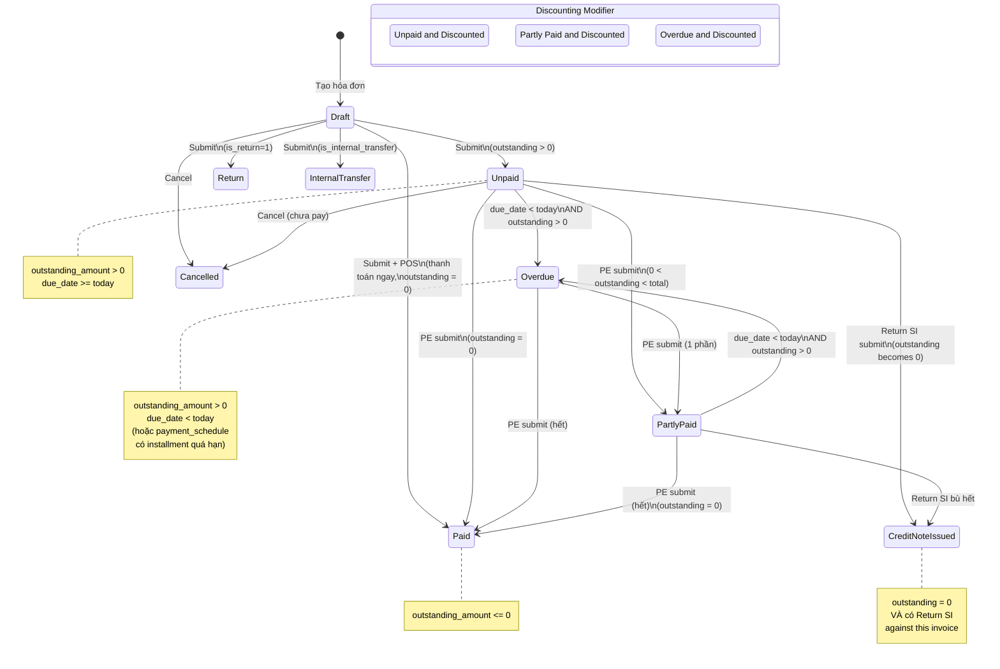
```mermaid
stateDiagram-v2
    [*] --> Draft : Tạo hóa đơn

    Draft --> Unpaid : Submit\n(outstanding > 0)
    Draft --> Paid : Submit + POS\n(thanh toán ngay,\noutstanding = 0)
    Draft --> Return : Submit\n(is_return=1)
    Draft --> InternalTransfer : Submit\n(is_internal_transfer)

    Unpaid --> Overdue : due_date < today\nAND outstanding > 0
    Unpaid --> PartlyPaid : PE submit\n(0 < outstanding < total)
    Unpaid --> Paid : PE submit\n(outstanding = 0)
    Unpaid --> CreditNoteIssued : Return SI submit\n(outstanding becomes 0)

    Overdue --> PartlyPaid : PE submit (1 phần)
    Overdue --> Paid : PE submit (hết)

    PartlyPaid --> Paid : PE submit (hết)\n(outstanding = 0)
    PartlyPaid --> Overdue : due_date < today\nAND outstanding > 0
    PartlyPaid --> CreditNoteIssued : Return SI bù hết

    Draft --> Cancelled : Cancel
    Unpaid --> Cancelled : Cancel (chưa pay)

    state "Discounting Modifier" as discount {
        UnpaidDisc : Unpaid and Discounted
        PartlyPaidDisc : Partly Paid and Discounted
        OverdueDisc : Overdue and Discounted
    }

    note right of Unpaid
        outstanding_amount > 0
        due_date >= today
    end note

    note right of Overdue
        outstanding_amount > 0
        due_date < today
        (hoặc payment_schedule
        có installment quá hạn)
    end note

    note right of Paid
        outstanding_amount <= 0
    end note

    note right of CreditNoteIssued
        outstanding = 0
        VÀ có Return SI
        against this invoice
    end note
```

### 5.2 Sales Invoice — Status Decision Tree (Exact from Source Code)

```
┌─────────────────────────────────────────────────────────────────────┐
│              SALES INVOICE set_status() — Decision Tree              │
├──────────────────────────────────────────────────────────────────────┤
│                                                                      │
│  if docstatus == 2:                                                  │
│    → "Cancelled"                                                     │
│                                                                      │
│  elif docstatus == 1:                                                │
│    │                                                                 │
│    ├─ is_internal_transfer()?                                        │
│    │  → "Internal Transfer"                                          │
│    │                                                                 │
│    ├─ is_overdue()?                                                  │
│    │  │  (due_date < today AND outstanding > 0)                      │
│    │  │  (OR any payment_schedule row past due)                      │
│    │  → "Overdue"                                                    │
│    │                                                                 │
│    ├─ 0 < outstanding < total?                                       │
│    │  → "Partly Paid"                                                │
│    │                                                                 │
│    ├─ outstanding > 0 AND due_date ≥ today?                          │
│    │  → "Unpaid"                                                     │
│    │                                                                 │
│    ├─ is_return == 0 AND has Return SI against this?                 │
│    │  → "Credit Note Issued"                                         │
│    │                                                                 │
│    ├─ is_return == 1?                                                │
│    │  → "Return"                                                     │
│    │                                                                 │
│    ├─ outstanding ≤ 0?                                               │
│    │  → "Paid"                                                       │
│    │                                                                 │
│    └─ else                                                           │
│       → "Submitted"                                                  │
│                                                                      │
│  THEN if status ∈ {Unpaid, Partly Paid, Overdue}                     │
│    AND is_discounted AND discounting_status == "Disbursed":          │
│    → status += " and Discounted"                                     │
│                                                                      │
│  else: → "Draft"                                                     │
└──────────────────────────────────────────────────────────────────────┘
```

### 5.3 Sales Invoice — GL Entry Impact

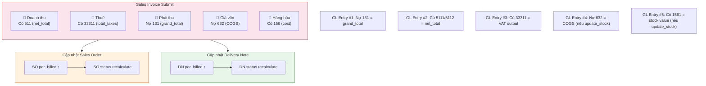
```mermaid
flowchart TB
    subgraph SI_Submit["Sales Invoice Submit"]
        direction TB
        SI_income["📗 Doanh thu\nCó 511 (net_total)"]
        SI_tax["📗 Thuế\nCó 33311 (total_taxes)"]
        SI_recv["📕 Phải thu\nNợ 131 (grand_total)"]
        SI_cogs["📕 Giá vốn\nNợ 632 (COGS)"]
        SI_stock["📗 Hàng hóa\nCó 156 (cost)"]
    end

    subgraph SI_UpdateSO["Cập nhật Sales Order"]
        SO_bill["SO.per_billed ↑"]
        SO_status_calc["SO.status recalculate"]
    end

    subgraph SI_UpdateDN["Cập nhật Delivery Note"]
        DN_bill["DN.per_billed ↑"]
        DN_status_calc["DN.status recalculate"]
    end

    SI_Submit --> SI_UpdateSO
    SI_Submit --> SI_UpdateDN
    SO_bill --> SO_status_calc
    DN_bill --> DN_status_calc

    note1["GL Entry #1: Nợ 131 = grand_total"]
    note2["GL Entry #2: Có 5111/5112 = net_total"]
    note3["GL Entry #3: Có 33311 = VAT output"]
    note4["GL Entry #4: Nợ 632 = COGS (nếu update_stock)"]
    note5["GL Entry #5: Có 1561 = stock value (nếu update_stock)"]

    style SI_Submit fill:#fce4ec,stroke:#c62828
    style SI_UpdateSO fill:#fff3e0,stroke:#e65100
    style SI_UpdateDN fill:#e8f5e9,stroke:#2e7d32
```

### 5.4 Purchase Invoice

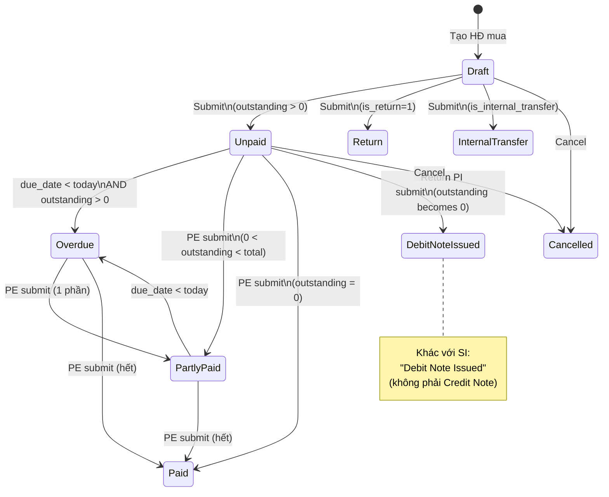
```mermaid
stateDiagram-v2
    [*] --> Draft : Tạo HĐ mua

    Draft --> Unpaid : Submit\n(outstanding > 0)
    Draft --> Return : Submit\n(is_return=1)
    Draft --> InternalTransfer : Submit\n(is_internal_transfer)

    Unpaid --> Overdue : due_date < today\nAND outstanding > 0
    Unpaid --> PartlyPaid : PE submit\n(0 < outstanding < total)
    Unpaid --> Paid : PE submit\n(outstanding = 0)
    Unpaid --> DebitNoteIssued : Return PI submit\n(outstanding becomes 0)

    Overdue --> PartlyPaid : PE submit (1 phần)
    Overdue --> Paid : PE submit (hết)

    PartlyPaid --> Paid : PE submit (hết)
    PartlyPaid --> Overdue : due_date < today

    Draft --> Cancelled : Cancel
    Unpaid --> Cancelled : Cancel

    note right of DebitNoteIssued
        Khác với SI:
        "Debit Note Issued"
        (không phải Credit Note)
    end note
```

**Purchase Invoice — GL Entry:**

```
┌────────────────────────────────────────────┐
│  PI Submit → GL Entry:                      │
│                                              │
│  Nợ 156  (Hàng hóa)      = net_total       │
│  Nợ 1331 (VAT đầu vào)   = total_taxes     │
│  Có 331  (Phải trả NCC)  = grand_total     │
│                                              │
│  → Cập nhật PO.per_billed                   │
│  → Cập nhật PR.per_billed                   │
│  → PO.status recalculate                    │
│  → PR.status recalculate                    │
└────────────────────────────────────────────┘
```

### 5.5 SI vs PI — So sánh song song

```
┌──────────────────────────┬──────────────────────────┐
│     SALES INVOICE        │   PURCHASE INVOICE        │
├──────────────────────────┼──────────────────────────┤
│ debit_to = 131           │ credit_to = 331           │
│ (Phải thu khách hàng)    │ (Phải trả nhà cung cấp)  │
├──────────────────────────┼──────────────────────────┤
│ Nợ 131, Có 511, Có 33311│ Nợ 156, Nợ 1331, Có 331  │
├──────────────────────────┼──────────────────────────┤
│ Credit Note Issued       │ Debit Note Issued         │
├──────────────────────────┼──────────────────────────┤
│ 9 status values          │ 7 status values           │
│ (+ 3 Discounted variant) │ (không có Discounted)     │
├──────────────────────────┼──────────────────────────┤
│ → cập nhật SO.per_billed │ → cập nhật PO.per_billed  │
│ → cập nhật DN.per_billed │ → cập nhật PR.per_billed  │
├──────────────────────────┼──────────────────────────┤
│ PE type = "Receive"      │ PE type = "Pay"           │
└──────────────────────────┴──────────────────────────┘
```

### 5.6 Payment Entry — Luồng Xử Lý Chi Tiết

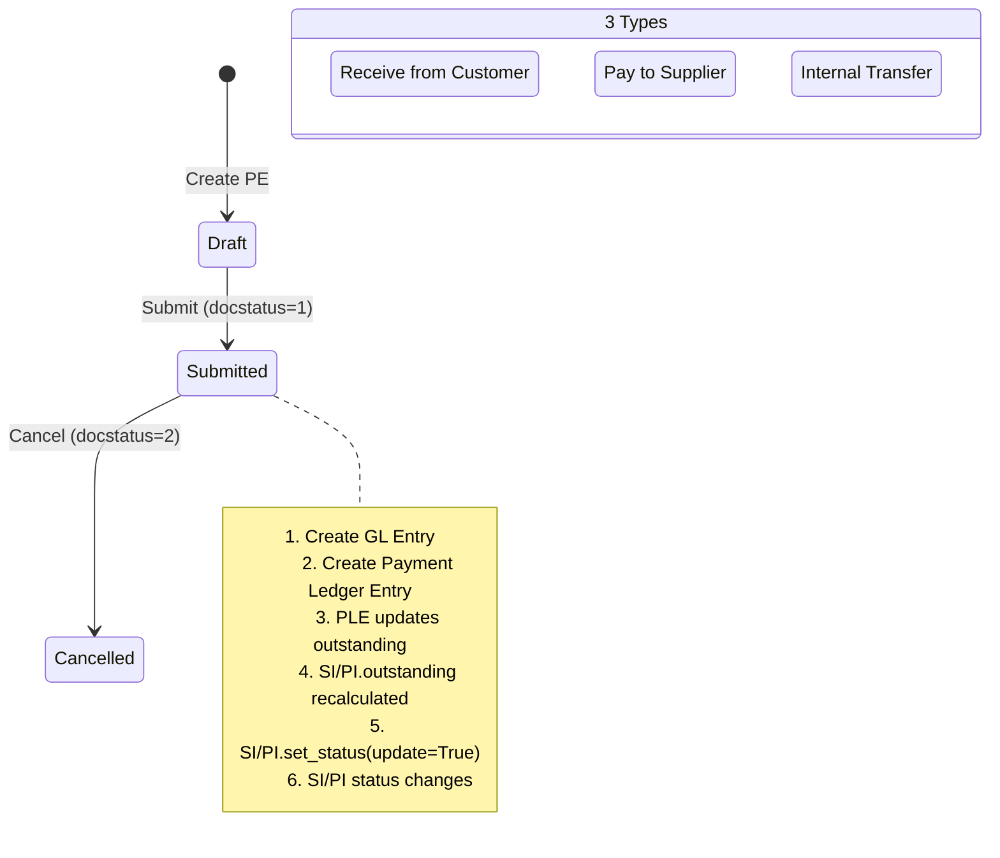
```mermaid
stateDiagram-v2
    [*] --> Draft : Create PE

    state "3 Types" as pe_types {
        Receive : Receive from Customer
        Pay : Pay to Supplier
        Internal : Internal Transfer
    }

    Draft --> Submitted : Submit (docstatus=1)
    Submitted --> Cancelled : Cancel (docstatus=2)

    note right of Submitted
        1. Create GL Entry
        2. Create Payment Ledger Entry
        3. PLE updates outstanding
        4. SI/PI.outstanding recalculated
        5. SI/PI.set_status(update=True)
        6. SI/PI status changes
    end note
```

### 5.7 Payment Entry — Chain cập nhật Invoice (Exact)

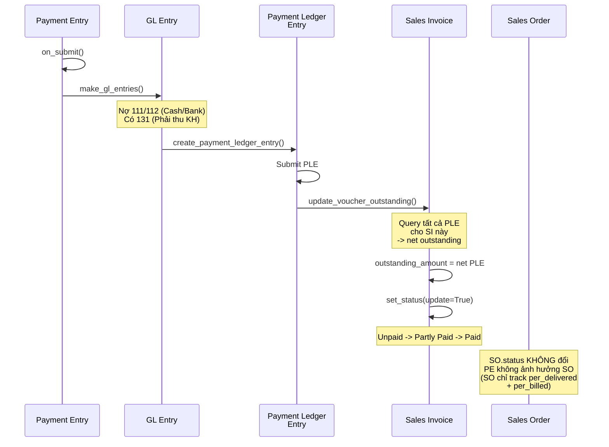
```mermaid
sequenceDiagram
    participant PE as Payment Entry
    participant GL as GL Entry
    participant PLE as Payment Ledger<br/>Entry
    participant SI as Sales Invoice
    participant SO as Sales Order

    PE->>PE: on_submit()
    PE->>GL: make_gl_entries()
    Note over GL: Nợ 111/112 (Cash/Bank)<br/>Có 131 (Phải thu KH)

    GL->>PLE: create_payment_ledger_entry()
    PLE->>PLE: Submit PLE

    PLE->>SI: update_voucher_outstanding()
    Note over SI: Query tất cả PLE<br/>cho SI này<br/>-> net outstanding

    SI->>SI: outstanding_amount = net PLE
    SI->>SI: set_status(update=True)
    Note over SI: Unpaid -> Partly Paid -> Paid

    Note over SO: SO.status KHÔNG đổi<br/>PE không ảnh hưởng SO<br/>(SO chỉ track per_delivered<br/>+ per_billed)
```

**Payment Entry — GL Entry theo loại:**

```
┌────────────────────────────────────────────────────────┐
│  RECEIVE (Thu tiền từ KH):                              │
│    Nợ 1111 (Tiền mặt)     hoặc 1121 (Ngân hàng)       │
│    Có 131  (Phải thu KH)                                │
│    → SI.outstanding ↓                                   │
│                                                          │
│  PAY (Chi tiền cho NCC):                                 │
│    Nợ 331  (Phải trả NCC)                               │
│    Có 1111 (Tiền mặt)     hoặc 1121 (Ngân hàng)        │
│    → PI.outstanding ↓                                   │
│                                                          │
│  INTERNAL TRANSFER (Chuyển nội bộ):                      │
│    Nợ 1121 (Ngân hàng)    ← TK đích                     │
│    Có 1111 (Tiền mặt)     ← TK nguồn                    │
│    → Không ảnh hưởng SI/PI                               │
│                                                          │
│  CHÊNH LỆCH TỶ GIÁ (nếu multi-currency):               │
│    Nợ/Có 515 (Doanh thu tài chính)                      │
│    hoặc Nợ/Có 635 (Chi phí tài chính)                   │
└────────────────────────────────────────────────────────┘
```

---

## 6. End-to-End: Bán Hàng — Toàn Bộ Status Transition

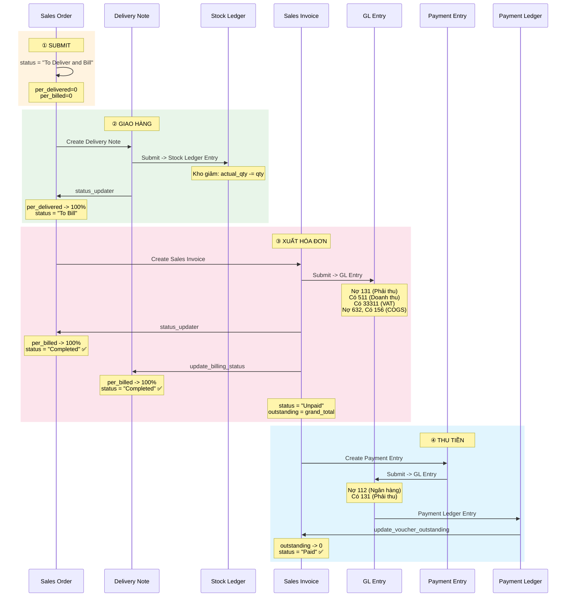
```mermaid
sequenceDiagram
    participant SO as Sales Order
    participant DN as Delivery Note
    participant SLE as Stock Ledger
    participant SI as Sales Invoice
    participant GL as GL Entry
    participant PE as Payment Entry
    participant PLE as Payment Ledger

    rect rgb(255, 243, 224)
        Note over SO: ① SUBMIT
        SO->>SO: status = "To Deliver and Bill"
        Note over SO: per_delivered=0<br/>per_billed=0
    end

    rect rgb(232, 245, 233)
        Note over DN: ② GIAO HÀNG
        SO->>DN: Create Delivery Note
        DN->>SLE: Submit -> Stock Ledger Entry
        Note over SLE: Kho giảm: actual_qty -= qty
        DN->>SO: status_updater
        Note over SO: per_delivered -> 100%<br/>status = "To Bill"
    end

    rect rgb(252, 228, 236)
        Note over SI: ③ XUẤT HÓA ĐƠN
        SO->>SI: Create Sales Invoice
        SI->>GL: Submit -> GL Entry
        Note over GL: Nợ 131 (Phải thu)<br/>Có 511 (Doanh thu)<br/>Có 33311 (VAT)<br/>Nợ 632, Có 156 (COGS)
        SI->>SO: status_updater
        Note over SO: per_billed -> 100%<br/>status = "Completed" ✅
        SI->>DN: update_billing_status
        Note over DN: per_billed -> 100%<br/>status = "Completed" ✅
        Note over SI: status = "Unpaid"<br/>outstanding = grand_total
    end

    rect rgb(225, 245, 254)
        Note over PE: ④ THU TIỀN
        SI->>PE: Create Payment Entry
        PE->>GL: Submit -> GL Entry
        Note over GL: Nợ 112 (Ngân hàng)<br/>Có 131 (Phải thu)
        GL->>PLE: Payment Ledger Entry
        PLE->>SI: update_voucher_outstanding
        Note over SI: outstanding -> 0<br/>status = "Paid" ✅
    end
```

---

## 7. End-to-End: Mua Hàng — Toàn Bộ Status Transition

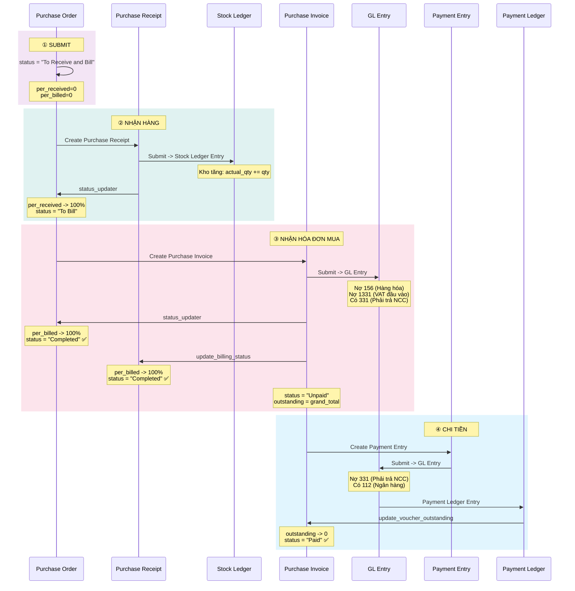
```mermaid
sequenceDiagram
    participant PO as Purchase Order
    participant PR as Purchase Receipt
    participant SLE as Stock Ledger
    participant PI as Purchase Invoice
    participant GL as GL Entry
    participant PE as Payment Entry
    participant PLE as Payment Ledger

    rect rgb(243, 229, 245)
        Note over PO: ① SUBMIT
        PO->>PO: status = "To Receive and Bill"
        Note over PO: per_received=0<br/>per_billed=0
    end

    rect rgb(224, 242, 241)
        Note over PR: ② NHẬN HÀNG
        PO->>PR: Create Purchase Receipt
        PR->>SLE: Submit -> Stock Ledger Entry
        Note over SLE: Kho tăng: actual_qty += qty
        PR->>PO: status_updater
        Note over PO: per_received -> 100%<br/>status = "To Bill"
    end

    rect rgb(252, 228, 236)
        Note over PI: ③ NHẬN HÓA ĐƠN MUA
        PO->>PI: Create Purchase Invoice
        PI->>GL: Submit -> GL Entry
        Note over GL: Nợ 156 (Hàng hóa)<br/>Nợ 1331 (VAT đầu vào)<br/>Có 331 (Phải trả NCC)
        PI->>PO: status_updater
        Note over PO: per_billed -> 100%<br/>status = "Completed" ✅
        PI->>PR: update_billing_status
        Note over PR: per_billed -> 100%<br/>status = "Completed" ✅
        Note over PI: status = "Unpaid"<br/>outstanding = grand_total
    end

    rect rgb(225, 245, 254)
        Note over PE: ④ CHI TIỀN
        PI->>PE: Create Payment Entry
        PE->>GL: Submit -> GL Entry
        Note over GL: Nợ 331 (Phải trả NCC)<br/>Có 112 (Ngân hàng)
        GL->>PLE: Payment Ledger Entry
        PLE->>PI: update_voucher_outstanding
        Note over PI: outstanding -> 0<br/>status = "Paid" ✅
    end
```

---

## 8. Return & Credit/Debit Note Flow

### 8.1 Sales Return (Trả hàng bán)

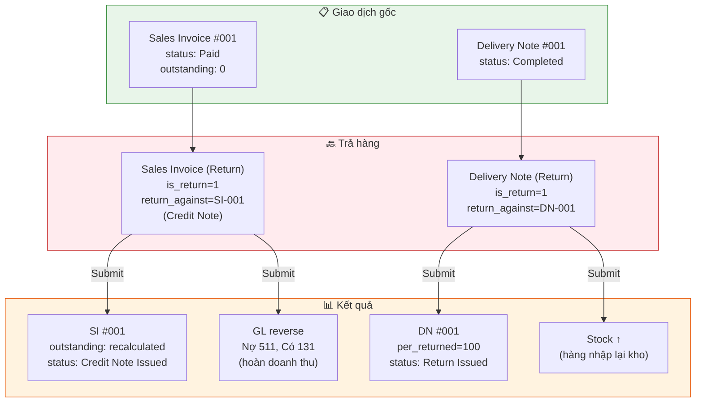
```mermaid
flowchart TB
    subgraph Original["📋 Giao dịch gốc"]
        SI_orig["Sales Invoice #001\nstatus: Paid\noutstanding: 0"]
        DN_orig["Delivery Note #001\nstatus: Completed"]
    end

    subgraph Return["🔙 Trả hàng"]
        DN_return["Delivery Note (Return)\nis_return=1\nreturn_against=DN-001"]
        SI_return["Sales Invoice (Return)\nis_return=1\nreturn_against=SI-001\n(Credit Note)"]
    end

    subgraph Impact["📊 Kết quả"]
        DN_orig_new["DN #001\nper_returned=100\nstatus: Return Issued"]
        SI_orig_new["SI #001\noutstanding: recalculated\nstatus: Credit Note Issued"]
        Stock_up["Stock ↑\n(hàng nhập lại kho)"]
        GL_reverse["GL reverse\nNợ 511, Có 131\n(hoàn doanh thu)"]
    end

    DN_orig --> DN_return
    SI_orig --> SI_return

    DN_return -->|"Submit"| DN_orig_new
    DN_return -->|"Submit"| Stock_up
    SI_return -->|"Submit"| SI_orig_new
    SI_return -->|"Submit"| GL_reverse

    style Original fill:#e8f5e9,stroke:#388e3c
    style Return fill:#ffebee,stroke:#c62828
    style Impact fill:#fff3e0,stroke:#e65100
```

### 8.2 Purchase Return (Trả hàng mua)

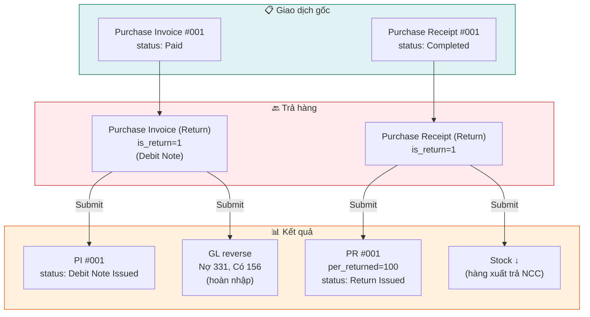
```mermaid
flowchart TB
    subgraph P_Original["📋 Giao dịch gốc"]
        PI_orig["Purchase Invoice #001\nstatus: Paid"]
        PR_orig["Purchase Receipt #001\nstatus: Completed"]
    end

    subgraph P_Return["🔙 Trả hàng"]
        PR_return["Purchase Receipt (Return)\nis_return=1"]
        PI_return["Purchase Invoice (Return)\nis_return=1\n(Debit Note)"]
    end

    subgraph P_Impact["📊 Kết quả"]
        PR_orig_new["PR #001\nper_returned=100\nstatus: Return Issued"]
        PI_orig_new["PI #001\nstatus: Debit Note Issued"]
        Stock_down["Stock ↓\n(hàng xuất trả NCC)"]
        GL_reverse_p["GL reverse\nNợ 331, Có 156\n(hoàn nhập)"]
    end

    PR_orig --> PR_return
    PI_orig --> PI_return

    PR_return -->|"Submit"| PR_orig_new
    PR_return -->|"Submit"| Stock_down
    PI_return -->|"Submit"| PI_orig_new
    PI_return -->|"Submit"| GL_reverse_p

    style P_Original fill:#e0f2f1,stroke:#00695c
    style P_Return fill:#ffebee,stroke:#c62828
    style P_Impact fill:#fff3e0,stroke:#e65100
```

---

## 9. Tổng Hợp: Ma Trận Document × Status

|  | Draft | Submitted | Unpaid | Partly Paid | Paid | Overdue | To Deliver | To Bill | To Receive | Completed | Return | CN/DN Issued | Closed | Cancelled |
| --- | --- | --- | --- | --- | --- | --- | --- | --- | --- | --- | --- | --- | --- | --- |
| **Quotation** | ✅ | — | — | — | — | — | — | — | — | — | — | — | — | ✅ |
| **Sales Order** | ✅ | — | — | — | — | — | ✅ | ✅ | — | ✅ | — | — | ✅ | ✅ |
| **Delivery Note** | ✅ | — | — | — | — | — | — | ✅ | — | ✅ | ✅ | ✅ | ✅ | ✅ |
| **Sales Invoice** | ✅ | ✅ | ✅ | ✅ | ✅ | ✅ | — | — | — | — | ✅ | ✅ | — | ✅ |
| **Material Request** | ✅ | — | — | — | — | — | — | — | — | — | — | — | — | ✅ |
| **Purchase Order** | ✅ | — | — | — | — | — | — | ✅ | ✅ | ✅ | — | — | ✅ | ✅ |
| **Purchase Receipt** | ✅ | — | — | — | — | — | — | ✅ | — | ✅ | ✅ | ✅ | ✅ | ✅ |
| **Purchase Invoice** | ✅ | ✅ | ✅ | ✅ | ✅ | ✅ | — | — | — | — | ✅ | ✅ | — | ✅ |
| **Payment Entry** | ✅ | ✅ | — | — | — | — | — | — | — | — | — | — | — | ✅ |
| **Stock Entry** | ✅ | ✅ | — | — | — | — | — | — | — | — | — | — | — | ✅ |

---

## 10. Quy Tắc Quan Trọng Cho DCNET

### 10.1 Status Map — Ưu tiên REVERSE

```python
# status_updater.py duyệt list NGƯỢC → rule cuối cùng ưu tiên cao nhất
# VD cho Sales Order:
# On Hold > Closed > Cancelled > To Pay > Completed > To Deliver > To Bill > To Deliver+Bill > Draft
```

### 10.2 per_billed không bao giờ > 100%

```python
# Dùng min(billed, ordered) → bill vượt số lượng order không đẩy % > 100
percentage = sum(min(abs(billed), abs(ordered))) / sum(abs(ordered)) * 100
```

### 10.3 Return Invoice KHÔNG update SO.per_billed (mặc định)

```python
# sales_invoice.py on_submit():
if self.is_return and not self.update_billed_amount_in_sales_order:
    self.status_updater = []  # skip status update on SO
```

### 10.4 Purchase Receipt grand_total=0 auto-complete

```python
# PR status_map: Completed nếu grand_total == 0 AND not return AND not returned
# → Hàng miễn phí, dịch vụ → auto Completed không cần PI
```

### 10.5 Outstanding driven by PLE, NOT by Payment Entry fields

```python
# outstanding_amount trên SI/PI được tính từ Payment Ledger Entry
# KHÔNG phải từ PE.allocated_amount trực tiếp
# Chain: PE submit → GL → PLE → query net PLE → SI/PI.outstanding_amount
```

### 10.6 Luồng DCNET cụ thể (Bán buôn vs Bán lẻ)

```
BÁN BUÔN (B2B):
  SO → DN → SI → PE
  (Đầy đủ 4 bước, per_delivered + per_billed tracking)

BÁN LẺ (POS):
  SI (is_pos=1, update_stock=1) → PE ngay
  (Skip SO + DN, stock trừ trực tiếp trên SI)

DROP SHIP:
  SO → PO (supplier giao) → SI → PE
  (Skip DN, SO.delivered_by_supplier=1)
```

---

> **Source:** Trích trực tiếp từ ERPNext v16 source code
> - `dcnet_core/erpnext/controllers/status_updater.py`
> - `dcnet_core/erpnext/selling/doctype/sales_order/sales_order.py`
> - `dcnet_core/erpnext/buying/doctype/purchase_order/purchase_order.py`
> - `dcnet_core/erpnext/stock/doctype/delivery_note/delivery_note.py`
> - `dcnet_core/erpnext/stock/doctype/purchase_receipt/purchase_receipt.py`
> - `dcnet_core/erpnext/accounts/doctype/sales_invoice/sales_invoice.py`
> - `dcnet_core/erpnext/accounts/doctype/purchase_invoice/purchase_invoice.py`
> - `dcnet_core/erpnext/accounts/doctype/payment_entry/payment_entry.py`
