# ERPNext CRM Module - Phân Tích Chi Tiết

> **Phiên bản:** ERPNext v16
> **Ngày phân tích:** 29/01/2026
> **Nguồn:** `dcnet_core/erpnext/crm/`

---

## Mục Lục

1. [Tổng Quan Module CRM](#1-tổng-quan-module-crm)
2. [Cấu Trúc Thư Mục](#2-cấu-trúc-thư-mục)
3. [Danh Sách DocTypes](#3-danh-sách-doctypes-27-doctypes)
4. [Lead - Khách Hàng Tiềm Năng](#4-lead---khách-hàng-tiềm-năng)
5. [Opportunity - Cơ Hội Bán Hàng](#5-opportunity---cơ-hội-bán-hàng)
6. [Prospect - Tổ Chức Tiềm Năng](#6-prospect---tổ-chức-tiềm-năng)
7. [Campaign - Chiến Dịch Marketing](#7-campaign---chiến-dịch-marketing)
8. [Contract - Hợp Đồng](#8-contract---hợp-đồng)
9. [Appointment - Lịch Hẹn](#9-appointment---lịch-hẹn)
10. [CRM Settings - Cấu Hình](#10-crm-settings---cấu-hình)
11. [Workflow & Conversion Flow](#11-workflow--conversion-flow)
12. [Reports & Analytics](#12-reports--analytics)
13. [Dashboard Components](#13-dashboard-components)
14. [Permissions & Access Control](#14-permissions--access-control)
15. [Integration Points](#15-integration-points)
16. [Code References](#16-code-references)

---

## 1. Tổng Quan Module CRM

### 1.1. CRM Module là gì?

**CRM (Customer Relationship Management)** trong ERPNext là module quản lý quan hệ khách hàng, bao gồm:

- **Lead Management**: Quản lý khách hàng tiềm năng
- **Opportunity Management**: Quản lý cơ hội bán hàng (pipeline)
- **Prospect Management**: Quản lý tổ chức tiềm năng (nhiều Lead cùng 1 công ty)
- **Campaign Management**: Quản lý chiến dịch marketing
- **Contract Management**: Quản lý hợp đồng
- **Appointment Booking**: Đặt lịch hẹn

### 1.2. Vị trí trong ERPNext

```
ERPNext
├── Selling (Bán hàng)
│   ├── Customer (Khách hàng)
│   ├── Quotation (Báo giá)
│   ├── Sales Order (Đơn hàng)
│   └── ...
│
├── CRM (Quản lý quan hệ khách hàng) ← TẬP TRUNG PHÂN TÍCH
│   ├── Lead
│   ├── Opportunity
│   ├── Prospect
│   ├── Campaign
│   ├── Contract
│   └── Appointment
│
├── Stock (Kho)
├── Buying (Mua hàng)
└── Accounts (Kế toán)
```

### 1.3. CRM Process Flow

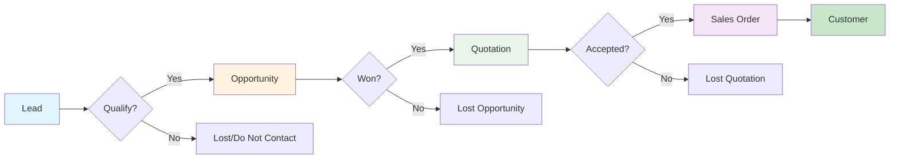

---

## 2. Cấu Trúc Thư Mục

```
dcnet_core/erpnext/crm/
├── __init__.py
├── utils.py                          # Helper functions (264 lines)
├── frappe_crm_api.py                 # Integration API (172 lines)
│
├── doctype/                          # Tất cả DocTypes (27 total)
│   ├── lead/                         # Khách hàng tiềm năng
│   ├── opportunity/                  # Cơ hội bán hàng
│   ├── prospect/                     # Tổ chức tiềm năng
│   ├── campaign/                     # Chiến dịch marketing
│   ├── contract/                     # Hợp đồng
│   ├── appointment/                  # Lịch hẹn
│   ├── crm_settings/                 # Cấu hình CRM
│   ├── sales_stage/                  # Giai đoạn bán hàng
│   ├── opportunity_type/             # Loại cơ hội
│   ├── market_segment/               # Phân khúc thị trường
│   ├── competitor/                   # Đối thủ cạnh tranh
│   └── ... (16 DocTypes khác)
│
├── report/                           # Báo cáo phân tích
│   ├── lead_details/
│   ├── lead_conversion_time/
│   ├── lead_owner_efficiency/
│   ├── opportunity_summary_by_sales_stage/
│   ├── lost_opportunity/
│   ├── campaign_efficiency/
│   ├── sales_pipeline_analytics/
│   ├── prospects_engaged_but_not_converted/
│   └── first_response_time_for_opportunity/
│
├── dashboard_chart/                  # Dashboard widgets
│   ├── incoming_leads/
│   ├── lead_source/
│   ├── opportunity_trends/
│   ├── territory_wise_opportunity_count/
│   ├── territory_wise_sales/
│   ├── won_opportunities/
│   └── opportunities_via_campaigns/
│
├── number_card/                      # KPI cards
│   ├── new_lead_(last_1_month)/
│   ├── open_opportunity/
│   ├── new_opportunity_(last_1_month)/
│   └── won_opportunity_(last_1_month)/
│
└── workspace/                        # CRM workspace configuration
```

---

## 3. Danh Sách DocTypes (27 DocTypes)

### 3.1. Core DocTypes (Chính)

| # | DocType | Mô tả | Autoname |
| --- | --- | --- | --- |
| 1 | **Lead** | Khách hàng tiềm năng | CRM-LEAD-.YYYY.- |
| 2 | **Opportunity** | Cơ hội bán hàng | CRM-OPP-.YYYY.- |
| 3 | **Prospect** | Tổ chức tiềm năng | By company_name |
| 4 | **Campaign** | Chiến dịch marketing | SAL-CAM-.YYYY.- |
| 5 | **Contract** | Hợp đồng | CON-.YYYY.-.##### |
| 6 | **Appointment** | Lịch hẹn | APMT-{customer_name}-#### |

### 3.2. Configuration DocTypes (Cấu hình)

| # | DocType | Mô tả |
| --- | --- | --- |
| 7 | **CRM Settings** | Cấu hình CRM toàn cục |
| 8 | **Sales Stage** | Giai đoạn bán hàng (pipeline) |
| 9 | **Opportunity Type** | Loại cơ hội (Sales, Support) |
| 10 | **Market Segment** | Phân khúc thị trường |
| 11 | **Competitor** | Đối thủ cạnh tranh |

### 3.3. Child Tables (Bảng con)

| # | DocType | Parent | Mô tả |
| --- | --- | --- | --- |
| 12 | **CRM Note** | Lead, Opportunity, Prospect | Ghi chú nội bộ |
| 13 | **Opportunity Item** | Opportunity | Sản phẩm trong cơ hội |
| 14 | **Opportunity Lost Reason** | - | Lý do mất deal |
| 15 | **Opportunity Lost Reason Detail** | Opportunity | Chi tiết lý do mất |
| 16 | **Prospect Lead** | Prospect | Link Lead → Prospect |
| 17 | **Prospect Opportunity** | Prospect | Link Opportunity → Prospect |
| 18 | **Contract Fulfilment Checklist** | Contract | Checklist hoàn thành HĐ |
| 19 | **Contract Template Fulfilment Terms** | Contract Template | Điều khoản HĐ |
| 20 | **Campaign Email Schedule** | Campaign | Lịch gửi email |
| 21 | **Lost Reason Detail** | - | Chi tiết lý do mất |

### 3.4. Template & Settings DocTypes

| # | DocType | Mô tả |
| --- | --- | --- |
| 22 | **Contract Template** | Mẫu hợp đồng |
| 23 | **Appointment Booking Settings** | Cấu hình đặt lịch |
| 24 | **Appointment Booking Slots** | Khung giờ có sẵn |
| 25 | **Availability of Slots** | Quản lý slot |
| 26 | **Email Campaign** | Chiến dịch email |
| 27 | **Opponent (Competitor Detail)** | Chi tiết đối thủ |

---

## 4. Lead - Khách Hàng Tiềm Năng

### 4.1. Tổng Quan

**Lead** là điểm bắt đầu của CRM funnel - đại diện cho một khách hàng tiềm năng chưa có giao dịch.

**File locations:**
- Schema: `doctype/lead/lead.json` (619 lines)
- Business logic: `doctype/lead/lead.py` (552 lines)
- UI logic: `doctype/lead/lead.js` (230+ lines)

### 4.2. Field Categories

#### A. Thông Tin Cơ Bản

| Field | Type | Required | Mô tả |
| --- | --- | --- | --- |
| `naming_series` | Select | Yes | CRM-LEAD-.YYYY.- |
| `salutation` | Link | No | Mr./Mrs./Ms. |
| `first_name` | Data | No* | Tên |
| `middle_name` | Data | No | Tên đệm |
| `last_name` | Data | No | Họ |
| `lead_name` | Data | Read-only | Tên đầy đủ (auto-generated) |
| `job_title` | Data | No | Chức vụ |
| `gender` | Link | No | Giới tính |

> *`first_name` bắt buộc nếu không có `company_name`

#### B. Thông Tin Công Ty

| Field | Type | Required | Mô tả |
| --- | --- | --- | --- |
| `company_name` | Data | No* | Tên công ty |
| `industry` | Link | No | Ngành nghề |
| `market_segment` | Link | No | Phân khúc thị trường |
| `no_of_employees` | Select | No | Quy mô (1-10, 11-50, ...) |
| `annual_revenue` | Currency | No | Doanh thu năm |
| `territory` | Link | No | Khu vực |

#### C. Thông Tin Liên Hệ

| Field | Type | Required | Mô tả |
| --- | --- | --- | --- |
| `email_id` | Data | No | Email chính |
| `phone` | Data | No | Điện thoại bàn |
| `mobile_no` | Data | No | Di động |
| `whatsapp_no` | Data | No | WhatsApp |
| `fax` | Data | No | Fax |
| `phone_ext` | Data | No | Số máy lẻ |
| `website` | Data | No | Website |

#### D. Địa Chỉ

| Field | Type | Required | Mô tả |
| --- | --- | --- | --- |
| `city` | Data | No | Thành phố |
| `state` | Data | No | Tỉnh/Bang |
| `country` | Link | No | Quốc gia |
| `address_html` | HTML | Read-only | Hiển thị địa chỉ |

#### E. Trạng Thái & Phân Loại

| Field | Type | Options | Mô tả |
| --- | --- | --- | --- |
| `status` | Select | Lead/Open/Replied/Opportunity/Quotation/Lost Quotation/Interested/Converted/Do Not Contact | Trạng thái Lead |
| `lead_owner` | Link (User) | Default: __user | Người phụ trách |
| `type` | Select | Client/Channel Partner/Consultant | Loại Lead |
| `request_type` | Select | Product Enquiry/Request for Information/Suggestions/Other | Loại yêu cầu |
| `source` | Link | Source | Nguồn Lead |

#### F. Qualification (Đánh Giá Chất Lượng)

| Field | Type | Options | Mô tả |
| --- | --- | --- | --- |
| `qualification_status` | Select | Unqualified/In Process/Qualified | Trạng thái đánh giá |
| `qualified_by` | Link (User) | - | Người đánh giá |
| `qualified_on` | Date | - | Ngày đánh giá |

#### G. UTM Tracking (Analytics)

| Field | Type | Mô tả |
| --- | --- | --- |
| `utm_source` | Data | Nguồn traffic (google, facebook) |
| `utm_medium` | Data | Kênh (cpc, email, social) |
| `utm_campaign` | Data | Tên chiến dịch |
| `utm_content` | Data | Nội dung quảng cáo |

### 4.3. Status Workflow

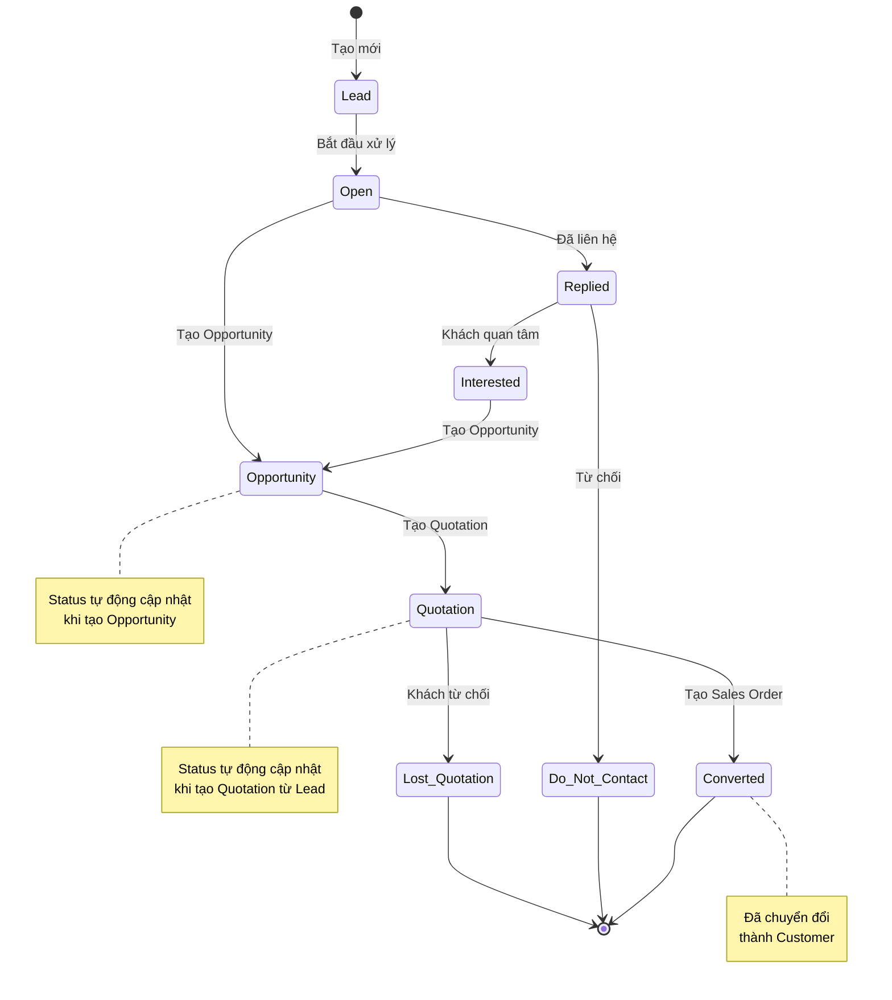

### 4.4. Key Methods (Business Logic)

| Method | Line | Mô tả |
| --- | --- | --- |
| `validate()` | 95-101 | Validate khi save (set full name, check email unique) |
| `before_insert()` | 103-119 | Auto-create Contact nếu CRM Settings cho phép |
| `after_insert()` | 121-122 | Link to Contact |
| `on_update()` | 124-125 | Update linked Prospect |
| `on_trash()` | 127-130 | Cleanup (issues, contacts, addresses, prospects) |
| `set_full_name()` | 132-136 | first + middle + last → lead_name |
| `check_email_id_is_unique()` | 151-168 | Validate email unique (tuỳ CRM Settings) |
| `create_contact()` | 251-280 | Tạo Contact từ Lead |
| `create_prospect()` | 282-313 | Tạo Prospect từ Lead |

### 4.5. Conversion Methods (Chuyển Đổi)

| Method | Line | Target | Mô tả |
| --- | --- | --- | --- |
| `make_customer()` | 317-360 | Customer | Chuyển Lead → Customer |
| `make_opportunity()` | 364-390 | Opportunity | Chuyển Lead → Opportunity |
| `make_quotation()` | 394-411 | Quotation | Chuyển Lead → Quotation |

**Field Mapping khi make\_customer():**

```python
# lead.py:317-360
field_map = {
    "Lead": {
        "doctype": "Customer",
        "field_map": {
            "company_name": "customer_name",
            "lead_name": "customer_name",  # fallback nếu không có company
        }
    }
}
```

### 4.6. UI Actions (Buttons)

```javascript
// lead.js - refresh()
frm.add_custom_button(__("Customer"), make_customer, __("Create"));
frm.add_custom_button(__("Opportunity"), make_opportunity, __("Create"));
frm.add_custom_button(__("Quotation"), make_quotation, __("Create"));
frm.add_custom_button(__("Prospect"), make_prospect, __("Create"));
frm.add_custom_button(__("Add to Prospect"), add_lead_to_prospect, __("Action"));
```

**UI Flow:**

```
Lead Form
├── [Create] dropdown
│   ├── Customer → Chuyển thành khách hàng
│   ├── Opportunity → Tạo cơ hội bán hàng
│   ├── Quotation → Tạo báo giá trực tiếp
│   └── Prospect → Tạo tổ chức tiềm năng
│
└── [Action] dropdown
    └── Add to Prospect → Thêm vào Prospect có sẵn
```

### 4.7. Relationships

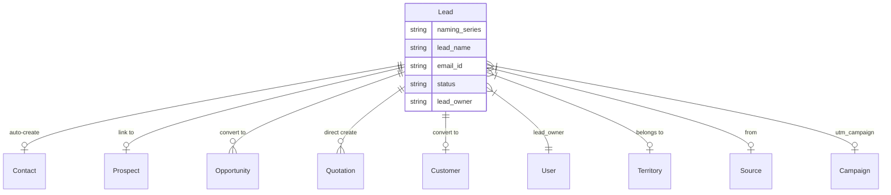

---

## 5. Opportunity - Cơ Hội Bán Hàng

### 5.1. Tổng Quan

**Opportunity** đại diện cho một cơ hội bán hàng cụ thể, có thể đến từ Lead, Customer, hoặc Prospect.

**File locations:**
- Schema: `doctype/opportunity/opportunity.json` (400+ lines)
- Business logic: `doctype/opportunity/opportunity.py` (300+ lines)
- UI logic: `doctype/opportunity/opportunity.js`

### 5.2. Field Categories

#### A. Thông Tin Nguồn (Dynamic Link)

| Field | Type | Required | Mô tả |
| --- | --- | --- | --- |
| `opportunity_from` | Link | Yes | Lead/Customer/Prospect |
| `party_name` | Dynamic Link | Yes | Link đến record cụ thể |
| `customer_name` | Data | Read-only | Tên hiển thị |

> **Dynamic Link Pattern:** `opportunity_from` xác định DocType, `party_name` xác định record

#### B. Trạng Thái & Pipeline

| Field | Type | Options | Mô tả |
| --- | --- | --- | --- |
| `status` | Select | Open/Quotation/Converted/Lost/Replied/Closed | Trạng thái |
| `opportunity_type` | Link | Opportunity Type | Loại (Sales, Support) |
| `sales_stage` | Link | Sales Stage | Giai đoạn pipeline |
| `probability` | Percent | 0-100 | Xác suất thắng (%) |
| `expected_closing` | Date | - | Ngày dự kiến close |
| `opportunity_owner` | Link (User) | - | Người phụ trách |

#### C. Giá Trị

| Field | Type | Mô tả |
| --- | --- | --- |
| `currency` | Link | Đơn vị tiền tệ |
| `conversion_rate` | Float | Tỷ giá |
| `opportunity_amount` | Currency | Giá trị cơ hội |
| `base_opportunity_amount` | Currency | Giá trị (base currency) |
| `total` | Currency | Tổng items |
| `base_total` | Currency | Tổng (base currency) |

#### D. Items (Sản Phẩm)

| Field | Type | Mô tả |
| --- | --- | --- |
| `items` | Table | Opportunity Item |

**Opportunity Item fields:**

| Field | Type | Mô tả |
| --- | --- | --- |
| `item_code` | Link | Mã sản phẩm |
| `item_name` | Data | Tên sản phẩm |
| `qty` | Float | Số lượng |
| `uom` | Link | Đơn vị |
| `rate` | Currency | Đơn giá |
| `amount` | Currency | Thành tiền |
| `base_rate` | Currency | Đơn giá (base) |
| `base_amount` | Currency | Thành tiền (base) |

#### E. Contact & Address

| Field | Type | Mô tả |
| --- | --- | --- |
| `contact_person` | Link | Contact |
| `contact_email` | Data | Email |
| `contact_mobile` | Data | Di động |
| `phone` | Data | Điện thoại |
| `whatsapp` | Data | WhatsApp |
| `customer_address` | Link | Address |
| `address_display` | Small Text | Hiển thị địa chỉ |

#### F. Lost Deal Info

| Field | Type | Mô tả |
| --- | --- | --- |
| `lost_reasons` | Table | Opportunity Lost Reason Detail |
| `competitors` | Table | Competitor tracking |
| `order_lost_reason` | Small Text | Lý do chi tiết |

### 5.3. Status Workflow

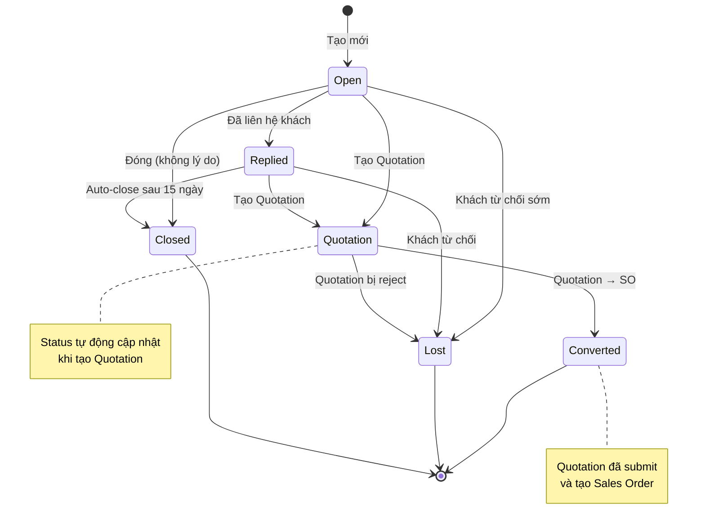

### 5.4. Key Methods

| Method | Line | Mô tả |
| --- | --- | --- |
| `validate()` | 130-142 | Validate items, set type, calculate totals |
| `after_insert()` | 120-128 | Update Lead status, link tasks/events |
| `on_update()` | 144-145 | Update Prospect |
| `map_fields()` | 147-154 | Copy fields từ opportunity_from |
| `calculate_totals()` | 169-179 | Sum item amounts |
| `declare_enquiry_lost()` | 263-282 | Mark as Lost với reasons |
| `has_active_quotation()` | 284-299 | Check Quotation submitted |

### 5.5. Pipeline Visualization

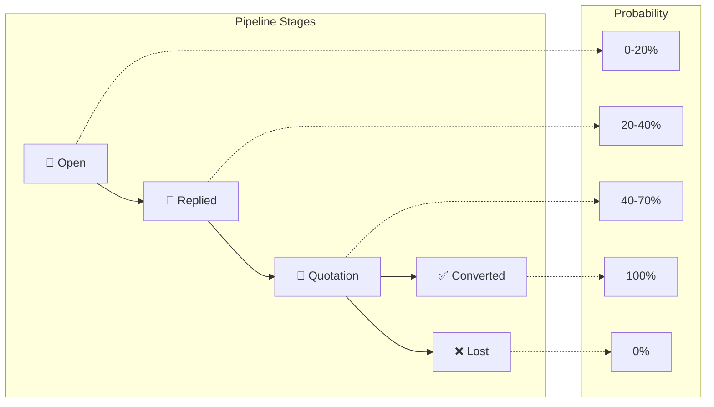

### 5.6. Relationships

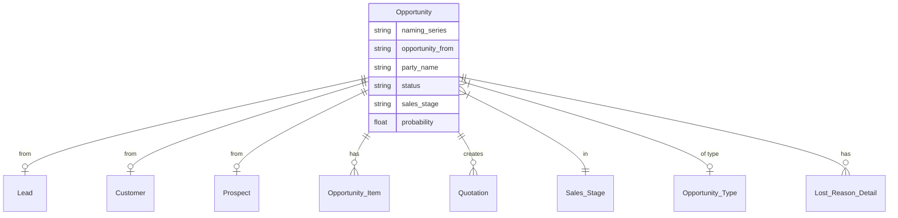

---

## 6. Prospect - Tổ Chức Tiềm Năng

### 6.1. Tổng Quan

**Prospect** là DocType để group nhiều Leads và Opportunities cùng thuộc một tổ chức/công ty.

**Use case:** Công ty ABC có 3 nhân viên liên hệ (3 Leads) → tất cả link về 1 Prospect "Công ty ABC"

**File locations:**
- Schema: `doctype/prospect/prospect.json` (250+ lines)
- Business logic: `doctype/prospect/prospect.py`

### 6.2. Field Categories

| Category | Fields | Mô tả |
| --- | --- | --- |
| **Organization** | company_name (unique, required), customer_group, industry, market_segment, territory | Thông tin tổ chức |
| **Details** | no_of_employees, annual_revenue, fax, website, prospect_owner | Chi tiết |
| **Links** | leads (table), opportunities (table) | Liên kết Lead & Opp |
| **Activities** | notes (table), open_activities_html, all_activities_html | Hoạt động |

### 6.3. Child Tables

**Prospect Lead:**

| Field | Type | Mô tả |
| --- | --- | --- |
| `lead` | Link | Lead record |
| `lead_name` | Data | Tên Lead |
| `email` | Data | Email |
| `mobile_no` | Data | Di động |
| `status` | Data | Status của Lead |

**Prospect Opportunity:**

| Field | Type | Mô tả |
| --- | --- | --- |
| `opportunity` | Link | Opportunity record |
| `amount` | Currency | Giá trị |
| `stage` | Data | Sales stage |
| `probability` | Percent | Xác suất |
| `expected_closing` | Date | Ngày dự kiến |

### 6.4. Prospect Structure

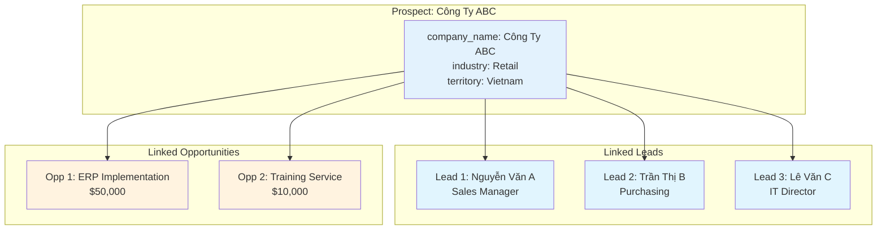

---

## 7. Campaign - Chiến Dịch Marketing

### 7.1. Tổng Quan

**Campaign** quản lý các chiến dịch marketing, bao gồm email campaigns và tracking.

**File locations:**
- Schema: `doctype/campaign/campaign.json` (120+ lines)

### 7.2. Fields

| Field | Type | Required | Mô tả |
| --- | --- | --- | --- |
| `naming_series` | Select | Yes | SAL-CAM-.YYYY.- |
| `campaign_name` | Data | Yes | Tên chiến dịch |
| `campaign_schedules` | Table | No | Email schedules |
| `description` | Text | No | Mô tả |

### 7.3. Campaign Email Schedule

| Field | Type | Mô tả |
| --- | --- | --- |
| `email_template` | Link | Template email |
| `send_after_days` | Int | Gửi sau N ngày |

### 7.4. UTM Tracking Integration

Campaigns liên kết với Leads/Opportunities qua UTM parameters:

```
Lead.utm_campaign = "summer-sale-2025"
      ↓
Campaign.campaign_name = "summer-sale-2025"
```

---

## 8. Contract - Hợp Đồng

### 8.1. Tổng Quan

**Contract** quản lý hợp đồng với Customer, Supplier, hoặc Employee.

**File locations:**
- Schema: `doctype/contract/contract.json` (250+ lines)

### 8.2. Field Categories

#### A. Party Information

| Field | Type | Options | Mô tả |
| --- | --- | --- | --- |
| `party_type` | Select | Customer/Supplier/Employee | Loại đối tác |
| `party_name` | Dynamic Link | - | Đối tác cụ thể |
| `party_user` | Link (User) | - | User của đối tác |
| `party_full_name` | Data | - | Tên đầy đủ |

#### B. Contract Details

| Field | Type | Mô tả |
| --- | --- | --- |
| `status` | Select | Unsigned/Active/Inactive/Cancelled |
| `start_date` | Date | Ngày bắt đầu |
| `end_date` | Date | Ngày kết thúc |
| `contract_template` | Link | Mẫu hợp đồng |
| `contract_terms` | Text Editor | Nội dung hợp đồng |

#### C. Signature

| Field | Type | Mô tả |
| --- | --- | --- |
| `is_signed` | Checkbox | Đã ký chưa |
| `signee` | Data | Người ký |
| `signed_on` | Datetime | Thời điểm ký |
| `ip_address` | Data | IP address |
| `signee_company` | Data | Công ty người ký |
| `signed_by_company` | Data | Ký bởi công ty |

#### D. Fulfilment Tracking

| Field | Type | Options | Mô tả |
| --- | --- | --- | --- |
| `requires_fulfilment` | Checkbox | - | Cần theo dõi hoàn thành |
| `fulfilment_status` | Select | N/A/Unfulfilled/Partially Fulfilled/Fulfilled/Lapsed | Trạng thái hoàn thành |
| `fulfilment_deadline` | Date | - | Deadline |
| `fulfilment_terms` | Table | - | Các điều khoản |

### 8.3. Contract Workflow

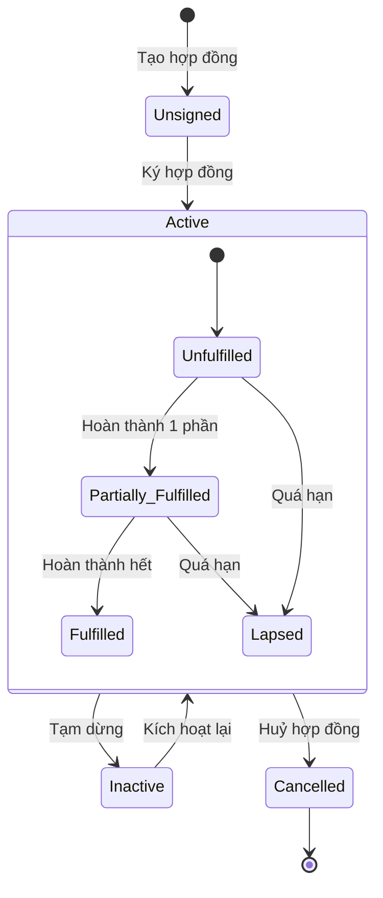

---

## 9. Appointment - Lịch Hẹn

### 9.1. Tổng Quan

**Appointment** quản lý việc đặt lịch hẹn với khách hàng.

**File locations:**
- Schema: `doctype/appointment/appointment.json` (120+ lines)

### 9.2. Fields

| Field | Type | Required | Mô tả |
| --- | --- | --- | --- |
| `customer_name` | Data | Yes | Tên khách |
| `customer_phone_number` | Data | No | SĐT |
| `customer_email` | Data | Yes | Email |
| `customer_skype` | Data | No | Skype ID |
| `customer_details` | Long Text | No | Chi tiết yêu cầu |
| `scheduled_time` | Datetime | Yes | Thời gian hẹn |
| `status` | Select | Open/Unverified/Closed | Trạng thái |
| `appointment_with` | Link (DocType) | No | Hẹn với loại (Customer, Lead) |
| `party` | Dynamic Link | No | Record cụ thể |
| `calendar_event` | Link (Event) | No | Calendar event |

### 9.3. Appointment Flow

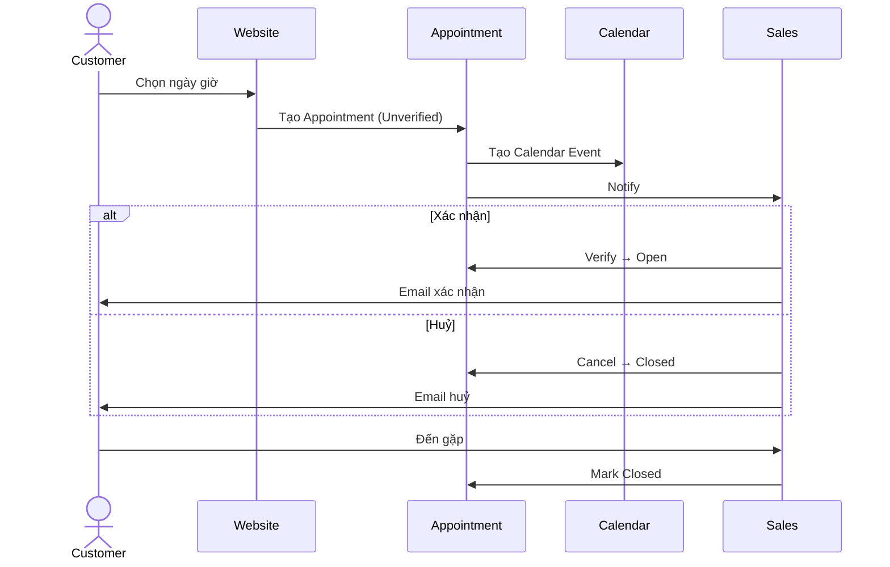

---

## 10. CRM Settings - Cấu Hình

### 10.1. Tổng Quan

**CRM Settings** là Single DocType chứa các cấu hình toàn cục cho CRM module.

**File location:** `doctype/crm_settings/crm_settings.json` (150 lines)

### 10.2. Configuration Options

| Setting | Type | Default | Mô tả |
| --- | --- | --- | --- |
| `allow_lead_duplication_based_on_emails` | Checkbox | OFF | Cho phép Lead trùng email |
| `auto_creation_of_contact` | Checkbox | ON | Auto-tạo Contact khi tạo Lead |
| `campaign_naming_by` | Select | Campaign Name | Campaign đặt tên theo |
| `close_opportunity_after_days` | Int | 15 | Auto-close Opp "Replied" sau N ngày |
| `default_valid_till` | Data | - | Thời hạn Quotation mặc định |
| `carry_forward_communication_and_comments` | Checkbox | OFF | Copy emails/comments qua workflow |
| `update_timestamp_on_new_communication` | Checkbox | OFF | Update modified khi có email mới |

### 10.3. Settings Impact

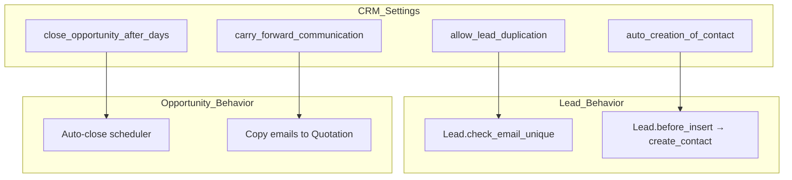

---

## 11. Workflow & Conversion Flow

### 11.1. Complete CRM Flow

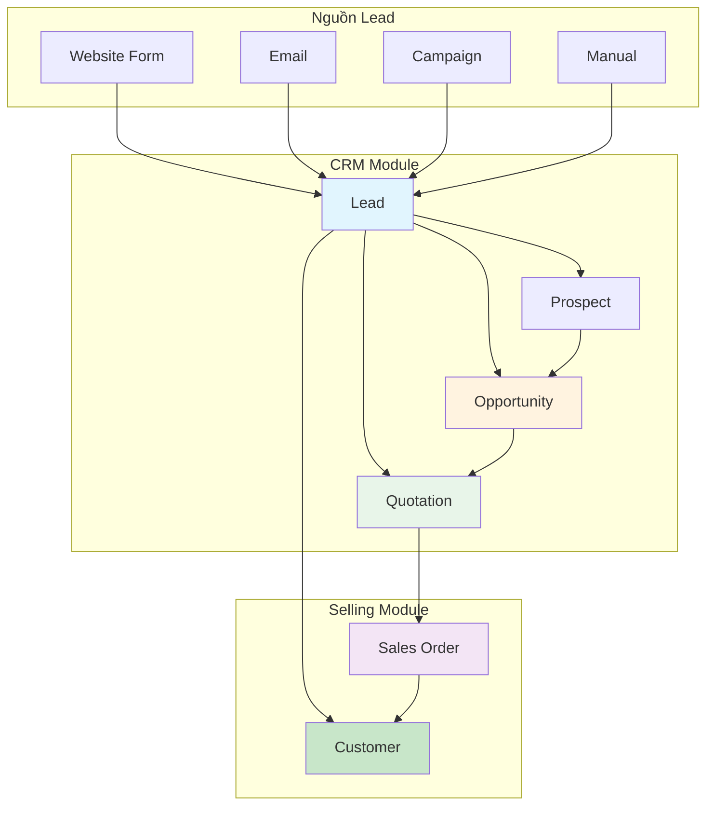

### 11.2. Status Auto-Update Logic

```python
# Lead status được update tự động khi:

# 1. Tạo Opportunity từ Lead
# opportunity.py:after_insert()
if self.opportunity_from == "Lead":
    frappe.db.set_value("Lead", self.party_name, "status", "Opportunity")

# 2. Tạo Quotation từ Lead (has_quotation check)
# lead.py:has_quotation()
def has_quotation(self):
    return frappe.db.exists({
        "doctype": "Quotation",
        "quotation_to": "Lead",
        "party_name": self.name,
        "docstatus": 1  # Submitted
    })

# 3. Lead convert → Customer
# lead.py:make_customer() → after submit, Lead status = "Converted"
```

### 11.3. Conversion Sequence Diagram

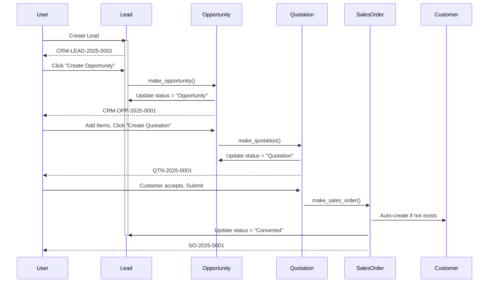

### 11.4. Data Mapping Through Workflow

| Stage | Source Field | → | Target Field |
| --- | --- | --- | --- |
| **Lead → Opportunity** |  |  |  |
|  | lead_name | → | customer_name |
|  | email_id | → | contact_email |
|  | mobile_no | → | contact_mobile |
|  | company_name | → | customer_name |
|  | territory | → | territory |
| --- | --- | --- | --- |
| **Opportunity → Quotation** |  |  |  |
|  | party_name | → | party_name |
|  | opportunity_from | → | quotation_to |
|  | items | → | items |
|  | contact_person | → | contact_person |
|  | customer_address | → | customer_address |
| --- | --- | --- | --- |
| **Quotation → Sales Order** |  |  |  |
|  | party_name | → | customer |
|  | items | → | items |
|  | taxes | → | taxes |
|  | payment_terms | → | payment_terms |

---

## 12. Reports & Analytics

### 12.1. Available Reports

| Report | Mô tả | Key Metrics |
| --- | --- | --- |
| **Lead Details** | Chi tiết tất cả Leads | Owner, Status, Territory, Source |
| **Lead Conversion Time** | Thời gian convert Lead | Days to convert |
| **Lead Owner Efficiency** | Hiệu quả theo Owner | Leads handled, conversion rate |
| **Opportunity Summary by Sales Stage** | Pipeline summary | Count & value by stage |
| **Lost Opportunity** | Deals đã mất | Lost reasons, competitors |
| **Campaign Efficiency** | ROI campaigns | Leads generated, conversion |
| **Sales Pipeline Analytics** | Pipeline metrics | Weighted value, probability |
| **Prospects Engaged but Not Converted** | Prospects chưa convert | Engagement level |
| **First Response Time for Opportunity** | Thời gian phản hồi | Response time |

### 12.2. Lead Details Report

**File:** `report/lead_details/lead_details.py` (113 lines)

**Columns:**
- Lead, Lead Name, Status, Lead Owner
- Territory, Source (utm_source)
- Email, Mobile, Phone
- Company, Address details

**Filters:**
- Company (required)
- From Date, To Date
- Territory
- Status

### 12.3. Sample Pipeline Report

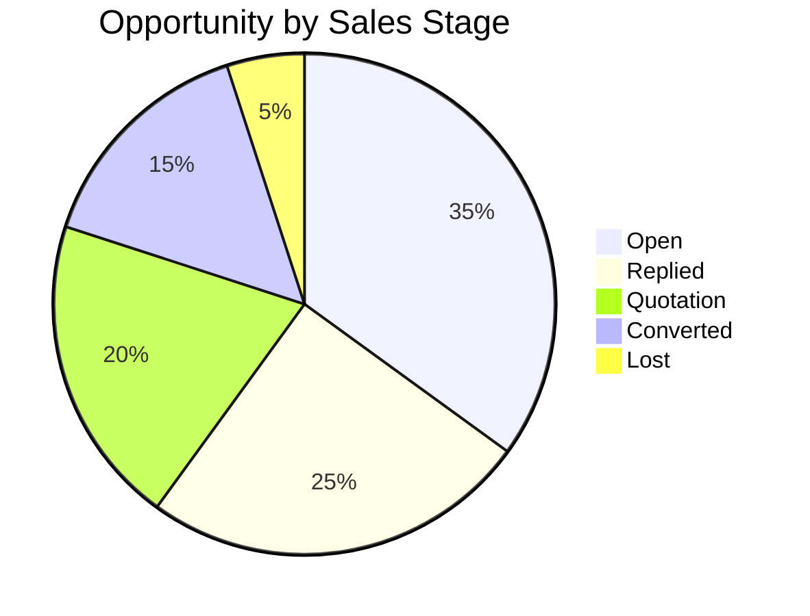

---

## 13. Dashboard Components

### 13.1. Dashboard Charts

| Chart | Type | Mô tả |
| --- | --- | --- |
| `incoming_leads` | Line | Lead mới theo thời gian |
| `lead_source` | Pie | Nguồn Lead |
| `opportunity_trends` | Line | Opportunity theo thời gian |
| `territory_wise_opportunity_count` | Bar | Opportunity theo khu vực |
| `territory_wise_sales` | Bar | Doanh số theo khu vực |
| `won_opportunities` | Line | Deals thắng |
| `opportunities_via_campaigns` | Bar | Opp từ campaigns |

### 13.2. Number Cards (KPIs)

| Card | Mô tả |
| --- | --- |
| New Leads (Last 1 Month) | Lead mới trong 30 ngày |
| Open Opportunities | Opportunities đang mở |
| New Opportunities (Last 1 Month) | Opp mới trong 30 ngày |
| Won Opportunities (Last 1 Month) | Deals thắng trong 30 ngày |

### 13.3. CRM Dashboard Layout

```
┌─────────────────────────────────────────────────────────────────┐
│                        CRM Dashboard                             │
├─────────────────┬─────────────────┬─────────────────┬───────────┤
│   New Leads     │ Open Opps       │  New Opps       │ Won Opps  │
│      125        │     45          │     38          │    12     │
├─────────────────┴─────────────────┴─────────────────┴───────────┤
│                     Incoming Leads Trend                         │
│  📈 ▁▂▃▄▅▆▇█▇▆▅▄▃▂▁▂▃▄▅▆▇█                                     │
├─────────────────────────────────────┬───────────────────────────┤
│          Lead Source                │     Opportunity Trends    │
│  🥧 Website: 45%                    │  📈 Pipeline Value        │
│     Referral: 30%                   │     $2.5M total          │
│     Campaign: 25%                   │                           │
├─────────────────────────────────────┴───────────────────────────┤
│                  Territory Performance                           │
│  📊 Vietnam: 40 opps | Thailand: 25 opps | Singapore: 15 opps   │
└─────────────────────────────────────────────────────────────────┘
```

---

## 14. Permissions & Access Control

### 14.1. Role Matrix

| DocType | Desk User | Sales User | Sales Manager | System Manager |
| --- | --- | --- | --- | --- |
| **Lead** | R | CRUD+E | CRUD+D+I/E | CRUD+D+I/E |
| **Opportunity** | R | CRUD+E | CRUD+D+I/E | CRUD+D+I/E |
| **Prospect** | R | CRUD | CRUD+D | CRUD+D |
| **Campaign** | R | R+E | CRUD+D+I/E | CRUD+D+I/E |
| **Contract** | R | R | CRUD+D | CRUD+D |
| **Appointment** | R+C | CRUD | CRUD | CRUD |
| **CRM Settings** | - | - | CRUD | CRUD |

**Legend:**
- R = Read
- C = Create
- U = Update
- D = Delete
- E = Email/Print/Share
- I/E = Import/Export

### 14.2. Permission Flow

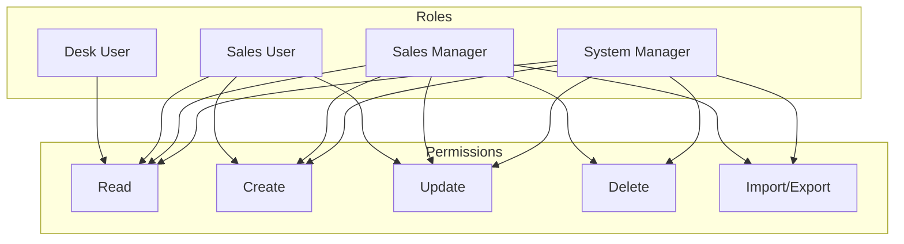

---

## 15. Integration Points

### 15.1. With Selling Module

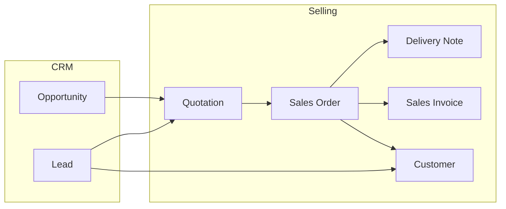

### 15.2. With Communication

| Integration | Mô tả |
| --- | --- |
| **Communication** | Emails linked to Lead/Opportunity |
| **Comment** | Notes và discussions |
| **Event** | Calendar activities |
| **ToDo** | Tasks assigned |

### 15.3. With Master Data

| Master | Usage in CRM |
| --- | --- |
| **Contact** | Person details for Lead/Opportunity |
| **Address** | Location for Lead/Opportunity |
| **Customer** | Conversion target |
| **Territory** | Geographic classification |
| **Industry Type** | Industry classification |
| **Company** | Multi-company support |

### 15.4. Integration Diagram

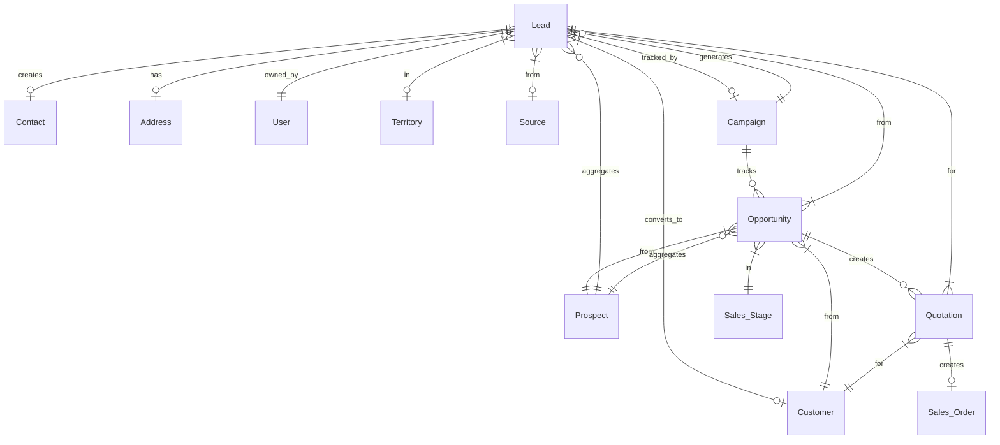

---

## 16. Code References

### 16.1. Key Files Summary

| Category | File | Lines | Purpose |
| --- | --- | --- | --- |
| **Lead** | lead/lead.json | 619 | Schema |
|  | lead/lead.py | 552 | Business logic |
|  | lead/lead.js | 230+ | UI logic |
| **Opportunity** | opportunity/opportunity.json | 400+ | Schema |
|  | opportunity/opportunity.py | 300+ | Business logic |
|  | opportunity/opportunity.js | - | UI logic |
| **Prospect** | prospect/prospect.json | 250+ | Schema |
| **Campaign** | campaign/campaign.json | 120+ | Schema |
| **Contract** | contract/contract.json | 250+ | Schema |
| **Appointment** | appointment/appointment.json | 120+ | Schema |
| **CRM Settings** | crm_settings/crm_settings.json | 150 | Settings |
| **Utils** | utils.py | 264 | Helper functions |
| **API** | frappe_crm_api.py | 172 | Integration API |

### 16.2. Critical Methods Reference

| Method | File:Line | Purpose |
| --- | --- | --- |
| `make_customer()` | lead.py:317-360 | Lead → Customer |
| `make_opportunity()` | lead.py:364-390 | Lead → Opportunity |
| `make_quotation()` | lead.py:394-411 | Lead → Quotation |
| `create_contact()` | lead.py:251-280 | Auto-create Contact |
| `create_prospect()` | lead.py:282-313 | Lead → Prospect |
| `check_email_id_is_unique()` | lead.py:151-168 | Email validation |
| `declare_enquiry_lost()` | opportunity.py:263-282 | Mark Lost |
| `calculate_totals()` | opportunity.py:169-179 | Sum items |
| `map_fields()` | opportunity.py:147-154 | Copy fields |
| `copy_comments()` | utils.py:34-45 | Copy history |
| `link_communications()` | utils.py:48-53 | Link emails |
| `get_open_activities()` | utils.py:147-158 | Get tasks/events |

### 16.3. DocType Links Quick Reference

```
Base path: dcnet_core/erpnext/crm/doctype/

lead/
├── lead.json          # Field definitions, permissions
├── lead.py            # Python class, validation, conversion
├── lead.js            # Form client script
├── lead_list.js       # List view customization
├── lead_dashboard.py  # Dashboard config
└── test_lead.py       # Unit tests

opportunity/
├── opportunity.json
├── opportunity.py
├── opportunity.js
├── opportunity_list.js
├── opportunity_dashboard.py
└── test_opportunity.py

[Similar structure for other DocTypes]
```

---

## Appendix A: CRM UI Screenshots Reference

### A.1. Lead Form Sections

```
┌─────────────────────────────────────────────────────────────────┐
│ Lead: CRM-LEAD-2025-0001                          [✓] [Save]   │
├─────────────────────────────────────────────────────────────────┤
│ ┌─ Basic Info ───────────────────────────────────────────────┐ │
│ │ Salutation: [Mr.  ▼]  First Name: [___________]            │ │
│ │ Middle Name: [___________]  Last Name: [___________]       │ │
│ │ Status: [Open ▼]  Lead Owner: [Current User ▼]             │ │
│ └────────────────────────────────────────────────────────────┘ │
│ ┌─ Organization ─────────────────────────────────────────────┐ │
│ │ Company Name: [___________]  Job Title: [___________]      │ │
│ │ Industry: [_______ ▼]  Territory: [_______ ▼]              │ │
│ └────────────────────────────────────────────────────────────┘ │
│ ┌─ Contact ──────────────────────────────────────────────────┐ │
│ │ Email: [___________]  Phone: [___________]                 │ │
│ │ Mobile: [___________]  WhatsApp: [___________]             │ │
│ └────────────────────────────────────────────────────────────┘ │
│ ┌─ Address ──────────────────────────────────────────────────┐ │
│ │ City: [___________]  State: [___________]                  │ │
│ │ Country: [_______ ▼]                                       │ │
│ └────────────────────────────────────────────────────────────┘ │
│ ┌─ Notes & Activities ───────────────────────────────────────┐ │
│ │ [Add Note] [Add Event] [Add Task]                          │ │
│ │ ─────────────────────────────────────────────────          │ │
│ │ 📝 2025-01-29: Called customer, interested in product      │ │
│ │ 📅 2025-01-30: Follow-up meeting scheduled                 │ │
│ └────────────────────────────────────────────────────────────┘ │
└─────────────────────────────────────────────────────────────────┘
```

### A.2. Opportunity Pipeline View

```
┌─────────────────────────────────────────────────────────────────┐
│ Opportunity Pipeline                                             │
├──────────────┬──────────────┬──────────────┬───────────────────┤
│    Open      │   Replied    │  Quotation   │    Converted      │
│  (35 deals)  │  (25 deals)  │  (20 deals)  │    (15 deals)     │
├──────────────┼──────────────┼──────────────┼───────────────────┤
│ ┌──────────┐ │ ┌──────────┐ │ ┌──────────┐ │ ┌───────────────┐ │
│ │ ABC Corp │ │ │ XYZ Inc  │ │ │ DEF Ltd  │ │ │ GHI Company   │ │
│ │ $50,000  │ │ │ $30,000  │ │ │ $100,000 │ │ │ $75,000       │ │
│ │ 20%      │ │ │ 40%      │ │ │ 70%      │ │ │ 100%          │ │
│ └──────────┘ │ └──────────┘ │ └──────────┘ │ └───────────────┘ │
│ ┌──────────┐ │ ┌──────────┐ │ ┌──────────┐ │                   │
│ │ PQR Tech │ │ │ MNO Ent  │ │ │ STU Corp │ │                   │
│ │ $25,000  │ │ │ $45,000  │ │ │ $60,000  │ │                   │
│ │ 15%      │ │ │ 35%      │ │ │ 65%      │ │                   │
│ └──────────┘ │ └──────────┘ │ └──────────┘ │                   │
└──────────────┴──────────────┴──────────────┴───────────────────┘
│ Total Pipeline Value: $500,000                                  │
│ Weighted Value: $185,000                                        │
└─────────────────────────────────────────────────────────────────┘
```

---

## Appendix B: Glossary

| Term | Định nghĩa |
| --- | --- |
| **Lead** | Khách hàng tiềm năng chưa có giao dịch |
| **Opportunity** | Cơ hội bán hàng cụ thể với giá trị ước tính |
| **Prospect** | Tổ chức/công ty có nhiều Leads |
| **Pipeline** | Quy trình bán hàng với các giai đoạn |
| **Sales Stage** | Giai đoạn trong pipeline (Open, Quotation, Won, Lost) |
| **Conversion** | Chuyển đổi từ Lead → Customer |
| **Qualification** | Đánh giá chất lượng Lead |
| **UTM** | Urchin Tracking Module - theo dõi nguồn traffic |
| **Dynamic Link** | Link field linh hoạt dựa trên DocType khác |

---

## Appendix C: Best Practices

### C.1. Lead Management

✅ **DO:**
- Nhập đầy đủ thông tin liên hệ (email, phone)
- Gán Lead Owner ngay khi tạo
- Cập nhật status thường xuyên
- Sử dụng UTM tracking cho campaigns

❌ **DON'T:**
- Để Lead không có owner
- Tạo Lead trùng email (trừ khi cần thiết)
- Bỏ qua follow-up activities

### C.2. Opportunity Management

✅ **DO:**
- Thêm Items với giá trị ước tính
- Cập nhật probability theo thực tế
- Ghi chú Lost Reasons khi mất deal
- Track competitors nếu có

❌ **DON'T:**
- Để Opportunity mở quá lâu không cập nhật
- Tạo Quotation khi chưa đủ thông tin
- Bỏ qua follow-up với khách

### C.3. Data Hygiene

- Clean up "Do Not Contact" leads định kỳ
- Merge duplicate Prospects
- Archive old Campaigns
- Review Lost Opportunities để học hỏi

---

## Appendix D: Gap Analysis với DCNET Flow Spec

> **Nguồn:** `docs/feature/FEATURE_SPECIFICATION.md`

### D.1. Tại sao chọn ERPNext CRM?

| Yêu cầu Critical | ERPNext CRM | Lý do |
| --- | --- | --- |
| Tạo đơn từ Lead | ✅ `make_quotation()` native | Spec 3.4 |
| Tích điểm/Loyalty | ✅ Loyalty Program native | Spec 4.6 |
| Công nợ khách hàng | ✅ Accounts Receivable native | Spec 4.1, 5.1 |
| Kho/Stock | ✅ Stock module native | Spec 8 |
| Bảng giá/Pricing | ✅ Price List, Pricing Rule native | Spec 7 |
| Fitting → Sales Order | ✅ `get_mapped_doc()` easy | Spec 16 |
| Coaching → Sales Order | ✅ Easy integration | Spec 17 |
| Trade-in → Stock Entry | ✅ Stock Entry native | Spec 18 |

### D.2. Lead Fields Gap (Spec Section 3)

| # | Yêu cầu Spec | ERPNext Field | Status | Action |
| --- | --- | --- | --- | --- |
| 1 | Mã khách hàng | `naming_series` | ✅ | - |
| 2 | Tên | `lead_name` | ✅ | - |
| 3 | ĐT | `phone`, `mobile_no` | ✅ | - |
| 4 | Email | `email_id` | ✅ | - |
| 5 | Trạng thái | `status` | ⚠️ | Custom statuses |
| 6 | Tags | - | ❌ | Custom field |
| 7 | Thời gian tạo | `creation` | ✅ | - |
| 8 | **Ngày nhận lead** | - | ❌ | **Custom field** |
| 9 | Liên hệ lần cuối | Via Communication | ⚠️ | Custom logic |
| 10 | Tổng số tương tác | - | ❌ | Custom count |
| 11 | Người tạo | `owner` | ✅ | - |
| 12 | Nguồn lead | `source` + UTM | ✅ | - |
| 13 | Chi nhánh | `company` | ✅ | - |
| 14 | Địa chỉ | `city`, `state`, `country` | ✅ | - |
| 15 | Giới tính | `gender` | ✅ | - |
| 16 | **Ngày sinh** | - | ❌ | **Custom field** |
| 17 | NV phụ trách | `lead_owner` | ✅ | - |
| 18 | **Sale chăm sóc** | - | ❌ | **Custom field** |
| 19 | **Bảng giá áp dụng** | - | ❌ | **Custom field** |

### D.3. Customer Fields Gap (Spec Section 4)

| # | Yêu cầu Spec | ERPNext Field | Status |
| --- | --- | --- | --- |
| 1 | Loại KH (Lẻ/Sỉ) | `customer_type` | ✅ |
| 2 | Bảng giá áp dụng | `default_price_list` | ✅ |
| 3 | Tổng số đơn hàng | Dashboard count | ✅ |
| 4 | Số điểm hiện tại | Loyalty Program | ✅ |
| 5 | Doanh số phát sinh | Native reports | ✅ |
| 6 | Công nợ | Accounts Receivable | ✅ |
| 7 | Facebook/Zalo link | - | ❌ Custom |
| 8 | Lịch chăm sóc | - | ❌ Custom |

### D.4. Custom Fields cần thêm

#### Lead DocType

```python
custom_fields = {
    "Lead": [
        # Spec 3.1 - Danh sách Lead
        {"fieldname": "ngay_nhan_lead", "label": "Ngày nhận Lead", "fieldtype": "Date"},
        {"fieldname": "ngay_sinh", "label": "Ngày sinh", "fieldtype": "Date"},
        {"fieldname": "sale_cham_soc", "label": "Sale chăm sóc", "fieldtype": "Link", "options": "User"},
        {"fieldname": "bang_gia_ap_dung", "label": "Bảng giá áp dụng", "fieldtype": "Link", "options": "Price List"},

        # Tags
        {"fieldname": "tags", "label": "Tags", "fieldtype": "Table MultiSelect", "options": "Lead Tag"},

        # Địa chỉ chi tiết (3 cấp)
        {"fieldname": "phuong_xa", "label": "Phường/Xã", "fieldtype": "Data"},
        {"fieldname": "quan_huyen", "label": "Quận/Huyện", "fieldtype": "Data"},

        # Social
        {"fieldname": "facebook_link", "label": "Facebook", "fieldtype": "Data"},
        {"fieldname": "zalo_phone", "label": "Zalo", "fieldtype": "Data"},
    ]
}
# Effort: ~4h
```

#### Customer DocType

```python
custom_fields = {
    "Customer": [
        {"fieldname": "facebook_link", "label": "Facebook", "fieldtype": "Data"},
        {"fieldname": "zalo_phone", "label": "Zalo", "fieldtype": "Data"},
        {"fieldname": "lich_cham_soc", "label": "Lịch chăm sóc (ngày)", "fieldtype": "Int"},
        {"fieldname": "ngay_nhan_lead", "label": "Ngày nhận Lead gốc", "fieldtype": "Date"},
    ]
}
# Effort: ~2h
```

### D.5. New DocTypes cần tạo

```python
new_doctypes = [
    # Master data
    "Lead Tag",              # Master cho tags (Table MultiSelect)
    "NMS Lead Status",       # Custom statuses cho Nhật Minh Sport

    # Tracking
    "Consultation Log",      # Lịch sử tư vấn (Spec 3.4)

    # Services (Spec 16, 17, 18)
    "Fitting Order",         # Đơn fitting - link to Sales Order
    "Coaching Session",      # Buổi học golf - link to Sales Order
    "Trade-in Order",        # Đơn thu cũ đổi mới - link to Stock Entry + Sales Order
]
# Effort: ~24h total
```

### D.6. Custom Lead Statuses cho DCNET Flow

```python
# ERPNext mặc định: Lead/Open/Replied/Opportunity/Quotation/Lost Quotation/Interested/Converted/Do Not Contact

# Custom statuses theo Spec (Line 149):
custom_statuses = [
    {"name": "Mới", "color": "blue"},
    {"name": "Chưa nghe máy", "color": "orange"},
    {"name": "Đang tư vấn", "color": "yellow"},
    {"name": "Đang giao hàng", "color": "purple"},
    {"name": "Thuê bao", "color": "gray"},
    {"name": "Đã chuyển đổi", "color": "green"},
    {"name": "Hủy", "color": "red"},
]
# Effort: ~2h
```

### D.7. Effort Estimation Summary

| Task | Effort |
| --- | --- |
| Lead custom fields | 4h |
| Customer custom fields | 2h |
| Lead Status customization | 2h |
| Lead Tag DocType | 2h |
| Consultation Log DocType | 4h |
| Fitting Order DocType | 8h |
| Coaching Session DocType | 8h |
| Trade-in Order DocType | 8h |
| **Total CRM Customization** | **\~38h** |

---

**Document Version:** 1.1
**Created:** 29/01/2026
**Updated:** 29/01/2026
**Author:** Claude Code
**Source:** ERPNext v16 (dcnet_core)
