# ERPNext v16 - State Machine Toàn Hệ Thống

> Tổng hợp toàn bộ state machine, document chain, và status transition của ERPNext v16.
> Áp dụng cho dự án DCNET Flow (Frappe v16 + ERPNext v16).

---

## 1. Tổng Quan Luồng Document (High-Level)

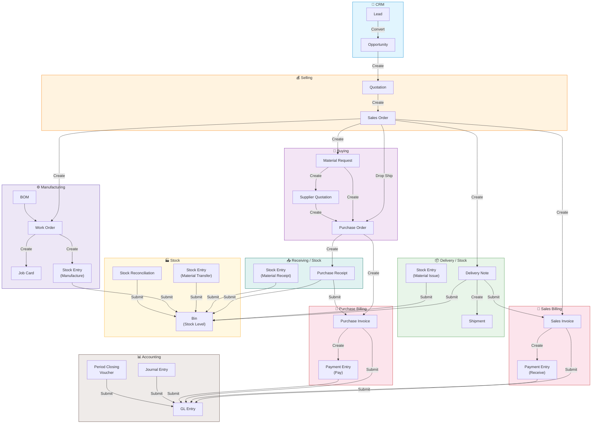
```mermaid
flowchart TB
    subgraph CRM["🎯 CRM"]
        Lead["Lead"]
        Opportunity["Opportunity"]
    end

    subgraph Selling["💰 Selling"]
        Quotation["Quotation"]
        SO["Sales Order"]
    end

    subgraph Delivery["📦 Delivery / Stock"]
        DN["Delivery Note"]
        SE_out["Stock Entry\n(Material Issue)"]
        Shipment["Shipment"]
    end

    subgraph Billing_Sales["🧾 Sales Billing"]
        SI["Sales Invoice"]
        PE_recv["Payment Entry\n(Receive)"]
    end

    subgraph Buying["🛒 Buying"]
        MR["Material Request"]
        SQ["Supplier Quotation"]
        PO["Purchase Order"]
    end

    subgraph Receiving["📥 Receiving / Stock"]
        PR["Purchase Receipt"]
        SE_in["Stock Entry\n(Material Receipt)"]
    end

    subgraph Billing_Purchase["🧾 Purchase Billing"]
        PI["Purchase Invoice"]
        PE_pay["Payment Entry\n(Pay)"]
    end

    subgraph Stock["🏭 Stock"]
        SE_transfer["Stock Entry\n(Material Transfer)"]
        SR["Stock Reconciliation"]
        BIN["Bin\n(Stock Level)"]
    end

    subgraph Manufacturing["⚙️ Manufacturing"]
        BOM["BOM"]
        WO["Work Order"]
        JC["Job Card"]
        SE_mfg["Stock Entry\n(Manufacture)"]
    end

    subgraph Accounting["📊 Accounting"]
        GL["GL Entry"]
        JE["Journal Entry"]
        PCV["Period Closing\nVoucher"]
    end

    %% CRM Flow
    Lead -->|Convert| Opportunity
    Opportunity -->|Create| Quotation

    %% Selling Flow
    Quotation -->|Create| SO
    SO -->|Create| DN
    SO -->|Create| SI
    SO -->|Create| MR
    SO -->|Create| WO
    SO -->|Drop Ship| PO

    %% Delivery Flow
    DN -->|Submit| SI
    DN -->|Create| Shipment

    %% Sales Billing
    SI -->|Submit| GL
    SI -->|Create| PE_recv
    PE_recv -->|Submit| GL

    %% Buying Flow
    MR -->|Create| SQ
    MR -->|Create| PO
    SQ -->|Create| PO
    PO -->|Create| PR
    PO -->|Create| PI

    %% Purchase Billing
    PR -->|Submit| PI
    PI -->|Submit| GL
    PI -->|Create| PE_pay
    PE_pay -->|Submit| GL

    %% Stock Updates
    DN -->|Submit| BIN
    PR -->|Submit| BIN
    SE_out -->|Submit| BIN
    SE_in -->|Submit| BIN
    SE_transfer -->|Submit| BIN
    SE_mfg -->|Submit| BIN
    SR -->|Submit| BIN

    %% Manufacturing Flow
    BOM --> WO
    WO -->|Create| JC
    WO -->|Create| SE_mfg

    %% Accounting
    JE -->|Submit| GL
    PCV -->|Submit| GL

    %% Styling
    style CRM fill:#e1f5fe,stroke:#0288d1
    style Selling fill:#fff3e0,stroke:#f57c00
    style Delivery fill:#e8f5e9,stroke:#388e3c
    style Billing_Sales fill:#fce4ec,stroke:#c62828
    style Buying fill:#f3e5f5,stroke:#7b1fa2
    style Receiving fill:#e0f2f1,stroke:#00695c
    style Billing_Purchase fill:#fce4ec,stroke:#c62828
    style Stock fill:#fff8e1,stroke:#f9a825
    style Manufacturing fill:#ede7f6,stroke:#512da8
    style Accounting fill:#efebe9,stroke:#4e342e
```

---

## 2. Document Lifecycle Cơ Bản (Mọi Submittable DocType)

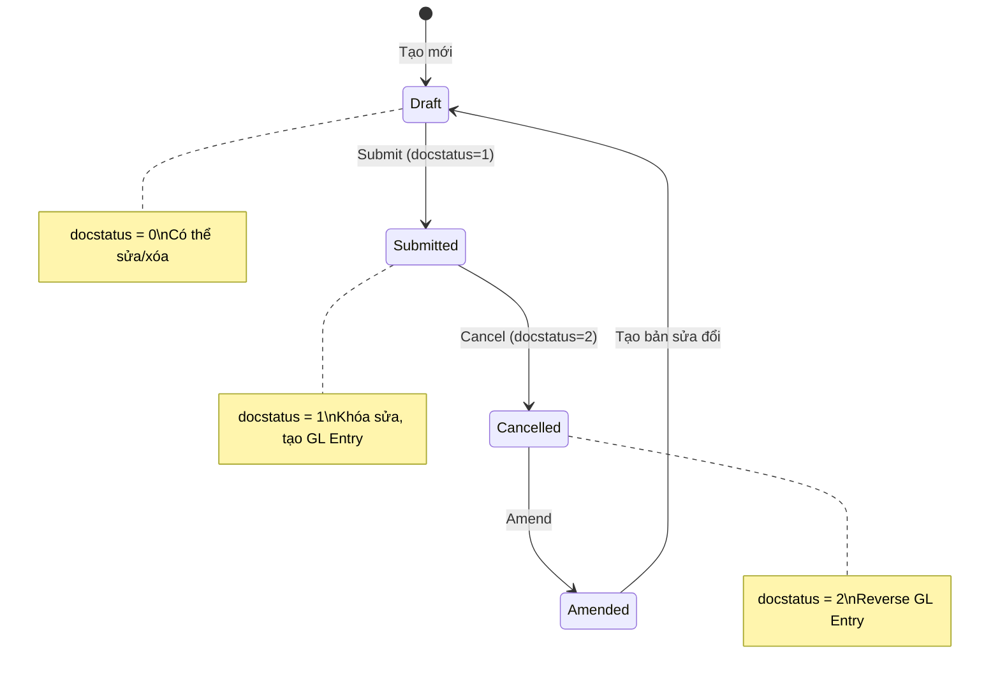
```mermaid
stateDiagram-v2
    [*] --> Draft : Tạo mới
    Draft --> Submitted : Submit (docstatus=1)
    Submitted --> Cancelled : Cancel (docstatus=2)
    Cancelled --> Amended : Amend
    Amended --> Draft : Tạo bản sửa đổi

    note right of Draft : docstatus = 0\nCó thể sửa/xóa
    note right of Submitted : docstatus = 1\nKhóa sửa, tạo GL Entry
    note right of Cancelled : docstatus = 2\nReverse GL Entry
```

---

## 3. CRM State Machine

### 3.1 Lead

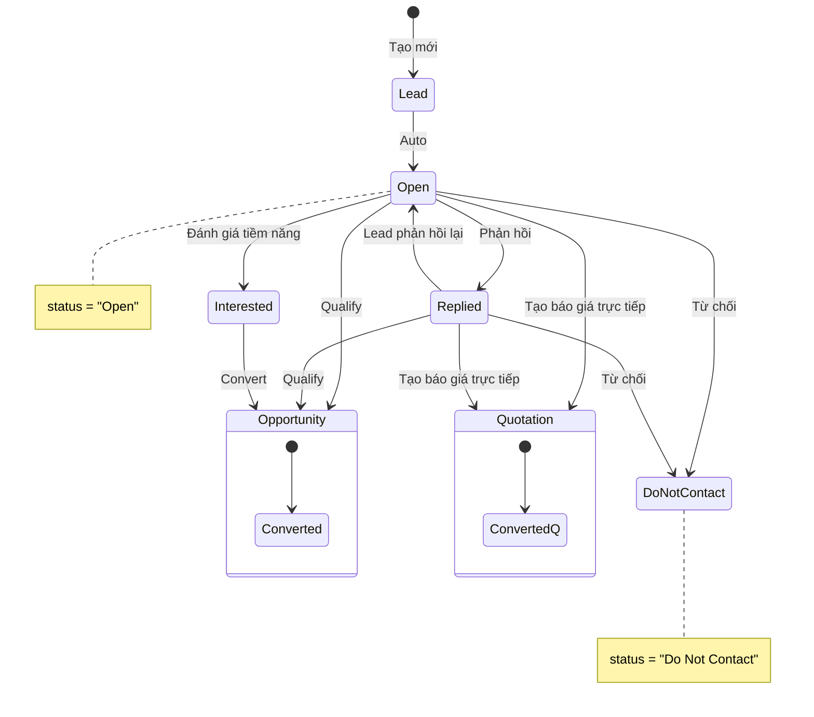
```mermaid
stateDiagram-v2
    [*] --> Lead : Tạo mới
    Lead --> Open : Auto
    Open --> Replied : Phản hồi
    Replied --> Open : Lead phản hồi lại
    Open --> Opportunity : Qualify
    Replied --> Opportunity : Qualify
    Open --> Interested : Đánh giá tiềm năng
    Interested --> Opportunity : Convert
    Open --> Quotation : Tạo báo giá trực tiếp
    Replied --> Quotation : Tạo báo giá trực tiếp

    Open --> DoNotContact : Từ chối
    Replied --> DoNotContact : Từ chối

    state Opportunity {
        [*] --> Converted
    }

    state Quotation {
        [*] --> ConvertedQ
    }

    note right of Open : status = "Open"
    note right of DoNotContact : status = "Do Not Contact"
```

### 3.2 Opportunity

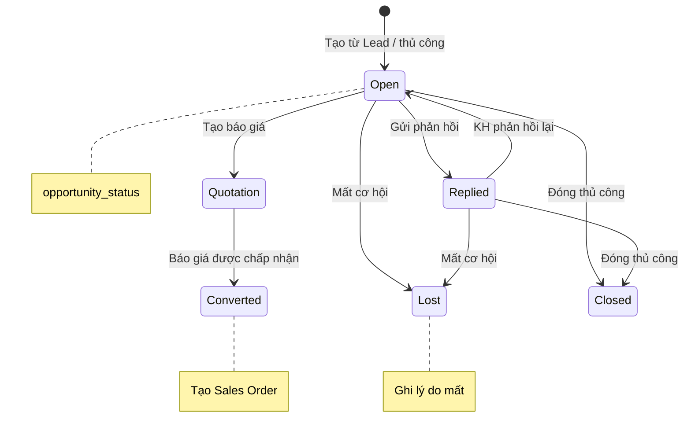
```mermaid
stateDiagram-v2
    [*] --> Open : Tạo từ Lead / thủ công
    Open --> Quotation : Tạo báo giá
    Open --> Replied : Gửi phản hồi
    Replied --> Open : KH phản hồi lại
    Quotation --> Converted : Báo giá được chấp nhận
    Open --> Lost : Mất cơ hội
    Replied --> Lost : Mất cơ hội
    Open --> Closed : Đóng thủ công
    Replied --> Closed : Đóng thủ công

    note right of Open : opportunity_status
    note right of Converted : Tạo Sales Order
    note right of Lost : Ghi lý do mất
```

---

## 4. Selling State Machine

### 4.1 Quotation

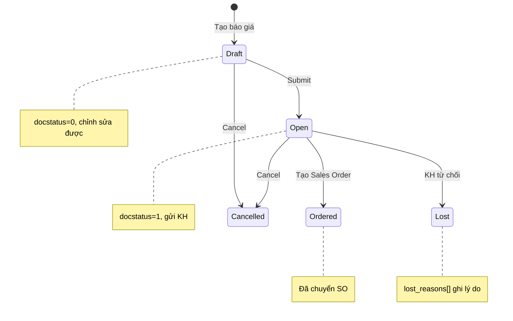
```mermaid
stateDiagram-v2
    [*] --> Draft : Tạo báo giá

    Draft --> Open : Submit
    Open --> Ordered : Tạo Sales Order
    Open --> Lost : KH từ chối
    Open --> Cancelled : Cancel

    Draft --> Cancelled : Cancel

    note right of Draft : docstatus=0, chỉnh sửa được
    note right of Open : docstatus=1, gửi KH
    note right of Ordered : Đã chuyển SO
    note right of Lost : lost_reasons[] ghi lý do
```

### 4.2 Sales Order ⭐ (Document phức tạp nhất)

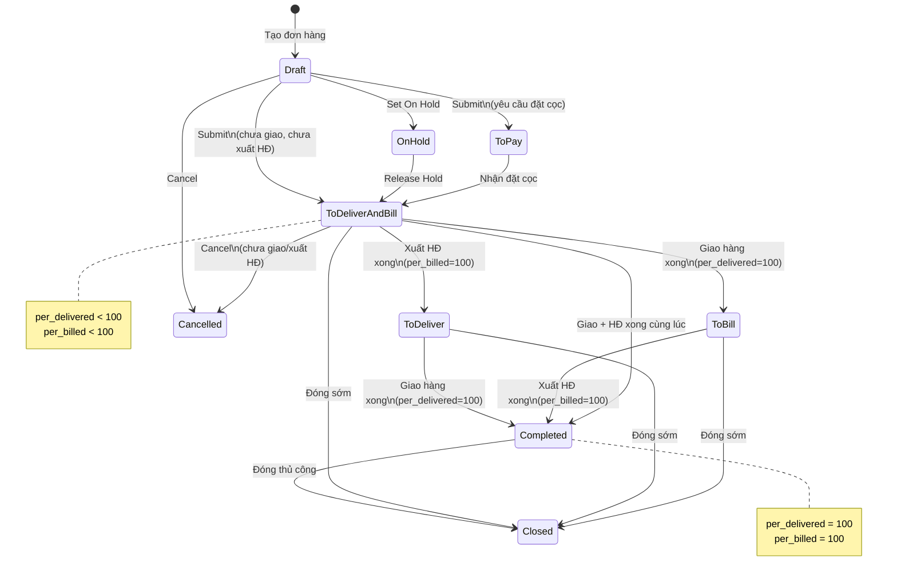
```mermaid
stateDiagram-v2
    [*] --> Draft : Tạo đơn hàng

    Draft --> ToDeliverAndBill : Submit\n(chưa giao, chưa xuất HĐ)
    Draft --> ToPay : Submit\n(yêu cầu đặt cọc)
    Draft --> OnHold : Set On Hold

    OnHold --> ToDeliverAndBill : Release Hold

    ToPay --> ToDeliverAndBill : Nhận đặt cọc

    ToDeliverAndBill --> ToDeliver : Xuất HĐ xong\n(per_billed=100)
    ToDeliverAndBill --> ToBill : Giao hàng xong\n(per_delivered=100)

    ToDeliver --> Completed : Giao hàng xong\n(per_delivered=100)
    ToBill --> Completed : Xuất HĐ xong\n(per_billed=100)

    ToDeliverAndBill --> Completed : Giao + HĐ xong cùng lúc

    Completed --> Closed : Đóng thủ công
    ToDeliverAndBill --> Closed : Đóng sớm
    ToDeliver --> Closed : Đóng sớm
    ToBill --> Closed : Đóng sớm

    Draft --> Cancelled : Cancel
    ToDeliverAndBill --> Cancelled : Cancel\n(chưa giao/xuất HĐ)

    note right of ToDeliverAndBill
        per_delivered < 100
        per_billed < 100
    end note

    note right of Completed
        per_delivered = 100
        per_billed = 100
    end note
```

**Công thức tính status:**

| Điều kiện | Status |
|-----------|--------|
| `advance_payment_status == "Requested"` | To Pay |
| `status == "On Hold"` | On Hold |
| `per_delivered < 100 AND per_billed < 100` | To Deliver and Bill |
| `per_delivered < 100` | To Deliver |
| `per_billed < 100` | To Bill |
| `per_delivered == 100 AND per_billed == 100` | Completed |

---

## 5. Stock State Machine

### 5.1 Delivery Note

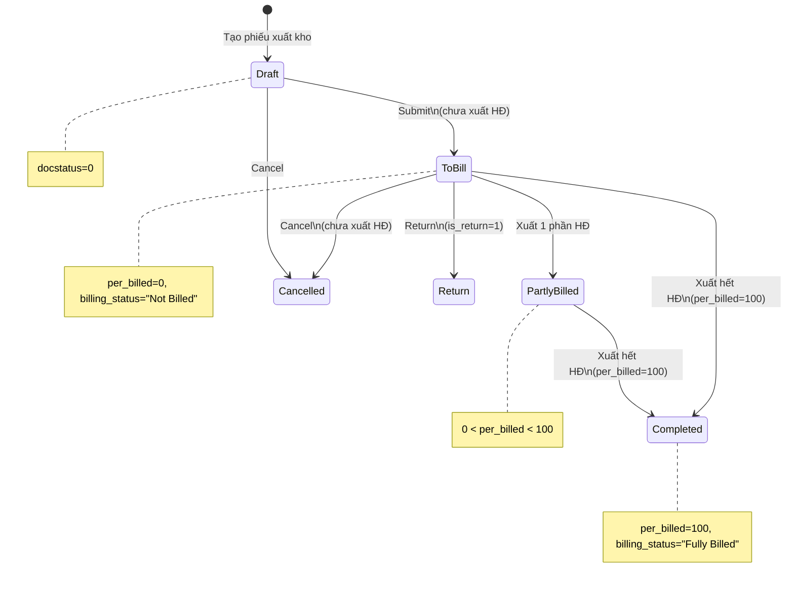
```mermaid
stateDiagram-v2
    [*] --> Draft : Tạo phiếu xuất kho

    Draft --> ToBill : Submit\n(chưa xuất HĐ)
    ToBill --> PartlyBilled : Xuất 1 phần HĐ
    PartlyBilled --> Completed : Xuất hết HĐ\n(per_billed=100)
    ToBill --> Completed : Xuất hết HĐ\n(per_billed=100)

    Draft --> Cancelled : Cancel
    ToBill --> Cancelled : Cancel\n(chưa xuất HĐ)

    ToBill --> Return : Return\n(is_return=1)

    note right of Draft : docstatus=0
    note right of ToBill : per_billed=0, billing_status="Not Billed"
    note right of PartlyBilled : 0 < per_billed < 100
    note right of Completed : per_billed=100, billing_status="Fully Billed"
```

### 5.2 Stock Entry (7 loại)

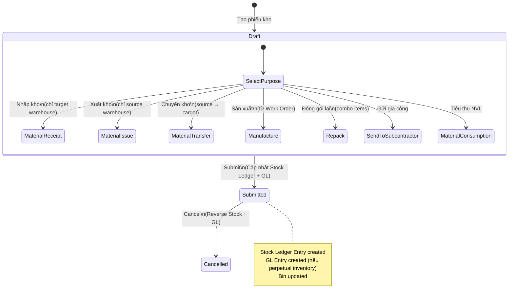
```mermaid
stateDiagram-v2
    [*] --> Draft : Tạo phiếu kho

    state Draft {
        [*] --> SelectPurpose

        SelectPurpose --> MaterialReceipt : Nhập kho\n(chỉ target warehouse)
        SelectPurpose --> MaterialIssue : Xuất kho\n(chỉ source warehouse)
        SelectPurpose --> MaterialTransfer : Chuyển kho\n(source → target)
        SelectPurpose --> Manufacture : Sản xuất\n(từ Work Order)
        SelectPurpose --> Repack : Đóng gói lại\n(combo items)
        SelectPurpose --> SendToSubcontractor : Gửi gia công
        SelectPurpose --> MaterialConsumption : Tiêu thụ NVL
    }

    Draft --> Submitted : Submit\n(Cập nhật Stock Ledger + GL)
    Submitted --> Cancelled : Cancel\n(Reverse Stock + GL)

    note right of Submitted
        Stock Ledger Entry created
        GL Entry created (nếu perpetual inventory)
        Bin updated
    end note
```

### 5.3 Purchase Receipt

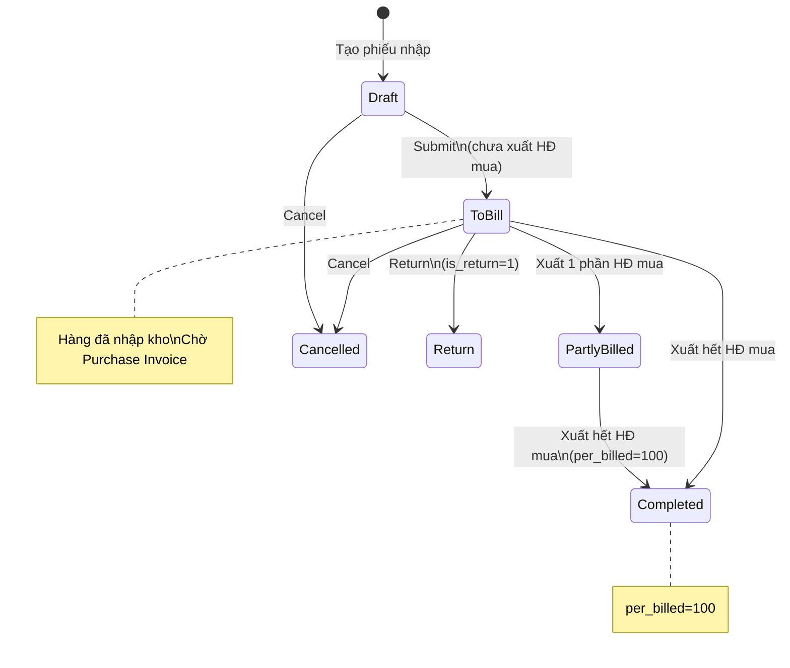
```mermaid
stateDiagram-v2
    [*] --> Draft : Tạo phiếu nhập

    Draft --> ToBill : Submit\n(chưa xuất HĐ mua)
    ToBill --> PartlyBilled : Xuất 1 phần HĐ mua
    PartlyBilled --> Completed : Xuất hết HĐ mua\n(per_billed=100)
    ToBill --> Completed : Xuất hết HĐ mua

    Draft --> Cancelled : Cancel
    ToBill --> Cancelled : Cancel

    ToBill --> Return : Return\n(is_return=1)

    note right of ToBill : Hàng đã nhập kho\nChờ Purchase Invoice
    note right of Completed : per_billed=100
```

---

## 6. Buying State Machine

### 6.1 Material Request

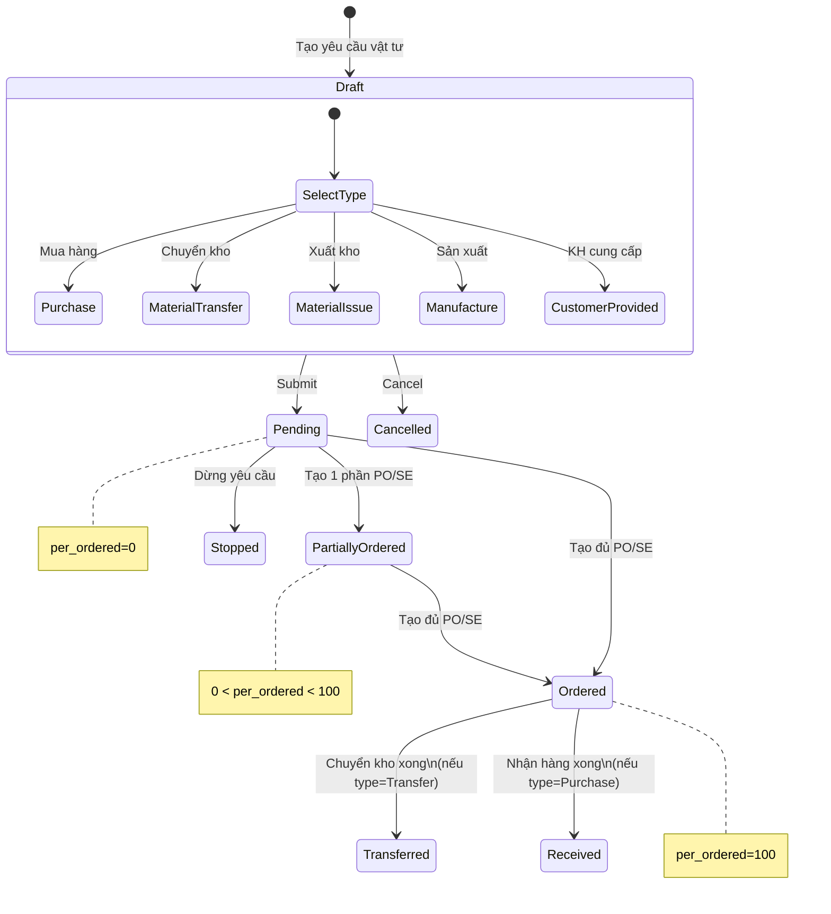
```mermaid
stateDiagram-v2
    [*] --> Draft : Tạo yêu cầu vật tư

    state Draft {
        [*] --> SelectType

        SelectType --> Purchase : Mua hàng
        SelectType --> MaterialTransfer : Chuyển kho
        SelectType --> MaterialIssue : Xuất kho
        SelectType --> Manufacture : Sản xuất
        SelectType --> CustomerProvided : KH cung cấp
    }

    Draft --> Pending : Submit
    Pending --> PartiallyOrdered : Tạo 1 phần PO/SE
    PartiallyOrdered --> Ordered : Tạo đủ PO/SE
    Pending --> Ordered : Tạo đủ PO/SE
    Ordered --> Transferred : Chuyển kho xong\n(nếu type=Transfer)
    Ordered --> Received : Nhận hàng xong\n(nếu type=Purchase)
    Pending --> Stopped : Dừng yêu cầu

    Draft --> Cancelled : Cancel

    note right of Pending : per_ordered=0
    note right of PartiallyOrdered : 0 < per_ordered < 100
    note right of Ordered : per_ordered=100
```

### 6.2 Purchase Order

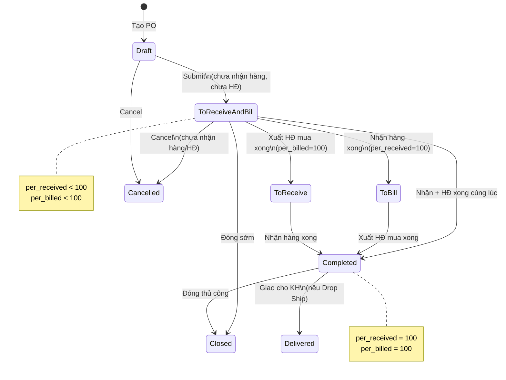
```mermaid
stateDiagram-v2
    [*] --> Draft : Tạo PO

    Draft --> ToReceiveAndBill : Submit\n(chưa nhận hàng, chưa HĐ)

    ToReceiveAndBill --> ToReceive : Xuất HĐ mua xong\n(per_billed=100)
    ToReceiveAndBill --> ToBill : Nhận hàng xong\n(per_received=100)

    ToReceive --> Completed : Nhận hàng xong
    ToBill --> Completed : Xuất HĐ mua xong

    ToReceiveAndBill --> Completed : Nhận + HĐ xong cùng lúc

    Completed --> Closed : Đóng thủ công
    ToReceiveAndBill --> Closed : Đóng sớm
    Completed --> Delivered : Giao cho KH\n(nếu Drop Ship)

    Draft --> Cancelled : Cancel
    ToReceiveAndBill --> Cancelled : Cancel\n(chưa nhận hàng/HĐ)

    note right of ToReceiveAndBill
        per_received < 100
        per_billed < 100
    end note

    note right of Completed
        per_received = 100
        per_billed = 100
    end note
```

---

## 7. Accounting State Machine

### 7.1 Sales Invoice ⭐

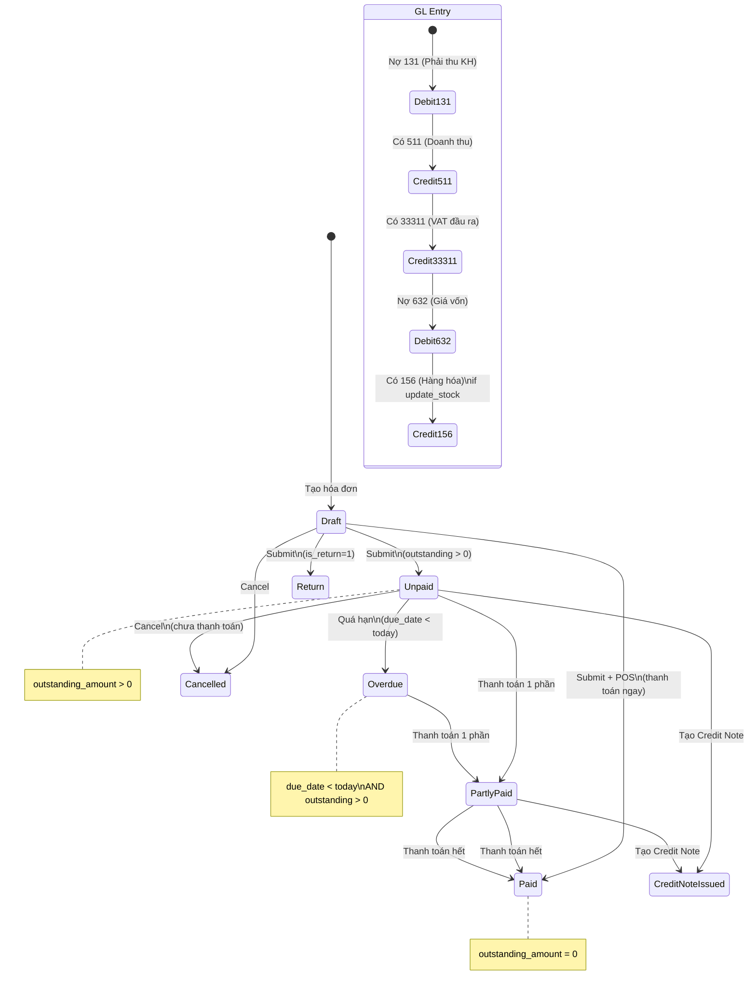
```mermaid
stateDiagram-v2
    [*] --> Draft : Tạo hóa đơn

    Draft --> Unpaid : Submit\n(outstanding > 0)
    Draft --> Paid : Submit + POS\n(thanh toán ngay)
    Draft --> Return : Submit\n(is_return=1)

    Unpaid --> PartlyPaid : Thanh toán 1 phần
    PartlyPaid --> Paid : Thanh toán hết

    Unpaid --> Overdue : Quá hạn\n(due_date < today)
    Overdue --> PartlyPaid : Thanh toán 1 phần
    PartlyPaid --> Paid : Thanh toán hết

    Unpaid --> CreditNoteIssued : Tạo Credit Note
    PartlyPaid --> CreditNoteIssued : Tạo Credit Note

    Draft --> Cancelled : Cancel
    Unpaid --> Cancelled : Cancel\n(chưa thanh toán)

    state "GL Entry" as GLE {
        [*] --> Debit131 : Nợ 131 (Phải thu KH)
        Debit131 --> Credit511 : Có 511 (Doanh thu)
        Credit511 --> Credit33311 : Có 33311 (VAT đầu ra)
        Credit33311 --> Debit632 : Nợ 632 (Giá vốn)
        Debit632 --> Credit156 : Có 156 (Hàng hóa)\nif update_stock
    }

    note right of Unpaid : outstanding_amount > 0
    note right of Paid : outstanding_amount = 0
    note right of Overdue : due_date < today\nAND outstanding > 0
```

### 7.2 Purchase Invoice

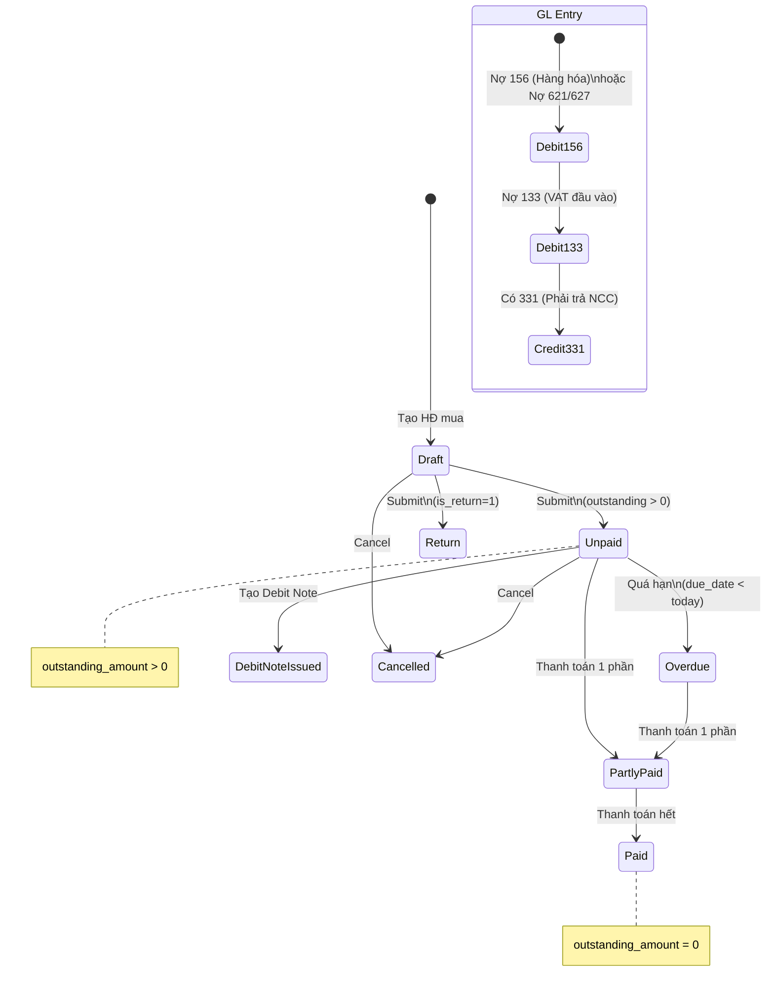
```mermaid
stateDiagram-v2
    [*] --> Draft : Tạo HĐ mua

    Draft --> Unpaid : Submit\n(outstanding > 0)
    Draft --> Return : Submit\n(is_return=1)

    Unpaid --> PartlyPaid : Thanh toán 1 phần
    PartlyPaid --> Paid : Thanh toán hết

    Unpaid --> Overdue : Quá hạn\n(due_date < today)
    Overdue --> PartlyPaid : Thanh toán 1 phần

    Unpaid --> DebitNoteIssued : Tạo Debit Note

    Draft --> Cancelled : Cancel
    Unpaid --> Cancelled : Cancel

    state "GL Entry" as GLE2 {
        [*] --> Debit156 : Nợ 156 (Hàng hóa)\nhoặc Nợ 621/627
        Debit156 --> Debit133 : Nợ 133 (VAT đầu vào)
        Debit133 --> Credit331 : Có 331 (Phải trả NCC)
    }

    note right of Unpaid : outstanding_amount > 0
    note right of Paid : outstanding_amount = 0
```

### 7.3 Payment Entry

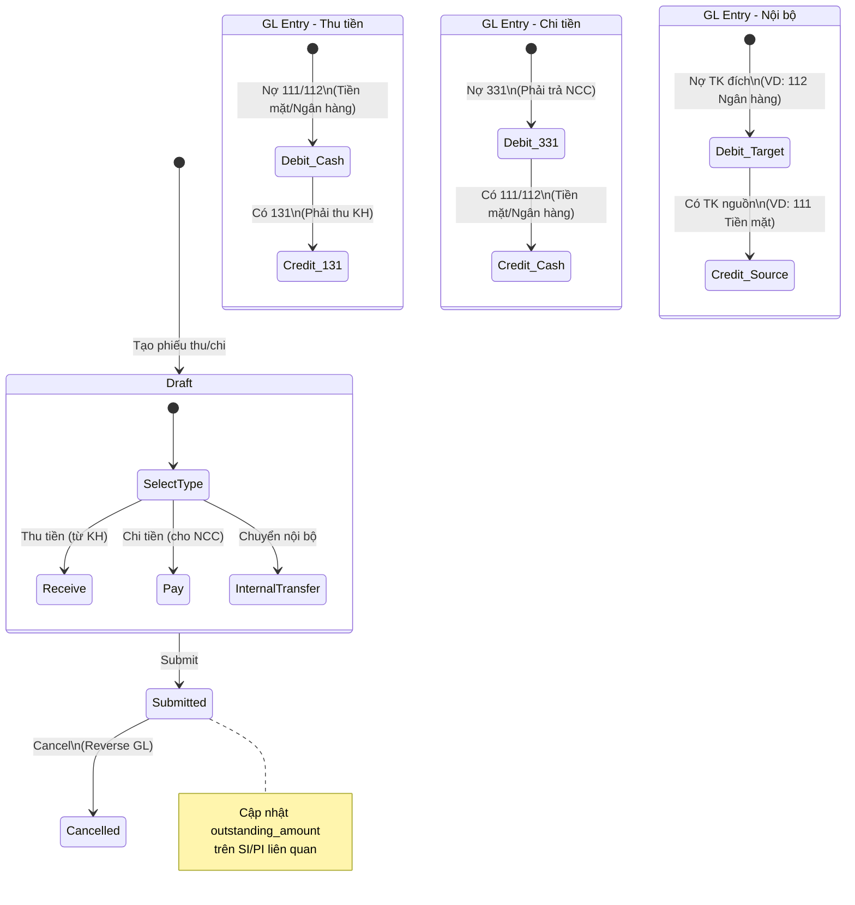
```mermaid
stateDiagram-v2
    [*] --> Draft : Tạo phiếu thu/chi

    state Draft {
        [*] --> SelectType

        SelectType --> Receive : Thu tiền (từ KH)
        SelectType --> Pay : Chi tiền (cho NCC)
        SelectType --> InternalTransfer : Chuyển nội bộ
    }

    Draft --> Submitted : Submit

    state "GL Entry - Thu tiền" as GL_Receive {
        [*] --> Debit_Cash : Nợ 111/112\n(Tiền mặt/Ngân hàng)
        Debit_Cash --> Credit_131 : Có 131\n(Phải thu KH)
    }

    state "GL Entry - Chi tiền" as GL_Pay {
        [*] --> Debit_331 : Nợ 331\n(Phải trả NCC)
        Debit_331 --> Credit_Cash : Có 111/112\n(Tiền mặt/Ngân hàng)
    }

    state "GL Entry - Nội bộ" as GL_Internal {
        [*] --> Debit_Target : Nợ TK đích\n(VD: 112 Ngân hàng)
        Debit_Target --> Credit_Source : Có TK nguồn\n(VD: 111 Tiền mặt)
    }

    Submitted --> Cancelled : Cancel\n(Reverse GL)

    note right of Submitted
        Cập nhật outstanding_amount
        trên SI/PI liên quan
    end note
```

### 7.4 Journal Entry

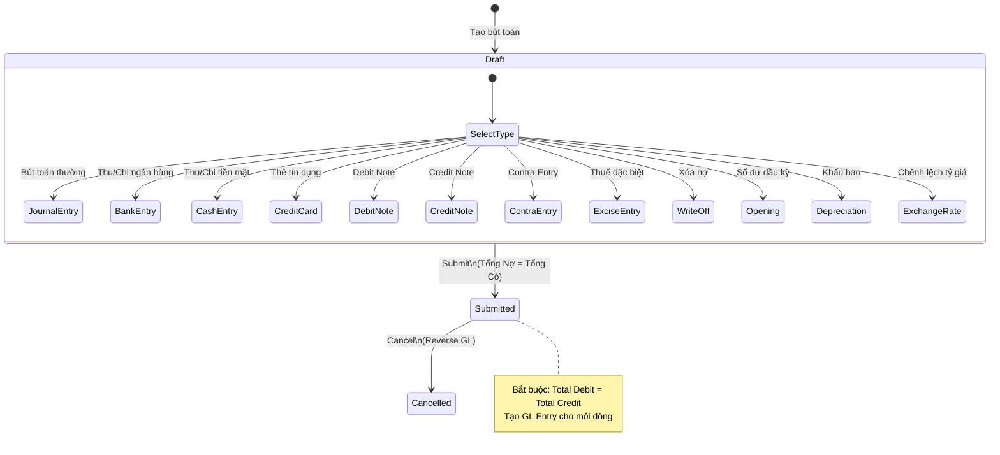
```mermaid
stateDiagram-v2
    [*] --> Draft : Tạo bút toán

    state Draft {
        [*] --> SelectType

        SelectType --> JournalEntry : Bút toán thường
        SelectType --> BankEntry : Thu/Chi ngân hàng
        SelectType --> CashEntry : Thu/Chi tiền mặt
        SelectType --> CreditCard : Thẻ tín dụng
        SelectType --> DebitNote : Debit Note
        SelectType --> CreditNote : Credit Note
        SelectType --> ContraEntry : Contra Entry
        SelectType --> ExciseEntry : Thuế đặc biệt
        SelectType --> WriteOff : Xóa nợ
        SelectType --> Opening : Số dư đầu kỳ
        SelectType --> Depreciation : Khấu hao
        SelectType --> ExchangeRate : Chênh lệch tỷ giá
    }

    Draft --> Submitted : Submit\n(Tổng Nợ = Tổng Có)
    Submitted --> Cancelled : Cancel\n(Reverse GL)

    note right of Submitted
        Bắt buộc: Total Debit = Total Credit
        Tạo GL Entry cho mỗi dòng
    end note
```

---

## 8. Manufacturing State Machine

### 8.1 Work Order

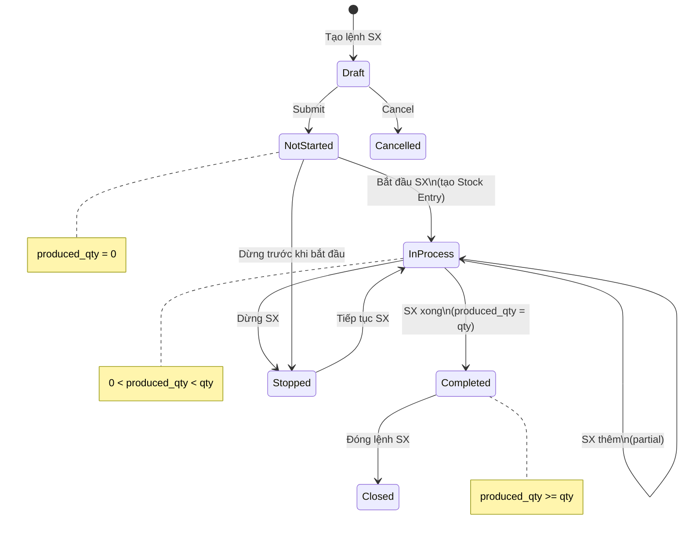
```mermaid
stateDiagram-v2
    [*] --> Draft : Tạo lệnh SX

    Draft --> NotStarted : Submit
    NotStarted --> InProcess : Bắt đầu SX\n(tạo Stock Entry)
    InProcess --> InProcess : SX thêm\n(partial)
    InProcess --> Completed : SX xong\n(produced_qty = qty)
    InProcess --> Stopped : Dừng SX

    NotStarted --> Stopped : Dừng trước khi bắt đầu
    Stopped --> InProcess : Tiếp tục SX
    Completed --> Closed : Đóng lệnh SX

    Draft --> Cancelled : Cancel

    note right of NotStarted : produced_qty = 0
    note right of InProcess : 0 < produced_qty < qty
    note right of Completed : produced_qty >= qty
```

### 8.2 Job Card

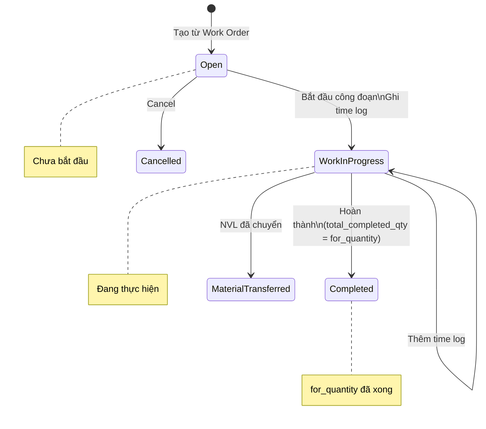
```mermaid
stateDiagram-v2
    [*] --> Open : Tạo từ Work Order

    Open --> WorkInProgress : Bắt đầu công đoạn\nGhi time log
    WorkInProgress --> WorkInProgress : Thêm time log
    WorkInProgress --> Completed : Hoàn thành\n(total_completed_qty = for_quantity)
    WorkInProgress --> MaterialTransferred : NVL đã chuyển

    Open --> Cancelled : Cancel

    note right of Open : Chưa bắt đầu
    note right of WorkInProgress : Đang thực hiện
    note right of Completed : for_quantity đã xong
```

---

## 9. Luồng GL Entry Tổng Hợp (Perpetual Inventory)

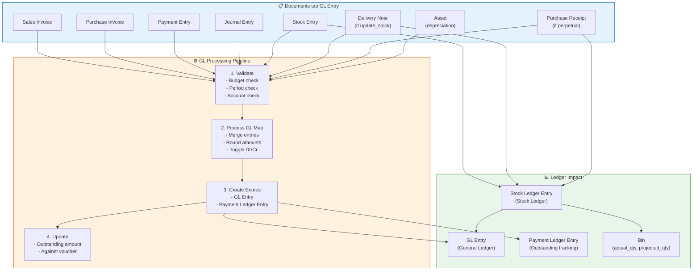
```mermaid
flowchart TB
    subgraph Trigger["📋 Documents tạo GL Entry"]
        SI["Sales Invoice"]
        PI["Purchase Invoice"]
        PE["Payment Entry"]
        JE["Journal Entry"]
        SE["Stock Entry"]
        DN_stock["Delivery Note\n(if update_stock)"]
        PR_stock["Purchase Receipt\n(if perpetual)"]
        ASSET["Asset\n(depreciation)"]
    end

    subgraph Pipeline["⚙️ GL Processing Pipeline"]
        Validate["1. Validate\n- Budget check\n- Period check\n- Account check"]
        Process["2. Process GL Map\n- Merge entries\n- Round amounts\n- Toggle Dr/Cr"]
        Create["3. Create Entries\n- GL Entry\n- Payment Ledger Entry"]
        Update["4. Update\n- Outstanding amount\n- Against voucher"]
    end

    subgraph Ledgers["📊 Ledger Impact"]
        GL_table["GL Entry\n(General Ledger)"]
        SLE["Stock Ledger Entry\n(Stock Ledger)"]
        PLE["Payment Ledger Entry\n(Outstanding tracking)"]
        BIN_update["Bin\n(actual_qty, projected_qty)"]
    end

    SI --> Validate
    PI --> Validate
    PE --> Validate
    JE --> Validate
    SE --> Validate
    DN_stock --> Validate
    PR_stock --> Validate
    ASSET --> Validate

    Validate --> Process --> Create --> Update

    Create --> GL_table
    Create --> PLE

    SE --> SLE
    DN_stock --> SLE
    PR_stock --> SLE

    SLE --> BIN_update
    SLE --> GL_table

    style Trigger fill:#e3f2fd,stroke:#1565c0
    style Pipeline fill:#fff3e0,stroke:#e65100
    style Ledgers fill:#e8f5e9,stroke:#2e7d32
```

---

## 10. Status Updater Pattern (Cross-Document Tracking)

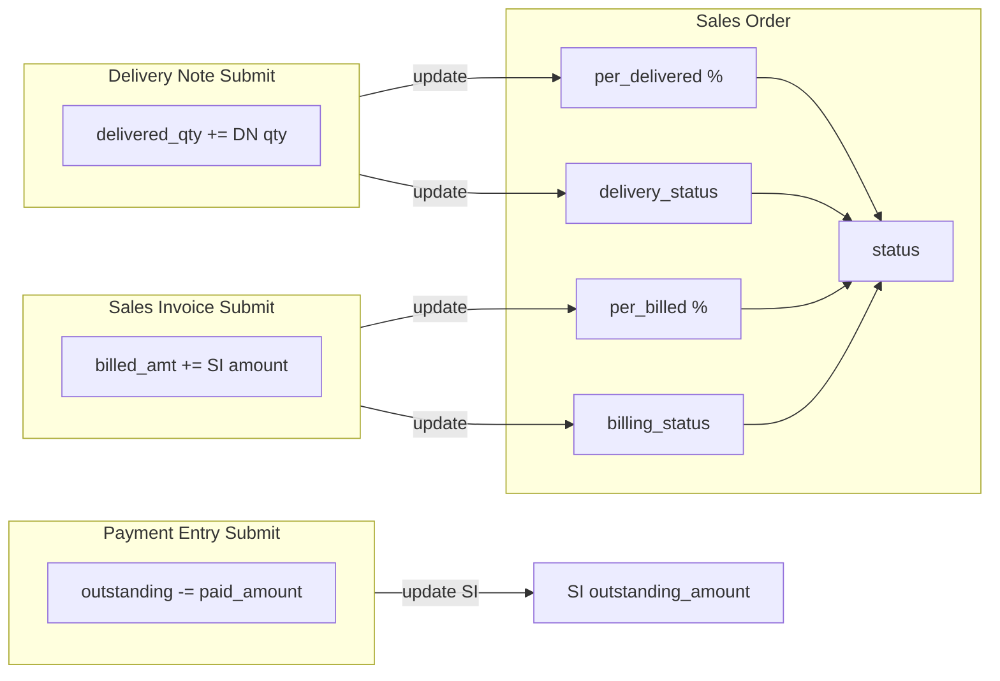
```mermaid
flowchart LR
    subgraph SO_Fields["Sales Order"]
        SO_per_delivered["per_delivered %"]
        SO_per_billed["per_billed %"]
        SO_delivery_status["delivery_status"]
        SO_billing_status["billing_status"]
        SO_status["status"]
    end

    subgraph DN_Impact["Delivery Note Submit"]
        DN_qty["delivered_qty += DN qty"]
    end

    subgraph SI_Impact["Sales Invoice Submit"]
        SI_amt["billed_amt += SI amount"]
    end

    subgraph PE_Impact["Payment Entry Submit"]
        PE_amt["outstanding -= paid_amount"]
    end

    DN_Impact -->|update| SO_per_delivered
    DN_Impact -->|update| SO_delivery_status
    SI_Impact -->|update| SO_per_billed
    SI_Impact -->|update| SO_billing_status

    SO_per_delivered --> SO_status
    SO_per_billed --> SO_status
    SO_delivery_status --> SO_status
    SO_billing_status --> SO_status

    PE_Impact -->|update SI| SI_outstanding["SI outstanding_amount"]
```

**Bảng tính status tự động:**

| per_delivered | per_billed | Status |
|:---:|:---:|---|
| 0 | 0 | To Deliver and Bill |
| 0-99 | 100 | To Deliver |
| 100 | 0-99 | To Bill |
| 100 | 100 | Completed |

---

## 11. Luồng End-to-End Hoàn Chỉnh

### 11.1 Bán Buôn (B2B Standard)

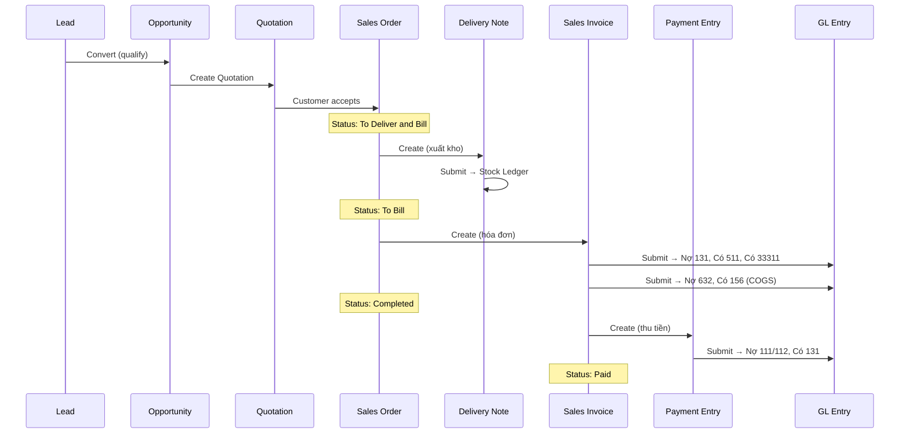
```mermaid
sequenceDiagram
    participant L as Lead
    participant O as Opportunity
    participant Q as Quotation
    participant SO as Sales Order
    participant DN as Delivery Note
    participant SI as Sales Invoice
    participant PE as Payment Entry
    participant GL as GL Entry

    L->>O: Convert (qualify)
    O->>Q: Create Quotation
    Q->>SO: Customer accepts

    Note over SO: Status: To Deliver and Bill

    SO->>DN: Create (xuất kho)
    DN->>DN: Submit → Stock Ledger

    Note over SO: Status: To Bill

    SO->>SI: Create (hóa đơn)
    SI->>GL: Submit → Nợ 131, Có 511, Có 33311
    SI->>GL: Submit → Nợ 632, Có 156 (COGS)

    Note over SO: Status: Completed

    SI->>PE: Create (thu tiền)
    PE->>GL: Submit → Nợ 111/112, Có 131

    Note over SI: Status: Paid
```

### 11.2 Bán Lẻ POS

```mermaid
sequenceDiagram
    participant POS as POS Interface
    participant SI as Sales Invoice
    participant Stock as Stock Ledger
    participant GL as GL Entry

    POS->>SI: Tạo SI (is_pos=1, update_stock=1)
    SI->>Stock: Submit → Trừ kho trực tiếp
    SI->>GL: Nợ 131/111, Có 511, Có 33311
    SI->>GL: Nợ 632, Có 156 (COGS)

    Note over SI: Thanh toán ngay tại POS
    SI->>GL: Nợ 111 (Tiền mặt), Có 131

    Note over SI: Status: Paid
    Note over SI: Không cần SO, DN
```

### 11.3 Mua Hàng (Full Flow)

```mermaid
sequenceDiagram
    participant MR as Material Request
    participant SQ as Supplier Quotation
    participant PO as Purchase Order
    participant PR as Purchase Receipt
    participant PI as Purchase Invoice
    participant PE as Payment Entry
    participant GL as GL Entry

    MR->>SQ: Request for Quotation
    SQ->>PO: Chọn NCC tốt nhất

    Note over PO: Status: To Receive and Bill

    PO->>PR: Nhận hàng (nhập kho)
    PR->>PR: Submit → Stock Ledger

    Note over PO: Status: To Bill

    PO->>PI: Tạo HĐ mua
    PI->>GL: Submit → Nợ 156, Nợ 133, Có 331

    Note over PO: Status: Completed

    PI->>PE: Chi tiền cho NCC
    PE->>GL: Submit → Nợ 331, Có 111/112

    Note over PI: Status: Paid
```

---

## 12. Tổng Hợp Status Theo DocType

| DocType | Statuses | Trigger |
|---------|----------|---------|
| **Lead** | Open, Replied, Opportunity, Quotation, Converted, Do Not Contact | Manual + auto |
| **Opportunity** | Open, Replied, Quotation, Converted, Lost, Closed | Manual + auto |
| **Quotation** | Draft, Open, Ordered, Lost, Cancelled | Submit + SO creation |
| **Sales Order** | Draft, On Hold, To Pay, To Deliver and Bill, To Deliver, To Bill, Completed, Closed, Cancelled | Submit + % tracking |
| **Delivery Note** | Draft, To Bill, Partly Billed, Completed, Return, Cancelled | Submit + SI linking |
| **Sales Invoice** | Draft, Unpaid, Partly Paid, Paid, Overdue, Credit Note Issued, Return, Cancelled | Submit + PE linking |
| **Material Request** | Draft, Pending, Partially Ordered, Ordered, Transferred, Received, Stopped, Cancelled | Submit + PO/SE |
| **Purchase Order** | Draft, To Receive and Bill, To Receive, To Bill, Completed, Delivered, Closed, Cancelled | Submit + % tracking |
| **Purchase Receipt** | Draft, To Bill, Partly Billed, Completed, Return, Cancelled | Submit + PI linking |
| **Purchase Invoice** | Draft, Unpaid, Partly Paid, Paid, Overdue, Debit Note Issued, Return, Cancelled | Submit + PE linking |
| **Payment Entry** | Draft, Submitted, Cancelled | Submit only |
| **Journal Entry** | Draft, Submitted, Cancelled | Submit only |
| **Stock Entry** | Draft, Submitted, Cancelled | Submit only |
| **Work Order** | Draft, Not Started, In Process, Completed, Stopped, Closed, Cancelled | Submit + SE |
| **Job Card** | Open, Work In Progress, Completed, Material Transferred, Cancelled | Time logs |
| **BOM** | Draft, Submitted, Cancelled | Submit only |

---

## 13. Accounting Period & Closing

```mermaid
stateDiagram-v2
    [*] --> OpenPeriod : Tạo Accounting Period

    state OpenPeriod {
        [*] --> Active
        Active : Cho phép tạo GL Entry
        Active : Cho phép submit documents
    }

    OpenPeriod --> ClosedPeriod : Period Closing Voucher

    state ClosedPeriod {
        [*] --> Locked
        Locked : Block tạo GL Entry
        Locked : Block submit documents
        Locked : P/L → Retained Earnings
    }

    ClosedPeriod --> OpenPeriod : Reopen\n(cancel PCV)

    note right of ClosedPeriod
        PCV tạo GL:
        Nợ: Revenue accounts (về 0)
        Có: Expense accounts (về 0)
        Net → 421 (Lợi nhuận chưa phân phối)
    end note
```

---

> **Tài liệu tham khảo:**
> - `docs/erpnext-flows/SALES_ORDER_ECOSYSTEM_WORKFLOW.md`
> - `docs/erpnext-flows/ACCOUNTING_WORKFLOW.md`
> - `docs/erpnext-flows/SELLING_MODULE_WORKFLOW.md`
> - `docs/erpnext-flows/LEAD_TO_SALES_ORDER_WORKFLOW.md`
> - `dcnet_core/erpnext/selling/doctype/sales_order/sales_order.py`
> - `dcnet_core/erpnext/accounts/doctype/sales_invoice/sales_invoice.py`
> - `dcnet_core/erpnext/accounts/general_ledger.py`
