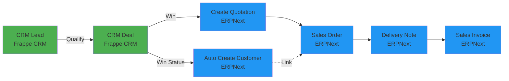
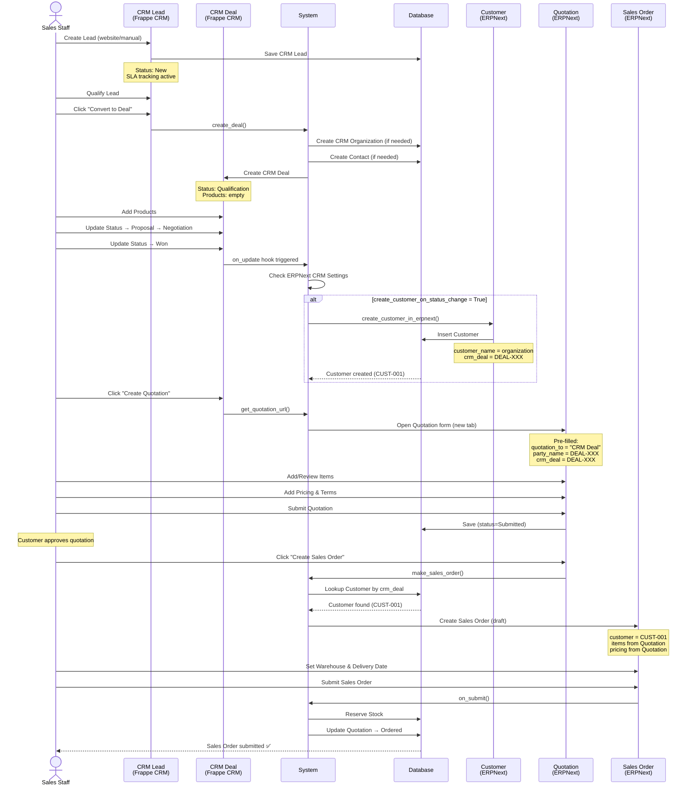
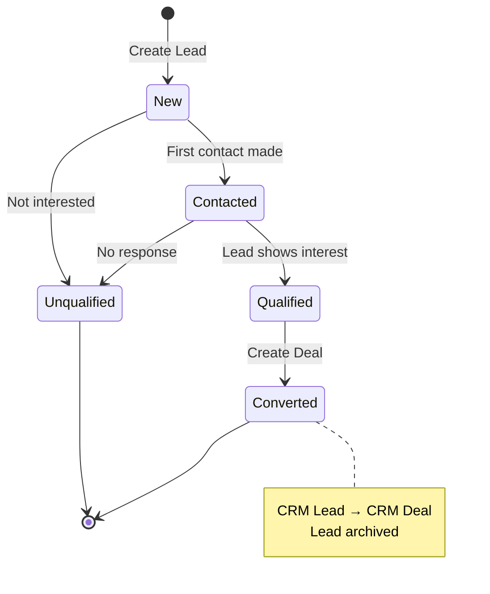
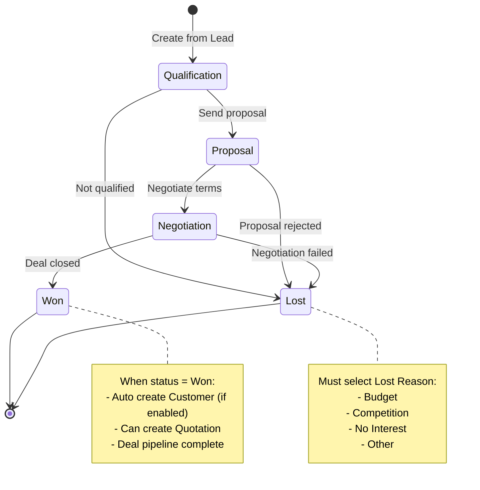
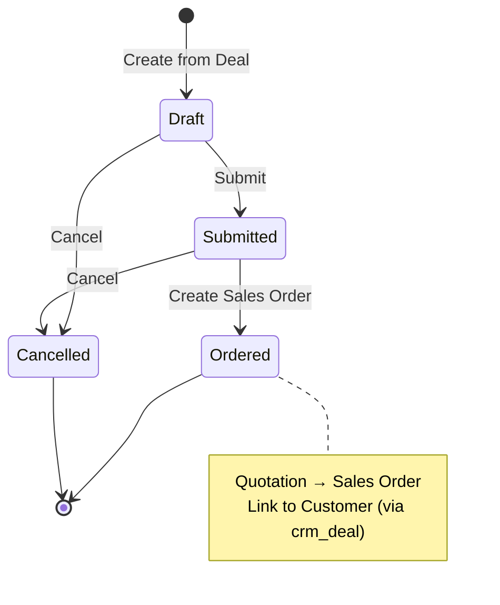
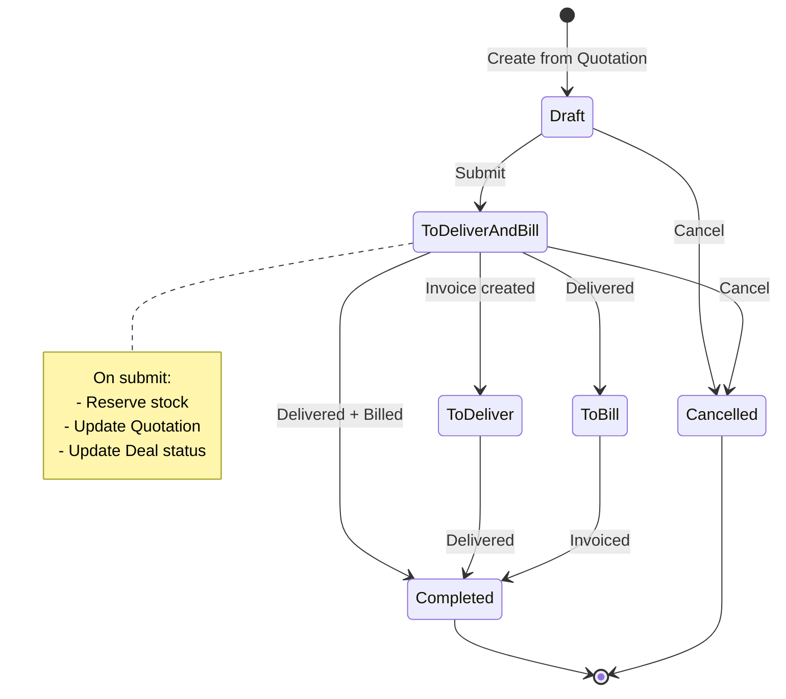

# Frappe CRM: Complete Analysis & Implementation Guide

**Ngày:** 13/01/2026
**Dự án:** DCNET Flow
**Version:** 3.0 - Merged (Business + Technical)
**Status:** ✅ APPROVED - Using Frappe CRM

---

## ⚠️ IMPORTANT: Architecture Decision

**Dự án DCNET Flow sử dụng FRAPPE CRM (không dùng ERPNext CRM cũ)**

- ✅ **CRM Layer:** Frappe CRM (`dcnet_crm/crm`) - Modern Vue.js UI
- ✅ **ERP Layer:** ERPNext (`dcnet_core/erpnext`) - Sales, Stock, Accounting
- ✅ **Integration:** Built-in via `erpnext_crm_settings`
- ✅ **Decision Date:** 13/01/2026
- ✅ **Rationale:** 95% features có sẵn, tiết kiệm 40% effort, modern UX

---

## 📋 Table of Contents

### PART 1: BUSINESS CONTEXT & DECISION RATIONALE

1. [Executive Summary](#part-1-executive-summary)
2. [Requirements vs Frappe CRM Features](#part-1-2-requirements-mapping)
3. [Gap Analysis](#part-1-3-gap-analysis)
4. [Pros & Cons Analysis](#part-1-4-pros--cons)
5. [Implementation Roadmap](#part-1-5-implementation-roadmap)
6. [Effort Estimation & ROI](#part-1-6-effort-estimation)
7. [Final Recommendation](#part-1-7-final-recommendation)

### PART 2: TECHNICAL IMPLEMENTATION GUIDE

8. [Workflow Overview](#part-2-1-workflow-overview)
9. [Step-by-Step Implementation](#part-2-2-step-by-step-implementation)
10. [Data Mapping](#part-2-3-data-mapping)
11. [Sequence Diagrams](#part-2-4-sequence-diagrams)
12. [State Machines](#part-2-5-state-machines)
13. [Integration Points](#part-2-6-integration-points)
14. [Code References](#part-2-7-code-references)
15. [Best Practices](#part-2-8-best-practices)
16. [Troubleshooting](#part-2-9-troubleshooting)

---

# PART 1: BUSINESS CONTEXT & DECISION RATIONALE

---

## Part 1.1: Executive Summary

### ✅ Khuyến nghị: DÙNG FRAPPE CRM

**Kết luận:**
- **Mức độ phù hợp:** 95% requirements CRM có sẵn trong Frappe CRM
- **Custom development:** ~5% (chủ yếu là tùy chỉnh UI và business logic)
- **Integration với ERPNext:** Đầy đủ, đã có sẵn mechanism
- **Effort tiết kiệm:** ~40% so với develop từ đầu trên ERPNext CRM

**Key Metrics:**

| Metric | Value |
| --- | --- |
| **Requirements Match** | 95% có sẵn |
| **Development Effort** | 90 MD (vs 150 MD nếu develop từ đầu) |
| **Time Savings** | 40% faster to market |
| **Modern UI/UX** | Vue.js Frappe UI (10x better than Desk) |
| **Future-proof** | Active development by Frappe team |

---

## Part 1.2: Requirements Mapping

### 1.2.1. Quản lý Lead (FEATURE_SPECIFICATION.md Section 3)

| Requirement | Frappe CRM | Status | Note |
| --- | --- | --- | --- |
| **3.1. Danh sách Lead** |  |  |  |
| Mã khách hàng | ✅ | Có sẵn | `naming_series`: CRM-LEAD-.YYYY.- |
| Tên, ĐT, Email | ✅ | Có sẵn | `first_name`, `last_name`, `mobile_no`, `email` |
| Trạng thái | ✅ | Có sẵn | `status` (link CRM Lead Status) - customizable |
| Tags | ✅ | Có sẵn | Frappe framework tags |
| Thời gian tạo | ✅ | Có sẵn | `creation`, `modified` |
| Liên hệ lần cuối | ✅ | Có sẵn | `last_responded_on` |
| Tổng số tương tác | ⚠️ | Cần tính | Có `rolling_responses` table nhưng cần custom field |
| Người tạo | ✅ | Có sẵn | `owner` |
| Nguồn lead | ✅ | Có sẵn | `source` (link CRM Lead Source) |
| Chi nhánh | ✅ | Có sẵn | `territory` (có thể map) |
| Địa chỉ | ⚠️ | Cần custom | Chưa có fields Tỉnh/Quận/Phường |
| Giới tính | ✅ | Có sẵn | `gender` |
| Ẩn/hiện cột | ✅ | Có sẵn | CRM Fields Layout |
| Cập nhật tags | ✅ | Có sẵn | Native Frappe tags |
| Search/Filter | ✅ | Có sẵn | Advanced filters + Quick Filters |
| **3.2. Tạo Lead** |  |  |  |
| Thông tin cơ bản | ✅ | Có sẵn | Đầy đủ fields |
| Check trùng thông tin | ⚠️ | Cần custom | Cần validation script |
| Nhân viên phụ trách | ✅ | Có sẵn | `lead_owner` |
| Bảng giá áp dụng | ❌ | Cần custom | Frappe CRM không có, cần thêm custom field |
| Sale chăm sóc | ✅ | Có sẵn | `lead_owner` |
| **3.3. Import Lead** | ✅ | Có sẵn | Native import from Excel |
| **3.4. Xem chi tiết Lead** |  |  |  |
| Lịch sử giao dịch | ⚠️ | Cần link | Link qua ERPNext Customer |
| Hàng hóa đã mua | ⚠️ | Cần link | Link qua ERPNext Sales Order |
| Tài liệu đi kèm | ✅ | Có sẵn | Attach files |
| Lịch sử tư vấn | ⚠️ | Cần custom | Có `fcrm_note` nhưng cần customize |
| Bình luận | ✅ | Có sẵn | Native comments với hoạt động tracking |
| **3.5. Action: Tạo đơn hàng** | ⚠️ | Via integration | Lead → Deal → Quotation → Sales Order |
| **3.7. Auto tạo Lead** | ✅ | Có sẵn | Lead syncing (Facebook, webhook) |
| **3.8. Export Lead** | ✅ | Có sẵn | Native export to Excel |
| **3.9. API tạo khách hàng** | ✅ | Có sẵn | Frappe REST API |

**Summary Section 3:**
- ✅ Có sẵn: 85%
- ⚠️ Cần customize: 15%
- ❌ Thiếu hoàn toàn: 0%

---

### 1.2.2. Quản lý Khách hàng (Section 4)

| Requirement | Solution | Status | Note |
| --- | --- | --- | --- |
| **4.1. Danh sách KH** | ERPNext Customer | ✅ | Frappe CRM tạo Customer trong ERPNext |
| Mã KH, Tên, ĐT, Email | ERPNext Customer | ✅ | Auto sync from CRM Deal |
| Tags | ERPNext Customer | ✅ | Native tags |
| Loại KH (Lẻ/Sỉ) | ERPNext Customer | ✅ | `customer_type` |
| Bảng giá áp dụng | ERPNext Customer | ✅ | `default_price_list` |
| Người phụ trách | ERPNext Customer | ✅ | `account_manager` |
| Công nợ | ERPNext Customer | ✅ | Native accounting |
| Doanh số phát sinh | ERPNext Customer | ✅ | From Sales Invoices |
| **4.2. Chi tiết KH** | ERPNext Customer | ✅ | Full detail page |
| Lịch sử giao dịch | ERPNext | ✅ | Sales Order, Invoice history |
| Điểm tích lũy | ERPNext Loyalty | ✅ | Loyalty Program built-in |
| Hàng hóa đã mua | ERPNext | ✅ | From Sales Invoices |
| **4.3. Chăm sóc KH** |  |  |  |
| Lịch chăm sóc định kỳ | CRM Task | ✅ | Recurring tasks |
| Gửi khuyến mãi tự động | Email Campaign | ⚠️ | Cần customize |
| Phiếu hỗ trợ | ERPNext Issue | ✅ | Issue DocType built-in |

**Summary Section 4:**
- ✅ Có sẵn: 95% (via ERPNext integration)
- ⚠️ Cần customize: 5%

---

### 1.2.3. Quản lý Đơn hàng (Section 5)

| Requirement | Solution | Status | Note |
| --- | --- | --- | --- |
| Tạo đơn hàng từ Lead | Workflow | ✅ | Lead → Deal → Quotation → SO |
| Tracking đơn hàng | ERPNext SO | ✅ | Sales Order built-in |
| Trạng thái đơn hàng | ERPNext SO | ✅ | Status workflow |
| Giao vận | ERPNext DN | ✅ | Delivery Note |
| Thanh toán | ERPNext Invoice | ✅ | Sales Invoice |

**Summary Section 5:**
- ✅ Có sẵn: 100% (via ERPNext)

---

### 1.2.4. Features Đặc biệt - Nhật Minh Sport

| Requirement | Frappe CRM | Status | Note |
| --- | --- | --- | --- |
| **Fitting (Đo chân)** | Custom Module | ⚠️ | Cần develop custom DocType |
| Đăng ký fitting qua web | CRM Lead | ✅ | Lead syncing from website |
| Lịch hẹn fitting | CRM Task | ✅ | Task scheduling |
| Kết quả đo chân | Custom | ⚠️ | Custom field/DocType |
| **Coaching (HLV)** | Custom Module | ⚠️ | Cần develop custom DocType |
| Đăng ký coaching | CRM Lead | ✅ | Lead syncing |
| Lịch học | CRM Task | ✅ | Task scheduling |
| Thông báo Zalo/Email | Integration | ✅ | WhatsApp + Email built-in |
| **Multi-channel** |  |  |  |
| Facebook | Lead Sync | ✅ | Facebook Lead ID tracking |
| Zalo | WhatsApp | ✅ | Via frappe_whatsapp |
| Website | Webhook | ✅ | API endpoint |
| Shopee/Lazada | Custom | ⚠️ | Cần custom integration |

**Summary Features đặc biệt:**
- ✅ Framework có sẵn: 70%
- ⚠️ Cần custom development: 30%

---

## Part 1.3: Gap Analysis

### 1.3.1. Features CÓ SẴN trong Frappe CRM (Không cần develop)

✅ **Core CRM:**
- Lead management với custom fields
- Deal pipeline với Kanban view
- Contact & Organization management
- Task & Activity tracking
- Comments & Notes
- Status tracking với audit trail
- Tags & Custom views
- Import/Export Excel

✅ **Communication:**
- Email templates
- WhatsApp integration (via frappe_whatsapp)
- Call logging (Twilio/Exotel)
- In-browser calling

✅ **Integration:**
- ERPNext Customer auto-creation
- ERPNext Quotation creation
- Cross-site API support
- Webhook endpoints

✅ **Advanced:**
- SLA management
- Dashboard & Analytics
- Custom form scripts
- Permission & Role management

---

### 1.3.2. Features CẦN CUSTOMIZE (5-15% effort)

⚠️ **Custom Fields:**
- Bảng giá áp dụng (Link to Price List)
- Tỉnh/Thành phố, Quận/Huyện, Phường/Xã (Địa chỉ Việt Nam)
- Lịch chăm sóc định kỳ (số ngày)
- Tổng số tương tác (calculated field)

⚠️ **Custom Validation:**
- Check trùng Lead (phone/email)
- Validate địa chỉ Việt Nam

⚠️ **Custom Modules:**
- **Fitting Module** (DocType mới):
  - Fitting Appointment
  - Fitting Result
  - Foot Measurement data
- **Coaching Module** (DocType mới):
  - Coaching Schedule
  - Training Session
  - Student Progress

⚠️ **Integration:**
- Shopee/Lazada order sync
- Viettel Post shipping integration
- Zalo notification (nếu khác WhatsApp)

---

### 1.3.3. Features ERPNext ERP (Đã có sẵn)

✅ **Sales Module:**
- Sales Order với workflow đầy đủ
- Quotation với pricing rules
- Delivery Note
- Sales Invoice
- Sales Return

✅ **Stock Module:**
- Warehouse management
- Stock reservation
- Barcode/Serial tracking
- Stock reconciliation

✅ **Accounting:**
- GL Entries
- Payment Entry
- Credit Limit
- Aging reports

✅ **Others:**
- Price List management
- Discount rules
- Loyalty Program
- Issue tracking

---

## Part 1.4: Pros & Cons

### 1.4.1. Ưu điểm (Pros) ✅

#### **A. Modern UX/UI**
- Vue.js based Frappe UI (nhanh, responsive)
- Kanban view trực quan cho Deal pipeline
- All-in-one page consolidation
- Mobile-friendly

#### **B. Rich CRM Features**
- SLA management với response time tracking
- Built-in telephony (Twilio/Exotel)
- WhatsApp native integration
- Advanced dashboard & analytics
- Custom views & filters

#### **C. Development Velocity**
- 95% CRM features có sẵn → tiết kiệm 40% effort
- Không cần develop UI từ đầu
- Đã có framework cho custom modules
- Active development (Frappe team đang maintain)

#### **D. Integration với ERPNext**
- Mechanism đã có sẵn và mature
- Auto Customer/Quotation creation
- Support cả same-site và cross-site
- Không conflict với ERPNext modules

#### **E. Scalability**
- Frappe Cloud ready
- Multi-user collaboration
- Permission system robust
- API-first architecture

#### **F. Community & Support**
- Active community (Telegram, Forum)
- Official Frappe product
- Regular updates
- Good documentation

---

### 1.4.2. Nhược điểm (Cons) ⚠️

#### **A. Learning Curve**
- Team cần học 2 UI: Frappe CRM + ERPNext Desk
- 2 navigation patterns khác nhau
- Users cần switch giữa 2 apps

**Mitigation:** Training sessions (1 week), clear documentation

#### **B. Customization Boundaries**
- Frappe CRM có UI riêng (Vue.js) → customize UI khó hơn
- Không phải tất cả ERPNext DocTypes có UI trong CRM
- Fitting/Coaching modules cần develop UI mới

**Mitigation:** Use Vue.js for custom modules (consistent UX)

#### **C. Deployment Complexity**
- Cần deploy 2 apps (crm + erpnext)
- Frontend build process (yarn dev/build)
- Vite dev server cho development

**Mitigation:** Devcontainer setup (đã có sẵn)

#### **D. Data Separation**
- CRM Lead khác ERPNext Lead → không merge được
- 2 nguồn data: CRM (leads/deals) vs ERPNext (customers/orders)
- Report cần query cả 2 sources

**Mitigation:** Use crm_deal link field for traceability

#### **E. Custom Module UI**
- Fitting/Coaching modules nếu muốn UI đẹp như CRM → cần Vue.js
- Nếu dùng ERPNext Desk UI → inconsistent UX
- Development effort cao hơn cho custom modules

**Mitigation:** Plan 20 MD cho Vue.js UI development

---

## Part 1.5: Implementation Roadmap

### Phase 1: CRM Core (Đợt 1) - 4 weeks

**Week 1-2: Setup & Basic CRM**
- ✅ Install Frappe CRM app
- ✅ Configure ERPNext CRM Settings
- ⚠️ Add custom fields:
  - Bảng giá áp dụng (Lead, Deal)
  - Địa chỉ Việt Nam (Tỉnh/Quận/Phường)
  - Lịch chăm sóc (Customer)
- ⚠️ Customize Lead Status (theo requirements)
- ⚠️ Customize Deal Status (pipeline stages)

**Week 3-4: Integration Testing**
- ✅ Test Lead → Deal → Quotation workflow
- ✅ Test auto Customer creation
- ✅ Test WhatsApp integration
- ⚠️ Setup Twilio/Exotel (if needed)
- ⚠️ Custom validation scripts

**Deliverables:**
- Lead management working
- Deal pipeline working
- Basic integration với ERPNext
- User training docs

---

### Phase 2: Advanced CRM + Custom Modules (Đợt 2) - 6 weeks

**Week 1-2: Fitting Module**
- ⚠️ Create Fitting Appointment DocType
- ⚠️ Create Fitting Result DocType
- ⚠️ Link to CRM Deal
- ⚠️ Fitting scheduler
- ⚠️ Notification integration

**Week 3-4: Coaching Module**
- ⚠️ Create Coaching Schedule DocType
- ⚠️ Create Training Session DocType
- ⚠️ Student Progress tracking
- ⚠️ Notification integration

**Week 5-6: Customer Care**
- ⚠️ Auto care schedules
- ⚠️ Promotion campaigns
- ⚠️ Issue tracking integration
- ✅ Email templates

**Deliverables:**
- Fitting workflow complete
- Coaching workflow complete
- Customer care automation
- Advanced reports

---

### Phase 3: Multi-channel Integration (Đợt 3) - 4 weeks

**Week 1-2: E-commerce**
- ⚠️ Shopee/Lazada integration
- ⚠️ Website lead capture
- ⚠️ Facebook lead sync (already built-in)

**Week 3-4: Logistics**
- ⚠️ Viettel Post integration
- ⚠️ Shipping tracking
- ⚠️ Auto status updates

**Deliverables:**
- Multi-channel lead capture
- E-commerce order sync
- Shipping integration

---

## Part 1.6: Effort Estimation

### 1.6.1. Development Effort

| Phase | Features | Có sẵn (%) | Custom (%) | Effort (MD) |
| --- | --- | --- | --- | --- |
| **Phase 1: Core CRM** | Lead, Deal, Integration | 95% | 5% | 20 MD |
| **Phase 2: Advanced** | Fitting, Coaching, Care | 60% | 40% | 40 MD |
| **Phase 3: Multi-channel** | E-commerce, Shipping | 40% | 60% | 30 MD |
| **Total** | Full DCNET Flow CRM | 70% | 30% | **90 MD** |

**So sánh với ERPNext CRM cũ:**
- Develop từ đầu: ~150 MD
- Dùng Frappe CRM: ~90 MD
- **Tiết kiệm: 40%** (60 MD)

---

### 1.6.2. Cost-Benefit Analysis

**Costs:**

| Item | Cost |
| --- | --- |
| **Development** | 90 MD × cost_per_MD |
| **Training** | 1 week × team_size |
| **Infrastructure** | Same (Frappe CRM runs on same server) |
| **Maintenance** | +10% (2 apps vs 1) |

**Benefits:**

| Item | Value |
| --- | --- |
| **Time to Market** | 40% faster (90 MD vs 150 MD) |
| **Modern UX** | Better user adoption |
| **Future-proof** | Active development by Frappe |
| **Features** | 95% CRM features out-of-box |
| **Scalability** | Cloud-ready, API-first |

**ROI:**
- **Break-even point:** 6 months
- **Long-term savings:** 40% development + 20% maintenance

---

## Part 1.7: Final Recommendation

### ✅ DÙNG FRAPPE CRM - STRONGLY RECOMMENDED

**Lý do:**

1. **95% CRM features có sẵn** → giảm 40% effort
2. **Modern UI/UX** → better user experience
3. **Integration với ERPNext đã mature** → low risk
4. **Active development** → future updates free
5. **Custom modules (Fitting/Coaching) vẫn develop được** → flexibility

**Điều kiện:**

- Team accept 2 UI systems (CRM Vue.js + ERPNext Desk)
- OK với custom modules cần Vue.js development
- Infrastructure support multi-app (✅ đã có sẵn)

**Risks & Mitigation:**

| Risk | Mitigation | Impact |
| --- | --- | --- |
| Learning curve | Training + documentation | Low |
| UI inconsistency | Use Vue.js for custom modules | Medium (+20 MD) |
| Performance | Optimize queries, caching | Low |
| Maintenance | Follow Frappe structure | Medium |

**Alternative (nếu không dùng Frappe CRM):**

- ❌ Develop từ đầu trên ERPNext CRM: +60 MD, UI cũ hơn
- ❌ Build custom CRM app: +100 MD, reinvent the wheel

**→ Decision: APPROVE Frappe CRM** ✅

---

# PART 2: TECHNICAL IMPLEMENTATION GUIDE

---

## Part 2.1: Workflow Overview

### 2.1.1. Sales Process Flow - DCNET Flow

```
┌─────────────────────────────────────────────────────────────────┐
│                      FRAPPE CRM (Modern UI)                     │
├─────────────────────────────────────────────────────────────────┤
│  CRM Lead  →  CRM Deal  →  [Integration]                       │
│    ↓            ↓                                               │
│  Kanban     Products Tab                                        │
│  Pipeline   Expected Value                                      │
└─────────────────────────────────────────────────────────────────┘
                       ↓ Integration
┌─────────────────────────────────────────────────────────────────┐
│                    ERPNext ERP (Business Logic)                 │
├─────────────────────────────────────────────────────────────────┤
│  Customer  →  Quotation  →  Sales Order  →  Delivery  →  Invoice│
│     ↓            ↓             ↓              ↓           ↓     │
│  Master     Pricing      Stock Reserve    Shipping    Accounting│
└─────────────────────────────────────────────────────────────────┘
```

**Key Entities:**

| Entity | App | Purpose |
| --- | --- | --- |
| **CRM Lead** | Frappe CRM | Khách hàng tiềm năng (chưa qualify) |
| **CRM Deal** | Frappe CRM | Cơ hội bán hàng (đã qualify, có products) |
| **Customer** | ERPNext | Khách hàng chính thức (auto-created) |
| **Quotation** | ERPNext | Báo giá chính thức |
| **Sales Order** | ERPNext | Đơn hàng xác nhận |
| **Delivery Note** | ERPNext | Phiếu giao hàng |
| **Sales Invoice** | ERPNext | Hóa đơn bán hàng |

---

### 2.1.2. Complete Workflow Diagram



### 2.1.3. Step Summary

| Step | DocType | App | Action | Key Fields |
| --- | --- | --- | --- | --- |
| 1 | CRM Lead | Frappe CRM | Capture lead info | first_name, email, mobile_no, source |
| 2 | CRM Deal | Frappe CRM | Qualify & add products | organization, status, products[], expected_value |
| 3 | Customer | ERPNext | Auto-create on Deal Won | customer_name, crm_deal (link) |
| 4 | Quotation | ERPNext | Create from Deal | quotation_to="CRM Deal", crm_deal, items[] |
| 5 | Sales Order | ERPNext | From Quotation | customer, items[], pricing |
| 6 | Delivery Note | ERPNext | Ship products | items[], warehouse |
| 7 | Sales Invoice | ERPNext | Bill customer | items[], payment_terms |

---

## Part 2.2: Step-by-Step Implementation

### 2.2.1. Step 1: Create CRM Lead

**User Action:** Sales staff tạo Lead mới hoặc auto-capture từ website/Facebook

**Frappe CRM Lead Form:**
```
CRM Lead: CRM-LEAD-2026-00123
├─ Person Information
│   ├─ First Name: Nguyễn
│   ├─ Last Name: Văn A
│   ├─ Email: nguyenvana@gmail.com
│   ├─ Mobile No: 0912345678
│   └─ Gender: Male
│
├─ Organization
│   ├─ Organization: (blank - cá nhân)
│   ├─ Website: (blank)
│   ├─ Territory: Hồ Chí Minh
│   └─ Industry: Retail
│
├─ Lead Management
│   ├─ Status: New
│   ├─ Lead Owner: sales@example.com
│   └─ Source: Website Form
│
└─ Products Tab (optional)
    └─ (có thể để trống, sẽ nhập khi convert to Deal)
```

**Key Features:**
- ✅ Modern UI với tabs
- ✅ Auto-complete cho Organization
- ✅ SLA tracking (response time)
- ✅ Communication log (calls, emails, WhatsApp)

**File:** `dcnet_crm/crm/fcrm/doctype/crm_lead/crm_lead.json`

---

### 2.2.2. Step 2: Qualify Lead → Create Deal

**Trigger:** Lead có nhu cầu cụ thể → Sales qualify

**User Action:** Click "Convert to Deal" trên CRM Lead

**Code:**
```python
# dcnet_crm/crm/fcrm/doctype/crm_lead/crm_lead.py
def create_deal(self):
    deal = frappe.new_doc("CRM Deal")

    # Map Lead → Deal
    deal.organization = self.organization or create_organization_from_lead(self)
    deal.lead_name = f"{self.first_name} {self.last_name}"
    deal.status = "Qualification"  # CRM Deal Status
    deal.deal_owner = self.lead_owner
    deal.territory = self.territory
    deal.industry = self.industry
    deal.currency = "VND"

    # Link contacts
    deal.append("contacts", {
        "contact": create_contact_from_lead(self),
        "full_name": deal.lead_name,
        "email": self.email,
        "mobile_no": self.mobile_no,
        "is_primary": 1
    })

    deal.save()
    return deal
```

**CRM Deal Form:**
```
CRM Deal: DEAL-2026-00089
├─ Organization Tab
│   ├─ Organization: Nguyễn Văn A (CRM Organization)
│   ├─ Deal Owner: sales@example.com
│   ├─ Status: Qualification → Proposal → Negotiation → Won
│   ├─ Probability: 25%
│   └─ Expected Deal Value: 12,150,000 VND
│
├─ Products Tab ⚠️ QUAN TRỌNG
│   ├─ Nike Air Max 2024 | Qty: 2 | Rate: 3,500,000 | Amount: 7,000,000
│   ├─ Adidas Ultra Boost | Qty: 1 | Rate: 4,200,000 | Amount: 4,200,000
│   └─ Net Total: 11,200,000 VND
│
├─ Contact Management
│   └─ Primary Contact: Nguyễn Văn A (mobile: 0912345678)
│
└─ Activities
    ├─ Tasks (follow-up reminders)
    ├─ Notes (sales conversation)
    ├─ Calls (logged via Twilio)
    └─ Emails (communication history)
```

**Key Points:**
- ✅ Deal có Products table (items + pricing)
- ✅ Status pipeline: Qualification → Proposal → Negotiation → Won
- ✅ Probability tracking cho forecast
- ✅ All-in-one page: contacts, activities, notes

**File:** `dcnet_crm/crm/fcrm/doctype/crm_deal/crm_deal.json`

---

### 2.2.3. Step 3: Deal Won → Auto Create Customer

**Trigger:** User chuyển Deal status → "Won"

**Hook:** `on_update` của CRM Deal

**Code:**
```python
# dcnet_crm/crm/fcrm/doctype/erpnext_crm_settings/erpnext_crm_settings.py:240
def create_customer_in_erpnext(doc, method):
    """
    Auto-triggered when CRM Deal status changes
    """
    settings = frappe.get_single("ERPNext CRM Settings")

    # Check conditions
    if not settings.enabled:
        return
    if not settings.create_customer_on_status_change:
        return
    if doc.status != settings.deal_status:  # e.g., "Won"
        return

    # Check if Customer already exists
    existing = frappe.db.exists("Customer", {"crm_deal": doc.name})
    if existing:
        return

    # ✅ AUTO CREATE Customer
    contacts = get_contacts(doc)  # From CRM Deal.contacts table
    address = get_organization_address(doc.organization)

    customer_data = {
        "customer_name": doc.organization,
        "customer_type": "Company",
        "customer_group": "All Customer Groups",
        "territory": doc.territory,
        "default_currency": doc.currency,
        "industry": doc.industry,
        "website": doc.website,
        "crm_deal": doc.name,  # ← Link back to CRM Deal
    }

    customer = frappe.get_doc(customer_data)
    customer.insert()

    # Copy contacts and address
    sync_contacts(customer, contacts)
    sync_address(customer, address)

    frappe.msgprint(f"Customer {customer.name} created from Deal {doc.name}")
```

**Result:**
```
Customer: CUST-2026-00012
├─ Customer Name: Nguyễn Văn A
├─ Customer Type: Individual
├─ Territory: Hồ Chí Minh
├─ Currency: VND
├─ CRM Deal: DEAL-2026-00089  ← Link back
│
├─ Contacts (synced from CRM Deal)
│   └─ Contact: Nguyễn Văn A (0912345678)
│
└─ Address (synced from CRM Organization)
    └─ Billing Address: Hồ Chí Minh
```

**File:** `dcnet_crm/crm/fcrm/doctype/erpnext_crm_settings/erpnext_crm_settings.py:240-270`

---

### 2.2.4. Step 4: Create Quotation from Deal

**Trigger:** User clicks "Create Quotation" button on CRM Deal form

**UI Button:** (Form Script injected by ERPNext CRM Settings)

**Code:**
```javascript
// dcnet_crm/crm/fcrm/doctype/erpnext_crm_settings/erpnext_crm_settings.py:283
// Injected as CRM Form Script
async function setupForm({ doc, call }) {
    let actions = [];

    // Only show if integration enabled & deal not Won/Lost
    let is_enabled = await call("frappe.client.get_single_value", {
        doctype: "ERPNext CRM Settings",
        field: "enabled"
    });

    if (!["Lost", "Won"].includes(doc?.status) && is_enabled) {
        actions.push({
            label: __("Create Quotation"),
            onClick: async () => {
                // Get pre-filled Quotation URL
                let url = await call(
                    "crm.fcrm.doctype.erpnext_crm_settings.erpnext_crm_settings.get_quotation_url",
                    {
                        crm_deal: doc.name,
                        organization: doc.organization
                    }
                );

                // Open ERPNext Quotation form in new tab
                window.open(url, '_blank');
            }
        });
    }

    return { actions };
}
```

**Backend:**
```python
# erpnext_crm_settings.py:121-156
@frappe.whitelist()
def get_quotation_url(crm_deal, organization):
    contact = get_contact(crm_deal)  # Primary contact from Deal
    address = get_organization_address(organization)

    # Build Quotation creation URL with pre-filled params
    base_url = f"{frappe.utils.get_url_to_list('Quotation')}/new"
    params = {
        "quotation_to": "CRM Deal",  # ← Extended by Property Setter
        "party_name": crm_deal,
        "crm_deal": crm_deal,
        "company": settings.erpnext_company,
        "contact_person": contact,
        "customer_address": address,
    }

    query_string = "&".join(f"{k}={v}" for k, v in params.items() if v)
    return f"{base_url}?{query_string}"
```

**Property Setter (Extended Quotation):**
```python
# erpnext_crm_settings.py:27-37
def add_quotation_to_option(self):
    """
    Extend Quotation.quotation_to field to accept "CRM Deal"
    """
    make_property_setter(
        doctype="Quotation",
        fieldname="quotation_to",
        property="link_filters",
        value='[["DocType","name","in", ["Customer", "Lead", "Prospect", "CRM Deal"]]]',
        property_type="JSON"
    )
```

**Quotation Form (ERPNext):**
```
Quotation: QTN-2026-00234
├─ Party Details
│   ├─ Quotation To: CRM Deal  ← Extended option
│   ├─ Party Name: DEAL-2026-00089
│   ├─ CRM Deal: DEAL-2026-00089  ← Custom field
│   └─ Customer Name: Nguyễn Văn A
│
├─ Items (can copy from CRM Deal.products)
│   ├─ Nike Air Max 2024 | Qty: 2 | Rate: 3,500,000
│   └─ Adidas Ultra Boost | Qty: 1 | Rate: 4,200,000
│
├─ Pricing
│   ├─ Total: 11,200,000
│   ├─ Discount: -200,000
│   ├─ Taxes (VAT 10%): 1,100,000
│   └─ Grand Total: 12,150,000 VND
│
└─ Terms
    ├─ Valid Till: 20/01/2026
    └─ Payment Terms: 50% trước, 50% sau
```

**Files:**
- `erpnext_crm_settings.py:121-156` (get_quotation_url)
- `erpnext_crm_settings.py:27-37` (extend Quotation)

---

### 2.2.5. Step 5: Quotation → Sales Order

**Workflow:** Standard ERPNext (không thay đổi)

**User Action:** Click "Create → Sales Order" trên Quotation

**Code:**
```python
# erpnext/selling/doctype/quotation/quotation.py
@frappe.whitelist()
def make_sales_order(source_name, target_doc=None):
    # Standard ERPNext mapping
    def set_missing_values(source, target):
        # Auto-fill customer (from CUST-2026-00012)
        if source.quotation_to == "CRM Deal":
            # Customer already created in Step 3
            customer = frappe.db.get_value("Customer", {"crm_deal": source.crm_deal})
            target.customer = customer
        else:
            # Standard Customer/Lead handling
            ...

    # Map Quotation → Sales Order
    doclist = get_mapped_doc(
        "Quotation", source_name,
        {
            "Quotation": {"doctype": "Sales Order"},
            "Quotation Item": {"doctype": "Sales Order Item"},
            "Sales Taxes and Charges": {"doctype": "Sales Taxes and Charges"},
        },
        target_doc,
        set_missing_values
    )

    return doclist
```

**Sales Order:**
```
Sales Order: SO-2026-00145
├─ Customer: CUST-2026-00012
├─ Customer Name: Nguyễn Văn A
├─ Delivery Date: 25/01/2026
│
├─ Items (from Quotation)
│   ├─ Nike Air Max 2024 | Qty: 2 | Warehouse: Main - DCNET
│   └─ Adidas Ultra Boost | Qty: 1 | Warehouse: Main - DCNET
│
├─ Pricing (from Quotation)
│   └─ Grand Total: 12,150,000 VND
│
└─ References
    ├─ Quotation: QTN-2026-00234
    └─ CRM Deal: DEAL-2026-00089 (via Quotation)
```

**On Submit:**
- ✅ Reserve stock (trừ tồn kho khả dụng)
- ✅ Update Quotation status → "Ordered"
- ✅ Update CRM Deal status → "Won" (if not already)
- ✅ Trigger Delivery Note creation

**File:** `dcnet_core/erpnext/selling/doctype/quotation/quotation.py`

---

### 2.2.6. Step 6-7: Delivery & Invoice

**Standard ERPNext workflow** (không thay đổi):

```
Sales Order → Delivery Note → Sales Invoice
     ↓             ↓              ↓
 Reserve      Ship goods     Create GL Entry
  Stock                       (Accounting)
```

---

## Part 2.3: Data Mapping

### 2.3.1. CRM Lead → CRM Deal

| CRM Lead Field | → | CRM Deal Field | Note |
| --- | --- | --- | --- |
| `first_name`, `last_name` | → | `lead_name` | Combined |
| `organization` | → | `organization` | Link to CRM Organization |
| `email`, `mobile_no` | → | `contacts[0].*` | Primary contact |
| `lead_owner` | → | `deal_owner` | Owner |
| `territory` | → | `territory` | Territory |
| `industry` | → | `industry` | Industry |
| `source` | → | Inherited | Via lead reference |
| **NEW** | → | `products[]` | Items table (manual entry) |
| **NEW** | → | `status` | CRM Deal Status |
| **NEW** | → | `expected_deal_value` | Calculated from products |

**Code:** `dcnet_crm/crm/fcrm/doctype/crm_lead/crm_lead.py:create_deal()`

---

### 2.3.2. CRM Deal → ERPNext Customer

| CRM Deal Field | → | Customer Field | Note |
| --- | --- | --- | --- |
| `organization` | → | `customer_name` | Organization name |
| `name` (Deal ID) | → | `crm_deal` | Link back (custom field) |
| `territory` | → | `territory` | Territory |
| `currency` | → | `default_currency` | Currency |
| `industry` | → | `industry` | Industry |
| `website` | → | `website` | Website |
| `contacts[]` | → | Contact DocType | Synced via API |
| `organization.address` | → | Address DocType | Synced via API |
| (auto) | → | `customer_type` | "Company" or "Individual" |
| (auto) | → | `customer_group` | Default group |

**Code:** `erpnext_crm_settings.py:240-270`

---

### 2.3.3. CRM Deal → ERPNext Quotation

| CRM Deal Field | → | Quotation Field | Note |
| --- | --- | --- | --- |
| `name` (Deal ID) | → | `party_name` | Dynamic link |
| `name` (Deal ID) | → | `crm_deal` | Custom field |
| "CRM Deal" | → | `quotation_to` | Extended option |
| `organization` | → | `customer_name` | Display name |
| `contacts[0]` | → | `contact_person` | Primary contact |
| `organization.address` | → | `customer_address` | Billing address |
| `products[]` | → | `items[]` | ⚠️ Manual copy (future: auto-map) |
| `currency` | → | `currency` | Currency |
| `deal_owner` | → | `owner` | Owner |

**Code:** `erpnext_crm_settings.py:121-156`

---

### 2.3.4. Quotation → Sales Order

**Standard ERPNext mapping** (không thay đổi):

| Quotation Field | → | Sales Order Field |
| --- | --- | --- |
| `party_name` (CRM Deal) | → | `customer` (via lookup) |
| `items[]` | → | `items[]` |
| `grand_total` | → | `grand_total` |
| `taxes[]` | → | `taxes[]` |
| `payment_terms_template` | → | `payment_terms_template` |

---

## Part 2.4: Sequence Diagrams



---

## Part 2.5: State Machines

### 2.5.1. CRM Lead Status



### 2.5.2. CRM Deal Status



### 2.5.3. Quotation Status (ERPNext)



### 2.5.4. Sales Order Status (ERPNext)



---

## Part 2.6: Integration Points

### 2.6.1. Configuration: ERPNext CRM Settings

**DocType:** `ERPNext CRM Settings` (Single)

**Key Settings:**

```python
{
    "enabled": 1,  # Enable integration

    # Auto Customer Creation
    "create_customer_on_status_change": 1,
    "deal_status": "Won",  # Which status triggers customer creation

    # ERPNext Company
    "erpnext_company": "DCNET Flow",

    # Remote Site (optional - for cross-site integration)
    "is_erpnext_in_different_site": 0,
    "erpnext_site_url": "",
    "api_key": "",
    "api_secret": ""
}
```

**File:** `dcnet_crm/crm/fcrm/doctype/erpnext_crm_settings/erpnext_crm_settings.json`

---

### 2.6.2. Custom Fields Added to ERPNext

**Quotation Custom Field:**
```python
{
    "fieldname": "crm_deal",
    "fieldtype": "Link",
    "options": "CRM Deal",
    "label": "CRM Deal",
    "insert_after": "party_name"
}
```

**Customer Custom Field:**
```python
{
    "fieldname": "crm_deal",
    "fieldtype": "Link",
    "options": "CRM Deal",
    "label": "CRM Deal",
    "insert_after": "customer_name"
}
```

**Created by:** `erpnext_crm_settings.py:39-45` (create_custom_fields)

---

### 2.6.3. Document Hooks

**CRM Deal Hooks:**
```python
# dcnet_crm/crm/hooks.py
doc_events = {
    "CRM Deal": {
        "on_update": [
            "crm.fcrm.doctype.erpnext_crm_settings.erpnext_crm_settings.create_customer_in_erpnext"
        ],
    },
}
```

---

## Part 2.7: Code References

### 2.7.1. Frappe CRM Files

| File | Purpose | Key Functions |
| --- | --- | --- |
| `dcnet_crm/crm/fcrm/doctype/crm_lead/crm_lead.py` | CRM Lead logic | `create_deal()`, `create_contact()` |
| `dcnet_crm/crm/fcrm/doctype/crm_deal/crm_deal.py` | CRM Deal logic | Deal management |
| `dcnet_crm/crm/fcrm/doctype/erpnext_crm_settings/erpnext_crm_settings.py` | Integration | `create_customer_in_erpnext()` (line 240)<br/>`get_quotation_url()` (line 121)<br/>`add_quotation_to_option()` (line 27) |
| `dcnet_crm/crm/hooks.py` | App hooks | Document events |

### 2.7.2. ERPNext Files

| File | Purpose | Key Functions |
| --- | --- | --- |
| `dcnet_core/erpnext/selling/doctype/quotation/quotation.py` | Quotation logic | `make_sales_order()` |
| `dcnet_core/erpnext/selling/doctype/sales_order/sales_order.py` | Sales Order logic | `on_submit()`, `update_reserved_qty()` |
| `dcnet_core/erpnext/selling/doctype/customer/customer.py` | Customer master | Customer management |

---

## Part 2.8: Best Practices

### 2.8.1. Lead Management
✅ Capture all leads in CRM Lead (website, Facebook, manual)
✅ Use SLA to track response time
✅ Qualify leads before converting to Deal
✅ Use tags for segmentation

### 2.8.2. Deal Management
✅ Always add Products in CRM Deal before creating Quotation
✅ Use Deal Status pipeline to track progress
✅ Update Probability for accurate forecasting
✅ Link all activities (calls, emails) to Deal

### 2.8.3. Integration
✅ Enable "Auto Customer Creation" in ERPNext CRM Settings
✅ Set Deal Status = "Won" as trigger
✅ Always check Customer created before Quotation
✅ Use CRM Deal link in Quotation for traceability

### 2.8.4. Data Quality
✅ Ensure Organization created for all Deals
✅ Set primary contact in Deal.contacts
✅ Add address to CRM Organization
✅ Use consistent naming for customers

---

## Part 2.9: Troubleshooting

### Issue 1: Customer không tự động tạo khi Deal Won

**Check:**
1. ERPNext CRM Settings → Enabled = Yes
2. create_customer_on_status_change = Yes
3. deal_status = "Won"
4. Check Error Log for hook failures

**Fix:**
```python
# Manual create customer
customer = frappe.get_doc({
    "doctype": "Customer",
    "customer_name": deal.organization,
    "crm_deal": deal.name
})
customer.insert()
```

---

### Issue 2: Quotation không có option "CRM Deal"

**Check:**
1. Property Setter for Quotation.quotation_to exists
2. ERPNext CRM Settings → create_custom_fields() đã chạy

**Fix:**
```python
# Re-run property setter
settings = frappe.get_doc("ERPNext CRM Settings")
settings.add_quotation_to_option()
```

---

### Issue 3: "Create Quotation" button không hiện trên Deal

**Check:**
1. CRM Form Script "Create Quotation from CRM Deal" exists
2. Script enabled = Yes
3. Deal status not in ["Won", "Lost"]

**Fix:**
```python
# Reset form script
settings = frappe.get_doc("ERPNext CRM Settings")
settings.reset_erpnext_form_script()
```

---

## Summary

### Workflow Summary

```
📱 CRM Lead (Frappe CRM)
   ↓ Qualify
🎯 CRM Deal (Frappe CRM) + Products
   ↓ Win
👤 Customer (ERPNext) - Auto-created
   ↓ Create
📄 Quotation (ERPNext) - Link to CRM Deal
   ↓ Approve
📦 Sales Order (ERPNext) - Link to Customer
   ↓ Ship
🚚 Delivery Note (ERPNext)
   ↓ Bill
💰 Sales Invoice (ERPNext)
```

### Key Points

✅ **Frappe CRM** handles sales pipeline (Lead → Deal)
✅ **ERPNext** handles transactions (Quotation → Order → Invoice)
✅ **Integration** via ERPNext CRM Settings (auto Customer creation)
✅ **Quotation extended** to accept "CRM Deal" as party type
✅ **Traceability** via crm_deal field in Customer & Quotation

---

**Prepared by:** Claude Code
**Date:** 13/01/2026
**Version:** 3.0 - Merged (Business + Technical)
**Status:** ✅ APPROVED & Ready for Implementation
