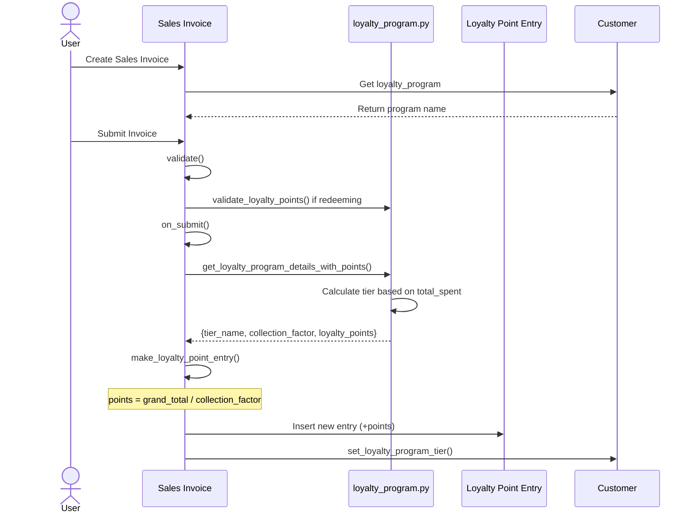
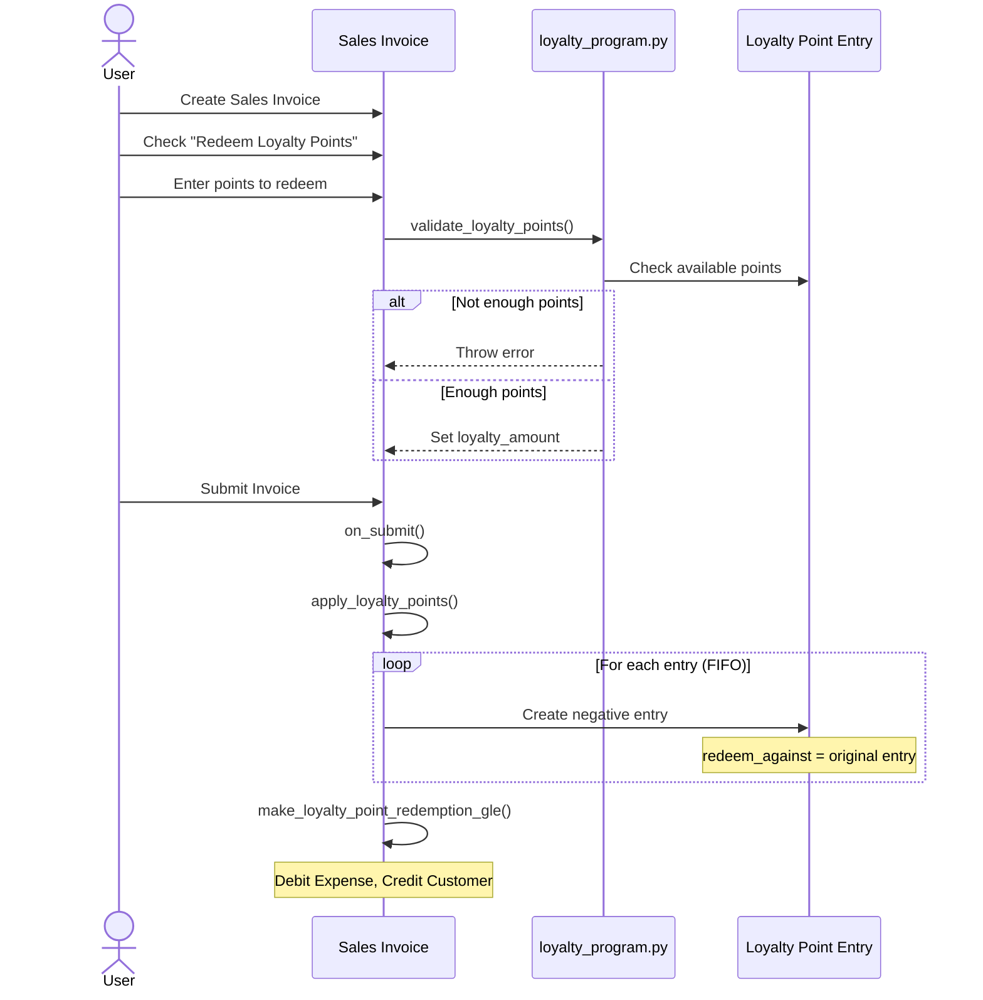
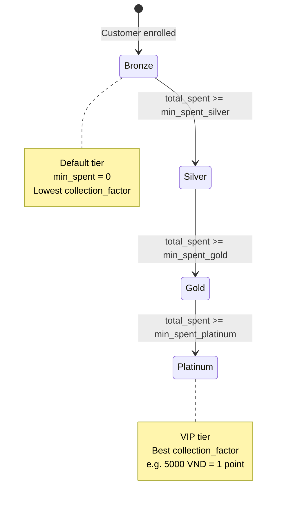

# Loyalty Module - Workflow Analysis

> **Module:** Loyalty Program (DCNET Core / ERPNext v16)
> **Analysis Date:** 2026-01-13
> **Generated by:** `/analyze-workflow loyalty`

---

## 1. Tổng quan

### 1.1. Module Structure

ERPNext Loyalty module nằm trong **Accounts** module với 4 DocTypes:

```
dcnet_core/erpnext/accounts/doctype/
├── loyalty_program/                    # Cấu hình chương trình
│   ├── loyalty_program.json           # Schema
│   ├── loyalty_program.py             # Business logic
│   └── loyalty_program_dashboard.py   # Dashboard
├── loyalty_program_collection/         # Child table - Tier rules
│   └── loyalty_program_collection.json
├── loyalty_point_entry/               # Lịch sử giao dịch điểm
│   ├── loyalty_point_entry.json
│   └── loyalty_point_entry.py
└── loyalty_point_entry_redemption/    # Child table - Redemption details
    └── loyalty_point_entry_redemption.json
```

### 1.2. Related Modules (Satellites)

| Module | Relationship | Integration Point |
|--------|--------------|-------------------|
| **Sales Invoice** | Primary | Tích điểm khi submit, đổi điểm khi redeem |
| **Customer** | Link | Field `loyalty_program` |
| **POS Invoice** | Secondary | Tương tự Sales Invoice |
| **Sales Order** | Secondary | Validate điểm khi redeem |

### 1.3. Process Flow Overview

```
Customer → Sales Invoice → Loyalty Point Entry → Points Balance
                ↑                    ↓
           Redeem Points ← ← ← Available Points
```

---

## 2. Tại sao cần Loyalty Program?

### 2.1. Business Rationale

**Mục đích:**
- Giữ chân khách hàng (Customer Retention)
- Gia tăng giá trị lifetime (CLV - Customer Lifetime Value)
- Khuyến khích mua hàng thường xuyên

**ERPNext đã có sẵn:**
- ✅ Multiple Tier Program (Bronze → Silver → Gold → Platinum)
- ✅ Collection rules với hệ số khác nhau theo tier
- ✅ Redemption - đổi điểm thành tiền
- ✅ Expiry - điểm hết hạn
- ✅ Auto opt-in - tự động đăng ký cho tất cả khách hàng

### 2.2. Technical Rationale

**Vì sao đặt trong Accounts module?**
- Loyalty redemption tạo **GL Entry** (ghi nhận chi phí)
- Cần `expense_account` để hạch toán
- Tích hợp chặt với Sales Invoice billing flow

---

## 3. DocType Schema Analysis

### 3.1. Loyalty Program

**File:** `dcnet_core/erpnext/accounts/doctype/loyalty_program/loyalty_program.json`

| Field | Type | Required | Description |
|-------|------|----------|-------------|
| `loyalty_program_name` | Data | ✅ | Tên chương trình (unique) |
| `loyalty_program_type` | Select | - | "Single Tier" / "Multiple Tier" |
| `from_date` | Date | ✅ | Ngày bắt đầu |
| `to_date` | Date | - | Ngày kết thúc |
| `auto_opt_in` | Check | - | Tự động cho tất cả KH |
| `customer_group` | Link | - | Filter theo nhóm KH |
| `customer_territory` | Link | - | Filter theo khu vực |
| `collection_rules` | Table | ✅ | Danh sách tier (child table) |
| `conversion_factor` | Float | - | 1 điểm = X VNĐ (khi đổi) |
| `expiry_duration` | Int | - | Số ngày hết hạn |
| `expense_account` | Link | - | Tài khoản chi phí |
| `cost_center` | Link | - | Cost center |
| `company` | Link | - | Company |

### 3.2. Loyalty Program Collection (Child Table)

**File:** `dcnet_core/erpnext/accounts/doctype/loyalty_program_collection/loyalty_program_collection.json`

| Field | Type | Required | Description |
|-------|------|----------|-------------|
| `tier_name` | Data | ✅ | Tên tier (Bronze/Silver/Gold/Platinum) |
| `min_spent` | Currency | - | Doanh số tối thiểu để vào tier |
| `collection_factor` | Currency | ✅ | X VNĐ = 1 điểm |

**Validation Rule:**
- Tier thấp nhất phải có `min_spent = 0` (loyalty_program.py:43-50)

### 3.3. Loyalty Point Entry

**File:** `dcnet_core/erpnext/accounts/doctype/loyalty_point_entry/loyalty_point_entry.json`

| Field | Type | Required | Description |
|-------|------|----------|-------------|
| `loyalty_program` | Link | ✅ | Chương trình loyalty |
| `loyalty_program_tier` | Data | - | Tier tại thời điểm giao dịch |
| `customer` | Link | ✅ | Khách hàng |
| `invoice_type` | Link | ✅ | DocType (Sales Invoice) |
| `invoice` | Dynamic Link | - | Link tới Invoice |
| `redeem_against` | Link | - | Entry gốc khi trừ điểm |
| `loyalty_points` | Int | ✅ | Số điểm (+/-) |
| `purchase_amount` | Currency | - | Giá trị đơn hàng |
| `expiry_date` | Date | ✅ | Ngày hết hạn |
| `posting_date` | Date | ✅ | Ngày giao dịch |
| `discretionary_reason` | Data | - | Lý do điều chỉnh thủ công |

---

## 4. Business Logic Analysis

### 4.1. Core Functions

**File:** `dcnet_core/erpnext/accounts/doctype/loyalty_program/loyalty_program.py`

#### get_loyalty_details() - Line 53-86

```python
def get_loyalty_details(customer, loyalty_program, expiry_date=None, company=None, include_expired_entry=False):
    """
    Lấy tổng loyalty_points và total_spent của customer

    Returns:
        dict: {loyalty_points: int, total_spent: currency}
    """
```

**Query:**
- SUM `loyalty_points` và `purchase_amount` từ Loyalty Point Entry
- Filter: customer, loyalty_program, posting_date <= expiry_date
- Optional: exclude expired entries

#### get_loyalty_program_details_with_points() - Line 90-117

```python
@frappe.whitelist()
def get_loyalty_program_details_with_points(customer, loyalty_program=None, expiry_date=None,
                                            company=None, silent=False, include_expired_entry=False,
                                            current_transaction_amount=0):
    """
    Lấy full details + auto determine tier

    Returns:
        dict: {loyalty_program, tier_name, collection_factor, loyalty_points, total_spent, ...}
    """
```

**Logic:**
1. Gọi `get_loyalty_program_details()` để lấy program info
2. Gọi `get_loyalty_details()` để lấy points & total_spent
3. Loop qua `collection_rules` (sorted by min_spent)
4. Xác định tier cao nhất mà `total_spent + current_transaction_amount >= min_spent`

#### validate_loyalty_points() - Line 160-208

```python
def validate_loyalty_points(ref_doc, points_to_redeem):
    """
    Validate khi customer muốn redeem points

    Checks:
    - Customer có đủ điểm không?
    - Loyalty amount có vượt total invoice không?
    - Company match không?
    """
```

### 4.2. Sales Invoice Integration

**File:** `dcnet_core/erpnext/accounts/doctype/sales_invoice/sales_invoice.py`

#### Fields trong Sales Invoice

```python
# Line 130-159
dont_create_loyalty_points: DF.Check
loyalty_amount: DF.Currency
loyalty_points: DF.Int
loyalty_program: DF.Link | None
loyalty_redemption_account: DF.Link | None
loyalty_redemption_cost_center: DF.Link | None
redeem_loyalty_points: DF.Check
```

#### on_submit() - Tích điểm

```python
# Line 497-510
# Create loyalty point entry if customer enrolled in loyalty program
if (
    not self.is_return
    and not self.is_consolidated
    and self.loyalty_program
    and not self.dont_create_loyalty_points
):
    self.make_loyalty_point_entry()
elif self.is_return and self.return_against and not self.is_consolidated and self.loyalty_program:
    against_si_doc = frappe.get_doc("Sales Invoice", self.return_against)
    against_si_doc.delete_loyalty_point_entry()
    against_si_doc.make_loyalty_point_entry()
if self.redeem_loyalty_points and not self.is_consolidated and self.loyalty_points:
    self.apply_loyalty_points()
```

#### make_loyalty_point_entry() - Line 1984-2021

```python
def make_loyalty_point_entry(self):
    """
    Tạo Loyalty Point Entry (+) khi submit Invoice

    Formula: points_earned = eligible_amount / collection_factor
    """
    returned_amount = self.get_returned_amount()
    current_amount = flt(self.grand_total) - cint(self.loyalty_amount)
    eligible_amount = current_amount - returned_amount

    lp_details = get_loyalty_program_details_with_points(...)

    collection_factor = lp_details.collection_factor if lp_details.collection_factor else 1.0
    points_earned = cint(eligible_amount / collection_factor)

    # Create entry
    doc = frappe.get_doc({
        "doctype": "Loyalty Point Entry",
        "loyalty_program": lp_details.loyalty_program,
        "loyalty_program_tier": lp_details.tier_name,
        "customer": self.customer,
        "invoice_type": self.doctype,
        "invoice": self.name,
        "loyalty_points": points_earned,
        "purchase_amount": eligible_amount,
        "expiry_date": add_days(self.posting_date, lp_details.expiry_duration),
        "posting_date": self.posting_date,
    })
    doc.save()
    self.set_loyalty_program_tier()
```

#### apply_loyalty_points() - Line 2072-2114

```python
def apply_loyalty_points(self):
    """
    Tạo Loyalty Point Entry (-) khi redeem points

    Logic: FIFO - trừ từ entry cũ nhất (theo expiry_date)
    """
    loyalty_point_entries = get_loyalty_point_entries(...)  # sorted by expiry_date
    redemption_details = get_redemption_details(...)

    points_to_redeem = self.loyalty_points
    for lp_entry in loyalty_point_entries:
        available_points = lp_entry.loyalty_points - flt(redemption_details.get(lp_entry.name))

        if available_points > points_to_redeem:
            redeemed_points = points_to_redeem
        else:
            redeemed_points = available_points

        # Create negative entry
        doc = frappe.get_doc({
            "doctype": "Loyalty Point Entry",
            "loyalty_points": -1 * redeemed_points,  # NEGATIVE
            "redeem_against": lp_entry.name,
            ...
        })
        doc.save()

        points_to_redeem -= redeemed_points
        if points_to_redeem < 1:
            break
```

#### make_loyalty_point_redemption_gle() - Line 1692-1724

```python
def make_loyalty_point_redemption_gle(self, gl_entries):
    """
    Tạo GL Entry khi redeem loyalty points

    Debit: loyalty_redemption_account (Expense)
    Credit: debit_to (Customer receivable)
    """
    if cint(self.redeem_loyalty_points and self.loyalty_points and not self.is_consolidated):
        # Credit to Customer
        gl_entries.append({
            "account": self.debit_to,
            "party_type": "Customer",
            "party": self.customer,
            "credit": self.loyalty_amount,
        })
        # Debit to Expense
        gl_entries.append({
            "account": self.loyalty_redemption_account,
            "debit": self.loyalty_amount,
            "remark": "Loyalty Points redeemed by the customer",
        })
```

---

## 5. Workflow Chi tiết

### 5.1. Workflow: Tích điểm



### 5.2. Workflow: Đổi điểm



### 5.3. State Machine - Tier Progression



---

## 6. Data Mapping

### 6.1. Sales Invoice → Loyalty Point Entry

| Sales Invoice Field | → | Loyalty Point Entry Field | Transformation |
|---------------------|---|---------------------------|----------------|
| `posting_date` | → | `posting_date` | Direct |
| `customer` | → | `customer` | Direct |
| `loyalty_program` | → | `loyalty_program` | Direct |
| `name` | → | `invoice` | Direct |
| `doctype` | → | `invoice_type` | Direct |
| `grand_total` | → | `purchase_amount` | eligible_amount |
| - | → | `loyalty_points` | Calculated |
| - | → | `loyalty_program_tier` | From LP details |
| - | → | `expiry_date` | posting_date + expiry_duration |

### 6.2. Loyalty Program → Tier Determination

```python
# Logic from loyalty_program.py:106-115
tier_spent_level = sorted(collection_rules, key=lambda x: x.min_spent)

for i, tier in enumerate(tier_spent_level):
    if i == 0 or (total_spent + current_transaction_amount) >= tier.min_spent:
        current_tier = tier.tier_name
        collection_factor = tier.collection_factor
    else:
        break
```

---

## 7. Key Functions - Code References

| File | Line | Function | Purpose |
|------|------|----------|---------|
| `loyalty_program.py` | 40-50 | `validate_lowest_tier()` | Ensure tier 0 has min_spent=0 |
| `loyalty_program.py` | 53-86 | `get_loyalty_details()` | Get total points & spent |
| `loyalty_program.py` | 90-117 | `get_loyalty_program_details_with_points()` | Full details + tier |
| `loyalty_program.py` | 121-145 | `get_loyalty_program_details()` | Basic program info |
| `loyalty_program.py` | 149-157 | `get_redeemption_factor()` | Get conversion_factor |
| `loyalty_program.py` | 160-208 | `validate_loyalty_points()` | Validate redemption |
| `loyalty_point_entry.py` | 38-52 | `get_loyalty_point_entries()` | Get entries for FIFO |
| `loyalty_point_entry.py` | 55-66 | `get_redemption_details()` | Get redeemed amounts |
| `sales_invoice.py` | 370-371 | `validate()` | Validate loyalty points |
| `sales_invoice.py` | 497-510 | `on_submit()` | Trigger point creation |
| `sales_invoice.py` | 610-615 | `on_cancel()` | Delete point entry |
| `sales_invoice.py` | 1692-1724 | `make_loyalty_point_redemption_gle()` | Create GL entries |
| `sales_invoice.py` | 1984-2021 | `make_loyalty_point_entry()` | Create point entry (+) |
| `sales_invoice.py` | 2024-2047 | `delete_loyalty_point_entry()` | Delete on cancel |
| `sales_invoice.py` | 2049-2057 | `set_loyalty_program_tier()` | Update customer tier |
| `sales_invoice.py` | 2072-2114 | `apply_loyalty_points()` | Redeem points (-) |
| `sales_invoice.py` | 2870-2884 | `get_loyalty_programs()` | Get applicable programs |

---

## 8. Integration Points

### 8.1. Customer Integration

**File:** `dcnet_core/erpnext/selling/doctype/customer/customer.json`

```json
{
  "fieldname": "loyalty_program",
  "fieldtype": "Link",
  "options": "Loyalty Program"
},
{
  "fieldname": "loyalty_program_tier",
  "fieldtype": "Data"
}
```

### 8.2. POS Invoice Integration

**File:** `dcnet_core/erpnext/accounts/doctype/pos_invoice/pos_invoice.py`

- Similar logic to Sales Invoice
- Uses same `make_loyalty_point_entry()` pattern

### 8.3. Point of Sale UI

**Files:**
- `dcnet_core/erpnext/selling/page/point_of_sale/pos_controller.js`
- `dcnet_core/erpnext/selling/page/point_of_sale/pos_payment.js`
- `dcnet_core/erpnext/selling/page/point_of_sale/pos_item_cart.js`

---

## 9. Key Takeaways

### 9.1. Điểm mạnh của ERPNext Loyalty

| Feature | Status | Notes |
|---------|--------|-------|
| Multiple Tier Program | ✅ | Auto tier upgrade based on total_spent |
| Collection Factor per Tier | ✅ | Higher tier = better points ratio |
| Redemption | ✅ | Points → Money discount |
| Expiry | ✅ | Points can expire after X days |
| FIFO Redemption | ✅ | Oldest points used first |
| GL Entry on Redemption | ✅ | Proper accounting |
| Auto Opt-in | ✅ | Auto enroll all customers |
| Territory/Group Filter | ✅ | Target specific customer segments |

### 9.2. Best Practices

✅ **DO:**
- Set tier 0 với `min_spent = 0` (required validation)
- Configure `expense_account` for proper accounting
- Use `expiry_duration` to encourage point usage
- Enable `auto_opt_in` for simplicity

❌ **DON'T:**
- Create program without collection_rules
- Set `conversion_factor = 0` (division error)
- Redeem points từ invoice khác doctype

### 9.3. Gaps/Limitations

| Gap | Impact | Workaround |
|-----|--------|------------|
| No tier downgrade | Medium | Manual process |
| No birthday/anniversary bonus | Low | Custom development |
| No referral points | Low | Custom development |
| No product-specific points | Medium | Custom development |

---

## 10. Formulas Summary

### Points Collection

```
POINTS = ELIGIBLE_AMOUNT / COLLECTION_FACTOR

Where:
- ELIGIBLE_AMOUNT = grand_total - loyalty_amount - returned_amount
- COLLECTION_FACTOR = từ tier hiện tại (VNĐ/point)
```

### Points Redemption

```
LOYALTY_AMOUNT = POINTS × CONVERSION_FACTOR

Where:
- POINTS = số điểm muốn đổi
- CONVERSION_FACTOR = giá trị 1 điểm (VNĐ)
```

### Tier Determination

```
TIER = MAX(tier) WHERE total_spent >= min_spent

Algorithm:
1. Sort tiers by min_spent ASC
2. Loop through tiers
3. If total_spent >= tier.min_spent → select this tier
4. Continue until no more tiers qualify
5. Return last selected tier
```

---

## 11. References

### Code Files

| File | Purpose |
|------|---------|
| `loyalty_program.json` | Program DocType schema |
| `loyalty_program.py` | Program business logic |
| `loyalty_program_collection.json` | Tier child table schema |
| `loyalty_point_entry.json` | Entry DocType schema |
| `loyalty_point_entry.py` | Entry business logic |
| `sales_invoice.py` | Integration logic |

### Documentation

| File | Purpose |
|------|---------|
| `docs/modules/loyalty/LOYALTY_SPEC.md` | Business requirements |
| `docs/modules/loyalty/LOYALTY_STATUS.md` | Tier status |
| `docs/modules/loyalty/LOYALTY_WORKFLOW.md` | Workflow diagrams |
| `docs/modules/loyalty/LOYALTY_DIAGRAMS.md` | Mermaid diagrams |

---

**Analysis Version:** 1.0
**Generated:** 2026-01-13
**Module Version:** ERPNext v16
