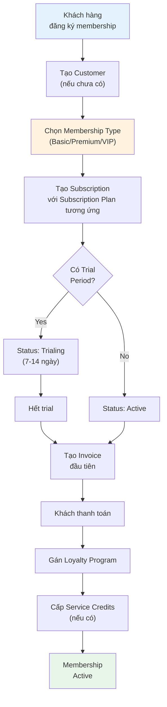
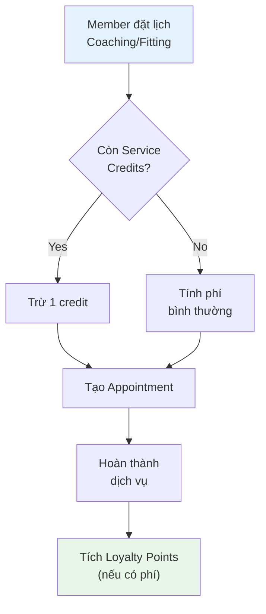
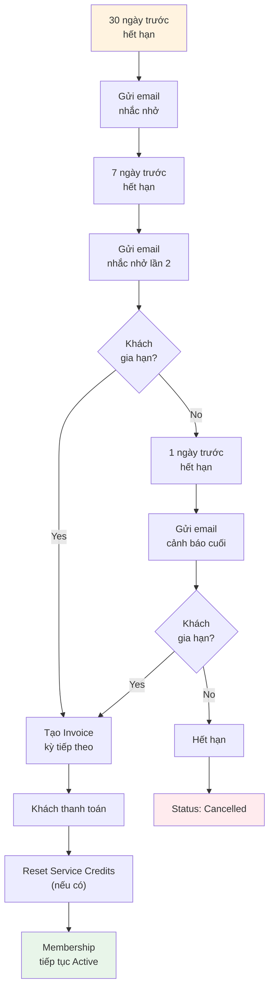

# Membership Module - Phân tích ERPNext

> **Mục đích:** Phân tích khả năng support Membership cho khách hàng Golf business
>
> **Kết luận:** ERPNext **KHÔNG có** module Membership riêng biệt, nhưng có thể kết hợp **Subscription** + **Loyalty Program** để đạt 70-80% yêu cầu.

---

## 1. Tổng quan

### 1.1. ERPNext có gì sẵn?

| Module | Mục đích | Phù hợp cho |
|--------|----------|-------------|
| **Subscription** | Thanh toán định kỳ (recurring billing) | Phí membership hàng tháng/năm |
| **Loyalty Program** | Tích điểm, đổi thưởng | Chương trình thành viên VIP |

### 1.2. ERPNext KHÔNG có gì?

- ❌ Membership Type (loại thành viên)
- ❌ Membership Card (thẻ thành viên)
- ❌ Usage Limits (giới hạn sử dụng dịch vụ)
- ❌ Service Credits (giờ coaching miễn phí)
- ❌ Family Membership (thành viên gia đình)

---

## 2. Chức năng có sẵn - Chi tiết

### 2.1. Subscription Module (Thanh toán định kỳ)

| Chức năng | Mô tả | Status |
|-----------|-------|--------|
| **Tạo subscription** | Đăng ký membership cho Customer | ✅ Có sẵn |
| **Chu kỳ thanh toán** | Day / Week / Month / Year | ✅ Có sẵn |
| **Thời gian trial** | Dùng thử X ngày trước khi tính phí | ✅ Có sẵn |
| **Tự động tạo hóa đơn** | Auto generate Sales Invoice theo chu kỳ | ✅ Có sẵn |
| **Grace period** | Thời gian ân hạn trước khi cancel | ✅ Có sẵn |
| **Giá linh hoạt** | Fixed / Price List / Monthly Rate | ✅ Có sẵn |
| **Chiết khấu** | % hoặc số tiền cố định | ✅ Có sẵn |
| **Prorate (tính lẻ)** | Hoàn tiền nếu hủy giữa kỳ | ✅ Có sẵn |

**Trạng thái Subscription:**

```
┌──────────┐    ┌────────┐    ┌──────────────┐    ┌────────┐    ┌───────────┐
│ Trialing │───▶│ Active │───▶│ Grace Period │───▶│ Unpaid │───▶│ Cancelled │
└──────────┘    └────────┘    └──────────────┘    └────────┘    └───────────┘
     │               │                                               │
     │               ▼                                               │
     │         ┌───────────┐                                         │
     └────────▶│ Completed │◀────────────────────────────────────────┘
               └───────────┘
```

### 2.2. Loyalty Program (Tích điểm thưởng)

| Chức năng | Mô tả | Status |
|-----------|-------|--------|
| **Tạo chương trình** | Định nghĩa loyalty program | ✅ Có sẵn |
| **Phân cấp tier** | Single tier / Multiple tier | ✅ Có sẵn |
| **Tích điểm tự động** | Khi Customer mua hàng → tích điểm | ✅ Có sẵn |
| **Quy đổi điểm** | X điểm = Y VND | ✅ Có sẵn |
| **Đổi điểm lấy giảm giá** | Redeem points → discount | ✅ Có sẵn |
| **Hết hạn điểm** | Điểm hết hạn sau X ngày | ✅ Có sẵn |
| **Báo cáo loyalty** | Customer acquisition & loyalty report | ✅ Có sẵn |

**Ví dụ Tier System:**

| Tier | Min Spent | Benefits |
|------|-----------|----------|
| Bronze | 0 VND | 1 điểm / 100,000 VND |
| Silver | 10,000,000 VND | 1.5 điểm / 100,000 VND |
| Gold | 50,000,000 VND | 2 điểm / 100,000 VND + free fitting |
| Platinum | 100,000,000 VND | 3 điểm / 100,000 VND + free coaching |

---

## 3. Gap Analysis - Golf Business

### 3.1. Yêu cầu vs Khả năng ERPNext

| Yêu cầu Golf Business | ERPNext có sẵn? | Giải pháp |
|----------------------|-----------------|-----------|
| **Loại membership** (Basic, Premium, VIP) | ❌ Không | Custom DocType: Membership Type |
| **Phí membership định kỳ** | ✅ Subscription | Dùng ngay |
| **Tích điểm khi mua hàng** | ✅ Loyalty Program | Dùng ngay |
| **Phân hạng thành viên** | ✅ Loyalty Tier | Dùng ngay |
| **Giờ coaching miễn phí** | ❌ Không | Custom: Service Credits |
| **Số lần fitting miễn phí** | ❌ Không | Custom: Service Credits |
| **Thẻ thành viên** | ❌ Không | Custom: Print Format |
| **Gia hạn tự động** | ⚠️ Tự động (không có approval) | Custom workflow |
| **Thông báo hết hạn** | ⚠️ Không có sẵn | Custom: Notification |
| **Membership gia đình** | ❌ Không | Custom: Family Link |
| **Giảm giá cho member** | ✅ Pricing Rule | Dùng ngay |
| **Báo cáo membership** | ⚠️ Chỉ có Subscription list | Custom report |

### 3.2. Đánh giá tổng quan

| Tiêu chí | Điểm | Ghi chú |
|----------|------|---------|
| **Thanh toán định kỳ** | 95% | Subscription module rất tốt |
| **Tích điểm thưởng** | 90% | Loyalty Program đầy đủ |
| **Quản lý loại membership** | 20% | Cần custom DocType |
| **Quyền lợi membership** | 10% | Cần custom Service Credits |
| **UX/Thẻ thành viên** | 0% | Cần custom hoàn toàn |

**Tổng: ~50-60% có sẵn, 40-50% cần custom**

---

## 4. Danh sách chức năng cho khách hàng

### 4.1. Chức năng CÓ SẴN (Dùng ngay)

| # | Chức năng | Module ERPNext | Mô tả |
|---|-----------|----------------|-------|
| 1 | Tạo gói membership | Subscription Plan | Định nghĩa gói (Annual, Monthly, VIP...) |
| 2 | Đăng ký membership | Subscription | Tạo đăng ký cho khách hàng |
| 3 | Chu kỳ thanh toán linh hoạt | Subscription | Ngày / Tuần / Tháng / Năm |
| 4 | Thời gian dùng thử | Subscription | Trial period X ngày |
| 5 | Tự động tạo hóa đơn | Subscription + Invoice | Mỗi kỳ tự động generate invoice |
| 6 | Thời gian ân hạn | Subscription Settings | Grace period trước khi hủy |
| 7 | Tính phí theo tỷ lệ | Subscription | Prorate khi hủy giữa kỳ |
| 8 | Chiết khấu membership | Subscription | % hoặc số tiền cố định |
| 9 | Theo dõi trạng thái | Subscription | Active / Cancelled / Expired |
| 10 | Gia hạn membership | Subscription | Restart subscription |
| 11 | Chương trình tích điểm | Loyalty Program | Tích điểm khi mua hàng |
| 12 | Phân hạng thành viên | Loyalty Tier | Bronze / Silver / Gold / Platinum |
| 13 | Đổi điểm lấy giảm giá | Loyalty Redemption | X điểm = Y VND discount |
| 14 | Hết hạn điểm | Loyalty Program | Điểm expire sau X ngày |
| 15 | Giảm giá cho member | Pricing Rule | Auto discount cho Customer Group |
| 16 | Báo cáo subscription | Report | Danh sách membership |
| 17 | Báo cáo loyalty | Report | Điểm tích lũy, đổi thưởng |

### 4.2. Chức năng CẦN CUSTOM (Phát triển thêm)

| # | Chức năng | Mức độ | Effort | Mô tả |
|---|-----------|--------|--------|-------|
| 1 | **Membership Type** | Critical | 2-3 ngày | Loại thành viên (Basic, Premium, VIP) |
| 2 | **Membership Benefits** | Critical | 3-4 ngày | Quyền lợi theo loại (giờ coaching, số lần fitting) |
| 3 | **Service Credits** | Critical | 5-7 ngày | Theo dõi số giờ/lần dịch vụ còn lại |
| 4 | **Usage Tracking** | High | 3-4 ngày | Ghi nhận sử dụng dịch vụ |
| 5 | **Membership Card** | Medium | 2-3 ngày | Template thẻ thành viên (PDF/Digital) |
| 6 | **Expiry Notification** | High | 2-3 ngày | Email nhắc nhở 30/7/1 ngày trước hết hạn |
| 7 | **Renewal Approval** | Medium | 2-3 ngày | Workflow phê duyệt gia hạn |
| 8 | **Family Membership** | Low | 3-4 ngày | Link vợ/chồng/con vào 1 membership |
| 9 | **Membership Report** | Medium | 2-3 ngày | Báo cáo Active/Expired/Cancelled |
| 10 | **Bulk Operations** | Low | 1-2 ngày | Gia hạn/hủy nhiều membership cùng lúc |

**Tổng effort custom: 25-36 ngày (1-1.5 tháng)**

---

## 5. Workflow đề xuất cho Golf Business

### 5.1. Quy trình đăng ký Membership



### 5.2. Quy trình sử dụng quyền lợi



### 5.3. Quy trình gia hạn



---

## 6. Cấu trúc dữ liệu đề xuất

### 6.1. Membership Type (Custom DocType)

```
membership_type
├── name (e.g., "VIP Annual")
├── membership_name ("Thẻ VIP Năm")
├── description
├── duration_months (12)
├── price (50,000,000 VND)
├── benefits (Child Table)
│   ├── benefit_type (Coaching / Fitting / Discount)
│   ├── quantity (10 sessions / 5 times / 20%)
│   └── description
├── linked_subscription_plan (Link)
└── linked_loyalty_program (Link)
```

### 6.2. Service Credits (Custom DocType)

```
service_credits
├── name (auto)
├── customer (Link)
├── membership_type (Link)
├── service_type (Coaching / Fitting)
├── total_credits (10)
├── used_credits (3)
├── remaining_credits (7)
├── valid_from
├── valid_to
└── status (Active / Expired)
```

### 6.3. Usage Log (Custom DocType)

```
service_usage_log
├── name (auto)
├── customer (Link)
├── service_credits (Link)
├── service_type
├── used_date
├── reference_doctype (Coaching Session / Fitting Session)
├── reference_name
└── credits_used (1)
```

---

## 7. Tóm tắt cho Meeting với khách

### 7.1. ERPNext có thể làm được (Dùng ngay)

1. **Quản lý thanh toán định kỳ** - Subscription module
2. **Tự động tạo hóa đơn** - Mỗi tháng/quý/năm
3. **Theo dõi trạng thái** - Active / Cancelled / Expired
4. **Tích điểm thưởng** - Loyalty Program
5. **Phân hạng thành viên** - Bronze / Silver / Gold
6. **Giảm giá cho member** - Pricing Rule

### 7.2. Cần phát triển thêm (Custom)

1. **Loại membership** - Basic / Premium / VIP
2. **Quyền lợi membership** - Giờ coaching, lần fitting miễn phí
3. **Theo dõi sử dụng** - Còn bao nhiêu credits
4. **Thẻ thành viên** - In thẻ / Digital card
5. **Thông báo hết hạn** - Email nhắc nhở tự động

### 7.3. Câu hỏi cần clarify với khách

| # | Câu hỏi | Lý do |
|---|---------|-------|
| 1 | Có bao nhiêu loại membership? | Để thiết kế Membership Type |
| 2 | Mỗi loại có quyền lợi gì? | Để thiết kế Benefits table |
| 3 | Chu kỳ thanh toán? (Tháng/Quý/Năm) | Để setup Subscription Plan |
| 4 | Có trial period không? Bao lâu? | Để config Subscription |
| 5 | Có Family membership không? | Để đánh giá effort custom |
| 6 | Cần thẻ thành viên vật lý hay digital? | Để thiết kế Print Format |
| 7 | Điểm tích lũy có hết hạn không? | Để config Loyalty Program |
| 8 | Membership có chuyển nhượng được không? | Để thiết kế workflow |

---

## 8. Code References

### 8.1. Subscription Module

| File | Line | Function | Mô tả |
|------|------|----------|-------|
| `subscription.py` | 219-237 | `set_subscription_status()` | Cập nhật trạng thái |
| `subscription.py` | 381-489 | `create_invoice()` | Tạo hóa đơn định kỳ |
| `subscription.py` | 558-592 | `process()` | Logic xử lý chính |
| `subscription.py` | 689-709 | `cancel_subscription()` | Hủy subscription |
| `subscription.py` | 712-724 | `restart_subscription()` | Gia hạn subscription |
| `subscription_plan.json` | 65-68 | `price_determination` | Fixed / Price List / Monthly |
| `subscription_settings.json` | 16-30 | Settings | Grace period, prorate, auto-cancel |

### 8.2. Loyalty Program

| File | Line | Function | Mô tả |
|------|------|----------|-------|
| `loyalty_program.py` | - | `get_loyalty_program_details()` | Lấy thông tin program |
| `loyalty_point_entry.py` | - | `on_submit()` | Tích điểm khi submit |
| `sales_invoice.py` | - | `update_loyalty_points()` | Cập nhật điểm từ invoice |

---

## 9. Kết luận

### Đề xuất approach

1. **Phase 1:** Sử dụng Subscription + Loyalty Program có sẵn
2. **Phase 2:** Custom Membership Type + Benefits (sau khi clarify với khách)
3. **Phase 3:** Custom Service Credits + Usage Tracking (nếu cần)

### Timeline ước tính

| Phase | Nội dung | Effort |
|-------|----------|--------|
| Phase 1 | Setup Subscription + Loyalty | 3-5 ngày |
| Phase 2 | Custom Membership Type + Benefits | 5-7 ngày |
| Phase 3 | Service Credits + Tracking | 7-10 ngày |
| **Tổng** | | **15-22 ngày** |

---

**Ngày tạo:** 30/01/2026
**Người tạo:** DCNET Technical Team
**Trạng thái:** Draft - Chờ meeting với khách để clarify
