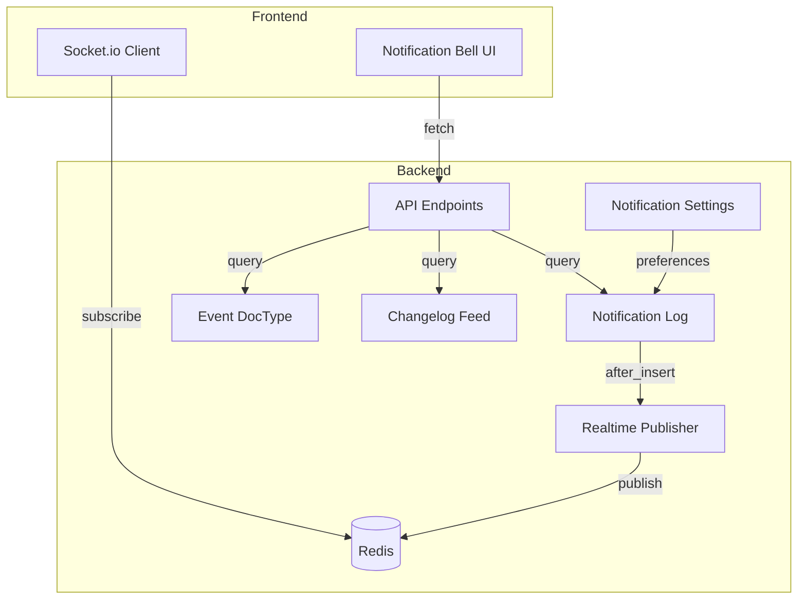
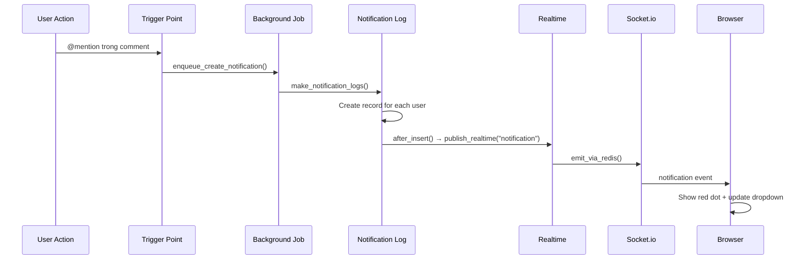
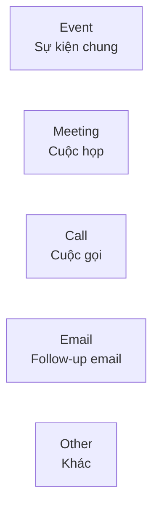
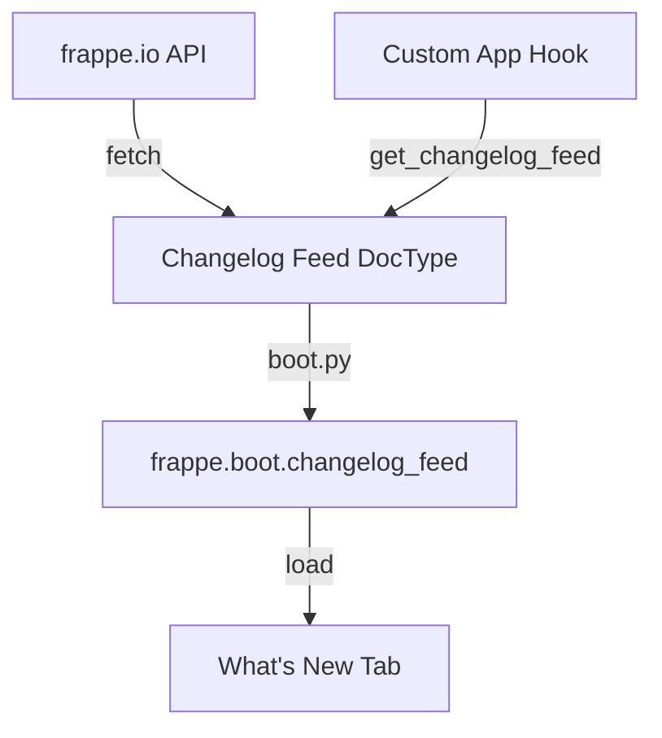
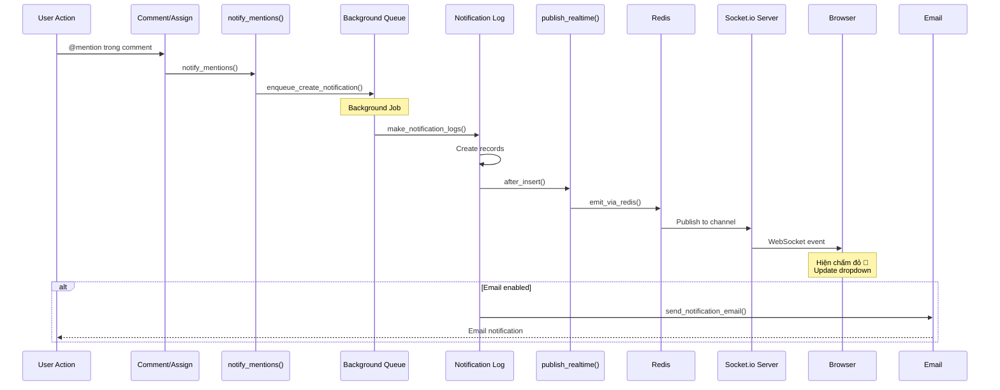
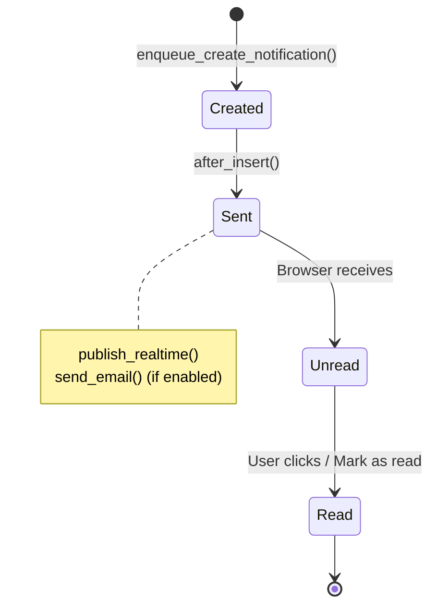
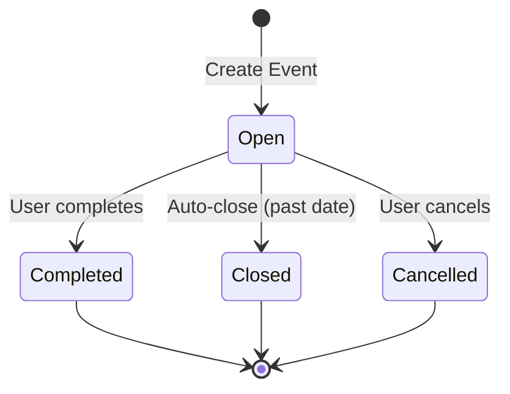

# Frappe Notification System Workflow Analysis

> **Nguồn:** Code analysis từ Frappe Framework
> **Ngày tạo:** 29/01/2026
> **Phạm vi:** Notification Bell, Events, What's New

---

## 1. Tổng quan

Hệ thống thông báo trong Frappe/ERPNext bao gồm **3 thành phần chính** hiển thị trong Notification Bell dropdown trên navbar:

```
┌─────────────────────────────────────────────────────────────┐
│  🔔 Notification Bell Dropdown                              │
├─────────────────────────────────────────────────────────────┤
│  ┌─────────────┬─────────────┬─────────────┐               │
│  │ Thông báo   │ Sự kiện     │ Có gì mới   │  ← 3 Tabs     │
│  │ Notifications│ Events      │ What's New  │               │
│  └─────────────┴─────────────┴─────────────┘               │
│                                                             │
│  ┌─────────────────────────────────────────────────────────┐│
│  │ [Avatar] @John mentioned you in Sales Order             ││
│  │ SO-00001 - 5 minutes ago                                ││
│  ├─────────────────────────────────────────────────────────┤│
│  │ [Avatar] Task assigned: Review Customer                 ││
│  │ TASK-00012 - 2 hours ago                                ││
│  └─────────────────────────────────────────────────────────┘│
│                                                             │
│  [ Mark all as read ]                                       │
└─────────────────────────────────────────────────────────────┘
```

### 1.1. Ba loại thông báo

| Tab | Tên Việt | DocType | Mô tả |
|-----|----------|---------|-------|
| **Notifications** | Thông báo | `Notification Log` | Mention, Assignment, Share, Alert |
| **Events** | Sự kiện | `Event` | Lịch hẹn, cuộc họp hôm nay |
| **What's New** | Có gì mới | `Changelog Feed` | Tính năng mới của hệ thống |

### 1.2. Architecture Overview



---

## 2. NOTIFICATIONS (Thông báo)

### 2.1. Notification Log DocType

**Đường dẫn:** `frappe/desk/doctype/notification_log/`

**Schema chính:**

| Field | Type | Mô tả |
|-------|------|-------|
| `subject` | Text | Nội dung thông báo (HTML) |
| `for_user` | Link (User) | Người nhận |
| `type` | Select | "Mention" \| "Assignment" \| "Share" \| "Alert" \| "Energy Point" |
| `from_user` | Link (User) | Người gửi/tạo |
| `document_type` | Link (DocType) | Document liên quan |
| `document_name` | Data | Tên document |
| `read` | Check | Đã đọc (0/1) |
| `email_content` | Text Editor | Nội dung email |

### 2.2. Các loại thông báo

```mermaid
graph LR
    subgraph Notification Types
        M[Mention<br>@user trong comment]
        A[Assignment<br>Giao việc cho user]
        S[Share<br>Chia sẻ document]
        AL[Alert<br>Cảnh báo hệ thống]
        EP[Energy Point<br>Điểm thưởng]
    end
```

| Type | Trigger | Ví dụ |
|------|---------|-------|
| **Mention** | @user trong comment | "@john xem giúp đơn hàng này" |
| **Assignment** | ToDo assigned | Giao việc: Review SO-00001 |
| **Share** | Document shared | SO-00001 được share cho bạn |
| **Alert** | Custom notification | Cảnh báo: Hàng sắp hết |
| **Energy Point** | Point earned | +10 điểm cho hoàn thành task |

### 2.3. Workflow tạo Notification



### 2.4. Code tạo Notification

#### A. Mention Notification (tự động)

```python
# Khi comment có @mention
# File: frappe/desk/notifications.py:388-420

def notify_mentions(ref_doctype, ref_name, content):
    """
    Tự động tạo notification khi phát hiện @mention trong content
    """
    mentions = extract_mentions(content)  # Parse @user từ HTML

    for email in mentions:
        enqueue_create_notification(
            users=[email],
            doc={
                "type": "Mention",
                "document_type": ref_doctype,
                "document_name": ref_name,
                "subject": f"Mentioned in {ref_doctype} {ref_name}",
                "from_user": frappe.session.user,
            }
        )
```

#### B. Assignment Notification (tự động)

```python
# Khi giao việc (assign)
# File: frappe/desk/form/assign_to.py

def add(args):
    """Assign document to users"""
    # ... tạo ToDo ...

    # Notification được tạo tự động
    enqueue_create_notification(
        users=[args.assign_to],
        doc={
            "type": "Assignment",
            "document_type": doctype,
            "document_name": name,
            "subject": f"<b>{doctype}</b> {name} assigned to you",
            "from_user": frappe.session.user,
        }
    )
```

#### C. Custom Alert Notification (manual)

```python
from frappe.desk.doctype.notification_log.notification_log import enqueue_create_notification

# Tạo thông báo tùy chỉnh
enqueue_create_notification(
    users=["sales_manager@company.com", "admin@company.com"],
    doc={
        "type": "Alert",
        "document_type": "Sales Order",
        "document_name": "SO-00001",
        "subject": "🔥 <b>Đơn hàng lớn!</b> SO-00001 vượt 100 triệu VND",
        "from_user": "system",
        "email_content": "Vui lòng review và approve đơn hàng này.",
        "email_header": "Alert: High-Value Sales Order"
    }
)
```

### 2.5. Notification Settings

**DocType:** `Notification Settings` (per user)

| Field | Type | Mô tả |
|-------|------|-------|
| `enabled` | Check | Bật/tắt tất cả notification |
| `enable_email_notifications` | Check | Bật/tắt email notification |
| `enable_email_mention` | Check | Email khi @mention |
| `enable_email_assignment` | Check | Email khi assign |
| `enable_email_share` | Check | Email khi share |
| `enable_email_event_reminders` | Check | Email nhắc lịch |

### 2.6. Real-time Notification Flow

```python
# Backend - Publish notification
# File: frappe/desk/doctype/notification_log/notification_log.py:36-43

class NotificationLog(Document):
    def after_insert(self):
        # Gửi real-time notification qua Socket.io
        frappe.publish_realtime(
            event="notification",
            after_commit=True,
            user=self.for_user  # Chỉ gửi cho user cụ thể
        )

        # Gửi email nếu được bật
        if is_email_notifications_enabled_for_type(self.for_user, self.type):
            send_notification_email(self)
```

```javascript
// Frontend - Receive notification
// File: frappe/public/js/frappe/ui/notifications/notifications.js:402-421

frappe.realtime.on("notification", () => {
    // Hiện chấm đỏ trên icon 🔔
    this.toggle_notification_icon(false);

    // Refresh dropdown
    this.update_dropdown();
});
```

### 2.7. API Endpoints

| Endpoint | Method | Mô tả |
|----------|--------|-------|
| `notification_log.get_notification_logs` | GET | Lấy 20 notifications gần nhất |
| `notification_log.mark_as_read` | POST | Đánh dấu đã đọc |
| `notification_log.mark_all_as_read` | POST | Đánh dấu tất cả đã đọc |

```javascript
// Lấy notifications
frappe.call({
    method: "frappe.desk.doctype.notification_log.notification_log.get_notification_logs",
    args: { limit: 20 }
}).then(r => {
    console.log(r.message.notification_logs);
});
```

---

## 3. EVENTS (Sự kiện)

### 3.1. Event DocType

**Đường dẫn:** `frappe/desk/doctype/event/`

**Schema chính:**

| Field | Type | Mô tả |
|-------|------|-------|
| `subject` | Small Text | Tiêu đề sự kiện |
| `starts_on` | Datetime | Thời gian bắt đầu |
| `ends_on` | Datetime | Thời gian kết thúc |
| `all_day` | Check | Sự kiện cả ngày |
| `event_category` | Select | "Event" \| "Meeting" \| "Call" \| "Email" \| "Other" |
| `event_type` | Select | "Private" \| "Public" |
| `event_participants` | Table | Danh sách người tham gia |
| `send_reminder` | Check | Gửi nhắc nhở |
| `repeat_this_event` | Check | Lặp lại định kỳ |
| `reference_doctype` | Link | Document liên quan |
| `reference_docname` | Dynamic Link | Tên document liên quan |

### 3.2. Event Categories



### 3.3. Event hiển thị trong Notification Bell

Events tab hiển thị **chỉ sự kiện hôm nay**:

```javascript
// File: frappe/public/js/frappe/ui/notifications/notifications.js:426-435

let today = frappe.datetime.get_today();

frappe.xcall(
    "frappe.desk.doctype.event.event.get_events",
    {
        start: today,
        end: today,  // Chỉ lấy sự kiện hôm nay
    }
)
.then((event_list) => {
    this.render_events_html(event_list);
});
```

### 3.4. Tạo Event từ Code

```python
import frappe

# Tạo event cơ bản
event = frappe.get_doc({
    "doctype": "Event",
    "subject": "Họp review Sales Q1",
    "starts_on": "2026-01-30 10:00:00",
    "ends_on": "2026-01-30 11:00:00",
    "event_category": "Meeting",
    "event_type": "Public",
    "description": "Review kết quả bán hàng Q1/2026"
})
event.insert()
frappe.db.commit()

# Thêm participants
event.append("event_participants", {
    "reference_doctype": "User",
    "reference_docname": "sales_manager@company.com",
    "email": "sales_manager@company.com"
})
event.save()
```

### 3.5. Event Reminders

```python
# Tạo event với reminder
event = frappe.get_doc({
    "doctype": "Event",
    "subject": "Demo cho khách hàng",
    "starts_on": "2026-01-30 14:00:00",
    "event_category": "Meeting",
    "event_type": "Public",
    "send_reminder": 1  # Bật reminder
})

# Thêm notification rules
event.append("notifications", {
    "type": "Email",
    "before": 30,       # 30 phút trước
    "interval": "Minutes"
})
event.append("notifications", {
    "type": "Notification",  # In-app notification
    "before": 15,           # 15 phút trước
    "interval": "Minutes"
})
event.insert()
```

### 3.6. Event liên kết với Document

```python
# Event liên kết với Sales Order
event = frappe.get_doc({
    "doctype": "Event",
    "subject": "Giao hàng cho khách: SO-00001",
    "starts_on": "2026-01-30 09:00:00",
    "event_category": "Event",
    "event_type": "Private",
    "reference_doctype": "Sales Order",
    "reference_docname": "SO-00001"
})
event.insert()
```

---

## 4. WHAT'S NEW (Có gì mới)

### 4.1. Changelog Feed DocType

**Đường dẫn:** `frappe/desk/doctype/changelog_feed/`

**Schema:**

| Field | Type | Mô tả |
|-------|------|-------|
| `title` | Data | Tiêu đề tính năng/fix |
| `app_name` | Data | Tên app (frappe, erpnext, dcnet_apps) |
| `link` | Long Text | Link đến documentation |
| `posting_timestamp` | Datetime | Ngày đăng |

### 4.2. Data Sources



### 4.3. Thêm Custom "What's New" Entry

**Bước 1: Đăng ký hook**

```python
# dcnet_apps/hooks.py

hooks = {
    "get_changelog_feed": [
        "dcnet_apps.utils.changelog.get_dcnet_changelog"
    ]
}
```

**Bước 2: Implement function**

```python
# dcnet_apps/utils/changelog.py

def get_dcnet_changelog(since):
    """
    Trả về danh sách changelog items từ ngày `since`

    Args:
        since: datetime string - lấy changelog từ ngày này trở đi

    Returns:
        list of dict: [{"title", "app_name", "link", "creation"}]
    """
    return [
        {
            "title": "Tính năng mới: Module Fitting",
            "app_name": "dcnet_apps",
            "link": "/desk/fitting",
            "creation": "2026-01-29 10:00:00"
        },
        {
            "title": "Cập nhật: Coaching Dashboard redesign",
            "app_name": "dcnet_apps",
            "link": "/desk/coaching",
            "creation": "2026-01-28 15:30:00"
        },
        {
            "title": "Bug fix: Loyalty points calculation",
            "app_name": "dcnet_apps",
            "link": "/desk/loyalty_program",
            "creation": "2026-01-27 09:00:00"
        }
    ]
```

**Bước 3: Fetch changelog (tự động)**

```python
# Frappe tự động gọi hàng ngày qua scheduler
# File: frappe/desk/doctype/changelog_feed/changelog_feed.py:31-62

def fetch_changelog_feed():
    """
    Scheduled job - runs daily
    Fetches from frappe.io + custom hooks
    """
    # 1. Fetch from frappe.io
    frappe_feed = get_feed()

    # 2. Fetch from custom hooks
    for hook in frappe.get_hooks("get_changelog_feed"):
        custom_feed = frappe.call(hook, since=last_fetch_date)
        # Store in Changelog Feed DocType
```

---

## 5. Complete Notification Flow Diagram



---

## 6. State Machine

### 6.1. Notification State



### 6.2. Event State



---

## 7. Key Takeaways

### 7.1. Cách tạo Notification

| Loại | Cách tạo | Tự động? |
|------|----------|----------|
| Mention | @user trong comment | ✅ Tự động |
| Assignment | Assign document to user | ✅ Tự động |
| Share | Share document | ✅ Tự động |
| Alert | `enqueue_create_notification()` | ❌ Manual |

### 7.2. Real-time Requirements

- **Backend:** `frappe.publish_realtime()` → Redis
- **Frontend:** `frappe.realtime.on("notification", callback)`
- **Socket.io:** Required for real-time notifications

### 7.3. Email Notification Control

User có thể tắt/bật từng loại email trong **Notification Settings**:
- Mention emails
- Assignment emails
- Share emails
- Event reminder emails

### 7.4. Best Practices

**DO:**
- ✅ Sử dụng `enqueue_create_notification()` (background job)
- ✅ Kiểm tra user preferences trước khi gửi email
- ✅ Sử dụng `type` phù hợp (Mention, Assignment, Share, Alert)

**DON'T:**
- ❌ Tạo Notification Log trực tiếp (không trigger realtime)
- ❌ Spam notifications (user có thể tắt)
- ❌ Gửi email mà không check settings

---

## 8. Code References

| File | Line | Function | Purpose |
|------|------|----------|---------|
| `frappe/desk/doctype/notification_log/notification_log.py` | 74-99 | `enqueue_create_notification()` | Queue notification |
| `frappe/desk/doctype/notification_log/notification_log.py` | 36-43 | `after_insert()` | Trigger realtime + email |
| `frappe/desk/doctype/notification_log/notification_log.py` | 170-182 | `get_notification_logs()` | API: get notifications |
| `frappe/desk/notifications.py` | 388-420 | `notify_mentions()` | Parse @mentions |
| `frappe/desk/doctype/event/event.py` | 334-505 | `get_events()` | Get events for date range |
| `frappe/realtime.py` | 23-83 | `publish_realtime()` | Publish to Socket.io |
| `frappe/public/js/frappe/ui/notifications/notifications.js` | 402-421 | `setup_notification_listeners()` | Listen to realtime events |
| `frappe/desk/doctype/changelog_feed/changelog_feed.py` | 65-79 | `get_changelog_feed_items()` | Get What's New items |

---

## 9. Practical Examples

### 9.1. Gửi Alert khi Sales Order vượt ngưỡng

```python
# File: dcnet_apps/selling/doctype/sales_order/sales_order.py

from frappe.desk.doctype.notification_log.notification_log import enqueue_create_notification

class SalesOrder(Document):
    def on_submit(self):
        # Check if order exceeds threshold
        if self.grand_total > 100000000:  # 100 triệu VND
            self.notify_high_value_order()

    def notify_high_value_order(self):
        # Get sales managers
        managers = frappe.get_all(
            "Has Role",
            filters={"role": "Sales Manager"},
            pluck="parent"
        )

        enqueue_create_notification(
            users=managers,
            doc={
                "type": "Alert",
                "document_type": "Sales Order",
                "document_name": self.name,
                "subject": f"🔥 <b>Đơn hàng lớn!</b> {self.name}: {frappe.format_value(self.grand_total, 'Currency')}",
                "from_user": frappe.session.user,
                "email_content": f"""
                    <p>Đơn hàng {self.name} vừa được submit với giá trị {frappe.format_value(self.grand_total, 'Currency')}</p>
                    <p>Khách hàng: {self.customer_name}</p>
                    <p>Vui lòng review và approve.</p>
                """,
                "email_header": f"Alert: High-Value Sales Order {self.name}"
            }
        )
```

### 9.2. Tạo Event tự động khi tạo Appointment

```python
# File: dcnet_apps/fitting/doctype/fitting_appointment/fitting_appointment.py

class FittingAppointment(Document):
    def after_insert(self):
        self.create_calendar_event()

    def create_calendar_event(self):
        event = frappe.get_doc({
            "doctype": "Event",
            "subject": f"Fitting: {self.customer_name}",
            "starts_on": self.appointment_datetime,
            "ends_on": frappe.utils.add_to_date(self.appointment_datetime, hours=2),
            "event_category": "Meeting",
            "event_type": "Private",
            "reference_doctype": "Fitting Appointment",
            "reference_docname": self.name,
            "send_reminder": 1,
            "description": f"""
                Khách hàng: {self.customer_name}
                Dịch vụ: {self.service_type}
                Ghi chú: {self.notes or "N/A"}
            """
        })

        # Add coach as participant
        if self.assigned_coach:
            event.append("event_participants", {
                "reference_doctype": "User",
                "reference_docname": self.assigned_coach
            })

        # Add 30-min reminder
        event.append("notifications", {
            "type": "Email",
            "before": 30,
            "interval": "Minutes"
        })

        event.insert(ignore_permissions=True)
```

### 9.3. Listen to Notification trong Frontend

```javascript
// File: dcnet_apps/public/js/sales_dashboard.js

frappe.pages['sales-dashboard'].on_page_load = function(wrapper) {
    // ... setup page ...

    // Listen to new notifications
    frappe.realtime.on("notification", () => {
        // Refresh dashboard stats when new notification arrives
        refresh_dashboard_stats();

        // Show toast
        frappe.show_alert({
            message: __("New notification received"),
            indicator: "blue"
        });
    });
};

function refresh_dashboard_stats() {
    frappe.call({
        method: "dcnet_apps.selling.dashboard.get_stats",
        callback: (r) => {
            update_dashboard_ui(r.message);
        }
    });
}
```

---

## 10. Diagram: Complete System Architecture

```mermaid
graph TB
    subgraph "User Interface"
        NB[🔔 Notification Bell]
        Cal[📅 Calendar View]
        Form[📝 Document Form]
    end

    subgraph "Notification Types"
        NB --> NT[Notifications Tab]
        NB --> ET[Events Tab]
        NB --> WT[What's New Tab]

        NT --> M[Mentions]
        NT --> A[Assignments]
        NT --> S[Shares]
        NT --> AL[Alerts]
    end

    subgraph "Backend Services"
        NL[Notification Log]
        EV[Event DocType]
        CF[Changelog Feed]
        RT[Realtime Service]
    end

    subgraph "Data Flow"
        Form -->|@mention| M
        Form -->|assign| A
        Form -->|share| S
        Code[Custom Code] -->|enqueue| AL

        M --> NL
        A --> NL
        S --> NL
        AL --> NL

        NL -->|after_insert| RT
        RT -->|Socket.io| NB
    end

    subgraph "Events Flow"
        Cal -->|create| EV
        EV -->|today only| ET
        EV -->|scheduler| Reminder[Email Reminder]
    end

    subgraph "Changelog Flow"
        API[frappe.io API] -->|fetch| CF
        Hook[Custom Hook] -->|get_changelog_feed| CF
        CF -->|boot.py| WT
    end
```

---

**Version:** 1.0
**Created:** 29/01/2026
**Author:** Claude Code Analysis
