# DCNET Flow - Pricing & Wholesale/Retail Workflow Analysis

> **Generated:** 14/01/2026 | **Purpose:** Gap analysis between customer requirements and ERPNext pricing capabilities
>
> **Focus:** Pricing mechanism, wholesale vs retail differentiation, discount management

---

## Mục lục

1. [Tổng quan](#1-tổng-quan)
2. [Yêu cầu khách hàng](#2-yêu-cầu-khách-hàng)
3. [Cơ chế Pricing của ERPNext](#3-cơ-chế-pricing-của-erpnext)
4. [Gap Analysis: Yêu cầu vs ERPNext](#4-gap-analysis-yêu-cầu-vs-erpnext)
5. [Workflow chi tiết](#5-workflow-chi-tiết)
6. [Data Mapping](#6-data-mapping)
7. [Sequence Diagrams](#7-sequence-diagrams)
8. [State Machines](#8-state-machines)
9. [Kết luận & Khuyến nghị](#9-kết-luận--khuyến-nghị)
10. [Code References](#10-code-references)

---

## 1. Tổng quan

### 1.1. Tóm tắt

DCNET Flow cần hỗ trợ **2 quy trình bán hàng song song**:

```
┌─────────────────────────────────────────────────────────────┐
│                    DCNET FLOW SALES                          │
├─────────────────────────────────────────────────────────────┤
│                                                              │
│  ┌──────────────────────┐    ┌──────────────────────┐      │
│  │   BÁN BUÔN (Sỉ)     │    │   BÁN LẺ (Retail)   │      │
│  │   12 bước            │    │   3 bước             │      │
│  └──────────────────────┘    └──────────────────────┘      │
│           │                            │                     │
│           │                            │                     │
│  ┌────────▼────────────────────────────▼─────────────┐      │
│  │     PRICING ENGINE (ERPNext Core)                 │      │
│  │  • Price List                                     │      │
│  │  • Pricing Rule                                   │      │
│  │  • Item Price                                     │      │
│  └───────────────────────────────────────────────────┘      │
│                                                              │
└─────────────────────────────────────────────────────────────┘
```

**Câu hỏi trọng tâm:**
> ✅ **ERPNext có phù hợp với yêu cầu Bán sỉ/Bán lẻ của khách hàng không?**

### 1.2. Kết luận nhanh

| Tiêu chí | Kết quả | Độ phù hợp | Ghi chú |
|----------|---------|------------|---------|
| **Bảng giá niêm yết** | ✅ Có sẵn | 95% | Price List + Item Price |
| **Chính sách chiết khấu bán buôn** | ✅ Có sẵn | 90% | Pricing Rule (Customer/Group) |
| **Chính sách chiết khấu bán lẻ** | ✅ Có sẵn | 90% | Pricing Rule (Generic) |
| **Giá theo khách hàng cụ thể** | ✅ Có sẵn | 100% | Item Price with Customer link |
| **Giá theo thời gian** | ✅ Có sẵn | 100% | valid_from, valid_upto |
| **Phân biệt Sỉ/Lẻ** | 🔧 Cần config | 80% | Via Customer Group hoặc Quantity Tiers |
| **Hạn mức công nợ** | ✅ Có sẵn | 85% | Credit Limit (cần config) |
| **File đính kèm quyết định giá** | ✅ Có sẵn | 100% | Frappe Attachment system |

**Tổng kết:** ✅ **ERPNext đáp ứng 85-95% yêu cầu khách hàng về pricing**

---

## 2. Yêu cầu khách hàng

### 2.1. Quy trình Bán buôn (12 bước)

**Nguồn:** `docs/feature/ERP_SPECIFICATION.md` (Section: Quy trình Bán buôn)

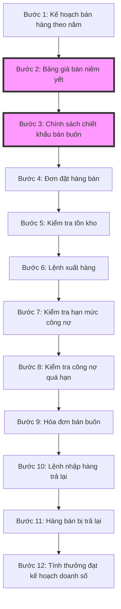
```mermaid
graph TD
    A[Bước 1: Kế hoạch bán hàng theo năm] --> B[Bước 2: Bảng giá bán niêm yết]
    B --> C[Bước 3: Chính sách chiết khấu bán buôn]
    C --> D[Bước 4: Đơn đặt hàng bán]
    D --> E[Bước 5: Kiểm tra tồn kho]
    E --> F[Bước 6: Lệnh xuất hàng]
    F --> G[Bước 7: Kiểm tra hạn mức công nợ]
    G --> H[Bước 8: Kiểm tra công nợ quá hạn]
    H --> I[Bước 9: Hóa đơn bán buôn]
    I --> J[Bước 10: Lệnh nhập hàng trả lại]
    J --> K[Bước 11: Hàng bán bị trả lại]
    K --> L[Bước 12: Tính thưởng đạt kế hoạch doanh số]

    style B fill:#f9f,stroke:#333,stroke-width:4px
    style C fill:#f9f,stroke:#333,stroke-width:4px
```

**Các bước liên quan đến Pricing:**

#### Bước 2: Bảng giá bán niêm yết

**Mục đích:** Cập nhật giá bán cho từng mặt hàng theo từng thời điểm.

**Thông tin cần có:**
- **Thông tin chung:**
  - Ngày hiệu lực
  - Số bảng giá
  - Người lập
  - Nội dung
- **Thông tin chi tiết:**
  - Mã hàng hóa
  - Tên hàng hóa
  - Giá bán
  - Ghi chú

**Tính năng đặc biệt:**
- ✅ Đính kèm file quyết định giá

**Bộ phận:** Kinh doanh | **Tần suất:** Khi có thay đổi

---

#### Bước 3: Chính sách chiết khấu bán buôn

**Mục đích:** Cập nhật tỷ lệ chiết khấu cho từng KH theo từng mặt hàng để lên đơn hàng.

**Thông tin cần có:**
- **Thông tin chung:**
  - Ngày áp dụng
  - Đối tượng (Khách hàng/Nhóm KH)
  - Nội dung
- **Thông tin chi tiết:**
  - Mã hàng hóa
  - Tên hàng hóa
  - Tỷ lệ chiết khấu (%)

**Tính năng đặc biệt:**
- ✅ Đính kèm file

**Bộ phận:** Kinh doanh | **Tần suất:** Khi có thay đổi

---

#### Bước 4: Đơn đặt hàng bán

**Mục đích:** Sau khi có nhu cầu từ KH, NVKD lập đơn hàng bán để ghi nhận.

**Cách làm:** Cập nhật đơn đặt hàng **dựa trên bảng giá và chính sách chiết khấu đã ban hành**.

**Thông tin chi tiết (về giá):**
- Đơn giá trước chiết khấu
- Thành tiền trước chiết khấu
- **Số bảng giá** (tham chiếu)
- **Số chính sách chiết khấu** (tham chiếu)
- % chiết khấu
- Tiền chiết khấu
- Thành tiền sau chiết khấu

**Thống nhất:**
> ⚠️ **Quan trọng:** Nếu không nhập số chính sách chiết khấu thì **cho phép tự nhập tay tỷ lệ chiết khấu**.

---

### 2.2. Quy trình Bán lẻ (3 bước)

**Nguồn:** `docs/feature/ERP_SPECIFICATION.md` (Section: Quy trình Bán lẻ)

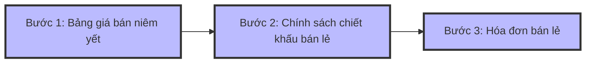
```mermaid
graph LR
    A[Bước 1: Bảng giá bán niêm yết] --> B[Bước 2: Chính sách chiết khấu bán lẻ]
    B --> C[Bước 3: Hóa đơn bán lẻ]

    style A fill:#bbf,stroke:#333,stroke-width:3px
    style B fill:#bbf,stroke:#333,stroke-width:3px
    style C fill:#bbf,stroke:#333,stroke-width:3px
```

#### Bước 1: Bảng giá bán niêm yết

**Giống Bán buôn Bước 2** (dùng chung bảng giá)

---

#### Bước 2: Chính sách chiết khấu bán lẻ

**Mục đích:** Cập nhật tỷ lệ chiết khấu cho khách lẻ theo từng mặt hàng.

**Khác biệt với Bán buôn:**
- ❌ **Không** chỉ định đối tượng (áp dụng chung cho tất cả khách lẻ)
- ✅ Áp dụng theo mặt hàng (Item-based, không phân biệt khách hàng)

**Thông tin chi tiết:**
- Mã hàng hóa
- Tên hàng hóa
- Tỷ lệ chiết khấu (%)

---

#### Bước 3: Hóa đơn bán lẻ

**Mục đích:** Nhân viên bán hàng tại cửa hàng thực hiện lập phiếu bán hàng cho KH.

**Thông tin chi tiết (về giá):**
- Số bảng giá
- Số chính sách chiết khấu
- Đơn giá
- Thành tiền
- Tiền chiết khấu theo chính sách
- **Tỷ lệ chiết khấu đặc biệt** (manual override)
- Tiền chiết khấu đặc biệt

**Công thức tính:**
```
Tiền chiết khấu đặc biệt =
  (Tiền hàng trước chiết khấu - Tiền chiết khấu theo chính sách)
  × Tỷ lệ chiết khấu đặc biệt
```

**Đặc điểm:**
- ✅ Hỗ trợ **POS** (Point of Sale)
- ✅ Xuất hóa đơn điện tử
- ✅ Thanh toán thẻ
- ✅ Chiết khấu đặc biệt (manual discount)

---

### 2.3. So sánh Bán buôn vs Bán lẻ

| Tiêu chí | Bán buôn (Wholesale) | Bán lẻ (Retail) |
|----------|----------------------|-----------------|
| **Quy trình** | 12 bước | 3 bước |
| **Bảng giá** | Có (riêng hoặc chung) | Có (chung với sỉ) |
| **Chính sách chiết khấu** | **Theo khách hàng/nhóm KH** | **Áp dụng chung** |
| **Đối tượng áp dụng** | Cụ thể (Customer/Group) | Generic (tất cả) |
| **Đơn hàng** | Sales Order → Delivery → Invoice | POS Invoice (1 bước) |
| **Kiểm tra hạn mức** | ✅ Bắt buộc | ❌ Không cần |
| **Công nợ quá hạn** | ✅ Kiểm tra | ❌ Không cần |
| **Chiết khấu đặc biệt** | Thường không | ✅ Có (manual) |
| **File đính kèm** | ✅ Có (quyết định giá) | ❌ Không cần |
| **Seri/Lô** | ✅ Theo dõi | ✅ Theo dõi |

---

### 2.4. Yêu cầu đặc biệt từ khách hàng

#### A. Phân biệt rõ Sỉ/Lẻ

**Nguồn:** `FEATURE_SPECIFICATION.md` (Section 5.1 - Line 393)

```markdown
**Loại danh sách:**
- Danh sách đơn vật dụng (bán lẻ, bán buôn) - Tách riêng để tránh nhầm lẫn
- Đơn fitting
- Đơn coaching
- Đơn thu cũ đổi mới
```

**Hiển thị cột:**
- Loại đơn (Lẻ/Sỉ)

**Filter:**
- Filter theo: Loại đơn (Lẻ/Sỉ)

**Dashboard:**
- Doanh số bán sỉ (Đơn hàng từ khách sỉ)
- Doanh số bán lẻ tổng

**Báo cáo:**
- Theo đơn sỉ/lẻ

---

#### B. Bảng giá áp dụng cho khách hàng

**Nguồn:** `FEATURE_SPECIFICATION.md` (Section 3.2 - Line 154, Section 4.1 - Line 234)

**Lead:**
- Bảng giá áp dụng

**Customer:**
- Loại khách hàng (Lẻ/Sỉ)
- Bảng giá áp dụng
- Bảng giá đang áp dụng

**Yêu cầu:**
- Mỗi khách hàng có thể có bảng giá riêng
- Bảng giá có thể áp dụng cho nhóm khách hàng (tags)
- Bảng giá có thời hạn áp dụng

---

#### C. File đính kèm quyết định giá

**Yêu cầu:**
- ✅ Bảng giá bán niêm yết → Đính kèm file quyết định giá
- ✅ Chính sách chiết khấu → Đính kèm file

**Use case:**
- Giám đốc phê duyệt bảng giá → Scan file ký → Upload vào hệ thống
- Chính sách chiết khấu được phê duyệt → Đính kèm file công văn

---

#### D. Cảnh báo giá khác bảng giá

**Nguồn:** `ERP_SPECIFICATION.md` (Bước 9: Hóa đơn bán buôn)

**Tính năng:**
> ⚠️ **Cảnh báo nếu giá bán trên lệnh xuất khác với giá bán trên hóa đơn**

**Use case:**
- NVKD lập lệnh xuất hàng với giá 100,000 VND
- Kế toán xuất hóa đơn, bảng giá mới hiệu lực → giá 95,000 VND
- Hệ thống cảnh báo chênh lệch

---

## 3. Cơ chế Pricing của ERPNext

### 3.1. Kiến trúc Pricing System

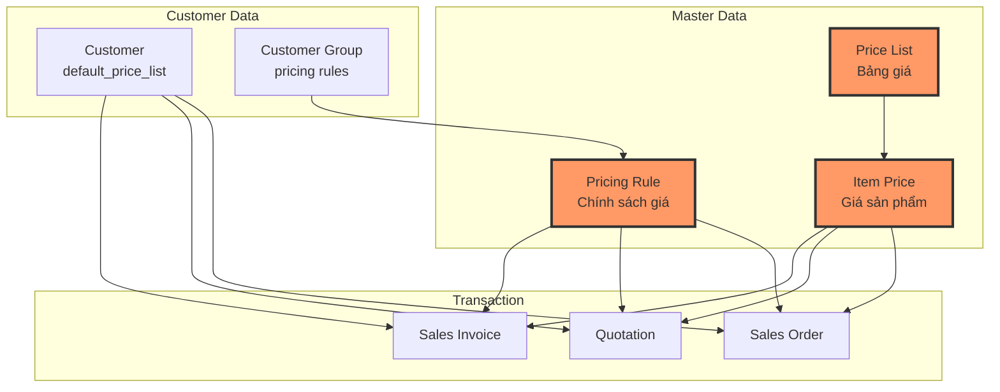
```mermaid
graph TB
    subgraph "Master Data"
        PL[Price List<br/>Bảng giá]
        IP[Item Price<br/>Giá sản phẩm]
        PR[Pricing Rule<br/>Chính sách giá]
    end

    subgraph "Transaction"
        SO[Sales Order]
        QT[Quotation]
        SI[Sales Invoice]
    end

    subgraph "Customer Data"
        CU[Customer<br/>default_price_list]
        CG[Customer Group<br/>pricing rules]
    end

    PL --> IP
    IP --> SO
    IP --> QT
    IP --> SI
    CU --> SO
    CU --> QT
    CU --> SI
    PR --> SO
    PR --> QT
    PR --> SI
    CG --> PR

    style PL fill:#f96,stroke:#333,stroke-width:3px
    style IP fill:#f96,stroke:#333,stroke-width:3px
    style PR fill:#f96,stroke:#333,stroke-width:3px
```

---

### 3.2. Price List (Bảng giá)

**DocType:** `Price List`
**File:** `dcnet_core/erpnext/stock/doctype/price_list/`

**Định nghĩa:**
> Price List = Container chứa tập hợp giá cho các sản phẩm
>
> Ví dụ: "Bảng giá bán buôn 2026", "Bảng giá bán lẻ Q1/2026"

**Key Fields:**

| Field | Type | Mô tả | Ví dụ |
|-------|------|-------|-------|
| `price_list_name` | Data | Tên bảng giá (unique) | "Wholesale Prices VND 2026" |
| `currency` | Link | Tiền tệ | VND |
| `buying` | Check | Áp dụng cho Mua hàng | 0 |
| `selling` | Check | Áp dụng cho Bán hàng | 1 |
| `price_not_uom_dependent` | Check | Giá cố định (không phụ thuộc UOM) | 0 |
| `enabled` | Check | Trạng thái | 1 |
| `countries` | Table | Quốc gia áp dụng | Vietnam |

**Workflow:**

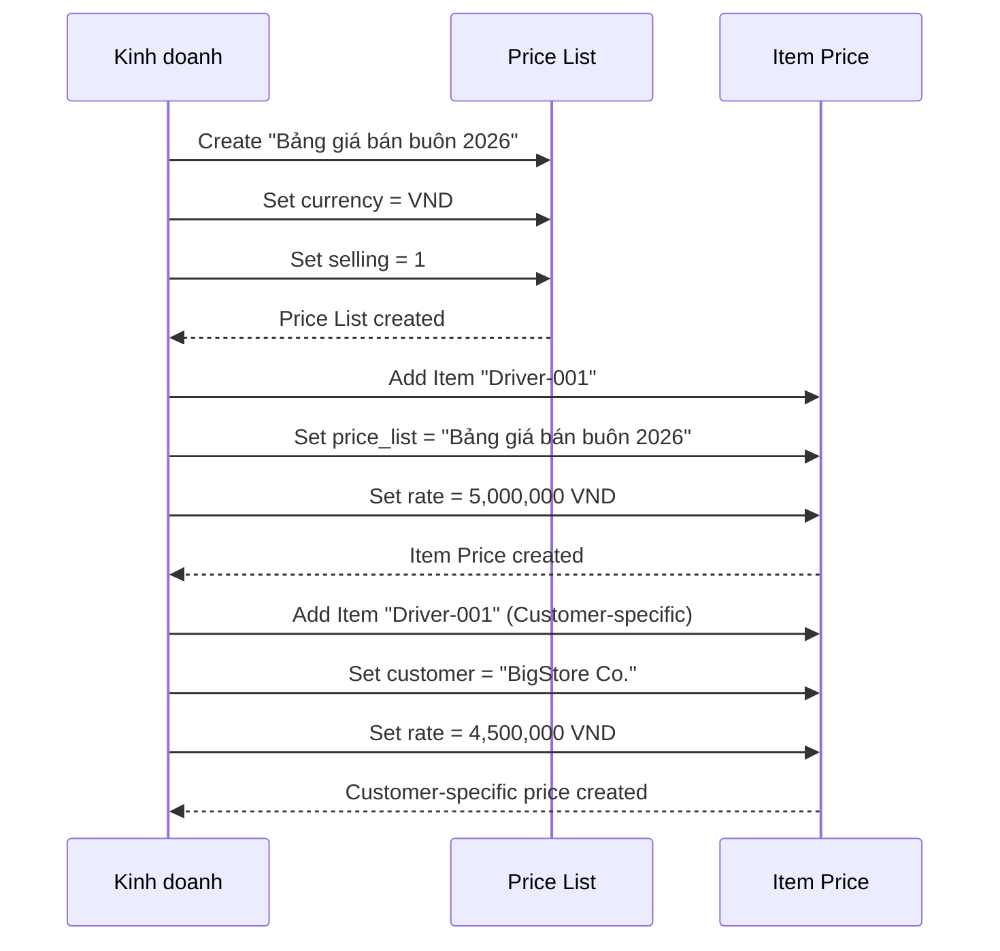
```mermaid
sequenceDiagram
    participant User as Kinh doanh
    participant PL as Price List
    participant IP as Item Price

    User->>PL: Create "Bảng giá bán buôn 2026"
    User->>PL: Set currency = VND
    User->>PL: Set selling = 1
    PL-->>User: Price List created

    User->>IP: Add Item "Driver-001"
    User->>IP: Set price_list = "Bảng giá bán buôn 2026"
    User->>IP: Set rate = 5,000,000 VND
    IP-->>User: Item Price created

    User->>IP: Add Item "Driver-001" (Customer-specific)
    User->>IP: Set customer = "BigStore Co."
    User->>IP: Set rate = 4,500,000 VND
    IP-->>User: Customer-specific price created
```

**Code Reference:**
- File: `dcnet_core/erpnext/stock/doctype/price_list/price_list.py`
- Function: `get_price_list_details(price_list, company)` (line 27-40)
- Purpose: Cache và trả về thông tin bảng giá (currency, enabled, etc.)

---

### 3.3. Item Price (Giá sản phẩm)

**DocType:** `Item Price`
**File:** `dcnet_core/erpnext/stock/doctype/item_price/`

**Định nghĩa:**
> Item Price = Giá cụ thể của 1 sản phẩm trong 1 bảng giá
>
> **Hỗ trợ:** Giá theo khách hàng, theo UOM, theo batch, theo thời gian

**Key Fields:**

| Field | Type | Required | Mô tả |
|-------|------|----------|-------|
| `item_code` | Link | ✅ | Mã sản phẩm |
| `price_list` | Link | ✅ | Bảng giá áp dụng |
| `price_list_rate` | Currency | ✅ | Giá (số tiền) |
| `uom` | Link | ✅ | Đơn vị tính |
| `customer` | Link | ❌ | Khách hàng cụ thể (optional) |
| `supplier` | Link | ❌ | Nhà cung cấp cụ thể (optional) |
| `batch_no` | Link | ❌ | Mã lô cụ thể (optional) |
| `packing_unit` | Int | ❌ | Đơn vị đóng gói tối thiểu |
| `valid_from` | Date | ❌ | Ngày bắt đầu hiệu lực |
| `valid_upto` | Date | ❌ | Ngày hết hiệu lực |
| `lead_time_days` | Int | ❌ | Thời gian giao hàng (ngày) |
| `note` | Text | ❌ | Ghi chú |

**Priority Order (khi lookup giá):**

```
1. Customer/Supplier-specific prices (cao nhất)
   └─ Item Price có customer = "BigStore Co."

2. UOM-specific prices
   └─ Item Price có uom = "Box" (priority cao hơn generic)

3. Batch-specific prices (nếu bắt buộc)
   └─ Item Price có batch_no = "LOT-2026-001"

4. Generic prices (fallback)
   └─ Item Price không có customer/supplier

5. Stock UOM prices (last resort)
   └─ Chuyển đổi từ stock UOM nếu cần
```

**Code Reference:**
- File: `dcnet_core/erpnext/stock/get_item_details.py`
- Function: `get_item_price()` (line 1040-1089)
- Logic: Tìm kiếm Item Price với filters (customer, price_list, uom, transaction_date)

---

### 3.4. Pricing Rule (Chính sách giá/Chiết khấu)

**DocType:** `Pricing Rule`
**File:** `dcnet_core/erpnext/accounts/doctype/pricing_rule/`

**Định nghĩa:**
> Pricing Rule = Quy tắc tự động áp dụng discount/margin/free items
>
> **3 Trục chính:**
> - **APPLY ON:** Áp dụng lên gì? (Item Code, Item Group, Brand, Transaction)
> - **APPLICABLE FOR:** Ai được hưởng? (Customer, Customer Group, Territory, Campaign)
> - **PRICE OR PRODUCT DISCOUNT:** Giảm giá hay tặng hàng?

**A. APPLY ON - Áp dụng lên đối tượng nào?**

| Option | Mô tả | Use Case |
|--------|-------|----------|
| `Item Code` | Sản phẩm cụ thể | Giảm giá cho "Driver TaylorMade M6" |
| `Item Group` | Nhóm sản phẩm | Giảm giá toàn bộ "Gậy Driver" |
| `Brand` | Thương hiệu | Giảm giá tất cả sản phẩm "Callaway" |
| `Transaction` | Toàn đơn hàng | Giảm 5% tổng đơn nếu > 50,000,000 VND |

**B. APPLICABLE FOR - Ai được hưởng?**

| Option | Mô tả | Use Case |
|--------|-------|----------|
| `Customer` | Khách hàng cụ thể | "BigStore Co." được giảm 10% |
| `Customer Group` | Nhóm khách hàng | Nhóm "Wholesale" được giảm 15% |
| `Territory` | Khu vực địa lý | Hà Nội được giảm 5% |
| `Sales Partner` | Đối tác kênh | Đại lý "ABC Golf" được giảm 12% |
| `Campaign` | Chiến dịch marketing | "Summer Sale 2026" giảm 20% |

**C. PRICE OR PRODUCT DISCOUNT - Loại khuyến mãi?**

#### C1. Price Discount (Giảm giá)

| Field | Type | Mô tả | Ví dụ |
|-------|------|-------|-------|
| `rate` | Currency | Giá cố định override | 4,000,000 VND (thay vì 5,000,000) |
| `discount_percentage` | Percent | % giảm giá | 15% |
| `discount_amount` | Currency | Số tiền giảm cố định | 500,000 VND |
| `margin_type` | Select | Loại margin | "Percentage" hoặc "Amount" |
| `margin_rate_or_amount` | Float | Giá trị margin | 20% hoặc 1,000,000 VND |

#### C2. Product Discount (Tặng hàng)

| Field | Type | Mô tả | Ví dụ |
|-------|------|-------|-------|
| `same_item` | Check | Tặng cùng sản phẩm | Buy 10 get 1 free |
| `free_item` | Link | Tặng sản phẩm khác | Mua Driver → Tặng Golf Bag |
| `free_qty` | Float | Số lượng tặng | 2 |
| `is_recursive` | Check | Lặp lại theo chu kỳ | Mỗi 5 cái tặng 1 |
| `recurse_for` | Int | Chu kỳ lặp | 5 |

**D. Điều kiện áp dụng (Filters)**

| Field | Mô tả | Ví dụ |
|-------|-------|-------|
| `min_qty` | Số lượng tối thiểu | 50 |
| `max_qty` | Số lượng tối đa | 199 |
| `min_amt` | Giá trị đơn tối thiểu | 10,000,000 VND |
| `max_amt` | Giá trị đơn tối đa | 50,000,000 VND |
| `valid_from` | Ngày bắt đầu | 01/01/2026 |
| `valid_upto` | Ngày kết thúc | 31/12/2026 |
| `priority` | Ưu tiên (1-20) | 5 (cao hơn = áp dụng trước) |
| `apply_multiple_pricing_rules` | Stack nhiều rules | 1 (cho phép) |
| `condition` | Python expression | `territory != 'All Territories'` |

**Code Reference:**
- File: `dcnet_core/erpnext/accounts/doctype/pricing_rule/pricing_rule.py`
- Function: `apply_pricing_rule()` (line 81-184)
- Function: `get_pricing_rule_for_item()` (line 223-371)

---

### 3.5. Workflow: Xác định giá trong Sales Order

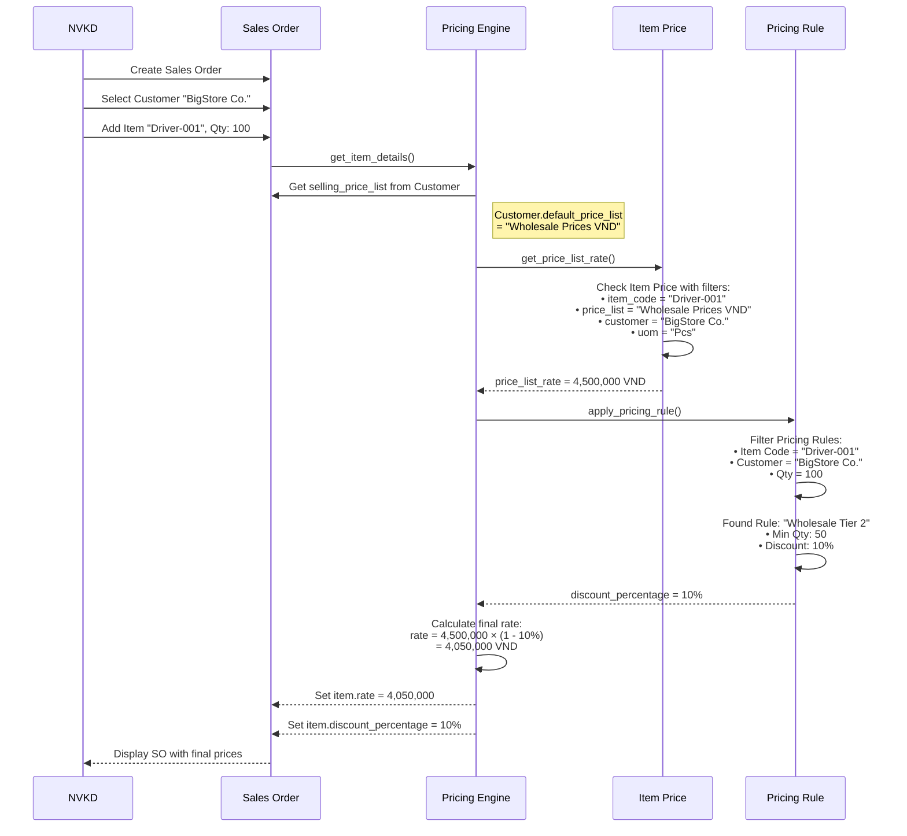
```mermaid
sequenceDiagram
    participant User as NVKD
    participant SO as Sales Order
    participant System as Pricing Engine
    participant IP as Item Price
    participant PR as Pricing Rule

    User->>SO: Create Sales Order
    User->>SO: Select Customer "BigStore Co."
    User->>SO: Add Item "Driver-001", Qty: 100

    SO->>System: get_item_details()

    System->>SO: Get selling_price_list from Customer
    Note right of System: Customer.default_price_list<br/>= "Wholesale Prices VND"

    System->>IP: get_price_list_rate()
    IP->>IP: Check Item Price with filters:<br/>• item_code = "Driver-001"<br/>• price_list = "Wholesale Prices VND"<br/>• customer = "BigStore Co."<br/>• uom = "Pcs"
    IP-->>System: price_list_rate = 4,500,000 VND

    System->>PR: apply_pricing_rule()
    PR->>PR: Filter Pricing Rules:<br/>• Item Code = "Driver-001"<br/>• Customer = "BigStore Co."<br/>• Qty = 100
    PR->>PR: Found Rule: "Wholesale Tier 2"<br/>• Min Qty: 50<br/>• Discount: 10%
    PR-->>System: discount_percentage = 10%

    System->>System: Calculate final rate:<br/>rate = 4,500,000 × (1 - 10%)<br/>= 4,050,000 VND

    System-->>SO: Set item.rate = 4,050,000
    System-->>SO: Set item.discount_percentage = 10%
    SO-->>User: Display SO with final prices
```

**Step-by-step:**

1. **User Action:** NVKD tạo Sales Order, chọn Customer
2. **Get Price List:** System lấy `default_price_list` từ Customer
3. **Get Base Price:** Query `Item Price` với filters (item, price_list, customer, uom)
4. **Apply Pricing Rules:**
   - Filter rules theo customer/group, item, qty, amount
   - Apply discount/margin/free items
5. **Calculate Final Rate:**
   - `final_rate = price_list_rate × (1 - discount%) + margin`
6. **Return:** Set giá vào Sales Order Item

**Code Reference:**
- File: `dcnet_core/erpnext/stock/get_item_details.py`
- Function: `get_item_details()` (line 59-368) - Main entry point
- Function: `get_price_list_rate()` (line 998-1038) - Get base price
- File: `dcnet_core/erpnext/accounts/doctype/pricing_rule/pricing_rule.py`
- Function: `apply_pricing_rule()` (line 81-184) - Apply rules

---

### 3.6. Hierarchy & Priority

**Khi có nhiều Pricing Rules cùng áp dụng:**

```
Priority Chain (Highest → Lowest):

1. Pricing Rule Priority (field: priority)
   └─ Rule có priority = 10 > Rule có priority = 5

2. Specificity (Customer > Customer Group > Generic)
   └─ Rule cho "BigStore Co." > Rule cho "Wholesale Group"

3. Quantity/Amount Match
   └─ Rule có min_qty = 100 > Rule có min_qty = 50 (khi qty = 100)

4. Date Validity
   └─ Rule còn hiệu lực (valid_from ≤ today ≤ valid_upto)

5. Apply On Hierarchy
   └─ Item Code > Item Group > Brand > Transaction
```

**apply_multiple_pricing_rules:**
- **0 (default):** Chỉ áp dụng 1 rule (highest priority)
- **1:** Stack nhiều rules (tính discount lồng nhau)

**Ví dụ Stack Rules:**

```
Base Price: 5,000,000 VND

Rule 1 (Priority 10): Customer Group "Wholesale" → Discount 10%
  → Price = 5,000,000 × 0.9 = 4,500,000 VND

Rule 2 (Priority 5): Item Group "Drivers" → Discount 5%
  → Price = 4,500,000 × 0.95 = 4,275,000 VND

Final Price: 4,275,000 VND (Total discount: 14.5%)
```

---

## 4. Gap Analysis: Yêu cầu vs ERPNext

### 4.1. Bảng giá bán niêm yết

| Yêu cầu khách hàng | ERPNext Capability | Gap | Đánh giá |
|--------------------|--------------------|-----|----------|
| Tên bảng giá | `Price List.price_list_name` | ✅ Có | 100% |
| Ngày hiệu lực | `Item Price.valid_from` | ✅ Có | 100% |
| Số bảng giá | Custom field | 🔧 Cần thêm | 90% |
| Người lập | `Price List.owner` (auto) | ✅ Có | 100% |
| Nội dung | `Price List.description` | ✅ Có | 100% |
| Mã hàng hóa | `Item Price.item_code` | ✅ Có | 100% |
| Giá bán | `Item Price.price_list_rate` | ✅ Có | 100% |
| Ghi chú | `Item Price.note` | ✅ Có | 100% |
| **Đính kèm file quyết định giá** | Frappe Attachment system | ✅ Có | 100% |

**Kết luận:**
> ✅ **ERPNext đáp ứng 95% yêu cầu Bảng giá**
>
> Chỉ cần thêm custom field "Số bảng giá" (number sequence) nếu khách hàng yêu cầu.

**Mapping:**

```python
# DCNET Requirement → ERPNext Field
"Số bảng giá"      → Price List.custom_price_list_number
"Ngày hiệu lực"    → Item Price.valid_from
"Người lập"        → Price List.owner (auto-filled)
"Nội dung"         → Price List.description
"Mã hàng hóa"      → Item Price.item_code
"Tên hàng hóa"     → Item.item_name (via link)
"Giá bán"          → Item Price.price_list_rate
"Ghi chú"          → Item Price.note
```

**Đính kèm file:**
- ERPNext có sẵn Attachment system
- File được lưu trong `tabFile` (DocType: File)
- Link với Price List qua `attached_to_doctype` + `attached_to_name`

---

### 4.2. Chính sách chiết khấu bán buôn

| Yêu cầu khách hàng | ERPNext Capability | Gap | Đánh giá |
|--------------------|--------------------|-----|----------|
| Ngày áp dụng | `Pricing Rule.valid_from` | ✅ Có | 100% |
| Đối tượng (KH/Nhóm) | `Pricing Rule.customer` hoặc `customer_group` | ✅ Có | 100% |
| Nội dung | `Pricing Rule.title` + `description` | ✅ Có | 100% |
| Mã hàng hóa | `Pricing Rule Item Code` (table) | ✅ Có | 100% |
| Tỷ lệ chiết khấu (%) | `Pricing Rule.discount_percentage` | ✅ Có | 100% |
| **Đính kèm file** | Frappe Attachment system | ✅ Có | 100% |
| Số chính sách | Custom field | 🔧 Cần thêm | 90% |

**Kết luận:**
> ✅ **ERPNext đáp ứng 95% yêu cầu Chiết khấu bán buôn**
>
> Pricing Rule hỗ trợ đầy đủ: Customer-specific, Group-based, Item-based, Time-based.

**Mapping:**

```python
# DCNET Requirement → ERPNext Field
"Số chính sách"         → Pricing Rule.custom_policy_number
"Ngày áp dụng"          → Pricing Rule.valid_from
"Đối tượng"             → Pricing Rule.customer / customer_group
"Nội dung"              → Pricing Rule.title + description
"Mã hàng hóa"           → Pricing Rule Item Code (child table)
"Tên hàng hóa"          → Item.item_name (via link)
"Tỷ lệ chiết khấu (%)"  → Pricing Rule.discount_percentage
```

**Ví dụ Pricing Rule:**

```json
{
  "doctype": "Pricing Rule",
  "title": "Chính sách CK Wholesale Q1/2026",
  "custom_policy_number": "CSKH-2026-001",
  "apply_on": "Item Code",
  "applicable_for": "Customer Group",
  "customer_group": "Wholesale",
  "items": [
    {"item_code": "Driver-001"},
    {"item_code": "Driver-002"}
  ],
  "price_or_product_discount": "Price",
  "discount_percentage": 15,
  "valid_from": "2026-01-01",
  "valid_upto": "2026-03-31"
}
```

---

### 4.3. Chính sách chiết khấu bán lẻ

| Yêu cầu khách hàng | ERPNext Capability | Gap | Đánh giá |
|--------------------|--------------------|-----|----------|
| Ngày áp dụng | `Pricing Rule.valid_from` | ✅ Có | 100% |
| **Áp dụng chung (không chỉ định KH)** | `Pricing Rule.applicable_for` = blank | ✅ Có | 100% |
| Mã hàng hóa | `Pricing Rule Item Code` (table) | ✅ Có | 100% |
| Tỷ lệ chiết khấu (%) | `Pricing Rule.discount_percentage` | ✅ Có | 100% |

**Khác biệt với Bán buôn:**

```python
# Bán buôn (Customer-specific)
Pricing Rule:
  applicable_for = "Customer Group"
  customer_group = "Wholesale"

# Bán lẻ (Generic)
Pricing Rule:
  applicable_for = ""  # Blank = Apply to all
  # HOẶC
  applicable_for = "Customer Group"
  customer_group = "Retail"
```

**Kết luận:**
> ✅ **ERPNext đáp ứng 100% yêu cầu Chiết khấu bán lẻ**

---

### 4.4. Phân biệt Sỉ/Lẻ

| Yêu cầu khách hàng | ERPNext Capability | Gap | Đánh giá |
|--------------------|--------------------|-----|----------|
| **Loại đơn (Lẻ/Sỉ)** | Custom field on Sales Order | 🔧 Cần thêm | 80% |
| **Tách riêng danh sách** | Filter by custom field | 🔧 Cần config | 80% |
| **Dashboard phân biệt** | Custom Report/Chart | 🔧 Cần build | 70% |
| **Báo cáo theo Sỉ/Lẻ** | Custom Report | 🔧 Cần build | 70% |

**ERPNext không có built-in "Wholesale/Retail Mode"**

**Các cách phân biệt:**

#### Option 1: Customer Group (Recommended)

```python
Customer:
  customer_group = "Wholesale"  # → Đơn sỉ
  customer_group = "Retail"     # → Đơn lẻ

Sales Order:
  customer → Customer.customer_group → Auto-detect Sỉ/Lẻ
```

**Ưu điểm:**
- ✅ Tự động phân loại dựa trên khách hàng
- ✅ Có sẵn trong ERPNext
- ✅ Hỗ trợ Pricing Rule theo group

**Nhược điểm:**
- ❌ Không có field "Loại đơn" rõ ràng trên Sales Order

---

#### Option 2: Custom Field "Loại đơn" (Recommended for DCNET)

```python
# Add custom field to Sales Order
Sales Order:
  custom_order_type = "Wholesale" / "Retail"

# Auto-set based on Customer Group
frappe.ui.form.on('Sales Order', {
  customer: function(frm) {
    frappe.db.get_value('Customer', frm.doc.customer, 'customer_group')
      .then(r => {
        if (r.message.customer_group == 'Wholesale') {
          frm.set_value('custom_order_type', 'Wholesale');
        } else {
          frm.set_value('custom_order_type', 'Retail');
        }
      });
  }
});
```

**Ưu điểm:**
- ✅ Rõ ràng, dễ filter
- ✅ Hỗ trợ báo cáo, dashboard
- ✅ Có thể override manual nếu cần

**Nhược điểm:**
- 🔧 Cần customize (thêm field + logic)

---

#### Option 3: Quantity-Based Tier

```python
Pricing Rule 1: "Retail Tier"
  min_qty = 1
  max_qty = 49
  → Considered as Retail

Pricing Rule 2: "Wholesale Tier"
  min_qty = 50
  → Considered as Wholesale
```

**Ưu điểm:**
- ✅ Tự động dựa trên số lượng
- ✅ Không cần phân loại khách hàng

**Nhược điểm:**
- ❌ Không chính xác (1 khách lẻ mua 100 cái → coi như sỉ?)
- ❌ Không hỗ trợ báo cáo rõ ràng

---

**Khuyến nghị cho DCNET:**

> ✅ **Sử dụng Option 1 + Option 2 kết hợp:**
> 1. Phân loại Customer Group: "Wholesale" / "Retail"
> 2. Thêm custom field `custom_order_type` trên Sales Order
> 3. Auto-set dựa trên Customer Group
> 4. Cho phép override manual nếu cần

---

### 4.5. Hạn mức công nợ

| Yêu cầu khách hàng | ERPNext Capability | Gap | Đánh giá |
|--------------------|--------------------|-----|----------|
| **Hạn mức công nợ theo KH** | `Customer.credit_limits` (table) | ✅ Có | 90% |
| **Kiểm tra khi lập lệnh xuất** | `validate_credit_limit()` | ✅ Có | 85% |
| **Công nợ quá hạn** | Custom logic | 🔧 Cần build | 70% |
| **Cảnh báo ngoại lệ** | Custom override | 🔧 Cần build | 70% |
| **Hiển thị số dư, công nợ dự kiến** | Custom dashboard | 🔧 Cần build | 70% |

**ERPNext Credit Limit:**

```python
Customer:
  credit_limits = [
    {
      "company": "DCNET Corporation",
      "credit_limit": 100000000  # 100 triệu VND
    }
  ]

Selling Settings:
  check_customer_credit_limit = 1  # Enable credit check
```

**Validation Logic:**

```python
# File: dcnet_core/erpnext/selling/doctype/customer/customer.py
def validate_credit_limit(customer, company):
    outstanding_amt = get_customer_outstanding(customer, company)
    credit_limit = get_credit_limit(customer, company)

    if outstanding_amt > credit_limit:
        frappe.throw("Credit Limit Exceeded")
```

**Yêu cầu bổ sung của DCNET:**

> **Điều kiện xuất hàng hợp lệ:**
> 1. Khách hàng không có hóa đơn quá hạn
> 2. Công nợ hiện tại + Lệnh xuất đã duyệt chưa xuất + Lệnh xuất hiện tại ≤ Hạn mức
>
> **Xử lý ngoại lệ:** Nếu không thỏa mãn → Kế toán trưởng phải xác nhận

**Gap:**
- ERPNext chỉ check tổng công nợ, không check hóa đơn quá hạn
- Cần custom logic để:
  - ✅ Check overdue invoices
  - ✅ Tính công nợ dự kiến (pending delivery notes)
  - ✅ Workflow approval cho ngoại lệ

---

### 4.6. File đính kèm quyết định giá

| Yêu cầu khách hàng | ERPNext Capability | Gap | Đánh giá |
|--------------------|--------------------|-----|----------|
| **Đính kèm file vào Price List** | Frappe Attachment | ✅ Có | 100% |
| **Đính kèm file vào Pricing Rule** | Frappe Attachment | ✅ Có | 100% |
| **Hiển thị file trong form** | Attachment viewer | ✅ Có | 100% |
| **Upload/Download** | Built-in | ✅ Có | 100% |

**ERPNext Attachment System:**

```python
# Upload file
frappe.attach_file(
    file_name="Quyet_dinh_gia_Q1_2026.pdf",
    file_url="/private/files/quyet_dinh_gia.pdf",
    doctype="Price List",
    docname="Wholesale Prices VND 2026"
)

# Get attachments
attachments = frappe.get_all("File", filters={
    "attached_to_doctype": "Price List",
    "attached_to_name": "Wholesale Prices VND 2026"
})
```

**Kết luận:**
> ✅ **ERPNext hỗ trợ 100% yêu cầu đính kèm file**

---

### 4.7. Cảnh báo giá khác bảng giá

| Yêu cầu khách hàng | ERPNext Capability | Gap | Đánh giá |
|--------------------|--------------------|-----|----------|
| **Cảnh báo giá lệnh xuất ≠ giá hóa đơn** | Custom validation | 🔧 Cần build | 70% |

**Yêu cầu:**
> Cảnh báo nếu giá bán trên lệnh xuất khác với giá bán trên hóa đơn

**Use case:**
1. NVKD lập Delivery Note với giá 100,000 VND
2. Kế toán xuất Sales Invoice sau 3 ngày
3. Trong 3 ngày này, bảng giá mới hiệu lực → giá 95,000 VND
4. Hệ thống cảnh báo chênh lệch 5,000 VND

**Custom Logic:**

```python
# File: dcnet_apps/dcnet_apps/sales_invoice_custom.py
def validate(self):
    for item in self.items:
        if item.delivery_note:
            dn_rate = get_delivery_note_rate(item.delivery_note, item.item_code)
            if abs(item.rate - dn_rate) > 0.01:
                frappe.msgprint(
                    f"Warning: Price mismatch for {item.item_code}<br>"
                    f"Delivery Note rate: {dn_rate}<br>"
                    f"Invoice rate: {item.rate}",
                    indicator='orange',
                    alert=True
                )
```

---

### 4.8. Tổng kết Gap Analysis

| Category | Đáp ứng | Gap | Priority |
|----------|---------|-----|----------|
| **Bảng giá niêm yết** | 95% | Custom field "Số bảng giá" | 🟡 Medium |
| **Chiết khấu bán buôn** | 95% | Custom field "Số chính sách" | 🟡 Medium |
| **Chiết khấu bán lẻ** | 100% | None | ✅ Ready |
| **Phân biệt Sỉ/Lẻ** | 80% | Custom field + Logic | 🔴 High |
| **Hạn mức công nợ** | 85% | Check hóa đơn quá hạn, Approval workflow | 🔴 High |
| **File đính kèm** | 100% | None | ✅ Ready |
| **Cảnh báo giá** | 70% | Custom validation | 🟡 Medium |

**Tổng kết:**
> ✅ **ERPNext đáp ứng 85-90% yêu cầu về Pricing**
>
> 🔧 **Cần customize:** 10-15% (chủ yếu về phân biệt Sỉ/Lẻ và Credit Management)

---

## 5. Workflow chi tiết

### 5.1. Workflow Bán buôn

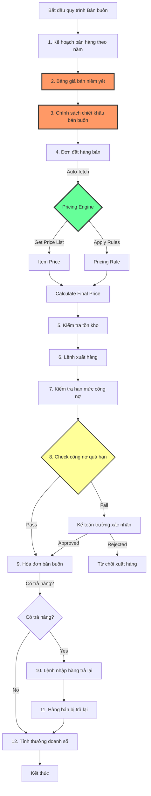
```mermaid
graph TD
    Start[Bắt đầu quy trình Bán buôn] --> Step1[1. Kế hoạch bán hàng theo năm]
    Step1 --> Step2[2. Bảng giá bán niêm yết]
    Step2 --> Step3[3. Chính sách chiết khấu bán buôn]

    Step3 --> Step4[4. Đơn đặt hàng bán]
    Step4 --> |Auto-fetch| PriceEngine{Pricing Engine}

    PriceEngine --> |Get Price List| IP[Item Price]
    PriceEngine --> |Apply Rules| PR[Pricing Rule]
    IP --> CalcPrice[Calculate Final Price]
    PR --> CalcPrice
    CalcPrice --> Step5[5. Kiểm tra tồn kho]

    Step5 --> Step6[6. Lệnh xuất hàng]
    Step6 --> Step7[7. Kiểm tra hạn mức công nợ]
    Step7 --> Step8{8. Check công nợ quá hạn}

    Step8 --> |Pass| Step9[9. Hóa đơn bán buôn]
    Step8 --> |Fail| Approval[Kế toán trưởng xác nhận]
    Approval --> |Approved| Step9
    Approval --> |Rejected| Reject[Từ chối xuất hàng]

    Step9 --> |Có trả hàng?| Return{Có trả hàng?}
    Return --> |Yes| Step10[10. Lệnh nhập hàng trả lại]
    Return --> |No| Step12[12. Tính thưởng doanh số]
    Step10 --> Step11[11. Hàng bán bị trả lại]
    Step11 --> Step12

    Step12 --> End[Kết thúc]

    style Step2 fill:#f96,stroke:#333,stroke-width:3px
    style Step3 fill:#f96,stroke:#333,stroke-width:3px
    style PriceEngine fill:#6f9,stroke:#333,stroke-width:3px
    style Step8 fill:#ff9,stroke:#333,stroke-width:2px
```

---

### 5.2. Workflow Bán lẻ

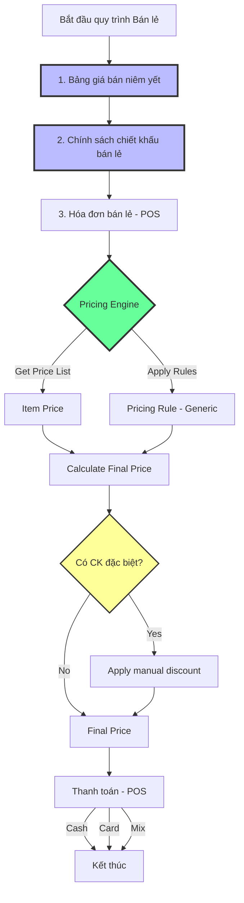
```mermaid
graph TD
    Start[Bắt đầu quy trình Bán lẻ] --> Step1[1. Bảng giá bán niêm yết]
    Step1 --> Step2[2. Chính sách chiết khấu bán lẻ]
    Step2 --> Step3[3. Hóa đơn bán lẻ - POS]

    Step3 --> PriceEngine{Pricing Engine}
    PriceEngine --> |Get Price List| IP[Item Price]
    PriceEngine --> |Apply Rules| PR[Pricing Rule - Generic]
    IP --> CalcPrice[Calculate Final Price]
    PR --> CalcPrice

    CalcPrice --> ManualDiscount{Có CK đặc biệt?}
    ManualDiscount --> |Yes| ApplyManual[Apply manual discount]
    ManualDiscount --> |No| FinalPrice[Final Price]
    ApplyManual --> FinalPrice

    FinalPrice --> Payment[Thanh toán - POS]
    Payment --> |Cash| End[Kết thúc]
    Payment --> |Card| End
    Payment --> |Mix| End

    style Step1 fill:#bbf,stroke:#333,stroke-width:3px
    style Step2 fill:#bbf,stroke:#333,stroke-width:3px
    style PriceEngine fill:#6f9,stroke:#333,stroke-width:3px
    style ManualDiscount fill:#ff9,stroke:#333,stroke-width:2px
```

---

### 5.3. So sánh Workflow Sỉ vs Lẻ

| Step | Bán buôn | Bán lẻ | Khác biệt |
|------|----------|--------|-----------|
| **Bảng giá** | ✅ | ✅ | Dùng chung hoặc riêng |
| **Chiết khấu** | Customer/Group-specific | Generic (apply all) | **Khác biệt chính** |
| **Đơn hàng** | Sales Order (3-way match) | POS Invoice (1 bước) | Quy trình |
| **Kiểm tra tồn** | Manual check | Real-time (POS) | Timing |
| **Hạn mức công nợ** | ✅ Bắt buộc | ❌ Không cần | Credit check |
| **Công nợ quá hạn** | ✅ Check + Approval | ❌ Không cần | Workflow |
| **Chiết khấu đặc biệt** | Không | ✅ Manual override | Flexibility |
| **Payment** | Credit (có công nợ) | Cash/Card (no credit) | Payment term |

---

### 5.4. Pricing Engine Workflow (Chi tiết)

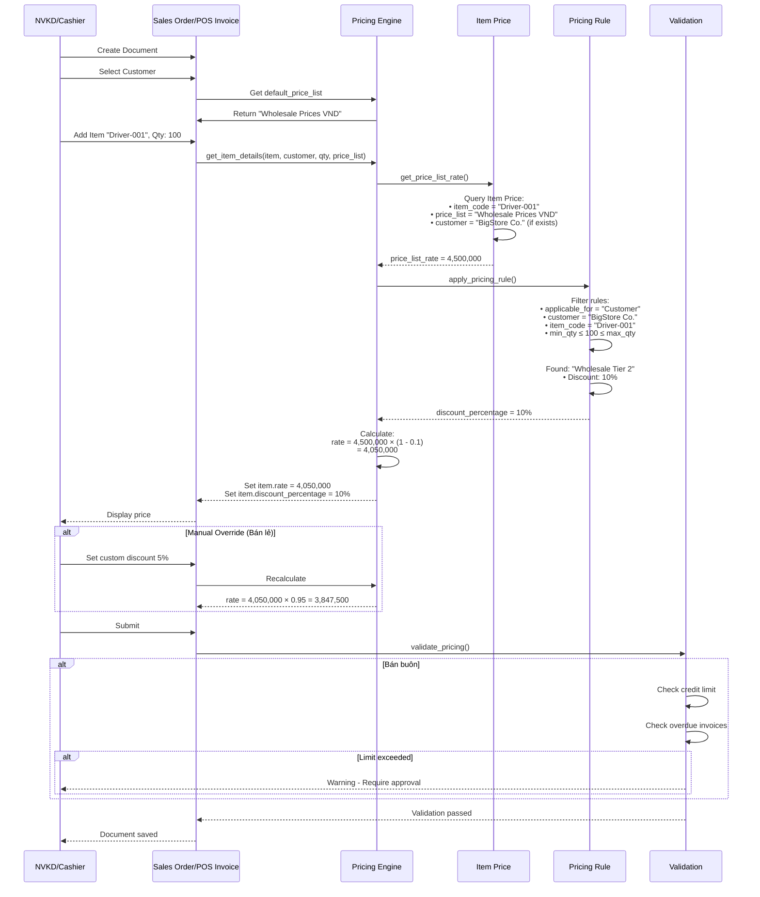
```mermaid
sequenceDiagram
    participant User as NVKD/Cashier
    participant Doc as Sales Order/POS Invoice
    participant Engine as Pricing Engine
    participant IP as Item Price
    participant PR as Pricing Rule
    participant Validate as Validation

    User->>Doc: Create Document
    User->>Doc: Select Customer
    Doc->>Engine: Get default_price_list
    Engine->>Doc: Return "Wholesale Prices VND"

    User->>Doc: Add Item "Driver-001", Qty: 100
    Doc->>Engine: get_item_details(item, customer, qty, price_list)

    Engine->>IP: get_price_list_rate()
    IP->>IP: Query Item Price:<br/>• item_code = "Driver-001"<br/>• price_list = "Wholesale Prices VND"<br/>• customer = "BigStore Co." (if exists)
    IP-->>Engine: price_list_rate = 4,500,000

    Engine->>PR: apply_pricing_rule()
    PR->>PR: Filter rules:<br/>• applicable_for = "Customer"<br/>• customer = "BigStore Co."<br/>• item_code = "Driver-001"<br/>• min_qty ≤ 100 ≤ max_qty
    PR->>PR: Found: "Wholesale Tier 2"<br/>• Discount: 10%
    PR-->>Engine: discount_percentage = 10%

    Engine->>Engine: Calculate:<br/>rate = 4,500,000 × (1 - 0.1)<br/>= 4,050,000
    Engine-->>Doc: Set item.rate = 4,050,000<br/>Set item.discount_percentage = 10%

    Doc-->>User: Display price

    alt Manual Override (Bán lẻ)
        User->>Doc: Set custom discount 5%
        Doc->>Engine: Recalculate
        Engine-->>Doc: rate = 4,050,000 × 0.95 = 3,847,500
    end

    User->>Doc: Submit
    Doc->>Validate: validate_pricing()

    alt Bán buôn
        Validate->>Validate: Check credit limit
        Validate->>Validate: Check overdue invoices
        alt Limit exceeded
            Validate-->>User: Warning - Require approval
        end
    end

    Validate-->>Doc: Validation passed
    Doc-->>User: Document saved
```

---

## 6. Data Mapping

### 6.1. Bảng giá (Price List)

| DCNET Field | ERPNext DocType | ERPNext Field | Type | Note |
|-------------|-----------------|---------------|------|------|
| Số bảng giá | Price List | `custom_price_list_number` | Data | Custom field |
| Tên bảng giá | Price List | `price_list_name` | Data | Unique |
| Ngày hiệu lực | Item Price | `valid_from` | Date | Per-item basis |
| Người lập | Price List | `owner` | Link (User) | Auto |
| Nội dung | Price List | `description` | Text Editor | |
| Tiền tệ | Price List | `currency` | Link | VND |
| Loại | Price List | `selling` / `buying` | Check | |
| Mã hàng hóa | Item Price | `item_code` | Link (Item) | |
| Tên hàng hóa | Item | `item_name` | Data | Via link |
| Giá bán | Item Price | `price_list_rate` | Currency | |
| Ghi chú | Item Price | `note` | Text | |
| File đính kèm | File | `attached_to_doctype` = "Price List" | | System |

**Ví dụ mapping:**

```json
// DCNET: Bảng giá bán buôn Q1/2026
{
  "doctype": "Price List",
  "custom_price_list_number": "BG-2026-001",
  "price_list_name": "Wholesale Prices VND Q1/2026",
  "currency": "VND",
  "selling": 1,
  "description": "Bảng giá bán buôn áp dụng từ 01/01/2026",
  "enabled": 1
}

// DCNET: Chi tiết giá sản phẩm
{
  "doctype": "Item Price",
  "item_code": "DRIVER-TM-M6",
  "price_list": "Wholesale Prices VND Q1/2026",
  "price_list_rate": 4500000,
  "uom": "Pcs",
  "valid_from": "2026-01-01",
  "valid_upto": "2026-03-31",
  "note": "Giá đã bao gồm VAT 10%"
}
```

---

### 6.2. Chính sách chiết khấu (Pricing Rule)

| DCNET Field | ERPNext DocType | ERPNext Field | Type | Note |
|-------------|-----------------|---------------|------|------|
| Số chính sách | Pricing Rule | `custom_policy_number` | Data | Custom field |
| Tên chính sách | Pricing Rule | `title` | Data | |
| Ngày áp dụng | Pricing Rule | `valid_from` | Date | |
| Ngày hết hạn | Pricing Rule | `valid_upto` | Date | Optional |
| Đối tượng | Pricing Rule | `applicable_for` | Select | Customer/Group |
| Khách hàng | Pricing Rule | `customer` | Link | Specific |
| Nhóm KH | Pricing Rule | `customer_group` | Link | Group |
| Nội dung | Pricing Rule | `description` | Text Editor | |
| Áp dụng lên | Pricing Rule | `apply_on` | Select | Item Code/Group |
| Mã hàng hóa | Pricing Rule Item Code | `item_code` | Link (Item) | Child table |
| Nhóm hàng hóa | Pricing Rule Item Group | `item_group` | Link | Child table |
| Tỷ lệ CK (%) | Pricing Rule | `discount_percentage` | Percent | |
| Số lượng tối thiểu | Pricing Rule | `min_qty` | Float | Optional |
| Số lượng tối đa | Pricing Rule | `max_qty` | Float | Optional |
| Giá trị tối thiểu | Pricing Rule | `min_amt` | Currency | Optional |
| File đính kèm | File | `attached_to_doctype` = "Pricing Rule" | | System |

**Ví dụ mapping:**

```json
// DCNET: Chính sách chiết khấu bán buôn
{
  "doctype": "Pricing Rule",
  "custom_policy_number": "CSKH-2026-001",
  "title": "CK Wholesale Drivers Q1/2026",
  "apply_on": "Item Group",
  "applicable_for": "Customer Group",
  "customer_group": "Wholesale",
  "items": [
    {"item_code": "DRIVER-TM-M6"},
    {"item_code": "DRIVER-CALLAWAY-EPIC"}
  ],
  "price_or_product_discount": "Price",
  "discount_percentage": 15,
  "min_qty": 50,
  "valid_from": "2026-01-01",
  "valid_upto": "2026-03-31",
  "description": "Chiết khấu 15% cho khách sỉ mua từ 50 cái trở lên"
}

// DCNET: Chính sách chiết khấu bán lẻ
{
  "doctype": "Pricing Rule",
  "custom_policy_number": "CSKH-2026-002",
  "title": "CK Retail Summer Sale",
  "apply_on": "Item Group",
  "applicable_for": "",  // Generic - Apply to all
  "item_groups": [
    {"item_group": "Drivers"}
  ],
  "price_or_product_discount": "Price",
  "discount_percentage": 5,
  "valid_from": "2026-06-01",
  "valid_upto": "2026-08-31",
  "description": "Chiết khấu 5% cho tất cả khách lẻ mùa hè"
}
```

---

### 6.3. Đơn đặt hàng (Sales Order/POS Invoice)

| DCNET Field | Bán buôn (SO) | Bán lẻ (POS) | ERPNext Field | Type |
|-------------|---------------|--------------|---------------|------|
| Loại đơn | Sales Order | POS Invoice | `custom_order_type` | Select |
| Khách hàng | ✅ | ✅ | `customer` | Link |
| Bảng giá | ✅ | ✅ | `selling_price_list` | Link |
| **Chi tiết hàng hóa:** | | | | |
| Mã hàng | ✅ | ✅ | `item_code` | Link |
| Số lượng | ✅ | ✅ | `qty` | Float |
| Đơn giá trước CK | ✅ | ✅ | `price_list_rate` | Currency |
| Thành tiền trước CK | ✅ | ✅ | `amount` (calc) | Currency |
| Số bảng giá | ✅ | ✅ | `custom_price_list_ref` | Data |
| Số chính sách CK | ✅ | ✅ | `custom_pricing_rule_ref` | Data |
| % chiết khấu | ✅ | ✅ | `discount_percentage` | Percent |
| Tiền chiết khấu | ✅ | ✅ | `discount_amount` (calc) | Currency |
| Thành tiền sau CK | ✅ | ✅ | `amount` (final) | Currency |
| **CK đặc biệt (Lẻ)** | ❌ | ✅ | `additional_discount_percentage` | Percent |
| Tiền CK đặc biệt | ❌ | ✅ | (calc) | Currency |

**Code Reference:**
- Sales Order: `dcnet_core/erpnext/selling/doctype/sales_order/`
- POS Invoice: `dcnet_core/erpnext/accounts/doctype/pos_invoice/`

---

### 6.4. Công thức tính giá

#### Bán buôn (Sales Order)

```python
# Step 1: Get Price List Rate
price_list_rate = get_price_list_rate(
    item_code=item.item_code,
    price_list=doc.selling_price_list,
    customer=doc.customer,
    uom=item.uom
)

# Step 2: Apply Pricing Rule
pricing_rule = get_pricing_rule_for_item(
    item_code=item.item_code,
    customer=doc.customer,
    qty=item.qty,
    transaction_date=doc.transaction_date
)

discount_percentage = pricing_rule.discount_percentage  # e.g., 15%

# Step 3: Calculate Final Rate
rate = price_list_rate * (1 - discount_percentage / 100)

# Step 4: Calculate Amount
amount = rate * qty

# Ví dụ:
# price_list_rate = 5,000,000 VND
# discount_percentage = 15%
# rate = 5,000,000 × (1 - 0.15) = 4,250,000 VND
# qty = 100
# amount = 4,250,000 × 100 = 425,000,000 VND
```

---

#### Bán lẻ (POS Invoice)

```python
# Step 1-3: Giống Bán buôn
rate = price_list_rate * (1 - discount_percentage / 100)

# Step 4: Apply Manual Discount (Chiết khấu đặc biệt)
if additional_discount_percentage:
    rate = rate * (1 - additional_discount_percentage / 100)

# Step 5: Calculate Amount
amount = rate * qty

# Ví dụ:
# price_list_rate = 5,000,000 VND
# discount_percentage = 5% (theo chính sách)
# rate_after_policy = 5,000,000 × 0.95 = 4,750,000 VND
# additional_discount_percentage = 3% (manual)
# rate = 4,750,000 × 0.97 = 4,607,500 VND
# amount = 4,607,500 × 2 = 9,215,000 VND
```

**Công thức DCNET (ERP_SPECIFICATION.md):**

```
Tiền chiết khấu đặc biệt =
  (Tiền hàng trước chiết khấu - Tiền chiết khấu theo chính sách)
  × Tỷ lệ chiết khấu đặc biệt
```

**Mapping to ERPNext:**

```python
amount_before_discount = price_list_rate * qty
discount_by_policy = amount_before_discount * (discount_percentage / 100)
amount_after_policy = amount_before_discount - discount_by_policy

special_discount = amount_after_policy * (additional_discount_percentage / 100)
final_amount = amount_after_policy - special_discount
```

---

## 7. Sequence Diagrams

### 7.1. Sequence: Tạo Bảng giá bán buôn

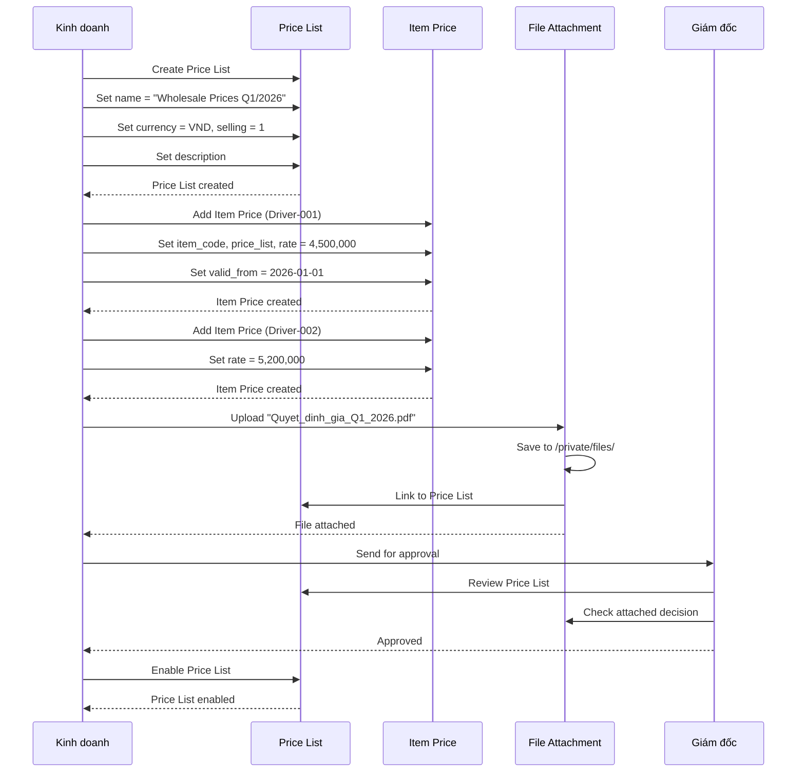
```mermaid
sequenceDiagram
    participant KD as Kinh doanh
    participant PL as Price List
    participant IP as Item Price
    participant File as File Attachment
    participant Approval as Giám đốc

    KD->>PL: Create Price List
    KD->>PL: Set name = "Wholesale Prices Q1/2026"
    KD->>PL: Set currency = VND, selling = 1
    KD->>PL: Set description
    PL-->>KD: Price List created

    KD->>IP: Add Item Price (Driver-001)
    KD->>IP: Set item_code, price_list, rate = 4,500,000
    KD->>IP: Set valid_from = 2026-01-01
    IP-->>KD: Item Price created

    KD->>IP: Add Item Price (Driver-002)
    KD->>IP: Set rate = 5,200,000
    IP-->>KD: Item Price created

    KD->>File: Upload "Quyet_dinh_gia_Q1_2026.pdf"
    File->>File: Save to /private/files/
    File->>PL: Link to Price List
    File-->>KD: File attached

    KD->>Approval: Send for approval
    Approval->>PL: Review Price List
    Approval->>File: Check attached decision
    Approval-->>KD: Approved

    KD->>PL: Enable Price List
    PL-->>KD: Price List enabled
```

---

### 7.2. Sequence: Áp dụng Chính sách chiết khấu

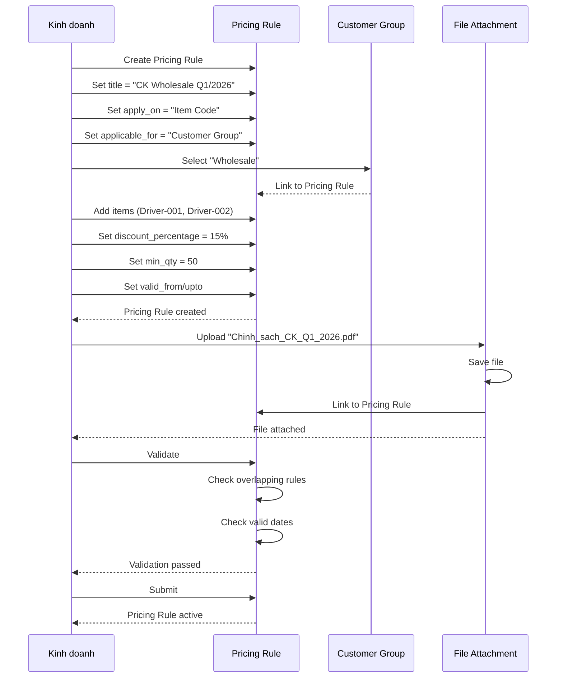
```mermaid
sequenceDiagram
    participant KD as Kinh doanh
    participant PR as Pricing Rule
    participant CG as Customer Group
    participant File as File Attachment

    KD->>PR: Create Pricing Rule
    KD->>PR: Set title = "CK Wholesale Q1/2026"
    KD->>PR: Set apply_on = "Item Code"
    KD->>PR: Set applicable_for = "Customer Group"

    KD->>CG: Select "Wholesale"
    CG-->>PR: Link to Pricing Rule

    KD->>PR: Add items (Driver-001, Driver-002)
    KD->>PR: Set discount_percentage = 15%
    KD->>PR: Set min_qty = 50
    KD->>PR: Set valid_from/upto
    PR-->>KD: Pricing Rule created

    KD->>File: Upload "Chinh_sach_CK_Q1_2026.pdf"
    File->>File: Save file
    File->>PR: Link to Pricing Rule
    File-->>KD: File attached

    KD->>PR: Validate
    PR->>PR: Check overlapping rules
    PR->>PR: Check valid dates
    PR-->>KD: Validation passed

    KD->>PR: Submit
    PR-->>KD: Pricing Rule active
```

---

### 7.3. Sequence: Tạo đơn hàng bán buôn

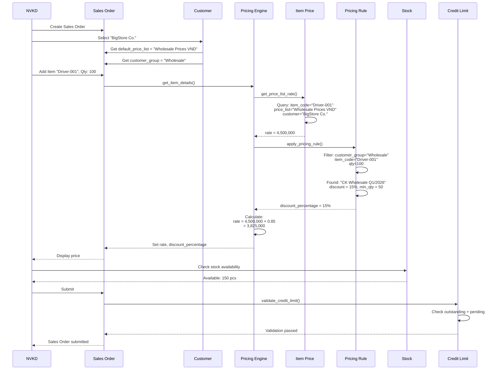
```mermaid
sequenceDiagram
    participant NVKD as NVKD
    participant SO as Sales Order
    participant Cust as Customer
    participant Engine as Pricing Engine
    participant IP as Item Price
    participant PR as Pricing Rule
    participant Stock as Stock
    participant Credit as Credit Limit

    NVKD->>SO: Create Sales Order
    NVKD->>Cust: Select "BigStore Co."
    Cust->>SO: Get default_price_list = "Wholesale Prices VND"
    Cust->>SO: Get customer_group = "Wholesale"

    NVKD->>SO: Add Item "Driver-001", Qty: 100
    SO->>Engine: get_item_details()

    Engine->>IP: get_price_list_rate()
    IP->>IP: Query: item_code="Driver-001"<br/>price_list="Wholesale Prices VND"<br/>customer="BigStore Co."
    IP-->>Engine: rate = 4,500,000

    Engine->>PR: apply_pricing_rule()
    PR->>PR: Filter: customer_group="Wholesale"<br/>item_code="Driver-001"<br/>qty=100
    PR->>PR: Found: "CK Wholesale Q1/2026"<br/>discount = 15%, min_qty = 50
    PR-->>Engine: discount_percentage = 15%

    Engine->>Engine: Calculate:<br/>rate = 4,500,000 × 0.85<br/>= 3,825,000
    Engine-->>SO: Set rate, discount_percentage
    SO-->>NVKD: Display price

    NVKD->>Stock: Check stock availability
    Stock-->>NVKD: Available: 150 pcs

    NVKD->>SO: Submit
    SO->>Credit: validate_credit_limit()
    Credit->>Credit: Check outstanding + pending
    Credit-->>SO: Validation passed
    SO-->>NVKD: Sales Order submitted
```

---

### 7.4. Sequence: Tạo hóa đơn bán lẻ (POS)

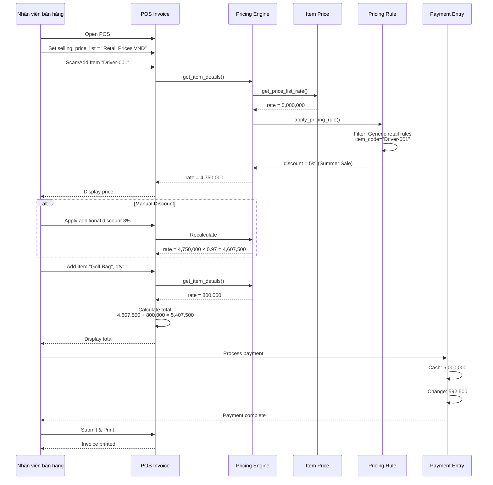
```mermaid
sequenceDiagram
    participant Cashier as Nhân viên bán hàng
    participant POS as POS Invoice
    participant Engine as Pricing Engine
    participant IP as Item Price
    participant PR as Pricing Rule
    participant Payment as Payment Entry

    Cashier->>POS: Open POS
    Cashier->>POS: Set selling_price_list = "Retail Prices VND"

    Cashier->>POS: Scan/Add Item "Driver-001"
    POS->>Engine: get_item_details()

    Engine->>IP: get_price_list_rate()
    IP-->>Engine: rate = 5,000,000

    Engine->>PR: apply_pricing_rule()
    PR->>PR: Filter: Generic retail rules<br/>item_code="Driver-001"
    PR-->>Engine: discount = 5% (Summer Sale)

    Engine-->>POS: rate = 4,750,000
    POS-->>Cashier: Display price

    alt Manual Discount
        Cashier->>POS: Apply additional discount 3%
        POS->>Engine: Recalculate
        Engine-->>POS: rate = 4,750,000 × 0.97 = 4,607,500
    end

    Cashier->>POS: Add Item "Golf Bag", qty: 1
    POS->>Engine: get_item_details()
    Engine-->>POS: rate = 800,000

    POS->>POS: Calculate total:<br/>4,607,500 + 800,000 = 5,407,500
    POS-->>Cashier: Display total

    Cashier->>Payment: Process payment
    Payment->>Payment: Cash: 6,000,000
    Payment->>Payment: Change: 592,500
    Payment-->>Cashier: Payment complete

    Cashier->>POS: Submit & Print
    POS-->>Cashier: Invoice printed
```

---

## 8. State Machines

### 8.1. State Machine: Price List

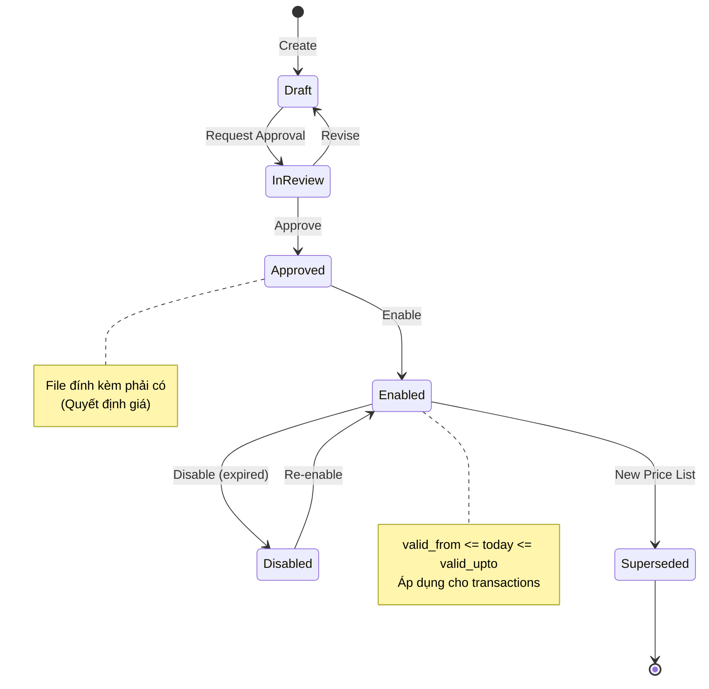
```mermaid
stateDiagram-v2
    [*] --> Draft: Create

    Draft --> InReview: Request Approval
    InReview --> Draft: Revise
    InReview --> Approved: Approve

    Approved --> Enabled: Enable
    Enabled --> Disabled: Disable (expired)
    Disabled --> Enabled: Re-enable

    Enabled --> Superseded: New Price List
    Superseded --> [*]

    note right of Approved
        File đính kèm phải có
        (Quyết định giá)
    end note

    note right of Enabled
        valid_from <= today <= valid_upto
        Áp dụng cho transactions
    end note
```

**Trigger Events:**

| State | Event | Next State | Action |
|-------|-------|------------|--------|
| Draft | `request_approval` | InReview | Notify Giám đốc |
| InReview | `approve` | Approved | Set approved_by, approved_date |
| InReview | `reject` | Draft | Add rejection note |
| Approved | `enable` | Enabled | Set enabled = 1 |
| Enabled | `expire` | Disabled | valid_upto passed |
| Enabled | `supersede` | Superseded | New price list active |

---

### 8.2. State Machine: Pricing Rule

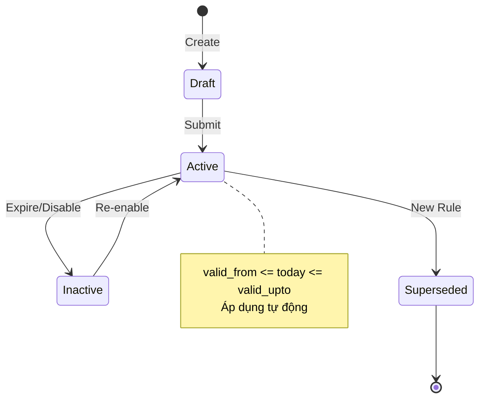
```mermaid
stateDiagram-v2
    [*] --> Draft: Create

    Draft --> Active: Submit
    Active --> Inactive: Expire/Disable
    Inactive --> Active: Re-enable

    Active --> Superseded: New Rule
    Superseded --> [*]

    note right of Active
        valid_from <= today <= valid_upto
        Áp dụng tự động
    end note
```

**Trigger Events:**

| State | Event | Next State | Condition |
|-------|-------|------------|-----------|
| Draft | `submit` | Active | valid_from defined |
| Active | `expire` | Inactive | today > valid_upto |
| Active | `disable` | Inactive | Manual action |
| Inactive | `enable` | Active | valid dates still valid |

---

### 8.3. State Machine: Sales Order (Bán buôn)

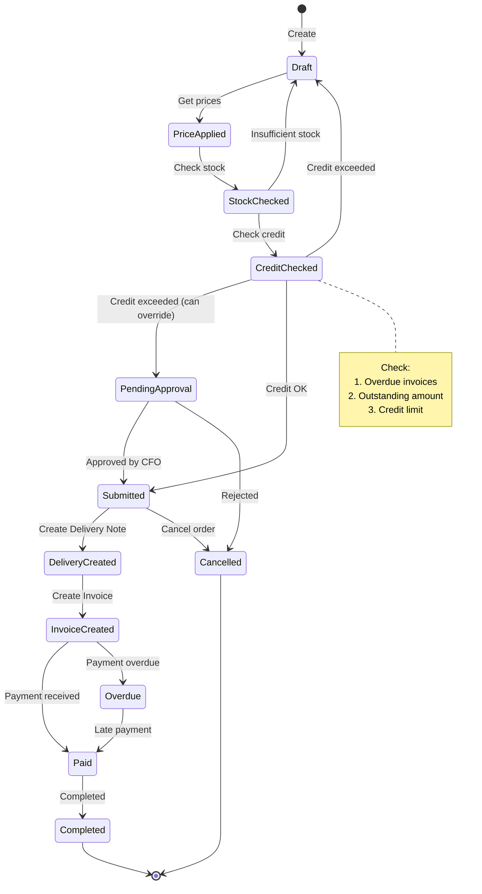
```mermaid
stateDiagram-v2
    [*] --> Draft: Create

    Draft --> PriceApplied: Get prices
    PriceApplied --> StockChecked: Check stock
    StockChecked --> Draft: Insufficient stock
    StockChecked --> CreditChecked: Check credit

    CreditChecked --> Draft: Credit exceeded
    CreditChecked --> PendingApproval: Credit exceeded (can override)
    PendingApproval --> Submitted: Approved by CFO
    PendingApproval --> Cancelled: Rejected

    CreditChecked --> Submitted: Credit OK

    Submitted --> DeliveryCreated: Create Delivery Note
    DeliveryCreated --> InvoiceCreated: Create Invoice
    InvoiceCreated --> Paid: Payment received
    InvoiceCreated --> Overdue: Payment overdue
    Overdue --> Paid: Late payment

    Paid --> Completed: Completed
    Completed --> [*]

    Submitted --> Cancelled: Cancel order
    Cancelled --> [*]

    note right of CreditChecked
        Check:
        1. Overdue invoices
        2. Outstanding amount
        3. Credit limit
    end note
```

---

### 8.4. State Machine: POS Invoice (Bán lẻ)

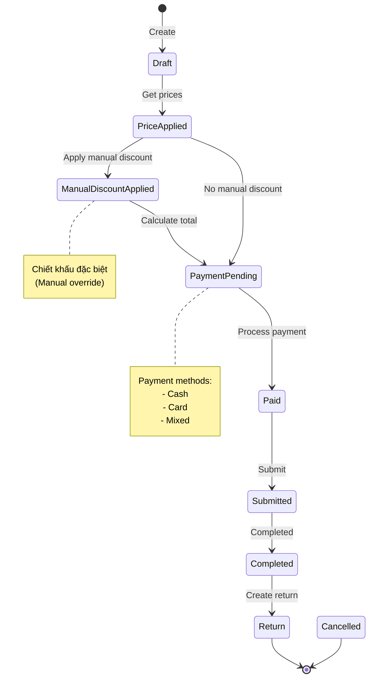
```mermaid
stateDiagram-v2
    [*] --> Draft: Create

    Draft --> PriceApplied: Get prices
    PriceApplied --> ManualDiscountApplied: Apply manual discount
    ManualDiscountApplied --> PaymentPending: Calculate total
    PriceApplied --> PaymentPending: No manual discount

    PaymentPending --> Paid: Process payment
    Paid --> Submitted: Submit
    Submitted --> Completed: Completed

    Completed --> Return: Create return
    Return --> [*]

    Cancelled --> [*]

    note right of PaymentPending
        Payment methods:
        - Cash
        - Card
        - Mixed
    end note

    note right of ManualDiscountApplied
        Chiết khấu đặc biệt
        (Manual override)
    end note
```

---

## 9. Kết luận & Khuyến nghị

### 9.1. Tổng kết Gap Analysis

| Feature | ERPNext Capability | Gap | Action Required |
|---------|-------------------|-----|-----------------|
| **Bảng giá niêm yết** | ✅ 95% | Custom field "Số bảng giá" | Add custom field |
| **Chiết khấu bán buôn** | ✅ 95% | Custom field "Số chính sách" | Add custom field |
| **Chiết khấu bán lẻ** | ✅ 100% | None | Ready to use |
| **Giá theo khách hàng** | ✅ 100% | None | Use Item Price.customer |
| **Giá theo thời gian** | ✅ 100% | None | Use valid_from/upto |
| **Phân biệt Sỉ/Lẻ** | 🔧 80% | Custom field + Logic | **High Priority** |
| **Hạn mức công nợ** | 🔧 85% | Check overdue + Approval | **High Priority** |
| **File đính kèm** | ✅ 100% | None | Ready to use |
| **Cảnh báo giá** | 🔧 70% | Custom validation | Medium Priority |

**Tổng kết:**
> ✅ **ERPNext đáp ứng 85-90% yêu cầu về Pricing & Wholesale/Retail**
>
> 🔧 **Cần customize:** 10-15% (chủ yếu về phân biệt Sỉ/Lẻ và Credit Management nâng cao)

---

### 9.2. Khuyến nghị Implementation

#### Phase 1: Foundation (Đáp ứng 85%)

**Sử dụng ERPNext Core features:**

1. **Price List Management**
   - ✅ Tạo Price Lists: "Wholesale Prices VND", "Retail Prices VND"
   - ✅ Sử dụng Item Price với valid_from/upto
   - ✅ Đính kèm file quyết định giá vào Price List

2. **Pricing Rules**
   - ✅ Tạo Pricing Rules cho Customer Groups ("Wholesale", "Retail")
   - ✅ Pricing Rules theo Item Code/Group
   - ✅ Sử dụng min_qty/max_qty cho quantity tiers
   - ✅ Đính kèm file chính sách vào Pricing Rule

3. **Customer Management**
   - ✅ Phân loại Customer Groups: "Wholesale", "Retail", "Distributor"
   - ✅ Set default_price_list cho từng Customer
   - ✅ Sử dụng Credit Limit (Customer.credit_limits)

**Timeline:** 2-3 tuần

---

#### Phase 2: Customization (Đáp ứng thêm 10%)

**Custom Fields:**

```python
# 1. Sales Order custom fields
Sales Order:
  custom_order_type = "Wholesale" / "Retail"  # Select field
  custom_price_list_number = ""  # Data (link to Price List.custom_price_list_number)
  custom_pricing_rule_number = ""  # Data (link to Pricing Rule.custom_policy_number)

# 2. Sales Order Item custom fields
Sales Order Item:
  custom_price_before_discount = 0.0  # Currency (for display)
  custom_discount_by_policy = 0.0  # Currency (for display)

# 3. Price List custom field
Price List:
  custom_price_list_number = ""  # Data (e.g., "BG-2026-001")

# 4. Pricing Rule custom field
Pricing Rule:
  custom_policy_number = ""  # Data (e.g., "CSKH-2026-001")

# 5. Customer custom field
Customer:
  custom_customer_type = "Wholesale" / "Retail"  # Select (for reporting)
```

**Auto-fill Logic:**

```python
# File: dcnet_apps/dcnet_apps/hooks.py
doc_events = {
    "Sales Order": {
        "before_insert": "dcnet_apps.sales.auto_set_order_type"
    }
}

# File: dcnet_apps/dcnet_apps/sales.py
def auto_set_order_type(doc, method):
    """Auto-set order type based on Customer Group"""
    if doc.customer:
        customer_group = frappe.db.get_value('Customer', doc.customer, 'customer_group')
        if customer_group == 'Wholesale':
            doc.custom_order_type = 'Wholesale'
        else:
            doc.custom_order_type = 'Retail'
```

**Timeline:** 1-2 tuần

---

#### Phase 3: Advanced Features (Đáp ứng thêm 5%)

**Custom Validations:**

1. **Credit Limit Check (Nâng cao)**

```python
# File: dcnet_apps/dcnet_apps/credit_management.py
def validate_credit_limit_advanced(doc, method):
    """
    Check:
    1. Overdue invoices
    2. Outstanding amount + Pending deliveries + Current order
    3. Credit limit

    If exceeded → Require CFO approval
    """
    customer = doc.customer
    company = doc.company

    # 1. Check overdue invoices
    overdue_invoices = frappe.db.sql("""
        SELECT name, outstanding_amount, due_date
        FROM `tabSales Invoice`
        WHERE customer = %s
        AND company = %s
        AND outstanding_amount > 0
        AND due_date < CURDATE()
        AND docstatus = 1
    """, (customer, company), as_dict=True)

    if overdue_invoices:
        # Show warning, require approval
        pass

    # 2. Calculate total exposure
    outstanding = get_customer_outstanding(customer, company)
    pending_deliveries = get_pending_delivery_amount(customer, company)
    current_order = doc.grand_total
    total_exposure = outstanding + pending_deliveries + current_order

    # 3. Check credit limit
    credit_limit = get_credit_limit(customer, company)
    if total_exposure > credit_limit:
        # Require CFO approval
        pass
```

2. **Price Mismatch Warning**

```python
# File: dcnet_apps/dcnet_apps/sales_invoice_custom.py
def validate_price_mismatch(doc, method):
    """Warn if invoice price != delivery note price"""
    for item in doc.items:
        if item.delivery_note:
            dn_rate = frappe.db.get_value(
                'Delivery Note Item',
                {'parent': item.delivery_note, 'item_code': item.item_code},
                'rate'
            )
            if abs(item.rate - dn_rate) > 0.01:
                frappe.msgprint(
                    f"Price mismatch for {item.item_code}: DN={dn_rate}, Invoice={item.rate}",
                    indicator='orange',
                    alert=True
                )
```

**Timeline:** 2-3 tuần

---

#### Phase 4: Reporting & Dashboard

**Custom Reports:**

1. **Sales by Order Type (Wholesale/Retail)**

```sql
SELECT
  custom_order_type AS "Order Type",
  COUNT(*) AS "Total Orders",
  SUM(grand_total) AS "Total Amount",
  AVG(grand_total) AS "Average Order Value"
FROM `tabSales Order`
WHERE docstatus = 1
  AND transaction_date BETWEEN %s AND %s
GROUP BY custom_order_type
```

2. **Pricing Rule Effectiveness**

```sql
SELECT
  pr.title AS "Pricing Rule",
  pr.custom_policy_number AS "Policy Number",
  COUNT(DISTINCT so.name) AS "Orders Applied",
  SUM(soi.discount_amount) AS "Total Discount Given"
FROM `tabPricing Rule` pr
LEFT JOIN `tabSales Order Item` soi ON soi.pricing_rules LIKE CONCAT('%', pr.name, '%')
LEFT JOIN `tabSales Order` so ON so.name = soi.parent
WHERE so.docstatus = 1
  AND so.transaction_date BETWEEN %s AND %s
GROUP BY pr.name
ORDER BY SUM(soi.discount_amount) DESC
```

**Dashboard Widgets:**

```python
# File: dcnet_apps/dcnet_apps/dashboard/sales_dashboard.py
def get_wholesale_retail_chart():
    return {
        "chart_name": "Wholesale vs Retail Sales",
        "chart_type": "donut",
        "data": {
            "labels": ["Wholesale", "Retail"],
            "datasets": [
                {
                    "values": [
                        get_total_sales("Wholesale"),
                        get_total_sales("Retail")
                    ]
                }
            ]
        }
    }
```

**Timeline:** 2-3 tuần

---

### 9.3. Implementation Roadmap

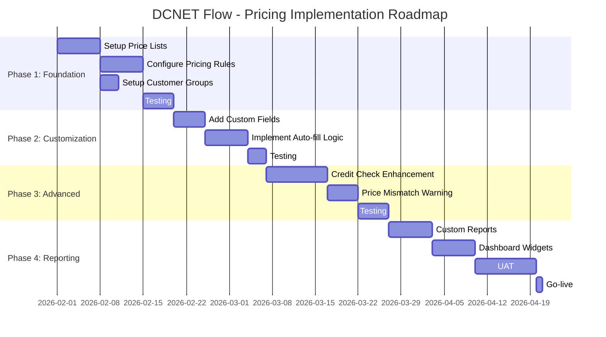
```mermaid
gantt
    title DCNET Flow - Pricing Implementation Roadmap
    dateFormat YYYY-MM-DD
    section Phase 1: Foundation
    Setup Price Lists           :2026-02-01, 7d
    Configure Pricing Rules     :2026-02-08, 7d
    Setup Customer Groups       :2026-02-08, 3d
    Testing                     :2026-02-15, 5d

    section Phase 2: Customization
    Add Custom Fields           :2026-02-20, 5d
    Implement Auto-fill Logic   :2026-02-25, 7d
    Testing                     :2026-03-04, 3d

    section Phase 3: Advanced
    Credit Check Enhancement    :2026-03-07, 10d
    Price Mismatch Warning      :2026-03-17, 5d
    Testing                     :2026-03-22, 5d

    section Phase 4: Reporting
    Custom Reports              :2026-03-27, 7d
    Dashboard Widgets           :2026-04-03, 7d
    UAT                         :2026-04-10, 10d
    Go-live                     :2026-04-20, 1d
```

**Total Timeline:** ~10 tuần (2.5 tháng)

---

### 9.4. Risks & Mitigation

| Risk | Impact | Probability | Mitigation |
|------|--------|-------------|------------|
| **Khách hàng yêu cầu thêm field "Số bảng giá"** | Medium | High | Add custom field (1-2 ngày) |
| **Pricing Rule phức tạp hơn spec** | High | Medium | Use apply_multiple_pricing_rules + Priority |
| **Credit Limit logic không đủ** | High | High | Custom validation (Phase 3) - 10 ngày |
| **Báo cáo không đủ chi tiết** | Medium | Medium | Custom Report (Phase 4) - 7 ngày |
| **Performance issue (nhiều Pricing Rules)** | Medium | Low | Cache pricing rules, optimize queries |

---

### 9.5. Kết luận cuối cùng

**✅ DCNET Flow CÓ THỂ SỬ DỤNG ERPNext CHO PRICING MANAGEMENT**

**Lý do:**

1. **ERPNext đáp ứng 85-90% yêu cầu khách hàng ngay lập tức** (out-of-the-box)
2. **10-15% còn lại có thể customize trong 2-3 tháng** (custom fields + logic)
3. **Kiến trúc Pricing của ERPNext rất mạnh:**
   - Price List (Bảng giá) ✅
   - Item Price (Giá theo KH, thời gian, UOM) ✅
   - Pricing Rule (Chiết khấu linh hoạt) ✅
   - Credit Limit (Hạn mức công nợ) ✅
4. **Hỗ trợ đầy đủ cả Bán buôn (12 bước) và Bán lẻ (3 bước)**

**Khác biệt chính so với yêu cầu:**

| Yêu cầu | ERPNext | Giải pháp |
|---------|---------|-----------|
| **Phân biệt rõ Sỉ/Lẻ** | Qua Customer Group | Add custom field `order_type` |
| **Số bảng giá/chính sách** | Không có | Add custom field (1-2 ngày) |
| **Check công nợ quá hạn nâng cao** | Basic | Custom validation (1-2 tuần) |
| **Cảnh báo giá khác bảng giá** | Không có | Custom validation (3-5 ngày) |

**Timeline:**
- **Phase 1 (Foundation):** 2-3 tuần → Đáp ứng 85%
- **Phase 2 (Customization):** 1-2 tuần → Đáp ứng thêm 10%
- **Phase 3-4 (Advanced + Reports):** 4-5 tuần → Đáp ứng 100%

**Total:** ~10 tuần (2.5 tháng) để đáp ứng 100% yêu cầu

---

## 10. Code References

### 10.1. Price List

| File | Line | Function | Purpose |
|------|------|----------|---------|
| `dcnet_core/erpnext/stock/doctype/price_list/price_list.py` | 27-40 | `get_price_list_details()` | Cache và trả về thông tin bảng giá |
| `dcnet_core/erpnext/stock/doctype/price_list/price_list.py` | 43-61 | `on_trash()` | Xóa Item Price khi xóa Price List |

---

### 10.2. Item Price

| File | Line | Function | Purpose |
|------|------|----------|---------|
| `dcnet_core/erpnext/stock/doctype/item_price/item_price.py` | 42-65 | `validate()` | Validate Item Price (check duplicates) |
| `dcnet_core/erpnext/stock/get_item_details.py` | 1040-1089 | `get_item_price()` | Query Item Price với filters |
| `dcnet_core/erpnext/stock/get_item_details.py` | 998-1038 | `get_price_list_rate()` | Get base price from Price List |

---

### 10.3. Pricing Rule

| File | Line | Function | Purpose |
|------|------|----------|---------|
| `dcnet_core/erpnext/accounts/doctype/pricing_rule/pricing_rule.py` | 81-184 | `apply_pricing_rule()` | Main pricing rule engine |
| `dcnet_core/erpnext/accounts/doctype/pricing_rule/pricing_rule.py` | 223-371 | `get_pricing_rule_for_item()` | Find applicable rules for item |
| `dcnet_core/erpnext/accounts/doctype/pricing_rule/utils.py` | 21-130 | `get_pricing_rules()` | Query và filter pricing rules |
| `dcnet_core/erpnext/accounts/doctype/pricing_rule/utils.py` | 250-320 | `filter_pricing_rules()` | Apply qty/amount filters |
| `dcnet_core/erpnext/accounts/doctype/pricing_rule/utils.py` | 420-485 | `apply_price_discount_rule()` | Apply discount/margin |

---

### 10.4. Sales Order

| File | Line | Function | Purpose |
|------|------|----------|---------|
| `dcnet_core/erpnext/stock/get_item_details.py` | 59-368 | `get_item_details()` | Main entry point - get price + apply rules |
| `dcnet_core/erpnext/selling/doctype/sales_order/sales_order.py` | 150-180 | `validate()` | Validate Sales Order |
| `dcnet_core/erpnext/selling/doctype/customer/customer.py` | 200-250 | `validate_credit_limit()` | Check credit limit |

---

### 10.5. POS Invoice

| File | Line | Function | Purpose |
|------|------|----------|---------|
| `dcnet_core/erpnext/accounts/doctype/pos_invoice/pos_invoice.py` | 100-150 | `validate()` | Validate POS Invoice |
| `dcnet_core/erpnext/accounts/doctype/pos_invoice/pos_invoice.py` | 200-250 | `set_missing_values()` | Auto-fill prices |

---

## Appendix A: ERPNext Pricing Tables

### Item Price Table Structure

```sql
CREATE TABLE `tabItem Price` (
  `name` varchar(140) PRIMARY KEY,
  `item_code` varchar(140),
  `item_name` varchar(140),
  `price_list` varchar(140),
  `price_list_rate` decimal(18,6),
  `uom` varchar(140),
  `customer` varchar(140),
  `supplier` varchar(140),
  `batch_no` varchar(140),
  `packing_unit` int(11),
  `valid_from` date,
  `valid_upto` date,
  `lead_time_days` int(11),
  `note` text,
  KEY `item_code` (`item_code`),
  KEY `price_list` (`price_list`),
  KEY `customer` (`customer`),
  KEY `valid_from` (`valid_from`),
  KEY `valid_upto` (`valid_upto`)
);
```

---

### Pricing Rule Table Structure

```sql
CREATE TABLE `tabPricing Rule` (
  `name` varchar(140) PRIMARY KEY,
  `title` varchar(140),
  `apply_on` varchar(140),  -- Item Code, Item Group, Brand, Transaction
  `applicable_for` varchar(140),  -- Customer, Customer Group, Territory, etc.
  `customer` varchar(140),
  `customer_group` varchar(140),
  `territory` varchar(140),
  `price_or_product_discount` varchar(140),  -- Price, Product
  `discount_percentage` decimal(18,6),
  `discount_amount` decimal(18,6),
  `rate` decimal(18,6),
  `margin_type` varchar(140),
  `margin_rate_or_amount` decimal(18,6),
  `min_qty` decimal(18,6),
  `max_qty` decimal(18,6),
  `min_amt` decimal(18,6),
  `max_amt` decimal(18,6),
  `valid_from` date,
  `valid_upto` date,
  `priority` int(11),
  `apply_multiple_pricing_rules` int(1),
  `condition` text,
  KEY `apply_on` (`apply_on`),
  KEY `applicable_for` (`applicable_for`),
  KEY `customer_group` (`customer_group`),
  KEY `valid_from` (`valid_from`),
  KEY `priority` (`priority`)
);
```

---

**© 2026 DCNET Corporation**

**Document Version:** 1.0
**Last Updated:** 14/01/2026
**Author:** DCNET Analysis Team
**Reviewed by:** Technical Team

---

**Next Steps:**
1. Review this analysis with khách hàng
2. Clarify outstanding questions (Section 4.4, 4.5)
3. Approve implementation roadmap (Section 9.3)
4. Proceed with Phase 1 implementation

**Questions for Customer:**
1. Có cần field "Số bảng giá" và "Số chính sách" không? (Custom field - 1-2 ngày)
2. Credit Limit check có cần logic nâng cao (overdue invoices + approval workflow) không?
3. Báo cáo phân biệt Sỉ/Lẻ có cần chi tiết đến đâu?
4. POS có cần tích hợp với thiết bị nào (máy in bill, máy quét mã vạch)?
