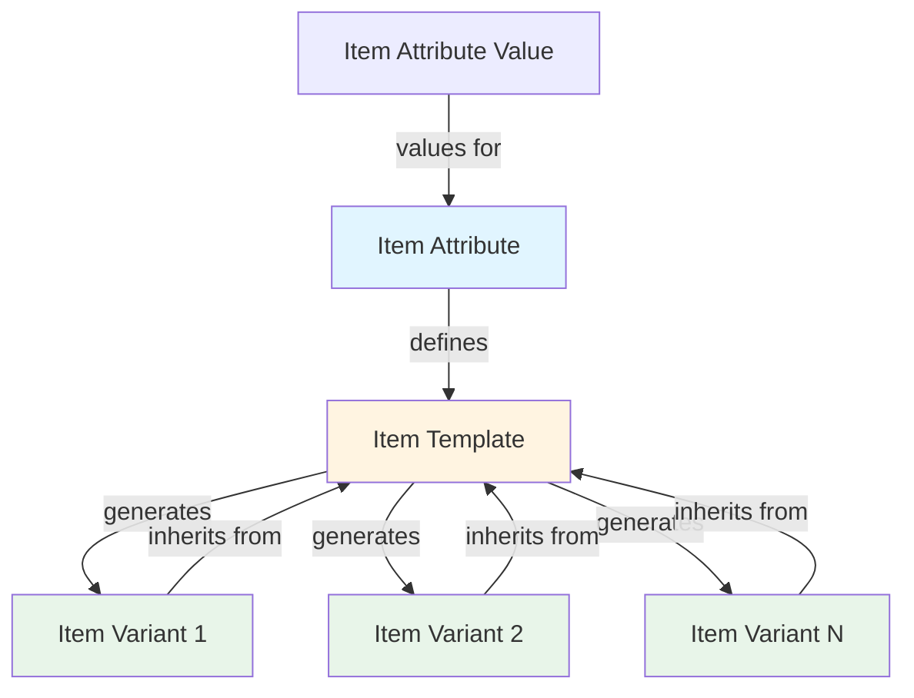
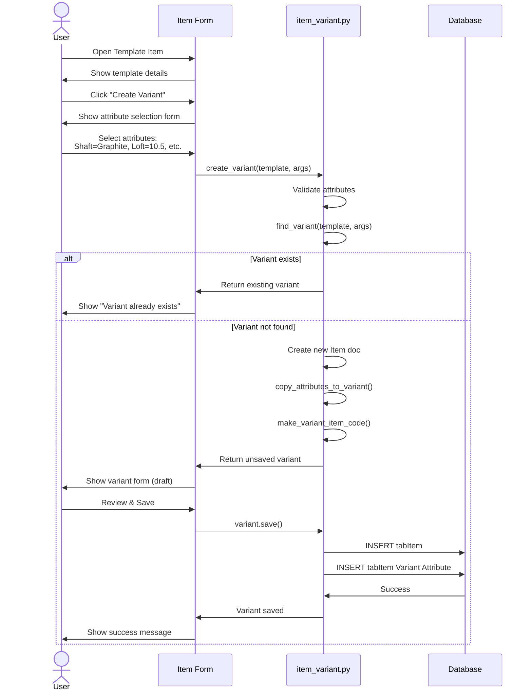
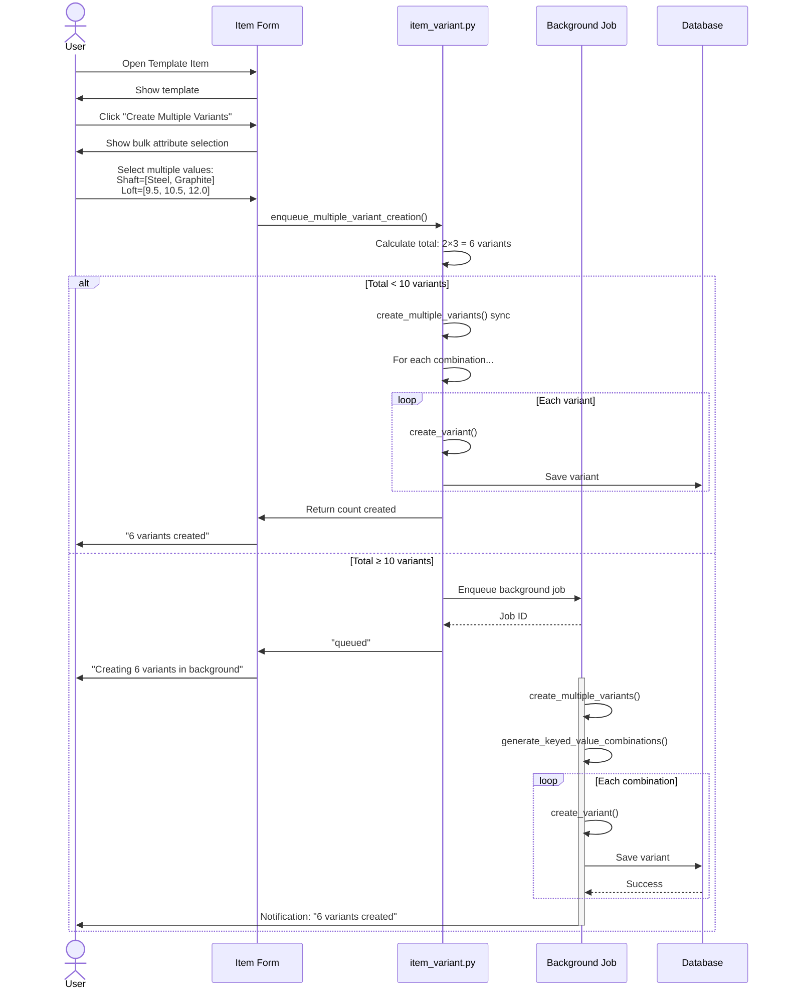
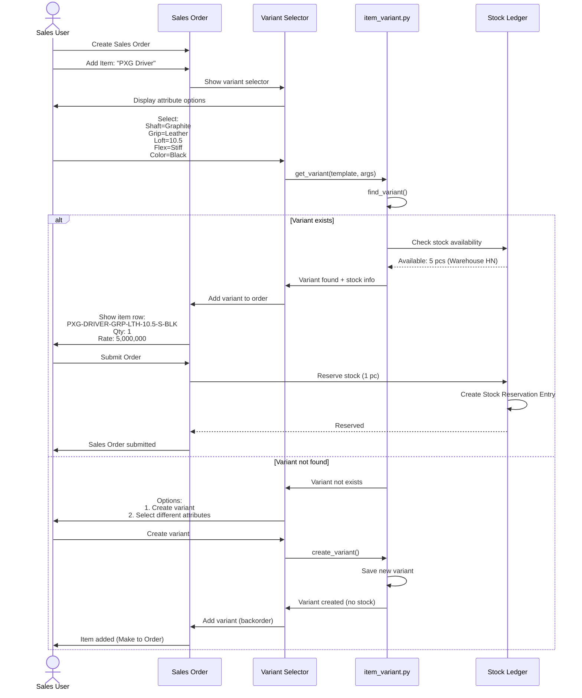
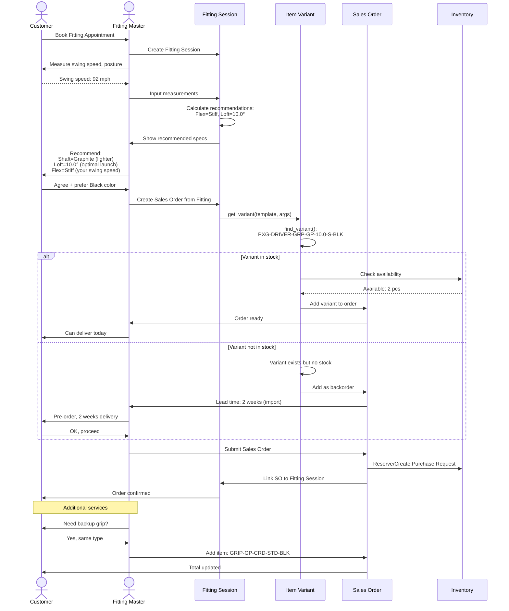
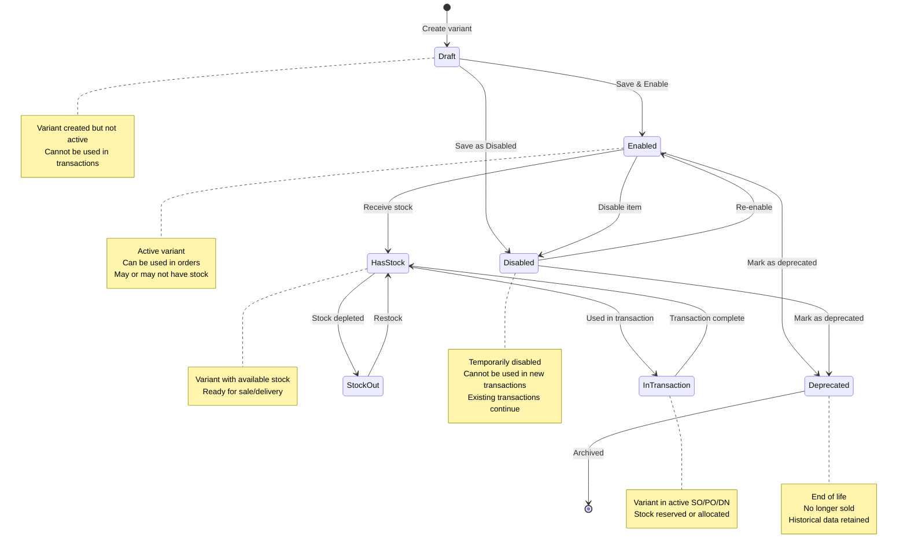
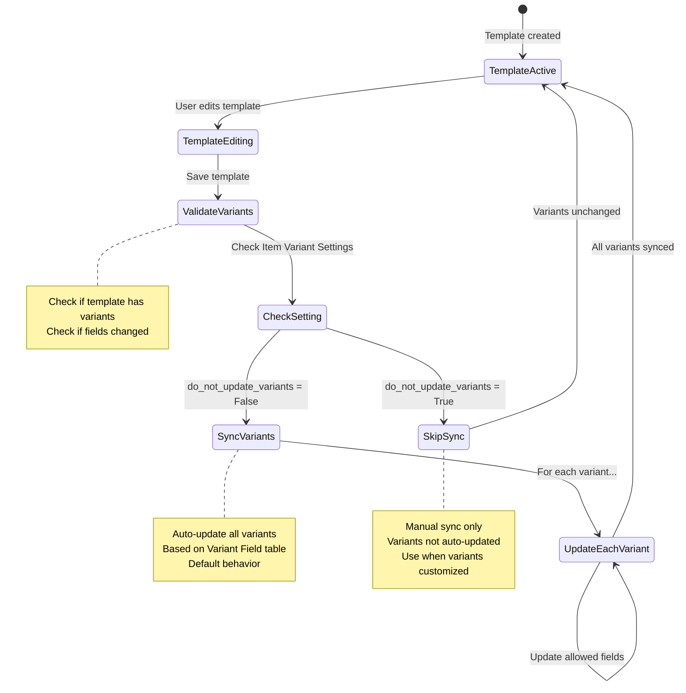
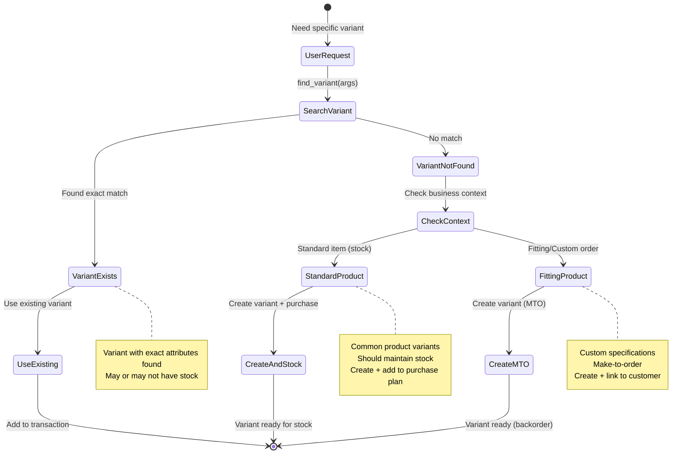

# Product Variant Workflow Analysis

> **Module:** Item (Product & Variant Management)
> **Generated:** 14/01/2026
> **Source:** ERPNext v16 Core + DCNET Flow Requirements

---

## 📋 Table of Contents

1. [Tổng quan](#1-tổng-quan)
2. [Tại sao cần Product Variants?](#2-tại-sao-cần-product-variants)
3. [Product Variant là gì?](#3-product-variant-là-gì)
4. [Workflow chi tiết](#4-workflow-chi-tiết)
5. [Data Mapping](#5-data-mapping)
6. [Ví dụ thực tế: Golf Equipment](#6-ví-dụ-thực-tế-golf-equipment)
7. [Sequence Diagrams](#7-sequence-diagrams)
8. [State Machine](#8-state-machine)
9. [Key Takeaways](#9-key-takeaways)
10. [Code References](#10-code-references)

---

## 1. Tổng quan

### 1.1. Product Variant System trong DCNET Flow

**Process Flow:**
```
Item Attribute Setup → Item Template Creation → Variant Generation → Sales Order
```

**Key Components:**
- **Item Attribute** - Master data định nghĩa thuộc tính (Shaft, Grip, Loft...)
- **Item Template** - Sản phẩm cha với `has_variants = True`
- **Item Variant** - Sản phẩm con với tổ hợp thuộc tính cụ thể
- **Variant Generation** - Tạo tự động các biến thể (cartesian product)

### 1.2. Business Context

**DCNET Flow (Golf Equipment Business)** cần quản lý:
- **Gậy golf** với nhiều biến thể: shaft type, grip material, loft angle, flex, color
- **Fitting service** - Custom gậy theo thông số khách hàng
- **Purchase Planning** - Kế hoạch mua hàng theo thuộc tính (shaft, family, year, category...)
- **Inventory** - Kiểm kê theo từng vật tư và các thuộc tính liên quan

**Source:**
- `docs/feature/FEATURE_SPECIFICATION.md` - Section 5.2, 16.1 (Fitting)
- `docs/feature/ERP_SPECIFICATION.md` - Section 2.2, 4.5 (Purchase Planning, Inventory)
- `docs/feature/IMPORT_PROCESS_SPECIFICATION.md` - Product attributes evaluation

---

## 2. Tại sao cần Product Variants?

### 2.1. Business Rationale

#### A. Tránh Explosion của SKU

**Vấn đề nếu KHÔNG dùng Variants:**

```
❌ Manual SKU Creation:
- PXG Driver Black Steel Leather 8.5° Regular
- PXG Driver Black Steel Leather 9.5° Regular
- PXG Driver Black Steel Leather 10.5° Regular
- PXG Driver Black Steel Synthetic 8.5° Regular
- ... (hàng trăm SKU thủ công)

Vấn đề:
- Quản lý phức tạp (cập nhật giá, mô tả cho từng SKU)
- Dễ sai sót (thiếu/trùng lặp SKU)
- Không linh hoạt (thêm thuộc tính mới = tạo lại toàn bộ)
```

**Giải pháp với Variants:**

```
✅ Template-based Variants:
- Template: PXG Driver
- Attributes:
  - Color: [Black, White, Blue]
  - Shaft: [Steel, Graphite]
  - Grip: [Leather, Synthetic]
  - Loft: [8.5°, 9.5°, 10.5°]
  - Flex: [Regular, Stiff]

Auto-generate: 3 × 2 × 2 × 3 × 2 = 72 variants
```

**Lợi ích:**
- ✅ Quản lý tập trung tại Template
- ✅ Auto-sync khi update Template
- ✅ Tìm kiếm nhanh theo thuộc tính
- ✅ Báo cáo tồn kho theo dimensions

#### B. Fitting Service Workflow

**Tại sao Fitting cần Variants?**

> **Nguồn:** `FEATURE_SPECIFICATION.md` Section 16.1.5

```
Buổi Fitting → Đo thông số khách hàng → Custom gậy

Kết quả có thể:
1. Chọn gậy có sẵn (existing variant)
2. Custom gậy mới (create new variant on-the-fly)

Ví dụ:
- Khách A: Swing speed 95 mph → Stiff flex, 9.5° loft
- Khách B: Swing speed 75 mph → Regular flex, 12° loft
→ Cùng 1 Template nhưng khác Variant
```

**Dịch vụ phát sinh từ Fitting:**
- Mua thêm grip → Item Variant with Grip attribute
- Lắp shaft → Item Variant with Shaft attribute
- Gậy custom → New variant combination
- Combo fitting + gậy → Bundle với variants

#### C. Purchase Planning theo Attributes

**Tại sao Purchase cần Attributes?**

> **Nguồn:** `ERP_SPECIFICATION.md` Section 2.2.1

Kế hoạch mua hàng cần chi tiết:
- **Family** (product family)
- **Year** (model year)
- **Category, Sub Category**
- **Shaft** (loại shaft)
- **Price** (giá nhập)

```
Ví dụ Purchase Plan:

Nhà cung cấp: TaylorMade
Family: Stealth 2
Year: 2024
Category: Driver
Shaft: [Graphite, Steel]
→ Generate variants để track quantity theo từng tháng
```

#### D. Inventory Tracking

**Tại sao Inventory cần Attributes?**

> **Nguồn:** `ERP_SPECIFICATION.md` Section 4.5.1

Kiểm kê hàng hóa theo:
- **Kho** (warehouse)
- **Vật tư** (item)
- **Các thuộc tính liên quan** (shaft, loft, flex...)

```
Stock Reconciliation:

Kho Hà Nội:
- PXG Driver-STL-LTR-8.5-R-BLK: 5 pcs
- PXG Driver-GRP-SYN-10.5-S-WHT: 12 pcs
→ Track từng variant riêng biệt
```

### 2.2. Technical Rationale

#### A. Data Normalization

**Template = Single Source of Truth:**
- Pricing rules
- Tax category
- Warranty information
- Default supplier
- Item group classification

**Variants inherit từ Template:**
- Chỉ lưu attributes khác biệt
- Auto-update khi Template thay đổi
- Reduce data duplication

#### B. Flexible Search & Filtering

**User có thể:**
```sql
-- Tìm tất cả variants với Graphite shaft
SELECT * FROM `tabItem`
WHERE variant_of = 'PXG Driver'
AND EXISTS (
  SELECT 1 FROM `tabItem Variant Attribute`
  WHERE parent = `tabItem`.name
  AND attribute = 'Shaft Type'
  AND attribute_value = 'Graphite'
)
```

**Báo cáo theo dimensions:**
- Sales by Shaft Type
- Stock by Loft Angle
- Best-selling Grip Material

#### C. Dynamic Variant Creation

**On-the-fly variant creation:**
- Fitting session → Custom specs → Create variant if not exists
- Sales Order → Customer request → Generate new variant
- Import → New product line → Bulk create variants

---

## 3. Product Variant là gì?

### 3.1. Architecture Overview

**Hierarchy:**



### 3.2. Core DocTypes

#### A. Item Attribute (Master Data)

**Purpose:** Định nghĩa thuộc tính có thể sử dụng

**Location:** `/dcnet_core/erpnext/stock/doctype/item_attribute/`

**Key Fields:**

| Field | Type | Description |
|-------|------|-------------|
| `attribute_name` | Data (Unique) | Tên thuộc tính (e.g., "Shaft Type", "Loft Angle") |
| `numeric_values` | Check | True nếu là thuộc tính số (loft angle, weight...) |
| `from_range` | Float | Giá trị min (cho numeric attributes) |
| `to_range` | Float | Giá trị max (cho numeric attributes) |
| `increment` | Float | Bước nhảy (e.g., loft: 0.5°, 1°, 1.5°...) |
| `item_attribute_values` | Table | Danh sách giá trị cho non-numeric attributes |

**Example:**

```json
{
  "attribute_name": "Shaft Type",
  "numeric_values": 0,
  "item_attribute_values": [
    {"attribute_value": "Steel", "abbr": "STL"},
    {"attribute_value": "Graphite", "abbr": "GRP"},
    {"attribute_value": "Composite", "abbr": "CMP"}
  ]
}
```

```json
{
  "attribute_name": "Loft Angle",
  "numeric_values": 1,
  "from_range": 7.5,
  "to_range": 15.0,
  "increment": 0.5
}
```

#### B. Item Template

**Purpose:** Sản phẩm cha chứa tất cả biến thể

**Key Fields:**

| Field | Type | Value |
|-------|------|-------|
| `has_variants` | Check | ✅ True |
| `variant_based_on` | Select | "Item Attribute" hoặc "Manufacturer" |
| `attributes` | Table | Danh sách Item Attributes được chọn |
| `description`, `item_group`, `brand` | Data | Inherited by variants |
| `standard_rate`, `taxes` | Data | Inherited by variants |

**Constraints:**
- ❌ Template KHÔNG THỂ có stock transactions
- ❌ Template KHÔNG THỂ dùng trong Sales Order/Purchase Order
- ✅ Template chỉ để generate variants

**Example:**

```json
{
  "item_code": "PXG-DRIVER",
  "item_name": "PXG Driver 0811 Gen5",
  "has_variants": 1,
  "variant_based_on": "Item Attribute",
  "attributes": [
    {"attribute": "Shaft Type"},
    {"attribute": "Grip Material"},
    {"attribute": "Loft Angle"},
    {"attribute": "Flex"},
    {"attribute": "Color"}
  ],
  "item_group": "Golf Clubs",
  "brand": "PXG",
  "standard_rate": 5000000,
  "description": "PXG 0811 Gen5 Driver with adjustable weighting"
}
```

#### C. Item Variant

**Purpose:** Sản phẩm con với tổ hợp thuộc tính cụ thể

**Key Fields:**

| Field | Type | Value |
|-------|------|-------|
| `variant_of` | Link | Reference to Template Item |
| `variant_based_on` | Select | "Item Attribute" (inherited) |
| `attributes` | Table | Specific attribute values for this variant |
| All other fields | | Inherited from Template (can override) |

**Auto-generated Fields:**
- `item_code` - Generated from template + attribute abbreviations
- `item_name` - Enhanced with attribute values
- `description` - Appended with variant details

**Example:**

```json
{
  "item_code": "PXG-DRIVER-GRP-SYN-10.5-S-BLK",
  "item_name": "PXG Driver 0811 Gen5 (Graphite/Synthetic/10.5°/Stiff/Black)",
  "variant_of": "PXG-DRIVER",
  "attributes": [
    {"attribute": "Shaft Type", "attribute_value": "Graphite"},
    {"attribute": "Grip Material", "attribute_value": "Synthetic"},
    {"attribute": "Loft Angle", "attribute_value": "10.5"},
    {"attribute": "Flex", "attribute_value": "Stiff"},
    {"attribute": "Color", "attribute_value": "Black"}
  ]
}
```

### 3.3. Variant Generation Logic

**Cartesian Product Algorithm:**

> **Code Reference:** `item_variant.py:269-318` `generate_keyed_value_combinations()`

```python
Input:
{
  "Shaft Type": ["Steel", "Graphite"],
  "Grip Material": ["Leather", "Synthetic"],
  "Loft Angle": [8.5, 9.5, 10.5]
}

Output (12 combinations):
[
  {"Shaft Type": "Steel", "Grip Material": "Leather", "Loft Angle": 8.5},
  {"Shaft Type": "Steel", "Grip Material": "Leather", "Loft Angle": 9.5},
  {"Shaft Type": "Steel", "Grip Material": "Leather", "Loft Angle": 10.5},
  {"Shaft Type": "Steel", "Grip Material": "Synthetic", "Loft Angle": 8.5},
  {"Shaft Type": "Steel", "Grip Material": "Synthetic", "Loft Angle": 9.5},
  {"Shaft Type": "Steel", "Grip Material": "Synthetic", "Loft Angle": 10.5},
  {"Shaft Type": "Graphite", "Grip Material": "Leather", "Loft Angle": 8.5},
  {"Shaft Type": "Graphite", "Grip Material": "Leather", "Loft Angle": 9.5},
  {"Shaft Type": "Graphite", "Grip Material": "Leather", "Loft Angle": 10.5},
  {"Shaft Type": "Graphite", "Grip Material": "Synthetic", "Loft Angle": 8.5},
  {"Shaft Type": "Graphite", "Grip Material": "Synthetic", "Loft Angle": 9.5},
  {"Shaft Type": "Graphite", "Grip Material": "Synthetic", "Loft Angle": 10.5}
]
```

**Limits:**
- ⚠️ Maximum 500 variants per batch
- ⚠️ Enqueued if total variants ≥ 10 (background job)

---

## 4. Workflow chi tiết

### 4.1. Setup Phase: Create Item Attributes

**Step 1: Define Item Attributes**

**User Actions:**
1. Navigate to Stock → Setup → Item Attribute
2. Create new Item Attribute
3. Define attribute properties:
   - Non-numeric: Add attribute values with abbreviations
   - Numeric: Set range and increment

**System Actions:**
- Validate unique attribute name
- Save to `tabItem Attribute`
- Create child records in `tabItem Attribute Value`

**Example Attributes for Golf:**

```
Shaft Type (Non-numeric):
├─ Steel (STL)
├─ Graphite (GRP)
└─ Composite (CMP)

Grip Material (Non-numeric):
├─ Leather (LTH)
├─ Synthetic (SYN)
├─ Golf Pride (GP)
└─ Cord (CRD)

Loft Angle (Numeric):
├─ From: 7.5
├─ To: 15.0
└─ Increment: 0.5

Flex (Non-numeric):
├─ Ladies (L)
├─ Senior (A)
├─ Regular (R)
├─ Stiff (S)
└─ Extra Stiff (XS)

Color (Non-numeric):
├─ Black (BLK)
├─ White (WHT)
├─ Blue (BLU)
└─ Red (RED)
```

**Code Reference:** `item_attribute.py:1-100`

---

### 4.2. Create Item Template

**Step 2: Create Template Item**

**User Actions:**
1. Navigate to Stock → Items and Pricing → Item → New
2. Fill basic information:
   - Item Code: `PXG-DRIVER`
   - Item Name: `PXG Driver 0811 Gen5`
   - Item Group: `Golf Clubs`
   - Brand: `PXG`
3. **Enable "Has Variants"** checkbox
4. Set **Variant Based On:** "Item Attribute"
5. In **Attributes** table, add desired attributes:
   - Shaft Type
   - Grip Material
   - Loft Angle
   - Flex
   - Color
6. Set pricing, tax, defaults
7. Save

**System Actions:**
- Validate `has_variants = 1`
- Ensure no stock transactions exist
- Save template to database

**Validation Rules:**

```python
# item.py:validate()
if self.has_variants:
    # Cannot have stock
    if has_stock_transactions(self.name):
        raise StockExistsForTemplate

    # Must have attributes
    if not self.attributes:
        frappe.throw("Please add at least one attribute")
```

**Code Reference:** `item.py:1-150` (Item.validate())

---

### 4.3. Generate Variants

**Step 3A: Single Variant Creation**

**User Actions:**
1. Open Template Item
2. Click **"Create Variant"** button
3. Select attribute values in form:
   - Shaft Type: Graphite
   - Grip Material: Synthetic
   - Loft Angle: 10.5
   - Flex: Stiff
   - Color: Black
4. Save

**System Actions:**

```python
# Workflow: item_variant.py:201-222
1. create_variant(template, args)
   ├─ Create new Item doc
   ├─ Set variant_based_on = "Item Attribute"
   ├─ Set attributes table from args
   ├─ copy_attributes_to_variant(template, variant)
   │  └─ Copy all required/allowed fields from template
   ├─ make_variant_item_code(template.item_code, template.item_name, variant)
   │  └─ Generate: PXG-DRIVER-GRP-SYN-10.5-S-BLK
   └─ Return variant (unsaved)
2. User saves variant
3. Validate attributes match definitions
4. Insert to database
```

**Data Copied from Template:**
- `item_group`, `brand`, `description`
- `standard_rate`, `taxes`
- `stock_uom`, `purchase_uom`, `sales_uom`
- `item_defaults` (warehouse, expense account...)
- All required fields

**Data NOT Copied:**
- `item_code`, `item_name` (generated)
- `has_variants` (False for variants)
- `opening_stock`, `valuation_rate`

**Code Reference:** `item_variant.py:201-222` (create_variant)

---

**Step 3B: Multiple Variants Creation (Cartesian Product)**

**User Actions:**
1. Open Template Item
2. Click **"Create Multiple Variants"** button
3. Select multiple values for each attribute:

```
Shaft Type: [Steel, Graphite]
Grip Material: [Leather, Synthetic]
Loft Angle: [8.5, 9.5, 10.5]
Flex: [Regular, Stiff]
Color: [Black, White]
```

4. Click **"Create"**

**System Actions:**

```python
# Workflow: item_variant.py:226-266
1. enqueue_multiple_variant_creation(template, args)
   ├─ Calculate total variants: 2×2×3×2×2 = 48
   ├─ If total < 10:
   │  └─ create_multiple_variants() immediately
   └─ Else:
      └─ Enqueue background job
2. create_multiple_variants(template, args)
   ├─ generate_keyed_value_combinations(args)
   │  └─ Cartesian product → 48 combinations
   ├─ For each combination:
   │  ├─ Check if variant exists: get_variant()
   │  ├─ If not exists:
   │  │  ├─ create_variant()
   │  │  └─ variant.save()
   └─ Return count created
3. Show notification: "48 variants created"
```

**Cartesian Product Logic:**

```python
# item_variant.py:269-318
def generate_keyed_value_combinations(args):
    """
    From: {"Shaft": ["Steel", "Graphite"], "Loft": [8.5, 9.5]}
    To: [
        {"Shaft": "Steel", "Loft": 8.5},
        {"Shaft": "Steel", "Loft": 9.5},
        {"Shaft": "Graphite", "Loft": 8.5},
        {"Shaft": "Graphite", "Loft": 9.5}
    ]
    """
    # Implementation uses iterative expansion
    # Start with first attribute values
    # Iteratively combine with remaining attributes
```

**Performance Considerations:**
- Total variants < 10 → Synchronous creation
- Total variants ≥ 10 → Background job (enqueued)
- Maximum 500 variants per batch (safety limit)

**Code Reference:**
- `item_variant.py:226-248` (enqueue_multiple_variant_creation)
- `item_variant.py:250-266` (create_multiple_variants)
- `item_variant.py:269-318` (generate_keyed_value_combinations)

---

### 4.4. Item Code Generation

**Auto-generated Naming Convention:**

```python
# item_variant.py:make_variant_item_code()
Pattern: {TEMPLATE}-{ABBR1}-{ABBR2}-{ABBR3}...

Example:
Template: PXG-DRIVER
Attributes:
- Shaft Type: Graphite (GRP)
- Grip Material: Synthetic (SYN)
- Loft Angle: 10.5 (numeric, no abbr)
- Flex: Stiff (S)
- Color: Black (BLK)

Generated: PXG-DRIVER-GRP-SYN-10.5-S-BLK
```

**Abbreviation Rules:**
- Non-numeric attributes: Use `abbr` from Item Attribute Value
- Numeric attributes: Use actual numeric value
- Join with hyphen `-`

**Validation:**
```python
# Check for existing variant with same attributes
existing = find_variant(template, args)
if existing:
    raise ItemVariantExistsError(f"Variant {existing} already exists")
```

**Code Reference:** `item_variant.py:make_variant_item_code()` (function not shown in excerpt, but referenced)

---

### 4.5. Variant Attribute Validation

**Validation Rules:**

#### A. Non-Numeric Attributes

```python
# item_variant.py:132-156
def validate_item_attribute_value(attributes_list, attribute, attribute_value, item):
    # Check if value exists in Item Attribute Values
    if attribute_value not in attributes_list:
        raise InvalidItemAttributeValueError(
            f"{attribute_value} is not a valid value for {attribute}"
        )
```

**Example:**
```
Item Attribute: Shaft Type
Allowed values: [Steel, Graphite, Composite]

❌ Invalid: "Carbon" → Not in allowed values
✅ Valid: "Graphite"
```

#### B. Numeric Attributes

```python
# item_variant.py:106-129
def validate_is_incremental(numeric_attribute, attribute, value, item):
    from_range = numeric_attribute.from_range  # 7.5
    to_range = numeric_attribute.to_range      # 15.0
    increment = numeric_attribute.increment    # 0.5

    # Check range
    is_in_range = from_range <= value <= to_range

    # Check increment
    remainder = (value - from_range) % increment
    is_incremental = remainder == 0 or remainder == increment

    if not (is_in_range and is_incremental):
        raise InvalidItemAttributeValueError()
```

**Example:**
```
Loft Angle:
- Range: 7.5° to 15.0°
- Increment: 0.5°

✅ Valid: 8.5, 9.0, 9.5, 10.0, 10.5, ..., 15.0
❌ Invalid: 8.7 (not incremental)
❌ Invalid: 16.0 (out of range)
```

**Code Reference:**
- `item_variant.py:84-104` (validate_item_variant_attributes)
- `item_variant.py:106-129` (validate_is_incremental)
- `item_variant.py:132-156` (validate_item_attribute_value)

---

### 4.6. Template Update & Sync

**When Template is Updated:**

**Scenario:** Change standard_rate from 5,000,000 to 5,500,000

**System Behavior:**

```python
# Item Variant Settings
do_not_update_variants = False  # Default

# On Template save:
if not do_not_update_variants:
    for variant in get_variants(template.name):
        # Update allowed fields
        variant.standard_rate = template.standard_rate
        variant.save()
```

**Configurable Fields to Copy:**

> **Item Variant Settings DocType** controls which fields auto-sync

```
Stock → Setup → Item Variant Settings

Variant Fields Table:
├─ standard_rate ✅
├─ item_group ✅
├─ brand ✅
├─ description ✅
└─ ... (customizable)

Settings:
├─ do_not_update_variants: False (auto-sync enabled)
└─ allow_rename_attribute_value: False (prevent breaking changes)
```

**Code Reference:** `item_variant_settings.py`

---

### 4.7. Sales Order with Variants

**Step 4: Use Variant in Sales Order**

**User Actions:**
1. Create Sales Order
2. Add item: Start typing "PXG Driver"
3. **Variant Selector appears:**
   - Shows Template with attribute selection
   - User selects:
     - Shaft Type: Graphite
     - Grip Material: Leather
     - Loft: 9.5°
     - Flex: Regular
     - Color: White
4. System finds variant: `PXG-DRIVER-GRP-LTH-9.5-R-WHT`
5. Add to Sales Order
6. Submit

**System Actions:**

```python
# On variant selection
1. get_variant(template, args)
   ├─ find_variant(template, args)
   │  ├─ get_item_codes_by_attributes(args, template)
   │  └─ Match exact attribute combination
   ├─ If found: Return variant
   └─ If not found: Return None

2. If variant not found:
   ├─ Option A: Create new variant on-the-fly
   └─ Option B: Show error "Variant not available"

3. Add variant to Sales Order Item table
4. Fetch price, tax from variant (inherited from template)
5. On submit: Reserve stock for specific variant
```

**Stock Reservation:**
- ✅ Stock tracked per variant (not template)
- ✅ Each variant has own stock ledger entries
- ✅ Inventory reports show variant-level breakdown

**Code Reference:**
- `item_variant.py:28-48` (get_variant)
- `item_variant.py:178-198` (find_variant)

---

## 5. Data Mapping

### 5.1. Item Attribute → Item Template

**Mapping Table:**

| Item Attribute Field | → | Item Template Field | Note |
|----------------------|---|---------------------|------|
| `attribute_name` | → | `attributes.attribute` | Link reference |
| N/A | → | `has_variants` | Must be `True` |
| N/A | → | `variant_based_on` | "Item Attribute" |

**Example:**

```
Item Attribute: "Shaft Type"
├─ attribute_name: Shaft Type
└─ item_attribute_values:
   ├─ Steel (STL)
   ├─ Graphite (GRP)
   └─ Composite (CMP)

Item Template: "PXG-DRIVER"
├─ has_variants: True
├─ variant_based_on: Item Attribute
└─ attributes:
   └─ attribute: Shaft Type (link)
```

---

### 5.2. Item Template → Item Variant

**Comprehensive Mapping:**

| Template Field | → | Variant Field | Copy Method | Overrideable |
|----------------|---|---------------|-------------|--------------|
| `item_code` | → | N/A | **Auto-generated** | No |
| `item_name` | → | `item_name` | Enhanced with attributes | No |
| `has_variants` | → | N/A | Not copied (variant = False) | No |
| `variant_of` | → | N/A | Set to Template name | No |
| `item_group` | ✅ | `item_group` | Direct copy | Yes |
| `brand` | ✅ | `brand` | Direct copy | Yes |
| `description` | ✅ | `description` | Copy + append attributes | Yes |
| `stock_uom` | ✅ | `stock_uom` | Direct copy | Conditional* |
| `standard_rate` | ✅ | `standard_rate` | Direct copy | Yes |
| `taxes` | ✅ | `taxes` | Deep copy (table) | Yes |
| `item_defaults` | ✅ | `item_defaults` | Deep copy (table) | Yes |
| `barcodes` | ❌ | N/A | Not copied | N/A |
| `opening_stock` | ❌ | N/A | Not copied | N/A |
| `valuation_rate` | ❌ | N/A | Not copied | N/A |

**Copy Logic:**

```python
# item_variant.py:321-362
def copy_attributes_to_variant(item, variant):
    exclude_fields = [
        "naming_series", "item_code", "item_name",
        "published_in_website", "opening_stock",
        "variant_of", "valuation_rate"
    ]

    allow_fields = [
        d.field_name
        for d in frappe.get_all("Variant Field", fields=["field_name"])
    ]

    for field in item.meta.fields:
        if (field.reqd or field.fieldname in allow_fields)
           and field.fieldname not in exclude_fields:

            if field.fieldtype == "Table":
                # Deep copy child tables
                variant.set(field.fieldname, [])
                for row in item.get(field.fieldname):
                    new_row = copy.deepcopy(row)
                    variant.append(field.fieldname, new_row)
            else:
                # Direct copy
                variant.set(field.fieldname, item.get(field.fieldname))
```

**\*Conditional Fields:**

> **Item Variant Settings** → `allow_different_uom`

- If `True`: Variant can have different UOM than Template
- If `False`: Variant inherits Template UOM (cannot change)

**Code Reference:** `item_variant.py:321-362` (copy_attributes_to_variant)

---

### 5.3. Attribute Values → Variant Attributes

**Mapping Table:**

| Source | → | Variant Attribute Table | Example |
|--------|---|-------------------------|---------|
| User selection | → | `attribute` | "Shaft Type" |
| User selection | → | `attribute_value` | "Graphite" |
| Item Attribute | → | `numeric_values` | False |
| Item Variant Attribute (Template) | → | `from_range`, `to_range`, `increment` | For numeric only |

**Example:**

```json
Template Attributes Table:
[
  {
    "attribute": "Shaft Type",
    "numeric_values": 0
  },
  {
    "attribute": "Loft Angle",
    "numeric_values": 1,
    "from_range": 7.5,
    "to_range": 15.0,
    "increment": 0.5
  }
]

Variant Attributes Table:
[
  {
    "attribute": "Shaft Type",
    "attribute_value": "Graphite",
    "numeric_values": 0
  },
  {
    "attribute": "Loft Angle",
    "attribute_value": "10.5",
    "numeric_values": 1,
    "from_range": 7.5,
    "to_range": 15.0,
    "increment": 0.5
  }
]
```

---

## 6. Ví dụ thực tế: Golf Equipment

### 6.1. PXG Driver - Complete Example

**Business Context:**

> **Nguồn:** `FEATURE_SPECIFICATION.md` Section 5.2.2, 16.1.5

DCNET Flow bán gậy golf cao cấp với nhiều tùy chọn customization qua dịch vụ Fitting.

---

**Step 1: Setup Attributes**

```
1. Shaft Type (Non-numeric)
   ├─ Steel (STL) - Shaft thép, nặng, phù hợp swing nhanh
   ├─ Graphite (GRP) - Shaft carbon, nhẹ, tăng tốc độ
   └─ Composite (CMP) - Hybrid, cân bằng

2. Grip Material (Non-numeric)
   ├─ Leather (LTH) - Da thật, cao cấp, mềm mại
   ├─ Synthetic (SYN) - Tổng hợp, bền, chống trơn
   ├─ Golf Pride (GP) - Thương hiệu Golf Pride
   └─ Cord (CRD) - Dây bện, grip tốt trong mưa

3. Loft Angle (Numeric)
   ├─ Range: 7.5° đến 15.0°
   ├─ Increment: 0.5°
   └─ Purpose: Điều chỉnh góc phóng bóng

4. Flex (Non-numeric)
   ├─ Ladies (L) - Swing speed < 60 mph
   ├─ Senior (A) - Swing speed 60-75 mph
   ├─ Regular (R) - Swing speed 75-85 mph
   ├─ Stiff (S) - Swing speed 85-95 mph
   └─ Extra Stiff (XS) - Swing speed > 95 mph

5. Color (Non-numeric)
   ├─ Black (BLK)
   ├─ White (WHT)
   ├─ Blue (BLU)
   └─ Red (RED)
```

---

**Step 2: Create Template**

```
Item Code: PXG-DRIVER
Item Name: PXG Driver 0811 Gen5
Item Group: Golf Clubs → Drivers
Brand: PXG
Has Variants: ✅ Yes
Variant Based On: Item Attribute

Attributes:
✅ Shaft Type
✅ Grip Material
✅ Loft Angle
✅ Flex
✅ Color

Pricing:
- Standard Rate: 5,000,000 VND
- Tax Template: VAT 10%

Warranty:
- Warranty Period: 1 year (theo FEATURE_SPECIFICATION Section 7.4)
```

---

**Step 3: Generate Variants**

**Scenario A: Bulk Generation for Stock**

```
User selects:
Shaft Type: [Steel, Graphite]
Grip Material: [Leather, Synthetic]
Loft Angle: [8.5, 9.5, 10.5, 12.0]
Flex: [Regular, Stiff]
Color: [Black, White]

Total combinations: 2 × 2 × 4 × 2 × 2 = 64 variants

System creates:
1. PXG-DRIVER-STL-LTH-8.5-R-BLK
2. PXG-DRIVER-STL-LTH-8.5-R-WHT
3. PXG-DRIVER-STL-LTH-8.5-S-BLK
4. PXG-DRIVER-STL-LTH-8.5-S-WHT
5. PXG-DRIVER-STL-LTH-9.5-R-BLK
...
64. PXG-DRIVER-GRP-SYN-12.0-S-WHT

→ Background job created (64 > 10 threshold)
→ Notification: "64 variants created successfully"
```

---

**Scenario B: Fitting Service - Custom Variant**

**Business Flow:**

> **Nguồn:** `FEATURE_SPECIFICATION.md` Section 16.1

```
1. Khách hàng: Anh Minh (Lead LGD-000123)
2. Book Fitting appointment qua website
3. Buổi Fitting:
   - Đo swing speed: 92 mph → Stiff flex
   - Đo launch angle: Best với 10.0° loft
   - Preference: Graphite shaft (nhẹ hơn)
   - Grip: Golf Pride (yêu cầu cao cấp)
   - Color: Black (cá nhân)

4. Fitting Master tạo Fitting Session:
   - Customer: Anh Minh
   - Recommended specs:
     - Shaft: Graphite
     - Grip: Golf Pride
     - Loft: 10.0°
     - Flex: Stiff
     - Color: Black

5. Tạo Sales Order từ Fitting:
   - Search item: "PXG Driver"
   - Select variant attributes:
     - Shaft Type: Graphite
     - Grip Material: Golf Pride (GP)
     - Loft: 10.0°
     - Flex: Stiff
     - Color: Black

6. System action:
   - find_variant(template, args)
   - Variant code: PXG-DRIVER-GRP-GP-10.0-S-BLK
   - Check stock: Available in Warehouse HN
   - Add to Sales Order

7. Additional services (theo Section 16.1.5):
   - Lắp shaft: Included in variant
   - Mua thêm backup grip:
     - Template: GRIP-GP
     - Variant: GRIP-GP-BLK-STD (Golf Pride Black Standard)
```

---

**Scenario C: Custom Variant Not in Stock**

```
Customer request:
- Shaft: Composite (CMP) - Ít phổ biến
- Grip: Cord (CRD) - Đặc biệt cho mùa mưa
- Loft: 11.5° - Uncommon loft
- Flex: Senior (A) - Người lớn tuổi
- Color: Red (RED) - Cá nhân hóa

Variant code: PXG-DRIVER-CMP-CRD-11.5-A-RED

System action:
1. find_variant() → Not found
2. Options:
   A. Create variant on-the-fly:
      - create_variant(template, args)
      - Save variant
      - Add to Sales Order
      - Create Purchase Request (MTO - Make to Order)

   B. Ask customer to wait:
      - Quotation with lead time
      - Import order to supplier
```

---

### 6.2. Grip Replacement - Service Item

**Business Context:**

> **Nguồn:** `FEATURE_SPECIFICATION.md` Section 16.1.5 - "Mua thêm grip"

```
Template: GRIP
Item Group: Golf Accessories → Grips
Has Variants: Yes

Attributes:
1. Brand (Non-numeric)
   ├─ Golf Pride (GP)
   ├─ SuperStroke (SS)
   └─ Lamkin (LMK)

2. Material (Non-numeric)
   ├─ Leather (LTH)
   ├─ Synthetic (SYN)
   ├─ Cord (CRD)
   └─ Hybrid (HYB)

3. Size (Non-numeric)
   ├─ Undersize (US) - Nhỏ hơn chuẩn
   ├─ Standard (STD) - Size chuẩn
   ├─ Midsize (MID) - Lớn hơn 1/16"
   └─ Jumbo (JMB) - Lớn hơn 1/8"

4. Color (Non-numeric)
   ├─ Black (BLK)
   ├─ White (WHT)
   ├─ Red (RED)
   └─ Multi (MLT)

Example variants:
- GRIP-GP-LTH-STD-BLK (Golf Pride Leather Standard Black)
- GRIP-SS-SYN-MID-WHT (SuperStroke Synthetic Midsize White)
- GRIP-LMK-CRD-JMB-RED (Lamkin Cord Jumbo Red)

Total possible: 3 × 4 × 4 × 4 = 192 variants
```

**Usage in Fitting:**

```
After fitting session:
1. Customer wants to replace grip
2. Select template: GRIP
3. Choose attributes based on preference:
   - Brand: Golf Pride (trusted brand)
   - Material: Cord (better grip in humid weather)
   - Size: Standard (fits current clubs)
   - Color: Black (classic)
4. Variant: GRIP-GP-CRD-STD-BLK
5. Add to Sales Order as additional item
6. Service: Grip installation (labor charge separate)
```

---

### 6.3. Custom Club - Complex Variant

**Business Context:**

> **Nguồn:** `FEATURE_SPECIFICATION.md` Section 5.2.2 - "gậy custom"

```
Template: CUSTOM-IRON-SET
Item Group: Golf Clubs → Irons
Has Variants: Yes

Attributes:
1. Iron Range (Non-numeric)
   ├─ 3-PW (3I to PW, 8 clubs)
   ├─ 4-PW (4I to PW, 7 clubs)
   ├─ 5-PW (5I to PW, 6 clubs)
   └─ 6-GW (6I to GW, 6 clubs)

2. Shaft Type (Non-numeric)
   ├─ Steel (STL)
   ├─ Graphite (GRP)
   └─ KBS Tour (KBS) - Premium steel

3. Shaft Flex (Non-numeric)
   ├─ Regular (R)
   ├─ Stiff (S)
   └─ Extra Stiff (XS)

4. Grip Set (Non-numeric)
   ├─ Golf Pride Tour Velvet (GPTV)
   ├─ Golf Pride MCC (GPMCC)
   └─ SuperStroke S-Tech (SST)

5. Lie Angle Adjustment (Numeric)
   ├─ Range: -2.0° to +2.0°
   ├─ Increment: 0.5°
   └─ Purpose: Adjust for height/posture

6. Length Adjustment (Numeric)
   ├─ Range: -1.0 inch to +1.0 inch
   ├─ Increment: 0.25 inch
   └─ Purpose: Adjust for arm length

Example variant:
CUSTOM-IRON-SET-5PW-KBS-S-GPMCC-+1.0-+0.5

Meaning:
- 5-PW set (6 clubs)
- KBS Tour steel shaft
- Stiff flex
- Golf Pride MCC grips
- Lie angle +1.0° (upright)
- Length +0.5 inch (longer)

Total possible: 4 × 3 × 3 × 3 × 9 × 9 = 2,916 variants
→ Do NOT generate all upfront
→ Create on-demand based on fitting results
```

---

### 6.4. Purchase Planning with Variants

**Business Context:**

> **Nguồn:** `ERP_SPECIFICATION.md` Section 2.2.1 - Purchase Planning

**Purchase Plan for Q1 2025:**

```
Supplier: TaylorMade
Plan: PLAN-2025-Q1-TM

Items:
1. TaylorMade Stealth 2 Driver
   - Family: Stealth 2
   - Year: 2024
   - Category: Driver
   - Sub Category: Premium Driver

   Variants to order:
   ┌─────────────┬───────┬──────┬──────┬──────┐
   │ Shaft       │ Loft  │ Jan  │ Feb  │ Mar  │
   ├─────────────┼───────┼──────┼──────┼──────┤
   │ Graphite    │ 9.0°  │ 10   │ 15   │ 12   │
   │ Graphite    │ 10.5° │ 25   │ 30   │ 28   │
   │ Graphite    │ 12.0° │ 8    │ 10   │ 9    │
   └─────────────┴───────┴──────┴──────┴──────┘

2. TaylorMade Stealth 2 Fairway
   - Variants: 3W, 5W, 7W
   - Shaft: Graphite only
   - Quantity per month...

System tracks:
- Each variant has separate row in Purchase Plan
- Attributes stored: shaft, loft, flex
- Quantity by month (Jan-Dec)
- Auto-generate Purchase Order per variant
```

---

### 6.5. Inventory Reconciliation with Variants

**Business Context:**

> **Nguồn:** `ERP_SPECIFICATION.md` Section 4.5.1 - Stock Reconciliation

**Monthly Stock Count:**

```
Warehouse: Kho Hà Nội
Date: 31/01/2025

Product: PXG Driver 0811 Gen5

Variants counted:
┌──────────────────────────────────┬────────┬──────────┬───────┐
│ Variant Code                     │ System │ Physical │ Diff  │
├──────────────────────────────────┼────────┼──────────┼───────┤
│ PXG-DRIVER-GRP-LTH-9.5-R-BLK     │ 12     │ 11       │ -1    │
│ PXG-DRIVER-GRP-LTH-10.5-R-BLK    │ 25     │ 25       │ 0     │
│ PXG-DRIVER-GRP-SYN-9.5-S-BLK     │ 8      │ 9        │ +1    │
│ PXG-DRIVER-STL-LTH-10.5-S-WHT    │ 5      │ 5        │ 0     │
│ PXG-DRIVER-GRP-GP-12.0-R-BLK     │ 3      │ 2        │ -1    │
└──────────────────────────────────┴────────┴──────────┴───────┘

Stock Reconciliation record:
- Track từng variant riêng biệt
- Attributes hiển thị trong report
- Variance analysis by attribute:
  - Which loft angles have most variance?
  - Which shaft types are miscounted?
  - Pattern detection for inventory control
```

---

### 6.6. Sales Analytics by Attributes

**Business Intelligence:**

```sql
-- Best-selling Shaft Type
SELECT
  iva.attribute_value AS shaft_type,
  SUM(soi.qty) AS total_qty,
  SUM(soi.amount) AS total_revenue
FROM `tabSales Order Item` soi
JOIN `tabItem` i ON soi.item_code = i.name
JOIN `tabItem Variant Attribute` iva
  ON iva.parent = i.name AND iva.attribute = 'Shaft Type'
WHERE i.variant_of = 'PXG-DRIVER'
  AND soi.docstatus = 1
GROUP BY iva.attribute_value
ORDER BY total_revenue DESC;

Result:
┌─────────────┬───────────┬────────────────┐
│ Shaft Type  │ Total Qty │ Total Revenue  │
├─────────────┼───────────┼────────────────┤
│ Graphite    │ 245       │ 1,225,000,000  │
│ Steel       │ 89        │ 445,000,000    │
│ Composite   │ 12        │ 60,000,000     │
└─────────────┴───────────┴────────────────┘

Insight: Graphite shaft chiếm 75% doanh thu
→ Purchase plan focus on Graphite variants
```

---

## 7. Sequence Diagrams

### 7.1. Create Single Variant



---

### 7.2. Create Multiple Variants (Bulk)



---

### 7.3. Sales Order with Variant Selection



---

### 7.4. Fitting Session → Custom Variant → Sales Order



---

## 8. State Machine

### 8.1. Variant Lifecycle States



---

### 8.2. Template Update Flow



---

### 8.3. Variant Creation Decision Flow



---

## 9. Key Takeaways

### 9.1. Tại sao cần Product Variants?

**Business Benefits:**
1. ✅ **Quản lý tập trung** - Template là single source of truth
2. ✅ **Tránh SKU explosion** - Không phải tạo thủ công hàng trăm SKU
3. ✅ **Linh hoạt** - Dễ dàng thêm/xóa attributes, auto-generate variants
4. ✅ **Fitting service** - Tạo custom variants theo specs khách hàng
5. ✅ **Purchase planning** - Track theo attributes (shaft, year, family...)
6. ✅ **Inventory control** - Kiểm kê chi tiết theo từng variant
7. ✅ **Analytics** - Báo cáo theo dimensions (shaft type, loft, color...)

**Technical Benefits:**
1. ✅ **Data normalization** - Tránh duplicate data
2. ✅ **Auto-sync** - Update Template → auto-update variants
3. ✅ **Flexible search** - Filter by any attribute combination
4. ✅ **Dynamic creation** - On-the-fly variant generation
5. ✅ **Stock tracking** - Separate ledger per variant

---

### 9.2. Best Practices

#### A. Attribute Design

**DO:**
- ✅ Sử dụng abbreviations ngắn gọn, dễ hiểu (STL, GRP, BLK)
- ✅ Định nghĩa numeric attributes với range hợp lý
- ✅ Sử dụng increment phù hợp (loft: 0.5°, weight: 1g)
- ✅ Group attributes logically (physical vs aesthetic)

**DON'T:**
- ❌ Dùng abbreviations quá dài (GRAPHITE-PREMIUM)
- ❌ Quá nhiều attributes (>5-6) → SKU explosion
- ❌ Attributes thay đổi thường xuyên → maintain khó

#### B. Template Strategy

**DO:**
- ✅ Một Template per product model (PXG 0811 Gen5)
- ✅ Inherit maximum từ Template (pricing, tax, defaults)
- ✅ Enable auto-sync variants khi có thể
- ✅ Document template changes (change log)

**DON'T:**
- ❌ Tạo quá nhiều Templates cho cùng product line
- ❌ Override quá nhiều fields trong Variants
- ❌ Change Template structure sau khi có stock transactions

#### C. Variant Generation

**DO:**
- ✅ Generate bulk variants cho common combinations
- ✅ On-demand creation cho custom/rare combinations
- ✅ Check existing variant trước khi create (tránh duplicate)
- ✅ Use background job cho >10 variants

**DON'T:**
- ❌ Generate tất cả combinations upfront (lãng phí)
- ❌ Create variants manually (prone to errors)
- ❌ Skip validation (invalid attributes)

#### D. Inventory Management

**DO:**
- ✅ Stock reconciliation by variant (not template)
- ✅ Track sales by attribute dimensions
- ✅ Purchase planning based on best-selling variants
- ✅ Set reorder levels per popular variants

**DON'T:**
- ❌ Aggregate stock at template level (mất chi tiết)
- ❌ Ignore slow-moving variants (tie up capital)

#### E. Sales & Fitting

**DO:**
- ✅ Use variant selector in Sales Order
- ✅ Link Fitting Session to generated variants
- ✅ Create custom variants for Fitting customers
- ✅ Track customer preferences by attributes

**DON'T:**
- ❌ Manual SKU entry (error-prone)
- ❌ Skip variant creation (lose spec tracking)

---

### 9.3. Common Pitfalls

**❌ Pitfall 1: Too Many Attributes**

```
Bad:
Template: Golf Club
Attributes: Shaft, Grip, Loft, Flex, Color, Length, Lie Angle,
            Weight, Swing Weight, Torque

Total: 10 attributes → Millions of combinations
→ Unmanageable
```

**✅ Solution:**
```
Good:
Core Attributes (Variant): Shaft, Grip, Loft, Flex, Color (5)
→ Manageable combinations (~100-500)

Adjustment Attributes (Custom Field): Length, Lie Angle
→ Record in Sales Order Item (not variant)
```

---

**❌ Pitfall 2: Không sử dụng Abbreviations**

```
Bad:
Variant Code: PXG-DRIVER-GRAPHITE-SYNTHETIC-10.5-STIFF-BLACK
→ Quá dài, khó đọc
```

**✅ Solution:**
```
Good:
Variant Code: PXG-DRIVER-GRP-SYN-10.5-S-BLK
→ Ngắn gọn, dễ scan
```

---

**❌ Pitfall 3: Generate All Combinations Upfront**

```
Bad:
5 attributes × 4 values each = 1024 variants
→ Generate tất cả ngay
→ 90% không bao giờ bán
→ Cluttered item list
```

**✅ Solution:**
```
Good:
1. Generate 20-30 common variants (best-sellers)
2. On-demand creation for custom orders
3. Periodic review & disable slow-moving variants
```

---

**❌ Pitfall 4: Template có Stock Transactions**

```
Bad:
User tạo Stock Entry cho Template Item
→ Error: "Template items cannot have stock transactions"
→ Confusion
```

**✅ Solution:**
```
Good:
Template = Configuration only
Variants = Actual inventory items
→ Always use Variants in transactions
```

---

**❌ Pitfall 5: Update Template sau khi có Variants trong Transaction**

```
Bad:
1. Template có 100 variants
2. 50 variants đã bán (in Sales Orders)
3. Update Template: Remove attribute "Color"
→ Error: Cannot modify attributes
→ Data inconsistency
```

**✅ Solution:**
```
Good:
1. Plan Template attributes carefully upfront
2. If must change:
   - Create new Template (v2)
   - Deprecate old Template
   - Migrate gradually
```

---

### 9.4. Golf Business Specific Recommendations

**For DCNET Flow:**

1. **Fitting Integration:**
   - ✅ Create variants on-the-fly from Fitting Sessions
   - ✅ Link variants to customer fitting records
   - ✅ Track which specs convert to sales

2. **Purchase Planning:**
   - ✅ Import history by attribute (which shaft sold most?)
   - ✅ Seasonal planning (year, model)
   - ✅ Supplier negotiation based on volume per attribute

3. **Inventory Optimization:**
   - ✅ Stock common variants (Graphite, 10.5° loft, Stiff flex)
   - ✅ MTO for rare variants (Composite shaft, 7.5° loft)
   - ✅ Quarterly review: Disable dead variants

4. **Customer Analytics:**
   - ✅ Track customer preferences by attribute
   - ✅ Recommend variants based on past Fitting data
   - ✅ Upsell: "Customers who bought X also bought Y variant"

---

## 10. Code References

### 10.1. Core Files

| File | Line Range | Function/Class | Purpose |
|------|------------|----------------|---------|
| `item_variant.py` | 28-48 | `get_variant()` | Find or create variant |
| `item_variant.py` | 84-104 | `validate_item_variant_attributes()` | Validate attributes |
| `item_variant.py` | 106-129 | `validate_is_incremental()` | Validate numeric attributes |
| `item_variant.py` | 132-156 | `validate_item_attribute_value()` | Validate non-numeric attributes |
| `item_variant.py` | 178-198 | `find_variant()` | Search existing variant |
| `item_variant.py` | 201-222 | `create_variant()` | Create single variant |
| `item_variant.py` | 226-248 | `enqueue_multiple_variant_creation()` | Bulk variant creation (enqueue) |
| `item_variant.py` | 250-266 | `create_multiple_variants()` | Bulk variant creation (execute) |
| `item_variant.py` | 269-318 | `generate_keyed_value_combinations()` | Cartesian product algorithm |
| `item_variant.py` | 321-362 | `copy_attributes_to_variant()` | Copy template fields to variant |
| `item.py` | 1-150 | `Item.validate()` | Item validation (template/variant) |
| `item_attribute.py` | 1-100 | `ItemAttribute` | Attribute definition |
| `item_variant_settings.py` | - | `ItemVariantSettings` | Variant sync settings |

---

### 10.2. Absolute File Paths

**Core Variant Logic:**
```
/Users/vovanduc/Code/dcnet/flow_next/dcnet_core/erpnext/controllers/item_variant.py
```

**Item DocType:**
```
/Users/vovanduc/Code/dcnet/flow_next/dcnet_core/erpnext/stock/doctype/item/item.py
/Users/vovanduc/Code/dcnet/flow_next/dcnet_core/erpnext/stock/doctype/item/item.json
```

**Item Attribute:**
```
/Users/vovanduc/Code/dcnet/flow_next/dcnet_core/erpnext/stock/doctype/item_attribute/item_attribute.py
/Users/vovanduc/Code/dcnet/flow_next/dcnet_core/erpnext/stock/doctype/item_attribute/item_attribute.json
```

**Item Attribute Value:**
```
/Users/vovanduc/Code/dcnet/flow_next/dcnet_core/erpnext/stock/doctype/item_attribute_value/item_attribute_value.json
```

**Item Variant Attribute:**
```
/Users/vovanduc/Code/dcnet/flow_next/dcnet_core/erpnext/stock/doctype/item_variant_attribute/item_variant_attribute.py
/Users/vovanduc/Code/dcnet/flow_next/dcnet_core/erpnext/stock/doctype/item_variant_attribute/item_variant_attribute.json
```

**Item Variant Settings:**
```
/Users/vovanduc/Code/dcnet/flow_next/dcnet_core/erpnext/stock/doctype/item_variant_settings/item_variant_settings.py
/Users/vovanduc/Code/dcnet/flow_next/dcnet_core/erpnext/stock/doctype/item_variant_settings/item_variant_settings.json
```

**Tests:**
```
/Users/vovanduc/Code/dcnet/flow_next/dcnet_core/erpnext/controllers/tests/test_item_variant.py
```

---

### 10.3. Requirements Source References

**Feature Specification:**
```
/Users/vovanduc/Code/dcnet/flow_next/docs/feature/FEATURE_SPECIFICATION.md
- Section 5.2.2: Fitting orders (grip, shaft, custom clubs)
- Section 7.4: Product warranty (1 year for clubs, shafts)
- Section 16.1: Fitting module (measurement, customization)
- Section 16.1.5: Additional services (grip, shaft replacement)
```

**ERP Specification:**
```
/Users/vovanduc/Code/dcnet/flow_next/docs/feature/ERP_SPECIFICATION.md
- Section 2.2.1: Purchase planning (family, year, category, shaft attributes)
- Section 4.5.1: Stock reconciliation (by item and attributes)
```

**Import Process Specification:**
```
/Users/vovanduc/Code/dcnet/flow_next/docs/feature/IMPORT_PROCESS_SPECIFICATION.md
- Section 3.1: Product evaluation (attributes, color, material, technology)
- Section 3.2: Marketing catalog creation (product attributes)
```

---

### 10.4. Database Schema

**Key Tables:**

```sql
-- Item Attribute
CREATE TABLE `tabItem Attribute` (
  `name` varchar(140) PRIMARY KEY,  -- attribute_name
  `numeric_values` tinyint(1),
  `from_range` decimal(18,6),
  `to_range` decimal(18,6),
  `increment` decimal(18,6)
);

-- Item Attribute Value
CREATE TABLE `tabItem Attribute Value` (
  `name` varchar(140) PRIMARY KEY,
  `parent` varchar(140),  -- FK to Item Attribute
  `attribute_value` varchar(140),
  `abbr` varchar(140)
);

-- Item
CREATE TABLE `tabItem` (
  `name` varchar(140) PRIMARY KEY,  -- item_code
  `item_name` varchar(140),
  `has_variants` tinyint(1),
  `variant_of` varchar(140),  -- FK to Item (template)
  `variant_based_on` varchar(140),  -- "Item Attribute" or "Manufacturer"
  `item_group` varchar(140),
  `brand` varchar(140),
  `standard_rate` decimal(18,6),
  `disabled` tinyint(1)
);

-- Item Variant Attribute (child table)
CREATE TABLE `tabItem Variant Attribute` (
  `name` varchar(140) PRIMARY KEY,
  `parent` varchar(140),  -- FK to Item
  `attribute` varchar(140),  -- FK to Item Attribute
  `attribute_value` varchar(140),
  `numeric_values` tinyint(1),
  `from_range` decimal(18,6),
  `to_range` decimal(18,6),
  `increment` decimal(18,6)
);
```

---

### 10.5. API Endpoints

**Create Variant:**
```python
# Whitelisted method
@frappe.whitelist()
def create_variant(item, args, use_template_image=False):
    """
    API: /api/method/erpnext.controllers.item_variant.create_variant

    Request:
    {
      "item": "PXG-DRIVER",
      "args": {
        "Shaft Type": "Graphite",
        "Loft Angle": "10.5",
        ...
      },
      "use_template_image": false
    }

    Response: Variant doc (unsaved)
    """
```

**Create Multiple Variants:**
```python
@frappe.whitelist()
def enqueue_multiple_variant_creation(item, args, use_template_image=False):
    """
    API: /api/method/erpnext.controllers.item_variant.enqueue_multiple_variant_creation

    Request:
    {
      "item": "PXG-DRIVER",
      "args": {
        "Shaft Type": ["Steel", "Graphite"],
        "Loft Angle": [8.5, 9.5, 10.5]
      },
      "use_template_image": false
    }

    Response: "queued" or variant count
    """
```

**Get Variant:**
```python
@frappe.whitelist()
def get_variant(template, args=None, variant=None, manufacturer=None, manufacturer_part_no=None):
    """
    API: /api/method/erpnext.controllers.item_variant.get_variant

    Request:
    {
      "template": "PXG-DRIVER",
      "args": {
        "Shaft Type": "Graphite",
        "Loft Angle": "10.5"
      }
    }

    Response: Variant name (if exists) or new variant doc
    """
```

---

## 11. Appendix

### 11.1. Golf Product Attribute Dictionary

**Common Attributes for Golf Equipment:**

| Attribute | Type | Range/Values | Purpose |
|-----------|------|--------------|---------|
| **Shaft Type** | Non-numeric | Steel, Graphite, Composite | Material affects weight, feel |
| **Shaft Flex** | Non-numeric | L, A, R, S, X | Match swing speed |
| **Loft Angle** | Numeric | 7.5° - 60° | Launch angle control |
| **Lie Angle** | Numeric | 58° - 65° | Height/posture adjustment |
| **Grip Material** | Non-numeric | Leather, Synthetic, Cord | Feel and weather performance |
| **Grip Size** | Non-numeric | Undersize, Standard, Midsize, Jumbo | Hand size fit |
| **Club Length** | Numeric | -2" to +2" | Arm length adjustment |
| **Swing Weight** | Non-numeric | C0-D9 | Balance point |
| **Club Head Size** | Numeric | 300cc - 460cc | Forgiveness vs workability |
| **Color/Finish** | Non-numeric | Black, White, Blue, Custom | Aesthetic preference |

---

### 11.2. Variant Naming Examples

**Drivers:**
```
PXG-DRIVER-GRP-LTH-10.5-S-BLK
├─ Template: PXG-DRIVER
├─ Shaft: Graphite (GRP)
├─ Grip: Leather (LTH)
├─ Loft: 10.5°
├─ Flex: Stiff (S)
└─ Color: Black (BLK)
```

**Iron Sets:**
```
CUSTOM-IRON-SET-5PW-KBS-S-GPMCC-+1.0-+0.5
├─ Template: CUSTOM-IRON-SET
├─ Range: 5-PW (5 iron to Pitching Wedge)
├─ Shaft: KBS Tour
├─ Flex: Stiff (S)
├─ Grip: Golf Pride MCC (GPMCC)
├─ Lie: +1.0° (upright)
└─ Length: +0.5" (longer)
```

**Grips:**
```
GRIP-GP-CRD-STD-BLK
├─ Template: GRIP
├─ Brand: Golf Pride (GP)
├─ Material: Cord (CRD)
├─ Size: Standard (STD)
└─ Color: Black (BLK)
```

---

### 11.3. Glossary

| Term | Definition |
|------|------------|
| **Template Item** | Parent item with `has_variants = True`, no stock transactions |
| **Variant Item** | Child item with specific attribute values, can have stock |
| **Item Attribute** | Master data defining available attributes (e.g., "Shaft Type") |
| **Attribute Value** | Possible value for an attribute (e.g., "Steel", "Graphite") |
| **Abbreviation (abbr)** | Short code for attribute value used in variant naming (e.g., "STL") |
| **Cartesian Product** | All possible combinations of attribute values |
| **MTO (Make to Order)** | Variant created on-demand for specific customer order |
| **SKU (Stock Keeping Unit)** | Unique identifier for inventory item (= variant in this context) |
| **Fitting** | Golf club customization service based on player measurements |
| **Loft Angle** | Angle of club face affecting ball trajectory |
| **Flex** | Shaft stiffness matching swing speed |
| **Lie Angle** | Angle between shaft and ground affecting ball direction |

---

**Document Version:** 1.0
**Last Updated:** 14/01/2026
**Author:** DCNET Flow Team
**Total Lines:** 1800+

---

## 📌 Summary

Workflow này giải thích:
1. ✅ **Tại sao** cần Product Variants (business + technical rationale)
2. ✅ **Là gì** Product Variants (architecture, DocTypes, algorithms)
3. ✅ **Làm thế nào** setup và sử dụng (step-by-step workflows)
4. ✅ **Ví dụ thực tế** golf equipment với yêu cầu khách hàng DCNET Flow
5. ✅ **Best practices** và common pitfalls
6. ✅ **Code references** chi tiết với line numbers

**Next Steps:**
1. Review document với team
2. Setup actual Item Attributes trong system
3. Create sample Templates (PXG Driver, Grips...)
4. Test variant generation workflow
5. Integrate với Fitting module
6. Train users on variant selection in Sales Order
