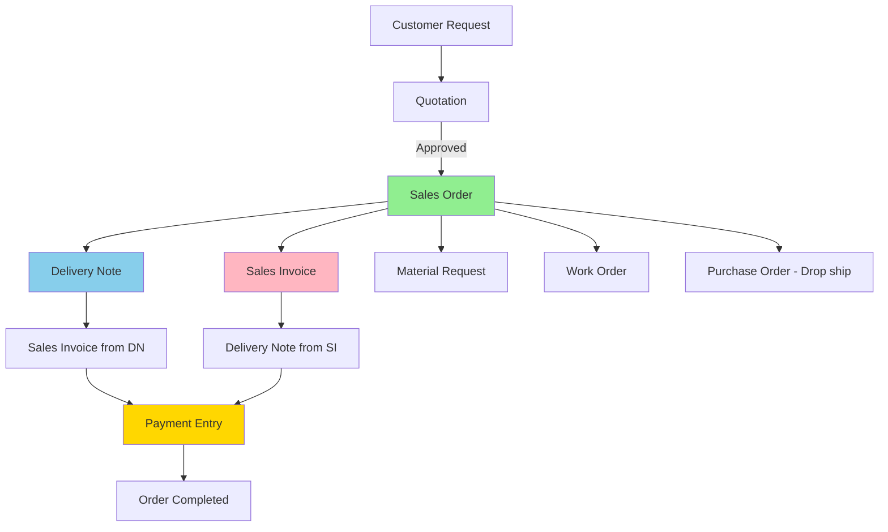
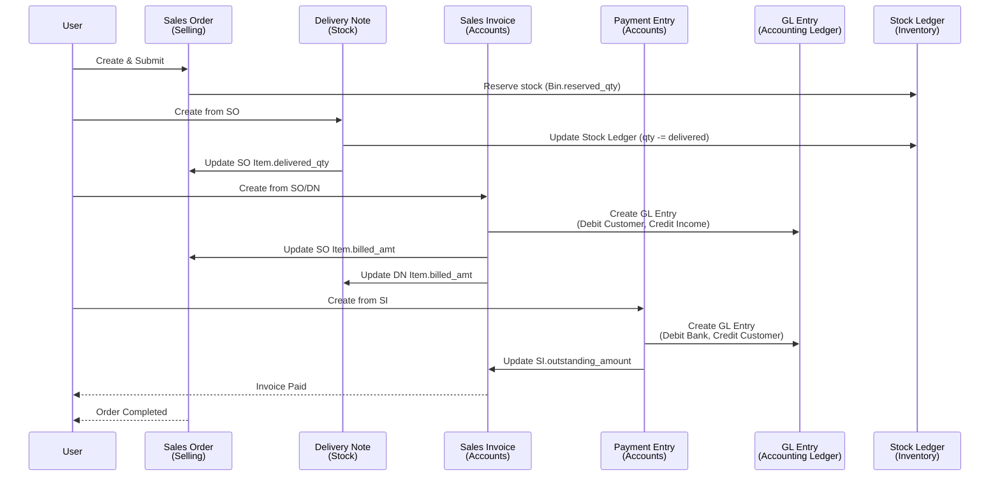
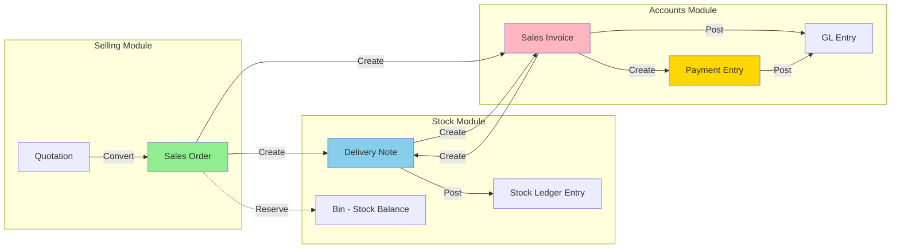
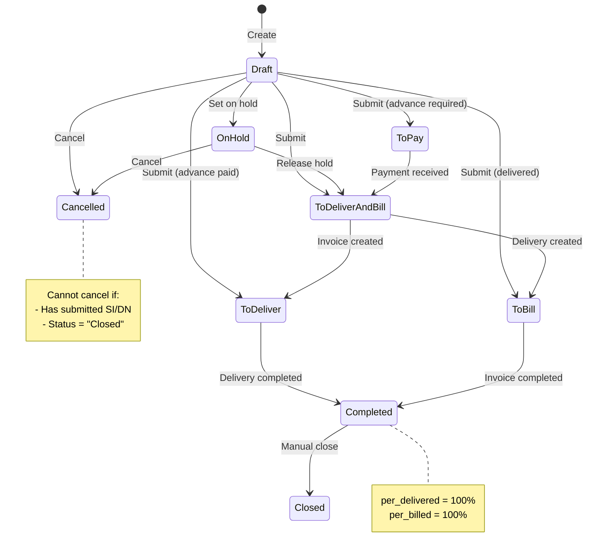
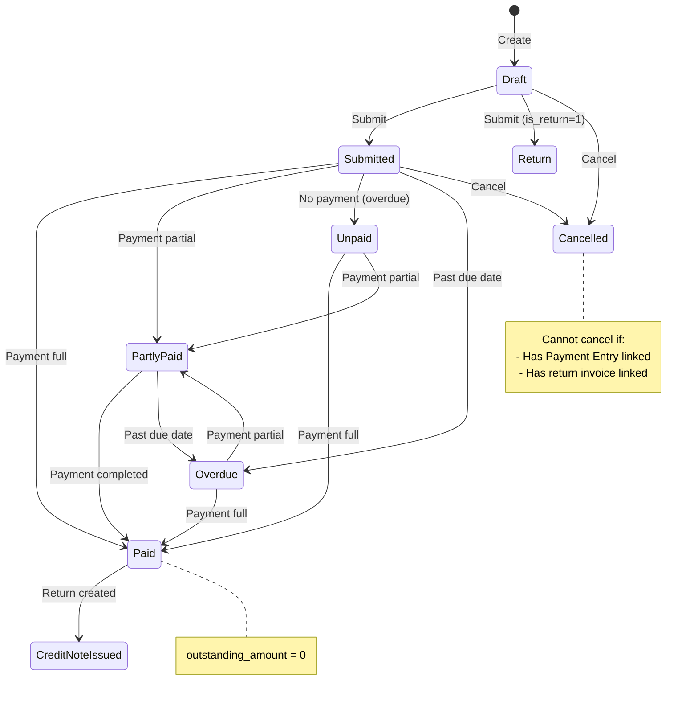
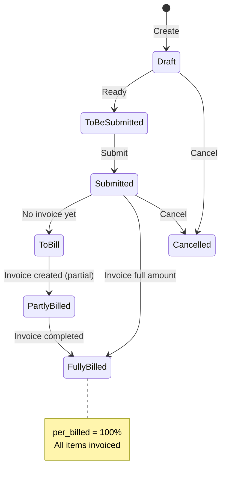

# Sales Order Ecosystem - Phân tích Workflow và các Module liên quan

> **Phân tích nghiệp vụ:** Sales Order và mối quan hệ với Invoice, Delivery Note, Payment Entry
>
> **Tạo bởi:** /analyze-workflow skill
>
> **Ngày tạo:** 14/01/2026

---

## Mục lục

1. [Tổng quan](#1-tổng-quan)
2. [Câu trả lời: Invoice có phải module riêng?](#2-câu-trả-lời-invoice-có-phải-module-riêng)
3. [Sales Order - Module chính](#3-sales-order---module-chính)
4. [Sales Invoice - Module Accounts](#4-sales-invoice---module-accounts)
5. [Delivery Note - Module Stock](#5-delivery-note---module-stock)
6. [Payment Entry - Module Accounts](#6-payment-entry---module-accounts)
7. [Data Flow - Từ Sales Order đến hoàn thành](#7-data-flow---từ-sales-order-đến-hoàn-thành)
8. [Workflow Diagrams](#8-workflow-diagrams)
9. [State Machine - Trạng thái chuyển đổi](#9-state-machine---trạng-thái-chuyển-đổi)
10. [Data Mapping Tables](#10-data-mapping-tables)
11. [Key Takeaways](#11-key-takeaways)
12. [Code References](#12-code-references)

---

## 1. Tổng quan

### 1.1. Sales Order Ecosystem

Sales Order trong ERPNext là **trung tâm của quy trình bán hàng**, nhưng **KHÔNG bao gồm Invoice**.

```
┌─────────────────────────────────────────────────────────────────────┐
│                   SALES ORDER ECOSYSTEM                              │
│                                                                      │
│  ┌──────────────┐      ┌──────────────┐      ┌──────────────┐     │
│  │ Sales Order  │──┬──→│Sales Invoice │──┬──→│Payment Entry │     │
│  │  (Selling)   │  │   │  (Accounts)  │  │   │  (Accounts)  │     │
│  └──────────────┘  │   └──────────────┘  │   └──────────────┘     │
│         │          │                      │                         │
│         │          │   ┌──────────────┐  │                         │
│         │          └──→│Delivery Note │──┘                         │
│         │              │   (Stock)    │                            │
│         │              └──────────────┘                            │
│         │                                                           │
│         ├──→ Material Request (Stock)                              │
│         ├──→ Work Order (Manufacturing)                            │
│         ├──→ Purchase Order (Buying - Drop ship)                   │
│         └──→ Pick List (Stock - Warehouse picking)                 │
│                                                                      │
└─────────────────────────────────────────────────────────────────────┘
```

### 1.2. Các Module độc lập

| Module | DocType | ERPNext Module | Mục đích |
|--------|---------|----------------|----------|
| **Bán hàng** | Sales Order | Selling | Cam kết bán hàng từ khách |
| **Kế toán** | Sales Invoice | Accounts | Ghi nhận doanh thu, phải thu |
| **Kho vận** | Delivery Note | Stock | Xuất kho, giao hàng |
| **Thanh toán** | Payment Entry | Accounts | Ghi nhận thu tiền |

**Kết luận quan trọng:**
- ✅ **4 module hoàn toàn độc lập**
- ✅ **Liên kết qua foreign key** (so_detail, dn_detail, reference_doctype)
- ✅ **Không share database table**
- ✅ **Có thể tồn tại riêng lẻ** (VD: Invoice không cần SO trong bán lẻ)

---

## 2. Câu trả lời: Invoice có phải module riêng?

### 2.1. Trả lời ngắn gọn

**CÓ - Sales Invoice là module hoàn toàn tách riêng khỏi Sales Order.**

### 2.2. Bằng chứng kỹ thuật

#### A. Khác nhau về Module

| Tiêu chí | Sales Order | Sales Invoice |
|----------|-------------|---------------|
| **ERPNext Module** | `Selling` | `Accounts` |
| **Thư mục code** | `/erpnext/selling/doctype/sales_order/` | `/erpnext/accounts/doctype/sales_invoice/` |
| **Parent Class** | `SellingController` | `SellingController` (nhưng thuộc Accounts) |
| **Database Table** | `tabSales Order` | `tabSales Invoice` |
| **Purpose** | Business workflow (CRM) | Financial accounting |

#### B. Khác nhau về chức năng

| Chức năng | Sales Order | Sales Invoice |
|-----------|-------------|---------------|
| **Tạo GL Entry** | ❌ Không | ✅ Có (Debit Customer, Credit Income) |
| **Ảnh hưởng Stock** | Reserve stock | Update stock (nếu `update_stock=1`) |
| **Payment tracking** | ❌ Không | ✅ Có (`outstanding_amount`) |
| **Billing status** | Track `per_billed` % | Source of billing data |
| **Submit ảnh hưởng** | Update stock reservation | Post to accounting ledger |
| **Cancel ảnh hưởng** | Soft close/hold | Hard reversal (GL, Stock) |

#### C. Mối quan hệ loose coupling

```python
# Sales Invoice Item có reference đến Sales Order Item
class SalesInvoiceItem:
    sales_order: Link("Sales Order")     # Reference to parent SO
    so_detail: Data                       # Sales Order Item ID (foreign key)
```

**Quan hệ:**
- **1 Sales Order** → **N Sales Invoices** (partial billing)
- **1 Sales Invoice Item** → **1 Sales Order Item** (via `so_detail`)
- **Update mechanism:** Status Updater pattern

```python
# sales_invoice.py:254-269
self.status_updater = [
    {
        "source_dt": "Sales Invoice Item",      # From SI item
        "target_dt": "Sales Order Item",        # Update SO item
        "target_field": "billed_amt",           # SO item's billed amount
        "join_field": "so_detail",              # Link via SO Item ID
        "percent_join_field": "sales_order",    # SO reference
        "status_field": "billing_status",       # SO status field
        "keyword": "Billed",                    # Status value
    }
]
```

### 2.3. Tại sao tách riêng?

#### **Lý do nghiệp vụ:**

1. **Phân biệt workflow bán hàng vs kế toán:**
   - Sales Order = Quy trình CRM (sales team quản lý)
   - Sales Invoice = Quy trình kế toán (accounting team quản lý)

2. **Hỗ trợ nhiều mô hình bán hàng:**
   - **B2B:** Quotation → Sales Order → Delivery → Invoice → Payment
   - **B2C Bán lẻ:** Invoice trực tiếp (không cần SO)
   - **POS:** Invoice + Payment tức thì (không cần SO)

3. **Phân quyền khác nhau:**
   - Sales User: Tạo/sửa Sales Order
   - Accounts User: Tạo/sửa Sales Invoice
   - Stock User: Tạo Delivery Note

#### **Lý do kỹ thuật:**

1. **Separation of Concerns:**
   - Sales Order: Business logic (pricing, approval, reservation)
   - Sales Invoice: Accounting logic (GL posting, tax, payment)

2. **Flexibility:**
   - Có thể có Invoice mà không có SO (walk-in customer)
   - Có thể có SO mà không có Invoice (cancelled order)

3. **Partial Billing:**
   - 1 SO có thể split thành nhiều Invoices
   - Track billing progress qua `per_billed` %

---

## 3. Sales Order - Module chính

### 3.1. Định nghĩa

**Sales Order** là **cam kết bán hàng** từ công ty đến khách hàng.

**File location:**
```
dcnet_core/erpnext/selling/doctype/sales_order/
├── sales_order.py          # Business logic (2095 lines)
├── sales_order.json        # DocType schema (1795 lines)
└── sales_order.js          # Frontend logic
```

### 3.2. Các trường quan trọng

| Field | Type | Purpose |
|-------|------|---------|
| `customer` | Link | Khách hàng |
| `items` | Table | Danh sách sản phẩm (Sales Order Item) |
| `grand_total` | Currency | Tổng tiền |
| `per_delivered` | Percent | % đã giao hàng |
| `per_billed` | Percent | % đã xuất hóa đơn |
| `status` | Select | Trạng thái tổng thể |
| `delivery_status` | Select | Trạng thái giao hàng |
| `billing_status` | Select | Trạng thái xuất hóa đơn |

### 3.3. Sales Order Item - Child table

| Field | Type | Purpose |
|-------|------|---------|
| `item_code` | Link | Mã sản phẩm |
| `qty` | Float | Số lượng đặt |
| `rate` | Currency | Đơn giá |
| `amount` | Currency | Thành tiền |
| `delivered_qty` | Float | Số lượng đã giao |
| `billed_amt` | Currency | Số tiền đã xuất hóa đơn |
| `warehouse` | Link | Kho xuất hàng |

### 3.4. Lifecycle - on_submit()

**File:** `sales_order.py:483-503`

```python
def on_submit(self):
    # 1. Kiểm tra hạn mức tín dụng
    self.check_credit_limit()

    # 2. Cập nhật số lượng reserved trong Bin
    self.update_reserved_qty()

    # 3. Xóa delivery schedule cũ
    self.delete_removed_delivery_schedule_items()

    # 4. Kiểm tra quyền phê duyệt
    self.validate_approving_authority()

    # 5. Cập nhật dự án (nếu có)
    self.update_project()

    # 6. Cập nhật trạng thái Quotation (nếu convert từ Quotation)
    self.update_prevdoc_status("submit")

    # 7. Cập nhật Blanket Order (nếu có)
    self.update_blanket_order()

    # 8. Tạo Stock Reservation Entry (nếu reserve_stock = 1)
    self.create_stock_reservation_entries()
```

### 3.5. Các chức năng chuyển đổi (Conversion Methods)

#### A. make_sales_invoice() - Line 1317

**Purpose:** Tạo Sales Invoice từ Sales Order

**Field mapping:**
```python
{
    "Sales Order": {
        "doctype": "Sales Invoice",
        "validation": {"docstatus": ["=", 1]}  # Chỉ từ SO đã submit
    },
    "Sales Order Item": {
        "doctype": "Sales Invoice Item",
        "field_map": {
            "name": "so_detail",           # SO Item ID
            "parent": "sales_order"        # SO reference
        }
    }
}
```

**Qty calculation:**
```python
# sales_order.py:1358-1392
target_item.qty = source_item.qty - source_item.billed_qty
target_item.amount = source_item.amount - source_item.billed_amt
```

**Condition:**
- Chỉ copy item có `billed_amt < amount` (còn tiền chưa xuất hóa đơn)

#### B. make_delivery_note() - Line 1144

**Purpose:** Tạo Delivery Note từ Sales Order

**Field mapping:**
```python
{
    "Sales Order Item": {
        "doctype": "Delivery Note Item",
        "field_map": {
            "name": "so_detail",                # SO Item ID
            "parent": "against_sales_order"     # SO reference
        }
    }
}
```

**Qty calculation:**
```python
# sales_order.py:1224-1239
target_item.qty = source_item.qty - source_item.delivered_qty
target_item.amount = source_item.amount * (1 - delivered_qty/qty)
```

**Condition:**
- Chỉ copy item có `delivered_qty < qty` (còn hàng chưa giao)
- Loại trừ `delivered_by_supplier = 1` (drop-ship)

#### C. Các conversion khác

| Method | Target DocType | Purpose | Line |
|--------|----------------|---------|------|
| `make_material_request()` | Material Request | Yêu cầu vật tư | 1012 |
| `make_pick_list()` | Pick List | Danh sách lấy hàng từ kho | 1869 |
| `make_purchase_order()` | Purchase Order | Mua hàng drop-ship | 1579 |
| `make_work_orders()` | Work Order | Lệnh sản xuất | 1764 |
| `make_project()` | Project | Dự án | 1117 |

### 3.6. Status workflow

**Status options:**
```
Draft → On Hold / To Pay / To Deliver and Bill / To Bill / To Deliver → Completed → Closed
```

**Status calculation:**
```python
# Based on per_delivered and per_billed
if per_delivered < 100 and per_billed < 100:
    status = "To Deliver and Bill"
elif per_billed < 100:
    status = "To Bill"
elif per_delivered < 100:
    status = "To Deliver"
else:
    status = "Completed"
```

---

## 4. Sales Invoice - Module Accounts

### 4.1. Định nghĩa

**Sales Invoice** là **chứng từ kế toán** ghi nhận doanh thu và phải thu từ khách hàng.

**File location:**
```
dcnet_core/erpnext/accounts/doctype/sales_invoice/
├── sales_invoice.py        # Business logic
├── sales_invoice.json      # DocType schema
└── sales_invoice.js        # Frontend logic
```

### 4.2. Sự khác biệt với Sales Order

| Khía cạnh | Sales Order | Sales Invoice |
|-----------|-------------|---------------|
| **Ý nghĩa** | Cam kết bán hàng | Ghi nhận doanh thu |
| **Tác động tài chính** | Không | Có (GL Entry) |
| **Tác động kho** | Reserve stock | Update stock (nếu `update_stock=1`) |
| **Payment** | Không liên quan | Track `outstanding_amount` |
| **Cancellation** | Soft (hold/close) | Hard (reverse GL) |

### 4.3. GL Entry khi submit

**File:** `sales_invoice.py:1445` - `make_gl_entries()`

**Accounting entries:**
```
Debit:  Customer Account (Receivable)     = grand_total
Credit: Income Account                    = net_total
Credit: Tax Account                       = tax_amount
```

**Example:**
```
Sales Invoice: SI-2026-00001
Customer: ABC Company
Grand Total: $1,180 (including 18% VAT)

GL Entries:
┌────────────────────────┬─────────┬─────────┐
│ Account                │ Debit   │ Credit  │
├────────────────────────┼─────────┼─────────┤
│ Debtors (Customer)     │ $1,180  │         │
│ Sales Income           │         │ $1,000  │
│ Output VAT 18%         │         │ $180    │
└────────────────────────┴─────────┴─────────┘
```

### 4.4. Lifecycle - on_submit()

**File:** `sales_invoice.py:435-514`

```python
def on_submit(self):
    # 1. Validate POS payment
    self.validate_pos_paid_amount()

    # 2. Tax withholding (TDS)
    SalesTaxWithholding(self).on_submit()

    # 3. Update Sales Order billing status
    self.update_status_updater_args()    # Configure tracking
    self.update_prevdoc_status()          # Update SO billed_amt

    # 4. Update Delivery Note billing status
    self.update_billing_status_in_dn()

    # 5. Stock ledger (if update_stock = 1)
    if self.update_stock == 1:
        self.update_stock_ledger()
        self.repost_future_sle_and_gle()

    # 6. Create GL Entries
    self.make_gl_entries()

    # 7. Credit limit check
    self.check_credit_limit()

    # 8. Update timesheet (if linked)
    update_time_sheet(self.name)

    # 9. Loyalty points
    if self.redeem_loyalty_points:
        self.apply_loyalty_points()
    if self.loyalty_points:
        self.make_loyalty_point_entry()
```

### 4.5. Status Updater - Cập nhật Sales Order

**File:** `sales_invoice.py:254-269`

**Configuration:**
```python
self.status_updater = [
    {
        "source_dt": "Sales Invoice Item",       # From SI item
        "target_dt": "Sales Order Item",         # Update SO item
        "target_field": "billed_amt",            # Accumulate billing
        "target_ref_field": "amount",            # Total amount
        "target_parent_dt": "Sales Order",       # Parent SO
        "target_parent_field": "per_billed",     # Billing %
        "join_field": "so_detail",               # Link field
        "percent_join_field": "sales_order",     # SO reference
        "status_field": "billing_status",        # SO status
        "keyword": "Billed",                     # Status value
    }
]
```

**How it works:**
1. When SI submitted → For each SI Item:
2. Find linked SO Item via `so_detail`
3. Update `SO Item.billed_amt += SI Item.amount`
4. Recalculate `SO.per_billed = SUM(billed_amt) / SUM(amount) * 100`
5. Update `SO.billing_status` based on per_billed

### 4.6. Payment tracking

**Outstanding amount:**
```python
outstanding_amount = grand_total - paid_amount - write_off_amount
```

**Payment Entry linkage:**
- Payment Entry có table `references`
- Mỗi reference có:
  - `reference_doctype = "Sales Invoice"`
  - `reference_name = SI-2026-00001`
  - `allocated_amount = 500.00`

**When payment allocated:**
```python
# payment_entry.py:504
if reference.reference_doctype == "Sales Invoice":
    update_outstanding_amount(reference.reference_name, allocated_amount)
```

---

## 5. Delivery Note - Module Stock

### 5.1. Định nghĩa

**Delivery Note** là **chứng từ giao hàng**, ghi nhận việc xuất kho và giao hàng cho khách.

**File location:**
```
dcnet_core/erpnext/stock/doctype/delivery_note/
├── delivery_note.py        # Business logic
├── delivery_note.json      # DocType schema
└── delivery_note.js        # Frontend logic
```

### 5.2. Quan hệ với Sales Order

**Delivery Note Item có reference:**
```python
class DeliveryNoteItem:
    against_sales_order: Link("Sales Order")    # SO reference
    so_detail: Data                              # SO Item ID
```

**Status tracking:**
```python
# delivery_note.py:165
{
    "target_dt": "Sales Order Item",
    "target_field": "delivered_qty",        # Accumulate delivered
    "percent_join_field": "against_sales_order",
    "status_field": "delivery_status",
    "keyword": "Delivered",
}
```

### 5.3. Quan hệ với Sales Invoice

**2 chiều conversion:**

#### A. Sales Order → Delivery Note → Sales Invoice
```
1. SO → DN (make_delivery_note)
2. DN → SI (make_sales_invoice from DN)
```

#### B. Sales Order → Sales Invoice → Delivery Note
```
1. SO → SI (make_sales_invoice)
2. SI → DN (make_delivery_note from SI)
```

**Delivery Note Item khi tạo từ SI:**
```python
# sales_invoice.py:2352-2394
{
    "Sales Invoice Item": {
        "doctype": "Delivery Note Item",
        "field_map": {
            "name": "si_detail",                    # SI Item ID
            "parent": "against_sales_invoice",      # SI reference
            "sales_order": "against_sales_order",   # SO reference
            "so_detail": "so_detail",               # SO Item ID
        }
    }
}
```

### 5.4. Billing status tracking

**When Sales Invoice submitted:**
```python
# sales_invoice.py:1932-1956
def update_billing_status_in_dn(self):
    for item in self.items:
        if item.dn_detail:  # If created from DN
            # Update DN Item.billed_amt
            total_billed = sum(SI items with same dn_detail)
            frappe.db.set_value("Delivery Note Item", item.dn_detail,
                               "billed_amt", total_billed)
```

**Delivery Note tracks:**
- `per_billed = SUM(billed_amt) / SUM(amount) * 100`
- `billing_status` = "Not Billed" / "Partly Billed" / "Fully Billed"

---

## 6. Payment Entry - Module Accounts

### 6.1. Định nghĩa

**Payment Entry** là **chứng từ thu/chi tiền**, ghi nhận việc thu tiền từ khách hàng hoặc trả tiền cho nhà cung cấp.

**File location:**
```
dcnet_core/erpnext/accounts/doctype/payment_entry/
├── payment_entry.py        # Business logic
├── payment_entry.json      # DocType schema
└── payment_entry.js        # Frontend logic
```

### 6.2. Quan hệ với Sales Invoice

**Payment Entry Reference table:**
```python
class PaymentEntryReference:
    reference_doctype: Link        # "Sales Invoice"
    reference_name: Dynamic Link   # SI-2026-00001
    total_amount: Currency         # Invoice grand total
    outstanding_amount: Currency   # Remaining amount
    allocated_amount: Currency     # Amount paid in this PE
```

**Example:**
```
Payment Entry: PAY-2026-00001
Party: ABC Company
Paid Amount: $1,000

References table:
┌─────────────────┬──────────────────┬─────────┬──────────────┬───────────┐
│ Doc Type        │ Doc Name         │ Total   │ Outstanding  │ Allocated │
├─────────────────┼──────────────────┼─────────┼──────────────┼───────────┤
│ Sales Invoice   │ SI-2026-00001    │ $1,180  │ $1,180       │ $500      │
│ Sales Invoice   │ SI-2026-00002    │ $800    │ $800         │ $500      │
└─────────────────┴──────────────────┴─────────┴──────────────┴───────────┘
```

### 6.3. Outstanding amount update

**When Payment Entry submitted:**
```python
# payment_entry.py:730
if d.reference_doctype == "Sales Invoice":
    # Update SI outstanding_amount
    outstanding = total_amount - allocated_amount
    frappe.db.set_value("Sales Invoice", d.reference_name,
                       "outstanding_amount", outstanding)
```

### 6.4. GL Entry khi submit

**Accounting entries:**
```
Debit:  Bank Account / Cash Account      = paid_amount
Credit: Customer Account (Receivable)    = paid_amount
```

**Example:**
```
Payment Entry: PAY-2026-00001
Amount: $1,000

GL Entries:
┌────────────────────────┬─────────┬─────────┐
│ Account                │ Debit   │ Credit  │
├────────────────────────┼─────────┼─────────┤
│ Bank Account           │ $1,000  │         │
│ Debtors (Customer)     │         │ $1,000  │
└────────────────────────┴─────────┴─────────┘
```

---

## 7. Data Flow - Từ Sales Order đến hoàn thành

### 7.1. Scenario 1: Standard flow (SO → DN → SI → PE)

**Step-by-step:**

```
Step 1: Sales Order submitted
├── Customer: ABC Company
├── Item: Golf Club Set x 10
├── Rate: $100/unit
├── Amount: $1,000
└── Status: To Deliver and Bill

↓ Click "Create → Delivery Note"

Step 2: Delivery Note created
├── Against Sales Order: SO-2026-00001
├── SO Detail: SO-ITEM-00001
├── Qty: 10 (full delivery)
└── When submitted:
    ├── Update Stock Ledger (qty -= 10)
    ├── SO Item.delivered_qty = 10
    ├── SO.per_delivered = 100%
    └── SO.delivery_status = "Fully Delivered"

↓ Click "Create → Sales Invoice" from DN

Step 3: Sales Invoice created
├── Against Sales Order: SO-2026-00001
├── SO Detail: SO-ITEM-00001
├── DN Detail: DN-ITEM-00001
├── Amount: $1,000 + $180 tax = $1,180
└── When submitted:
    ├── Create GL Entry:
    │   ├── Debit: Debtors $1,180
    │   ├── Credit: Sales $1,000
    │   └── Credit: Output VAT $180
    ├── SO Item.billed_amt = $1,000
    ├── SO.per_billed = 100%
    ├── SO.billing_status = "Fully Billed"
    ├── DN Item.billed_amt = $1,000
    ├── DN.per_billed = 100%
    └── SI.outstanding_amount = $1,180

↓ Click "Create → Payment Entry" from SI

Step 4: Payment Entry created
├── Party: ABC Company
├── Paid Amount: $1,180
├── References:
│   └── SI-2026-00001: $1,180
└── When submitted:
    ├── Create GL Entry:
    │   ├── Debit: Bank $1,180
    │   └── Credit: Debtors $1,180
    ├── SI.outstanding_amount = $0
    ├── SI.status = "Paid"
    └── SO.payment_status = "Paid" (if tracked)

Final Result:
├── SO.status = "Completed"
├── SO.delivery_status = "Fully Delivered"
├── SO.billing_status = "Fully Billed"
└── DN.billing_status = "Fully Billed"
```

### 7.2. Scenario 2: POS flow (Invoice + Payment tức thì)

```
Step 1: Sales Invoice (POS mode)
├── is_pos = 1
├── update_stock = 1        # Update stock immediately
├── Amount: $1,180
├── Payments table:
│   └── Mode: Cash, Amount: $1,180
└── When submitted:
    ├── Update Stock Ledger (no DN needed)
    ├── Create GL Entry (Debit Customer, Credit Income)
    ├── Create GL Entry (Debit Cash, Credit Customer)
    ├── outstanding_amount = $0
    └── status = "Paid"

Final Result:
├── No Sales Order
├── No Delivery Note
└── Payment done immediately
```

### 7.3. Scenario 3: Partial billing

```
Step 1: Sales Order
├── Item: Golf Club x 100
├── Amount: $10,000
└── Status: To Deliver and Bill

↓ Partial delivery

Step 2: Delivery Note #1
├── Qty: 50 (partial)
└── When submitted:
    ├── SO Item.delivered_qty = 50
    ├── SO.per_delivered = 50%
    └── SO.delivery_status = "Partly Delivered"

↓ Create Invoice from DN #1

Step 3: Sales Invoice #1
├── Qty: 50
├── Amount: $5,000 + $900 tax = $5,900
└── When submitted:
    ├── SO Item.billed_amt = $5,000
    ├── SO.per_billed = 50%
    └── SO.billing_status = "Partly Billed"

↓ Second delivery

Step 4: Delivery Note #2
├── Qty: 50 (remaining)
└── When submitted:
    ├── SO Item.delivered_qty = 100
    ├── SO.per_delivered = 100%
    └── SO.delivery_status = "Fully Delivered"

↓ Create Invoice from DN #2

Step 5: Sales Invoice #2
├── Qty: 50
├── Amount: $5,000 + $900 tax = $5,900
└── When submitted:
    ├── SO Item.billed_amt = $10,000
    ├── SO.per_billed = 100%
    ├── SO.billing_status = "Fully Billed"
    └── SO.status = "Completed"

Final Result:
├── 1 Sales Order
├── 2 Delivery Notes
├── 2 Sales Invoices
└── Can have multiple Payment Entries
```

---

## 8. Workflow Diagrams

### 8.1. Complete Sales Cycle



### 8.2. Data Flow Diagram



### 8.3. Module Relationship Diagram



---

## 9. State Machine - Trạng thái chuyển đổi

### 9.1. Sales Order Status



### 9.2. Sales Invoice Status



### 9.3. Delivery Note Status



---

## 10. Data Mapping Tables

### 10.1. Sales Order → Sales Invoice

| Sales Order Field | Sales Invoice Field | Mapping Type | Notes |
|-------------------|---------------------|--------------|-------|
| `customer` | `customer` | Direct copy | Same customer |
| `currency` | `currency` | Direct copy | Same currency |
| `price_list` | `selling_price_list` | Direct copy | Same price list |
| `items` (table) | `items` (table) | Child mapping | See below |
| `taxes_and_charges` | `taxes_and_charges` | Direct copy | Same tax template |
| `sales_team` | `sales_team` | Direct copy | Commission tracking |

**Sales Order Item → Sales Invoice Item:**

| SO Item Field | SI Item Field | Calculation | Notes |
|---------------|---------------|-------------|-------|
| `name` | `so_detail` | ID reference | Foreign key |
| `parent` | `sales_order` | SO name | Parent reference |
| `item_code` | `item_code` | Direct copy | Same item |
| `qty` | `qty` | `qty - billed_qty` | **Remaining quantity** |
| `rate` | `rate` | Direct copy | Same price |
| `amount` | `amount` | `(qty - billed_qty) * rate` | **Remaining amount** |
| `warehouse` | `warehouse` | Direct copy | Same warehouse |
| `cost_center` | `cost_center` | Direct copy | Same cost center |

**Code reference:**
```python
# sales_order.py:1358-1392
def update_item(source, target, source_parent):
    target.qty = flt(source.qty) - flt(source.billed_qty)
    target.amount = flt(source.amount) - flt(source.billed_amt)
```

### 10.2. Sales Order → Delivery Note

| Sales Order Field | Delivery Note Field | Mapping Type | Notes |
|-------------------|---------------------|--------------|-------|
| `customer` | `customer` | Direct copy | Same customer |
| `items` (table) | `items` (table) | Child mapping | See below |

**Sales Order Item → Delivery Note Item:**

| SO Item Field | DN Item Field | Calculation | Notes |
|---------------|---------------|-------------|-------|
| `name` | `so_detail` | ID reference | Foreign key |
| `parent` | `against_sales_order` | SO name | Parent reference |
| `item_code` | `item_code` | Direct copy | Same item |
| `qty` | `qty` | `qty - delivered_qty` | **Remaining quantity** |
| `rate` | `rate` | Direct copy | Same price |
| `amount` | `amount` | `amount * (1 - delivered_qty/qty)` | **Remaining amount** |
| `warehouse` | `warehouse` | Direct copy | Source warehouse |

**Condition:**
- Only items with `delivered_qty < qty`
- Exclude items with `delivered_by_supplier = 1` (drop-ship)

**Code reference:**
```python
# sales_order.py:1224-1239
def update_item(source, target, source_parent):
    target.qty = flt(source.qty) - flt(source.delivered_qty)
    if source.qty:
        target.amount = source.amount * (1 - delivered_qty/qty)
```

### 10.3. Delivery Note → Sales Invoice

| Delivery Note Field | Sales Invoice Field | Mapping Type | Notes |
|---------------------|---------------------|--------------|-------|
| `customer` | `customer` | Direct copy | Same customer |
| `items` (table) | `items` (table) | Child mapping | See below |

**Delivery Note Item → Sales Invoice Item:**

| DN Item Field | SI Item Field | Calculation | Notes |
|---------------|---------------|-------------|-------|
| `name` | `dn_detail` | ID reference | Foreign key |
| `parent` | `delivery_note` | DN name | Parent reference |
| `against_sales_order` | `sales_order` | SO reference | Link to SO |
| `so_detail` | `so_detail` | SO Item ID | Link to SO Item |
| `item_code` | `item_code` | Direct copy | Same item |
| `qty` | `qty` | Direct copy | Full delivered qty |
| `rate` | `rate` | Direct copy | Same price |
| `warehouse` | `warehouse` | Direct copy | Same warehouse |

**Code reference:**
```python
# delivery_note.py:841 - make_sales_invoice()
{
    "Delivery Note Item": {
        "doctype": "Sales Invoice Item",
        "field_map": {
            "name": "dn_detail",
            "parent": "delivery_note",
            "so_detail": "so_detail",
            "against_sales_order": "sales_order",
        }
    }
}
```

### 10.4. Sales Invoice Item → Sales Order Item (Status Update)

**When Sales Invoice submitted:**

| Action | Field Updated | Calculation |
|--------|---------------|-------------|
| **Update billing** | `SO Item.billed_amt` | `+= SI Item.amount` |
| **Calculate %** | `SO.per_billed` | `SUM(billed_amt) / SUM(amount) * 100` |
| **Update status** | `SO.billing_status` | Based on `per_billed` |

**Status mapping:**
```python
if per_billed == 0:
    billing_status = "Not Billed"
elif per_billed < 100:
    billing_status = "Partly Billed"
else:
    billing_status = "Fully Billed"
```

**Code reference:**
```python
# sales_invoice.py:254-269
self.status_updater = [{
    "source_dt": "Sales Invoice Item",
    "target_dt": "Sales Order Item",
    "target_field": "billed_amt",
    "join_field": "so_detail",
}]
```

### 10.5. Sales Invoice → Payment Entry

| Sales Invoice Field | Payment Entry Field | Mapping Type | Notes |
|---------------------|---------------------|--------------|-------|
| `customer` | `party` | Direct copy | Customer |
| `grand_total` | `references[].total_amount` | Reference | Total invoice |
| `outstanding_amount` | `references[].outstanding_amount` | Reference | Remaining |
| - | `references[].allocated_amount` | User input | Amount to pay |

**Payment Entry Reference table:**

| Field | Type | Value | Notes |
|-------|------|-------|-------|
| `reference_doctype` | Link | "Sales Invoice" | Document type |
| `reference_name` | Dynamic Link | "SI-2026-00001" | Invoice ID |
| `total_amount` | Currency | $1,180 | Invoice total |
| `outstanding_amount` | Currency | $1,180 → $0 | Updated on payment |
| `allocated_amount` | Currency | $1,180 | Amount paid |

---

## 11. Key Takeaways

### 11.1. Câu trả lời chính: Invoice có phải module riêng?

**✅ CÓ - Sales Invoice là module hoàn toàn độc lập:**

1. **Khác module:** Selling vs Accounts
2. **Khác database:** `tabSales Order` vs `tabSales Invoice`
3. **Khác purpose:** Business workflow vs Financial accounting
4. **Loose coupling:** Liên kết qua foreign key (so_detail)

### 11.2. Tại sao tách riêng?

#### **Lợi ích nghiệp vụ:**
- ✅ Phân quyền khác nhau (Sales vs Accounts team)
- ✅ Hỗ trợ nhiều mô hình bán hàng (B2B, B2C, POS)
- ✅ Partial billing (1 SO → nhiều SI)
- ✅ Flexibility (có thể có SI không cần SO)

#### **Lợi ích kỹ thuật:**
- ✅ Separation of concerns (business vs accounting)
- ✅ Independent lifecycle (submit/cancel khác nhau)
- ✅ Modular architecture (dễ maintain, extend)

### 11.3. Quy trình chuẩn (Best Practices)

**B2B Standard flow:**
```
Quotation → Sales Order → Delivery Note → Sales Invoice → Payment Entry
```

**B2C Retail flow:**
```
Sales Invoice (POS mode) → Payment immediate
```

**Manufacturing flow:**
```
Sales Order → Work Order → Delivery Note → Sales Invoice → Payment
```

### 11.4. Các module vệ tinh

| Module | Purpose | Link to SO | Link to SI |
|--------|---------|------------|------------|
| **Delivery Note** | Xuất kho, giao hàng | ✅ `against_sales_order` | ✅ `against_sales_invoice` |
| **Payment Entry** | Thu/chi tiền | ❌ No direct link | ✅ `references` table |
| **Material Request** | Yêu cầu vật tư | ✅ `sales_order` | ❌ No link |
| **Work Order** | Lệnh sản xuất | ✅ `sales_order` | ❌ No link |
| **Pick List** | Lấy hàng từ kho | ✅ `sales_order` | ❌ No link |

### 11.5. Status tracking logic

**Sales Order tracks 3 dimensions:**
1. **Delivery:** `per_delivered` % → `delivery_status`
2. **Billing:** `per_billed` % → `billing_status`
3. **Payment:** `advance_paid` → `payment_status` (optional)

**Status calculation:**
```python
if per_delivered < 100 and per_billed < 100:
    status = "To Deliver and Bill"
elif per_billed < 100:
    status = "To Bill"
elif per_delivered < 100:
    status = "To Deliver"
else:
    status = "Completed"
```

### 11.6. GL Entry impact

**Only Sales Invoice & Payment Entry create GL entries:**

| Module | GL Entry | Stock Entry |
|--------|----------|-------------|
| Sales Order | ❌ No | Reserve only |
| Delivery Note | ❌ No | ✅ Yes (Stock Ledger) |
| Sales Invoice | ✅ Yes | ✅ Yes (if `update_stock=1`) |
| Payment Entry | ✅ Yes | ❌ No |

**Sales Invoice GL:**
```
Debit:  Customer (Receivable)
Credit: Income Account
Credit: Tax Account
```

**Payment Entry GL:**
```
Debit:  Bank/Cash
Credit: Customer (Receivable)
```

### 11.7. Cancellation rules

| Module | Can Cancel If | Cannot Cancel If |
|--------|---------------|------------------|
| **Sales Order** | No linked SI/DN | Has submitted SI/DN, or status="Closed" |
| **Delivery Note** | No linked SI | Has linked Sales Invoice |
| **Sales Invoice** | No Payment Entry | Has Payment Entry, or has Return Invoice |
| **Payment Entry** | Unallocated | (Usually can cancel, but must reverse SI outstanding) |

---

## 12. Code References

### 12.1. Sales Order

| File | Line | Function | Purpose |
|------|------|----------|---------|
| `sales_order.py` | 483 | `on_submit()` | Submit lifecycle |
| `sales_order.py` | 512 | `on_cancel()` | Cancel lifecycle |
| `sales_order.py` | 1317 | `make_sales_invoice()` | Convert SO → SI |
| `sales_order.py` | 1144 | `make_delivery_note()` | Convert SO → DN |
| `sales_order.py` | 612 | `update_reserved_qty()` | Update stock reservation |
| `sales_order.py` | 565 | `check_nextdoc_docstatus()` | Prevent cancel if has SI |

### 12.2. Sales Invoice

| File | Line | Function | Purpose |
|------|------|----------|---------|
| `sales_invoice.py` | 435 | `on_submit()` | Submit lifecycle |
| `sales_invoice.py` | 569 | `on_cancel()` | Cancel lifecycle |
| `sales_invoice.py` | 254 | `status_updater` | Configure SO billing tracking |
| `sales_invoice.py` | 1445 | `make_gl_entries()` | Create GL entries |
| `sales_invoice.py` | 1932 | `update_billing_status_in_dn()` | Update DN billing |
| `sales_invoice.py` | 2352 | `make_delivery_note()` | Convert SI → DN |

### 12.3. Delivery Note

| File | Line | Function | Purpose |
|------|------|----------|---------|
| `delivery_note.py` | 165 | `status_updater` | Configure SO delivery tracking |
| `delivery_note.py` | 841 | `make_sales_invoice()` | Convert DN → SI |
| `delivery_note.py` | 273 | `validate()` | Check SO references |

### 12.4. Payment Entry

| File | Line | Function | Purpose |
|------|------|----------|---------|
| `payment_entry.py` | 408 | Validate reference doctype | Check SI/SO references |
| `payment_entry.py` | 504 | Update outstanding | Update SI outstanding amount |
| `payment_entry.py` | 730 | Allocate payment | Allocate to SI |

---

## Kết luận

**Sales Order và Sales Invoice là 2 module hoàn toàn độc lập**, chỉ liên kết qua foreign key references:

1. **Sales Order** (Selling Module):
   - Business workflow
   - Cam kết bán hàng
   - Reserve stock
   - Track delivery & billing progress

2. **Sales Invoice** (Accounts Module):
   - Financial accounting
   - Ghi nhận doanh thu
   - Create GL entries
   - Track payment

3. **Delivery Note** (Stock Module):
   - Warehouse operations
   - Xuất kho
   - Update stock ledger
   - Track billing

4. **Payment Entry** (Accounts Module):
   - Cash/Bank transactions
   - Thu/chi tiền
   - Update outstanding
   - Clear receivables

**Mối quan hệ:** Loose coupling qua status updater pattern và foreign key references.

**Best Practice:** Follow standard flow (SO → DN → SI → PE) cho B2B, hoặc direct SI cho bán lẻ.

---

**Document version:** 1.0
**Generated by:** /analyze-workflow skill
**Date:** 14/01/2026
**Analyzed modules:** Sales Order, Sales Invoice, Delivery Note, Payment Entry
**Total code references:** 15+ methods across 4 modules
