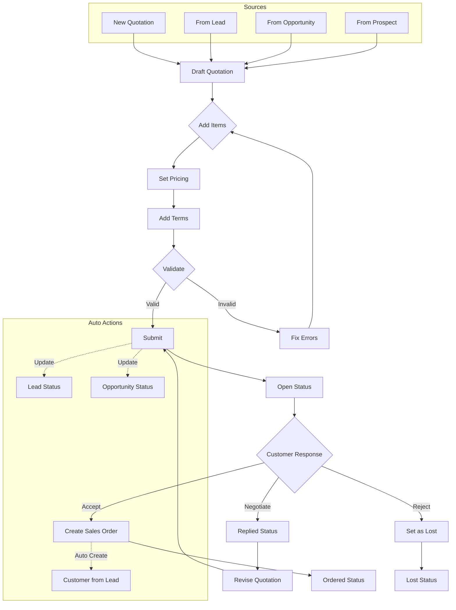
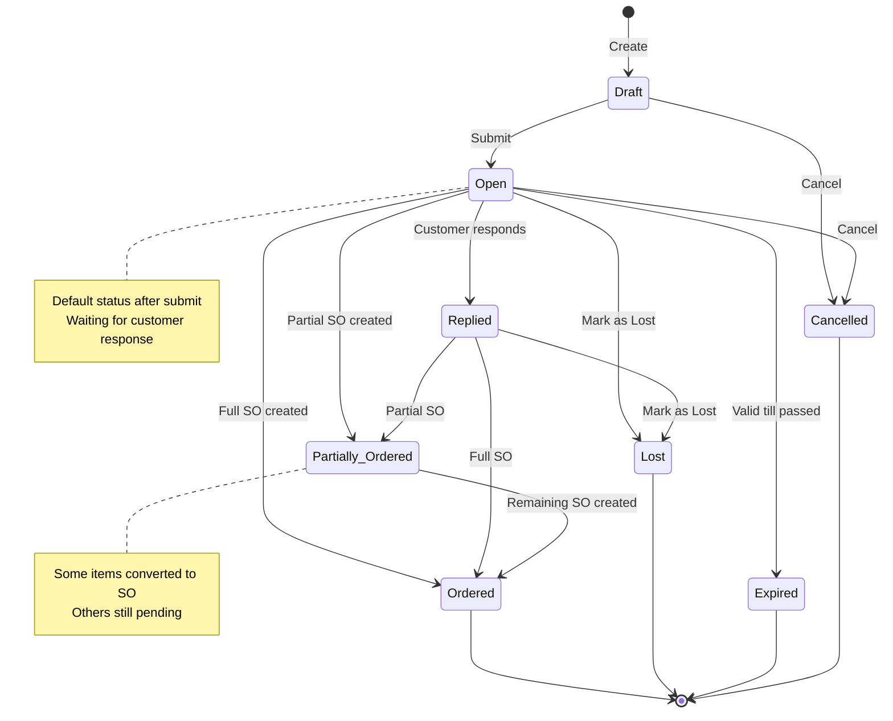
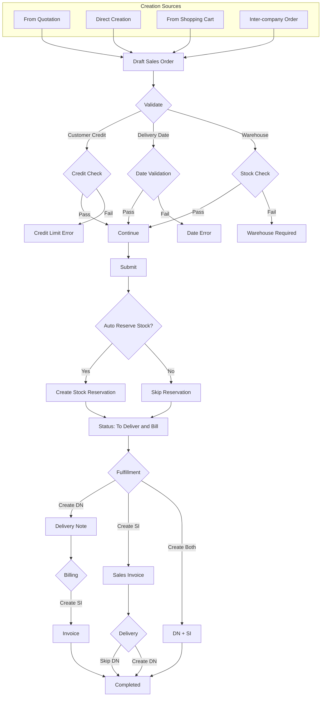
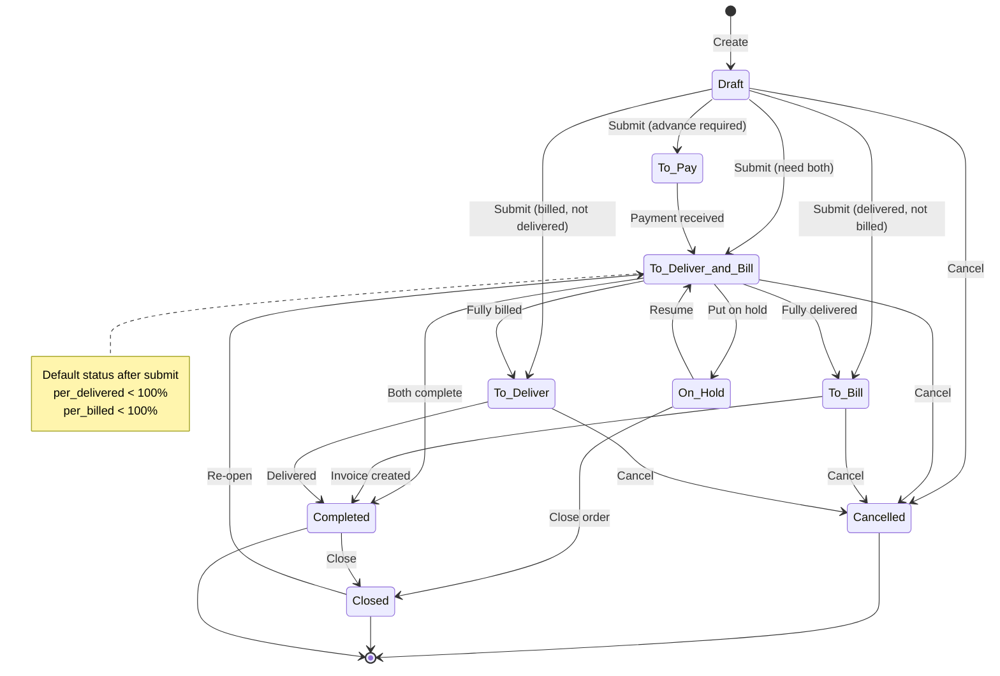
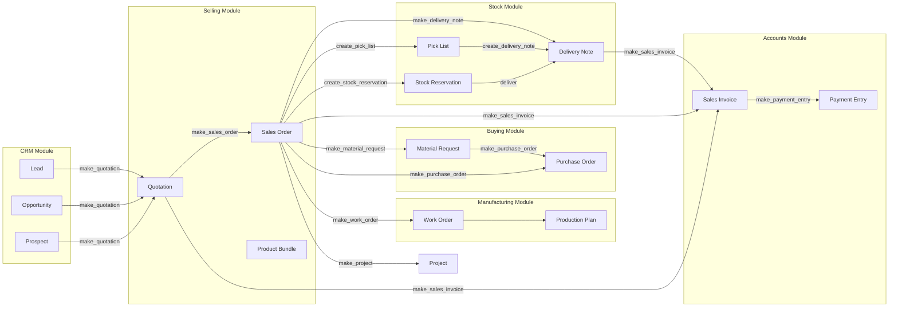
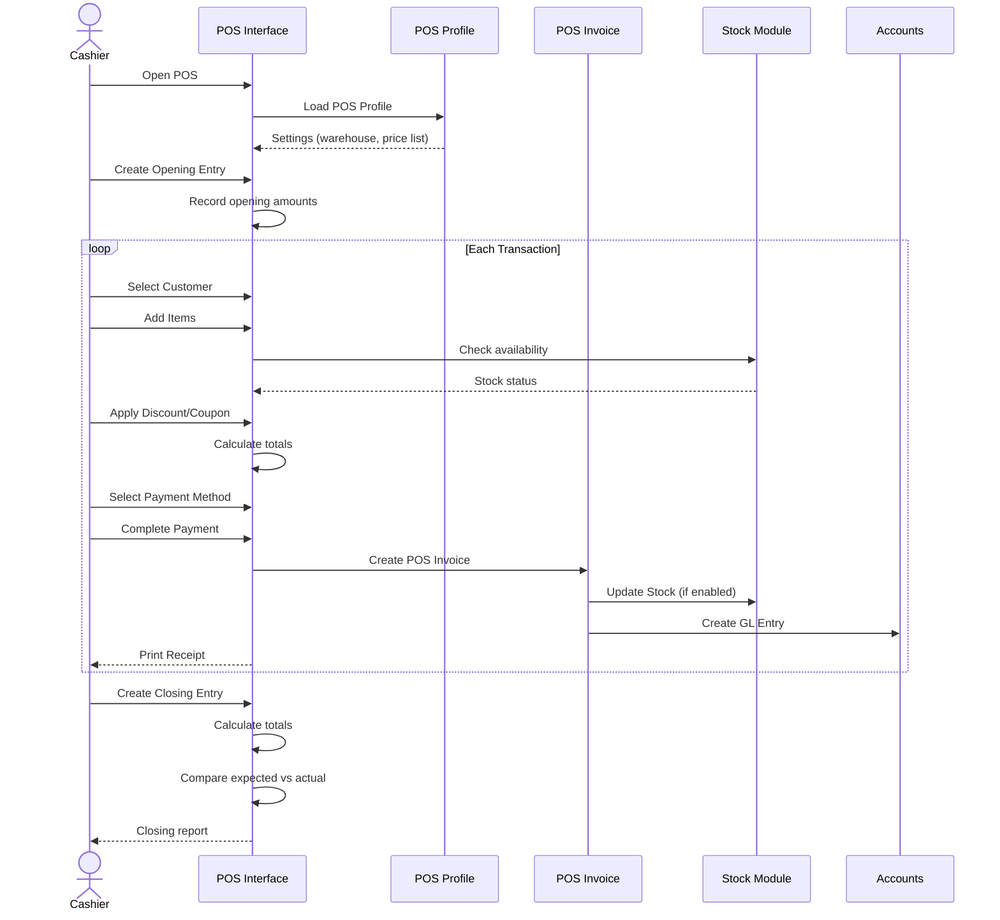
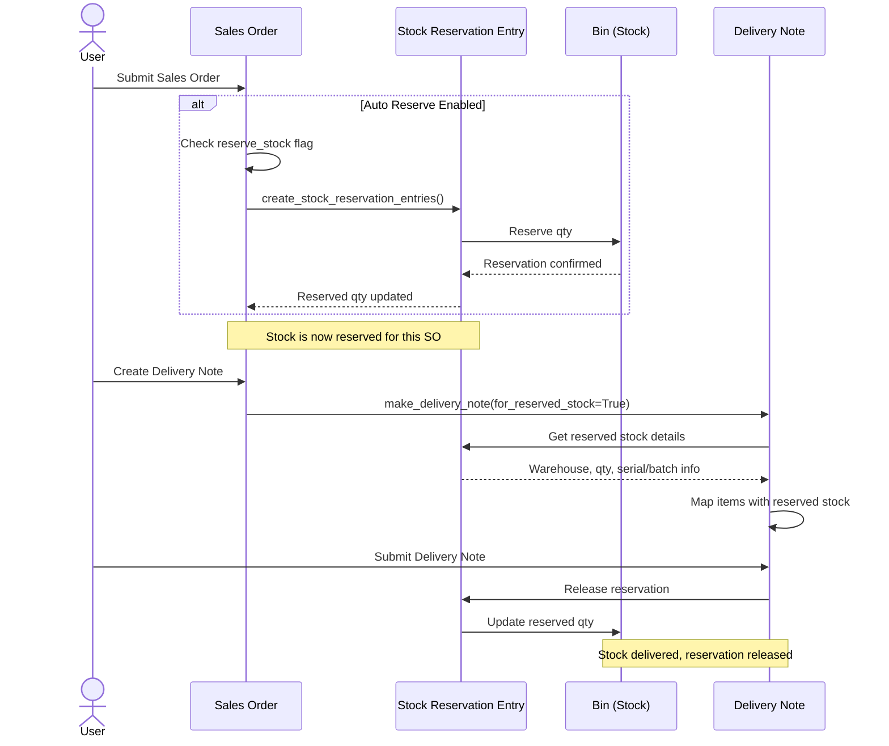
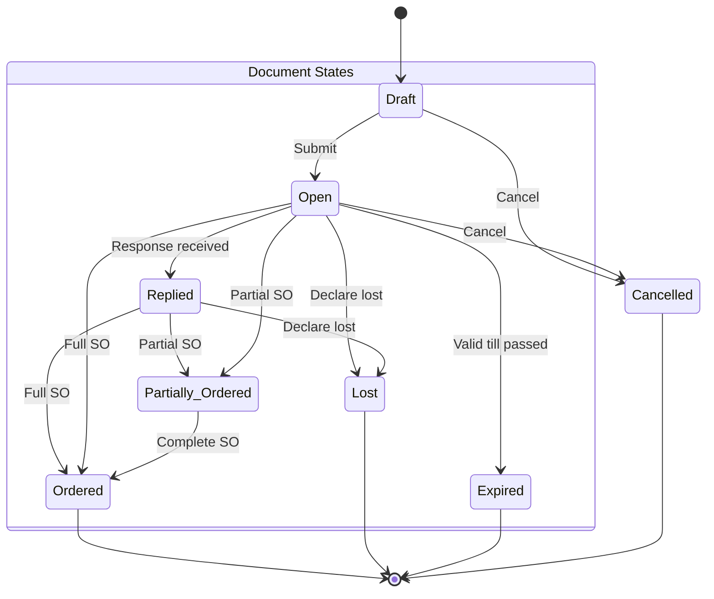
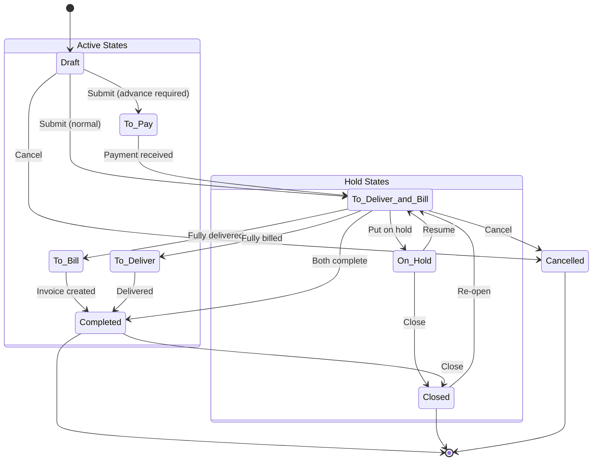

# Selling Module Workflow Analysis - ERPNext v16

> **Document:** Comprehensive workflow analysis for ERPNext Selling module
> **Generated:** 29/01/2026
> **Version:** 1.0

---

## Table of Contents

1. [Tổng quan Module Selling](#1-tổng-quan-module-selling)
2. [Cấu trúc DocTypes](#2-cấu-trúc-doctypes)
3. [Workspace UI - Giao diện người dùng](#3-workspace-ui---giao-diện-người-dùng)
4. [Quotation Workflow](#4-quotation-workflow)
5. [Sales Order Workflow](#5-sales-order-workflow)
6. [Document Conversion Flow](#6-document-conversion-flow)
7. [Customer Management](#7-customer-management)
8. [Point of Sale (POS)](#8-point-of-sale-pos)
9. [Reports & Analytics](#9-reports--analytics)
10. [Stock Reservation](#10-stock-reservation)
11. [Integration Points](#11-integration-points)
12. [State Machines](#12-state-machines)
13. [Data Mapping Tables](#13-data-mapping-tables)
14. [Key Takeaways](#14-key-takeaways)
15. [Code References](#15-code-references)

---

## 1. Tổng quan Module Selling

### 1.1. Giới thiệu

Module **Selling** là trung tâm quản lý bán hàng trong ERPNext, xử lý toàn bộ quy trình từ báo giá đến hoàn thành đơn hàng. Module này tích hợp chặt chẽ với:

- **CRM Module**: Lead, Opportunity → Quotation
- **Stock Module**: Delivery Note, Stock Reservation
- **Accounts Module**: Sales Invoice, Payment Entry
- **Manufacturing Module**: Work Order, Production Plan

### 1.2. Core Process Flow

```
┌─────────────────────────────────────────────────────────────────────────────┐
│                        SELLING MODULE - CORE FLOW                            │
├─────────────────────────────────────────────────────────────────────────────┤
│                                                                              │
│   CRM STAGE                    SELLING STAGE                   FULFILLMENT  │
│   ─────────                    ─────────────                   ───────────  │
│                                                                              │
│   ┌───────┐    ┌───────────┐    ┌───────────┐    ┌──────────┐              │
│   │ Lead  │───▶│ Quotation │───▶│Sales Order│───▶│ Delivery │              │
│   └───────┘    └───────────┘    └───────────┘    │   Note   │              │
│       │              │               │           └──────────┘              │
│       │              │               │                 │                    │
│       ▼              │               │                 ▼                    │
│   ┌───────┐          │               │           ┌──────────┐              │
│   │Opport.│──────────┘               │           │  Sales   │              │
│   └───────┘                          │           │ Invoice  │              │
│       │                              │           └──────────┘              │
│       ▼                              │                 │                    │
│   ┌───────┐                          │                 ▼                    │
│   │Prospe.│                          │           ┌──────────┐              │
│   └───────┘                          │           │ Payment  │              │
│                                      │           │  Entry   │              │
│                                      │           └──────────┘              │
│                                      │                                      │
│                                      ├───▶ Material Request ──▶ Purchase   │
│                                      │                         Order       │
│                                      │                                      │
│                                      └───▶ Work Order ──────▶ Production   │
│                                                                              │
└─────────────────────────────────────────────────────────────────────────────┘
```

### 1.3. Key Statistics

| Category | Count | Description |
|----------|-------|-------------|
| **DocTypes** | 20 | Main + Child tables |
| **Reports** | 23 | Script + Query reports |
| **Dashboard Charts** | 4 | Visual analytics |
| **Number Cards** | 7 | KPI metrics |
| **Pages** | 2 | POS, Sales Funnel |

---

## 2. Cấu trúc DocTypes

### 2.1. Main Transaction DocTypes

```
┌─────────────────────────────────────────────────────────────────┐
│                    MAIN TRANSACTION DOCTYPES                     │
├─────────────────────────────────────────────────────────────────┤
│                                                                  │
│  ┌─────────────┐    ┌─────────────┐    ┌─────────────────────┐ │
│  │  QUOTATION  │    │ SALES ORDER │    │  INSTALLATION NOTE  │ │
│  ├─────────────┤    ├─────────────┤    ├─────────────────────┤ │
│  │ Submittable │    │ Submittable │    │     Submittable     │ │
│  │ Multi-party │    │ Customer    │    │   Track installs    │ │
│  │ Validity    │    │ Stock Rsv   │    │   at customer site  │ │
│  │ Alternative │    │ Delivery    │    │                     │ │
│  │   Items     │    │ Schedule    │    │                     │ │
│  └─────────────┘    └─────────────┘    └─────────────────────┘ │
│                                                                  │
│  ┌─────────────────────────────────────────────────────────────┐│
│  │                     PRODUCT BUNDLE                          ││
│  │  Bundle multiple items together as one selling product      ││
│  └─────────────────────────────────────────────────────────────┘│
│                                                                  │
└─────────────────────────────────────────────────────────────────┘
```

### 2.2. DocType Details

#### A. Quotation (Báo giá)

**Location:** `dcnet_core/erpnext/selling/doctype/quotation/`

| Field | Type | Description |
|-------|------|-------------|
| `quotation_to` | Link | Target: Customer, Lead, Prospect |
| `party_name` | Dynamic Link | ID của đối tác |
| `valid_till` | Date | Ngày hết hạn báo giá |
| `order_type` | Select | Sales, Maintenance, Shopping Cart |
| `status` | Select | Draft, Open, Replied, Partially Ordered, Ordered, Lost, Cancelled, Expired |

**Key Features:**
- ✅ Multi-party support (Lead, Prospect, Customer)
- ✅ Alternative items selection
- ✅ Lost reason tracking với competitors
- ✅ Auto-repeat for recurring quotations
- ✅ UTM tracking (source, campaign, medium)
- ✅ Coupon codes support

#### B. Sales Order (Đơn hàng)

**Location:** `dcnet_core/erpnext/selling/doctype/sales_order/`

| Field | Type | Description |
|-------|------|-------------|
| `customer` | Link | Bắt buộc - khách hàng |
| `delivery_date` | Date | Ngày giao hàng dự kiến |
| `po_no` | Data | Số PO của khách hàng |
| `po_date` | Date | Ngày PO của khách hàng |
| `per_delivered` | Percent | % đã giao |
| `per_billed` | Percent | % đã xuất hóa đơn |
| `delivery_status` | Select | Not Delivered, Fully Delivered, Partly Delivered |
| `billing_status` | Select | Not Billed, Fully Billed, Partly Billed |

**Status Values:**
```
Draft → On Hold → To Pay → To Deliver and Bill → To Bill → To Deliver → Completed → Closed
                                                                                    ↑
                                                                              Cancelled
```

**Key Features:**
- ✅ Stock reservation on submit
- ✅ Multiple delivery schedules per item
- ✅ Pick list generation
- ✅ Commission tracking (Sales Partner + Sales Team)
- ✅ Loyalty points redemption
- ✅ Inter-company orders
- ✅ Blanket order support
- ✅ Subcontracting support

#### C. Customer (Khách hàng)

**Location:** `dcnet_core/erpnext/selling/doctype/customer/`

| Field | Type | Description |
|-------|------|-------------|
| `customer_name` | Data | Tên khách hàng |
| `customer_type` | Select | Company, Individual |
| `customer_group` | Link | Nhóm khách hàng |
| `territory` | Link | Khu vực |
| `tax_id` | Data | Mã số thuế |
| `credit_limit` | Currency | Hạn mức tín dụng |
| `payment_terms` | Link | Điều khoản thanh toán |
| `loyalty_program` | Link | Chương trình loyalty |

### 2.3. Child Table DocTypes

| DocType | Parent | Description |
|---------|--------|-------------|
| Quotation Item | Quotation | Line items của báo giá |
| Sales Order Item | Sales Order | Line items của đơn hàng |
| Installation Note Item | Installation Note | Items được cài đặt |
| Product Bundle Item | Product Bundle | Items trong bundle |
| Sales Team | Multiple | Đội bán hàng với % commission |
| Customer Credit Limit | Customer | Credit limit per company |
| Delivery Schedule Item | Sales Order | Lịch giao hàng chi tiết |
| Party Specific Item | Customer | Item restrictions per customer |

### 2.4. Settings DocTypes

| DocType | Description |
|---------|-------------|
| **Selling Settings** | Global selling module configuration |
| **SMS Center** | Bulk SMS to customers |

---

## 3. Workspace UI - Giao diện người dùng

### 3.1. Workspace Layout

**File:** `dcnet_core/erpnext/selling/workspace/selling/selling.json`

```
┌─────────────────────────────────────────────────────────────────────────────┐
│                         SELLING WORKSPACE                                    │
├─────────────────────────────────────────────────────────────────────────────┤
│                                                                              │
│  ┌────────────────────────────────────────────────────────────────────────┐ │
│  │                    📈 SALES ORDER TRENDS CHART                          │ │
│  │    [Line chart showing monthly sales trends with region fill]           │ │
│  └────────────────────────────────────────────────────────────────────────┘ │
│                                                                              │
│  ┌─────────────────────┐ ┌─────────────────────┐ ┌─────────────────────┐   │
│  │   Sales Orders      │ │  Total Sales Amount │ │ Average Order Value │   │
│  │   📊 This Quarter   │ │  💰 This Quarter    │ │  📈 This Quarter    │   │
│  │   [Count + % chg]   │ │  [Sum + % change]   │ │  [Avg + % change]   │   │
│  └─────────────────────┘ └─────────────────────┘ └─────────────────────┘   │
│                                                                              │
│  ════════════════════════ Quick Access ════════════════════════            │
│                                                                              │
│  ┌─────────────────────┐ ┌─────────────────────┐ ┌─────────────────────┐   │
│  │      SELLING        │ │    POINT OF SALE    │ │  ITEMS AND PRICING  │   │
│  ├─────────────────────┤ ├─────────────────────┤ ├─────────────────────┤   │
│  │ • Customer          │ │ • POS Profile       │ │ • Item              │   │
│  │ • Quotation         │ │ • POS Settings      │ │ • Item Price        │   │
│  │ • Sales Order       │ │ • POS Opening Entry │ │ • Price List        │   │
│  │ • Sales Invoice     │ │ • POS Closing Entry │ │ • Item Group        │   │
│  │ • Blanket Order     │ │ • Loyalty Program   │ │ • Product Bundle    │   │
│  │ • Sales Partner     │ │ • Loyalty Point     │ │ • Promotional Scheme│   │
│  │ • Sales Person      │ │   Entry             │ │ • Pricing Rule      │   │
│  │                     │ │                     │ │ • Shipping Rule     │   │
│  │                     │ │                     │ │ • Coupon Code       │   │
│  └─────────────────────┘ └─────────────────────┘ └─────────────────────┘   │
│                                                                              │
│  ┌─────────────────────┐ ┌─────────────────────┐ ┌─────────────────────┐   │
│  │      SETTINGS       │ │     KEY REPORTS     │ │    OTHER REPORTS    │   │
│  ├─────────────────────┤ ├─────────────────────┤ ├─────────────────────┤   │
│  │ • Selling Settings  │ │ • Sales Analytics   │ │ • Address & Contacts│   │
│  │ • Terms & Conditions│ │ • Sales Order       │ │ • Available Stock   │   │
│  │ • Sales Taxes       │ │   Analysis          │ │   for Packing       │   │
│  │   Template          │ │ • Sales Funnel      │ │ • Pending SO Items  │   │
│  │ • UTM Source        │ │ • Sales Order Trends│ │   for Purchase Req  │   │
│  │ • Customer Group    │ │ • Quotation Trends  │ │ • Delivery Note     │   │
│  │ • Contact           │ │ • Customer Acq.     │ │   Trends            │   │
│  │ • Address           │ │   & Loyalty         │ │ • Sales Invoice     │   │
│  │ • Territory         │ │ • Inactive Customers│ │   Trends            │   │
│  │ • Campaign          │ │ • Sales Person-wise │ │ • Customer Credit   │   │
│  │                     │ │   Transaction       │ │   Balance           │   │
│  │                     │ │ • Item-wise Sales   │ │ • Commission Reports│   │
│  │                     │ │   History           │ │ • Target Variance   │   │
│  └─────────────────────┘ └─────────────────────┘ └─────────────────────┘   │
│                                                                              │
└─────────────────────────────────────────────────────────────────────────────┘
```

### 3.2. Dashboard Components

#### A. Charts (4 charts)

| Chart Name | Type | Report | Description |
|------------|------|--------|-------------|
| **Sales Order Trends** | Line | Sales Order Trends | Monthly trends với region fill |
| **Sales Order Analysis** | - | Sales Order Analysis | Detailed SO analysis |
| **Top Customers** | - | Top Customers | Top performing customers |
| **Item-wise Annual Sales** | - | Item Wise Annual Sales | Product performance |

#### B. Number Cards (7 cards)

| Card Name | Function | DocType | Filters | Stats |
|-----------|----------|---------|---------|-------|
| **Sales Orders** | Count | Sales Order | This quarter, Submitted | Weekly % |
| **Total Sales Amount** | Sum | Sales Order | base_rounded_total | Weekly % |
| **Average Order Value** | Average | Sales Order | base_rounded_total | Weekly % |
| **Sales Orders to Deliver** | Count | Sales Order | To Deliver status | - |
| **Sales Orders to Bill** | Count | Sales Order | To Bill status | - |
| **Active Customers** | Count | Customer | Not disabled | Monthly % |
| **Annual Sales** | Sum | Sales Order | This year | Monthly % |

### 3.3. Custom Pages

#### A. Point of Sale (POS)

**Location:** `dcnet_core/erpnext/selling/page/point_of_sale/`

```
┌─────────────────────────────────────────────────────────────────┐
│                    POINT OF SALE INTERFACE                       │
├─────────────────────────────────────────────────────────────────┤
│                                                                  │
│  ┌─────────────────────────────┐  ┌─────────────────────────┐  │
│  │      ITEM SELECTOR          │  │       ITEM CART         │  │
│  │                             │  │                         │  │
│  │  [Search bar]               │  │  Customer: ___________  │  │
│  │                             │  │                         │  │
│  │  ┌─────┐ ┌─────┐ ┌─────┐  │  │  ┌─────────────────────┐│  │
│  │  │Item1│ │Item2│ │Item3│  │  │  │ Item 1    x2  $100  ││  │
│  │  └─────┘ └─────┘ └─────┘  │  │  │ Item 2    x1   $50  ││  │
│  │  ┌─────┐ ┌─────┐ ┌─────┐  │  │  │                     ││  │
│  │  │Item4│ │Item5│ │Item6│  │  │  └─────────────────────┘│  │
│  │  └─────┘ └─────┘ └─────┘  │  │                         │  │
│  │                             │  │  Subtotal:      $150   │  │
│  │  [Item categories]          │  │  Tax (10%):      $15   │  │
│  │                             │  │  ─────────────────────  │  │
│  └─────────────────────────────┘  │  Total:         $165   │  │
│                                    │                         │  │
│  ┌─────────────────────────────┐  │  [Pay] [Print] [Hold]  │  │
│  │      ITEM DETAILS           │  │                         │  │
│  │  Image | Price | Stock      │  └─────────────────────────┘  │
│  └─────────────────────────────┘                                │
│                                                                  │
│  ┌─────────────────────────────────────────────────────────────┐│
│  │                       NUMBER PAD                             ││
│  │     [1] [2] [3]    [Qty] [Discount] [Price]                 ││
│  │     [4] [5] [6]                                              ││
│  │     [7] [8] [9]    [Clear] [Remove Item]                    ││
│  │     [.] [0] [Del]                                            ││
│  └─────────────────────────────────────────────────────────────┘│
│                                                                  │
└─────────────────────────────────────────────────────────────────┘
```

**POS Components:**
- `pos_controller.js` - Main POS logic
- `pos_item_cart.js` - Shopping cart management
- `pos_item_details.js` - Item information display
- `pos_item_selector.js` - Item grid/search
- `pos_number_pad.js` - Numeric input
- `pos_past_order_list.js` - Order history
- `pos_past_order_summary.js` - Order details view
- `pos_payment.js` - Payment processing

#### B. Sales Funnel

**Location:** `dcnet_core/erpnext/selling/page/sales_funnel/`

```
┌─────────────────────────────────────────────────────────────────┐
│                        SALES FUNNEL                              │
├─────────────────────────────────────────────────────────────────┤
│                                                                  │
│                    ╔════════════════════╗                       │
│                    ║       LEADS        ║  100 leads            │
│                    ║     1,000,000 VND  ║                       │
│                    ╚════════════════════╝                       │
│                         ╔════════════╗                          │
│                         ║ OPPORTUNITY║  60 opportunities        │
│                         ║ 800,000 VND║                          │
│                         ╚════════════╝                          │
│                           ╔════════╗                            │
│                           ║QUOTATION║  40 quotations            │
│                           ║600,000 ║                            │
│                           ╚════════╝                            │
│                             ╔════╗                              │
│                             ║ SO ║  25 orders                   │
│                             ║400K║                              │
│                             ╚════╝                              │
│                                                                  │
│  Conversion Rate: Lead→Opp: 60% | Opp→QUO: 67% | QUO→SO: 63%   │
│                                                                  │
└─────────────────────────────────────────────────────────────────┘
```

---

## 4. Quotation Workflow

### 4.1. Quotation Creation Flow



### 4.2. Quotation Status Transitions



### 4.3. Key Quotation Methods

**File:** `dcnet_core/erpnext/selling/doctype/quotation/quotation.py`

| Method | Line | Description |
|--------|------|-------------|
| `validate()` | 139-151 | Validate quotation, UOM, valid_till |
| `on_submit()` | 289-297 | Update Opportunity & Lead status |
| `declare_enquiry_lost()` | 260-287 | Mark as Lost với reasons |
| `make_sales_order()` | 356-368 | Convert to Sales Order |
| `make_sales_invoice()` | 495-543 | Direct to Invoice (skip SO) |
| `_make_customer()` | 546-573 | Auto create Customer from Lead/Prospect |

### 4.4. Alternative Items Feature

```
┌─────────────────────────────────────────────────────────────────┐
│                    ALTERNATIVE ITEMS                             │
├─────────────────────────────────────────────────────────────────┤
│                                                                  │
│  Quotation cho phép thêm Alternative Items cho mỗi sản phẩm:    │
│                                                                  │
│  ┌─────────────────────────────────────────────────────────────┐│
│  │ # │ Item Code       │ Qty │ Rate    │ Amount   │ Alt? │    ││
│  ├───┼─────────────────┼─────┼─────────┼──────────┼──────┤    ││
│  │ 1 │ GOLF-DRIVER-001 │  1  │ 5,000K  │ 5,000K   │  ✓   │    ││
│  │   │ → has_alternative_item = 1                           │    ││
│  ├───┼─────────────────┼─────┼─────────┼──────────┼──────┤    ││
│  │ 2 │ GOLF-DRIVER-002 │  1  │ 4,500K  │ 4,500K   │ ALT  │    ││
│  │   │ → is_alternative = 1                                 │    ││
│  ├───┼─────────────────┼─────┼─────────┼──────────┼──────┤    ││
│  │ 3 │ GOLF-DRIVER-003 │  1  │ 4,000K  │ 4,000K   │ ALT  │    ││
│  └───┴─────────────────┴─────┴─────────┴──────────┴──────┴    ┘│
│                                                                  │
│  Khi tạo SO, user chọn 1 trong các alternatives:                │
│  - Chỉ item được chọn mới được map sang SO                      │
│  - Các alternatives khác bị bỏ qua                               │
│                                                                  │
└─────────────────────────────────────────────────────────────────┘
```

---

## 5. Sales Order Workflow

### 5.1. Sales Order Creation Flow



### 5.2. Sales Order Status Transitions



### 5.3. Sales Order Custom Buttons

**File:** `dcnet_core/erpnext/selling/doctype/sales_order/sales_order.js`

```javascript
// Custom buttons shown based on status (lines 11-126)
frappe.ui.form.on('Sales Order', {
    refresh: function(frm) {
        // Primary Actions (khi submitted)
        if (frm.doc.docstatus == 1) {
            // Fulfillment buttons
            frm.add_custom_button(__('Delivery Note'), ...);     // Line ~45
            frm.add_custom_button(__('Pick List'), ...);         // Line ~55
            frm.add_custom_button(__('Sales Invoice'), ...);     // Line ~65

            // Procurement buttons
            frm.add_custom_button(__('Material Request'), ...);  // Line ~75
            frm.add_custom_button(__('Purchase Order'), ...);    // Line ~80

            // Project & Payment
            frm.add_custom_button(__('Project'), ...);           // Line ~85
            frm.add_custom_button(__('Payment Entry'), ...);     // Line ~90

            // Manufacturing
            frm.add_custom_button(__('Work Order'), ...);        // Line ~95

            // Stock Reservation
            if (has_unreserved_stock) {
                frm.add_custom_button(__('Reserve'), ...);       // Line 91-96
            }
            if (has_reserved_stock) {
                frm.add_custom_button(__('Unreserve'), ...);     // Line 107-111
                frm.add_custom_button(__('Show Reserved Stock'), ...); // Line 119-126
            }
        }
    }
});
```

### 5.4. Delivery Schedule Feature

```
┌─────────────────────────────────────────────────────────────────┐
│                    DELIVERY SCHEDULE                             │
├─────────────────────────────────────────────────────────────────┤
│                                                                  │
│  Cho phép chia 1 item thành nhiều lần giao hàng:                │
│                                                                  │
│  Sales Order Item: GOLF-IRON-SET-001 | Qty: 100 sets            │
│                                                                  │
│  ┌─────────────────────────────────────────────────────────────┐│
│  │ Delivery Schedule for Item #1                               ││
│  ├───┬─────────────────┬─────────┬───────────┬────────────────┤││
│  │ # │ Delivery Date   │   Qty   │ Warehouse │    Status      │││
│  ├───┼─────────────────┼─────────┼───────────┼────────────────┤││
│  │ 1 │ 15/02/2026      │   30    │ WH-HCM    │ ✓ Delivered    │││
│  │ 2 │ 28/02/2026      │   40    │ WH-HCM    │ ⏳ Pending     │││
│  │ 3 │ 15/03/2026      │   30    │ WH-HN     │ ⏳ Pending     │││
│  └───┴─────────────────┴─────────┴───────────┴────────────────┘││
│                                                                  │
│  • Mỗi schedule entry tạo Delivery Schedule Item                │
│  • Track riêng delivery date cho từng batch                     │
│  • Support nhiều warehouse cho cùng 1 item                      │
│                                                                  │
└─────────────────────────────────────────────────────────────────┘
```

---

## 6. Document Conversion Flow

### 6.1. Complete Conversion Chain



### 6.2. Conversion Methods Summary

**File:** `dcnet_core/erpnext/selling/doctype/sales_order/sales_order.py`

| Method | Line | Source → Target | Description |
|--------|------|-----------------|-------------|
| `make_material_request()` | 1012-1113 | SO → MR | For procurement |
| `make_project()` | 1117-1140 | SO → Project | Create project |
| `make_delivery_note()` | 1144-1313 | SO → DN | For delivery |
| `make_sales_invoice()` | 1317-1485 | SO → SI | For billing |
| `make_maintenance_schedule()` | 1489-1511 | SO → MS | Maintenance |
| `make_maintenance_visit()` | 1515-1538 | SO → MV | Service visit |
| `make_purchase_order()` | 1579-1742 | SO → PO | Drop-ship or procurement |
| `make_work_orders()` | 1764-1792 | SO → WO | Manufacturing |
| `create_pick_list()` | 1869-1946 | SO → PL | Picking |
| `make_subcontracting_inward_order()` | 2030-2094 | SO → SCIO | Subcontracting |

### 6.3. Auto-Customer Creation

Khi tạo Sales Order từ Quotation cho Lead/Prospect, hệ thống tự động tạo Customer:

```python
# quotation.py:546-573
def _make_customer(source_name, ignore_permissions=False):
    quotation = frappe.db.get_value("Quotation", source_name, [...])

    # Nếu đã là Customer, return trực tiếp
    if quotation.quotation_to == "Customer":
        return frappe.get_doc("Customer", quotation.party_name)

    # Check xem Customer đã tồn tại chưa (từ Lead/Prospect trước đó)
    if quotation.quotation_to == "Lead":
        existing_customer = frappe.db.get_value("Customer", {"lead_name": quotation.party_name})
    elif quotation.quotation_to == "Prospect":
        existing_customer = frappe.db.get_value("Customer", {"prospect_name": quotation.party_name})

    if existing_customer:
        return frappe.get_doc("Customer", existing_customer)

    # Tạo Customer mới từ Lead hoặc Prospect
    if quotation.quotation_to == "Lead":
        return create_customer_from_lead(quotation.party_name)
    elif quotation.quotation_to == "Prospect":
        return create_customer_from_prospect(quotation.party_name)
```

---

## 7. Customer Management

### 7.1. Customer Hierarchy

```
┌─────────────────────────────────────────────────────────────────┐
│                    CUSTOMER STRUCTURE                            │
├─────────────────────────────────────────────────────────────────┤
│                                                                  │
│  Customer Group (Tree Structure)                                 │
│  ├── All Customer Groups                                        │
│  │   ├── Individual                                             │
│  │   ├── Commercial                                             │
│  │   │   ├── Retail                                            │
│  │   │   ├── Wholesale                                         │
│  │   │   └── Corporate                                         │
│  │   └── Government                                             │
│                                                                  │
│  Territory (Tree Structure)                                      │
│  ├── All Territories                                            │
│  │   ├── Vietnam                                                │
│  │   │   ├── North                                             │
│  │   │   │   ├── Hanoi                                        │
│  │   │   │   └── Hai Phong                                    │
│  │   │   ├── Central                                           │
│  │   │   │   └── Da Nang                                      │
│  │   │   └── South                                             │
│  │   │       ├── Ho Chi Minh                                  │
│  │   │       └── Can Tho                                      │
│  │   └── International                                          │
│                                                                  │
└─────────────────────────────────────────────────────────────────┘
```

### 7.2. Customer Features

| Feature | Description |
|---------|-------------|
| **Credit Limit** | Per company credit limits with bypass option |
| **Payment Terms** | Default payment terms template |
| **Sales Team** | Assigned sales team with commission % |
| **Loyalty Program** | Link to loyalty program & tier |
| **Tax Categories** | Tax withholding settings |
| **Internal Customer** | For inter-company transactions |
| **Portal User** | Customer portal access |
| **Party Specific Items** | Restrict items per customer |

### 7.3. Credit Limit Check

**File:** `dcnet_core/erpnext/selling/doctype/sales_order/sales_order.py:553-563`

```python
def check_credit_limit(self):
    # if bypass credit limit check is set to true (1) at sales order level,
    # then we need not to check credit limit and vise versa
    if not cint(
        frappe.db.get_value(
            "Customer Credit Limit",
            {"parent": self.customer, "parenttype": "Customer", "company": self.company},
            "bypass_credit_limit_check",
        )
    ):
        check_credit_limit(self.customer, self.company)
```

---

## 8. Point of Sale (POS)

### 8.1. POS Architecture

```
┌─────────────────────────────────────────────────────────────────┐
│                       POS ARCHITECTURE                           │
├─────────────────────────────────────────────────────────────────┤
│                                                                  │
│  ┌─────────────────────────────────────────────────────────────┐│
│  │                     POS PROFILE                              ││
│  │  • Company, Warehouse, Price List                           ││
│  │  • Payment Methods (Cash, Card, Bank Transfer)              ││
│  │  • Customer (Default: "POS Customer")                       ││
│  │  • Print Format, Letter Head                                ││
│  │  • Account Settings (Income, Expense accounts)              ││
│  └─────────────────────────────────────────────────────────────┘│
│                            │                                     │
│                            ▼                                     │
│  ┌─────────────────────────────────────────────────────────────┐│
│  │                  POS OPENING ENTRY                           ││
│  │  • Cashier info, Opening time                               ││
│  │  • Opening amounts per payment method                       ││
│  └─────────────────────────────────────────────────────────────┘│
│                            │                                     │
│                            ▼                                     │
│  ┌─────────────────────────────────────────────────────────────┐│
│  │                   POS TRANSACTIONS                           ││
│  │                                                              ││
│  │  POS Invoice #1 ──────────────────┐                         ││
│  │  POS Invoice #2 ──────────────────┤                         ││
│  │  POS Invoice #3 ──────────────────┤──▶ Sales Invoices      ││
│  │  ...                              │                         ││
│  └───────────────────────────────────┘                         ││
│                            │                                     │
│                            ▼                                     │
│  ┌─────────────────────────────────────────────────────────────┐│
│  │                  POS CLOSING ENTRY                           ││
│  │  • Closing time, Total transactions                         ││
│  │  • Expected vs Actual amounts                               ││
│  │  • Difference tracking                                      ││
│  │  • Custody transfer                                         ││
│  └─────────────────────────────────────────────────────────────┘│
│                                                                  │
└─────────────────────────────────────────────────────────────────┘
```

### 8.2. POS Flow



---

## 9. Reports & Analytics

### 9.1. Key Reports Overview

| Report | Type | Purpose | Key Filters |
|--------|------|---------|-------------|
| **Sales Analytics** | Script | Multi-dimensional analysis | Tree type, Date range, Value/Qty |
| **Sales Order Analysis** | Script | SO delivery & billing status | Company, Date, Status |
| **Sales Order Trends** | Script | Trend over time | Period, Based on |
| **Quotation Trends** | Script | Quote success rates | Period |
| **Customer Acquisition & Loyalty** | Script | New vs repeat customers | View type, Date |
| **Inactive Customers** | Script | Customers without orders | Days since last order |
| **Lost Quotations** | Script | Why quotations lost | Group by reason/competitor |
| **Sales Person Transaction Summary** | Script | Salesperson performance | - |
| **Territory-wise Sales** | Script | Regional analysis | Company, Date |
| **Customer Credit Balance** | Script | Credit limit monitoring | Company |
| **Item-wise Sales History** | Script | Product sales tracking | Company, Date, Item |
| **Payment Terms Status** | Script | Payment tracking per SO | Company, Date, Status |

### 9.2. Sales Analytics Report

**Location:** `dcnet_core/erpnext/selling/report/sales_analytics/`

```
┌─────────────────────────────────────────────────────────────────┐
│                    SALES ANALYTICS REPORT                        │
├─────────────────────────────────────────────────────────────────┤
│                                                                  │
│  Filters:                                                        │
│  ┌─────────────┐ ┌─────────────┐ ┌─────────────┐ ┌───────────┐ │
│  │ Tree Type   │ │ Based On    │ │ Value/Qty   │ │ Range     │ │
│  │ [Customer ▼]│ │ [SO ▼]      │ │ [Value ▼]   │ │ [Monthly▼]│ │
│  └─────────────┘ └─────────────┘ └─────────────┘ └───────────┘ │
│                                                                  │
│  Tree Types:                    Based On:                        │
│  • Customer Group               • All transactions               │
│  • Customer                     • Quotation                      │
│  • Item Group                   • Sales Order                    │
│  • Item                         • Delivery Note                  │
│  • Territory                    • Sales Invoice                  │
│  • Order Type                   • Sales Invoice (due)            │
│  • Project                      • Payment Entry                  │
│                                                                  │
│  ┌─────────────────────────────────────────────────────────────┐│
│  │ Entity       │ Jan    │ Feb    │ Mar    │ ...  │ Total     ││
│  ├──────────────┼────────┼────────┼────────┼──────┼───────────┤│
│  │ ▼ All        │ 100M   │ 120M   │ 95M    │ ...  │ 1,200M    ││
│  │   ▼ Retail   │  60M   │  70M   │ 55M    │ ...  │   700M    ││
│  │     Cust A   │  30M   │  35M   │ 25M    │ ...  │   350M    ││
│  │     Cust B   │  30M   │  35M   │ 30M    │ ...  │   350M    ││
│  │   ▼ Wholesale│  40M   │  50M   │ 40M    │ ...  │   500M    ││
│  │     Cust C   │  40M   │  50M   │ 40M    │ ...  │   500M    ││
│  └──────────────┴────────┴────────┴────────┴──────┴───────────┘│
│                                                                  │
│  [📊 Chart shows trends with selectable curves]                  │
│                                                                  │
└─────────────────────────────────────────────────────────────────┘
```

### 9.3. Commission Reports

```
┌─────────────────────────────────────────────────────────────────┐
│                    COMMISSION TRACKING                           │
├─────────────────────────────────────────────────────────────────┤
│                                                                  │
│  Sales Partner Commission:                                       │
│  ┌────────────────────────────────────────────────────────────┐ │
│  │ Partner        │ Sales    │ Commission % │ Commission Amt  │ │
│  ├────────────────┼──────────┼──────────────┼─────────────────┤ │
│  │ Partner A      │ 500M     │ 5%           │ 25M             │ │
│  │ Partner B      │ 300M     │ 7%           │ 21M             │ │
│  └────────────────┴──────────┴──────────────┴─────────────────┘ │
│                                                                  │
│  Sales Person Commission:                                        │
│  ┌────────────────────────────────────────────────────────────┐ │
│  │ Sales Person   │ Sales    │ Allocated %  │ Commission Amt  │ │
│  ├────────────────┼──────────┼──────────────┼─────────────────┤ │
│  │ John Doe       │ 200M     │ 60%          │ 12M             │ │
│  │ Jane Smith     │ 200M     │ 40%          │ 8M              │ │
│  └────────────────┴──────────┴──────────────┴─────────────────┘ │
│                                                                  │
│  Target Variance:                                                │
│  ┌────────────────────────────────────────────────────────────┐ │
│  │ Entity         │ Target   │ Achieved     │ Variance        │ │
│  ├────────────────┼──────────┼──────────────┼─────────────────┤ │
│  │ Territory A    │ 500M     │ 480M         │ -4% (🔴)        │ │
│  │ Territory B    │ 300M     │ 350M         │ +17% (🟢)       │ │
│  │ Person X       │ 100M     │ 95M          │ -5% (🔴)        │ │
│  │ Partner Y      │ 200M     │ 220M         │ +10% (🟢)       │ │
│  └────────────────┴──────────┴──────────────┴─────────────────┘ │
│                                                                  │
└─────────────────────────────────────────────────────────────────┘
```

---

## 10. Stock Reservation

### 10.1. Stock Reservation Flow



### 10.2. Reservation Methods

**File:** `dcnet_core/erpnext/selling/doctype/sales_order/sales_order.py`

| Method | Line | Description |
|--------|------|-------------|
| `validate_reserved_stock()` | 799-806 | Clean reserved flag for non-stock items |
| `has_unreserved_stock()` | 808-821 | Check if unreserved items exist |
| `create_stock_reservation_entries()` | 824-841 | Create SRE for SO items |
| `cancel_stock_reservation_entries()` | 844-853 | Cancel SRE on SO cancel |

### 10.3. Stock Reservation Settings

```
┌─────────────────────────────────────────────────────────────────┐
│                  STOCK RESERVATION SETTINGS                      │
├─────────────────────────────────────────────────────────────────┤
│                                                                  │
│  Stock Settings:                                                 │
│  ┌─────────────────────────────────────────────────────────────┐│
│  │ ☑ Enable Stock Reservation                                   ││
│  │ ☑ Auto Reserve Stock on Sales Order Submission               ││
│  │ ☐ Allow Partial Reservation                                  ││
│  │ ☑ Reserve Stock Based on FIFO                               ││
│  └─────────────────────────────────────────────────────────────┘│
│                                                                  │
│  Sales Order Level:                                              │
│  ┌─────────────────────────────────────────────────────────────┐│
│  │ ☑ Reserve Stock (per SO)                                    ││
│  │                                                              ││
│  │ Per Item:                                                    ││
│  │ ☑ Reserve Stock (per line item)                             ││
│  └─────────────────────────────────────────────────────────────┘│
│                                                                  │
│  Stock Reservation Entry:                                        │
│  • Voucher Type: Sales Order                                     │
│  • Voucher No: SO-00001                                          │
│  • Item Code: GOLF-DRIVER-001                                    │
│  • Warehouse: WH-HCM                                             │
│  • Reserved Qty: 10                                              │
│  • Reservation Based On: FIFO / Serial and Batch                 │
│                                                                  │
└─────────────────────────────────────────────────────────────────┘
```

---

## 11. Integration Points

### 11.1. Module Integration Map

```
┌─────────────────────────────────────────────────────────────────────────────┐
│                         SELLING MODULE INTEGRATIONS                          │
├─────────────────────────────────────────────────────────────────────────────┤
│                                                                              │
│  ┌──────────────┐                                       ┌──────────────┐    │
│  │     CRM      │                                       │    STOCK     │    │
│  │              │                                       │              │    │
│  │ • Lead       │──────▶ Quotation                      │ • Item       │    │
│  │ • Opportunity│         │                             │ • Warehouse  │    │
│  │ • Prospect   │         │                             │ • Bin        │    │
│  │              │         ▼                             │              │    │
│  └──────────────┘    ┌──────────┐                       └──────────────┘    │
│                      │  SELLING  │◀────────────────────────────┘            │
│  ┌──────────────┐    │          │                                           │
│  │   ACCOUNTS   │    │ Quotation│                       ┌──────────────┐    │
│  │              │    │ Sales Ord│──────────────────────▶│MANUFACTURING │    │
│  │ • Invoice    │◀───│ Customer │                       │              │    │
│  │ • Payment    │    │ POS      │                       │ • Work Order │    │
│  │ • GL Entry   │    └──────────┘                       │ • BOM        │    │
│  │              │         │                             │ • Prod Plan  │    │
│  └──────────────┘         │                             └──────────────┘    │
│         ▲                 │                                    ▲            │
│         │                 │                                    │            │
│         │                 ▼                             ┌──────────────┐    │
│         │           ┌──────────┐                        │    BUYING    │    │
│         │           │  STOCK   │                        │              │    │
│         │           │          │                        │ • Mat Request│    │
│         └───────────│ Delivery │───────────────────────▶│ • Purch Ord  │    │
│                     │ Note     │                        │ • Supplier   │    │
│                     │ Pick List│                        │              │    │
│                     │ Stock Rsv│                        └──────────────┘    │
│                     └──────────┘                                            │
│                                                                              │
│  ┌──────────────┐                                       ┌──────────────┐    │
│  │   PROJECTS   │◀───── Sales Order                     │    SETUP     │    │
│  │              │                                       │              │    │
│  │ • Project    │                                       │ • Sales Prsn │    │
│  │ • Task       │                                       │ • Sales Prtr │    │
│  │              │                                       │ • Territory  │    │
│  └──────────────┘                                       └──────────────┘    │
│                                                                              │
└─────────────────────────────────────────────────────────────────────────────┘
```

### 11.2. Key Integration Files

| Integration | File | Description |
|-------------|------|-------------|
| **CRM → Selling** | `crm/doctype/lead/lead.py` | `make_quotation()` |
| **Selling → Stock** | `selling/doctype/sales_order/sales_order.py` | `make_delivery_note()` |
| **Selling → Accounts** | `selling/doctype/sales_order/sales_order.py` | `make_sales_invoice()` |
| **Selling → Manufacturing** | `selling/doctype/sales_order/sales_order.py` | `make_work_orders()` |
| **Selling → Buying** | `selling/doctype/sales_order/sales_order.py` | `make_purchase_order()` |
| **Stock Reservation** | `stock/doctype/stock_reservation_entry/` | Stock reservation logic |

### 11.3. Dashboard Connections

**Sales Order Dashboard:** `dcnet_core/erpnext/selling/doctype/sales_order/sales_order_dashboard.py`

```python
def get_data():
    return {
        "fieldname": "sales_order",
        "non_standard_fieldnames": {
            "Delivery Note": "against_sales_order",
            "Sales Invoice": "sales_order",
            "Payment Entry": "reference_name",
            "Payment Request": "reference_name",
            "Auto Repeat": "reference_document",
            "Maintenance Visit": "prevdoc_docname",
            "Pick List": "sales_order",
            "Stock Reservation Entry": "voucher_no",
            "Subcontracting Inward Order": "sales_order",
        },
        "internal_links": {
            "Quotation": ["items", "prevdoc_docname"],
        },
        "transactions": [
            {"label": _("Fulfillment"), "items": ["Sales Invoice", "Pick List", "Delivery Note", "Maintenance Visit"]},
            {"label": _("Purchasing"), "items": ["Material Request", "Purchase Order"]},
            {"label": _("Projects"), "items": ["Project"]},
            {"label": _("Manufacturing"), "items": ["Work Order", "BOM", "Blanket Order"]},
            {"label": _("Reference"), "items": ["Quotation", "Auto Repeat", "Stock Reservation Entry"]},
            {"label": _("Payment"), "items": ["Payment Entry", "Payment Request", "Journal Entry"]},
            {"label": _("Schedule"), "items": ["Delivery Schedule Item"]},
            {"label": _("Subcontracting"), "items": ["Subcontracting Inward Order"]},
        ],
    }
```

---

## 12. State Machines

### 12.1. Quotation State Machine



### 12.2. Sales Order State Machine



### 12.3. Status Calculation Logic

**File:** `dcnet_core/erpnext/selling/doctype/sales_order/sales_order.py`

```python
# Status is calculated based on:
# - per_delivered: Percentage of qty delivered
# - per_billed: Percentage of amount billed
# - advance_payment_status: Payment status

# Status determination:
# Draft: docstatus = 0
# Cancelled: docstatus = 2
# Closed: status manually set to Closed
# On Hold: status manually set to On Hold
# To Pay: advance_payment_status in ["Requested", "Partially Paid"]
# To Deliver and Bill: per_delivered < 100 AND per_billed < 100
# To Deliver: per_delivered < 100 AND per_billed = 100
# To Bill: per_delivered = 100 AND per_billed < 100
# Completed: per_delivered = 100 AND per_billed = 100
```

---

## 13. Data Mapping Tables

### 13.1. Quotation → Sales Order Mapping

**File:** `dcnet_core/erpnext/selling/doctype/quotation/quotation.py:449-467`

| Quotation Field | → | Sales Order Field | Notes |
|-----------------|---|-------------------|-------|
| `name` | → | `prevdoc_docname` | Via Quotation Item mapping |
| `quotation_item.name` | → | `quotation_item` | Row reference |
| `company` | = | `company` | Must match |
| `customer_name` | → | `customer_name` | Auto-mapped |
| `items` | → | `items` | With qty adjustment |
| `taxes` | → | `taxes` | Reset value |
| `sales_team` | → | `sales_team` | If empty, from Customer |
| `payment_schedule` | → | `payment_schedule` | If empty, add |
| `referral_sales_partner` | → | `sales_partner` | With commission rate |

**Qty Adjustment Logic:**
```python
def update_item(obj, target, source_parent):
    # Calculate remaining qty (exclude already ordered)
    balance_qty = obj.qty - ordered_items.get(obj.name, 0.0)
    target.qty = balance_qty if balance_qty > 0 else 0
    target.stock_qty = flt(target.qty) * flt(obj.conversion_factor)
```

### 13.2. Sales Order → Delivery Note Mapping

**File:** `dcnet_core/erpnext/selling/doctype/sales_order/sales_order.py:1241-1251`

| Sales Order Field | → | Delivery Note Field | Notes |
|-------------------|---|---------------------|-------|
| `name` | → | `against_sales_order` | Via SO Item |
| `so_item.name` | → | `so_detail` | Row reference |
| `so_item.rate` | → | `rate` | Price |
| `customer` | → | `customer` | Customer link |
| `items` | → | `items` | With delivered qty adjustment |
| `taxes` | → | `taxes` | Reset value |
| `sales_team` | → | `sales_team` | If empty, add |

**Qty Adjustment:**
```python
def update_item(source, target, source_parent):
    # Remaining qty to deliver
    target.qty = flt(source.qty) - flt(source.delivered_qty)
    target.base_amount = target.qty * flt(source.base_rate)
    target.amount = target.qty * flt(source.rate)
```

### 13.3. Sales Order → Sales Invoice Mapping

**File:** `dcnet_core/erpnext/selling/doctype/sales_order/sales_order.py:1451-1464`

| Sales Order Field | → | Sales Invoice Field | Notes |
|-------------------|---|---------------------|-------|
| `name` | → | `sales_order` | Via SI Item |
| `so_item.name` | → | `so_detail` | Row reference |
| `party_account_currency` | → | `party_account_currency` | Currency |
| `customer` | → | `customer` | Auto via set_missing |
| `items` | → | `items` | With billed amount adjustment |
| `taxes` | → | `taxes` | Reset value |
| `sales_team` | → | `sales_team` | If empty, add |

**Amount Adjustment:**
```python
def update_item(source, target, source_parent):
    # Remaining amount to bill
    target.amount = flt(source.amount) - flt(source.billed_amt)
    target.base_amount = target.amount * flt(source_parent.conversion_rate)
    target.qty = source.qty - source.returned_qty if not source.billed_amt else calculated_qty
```

---

## 14. Key Takeaways

### 14.1. Best Practices

#### A. Quotation Management

✅ **DO:**
- Set valid_till date for all quotations
- Track lost reasons systematically
- Use alternative items feature for flexible pricing
- Link quotations to Opportunities for pipeline tracking

❌ **DON'T:**
- Create SO from expired quotation (unless setting enabled)
- Skip customer verification for Lead quotations
- Ignore lost reason analysis

#### B. Sales Order Management

✅ **DO:**
- Enable stock reservation for critical items
- Use delivery schedules for large orders
- Track PO numbers from customers
- Verify credit limit before submit

❌ **DON'T:**
- Create SO without warehouse for stock items
- Skip delivery date validation
- Ignore inter-company settings for internal customers

#### C. POS Operations

✅ **DO:**
- Always create opening entry before transactions
- Reconcile closing entry daily
- Use proper payment methods
- Enable loyalty program integration

❌ **DON'T:**
- Skip closing entry at end of day
- Mix personal and business transactions
- Ignore cash variance

### 14.2. Performance Tips

1. **Use bulk operations** - Bulk delivery note creation, bulk status update
2. **Enable caching** - For frequently accessed master data (Customer, Item)
3. **Optimize reports** - Use date filters, limit results
4. **Stock reservation** - Enable only when necessary (adds overhead)

### 14.3. Common Issues & Solutions

| Issue | Cause | Solution |
|-------|-------|----------|
| Cannot create SO from Quotation | Quotation expired | Enable `allow_sales_order_creation_for_expired_quotation` |
| Credit limit exceeded | Outstanding balance | Increase limit or collect payment |
| Warehouse required error | Stock item without warehouse | Set default warehouse or specify per item |
| Cannot cancel SO | Linked invoices exist | Delete/cancel invoices first |
| Reserved stock not showing | Stock reservation disabled | Enable in Stock Settings |

---

## 15. Code References

### 15.1. Key Files Summary

| Component | File Path | Lines |
|-----------|-----------|-------|
| **Quotation Controller** | `dcnet_core/erpnext/selling/doctype/quotation/quotation.py` | 640 |
| **Quotation JS** | `dcnet_core/erpnext/selling/doctype/quotation/quotation.js` | ~400 |
| **Sales Order Controller** | `dcnet_core/erpnext/selling/doctype/sales_order/sales_order.py` | 2095 |
| **Sales Order JS** | `dcnet_core/erpnext/selling/doctype/sales_order/sales_order.js` | ~500 |
| **Customer Controller** | `dcnet_core/erpnext/selling/doctype/customer/customer.py` | ~400 |
| **POS Controller** | `dcnet_core/erpnext/selling/page/point_of_sale/pos_controller.js` | ~800 |
| **Selling Settings** | `dcnet_core/erpnext/selling/doctype/selling_settings/` | ~200 |

### 15.2. Important Method References

| Method | File | Line | Purpose |
|--------|------|------|---------|
| `make_sales_order()` | quotation.py | 356-368 | QUO → SO conversion |
| `_make_customer()` | quotation.py | 546-573 | Auto create customer |
| `make_delivery_note()` | sales_order.py | 1144-1313 | SO → DN conversion |
| `make_sales_invoice()` | sales_order.py | 1317-1485 | SO → SI conversion |
| `make_material_request()` | sales_order.py | 1012-1113 | SO → MR conversion |
| `make_purchase_order()` | sales_order.py | 1579-1742 | SO → PO for drop-ship |
| `make_work_orders()` | sales_order.py | 1764-1792 | SO → WO for manufacturing |
| `create_pick_list()` | sales_order.py | 1869-1946 | SO → Pick List |
| `create_stock_reservation_entries()` | sales_order.py | 824-841 | Reserve stock |
| `check_credit_limit()` | sales_order.py | 553-563 | Credit validation |

### 15.3. Report Files

| Report | Location |
|--------|----------|
| Sales Analytics | `dcnet_core/erpnext/selling/report/sales_analytics/` |
| Sales Order Analysis | `dcnet_core/erpnext/selling/report/sales_order_analysis/` |
| Customer Acquisition | `dcnet_core/erpnext/selling/report/customer_acquisition_and_loyalty/` |
| Item-wise Sales History | `dcnet_core/erpnext/selling/report/item_wise_sales_history/` |
| Sales Person Transaction | `dcnet_core/erpnext/selling/report/sales_person_wise_transaction_summary/` |
| Territory-wise Sales | `dcnet_core/erpnext/selling/report/territory_wise_sales/` |
| Lost Quotations | `dcnet_core/erpnext/selling/report/lost_quotations/` |

---

## Appendix A: Selling Settings

**File:** `dcnet_core/erpnext/selling/doctype/selling_settings/`

| Setting | Type | Description |
|---------|------|-------------|
| `customer_naming_by` | Select | Naming Series / Customer Name |
| `selling_price_list` | Link | Default selling price list |
| `allow_multiple_items` | Check | Allow same item multiple times in transaction |
| `allow_against_multiple_purchase_orders` | Check | Allow multiple SO against same customer PO |
| `maintain_same_sales_rate` | Check | Maintain rate from Quotation to SO |
| `allow_sales_order_creation_for_expired_quotation` | Check | Allow SO from expired quotation |
| `enable_cutoff_date_on_bulk_delivery_note_creation` | Check | Filter by delivery date for bulk DN |
| `allow_zero_qty_in_quotation` | Check | Allow 0 qty items (unit price) |
| `allow_zero_qty_in_sales_order` | Check | Allow 0 qty items in SO |

---

## Appendix B: ERD - Entity Relationship

```
┌─────────────────────────────────────────────────────────────────────────────┐
│                              SELLING ERD                                     │
├─────────────────────────────────────────────────────────────────────────────┤
│                                                                              │
│  ┌────────────┐         ┌────────────┐         ┌────────────┐              │
│  │  Customer  │◄────────│ Quotation  │────────▶│Sales Order │              │
│  │  Group     │         │            │         │            │              │
│  └────────────┘         └────────────┘         └────────────┘              │
│       │                      │                      │                       │
│       │                      │                      │                       │
│       ▼                      ▼                      ▼                       │
│  ┌────────────┐         ┌────────────┐         ┌────────────┐              │
│  │  Customer  │◄────────│ Quotation  │         │ Sales Order│              │
│  │            │         │   Item     │         │   Item     │              │
│  └────────────┘         └────────────┘         └────────────┘              │
│       │                                              │                       │
│       │                                              │                       │
│       ▼                                              ▼                       │
│  ┌────────────┐                                ┌────────────┐              │
│  │ Customer   │                                │  Delivery  │              │
│  │Credit Limit│                                │Schedule Itm│              │
│  └────────────┘                                └────────────┘              │
│       │                                              │                       │
│       │                                              │                       │
│       ▼                                              ▼                       │
│  ┌────────────┐         ┌────────────┐         ┌────────────┐              │
│  │ Sales Team │◄────────│ Sales      │         │Stock Reserv│              │
│  │  (Child)   │         │  Person    │         │   Entry    │              │
│  └────────────┘         └────────────┘         └────────────┘              │
│                              │                                              │
│                              │                                              │
│                              ▼                                              │
│                         ┌────────────┐                                      │
│                         │ Sales      │                                      │
│                         │  Partner   │                                      │
│                         └────────────┘                                      │
│                                                                              │
│  Legend:                                                                     │
│  ─────── Link relationship                                                  │
│  ◄────── Parent-Child relationship                                          │
│                                                                              │
└─────────────────────────────────────────────────────────────────────────────┘
```

---

**Document Version:** 1.0
**Last Updated:** 29/01/2026
**Author:** Claude Code Analysis
**Source:** ERPNext v16 Codebase
