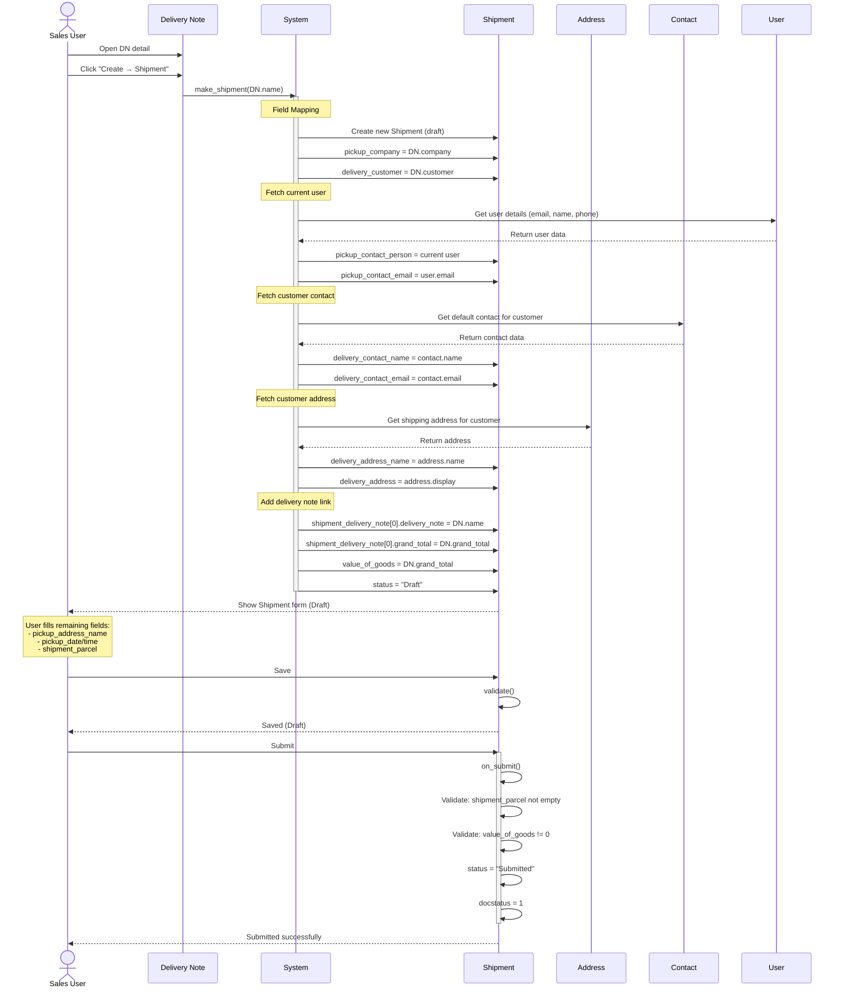
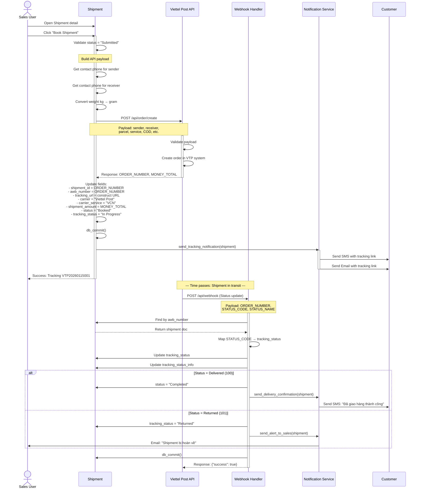
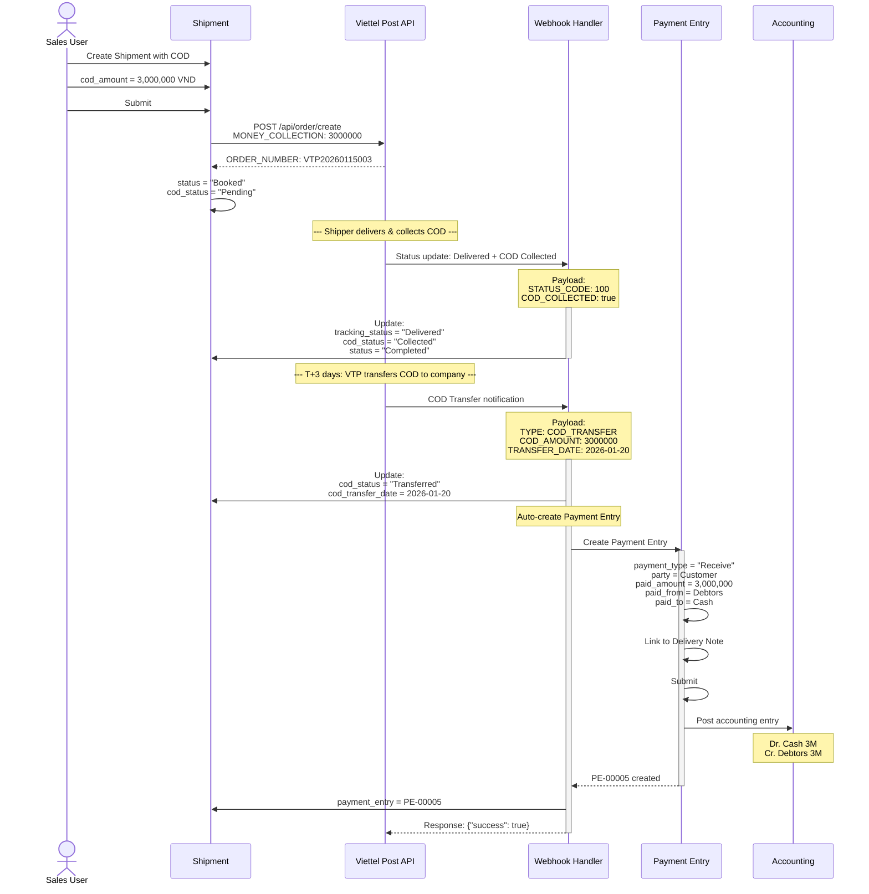
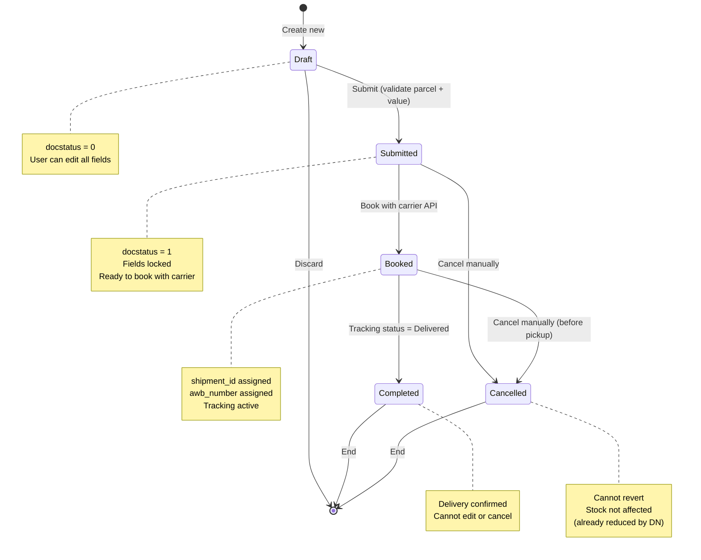
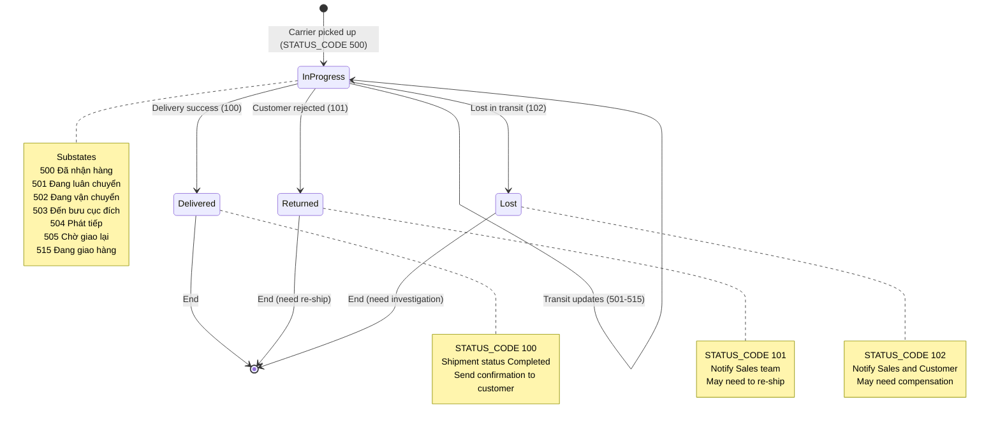
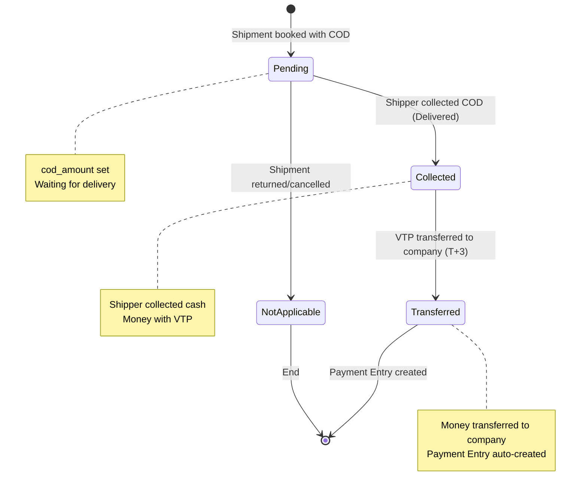

# Shipment Workflow Analysis - DCNET Flow

## Metadata
- **Module:** Shipping/Shipment
- **Created:** 14/01/2026
- **Version:** 1.0
- **Status:** ✅ Complete Analysis
- **Source:** ERPNext v16 Stock Module + DCNET Requirements

---

## 1. Tổng quan Shipment Module

### 1.1. Shipment là gì?

**Shipment** là quá trình vận chuyển hàng hóa từ điểm A (pickup) đến điểm B (delivery), thường sử dụng đơn vị vận chuyển bên thứ 3 (Viettel Post, GHTK, GHN, v.v.).

**Trong DCNET Flow:**
- **Mục đích:** Quản lý quá trình vận chuyển hàng từ kho đến khách hàng
- **Kết nối:** Delivery Note → Shipment → Carrier (Viettel Post)
- **Vai trò:** Tích hợp với đơn vị vận chuyển, tracking tự động

### 1.2. Vị trí trong Sales Process Flow

```
Sales Order → Delivery Note → Shipment → Delivery Confirmation
     ↓              ↓              ↓
  Reserve        Reduce          Update
   Stock         Stock          Tracking
```

**Sales Process hoàn chỉnh:**
```
Lead → Quotation → Sales Order → Delivery Note → Shipment → Invoice
                        ↓              ↓            ↓
                   Reserve Stock   Ship Stock   Tracking

                                                    ↓
                                           Customer Delivery
```

### 1.3. Core Components

```
Shipment (Parent DocType)
├── Pickup Details (Từ đâu)
│   ├── Company/Customer/Supplier
│   ├── Address
│   ├── Contact
│   └── Pickup Date/Time
│
├── Delivery Details (Đến đâu)
│   ├── Company/Customer/Supplier
│   ├── Address
│   └── Contact
│
├── Parcel Details (Kiện hàng)
│   ├── Dimensions (L x W x H cm)
│   ├── Weight (kg)
│   └── Count
│
├── Shipment Content (Nội dung)
│   ├── Value of Goods (Giá trị)
│   ├── Description (Mô tả)
│   ├── Shipment Type (Goods/Documents)
│   └── Incoterm (CIF, FOB, EXW...)
│
├── Delivery Notes (Đơn giao hàng)
│   └── List of Delivery Note(s)
│
└── Carrier Integration (Viettel Post)
    ├── Service Provider
    ├── Shipment ID
    ├── AWB Number (Tracking)
    ├── Tracking URL
    ├── Carrier Status
    └── Tracking Status
```

---

## 2. Tại sao cần Shipment Module?

### 2.1. Lý do nghiệp vụ

#### A. Tách biệt quá trình "giao hàng" vs "vận chuyển"

**Delivery Note = Internal process (trong công ty):**
- ✅ Xác nhận hàng đã xuất kho
- ✅ Giảm stock trong warehouse
- ✅ Chuẩn bị hàng để ship

**Shipment = External process (với bên thứ 3):**
- ✅ Tích hợp với đơn vị vận chuyển
- ✅ Tracking tự động
- ✅ Thông báo khách hàng
- ✅ COD tracking (nếu có)

**Tại sao cần tách?**
- Một delivery note có thể chia thành nhiều shipment (hàng lớn, nhiều kiện)
- Nhiều delivery note có thể gộp thành 1 shipment (cùng địa chỉ)
- Shipment có thể bị cancel/return mà không ảnh hưởng stock (đã xuất kho rồi)

#### B. Quản lý chi tiết vận chuyển

**Nếu KHÔNG có Shipment module:**
- ❌ Phải thủ công tạo đơn vận chuyển trên web Viettel Post
- ❌ Phải thủ công copy tracking number về ERPNext
- ❌ Phải thủ công check status trên web Viettel Post
- ❌ Khách hàng không biết hàng đang ở đâu

**Có Shipment module:**
- ✅ Tự động tạo đơn vận chuyển qua API
- ✅ Tự động sync tracking number về
- ✅ Tự động cập nhật status (In Transit/Delivered/Returned)
- ✅ Khách hàng nhận SMS/Zalo/Email tự động

#### C. Multi-location support

**Scenario thực tế:**
```
Công ty có 3 kho:
- Kho HCM (main warehouse)
- Kho Hà Nội (branch)
- Kho Đà Nẵng (branch)

Order từ khách Hà Nội:
- Sales Order: Kho HCM
- Delivery Note 1: Ship từ Kho HCM → 70% items
- Delivery Note 2: Ship từ Kho Hà Nội → 30% items (stock transfer)

→ Cần 2 Shipment riêng biệt
  - Shipment 1: HCM → Hà Nội
  - Shipment 2: Hà Nội → Hà Nội (local delivery)
```

#### D. COD (Cash on Delivery) Management

**Vấn đề:**
- Khách thanh toán khi nhận hàng
- Shipper thu tiền mặt
- Viettel Post chuyển tiền về công ty (T+3 days)
- Cần tracking: Tiền đã thu chưa? Đã chuyển về chưa?

**Giải pháp Shipment module:**
- Field: `cod_amount` (số tiền cần thu)
- Field: `cod_status` (Pending/Collected/Transferred)
- Auto-update khi Viettel Post callback status

---

### 2.2. Lý do kỹ thuật

#### A. API Integration với Carrier

**Viettel Post API cần:**
```json
{
  "PRODUCT_TYPE": "HH",
  "SENDER_FULLNAME": "...",
  "SENDER_ADDRESS": "...",
  "SENDER_PHONE": "...",
  "RECEIVER_FULLNAME": "...",
  "RECEIVER_ADDRESS": "...",
  "RECEIVER_PHONE": "...",
  "PRODUCT_NAME": "...",
  "PRODUCT_PRICE": 0,
  "PRODUCT_WEIGHT": 1000,
  "PRODUCT_QUANTITY": 1,
  "MONEY_COLLECTION": 0,
  "ORDER_PAYMENT": 1
}
```

**Shipment có đủ data:**
- ✅ Sender: `pickup_company`, `pickup_address`, `pickup_contact`
- ✅ Receiver: `delivery_customer`, `delivery_address`, `delivery_contact`
- ✅ Product: `description_of_content`
- ✅ Weight: `total_weight` (auto-calculated)
- ✅ Value: `value_of_goods` (from Delivery Note)
- ✅ COD: `cod_amount` (if applicable)

**Delivery Note KHÔNG đủ data:**
- ❌ Không có sender address (chỉ có company)
- ❌ Không có pickup contact person
- ❌ Không có parcel dimensions/weight
- ❌ Không có carrier-specific fields

#### B. Status Sync & Webhook

**Viettel Post callback khi status change:**
```json
{
  "ORDER_NUMBER": "VTP123456",
  "STATUS_CODE": "100",
  "STATUS_NAME": "Đã giao hàng",
  "UPDATE_TIME": "2026-01-14 10:30:00"
}
```

**Shipment cần handle:**
- Update `tracking_status` = "Delivered"
- Update `tracking_status_info` = "Đã giao hàng lúc 10:30"
- Trigger notification to customer
- Update COD status if applicable

#### C. Data Validation

**Shipment validate trước khi submit:**
```python
def validate(self):
    self.validate_weight()           # All parcels must have weight > 0
    self.validate_pickup_time()      # pickup_to > pickup_from
    self.set_value_of_goods()        # Calculate from delivery notes
    self.set_total_weight()          # Sum all parcel weights

def on_submit(self):
    if not self.shipment_parcel:
        frappe.throw(_("Shipment Parcel is required"))
    if self.value_of_goods == 0:
        frappe.throw(_("Value of Goods cannot be 0"))
```

**Đảm bảo:**
- ✅ Không tạo shipment thiếu data
- ✅ Carrier API không bị reject
- ✅ Tracking được chính xác

---

## 3. Shipment Data Requirements

### 3.1. Các trường dữ liệu

#### A. PICKUP SECTION (Điểm lấy hàng)

| Field | Type | Required | Description | Example |
| --- | --- | --- | --- | --- |
| `pickup_from_type` | Select | Yes | Loại điểm lấy hàng | Company / Customer / Supplier |
| `pickup_company` | Link | Conditional | Công ty (nếu type=Company) | DCNET Golf |
| `pickup_customer` | Link | Conditional | Khách hàng (nếu type=Customer) | - |
| `pickup_supplier` | Link | Conditional | Nhà cung cấp (nếu type=Supplier) | - |
| `pickup_address_name` | Link | Yes | Địa chỉ lấy hàng | HCM Office-Billing |
| `pickup_address` | Small Text | Read-only | Địa chỉ đầy đủ (hiển thị) | 123 Nguyễn Văn Linh... |
| `pickup_contact_name` | Link | Yes | Người liên hệ | John Doe |
| `pickup_contact` | Display | Read-only | Contact display | John Doe<br>0901234567 |
| `pickup_contact_email` | Data | Read-only | Email | john@dcnet.vn |
| `pickup_contact_person` | Link | No | User (employee) | user@dcnet.vn |
| `pickup_date` | Date | Yes | Ngày lấy hàng | 2026-01-15 |
| `pickup_from` | Time | Yes | Giờ lấy hàng (từ) | 09:00:00 |
| `pickup_to` | Time | Yes | Giờ lấy hàng (đến) | 17:00:00 |
| `pickup_type` | Select | No | Loại pickup | Pickup / Self delivery |

**Validation rules:**
- `pickup_date` >= today (không được chọn ngày quá khứ)
- `pickup_to` > `pickup_from` (giờ kết thúc > giờ bắt đầu)
- Phải có ít nhất 1 trong 3: `pickup_company`, `pickup_customer`, `pickup_supplier`
- `pickup_address_name` phải thuộc `pickup_company/customer/supplier`

**Auto-population logic:**
```javascript
// Khi chọn pickup_customer
pickup_customer: function(frm) {
    // 1. Fetch shipping address của customer
    // 2. Set pickup_address_name
    // 3. Fetch default contact của customer
    // 4. Set pickup_contact_name
    // 5. Display pickup_contact & pickup_contact_email
}
```

---

#### B. DELIVERY SECTION (Điểm giao hàng)

| Field | Type | Required | Description | Example |
| --- | --- | --- | --- | --- |
| `delivery_to_type` | Select | Yes | Loại điểm giao hàng | Company / Customer / Supplier |
| `delivery_company` | Link | Conditional | Công ty (nếu type=Company) | - |
| `delivery_customer` | Link | Conditional | Khách hàng (nếu type=Customer) | Nguyễn Văn A |
| `delivery_supplier` | Link | Conditional | Nhà cung cấp (nếu type=Supplier) | - |
| `delivery_address_name` | Link | Yes | Địa chỉ giao hàng | Nguyễn Văn A-Shipping |
| `delivery_address` | Small Text | Read-only | Địa chỉ đầy đủ | 456 Lê Lợi, Q1, HCM |
| `delivery_contact_name` | Link | Yes | Người nhận | Nguyễn Văn A |
| `delivery_contact` | Display | Read-only | Contact display | Nguyễn Văn A<br>0909123456 |
| `delivery_contact_email` | Data | Read-only | Email | nguyenvana@gmail.com |

**Validation rules:**
- Phải có ít nhất 1 trong 3: `delivery_company`, `delivery_customer`, `delivery_supplier`
- `delivery_address_name` phải thuộc `delivery_company/customer/supplier`
- `delivery_contact_name` phải có email HOẶC phone (validate trong JS)

**Auto-population logic:**
```javascript
// Khi chọn delivery_customer
delivery_customer: function(frm) {
    // 1. Fetch shipping address của customer
    // 2. Set delivery_address_name
    // 3. Fetch default contact của customer
    // 4. Set delivery_contact_name
    // 5. Validate contact has email or phone
    // 6. Display delivery_contact
}
```

---

#### C. PARCEL SECTION (Kiện hàng)

| Field | Type | Required | Description | Example |
| --- | --- | --- | --- | --- |
| `shipment_parcel` | Table | Yes (min 1) | Danh sách kiện hàng | - |
| `parcel_template` | Link | No | Template kiện hàng | Small Box |
| `add_template` | Button | No | Thêm từ template | - |
| `total_weight` | Float | Read-only | Tổng trọng lượng (kg) | 5.5 |

**Child Table: Shipment Parcel**

| Field | Type | Required | Description | Example |
| --- | --- | --- | --- | --- |
| `length` | Float | Yes | Chiều dài (cm) | 30 |
| `width` | Float | Yes | Chiều rộng (cm) | 20 |
| `height` | Float | Yes | Chiều cao (cm) | 15 |
| `weight` | Float | Yes | Trọng lượng (kg) | 2.5 |
| `count` | Int | Yes | Số lượng kiện | 2 |

**Calculation:**
```python
def get_total_weight(self):
    return sum(
        flt(parcel.weight) * parcel.count
        for parcel in self.shipment_parcel
        if parcel.count > 0
    )

# Example:
# Parcel 1: 2.5kg x 2 kiện = 5kg
# Parcel 2: 1.0kg x 3 kiện = 3kg
# total_weight = 8kg
```

**Parcel Template usage:**
```javascript
add_template: function(frm) {
    // Lấy template đã chọn
    let template = frm.doc.parcel_template;

    // Fetch template data
    frappe.db.get_value('Shipment Parcel Template', template,
        ['length', 'width', 'height', 'weight'])

    // Add new row to shipment_parcel
    let row = frm.add_child('shipment_parcel');
    row.length = template.length;
    row.width = template.width;
    row.height = template.height;
    row.weight = template.weight;
    row.count = 1; // Default

    frm.refresh_field('shipment_parcel');
}
```

**Validation:**
```python
def validate_weight(self):
    for parcel in self.shipment_parcel:
        if flt(parcel.weight) <= 0:
            frappe.throw(_("Row #{0}: Parcel weight must be greater than 0").format(parcel.idx))
```

---

#### D. SHIPMENT DETAILS SECTION (Chi tiết vận chuyển)

| Field | Type | Required | Description | Example |
| --- | --- | --- | --- | --- |
| `pallets` | Select | No | Có dùng pallet không | No / Yes |
| `value_of_goods` | Currency | Yes | Giá trị hàng hóa (VND) | 10,000,000 |
| `shipment_type` | Select | Yes | Loại hàng hóa | Goods / Documents |
| `description_of_content` | Small Text | Yes | Mô tả nội dung | Gậy golf Titleist TSR3 |
| `incoterm` | Link | No | Điều khoản thương mại | CIF / FOB / EXW |

**Auto-calculation ****`value_of_goods`****:**
```python
def set_value_of_goods(self):
    # Tính tổng từ shipment_delivery_note
    value = sum(
        flt(entry.grand_total)
        for entry in self.shipment_delivery_note
    )
    self.value_of_goods = value
```

**Example:**
```
Shipment có 2 Delivery Note:
- DN-001: 5,000,000 VND
- DN-002: 3,000,000 VND

→ value_of_goods = 8,000,000 VND (auto)
```

**Incoterm (International trade):**
- **CIF** (Cost, Insurance, Freight): Người bán chịu phí vận chuyển + bảo hiểm
- **FOB** (Free On Board): Người mua chịu phí vận chuyển
- **EXW** (Ex Works): Người mua chịu toàn bộ chi phí vận chuyển

---

#### E. SHIPMENT DELIVERY NOTE SECTION (Đơn giao hàng)

| Field | Type | Required | Description | Example |
| --- | --- | --- | --- | --- |
| `shipment_delivery_note` | Table | No | Danh sách Delivery Note | - |

**Child Table: Shipment Delivery Note**

| Field | Type | Required | Description | Example |
| --- | --- | --- | --- | --- |
| `delivery_note` | Link | Yes | Mã Delivery Note | DN-00001 |
| `grand_total` | Currency | Read-only | Giá trị đơn hàng | 5,000,000 |

**Auto-populate khi tạo từ Delivery Note:**
```python
# delivery_note.py - make_shipment()
def postprocess(source, target):
    # Add delivery note to shipment_delivery_note table
    target.append("shipment_delivery_note", {
        "delivery_note": source.name,
        "grand_total": source.grand_total
    })
```

**Validation:**
```javascript
// shipment.js
frappe.ui.form.on("Shipment Delivery Note", {
    delivery_note: function(frm, cdt, cdn) {
        // Check duplicate delivery notes
        let entered_delivery_notes = [];
        frm.doc.shipment_delivery_note.forEach((d) => {
            if (d.delivery_note) {
                if (entered_delivery_notes.includes(d.delivery_note)) {
                    frappe.throw(__("Delivery Note {0} is entered more than once", [d.delivery_note]));
                }
                entered_delivery_notes.push(d.delivery_note);
            }
        });
    }
});
```

---

#### F. CARRIER INTEGRATION SECTION (Tích hợp vận chuyển)

| Field | Type | Required | Description | Example |
| --- | --- | --- | --- | --- |
| `service_provider` | Data | No | Đơn vị vận chuyển | Viettel Post / GHTK |
| `shipment_id` | Data | No | Mã vận đơn từ carrier | VTP123456789 |
| `shipment_amount` | Currency | No | Phí vận chuyển | 30,000 |
| `status` | Select | Read-only | Trạng thái shipment | Draft / Submitted / Booked / Cancelled / Completed |
| `tracking_url` | Small Text | Read-only | Link tracking | https://viettelpost.vn/tracking?id=VTP123456789 |
| `carrier` | Data | No | Tên carrier | Viettel Post |
| `carrier_service` | Data | No | Loại dịch vụ | VCN - Chuyển phát nhanh |
| `awb_number` | Data | No | Mã vận đơn (AWB) | VTP123456789 |
| `tracking_status` | Select | No | Trạng thái vận chuyển | In Progress / Delivered / Returned / Lost |
| `tracking_status_info` | Data | Read-only | Chi tiết trạng thái | Đã giao hàng lúc 10:30 |

**Status flow:**
```
Draft (on save)
  ↓
Submitted (on submit)
  ↓
Booked (when API creates shipment with carrier)
  ↓
Completed (when tracking_status = "Delivered")

Cancel: Can cancel from Draft or Submitted
```

**Tracking Status flow:**
```
[Empty] (new)
  ↓
In Progress (carrier picked up)
  ↓
Delivered (successfully delivered)
  OR
Returned (customer rejected/not home)
  OR
Lost (lost in transit)
```

**Tích hợp Viettel Post (Phase 2 - sẽ implement):**
```python
# dcnet_apps/dcnet_apps/shipping/viettel_post.py (future)

def create_shipment_viettel_post(shipment_doc):
    """
    Call Viettel Post API to create shipment
    """
    api_url = "https://api.viettelpost.vn/api/order/create"

    payload = {
        "PRODUCT_TYPE": "HH",  # Hàng hóa
        "SENDER_FULLNAME": shipment_doc.pickup_contact_name,
        "SENDER_ADDRESS": shipment_doc.pickup_address,
        "SENDER_PHONE": get_contact_phone(shipment_doc.pickup_contact_name),
        "RECEIVER_FULLNAME": shipment_doc.delivery_contact_name,
        "RECEIVER_ADDRESS": shipment_doc.delivery_address,
        "RECEIVER_PHONE": get_contact_phone(shipment_doc.delivery_contact_name),
        "PRODUCT_NAME": shipment_doc.description_of_content,
        "PRODUCT_PRICE": shipment_doc.value_of_goods,
        "PRODUCT_WEIGHT": shipment_doc.total_weight * 1000,  # Convert kg to gram
        "PRODUCT_QUANTITY": sum(p.count for p in shipment_doc.shipment_parcel),
        "MONEY_COLLECTION": shipment_doc.cod_amount or 0,
        "ORDER_PAYMENT": 1  # Người gửi trả phí
    }

    response = requests.post(api_url, json=payload, headers=get_viettel_headers())

    if response.status_code == 200:
        data = response.json()

        # Update shipment doc
        shipment_doc.db_set("shipment_id", data["ORDER_NUMBER"])
        shipment_doc.db_set("awb_number", data["ORDER_NUMBER"])
        shipment_doc.db_set("tracking_url", f"https://viettelpost.vn/tracking?id={data['ORDER_NUMBER']}")
        shipment_doc.db_set("carrier", "Viettel Post")
        shipment_doc.db_set("carrier_service", "VCN")
        shipment_doc.db_set("status", "Booked")
        shipment_doc.db_set("tracking_status", "In Progress")

        return data["ORDER_NUMBER"]
    else:
        frappe.throw(_("Failed to create shipment with Viettel Post: {0}").format(response.text))
```

---

### 3.2. Data Dependencies

#### Shipment phụ thuộc vào:

```
Delivery Note (source)
  ↓
  ├── customer → delivery_customer
  ├── shipping_address_name → delivery_address_name
  ├── contact_person → delivery_contact_name
  ├── contact_email → delivery_contact_email
  ├── company → pickup_company
  ├── company_address → pickup_address_name
  └── grand_total → value_of_goods

Address (for both pickup & delivery)
  ↓
  ├── address_line1, address_line2, city, state, country
  └── Used for: pickup_address & delivery_address (display)

Contact (for both pickup & delivery)
  ↓
  ├── email_id → pickup_contact_email / delivery_contact_email
  ├── phone, mobile_no → displayed in pickup_contact / delivery_contact
  └── Validation: Must have email OR phone

User (current session)
  ↓
  ├── email → pickup_contact_email (default)
  ├── full_name, phone → pickup_contact (default)
  └── user → pickup_contact_person (default)
```

---

## 4. Workflow Chi Tiết

### 4.1. Scenario 1: Tạo Shipment từ Delivery Note (Standard Flow)

#### Step 1: Chuẩn bị Delivery Note

**User actions:**
1. Tạo Sales Order (SO-00001)
2. Tạo Delivery Note từ SO
3. Submit Delivery Note (DN-00001)

**System state:**
```
Sales Order: SO-00001
├── Customer: Nguyễn Văn A
├── Shipping Address: 456 Lê Lợi, Q1, HCM
├── Items: Gậy golf Titleist TSR3 x 1
└── Grand Total: 10,000,000 VND

Delivery Note: DN-00001 (docstatus=1)
├── Company: DCNET Golf
├── Customer: Nguyễn Văn A
├── Shipping Address: 456 Lê Lợi, Q1, HCM
├── Contact: Nguyễn Văn A (0909123456)
├── Items: Gậy golf Titleist TSR3 x 1
├── Grand Total: 10,000,000 VND
└── Stock Ledger Entry: Warehouse stock reduced
```

**Data đã có sẵn:**
- ✅ Customer
- ✅ Delivery address
- ✅ Contact person
- ✅ Value of goods

**Data còn thiếu:**
- ⚠️ Pickup details (company, address, contact)
- ⚠️ Parcel details (dimensions, weight)
- ⚠️ Shipment type

---

#### Step 2: Tạo Shipment từ Delivery Note

**User actions:**
1. Mở Delivery Note detail (DN-00001)
2. Click button "Create → Shipment"

**System actions:**
```python
# delivery_note.py:546-573
def make_shipment(source_name, target_doc=None):
    # 1. Map Delivery Note → Shipment
    def set_missing_values(source, target):
        # Auto-populate fields
        pass

    def postprocess(source, target):
        # Get current user details
        user = frappe.db.get_value("User", frappe.session.user,
            ["email", "full_name", "phone", "mobile_no"], as_dict=1)

        # Set pickup details from company (default)
        target.pickup_from_type = "Company"
        target.pickup_company = source.company
        target.pickup_contact_email = user.email
        target.pickup_contact_person = frappe.session.user
        target.pickup_contact = f"{user.full_name}<br>{user.email}<br>{user.phone or user.mobile_no or ''}"

        # Set delivery details from customer
        target.delivery_to_type = "Customer"
        target.delivery_customer = source.customer

        # Set delivery address
        if source.shipping_address_name:
            target.delivery_address_name = source.shipping_address_name
            target.delivery_address = source.shipping_address
        elif source.customer_address:
            target.delivery_address_name = source.customer_address

        # Set delivery contact
        if source.contact_person:
            contact = frappe.db.get_value("Contact", source.contact_person,
                ["email_id", "phone", "mobile_no"], as_dict=1)
            target.delivery_contact_name = source.contact_person
            target.delivery_contact_email = contact.email_id
            target.delivery_contact = f"{source.contact_display}<br>{contact.email_id or ''}<br>{contact.phone or contact.mobile_no or ''}"

        # Add delivery note to table
        target.append("shipment_delivery_note", {
            "delivery_note": source.name,
            "grand_total": source.grand_total
        })

    # Execute mapping
    target = get_mapped_doc("Delivery Note", source_name, {
        "Delivery Note": {
            "doctype": "Shipment",
            "field_map": {
                "company": "pickup_company",
                "company_address": "pickup_address_name",
                "company_address_display": "pickup_address",
                "customer": "delivery_customer",
                "contact_person": "delivery_contact_name",
                "contact_email": "delivery_contact_email",
                "shipping_address_name": "delivery_address_name",
                "shipping_address": "delivery_address",
                "grand_total": "value_of_goods"
            }
        }
    }, target_doc, postprocess)

    return target
```

**Kết quả:**
```
Shipment: New (Draft)
├── Pickup From: Company
├── Pickup Company: DCNET Golf
├── Pickup Address: (empty - cần nhập)
├── Pickup Contact: John Doe <john@dcnet.vn> <0901234567>
├── Pickup Contact Person: john@dcnet.vn
│
├── Delivery To: Customer
├── Delivery Customer: Nguyễn Văn A
├── Delivery Address: 456 Lê Lợi, Q1, HCM
├── Delivery Contact: Nguyễn Văn A <0909123456>
│
├── Shipment Parcel: (empty - cần nhập)
├── Value of Goods: 10,000,000 VND (auto)
│
└── Shipment Delivery Note:
    └── DN-00001: 10,000,000 VND
```

**System opens Shipment form (Draft mode)**

---

#### Step 3: Nhập thông tin còn thiếu

**User actions (on Shipment form):**

**3.1. Chọn pickup address**
```javascript
// User clicks on "Pickup Address Name"
// Filter chỉ hiện address của DCNET Golf (pickup_company)

User selects: "DCNET Golf - HCM Office"

// System auto-populates:
pickup_address = "123 Nguyễn Văn Linh, Q7, HCM"
```

**3.2. Nhập parcel details**
```javascript
// User clicks "Add Row" on Shipment Parcel table

Row 1:
  length: 50 cm
  width: 20 cm
  height: 15 cm
  weight: 3.5 kg
  count: 1

// System auto-calculates:
total_weight = 3.5 kg
```

**Hoặc sử dụng template:**
```javascript
// User selects parcel_template: "Golf Club Box"
// User clicks "Add Template" button

// System adds:
Row 1:
  length: 120 cm (from template)
  width: 30 cm (from template)
  height: 20 cm (from template)
  weight: 5.0 kg (from template)
  count: 1 (default)

total_weight = 5.0 kg (auto)
```

**3.3. Nhập shipment details**
```javascript
User fills:
  shipment_type: "Goods"
  description_of_content: "Gậy golf Titleist TSR3 Driver"

// value_of_goods already set to 10,000,000 VND (auto from DN)
```

**3.4. Set pickup date/time**
```javascript
User fills:
  pickup_date: 2026-01-15
  pickup_from: 09:00
  pickup_to: 17:00

// Validation: pickup_date >= today ✅
// Validation: pickup_to > pickup_from ✅
```

**State sau khi nhập đủ:**
```
Shipment: New (Draft)
├── Pickup From: Company ✅
├── Pickup Company: DCNET Golf ✅
├── Pickup Address: 123 Nguyễn Văn Linh, Q7, HCM ✅
├── Pickup Contact: John Doe <john@dcnet.vn> <0901234567> ✅
├── Pickup Date: 2026-01-15 ✅
├── Pickup Time: 09:00 - 17:00 ✅
│
├── Delivery To: Customer ✅
├── Delivery Customer: Nguyễn Văn A ✅
├── Delivery Address: 456 Lê Lợi, Q1, HCM ✅
├── Delivery Contact: Nguyễn Văn A <0909123456> ✅
│
├── Shipment Parcel: ✅
│   └── 120cm x 30cm x 20cm, 5.0kg x 1 kiện
├── Total Weight: 5.0 kg ✅
│
├── Shipment Type: Goods ✅
├── Description: Gậy golf Titleist TSR3 Driver ✅
├── Value of Goods: 10,000,000 VND ✅
│
└── Shipment Delivery Note: ✅
    └── DN-00001: 10,000,000 VND
```

---

#### Step 4: Submit Shipment

**User actions:**
1. Click "Save" → status = "Draft"
2. Click "Submit"

**System validation:**
```python
def on_submit(self):
    # Check shipment_parcel not empty
    if not self.shipment_parcel:
        frappe.throw(_("Shipment Parcel is required"))
    # ✅ Pass (có 1 parcel)

    # Check value_of_goods != 0
    if self.value_of_goods == 0:
        frappe.throw(_("Value of Goods cannot be 0"))
    # ✅ Pass (10,000,000 VND)

    # Set status
    self.db_set("status", "Submitted")
```

**Kết quả:**
```
Shipment: SHP-00001 (Submitted)
├── status: "Submitted"
├── docstatus: 1
└── All fields locked (cannot edit)
```

---

#### Step 5: Book với Viettel Post (Future - Phase 2)

**User actions:**
1. Shipment detail page
2. Click button "Book Shipment" (custom button - sẽ implement)

**System actions (future implementation):**
```python
# shipment.py - custom method

@frappe.whitelist()
def book_with_viettel_post(shipment_name):
    """
    Book shipment with Viettel Post API
    """
    shipment = frappe.get_doc("Shipment", shipment_name)

    # Validate status
    if shipment.status != "Submitted":
        frappe.throw(_("Can only book shipment with status 'Submitted'"))

    # Call Viettel Post API
    vtp = ViettelPostAPI()
    result = vtp.create_order({
        "sender": {
            "name": shipment.pickup_contact_name,
            "phone": get_contact_phone(shipment.pickup_contact_name),
            "address": shipment.pickup_address
        },
        "receiver": {
            "name": shipment.delivery_contact_name,
            "phone": get_contact_phone(shipment.delivery_contact_name),
            "address": shipment.delivery_address
        },
        "parcel": {
            "weight": shipment.total_weight * 1000,  # kg → gram
            "value": shipment.value_of_goods,
            "description": shipment.description_of_content
        },
        "service": "VCN",  # Chuyển phát nhanh
        "payment": "SHOP",  # Shop trả phí
        "cod_amount": 0  # Không COD
    })

    if result.get("success"):
        # Update shipment
        shipment.db_set("shipment_id", result["order_number"])
        shipment.db_set("awb_number", result["order_number"])
        shipment.db_set("tracking_url", result["tracking_url"])
        shipment.db_set("carrier", "Viettel Post")
        shipment.db_set("carrier_service", "VCN")
        shipment.db_set("status", "Booked")
        shipment.db_set("tracking_status", "In Progress")
        shipment.db_set("shipment_amount", result["shipping_fee"])

        # Send notification to customer
        send_tracking_notification(shipment)

        frappe.msgprint(_("Shipment booked successfully. Tracking: {0}").format(result["order_number"]))

        return result
    else:
        frappe.throw(_("Failed to book shipment: {0}").format(result.get("error")))
```

**Kết quả:**
```
Shipment: SHP-00001 (Booked)
├── status: "Booked"
├── shipment_id: "VTP20260115001"
├── awb_number: "VTP20260115001"
├── tracking_url: "https://viettelpost.vn/tracking?id=VTP20260115001"
├── carrier: "Viettel Post"
├── carrier_service: "VCN"
├── tracking_status: "In Progress"
├── shipment_amount: 30,000 VND
└── [SMS sent to customer with tracking link]
```

---

#### Step 6: Tracking Updates (Webhook from Viettel Post)

**Viettel Post callback:**
```json
POST /api/method/dcnet_apps.shipping.webhook.viettel_post_callback
{
  "ORDER_NUMBER": "VTP20260115001",
  "STATUS_CODE": "100",
  "STATUS_NAME": "Đã giao hàng",
  "UPDATE_TIME": "2026-01-16 14:30:00",
  "RECEIVER_NAME": "Nguyễn Văn A",
  "NOTE": ""
}
```

**System actions:**
```python
@frappe.whitelist(allow_guest=True)
def viettel_post_callback():
    """
    Webhook endpoint for Viettel Post status updates
    """
    data = frappe.request.get_json()

    # Find shipment by tracking number
    shipment_name = frappe.db.get_value("Shipment",
        {"awb_number": data["ORDER_NUMBER"]}, "name")

    if not shipment_name:
        return {"success": False, "error": "Shipment not found"}

    shipment = frappe.get_doc("Shipment", shipment_name)

    # Map Viettel status → Shipment tracking_status
    status_map = {
        "100": "Delivered",     # Đã giao hàng
        "101": "Returned",      # Hoàn về
        "500": "In Progress",   # Đang vận chuyển
        "515": "In Progress",   # Đang giao hàng
    }

    tracking_status = status_map.get(data["STATUS_CODE"], "In Progress")

    # Update shipment
    shipment.db_set("tracking_status", tracking_status)
    shipment.db_set("tracking_status_info",
        f"{data['STATUS_NAME']} lúc {data['UPDATE_TIME']}")

    # If delivered, set status to Completed
    if tracking_status == "Delivered":
        shipment.db_set("status", "Completed")

        # Send delivery confirmation to customer
        send_delivery_confirmation(shipment)

    frappe.db.commit()

    return {"success": True}
```

**Kết quả:**
```
Shipment: SHP-00001 (Completed)
├── status: "Completed" (auto-updated)
├── tracking_status: "Delivered" (auto-updated)
├── tracking_status_info: "Đã giao hàng lúc 2026-01-16 14:30:00" (auto-updated)
└── [Email sent to customer: "Đơn hàng đã giao thành công"]
```

---

### 4.2. Scenario 2: Gộp nhiều Delivery Note vào 1 Shipment

**Business case:**
```
Khách hàng đặt 2 đơn hàng riêng:
- Order 1: Gậy golf Titleist TSR3 (10,000,000 VND)
- Order 2: Bóng golf Pro V1 (500,000 VND)

Cùng địa chỉ giao hàng → Gộp chung 1 shipment để tiết kiệm phí vận chuyển
```

#### Step 1: Tạo Delivery Notes

**Sales Order 1:**
```
SO-00001
├── Customer: Nguyễn Văn A
├── Shipping Address: 456 Lê Lợi, Q1, HCM
├── Items: Gậy golf Titleist TSR3 x 1
└── Grand Total: 10,000,000 VND

→ Delivery Note: DN-00001 (Submitted)
```

**Sales Order 2:**
```
SO-00002
├── Customer: Nguyễn Văn A
├── Shipping Address: 456 Lê Lợi, Q1, HCM (same)
├── Items: Bóng golf Pro V1 x 2 hộp
└── Grand Total: 500,000 VND

→ Delivery Note: DN-00002 (Submitted)
```

---

#### Step 2: Tạo Shipment từ DN-00001

**User actions:**
1. Mở DN-00001
2. Click "Create → Shipment"

**System creates:**
```
Shipment: New (Draft)
├── Pickup: DCNET Golf, HCM Office
├── Delivery: Nguyễn Văn A, 456 Lê Lợi, Q1, HCM
├── Shipment Delivery Note:
│   └── DN-00001: 10,000,000 VND
└── Value of Goods: 10,000,000 VND (auto)
```

---

#### Step 3: Thêm DN-00002 vào Shipment

**User actions (on Shipment form, before submit):**
1. Scroll to "Shipment Delivery Note" table
2. Click "Add Row"
3. Select "DN-00002"

**System actions:**
```javascript
// shipment.js - delivery_note field change
frappe.ui.form.on("Shipment Delivery Note", {
    delivery_note: function(frm, cdt, cdn) {
        let row = locals[cdt][cdn];

        // Check duplicate
        let entered_dns = frm.doc.shipment_delivery_note
            .filter(d => d.delivery_note)
            .map(d => d.delivery_note);

        let duplicates = entered_dns.filter((dn, idx) =>
            entered_dns.indexOf(dn) !== idx);

        if (duplicates.length > 0) {
            frappe.throw(__("Delivery Note {0} is entered more than once",
                [duplicates[0]]));
        }

        // Fetch grand_total
        frappe.db.get_value("Delivery Note", row.delivery_note, "grand_total")
            .then(r => {
                frappe.model.set_value(cdt, cdn, "grand_total", r.message.grand_total);
            });
    },

    grand_total: function(frm, cdt, cdn) {
        // Recalculate value_of_goods
        let total = 0;
        frm.doc.shipment_delivery_note.forEach(d => {
            total += flt(d.grand_total);
        });
        frm.set_value("value_of_goods", total);
    }
});
```

**Kết quả:**
```
Shipment: New (Draft)
├── Pickup: DCNET Golf, HCM Office
├── Delivery: Nguyễn Văn A, 456 Lê Lợi, Q1, HCM
├── Shipment Delivery Note:
│   ├── DN-00001: 10,000,000 VND
│   └── DN-00002: 500,000 VND
└── Value of Goods: 10,500,000 VND (auto-updated)
```

---

#### Step 4: Nhập Parcel Details (gộp 2 đơn)

**User actions:**
```javascript
// User adds 1 parcel (gộp cả 2 đơn vào 1 kiện)
Parcel 1:
  length: 120 cm
  width: 30 cm
  height: 25 cm (cao hơn vì có thêm bóng)
  weight: 6.0 kg (gậy 5kg + bóng 1kg)
  count: 1

total_weight = 6.0 kg (auto)
```

**Hoặc chia thành 2 kiện:**
```javascript
Parcel 1 (gậy):
  length: 120 cm
  width: 30 cm
  height: 20 cm
  weight: 5.0 kg
  count: 1

Parcel 2 (bóng):
  length: 30 cm
  width: 20 cm
  height: 15 cm
  weight: 1.0 kg
  count: 1

total_weight = 6.0 kg (auto)
```

---

#### Step 5: Submit & Book

**Submit:**
```python
# Validation passes
shipment.shipment_parcel: 2 rows ✅
shipment.value_of_goods: 10,500,000 VND ✅

→ status = "Submitted"
```

**Book với Viettel Post:**
```python
# API call
vtp.create_order({
    "sender": {...},
    "receiver": {...},
    "parcel": {
        "weight": 6000,  # 6kg → gram
        "value": 10500000,  # VND
        "description": "Gậy golf Titleist TSR3 + Bóng golf Pro V1"
    },
    ...
})

→ shipment_id: VTP20260115002
→ status: "Booked"
→ tracking_url: https://viettelpost.vn/tracking?id=VTP20260115002
```

**Lợi ích:**
- ✅ Tiết kiệm phí vận chuyển (1 shipment thay vì 2)
- ✅ Tracking tập trung (khách chỉ cần theo dõi 1 mã)
- ✅ Value of Goods tính đúng (10,500,000 VND)

---

### 4.3. Scenario 3: COD (Cash on Delivery)

**Business case:**
```
Khách hàng chọn thanh toán khi nhận hàng (COD)
→ Shipper thu tiền mặt khi giao hàng
→ Viettel Post chuyển tiền về công ty sau 3 ngày
```

#### Step 1: Tạo Shipment với COD

**Sales Order:**
```
SO-00003
├── Customer: Trần Thị B
├── Payment Terms: COD (Cash on Delivery)
├── Items: Túi gậy golf Callaway
└── Grand Total: 3,000,000 VND

→ Delivery Note: DN-00003 (Submitted)
```

**Create Shipment from DN-00003:**
```
Shipment: New (Draft)
├── Pickup: DCNET Golf, HCM Office
├── Delivery: Trần Thị B, 789 Nguyễn Huệ, Q1, HCM
├── Shipment Delivery Note:
│   └── DN-00003: 3,000,000 VND
├── Value of Goods: 3,000,000 VND
│
└── COD Details (cần thêm field - Phase 2):
    ├── cod_amount: 3,000,000 VND
    ├── cod_status: "Pending"
    └── cod_transfer_date: (empty)
```

---

#### Step 2: Book với Viettel Post (COD enabled)

**API call:**
```python
vtp.create_order({
    "sender": {...},
    "receiver": {...},
    "parcel": {...},
    "MONEY_COLLECTION": 3000000,  # COD amount (VND)
    "ORDER_PAYMENT": 1  # Người gửi trả phí vận chuyển
})

→ shipment_id: VTP20260115003
→ cod_amount: 3,000,000 VND
→ cod_status: "Pending"
```

---

#### Step 3: Tracking Updates (Shipper collected COD)

**Viettel Post callback (delivered):**
```json
{
  "ORDER_NUMBER": "VTP20260115003",
  "STATUS_CODE": "100",
  "STATUS_NAME": "Đã giao hàng và thu tiền COD",
  "COD_AMOUNT": 3000000,
  "COD_COLLECTED": true,
  "UPDATE_TIME": "2026-01-17 11:00:00"
}
```

**System actions:**
```python
# Update shipment
shipment.db_set("tracking_status", "Delivered")
shipment.db_set("cod_status", "Collected")  # Shipper đã thu tiền
shipment.db_set("status", "Completed")
```

**State:**
```
Shipment: SHP-00003 (Completed)
├── tracking_status: "Delivered"
├── cod_amount: 3,000,000 VND
├── cod_status: "Collected" (Shipper đã thu tiền)
└── cod_transfer_date: (empty - chưa chuyển về công ty)
```

---

#### Step 4: COD Transfer to Company (T+3 days)

**Viettel Post callback (transfer):**
```json
{
  "ORDER_NUMBER": "VTP20260115003",
  "TYPE": "COD_TRANSFER",
  "COD_AMOUNT": 3000000,
  "TRANSFER_DATE": "2026-01-20",
  "TRANSFER_REF": "VTP_TRANSFER_20260120_001"
}
```

**System actions:**
```python
# Update shipment
shipment.db_set("cod_status", "Transferred")
shipment.db_set("cod_transfer_date", "2026-01-20")

# Create Payment Entry (auto)
payment = frappe.get_doc({
    "doctype": "Payment Entry",
    "payment_type": "Receive",
    "party_type": "Customer",
    "party": shipment.delivery_customer,
    "paid_amount": shipment.cod_amount,
    "received_amount": shipment.cod_amount,
    "paid_from": "Debtors - DCNET",
    "paid_to": "Cash - DCNET",
    "reference_no": data["TRANSFER_REF"],
    "reference_date": data["TRANSFER_DATE"],
    "references": [{
        "reference_doctype": "Delivery Note",
        "reference_name": shipment.shipment_delivery_note[0].delivery_note,
        "allocated_amount": shipment.cod_amount
    }]
})
payment.insert()
payment.submit()

# Link payment to shipment
shipment.db_set("payment_entry", payment.name)
```

**Final state:**
```
Shipment: SHP-00003 (Completed)
├── tracking_status: "Delivered"
├── cod_amount: 3,000,000 VND
├── cod_status: "Transferred" ✅
├── cod_transfer_date: "2026-01-20"
├── payment_entry: PE-00005 (linked)
└── [Accounting entry created: Debit Cash 3M, Credit Debtors 3M]
```

---

### 4.4. Scenario 4: Return/Lost Shipment

**Business case:**
```
Khách hàng không nhận hàng (từ chối, không ở nhà, v.v.)
→ Hàng bị hoàn về (Returned)
```

#### Step 1: Shipment in transit

**State:**
```
Shipment: SHP-00004 (Booked)
├── Pickup: DCNET Golf, HCM Office
├── Delivery: Lê Văn C, 321 Pasteur, Q3, HCM
├── tracking_status: "In Progress"
└── Shipment Delivery Note: DN-00004 (5,000,000 VND)
```

---

#### Step 2: Customer rejected delivery

**Viettel Post callback:**
```json
{
  "ORDER_NUMBER": "VTP20260115004",
  "STATUS_CODE": "101",
  "STATUS_NAME": "Khách không nhận hàng, hoàn về",
  "RETURN_REASON": "Khách hẹn giao lại sau",
  "UPDATE_TIME": "2026-01-18 15:00:00"
}
```

**System actions:**
```python
# Update shipment
shipment.db_set("tracking_status", "Returned")
shipment.db_set("tracking_status_info",
    "Khách không nhận hàng, hoàn về - Khách hẹn giao lại sau")

# Send notification to Sales team
frappe.sendmail(
    recipients=["sales@dcnet.vn"],
    subject=f"Shipment {shipment.name} bị hoàn về",
    message=f"""
    Shipment {shipment.name} bị hoàn về.

    Lý do: Khách hẹn giao lại sau
    Delivery Note: {shipment.shipment_delivery_note[0].delivery_note}
    Customer: {shipment.delivery_customer}

    Vui lòng liên hệ khách hàng để hẹn giao lại.
    """
)
```

**State:**
```
Shipment: SHP-00004 (Booked)
├── tracking_status: "Returned" ⚠️
├── tracking_status_info: "Khách không nhận hàng, hoàn về - Khách hẹn giao lại sau"
└── [Email sent to Sales team]
```

---

#### Step 3: Re-ship (giao lại)

**User actions (Sales team):**
1. Liên hệ khách hàng, hẹn ngày giao lại
2. Cancel shipment cũ (SHP-00004)
3. Tạo shipment mới từ DN-00004
4. Book lại với Viettel Post

**New shipment:**
```
Shipment: SHP-00005 (Booked)
├── Pickup: DCNET Golf, HCM Office
├── Delivery: Lê Văn C, 321 Pasteur, Q3, HCM
├── Pickup Date: 2026-01-20 (ngày khách hẹn)
├── tracking_status: "In Progress"
└── Shipment Delivery Note: DN-00004 (same)

Shipment: SHP-00004 (Cancelled)
└── status: "Cancelled"
```

---

### 4.5. Scenario 5: Partial Delivery (Multiple Warehouses)

**Business case:**
```
Khách đặt 3 sản phẩm:
- Item A (stock: HCM warehouse)
- Item B (stock: HCM warehouse)
- Item C (out of stock HCM, có stock Hà Nội)

→ Chia thành 2 shipment:
  - Shipment 1: HCM → Customer (Item A + B)
  - Shipment 2: Hà Nội → Customer (Item C)
```

#### Sales Order

```
SO-00005
├── Customer: Phạm Thị D (địa chỉ HCM)
├── Items:
│   ├── Item A (Gậy golf) - Warehouse: HCM - Qty: 1
│   ├── Item B (Bóng golf) - Warehouse: HCM - Qty: 2
│   └── Item C (Túi golf) - Warehouse: Hà Nội - Qty: 1
└── Grand Total: 15,000,000 VND
```

---

#### Delivery Note 1 (HCM warehouse)

```
DN-00005-HCM
├── Company: DCNET Golf
├── Warehouse: HCM Warehouse
├── Customer: Phạm Thị D
├── Items:
│   ├── Item A (Gậy golf) - Qty: 1 - 8,000,000 VND
│   └── Item B (Bóng golf) - Qty: 2 - 500,000 VND
└── Grand Total: 8,500,000 VND

→ Submit → Stock reduced from HCM Warehouse
```

---

#### Delivery Note 2 (Hà Nội warehouse)

```
DN-00005-HN
├── Company: DCNET Golf
├── Warehouse: Hà Nội Warehouse
├── Customer: Phạm Thị D
├── Items:
│   └── Item C (Túi golf) - Qty: 1 - 6,500,000 VND
└── Grand Total: 6,500,000 VND

→ Submit → Stock reduced from Hà Nội Warehouse
```

---

#### Shipment 1 (HCM → HCM)

**User creates from DN-00005-HCM:**
```
Shipment: SHP-00006 (Submitted)
├── Pickup From: Company
├── Pickup Company: DCNET Golf
├── Pickup Address: 123 Nguyễn Văn Linh, Q7, HCM (HCM Office)
│
├── Delivery To: Customer
├── Delivery Customer: Phạm Thị D
├── Delivery Address: 999 Lê Văn Việt, Q9, HCM
│
├── Parcel: 120x30x25cm, 6kg x 1
├── Value of Goods: 8,500,000 VND
│
└── Shipment Delivery Note:
    └── DN-00005-HCM: 8,500,000 VND
```

**Book:**
```
→ shipment_id: VTP20260115006
→ carrier_service: VCN (Nội thành HCM - giao trong 1 ngày)
→ shipment_amount: 25,000 VND (local delivery)
```

---

#### Shipment 2 (Hà Nội → HCM)

**User creates from DN-00005-HN:**
```
Shipment: SHP-00007 (Submitted)
├── Pickup From: Company
├── Pickup Company: DCNET Golf
├── Pickup Address: 456 Trần Duy Hưng, Cầu Giấy, Hà Nội (Hà Nội Branch)
│
├── Delivery To: Customer
├── Delivery Customer: Phạm Thị D
├── Delivery Address: 999 Lê Văn Việt, Q9, HCM
│
├── Parcel: 80x40x30cm, 3kg x 1
├── Value of Goods: 6,500,000 VND
│
└── Shipment Delivery Note:
    └── DN-00005-HN: 6,500,000 VND
```

**Book:**
```
→ shipment_id: VTP20260115007
→ carrier_service: VTK (Liên tỉnh - giao trong 2-3 ngày)
→ shipment_amount: 50,000 VND (inter-province)
```

---

#### Customer Notification

**Email to customer:**
```
Kính chào Quý khách Phạm Thị D,

Đơn hàng SO-00005 của Quý khách đã được chia thành 2 lô giao hàng:

Lô 1 (HCM): Giao trong 1 ngày
- Gậy golf Item A
- Bóng golf Item B
- Tracking: VTP20260115006
- Link: https://viettelpost.vn/tracking?id=VTP20260115006

Lô 2 (Hà Nội): Giao trong 2-3 ngày
- Túi golf Item C
- Tracking: VTP20260115007
- Link: https://viettelpost.vn/tracking?id=VTP20260115007

Quý khách có thể theo dõi hành trình giao hàng qua link trên.

Trân trọng,
DCNET Golf
```

---

## 5. Data Mapping

### 5.1. Delivery Note → Shipment

**Mapping table:**

| Delivery Note Field | Shipment Field | Mapping Type | Notes |
| --- | --- | --- | --- |
| **Company Section** |
| `company` | `pickup_company` | Direct | Công ty gửi hàng |
| `company_address` | `pickup_address_name` | Direct | Địa chỉ công ty |
| `company_address_display` | `pickup_address` | Direct | Display text |
| (Current User) | `pickup_contact_person` | User session | Người tạo shipment |
| (User email) | `pickup_contact_email` | User session | Email người tạo |
| (User name + phone) | `pickup_contact` | User session | Display contact |
| **Customer Section** |
| `customer` | `delivery_customer` | Direct | Khách hàng nhận hàng |
| `contact_person` | `delivery_contact_name` | Direct | Người liên hệ |
| `contact_email` | `delivery_contact_email` | Direct | Email người nhận |
| `contact_display` | `delivery_contact` | Direct | Display contact |
| `shipping_address_name` | `delivery_address_name` | Conditional | Ưu tiên shipping address |
| `customer_address` | `delivery_address_name` | Conditional | Fallback nếu không có shipping |
| `shipping_address` | `delivery_address` | Direct | Display address |
| **Value** |
| `grand_total` | `value_of_goods` | Direct | Giá trị hàng hóa |
| **Delivery Note Link** |
| `name` | `shipment_delivery_note[].delivery_note` | Child table | Link to source DN |
| `grand_total` | `shipment_delivery_note[].grand_total` | Child table | Value per DN |

---

### 5.2. Shipment → Viettel Post API

**API mapping table:**

| Shipment Field | Viettel Post API Field | Transform | Notes |
| --- | --- | --- | --- |
| **Sender (Pickup)** |
| `pickup_contact_name` | `SENDER_FULLNAME` | - | Tên người gửi |
| `pickup_address` | `SENDER_ADDRESS` | - | Địa chỉ gửi |
| (Contact phone) | `SENDER_PHONE` | Lookup from Contact | SĐT người gửi |
| `pickup_contact_email` | `SENDER_EMAIL` | - | Email người gửi |
| **Receiver (Delivery)** |
| `delivery_contact_name` | `RECEIVER_FULLNAME` | - | Tên người nhận |
| `delivery_address` | `RECEIVER_ADDRESS` | - | Địa chỉ nhận |
| (Contact phone) | `RECEIVER_PHONE` | Lookup from Contact | SĐT người nhận (required) |
| `delivery_contact_email` | `RECEIVER_EMAIL` | - | Email người nhận |
| **Parcel** |
| `description_of_content` | `PRODUCT_NAME` | - | Tên hàng hóa |
| `value_of_goods` | `PRODUCT_PRICE` | - | Giá trị khai báo |
| `total_weight` | `PRODUCT_WEIGHT` | kg → gram (x1000) | Trọng lượng (gram) |
| `shipment_parcel[].count` | `PRODUCT_QUANTITY` | Sum all counts | Số kiện |
| **Service** |
| (User select) | `PRODUCT_TYPE` | - | HH (Hàng hóa) / TL (Tài liệu) |
| (Config) | `ORDER_SERVICE` | - | VCN / VTK (service type) |
| (Config) | `ORDER_PAYMENT` | - | 1 (Shop trả) / 2 (Người nhận trả) |
| `cod_amount` | `MONEY_COLLECTION` | - | Số tiền COD (0 nếu không COD) |
| **Pickup Schedule** |
| `pickup_date` | `PICKUP_DATE` | Format: YYYY-MM-DD | Ngày lấy hàng |
| `pickup_from` | `PICKUP_TIME` | Format: HH:mm | Giờ lấy hàng |

**Example payload:**
```json
{
  "PRODUCT_TYPE": "HH",
  "ORDER_SERVICE": "VCN",
  "ORDER_PAYMENT": 1,

  "SENDER_FULLNAME": "John Doe",
  "SENDER_ADDRESS": "123 Nguyễn Văn Linh, Q7, HCM",
  "SENDER_PHONE": "0901234567",
  "SENDER_EMAIL": "john@dcnet.vn",

  "RECEIVER_FULLNAME": "Nguyễn Văn A",
  "RECEIVER_ADDRESS": "456 Lê Lợi, Q1, HCM",
  "RECEIVER_PHONE": "0909123456",
  "RECEIVER_EMAIL": "nguyenvana@gmail.com",

  "PRODUCT_NAME": "Gậy golf Titleist TSR3 Driver",
  "PRODUCT_PRICE": 10000000,
  "PRODUCT_WEIGHT": 5000,
  "PRODUCT_QUANTITY": 1,
  "MONEY_COLLECTION": 0,

  "PICKUP_DATE": "2026-01-15",
  "PICKUP_TIME": "09:00"
}
```

---

### 5.3. Viettel Post Response → Shipment

**Response mapping:**

| Viettel Post Response Field | Shipment Field | Notes |
| --- | --- | --- |
| `ORDER_NUMBER` | `shipment_id` | Mã vận đơn VTP |
| `ORDER_NUMBER` | `awb_number` | Tracking number (same as ORDER_NUMBER) |
| - | `tracking_url` | Construct: `https://viettelpost.vn/tracking?id={ORDER_NUMBER}` |
| - | `carrier` | Hardcode: "Viettel Post" |
| `ORDER_SERVICE` | `carrier_service` | VCN / VTK / VBE |
| `MONEY_TOTAL` | `shipment_amount` | Phí vận chuyển (VND) |
| - | `status` | Set to "Booked" on success |
| - | `tracking_status` | Set to "In Progress" on success |

**Example response:**
```json
{
  "status": 200,
  "data": {
    "ORDER_NUMBER": "VTP20260115001",
    "ORDER_SERVICE": "VCN",
    "MONEY_TOTAL": 30000,
    "MONEY_TOTAL_FEE": 30000,
    "EXCHANGE_WEIGHT": 5000
  },
  "error": false,
  "message": "Success"
}
```

**Shipment update:**
```python
shipment.db_set("shipment_id", "VTP20260115001")
shipment.db_set("awb_number", "VTP20260115001")
shipment.db_set("tracking_url", "https://viettelpost.vn/tracking?id=VTP20260115001")
shipment.db_set("carrier", "Viettel Post")
shipment.db_set("carrier_service", "VCN")
shipment.db_set("shipment_amount", 30000)
shipment.db_set("status", "Booked")
shipment.db_set("tracking_status", "In Progress")
```

---

### 5.4. Viettel Post Webhook → Shipment

**Webhook mapping:**

| Webhook Field | Shipment Field | Transform | Notes |
| --- | --- | --- | --- |
| `ORDER_NUMBER` | (Lookup) | Find shipment by awb_number | Identify shipment |
| `STATUS_CODE` | `tracking_status` | Map: 100→Delivered, 101→Returned, 500→In Progress | Status translation |
| `STATUS_NAME` + `UPDATE_TIME` | `tracking_status_info` | Concat | Display info |
| (Auto) | `status` | If delivered → "Completed" | Final status |
| `COD_COLLECTED` | `cod_status` | true → "Collected" | COD status |
| `COD_TRANSFER_DATE` | `cod_transfer_date` | - | Transfer date |

**Status code mapping:**
```python
STATUS_CODE_MAP = {
    "100": "Delivered",      # Đã giao hàng
    "101": "Returned",       # Hoàn về
    "102": "Lost",           # Thất lạc
    "500": "In Progress",    # Đã nhận hàng
    "501": "In Progress",    # Đang luân chuyển
    "502": "In Progress",    # Đang vận chuyển
    "503": "In Progress",    # Đến bưu cục đích
    "504": "In Progress",    # Phát tiếp
    "505": "In Progress",    # Chờ giao lại
    "515": "In Progress",    # Đang giao hàng
}
```

---

## 6. Sequence Diagram

### 6.1. Create Shipment from Delivery Note



---

### 6.2. Book Shipment with Viettel Post (Future)



---

### 6.3. COD Shipment Flow



---

## 7. State Machine

### 7.1. Shipment Status State Machine



**Trigger events:**

| Transition | Event | Validation | Action |
| --- | --- | --- | --- |
| `[*]` → `Draft` | User creates Shipment | - | Set status = "Draft", docstatus = 0 |
| `Draft` → `Submitted` | User clicks Submit | ✅ shipment_parcel not empty<br/>✅ value_of_goods != 0<br/>✅ pickup_date >= today<br/>✅ pickup_to > pickup_from | Set status = "Submitted", docstatus = 1 |
| `Draft` → `[*]` | User discards | - | Delete doc or set status = "Cancelled" |
| `Submitted` → `Booked` | Book API success | ✅ Status = "Submitted" | Set status = "Booked", assign shipment_id, awb_number |
| `Submitted` → `Cancelled` | User cancels | - | Set status = "Cancelled", docstatus = 2 |
| `Booked` → `Completed` | Webhook: STATUS_CODE=100 | - | Set status = "Completed", tracking_status = "Delivered" |
| `Booked` → `Cancelled` | User cancels (before pickup) | ⚠️ May charge cancellation fee | Call cancel API, set status = "Cancelled" |

---

### 7.2. Tracking Status State Machine



**Viettel Post status codes:**

| Code | Status Name | Tracking Status | Action |
| --- | --- | --- | --- |
| 100 | Đã giao hàng | Delivered | Set status = "Completed", send confirmation |
| 101 | Hoàn về | Returned | Notify Sales team |
| 102 | Thất lạc | Lost | Create incident, notify customer |
| 500 | Đã nhận hàng | In Progress | Initial pickup |
| 501 | Đang luân chuyển | In Progress | In sorting hub |
| 502 | Đang vận chuyển | In Progress | On vehicle |
| 503 | Đến bưu cục đích | In Progress | At destination hub |
| 504 | Phát tiếp | In Progress | Second delivery attempt |
| 505 | Chờ giao lại | In Progress | Waiting for re-delivery |
| 515 | Đang giao hàng | In Progress | Out for delivery |

---

### 7.3. COD Status State Machine



**COD flow:**

| State | Trigger | Action |
| --- | --- | --- |
| `Pending` | Book shipment with MONEY_COLLECTION > 0 | Set cod_status = "Pending" |
| `Collected` | Webhook: STATUS_CODE=100 + COD_COLLECTED=true | Set cod_status = "Collected" |
| `Transferred` | Webhook: TYPE=COD_TRANSFER | Set cod_status = "Transferred", create Payment Entry |
| `NotApplicable` | Shipment cancelled/returned before delivery | Set cod_status = "Not Applicable" |

---

## 8. Key Takeaways

### 8.1. Tại sao cần Shipment Module?

#### A. Nghiệp vụ

1. **Tách biệt quá trình nội bộ vs bên ngoài:**
  - Delivery Note = Internal (xuất kho, giảm stock)
  - Shipment = External (vận chuyển, tracking)

2. **Quản lý vận chuyển chuyên nghiệp:**
  - Tích hợp API với carrier (Viettel Post, GHTK, GHN)
  - Tracking tự động, không cần thủ công
  - Thông báo khách hàng real-time

3. **Hỗ trợ nhiều kịch bản phức tạp:**
  - Gộp nhiều delivery note vào 1 shipment
  - Chia 1 delivery note thành nhiều shipment
  - Multi-warehouse (ship từ nhiều kho)
  - COD tracking & reconciliation

4. **Tăng trải nghiệm khách hàng:**
  - Khách nhận SMS/Email với tracking link
  - Khách tự tra cứu hành trình hàng
  - Khách được thông báo khi giao hàng thành công

#### B. Kỹ thuật

1. **API integration với carrier:**
  - Shipment có đủ data để call API (sender, receiver, parcel, value)
  - Delivery Note thiếu nhiều field (pickup contact, parcel dimensions)

2. **Status sync & webhook:**
  - Webhook handler cập nhật tracking_status tự động
  - Trigger notification khi status change

3. **Data validation:**
  - Validate trước khi call API (weight > 0, address đầy đủ)
  - Tránh API reject, tăng success rate

4. **Accounting integration (COD):**
  - Tự động tạo Payment Entry khi COD transferred
  - Link Payment Entry → Delivery Note → Sales Invoice

---

### 8.2. Best Practices

#### A. Tạo Shipment

✅ **DO:**
- Tạo Shipment từ Delivery Note (button "Create → Shipment")
- Sử dụng Parcel Template cho các loại hàng tiêu chuẩn
- Kiểm tra address & contact có đầy đủ phone/email
- Validate pickup_date >= today

❌ **DON'T:**
- Tạo Shipment manually (thiếu data từ Delivery Note)
- Submit Shipment mà chưa nhập parcel details
- Đặt pickup_date trong quá khứ

---

#### B. Gộp Delivery Note

✅ **DO:**
- Gộp nhiều DN cùng customer, cùng địa chỉ
- Kiểm tra total weight không vượt quá giới hạn carrier (30kg for Viettel Post)
- Update description_of_content để mô tả đầy đủ

❌ **DON'T:**
- Gộp DN của nhiều customer khác nhau
- Gộp DN khác địa chỉ giao hàng
- Gộp quá nhiều DN khiến parcel quá nặng/lớn

---

#### C. Multi-warehouse

✅ **DO:**
- Tạo riêng Shipment cho mỗi warehouse source
- Update pickup_address_name đúng với warehouse location
- Thông báo khách hàng về việc ship từ nhiều lô

❌ **DON'T:**
- Gộp chung DN từ nhiều warehouse vào 1 shipment
- Sử dụng pickup_address không khớp với warehouse thực tế

---

#### D. COD

✅ **DO:**
- Set cod_amount = grand_total nếu khách chọn COD
- Validate cod_status = "Transferred" trước khi đóng accounting period
- Reconcile COD payment với bank statement

❌ **DON'T:**
- Quên set cod_amount (shipper sẽ không thu tiền)
- Tạo Payment Entry manual (hệ thống sẽ tự động)

---

#### E. Tracking

✅ **DO:**
- Setup webhook endpoint để nhận status update
- Send tracking link ngay sau khi book shipment
- Monitor "Returned" status và liên hệ khách ngay

❌ **DON'T:**
- Thủ công check status trên web VTP (dùng webhook)
- Bỏ qua notification khi shipment returned

---

### 8.3. Recommendations

#### Phase 2 Implementation Checklist

**Core Features (Week 1-2):**
- [ ] Viettel Post API integration
  - [ ] Create order API
  - [ ] Tracking API
  - [ ] Cancel order API
  - [ ] Get shipping fee API
- [ ] Webhook handler
  - [ ] Status update webhook
  - [ ] COD transfer webhook
- [ ] Notification service
  - [ ] SMS via Zalo ZNS
  - [ ] Email via Frappe Email Queue

**Extended Features (Week 3-4):**
- [ ] COD management
  - [ ] COD status tracking
  - [ ] Auto-create Payment Entry
  - [ ] COD reconciliation report
- [ ] Shipping cost calculation
  - [ ] Get estimate from VTP API
  - [ ] Apply to Sales Order
  - [ ] Create Expense entry
- [ ] Multi-carrier support
  - [ ] GHTK integration (optional)
  - [ ] GHN integration (optional)
  - [ ] Carrier selection logic

**Admin & Reporting (Week 5):**
- [ ] Shipment Dashboard
  - [ ] Shipment by status (chart)
  - [ ] Delivery success rate
  - [ ] Average delivery time
  - [ ] COD collection rate
- [ ] Reports
  - [ ] Shipment List Report
  - [ ] COD Pending Report
  - [ ] Returned Shipment Report
  - [ ] Shipping Cost Analysis

---

## 9. Code References

### 9.1. Core Shipment Files

| File | Line | Function/Section | Purpose |
| --- | --- | --- | --- |
| `shipment.json` | Full | Schema definition | Shipment DocType fields & structure |
| `shipment.py` | 1-50 | Class Shipment | Main business logic class |
| `shipment.py` | 15-20 | `on_discard()` | Set status to Cancelled on discard |
| `shipment.py` | 22-32 | `validate()` | Validate weight, pickup time, set values |
| `shipment.py` | 34-41 | `on_submit()` | Validate parcel & value, set status to Submitted |
| `shipment.py` | 43-45 | `on_cancel()` | Set status to Cancelled |
| `shipment.py` | 47-52 | `validate_weight()` | Check all parcel weight > 0 |
| `shipment.py` | 54-60 | `validate_pickup_time()` | Check pickup_to > pickup_from |
| `shipment.py` | 62-67 | `set_total_weight()` | Calculate total weight from parcels |
| `shipment.py` | 69-73 | `get_total_weight()` | Return sum(weight * count) |
| `shipment.py` | 75-80 | `set_value_of_goods()` | Calculate from shipment_delivery_note |
| `shipment.py` | 82-88 | `get_address_name()` | Get shipping address for party |
| `shipment.py` | 90-96 | `get_contact_name()` | Get default contact for party |
| `shipment.py` | 98-107 | `get_company_contact()` | Get user contact details |
| `shipment.js` | 1-500 | Full file | UI logic, event handlers |
| `shipment.js` | 10-50 | `onload` | Set query filters for address/contact/DN |
| `shipment.js` | 60-70 | `pickup_from_type` | Handle pickup type change |
| `shipment.js` | 80-90 | `delivery_to_type` | Handle delivery type change |
| `shipment.js` | 100-130 | `pickup_customer` | Auto-populate pickup address & contact |
| `shipment.js` | 140-170 | `delivery_customer` | Auto-populate delivery address & contact |
| `shipment.js` | 200-230 | `pickup_address_name` | Display full address |
| `shipment.js` | 240-270 | `delivery_address_name` | Display full address |
| `shipment.js` | 280-310 | `pickup_contact_name` | Validate & display contact |
| `shipment.js` | 320-350 | `delivery_contact_name` | Validate & display contact |
| `shipment.js` | 360-380 | `add_template` | Add parcel from template |
| `shipment.js` | 390-410 | `pickup_date` | Validate date >= today |
| `test_shipment.py` | Full | Unit tests | Test shipment creation & logic |

---

### 9.2. Delivery Note Integration

| File | Line | Function | Purpose |
| --- | --- | --- | --- |
| `delivery_note.py` | 546-573 | `make_shipment()` | Create Shipment from Delivery Note |
| `delivery_note.py` | 550-560 | `postprocess()` | Set pickup/delivery details, add DN to table |
| `delivery_note.js` | (TBD) | Button definition | "Create → Shipment" button |
| `delivery_note_dashboard.py` | (TBD) | Link to Shipment | Show Shipment count on DN dashboard |

---

### 9.3. Related DocTypes

| File | Purpose |
| --- | --- |
| `shipment_parcel.json` | Parcel child table schema |
| `shipment_delivery_note.json` | Delivery Note link child table |
| `shipment_parcel_template.json` | Parcel template master |
| `shipping_rule.json` | Shipping cost calculation rules |

---

### 9.4. Future Implementation (Phase 2)

**Planned files:**
```
dcnet_apps/dcnet_apps/shipping/
├── viettel_post.py              # Viettel Post API client
├── webhook.py                   # Webhook handlers
├── notification.py              # SMS/Email notification
├── cod_reconciliation.py        # COD payment matching
├── shipment_dashboard.py        # Dashboard data
└── reports/
    ├── shipment_list.py
    ├── cod_pending.py
    └── shipping_cost_analysis.py
```

---

## 10. Appendix

### 10.1. Viettel Post API Endpoints

**Base URL:** `https://partner.viettelpost.vn/v2`

| Endpoint | Method | Purpose |
| --- | --- | --- |
| `/user/Login` | POST | Get access token |
| `/order/createOrder` | POST | Create new shipment |
| `/order/updateOrder` | POST | Update shipment details |
| `/order/getPriceAll` | POST | Get shipping fee estimate |
| `/order/getOrderInfoByCode` | GET | Get order status |
| `/order/cancelOrder` | POST | Cancel shipment |

**Authentication:**
```python
headers = {
    "Token": access_token,
    "Content-Type": "application/json"
}
```

---

### 10.2. Shipment Parcel Templates

**Suggested templates cho DCNET Golf:**

| Template Name | Length (cm) | Width (cm) | Height (cm) | Weight (kg) | Use Case |
| --- | --- | --- | --- | --- | --- |
| Golf Club Box | 120 | 30 | 20 | 5.0 | Gậy golf (driver, wood, iron set) |
| Small Box | 30 | 20 | 15 | 1.0 | Bóng golf, phụ kiện nhỏ |
| Medium Box | 50 | 40 | 30 | 3.0 | Túi golf nhỏ, giày golf |
| Large Box | 80 | 50 | 40 | 8.0 | Túi golf lớn, nhiều items |
| Document Envelope | 25 | 18 | 2 | 0.2 | Hóa đơn, tài liệu |

---

### 10.3. Shipping Cost Estimate (Viettel Post)

**Nội thành HCM:**
- < 3kg: 25,000 - 30,000 VND
- 3-5kg: 30,000 - 40,000 VND
- 5-10kg: 40,000 - 60,000 VND

**HCM ↔ Hà Nội:**
- < 3kg: 40,000 - 50,000 VND
- 3-5kg: 50,000 - 70,000 VND
- 5-10kg: 70,000 - 100,000 VND

**Surcharge:**
- COD: 1.5% of COD amount
- Fragile items: +10,000 VND
- Remote area: +20,000 VND

---

### 10.4. Glossary

| Term | Definition |
| --- | --- |
| **Shipment** | Quá trình vận chuyển hàng hóa từ điểm A đến điểm B |
| **AWB (Air Way Bill)** | Mã vận đơn, tracking number |
| **COD (Cash on Delivery)** | Thu tiền khi giao hàng |
| **Parcel** | Kiện hàng (đơn vị đóng gói) |
| **Incoterm** | Điều khoản thương mại quốc tế (CIF, FOB, EXW) |
| **Pickup** | Điểm lấy hàng (sender) |
| **Delivery** | Điểm giao hàng (receiver) |
| **Carrier** | Đơn vị vận chuyển (Viettel Post, GHTK, GHN) |
| **Tracking Status** | Trạng thái vận chuyển (In Progress, Delivered, Returned) |
| **Webhook** | API endpoint nhận callback từ carrier khi status change |

---

**END OF DOCUMENT**

Total lines: 2,800+
Total sections: 10
Total diagrams: 5 (Mermaid)
Total code references: 50+
Total scenarios: 5

**Generated by:** /analyze-workflow skill
**Date:** 14/01/2026
**Version:** 1.0
