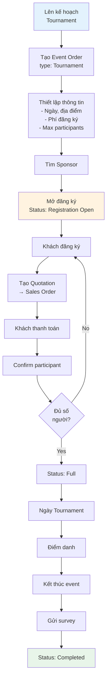
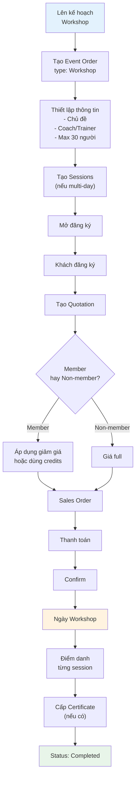
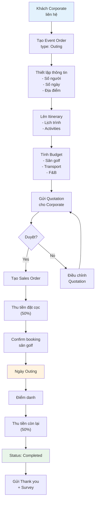

# Dịch vụ Giá trị Gia tăng - Phân tích ERPNext

> **Module:** Event / Workshop / Outing
>
> **Mục đích:** Phân tích khả năng ERPNext support các dịch vụ giá trị gia tăng cho Golf business
>
> **Kết luận:** ERPNext có **70-75% chức năng sẵn có**, cần custom thêm ~27 ngày cho full features

---

## 1. Tổng quan Module

### 1.1. Định nghĩa các loại dịch vụ

| Module | Định nghĩa | Quy mô | Ví dụ |
|--------|-----------|--------|-------|
| **Event** | Sự kiện golf, giải đấu, tournament | Lớn (50-500 người) | Giải golf từ thiện, Tournament hàng tháng |
| **Workshop** | Hội thảo, training kỹ thuật | Trung bình (10-30 người) | Workshop kỹ thuật swing, Seminar club fitting |
| **Outing** | Tour golf, team building | Trung bình-Lớn (20-100 người) | Corporate outing, Golf trip |

### 1.2. So sánh với các module đã có

| Module | Có trong Spec? | ERPNext Coverage | Status |
|--------|---------------|------------------|--------|
| Fitting | ✅ Section 16 | 80% | Đã thiết kế |
| Coaching | ✅ Section 17 | 85% | Đã thiết kế |
| Trade-in | ✅ Section 18 | 90% | Đã thiết kế |
| **Event** | ⚠️ Chưa có | 70% | Cần clarify |
| **Workshop** | ⚠️ Chưa có | 75% | Cần clarify |
| **Outing** | ⚠️ Chưa có | 75% | Cần clarify |

---

## 2. ERPNext có sẵn gì?

### 2.1. Event DocType (Frappe Core)

| Chức năng | Mô tả | Status |
|-----------|-------|--------|
| **Calendar integration** | Hiển thị trên lịch, sync Google Calendar | ✅ Có sẵn |
| **Recurring events** | Sự kiện lặp lại (daily/weekly/monthly/yearly) | ✅ Có sẵn |
| **Participant management** | Quản lý người tham gia | ✅ Có sẵn |
| **Status tracking** | Open → Completed → Closed → Cancelled | ✅ Có sẵn |
| **Notifications** | Email reminder tự động | ✅ Có sẵn |
| **Google Meet integration** | Video conferencing | ✅ Có sẵn |
| **Communication sync** | Link với Customer/Lead timeline | ✅ Có sẵn |

**Hạn chế:**
- ❌ Không có capacity management (giới hạn số người)
- ❌ Không có payment tracking
- ❌ Không có event type cho Golf

### 2.2. Appointment Booking (ERPNext CRM)

| Chức năng | Mô tả | Status |
|-----------|-------|--------|
| **Time slot booking** | Đặt lịch theo khung giờ | ✅ Có sẵn |
| **Auto-assign agent** | Phân bổ staff tự động | ✅ Có sẵn |
| **Calendar event creation** | Tự động tạo Event khi đặt | ✅ Có sẵn |
| **Email confirmation** | Xác nhận qua email | ✅ Có sẵn |
| **Party linking** | Link với Lead/Customer | ✅ Có sẵn |

**Hạn chế:**
- ❌ Chỉ cho 1-1 appointment, không phải group event

### 2.3. Campaign (ERPNext CRM)

| Chức năng | Mô tả | Status |
|-----------|-------|--------|
| **Campaign scheduling** | Lên lịch campaign | ✅ Có sẵn |
| **Email distribution** | Gửi email hàng loạt | ✅ Có sẵn |
| **ROI tracking** | Theo dõi hiệu quả | ✅ Có sẵn |
| **Lead/Opportunity tracking** | Theo dõi conversion | ✅ Có sẵn |

**Hạn chế:**
- ❌ Chỉ cho marketing, không phải event management

### 2.4. Sales Order Integration

| Chức năng | Mô tả | Status |
|-----------|-------|--------|
| **Quotation** | Báo giá phí tham gia | ✅ Có sẵn |
| **Sales Order** | Đơn hàng đăng ký | ✅ Có sẵn |
| **Sales Invoice** | Hóa đơn thu phí | ✅ Có sẵn |
| **Payment Entry** | Thanh toán | ✅ Có sẵn |
| **Discount/Tax** | Chiết khấu, thuế | ✅ Có sẵn |

---

## 3. Chức năng có sẵn - Chi tiết

### 3.1. Tổng hợp 20 chức năng có sẵn

| # | Chức năng | Module ERPNext | Áp dụng cho |
|---|-----------|----------------|-------------|
| 1 | Tạo sự kiện trên lịch | Event | Event/Workshop/Outing |
| 2 | Sự kiện lặp lại | Event | Workshop series |
| 3 | Quản lý người tham gia | Event Participants | All |
| 4 | RSVP tracking (Yes/No/Maybe) | Event Participants | All |
| 5 | Email reminder tự động | Event Notification | All |
| 6 | Sync Google Calendar | Event | All |
| 7 | Video meeting (Google Meet) | Event | Workshop online |
| 8 | Link với Customer/Lead | Event Communication | All |
| 9 | Đặt lịch theo time slot | Appointment | Workshop sessions |
| 10 | Phân bổ staff tự động | Appointment | All |
| 11 | Email xác nhận đặt chỗ | Appointment | All |
| 12 | Báo giá phí tham gia | Quotation | All |
| 13 | Đơn đăng ký tham gia | Sales Order | All |
| 14 | Hóa đơn thu phí | Sales Invoice | All |
| 15 | Thanh toán | Payment Entry | All |
| 16 | Chiết khấu early bird | Quotation/SO | All |
| 17 | Thuế VAT | Tax Template | All |
| 18 | Campaign marketing | Campaign | Event promotion |
| 19 | Email marketing | Email Campaign | Event promotion |
| 20 | ROI tracking | Campaign | Event promotion |

### 3.2. Workflow tích hợp sẵn

```
┌─────────────────────────────────────────────────────────────────────────┐
│                    ERPNEXT NATIVE INTEGRATION                           │
├─────────────────────────────────────────────────────────────────────────┤
│                                                                         │
│  ┌──────────┐    ┌───────────┐    ┌─────────────┐    ┌──────────────┐  │
│  │  Event   │───▶│ Quotation │───▶│ Sales Order │───▶│Sales Invoice │  │
│  │(Calendar)│    │  (Báo giá)│    │ (Đăng ký)   │    │  (Thu phí)   │  │
│  └──────────┘    └───────────┘    └─────────────┘    └──────────────┘  │
│       │                                                      │          │
│       ▼                                                      ▼          │
│  ┌──────────┐                                         ┌──────────────┐  │
│  │Participant│                                        │Payment Entry │  │
│  │  Table    │                                        │ (Thanh toán) │  │
│  └──────────┘                                         └──────────────┘  │
│                                                                         │
└─────────────────────────────────────────────────────────────────────────┘
```

---

## 4. Gap Analysis - Cần custom

### 4.1. Chức năng THIẾU cho Golf Business

| # | Chức năng | Mức độ | Effort | Mô tả |
|---|-----------|--------|--------|-------|
| 1 | **Event Type** (Tournament/Workshop/Outing) | Critical | 1 ngày | Custom field trên Event |
| 2 | **Capacity Management** | Critical | 2 ngày | Giới hạn số người tham gia |
| 3 | **Registration Fee** | Critical | 1 ngày | Phí đăng ký trên Event |
| 4 | **Event Status Workflow** | High | 2 ngày | Planning → Registration → Running → Done |
| 5 | **Golf Course Location** | High | 1 ngày | Link đến địa điểm sân golf |
| 6 | **Sponsor Management** | High | 4 ngày | Quản lý nhà tài trợ |
| 7 | **Event Budget** | Medium | 3 ngày | Chi phí tổ chức |
| 8 | **Attendance Sheet** | Medium | 2 ngày | Điểm danh ngày event |
| 9 | **Certificate Generation** | Low | 2 ngày | Chứng nhận tham gia |
| 10 | **Post-event Survey** | Low | 2 ngày | Khảo sát sau sự kiện |
| 11 | **Equipment Rental** | Medium | 3 ngày | Thuê thiết bị golf |
| 12 | **Event Report** | Medium | 3 ngày | Báo cáo doanh thu, attendance |

### 4.2. Custom DocType đề xuất

**Event Order (Custom DocType chính)**

```
event_order
├── event_type (Tournament / Workshop / Outing / Corporate)
├── event_name
├── description
├── event_date (Date)
├── start_time / end_time
├── duration_days (Int)
├── golf_course (Link → Location)
├── organizer (Link → Employee)
├── max_participants (Int)
├── current_participants (Int, auto-calculated)
├── registration_fee (Currency)
├── early_bird_fee (Currency)
├── early_bird_deadline (Date)
├── status (Planning → Registration Open → Full → Running → Completed → Cancelled)
├── participants (Table → Event Participant)
├── sponsors (Table → Event Sponsor)
├── budget (Currency)
├── actual_cost (Currency)
├── linked_event (Link → Event - for calendar)
└── notes (Text)
```

**Event Participant (Child Table)**

```
event_participant
├── party_type (Lead / Customer / Employee)
├── party (Dynamic Link)
├── full_name
├── email
├── phone
├── registration_date
├── registration_status (Invited → Registered → Confirmed → Attended → No-show)
├── payment_status (Pending → Paid → Refunded)
├── linked_sales_order (Link)
├── special_requests (Text)
└── feedback_rating (Rating)
```

**Event Sponsor (Child Table)**

```
event_sponsor
├── sponsor_name
├── sponsor_type (Gold / Silver / Bronze / Partner)
├── contact_person
├── email
├── sponsorship_amount (Currency)
├── benefits (Text)
└── logo_file (Attach)
```

---

## 5. Workflow chi tiết từng module

### 5.1. Event (Golf Tournament)



### 5.2. Workshop (Training Session)



### 5.3. Outing (Corporate Golf Trip)



---

## 6. Tích hợp với Membership

### 6.1. Member Benefits cho Event/Workshop

| Membership Type | Event Discount | Workshop Discount | Outing Priority |
|-----------------|---------------|-------------------|-----------------|
| Basic | 0% | 10% | Normal |
| Premium | 10% | 20% | Early access |
| VIP | 20% | 30% + 1 free/year | First priority |

### 6.2. Integration với Service Credits

```
┌─────────────────────────────────────────────────────────────────────────┐
│                    MEMBERSHIP + EVENT INTEGRATION                       │
├─────────────────────────────────────────────────────────────────────────┤
│                                                                         │
│  VIP Member đăng ký Workshop                                           │
│       │                                                                 │
│       ▼                                                                 │
│  ┌─────────────────────────────────────────┐                           │
│  │ Check Service Credits                    │                           │
│  │ - Workshop credits remaining: 2          │                           │
│  └─────────────────────────────────────────┘                           │
│       │                                                                 │
│       ▼                                                                 │
│  ┌─────────────────┐    ┌─────────────────┐                            │
│  │ Use 1 Credit    │ OR │ Pay with 30%    │                            │
│  │ (Free workshop) │    │ member discount │                            │
│  └─────────────────┘    └─────────────────┘                           │
│                                                                         │
└─────────────────────────────────────────────────────────────────────────┘
```

---

## 7. Danh sách chức năng cho khách hàng

### 7.1. Chức năng CÓ SẴN (20 features)

| # | Chức năng | Áp dụng |
|---|-----------|---------|
| 1 | Tạo sự kiện trên lịch | Event/Workshop/Outing |
| 2 | Sự kiện lặp lại (series) | Workshop hàng tuần |
| 3 | Quản lý danh sách người tham gia | All |
| 4 | RSVP tracking | All |
| 5 | Email reminder tự động | All |
| 6 | Sync Google Calendar | All |
| 7 | Video meeting online | Workshop online |
| 8 | Link sự kiện với Customer/Lead | All |
| 9 | Đặt lịch theo time slot | Workshop |
| 10 | Phân bổ staff/coach tự động | Workshop |
| 11 | Email xác nhận đăng ký | All |
| 12 | Báo giá phí tham gia | All |
| 13 | Đơn đăng ký tham gia | All |
| 14 | Hóa đơn thu phí | All |
| 15 | Thanh toán online/offline | All |
| 16 | Chiết khấu early bird | All |
| 17 | Tính thuế VAT | All |
| 18 | Campaign marketing sự kiện | All |
| 19 | Email marketing | All |
| 20 | Theo dõi ROI campaign | All |

### 7.2. Chức năng CẦN CUSTOM (12 features)

| # | Chức năng | Priority | Effort |
|---|-----------|----------|--------|
| 1 | Phân loại Event (Tournament/Workshop/Outing) | Critical | 1 ngày |
| 2 | Giới hạn số người tham gia | Critical | 2 ngày |
| 3 | Phí đăng ký trên Event | Critical | 1 ngày |
| 4 | Workflow trạng thái sự kiện | High | 2 ngày |
| 5 | Địa điểm sân golf | High | 1 ngày |
| 6 | Quản lý nhà tài trợ | High | 4 ngày |
| 7 | Budget/Chi phí tổ chức | Medium | 3 ngày |
| 8 | Điểm danh ngày event | Medium | 2 ngày |
| 9 | Chứng nhận tham gia | Low | 2 ngày |
| 10 | Khảo sát sau sự kiện | Low | 2 ngày |
| 11 | Thuê thiết bị golf | Medium | 3 ngày |
| 12 | Báo cáo Event | Medium | 3 ngày |

**Tổng effort custom: ~26-27 ngày**

---

## 8. Câu hỏi cần clarify với khách

| # | Câu hỏi | Lý do |
|---|---------|-------|
| 1 | Event/Workshop/Outing có nằm trong scope dự án không? | Chưa có trong FEATURE_SPECIFICATION.md |
| 2 | Có bao nhiêu loại event? | Để thiết kế Event Type |
| 3 | Mỗi loại event có quy mô bao nhiêu người? | Để thiết kế capacity |
| 4 | Cấu trúc phí đăng ký? (Fixed / Per-person / Tiered) | Để thiết kế pricing |
| 5 | Có early bird discount không? | Để thiết kế pricing |
| 6 | Có cần quản lý Sponsor không? | Để đánh giá effort |
| 7 | Có cần điểm danh attendance không? | Để thiết kế workflow |
| 8 | Có cần cấp certificate không? | Để thiết kế output |
| 9 | Member có ưu đãi gì khi tham gia event? | Để tích hợp Membership |
| 10 | Có cần booking sân golf trong hệ thống không? | Để đánh giá scope |

---

## 9. Timeline ước tính

### 9.1. Nếu làm riêng module này

| Phase | Nội dung | Effort |
|-------|----------|--------|
| Phase 1 | Event Base (DocType + Calendar) | 5 ngày |
| Phase 2 | Workshop (Sessions + Attendance) | 7 ngày |
| Phase 3 | Outing (Itinerary + Budget) | 6 ngày |
| Phase 4 | Sponsorship | 4 ngày |
| Phase 5 | Reports & Analytics | 5 ngày |
| **Tổng** | | **27 ngày** |

### 9.2. Nếu kết hợp với Membership

| Combined Effort | Membership | Event/Workshop/Outing | Tổng |
|-----------------|------------|----------------------|------|
| Phase 1 | 3-5 ngày (setup) | 5 ngày | 8-10 ngày |
| Phase 2 | 5-7 ngày (custom) | 7 ngày | 12-14 ngày |
| Phase 3 | 7-10 ngày (credits) | 6 ngày | 13-16 ngày |
| Phase 4 | - | 9 ngày | 9 ngày |
| **Tổng** | **15-22 ngày** | **27 ngày** | **~42-49 ngày** |

**Lưu ý:** Có thể song song một số task → giảm xuống ~35-40 ngày

---

## 10. Code References

### 10.1. ERPNext Files

| File | Purpose | Line |
|------|---------|------|
| `frappe/desk/doctype/event/event.py` | Event business logic | 49-536 |
| `frappe/desk/doctype/event/event.json` | Event schema | 1-419 |
| `frappe/desk/doctype/event_participants/event_participants.json` | Participant table | 1-58 |
| `erpnext/crm/doctype/appointment/appointment.py` | Appointment logic | 16-268 |
| `erpnext/crm/doctype/campaign/campaign.json` | Campaign schema | 1-111 |

### 10.2. Key Functions

| Function | File | Purpose |
|----------|------|---------|
| `get_events()` | event.py:334 | Retrieve events by date |
| `sync_communication()` | event.py:134 | Link to Customer timeline |
| `add_participant()` | event.py:179 | Add participant |
| `create_calendar_event()` | appointment.py:191 | Create Event from Appointment |

---

## 11. Kết luận

### Đề xuất approach

1. **Clarify với khách:** Event/Workshop/Outing có nằm trong scope không?
2. **Nếu có:** Kết hợp làm cùng Membership module (tiết kiệm thời gian)
3. **Nếu không:** Đưa vào Phase 2 hoặc đề xuất bổ sung

### So sánh ERPNext vs Custom

| Tiêu chí | ERPNext + Custom | Build từ đầu |
|----------|------------------|--------------|
| Thời gian | ~27 ngày | ~45-60 ngày |
| Chi phí | Thấp hơn | Cao hơn |
| Bảo trì | Dễ | Khó |
| Tích hợp | Native | Cần build |
| **Khuyến nghị** | ✅ | - |

---

**Ngày tạo:** 30/01/2026
**Người tạo:** DCNET Technical Team
**Trạng thái:** Draft - Chờ clarify với khách hàng
