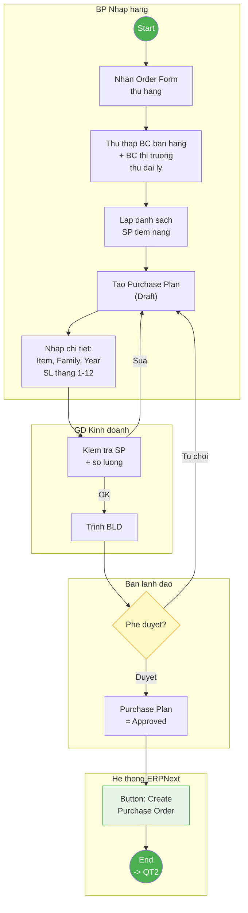
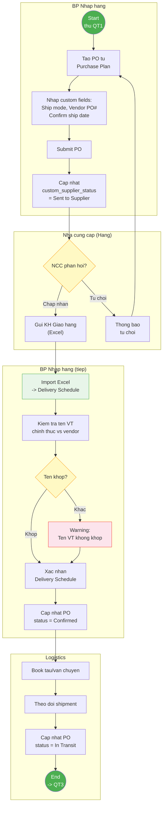
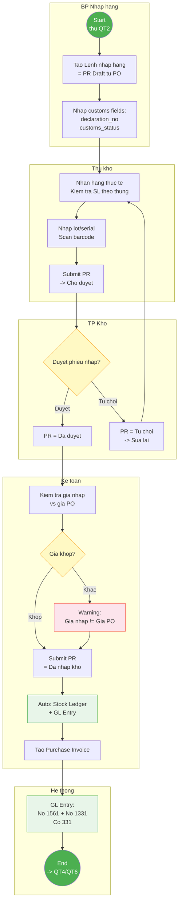
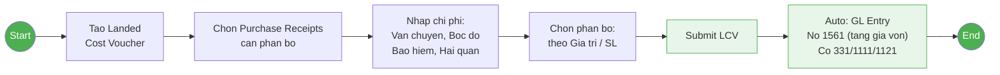
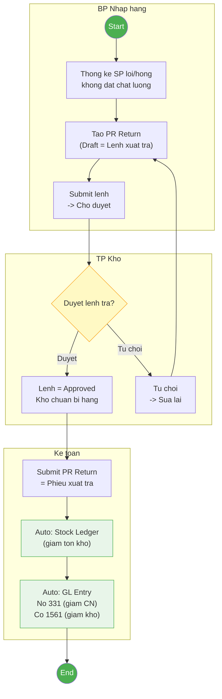
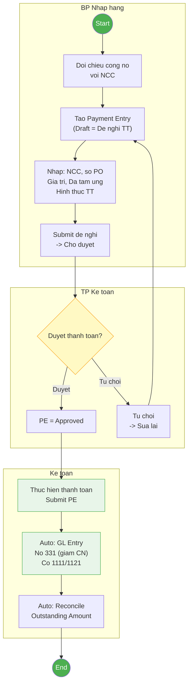
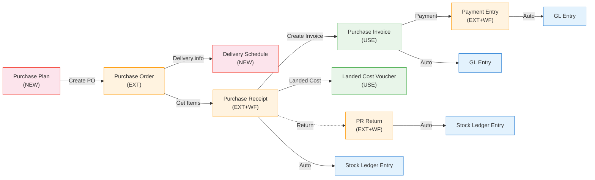
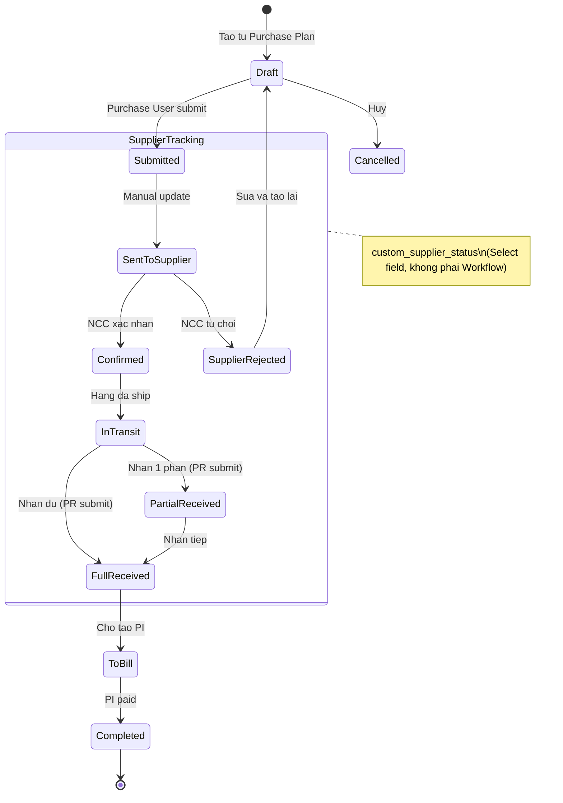
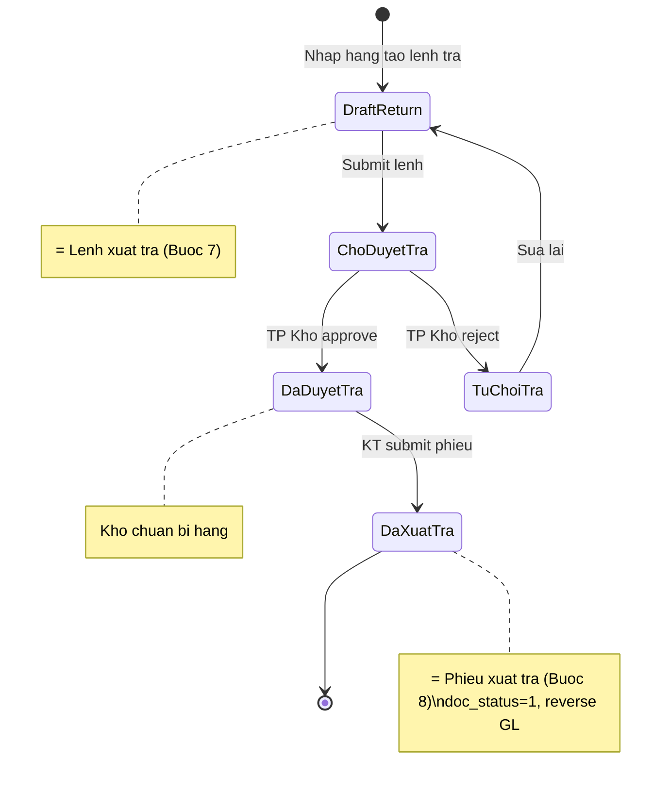

# 05 - Mua hàng: Business Analysis

> **Nguồn:** SPEC_MAPPING.md + ERP_SPECIFICATION.md Section 3 + IMPORT_PROCESS_SPECIFICATION.md
> **Ngày tạo:** 09/03/2026
> **Cập nhật:** 17/03/2026
> **Satellites:** 04 (NCC), 06 (BC Phân tích), 24 (KT Mua hàng — chưa có SPEC_MAPPING)
> **Workflow docs:** `workflow/erpnext.md` + `workflow/nhatminh.md`
> **Workflow:** C (Full) — Module Complex (EXT+NEW=14, 6+ bộ phận, 10 bước spec)
> **Methodology:** BABOK v3, 7 Domains (BPMN, BA Method, Mermaid, Gap, VSM, Orchestration, Metrics)

## Mục lục

1. [BPMN Process Flows](#1-bpmn-process-flows)
2. [ERPNext Process Detail](#2-erpnext-process-detail)
3. [Requirements Traceability](#3-requirements-traceability)
4. [Gap Analysis](#4-gap-analysis)
5. [Value Stream Analysis](#5-value-stream-analysis)

---

## 1. BPMN Process Flows

### 1.1 Tổng quan quy trình

| # | Quy trình | Bước spec | Actors | Complexity |
|---|-----------|-----------|--------|:----------:|
| QT1 | Lập Kế hoạch Mua hàng | Bước 1 | Nhập hàng, GĐ KD, BLĐ | Cao (DocType mới) |
| QT2 | Đặt hàng & KH Giao hàng | Bước 2-3 | Nhập hàng, NCC, GĐ KD, Logistics | Cao (DocType mới + PO extend) |
| QT3 | Nhập kho hàng hóa | Bước 4-5 | Nhập hàng, Kho, Kế toán | Trung bình (Workflow) |
| QT4 | Chi phí mua hàng | Bước 6 | Nhập hàng, Kế toán | Đơn giản (LCV có sẵn) |
| QT5 | Trả hàng NCC | Bước 7-8 | Nhập hàng, Kho, Kế toán | Trung bình (2-step WF) |
| QT6 | Thanh toán NCC | Bước 9-10 | Nhập hàng, Kế toán, BLĐ | Trung bình (Workflow) |

**End-to-End P2P Flow:**

```
┌─────────────────────────────────────────────────────────────────────────────────────────┐
│                        PROCUREMENT-TO-PAY (P2P) — DCNET FLOW                            │
│                                                                                         │
│  ┌──────────┐    ┌──────────┐    ┌──────────┐    ┌──────────┐    ┌──────────┐           │
│  │ PLANNING │───▶│ ORDERING │───▶│ RECEIVING│───▶│INVOICING │───▶│ PAYMENT  │           │
│  │  (QT1)   │    │ (QT2)    │    │ (QT3)    │    │(QT3→QT4) │    │  (QT6)   │           │
│  └──────────┘    └──────────┘    └──────────┘    └──────────┘    └──────────┘           │
│                                        │                                                │
│                                        ├─────────────▶ ┌──────────┐                     │
│                                        │ (Hàng lỗi)    │  RETURN  │                     │
│                                        │               │  (QT5)   │                     │
│                                        │               └──────────┘                     │
│                                        ▼                                                │
│                               ┌──────────────────────────────────────┐                  │
│                               │       REPORTING & ANALYTICS          │                  │
│                               └──────────────────────────────────────┘                  │
└─────────────────────────────────────────────────────────────────────────────────────────┘
```

### 1.2 QT1: Lập Kế hoạch Mua hàng — To-Be BPMN

**Actors:** Nhập hàng, GĐ Kinh doanh, BLĐ, Hệ thống ERPNext
**Trigger:** Nhận Order Form từ hãng / Nhu cầu đặt hàng theo mùa
**End state:** Purchase Plan = Approved → sẵn sàng tạo PO



### 1.3 QT2: Đặt hàng & KH Giao hàng — To-Be BPMN

**Actors:** Nhập hàng, NCC (Hãng), Logistics
**Trigger:** Purchase Plan approved
**End state:** PO submitted + Delivery Schedule imported, hàng đang vận chuyển



### 1.4 QT3: Nhập kho hàng hóa — To-Be BPMN

**Actors:** Nhập hàng, Thủ kho, TP Kho, Kế toán, Hệ thống
**Trigger:** Hàng về đến kho / PO status = In Transit
**End state:** Purchase Receipt submitted + Stock Ledger + GL Entry + Purchase Invoice



### 1.5 QT4: Chi phí mua hàng — To-Be BPMN

**Actors:** Nhập hàng, Kế toán
**Trigger:** Purchase Receipt đã submitted
**End state:** Landed Cost Voucher submitted, giá vốn hàng hóa đã cập nhật



### 1.6 QT5: Trả hàng NCC — To-Be BPMN (2-step)

**Actors:** Nhập hàng, TP Kho, Kế toán
**Trigger:** Phát hiện hàng lỗi/hỏng/không đạt chất lượng
**End state:** PR Return submitted, tồn kho giảm, công nợ giảm



### 1.7 QT6: Thanh toán NCC — To-Be BPMN

**Actors:** Nhập hàng, TP Kế toán, Kế toán
**Trigger:** Xác nhận công nợ xong, đến hạn thanh toán
**End state:** Payment Entry submitted, công nợ giảm, GL ghi nhận



---

## 2. ERPNext Process Detail

### 2.1 DocType Flow tổng quan



> Đỏ = DocType mới (NEW) | Cam = Cần mở rộng (EXT) | Xanh lá = Có sẵn (USE) | Xanh dương = Auto-generated

### 2.2 DocType Lifecycle — State Diagrams

#### Purchase Plan (DocType mới)

```mermaid
stateDiagram-v2
    [*] --> Draft : NV Nhap hang tao
    Draft --> PendingReview : Submit de review
    PendingReview --> Approved : BLD phe duyet
    PendingReview --> Rejected : BLD tu choi
    Rejected --> Draft : Sua lai
    Approved --> InProgress : Tao PO dau tien
    InProgress --> Completed : Tat ca PO da tao
    Completed --> [*]

    note right of Draft : doc_status=0\nAllow Edit: Purchase User
    note right of PendingReview : doc_status=0\nAllow Edit: None
    note right of Approved : doc_status=1\nButton Create PO
    note right of InProgress : Tracking % PO created
    note right of Completed : Read-only
```

#### Purchase Order (Extended)



#### Purchase Receipt (Workflow)

```mermaid
stateDiagram-v2
    [*] --> Draft : Tao tu PO
    Draft --> ChoDuyet : Stock User submit
    ChoDuyet --> DaDuyet : Stock Manager approve
    ChoDuyet --> TuChoi : Stock Manager reject
    TuChoi --> Draft : Stock User sua lai
    DaDuyet --> DaNhapKho : Accounts User confirm
    DaNhapKho --> [*]

    note right of Draft : doc_status=0\nNhap SL, lot, serial, customs
    note right of ChoDuyet : doc_status=0\nTP Kho kiem tra
    note right of DaDuyet : doc_status=0\nKT kiem tra gia vs PO
    note right of DaNhapKho : doc_status=1\nAuto: Stock Ledger + GL
```

**Workflow Definition:**

| # | State | Doc Status | Allow Edit | Transitions |
|---|-------|-----------|------------|-------------|
| 1 | Draft | 0 | Stock User | → Chờ duyệt (Stock User) |
| 2 | Chờ duyệt | 0 | Stock Manager | → Đã duyệt (Stock Manager), → Từ chối (Stock Manager) |
| 3 | Đã duyệt | 0 | Accounts User | → Đã nhập kho (Accounts User) |
| 4 | Đã nhập kho | 1 | - | (Submitted — tạo Stock Ledger + GL) |
| 5 | Từ chối | 0 | Stock User | → Draft (Stock User) |

#### Purchase Receipt Return (2-step Workflow)



#### Payment Entry (Approval Workflow)

```mermaid
stateDiagram-v2
    [*] --> DraftPayment : Nhap hang tao de nghi
    DraftPayment --> DeNghiTT : Submit de nghi
    DeNghiTT --> DaDuyetTT : TP KT approve
    DeNghiTT --> TuChoiTT : TP KT reject
    TuChoiTT --> DraftPayment : Sua lai
    DaDuyetTT --> DaThanhToan : KT thuc hien TT
    DaThanhToan --> [*]

    note right of DraftPayment : Nhap NCC, PO, gia tri, hinh thuc TT
    note right of DeNghiTT : = De nghi thanh toan (Buoc 10)
    note right of DaDuyetTT : TP KT da approve
    note right of DaThanhToan : doc_status=1\nGL: No 331, Co 1111/1121
```

### 2.3 Chi tiết từng QT — DocType Flow

#### QT1: Lập KHMH

| Step | Action | DocType | Field/Event | Kết quả |
|------|--------|---------|-------------|---------|
| 1 | Tạo KHMH | Purchase Plan | `supplier`, `plan_date`, items (12 cột SL) | Draft |
| 2 | Nhập chi tiết SP | Purchase Plan Item | `item_code`, `family`, `year`, `category`, `shaft`, `qty_month_1..12` | Child rows |
| 3 | GĐ KD review | Purchase Plan | Workflow transition | Pending Review |
| 4 | BLĐ phê duyệt | Purchase Plan | Workflow transition | Approved |
| 5 | Tạo PO | Button "Create PO" | auto-create PO from Plan items | PO Draft, link `custom_purchase_plan` |

#### QT2: Đặt hàng & KHGH

| Step | Action | DocType | Field/Event | Kết quả |
|------|--------|---------|-------------|---------|
| 1 | Tạo PO từ KHMH | Purchase Order | `custom_purchase_plan`, items fetched | PO Draft |
| 2 | Nhập shipping info | Purchase Order | `custom_ship_mode`, `custom_vendor_po_number`, `custom_confirm_ship_date` | Extended fields |
| 3 | Submit PO | Purchase Order | on_submit | Submitted |
| 4 | Cập nhật status NCC | Purchase Order | `custom_supplier_status` = "Sent to Supplier" | Manual |
| 5 | NCC xác nhận | Purchase Order | `custom_supplier_status` = "Confirmed" | Manual |
| 6 | Import KHGH | Delivery Schedule | Import từ Excel hãng | New doc linked to PO |
| 7 | Validate tên VT | Delivery Schedule Item | `item_name` vs `vendor_item_name` | Warning nếu khác |
| 8 | Book logistics | Purchase Order | `custom_supplier_status` = "In Transit" | Manual |

#### QT3: Nhập kho

| Step | Action | DocType | Field/Event | Kết quả |
|------|--------|---------|-------------|---------|
| 1 | Tạo lệnh nhập | Purchase Receipt | Get Items from PO | PR Draft |
| 2 | Nhập customs | Purchase Receipt | `custom_declaration_no`, `custom_customs_status`, `custom_clearance_date_*` | Extended fields |
| 3 | Nhận hàng + scan | Purchase Receipt Item | `qty`, `batch_no`, `serial_no` | Quantities |
| 4 | Submit chờ duyệt | Purchase Receipt | Workflow: Draft → Chờ duyệt | Stock User |
| 5 | TP Kho duyệt | Purchase Receipt | Workflow: Chờ duyệt → Đã duyệt | Stock Manager |
| 6 | KT check giá | Purchase Receipt | Client script: `rate` vs PO `rate` | Warning nếu khác |
| 7 | KT submit | Purchase Receipt | Workflow: Đã duyệt → Đã nhập kho | doc_status=1 |
| 8 | Auto Stock Ledger | Stock Ledger Entry | `actual_qty` += received | Auto |
| 9 | Tạo PI | Purchase Invoice | From PR | PI Draft |
| 10 | Submit PI | Purchase Invoice | on_submit | GL Entry auto |

#### QT4: Chi phí mua hàng

| Step | Action | DocType | Field/Event | Kết quả |
|------|--------|---------|-------------|---------|
| 1 | Tạo LCV | Landed Cost Voucher | Chọn PRs cần phân bổ | Draft |
| 2 | Nhập chi phí | LCV Applicable Charges | Vận chuyển, bốc dỡ, bảo hiểm | Charges |
| 3 | Submit | Landed Cost Voucher | on_submit | GL: Nợ 1561, Có 331/1111 |

#### QT5: Trả hàng NCC

| Step | Action | DocType | Field/Event | Kết quả |
|------|--------|---------|-------------|---------|
| 1 | Tạo lệnh trả | Purchase Receipt (Return) | `is_return=1`, from original PR | Draft = Lệnh |
| 2 | Submit lệnh | Purchase Receipt (Return) | Workflow: Draft → Chờ duyệt | Pending |
| 3 | TP Kho duyệt | Purchase Receipt (Return) | Workflow: Chờ duyệt → Đã duyệt | Kho chuẩn bị |
| 4 | KT submit phiếu | Purchase Receipt (Return) | Workflow: Đã duyệt → Đã xuất trả | doc_status=1 |
| 5 | Auto reverse | Stock Ledger + GL | `actual_qty` -= returned | Nợ 331, Có 1561 |

#### QT6: Thanh toán NCC

| Step | Action | DocType | Field/Event | Kết quả |
|------|--------|---------|-------------|---------|
| 1 | Đối chiếu CN | Accounts Payable Report | Filter by Supplier | Outstanding amount |
| 2 | Tạo đề nghị TT | Payment Entry | `payment_type`=Pay, `party_type`=Supplier | Draft |
| 3 | Submit đề nghị | Payment Entry | Workflow: Draft → Đề nghị TT | Pending approval |
| 4 | TP KT duyệt | Payment Entry | Workflow: Đề nghị TT → Đã duyệt | Approved |
| 5 | KT thanh toán | Payment Entry | Workflow: Đã duyệt → Đã thanh toán | doc_status=1 |
| 6 | Auto GL | GL Entry | Nợ 331, Có 1111/1121 | Auto reconcile |

### 2.4 Edge Cases & Exception Handling

| # | Case | Quy trình | Xử lý | DocType | Ghi chú |
|---|------|-----------|-------|---------|---------|
| E1 | NCC từ chối đơn hàng | QT2 | PO status = "Rejected", sửa lại hoặc cancel | Purchase Order | custom_supplier_status |
| E2 | Hàng giao thiếu | QT3 | Partial Receipt: PR qty < PO qty, PO vẫn "To Receive" | Purchase Receipt | Tạo thêm PR cho đợt sau |
| E3 | Hàng lỗi khi nhận | QT3→QT5 | TP Kho từ chối PR, hoặc nhận rồi tạo Return | Purchase Receipt | Tuỳ mức độ |
| E4 | Giá nhập khác giá PO | QT3 | Warning (không block), KT quyết định có submit không | Purchase Receipt | Client script warning |
| E5 | Hủy PO đã có PR | QT2 | Không cho cancel PO nếu có PR submitted | Purchase Order | ERPNext built-in validation |
| E6 | Thanh toán 1 phần | QT6 | Multiple PE cho 1 PI, outstanding giảm dần | Payment Entry | ERPNext built-in |
| E7 | Multi-currency (NK) | QT3 | PI ghi USD/JPY, exchange rate tại ngày submit | Purchase Invoice | ERPNext multi-currency |
| E8 | LCV sau khi PI đã submit | QT4 | LCV revalue stock, tạo thêm GL adjustment | Landed Cost Voucher | ERPNext built-in |
| E9 | Hàng về trước tờ khai | QT3 | PR draft chờ customs, customs_status = "Pending" | Purchase Receipt | custom field |
| E10 | KHMH sửa sau khi PO đã tạo | QT1 | Plan amended, PO không tự update | Purchase Plan | Manual reconcile via report |

### 2.5 Automation & Hooks

| Event | DocType | Auto Action | ERPNext Feature | Custom? |
|-------|---------|-------------|-----------------|:-------:|
| PR Submit | Purchase Receipt | Stock Ledger Entry created | Perpetual Inventory | No |
| PI Submit | Purchase Invoice | GL Entry (Nợ 1561, Nợ 1331, Có 331) | Auto Accounting | No |
| PE Submit | Payment Entry | Reconcile Outstanding Amount | Payment Reconciliation | No |
| PR Return Submit | Purchase Receipt | Reverse Stock + GL | Return mechanism | No |
| LCV Submit | Landed Cost Voucher | Revalue stock, GL adjustment | Stock Revaluation | No |
| PR validate | Purchase Receipt | Check rate vs PO rate | — | **Yes** |
| DS validate | Delivery Schedule | Check item_name vs vendor_item_name | — | **Yes** |
| PO refresh | Purchase Order | Show supplier_status badge | — | **Yes** |

---

## 3. Requirements Traceability

### 3.1 Traceability Matrix

| Spec # | Feature | QT | Step | DocType | Field/Action | Tag |
|--------|---------|:--:|:----:|---------|-------------|:---:|
| 3.1.1 | Ưu đãi NCC (CK%, tiền, quà) | QT2 | 1 | Pricing Rule | discount_percentage, discount_amount, Free Item | CFG |
| 3.1.2 | Import hình ảnh SP hàng loạt | — | — | Item (attach) | Custom tool: folder → match → attach | EXT |
| 3.1.3 | Tạo PO | QT2 | 1-3 | Purchase Order | custom_ship_mode, custom_confirm_ship_date, custom_vendor_po_number | EXT |
| 3.1.4 | Chi tiết PO | QT2 | 1 | PO Item | item_code, item_name, qty, rate | USE |
| 3.1.5 | Theo dõi PO theo số PO | QT2 | 4-8 | Purchase Order | custom_supplier_status (Select) | EXT |
| 3.1.6 | Lệnh nhập từ PO, nhập nhiều lần | QT3 | 1 | Purchase Receipt | Get Items from PO, partial receipt | USE |
| 3.1.7 | Theo dõi % nhận hàng | QT3 | — | Purchase Order | Dashboard % Received | USE |
| 3.1.8 | Nhập hàng theo lô | QT3 | 3 | PR Item | batch_no | CFG |
| 3.1.9 | Nhập hàng theo serial | QT3 | 3 | PR Item | serial_no | CFG |
| 3.1.10 | Nhập hàng theo mã vạch | QT3 | 3 | PR Item | Barcode scan → add row | EXT |
| 3.1.11 | Khai báo vòng đời SP | — | — | Item | end_of_life (product lifecycle) | EXT |
| 3.1.12 | Nguồn tiền (TM/NH) | QT6 | 2 | Payment Entry | mode_of_payment | CFG |
| 3.1.13 | Phương thức TT (TM/CK/CN) | QT2 | 1 | Purchase Order | payment_terms_template | CFG |
| 3.1.14 | Theo dõi thanh toán PO | QT6 | — | Purchase Order | Dashboard % Paid | USE |
| 3.1.15 | Đính kèm chứng từ | All | — | All DocTypes | Sidebar Attach File | USE |
| 3.1.16 | Trạng thái phiếu nhập | QT3 | 4-7 | Purchase Receipt | Workflow: Draft→Chờ duyệt→Đã duyệt→Đã nhập kho | EXT |
| 3.1.17 | Lịch sử mua hàng | — | — | PO/PR | Supplier Dashboard + reports | USE |
| 3.1.18 | BC mua hàng | — | — | Script Report | 3 reports: Giá BQ, NCC tốt nhất, Chi phí | EXT |
| 3.2.1 | Kế hoạch mua hàng | QT1 | 1-5 | **Purchase Plan** (NEW) | supplier, items, qty_month_1..12, family, year | NEW |
| 3.2.2 | Đơn hàng mua / HĐ mua | QT2 | 1-3 | Purchase Order | custom_purchase_plan (Link) | CFG |
| 3.2.3 | Kế hoạch giao hàng | QT2 | 6-7 | **Delivery Schedule** (NEW) | ~22 fields, import Excel | NEW |
| 3.2.4 | Đề nghị nhập / Lệnh nhập | QT3 | 1-2 | PR (Draft) | custom_customs_status, custom_clearance_date_* | EXT |
| 3.2.5 | Phiếu nhập mua / NK | QT3 | 6-10 | PR + PI | custom_declaration_no, price warning | EXT |
| 3.2.6 | Chi phí mua hàng | QT4 | 1-3 | Landed Cost Voucher | Charges allocation | USE |
| 3.2.7 | Lệnh xuất trả NCC | QT5 | 1-3 | PR Return (Draft+WF) | Workflow: Draft→Chờ duyệt→Đã duyệt | EXT |
| 3.2.8 | Phiếu xuất trả NCC | QT5 | 4-5 | PR Return (Submit) | Workflow: Đã duyệt→Đã xuất trả | USE |
| 3.2.9 | Xác nhận công nợ | QT6 | 1 | AP Report | Filter by Supplier | REF |
| 3.2.10 | Đề nghị thanh toán | QT6 | 2-5 | Payment Entry (WF) | Workflow: Draft→Đề nghị→Duyệt→TT | EXT |
| 3.2.BC | BC so sánh KHMH vs ĐH | — | — | Script Report | Plan qty vs PO qty variance | EXT |

### 3.2 Coverage Analysis

```
┌────────────────────────────────────────────────────────────┐
│               REQUIREMENTS COVERAGE SUMMARY                 │
├──────────────────┬──────┬──────┬───────────────────────────┤
│ Tag              │Count │  %   │ Process coverage           │
├──────────────────┼──────┼──────┼───────────────────────────┤
│ USE (Có sẵn)     │  7   │ 25%  │ Standard flow, test only  │
│ CFG (Config)     │  5   │ 18%  │ Setup data + settings     │
│ EXT (Mở rộng)    │  12  │ 43%  │ Custom field/script/WF    │
│ NEW (Tạo mới)    │  2   │  7%  │ Custom DocType            │
│ REF (Module khác)│  2   │  7%  │ Cross-module reference    │
├──────────────────┼──────┼──────┼───────────────────────────┤
│ TOTAL            │  28  │100%  │                           │
└──────────────────┴──────┴──────┴───────────────────────────┘

ERPNext đáp ứng ngay (USE+CFG):  43%  ████████░░░░░░░░░░░░
Cần mở rộng (EXT):              43%  ████████░░░░░░░░░░░░
Cần tạo mới (NEW):               7%  █░░░░░░░░░░░░░░░░░░░
Cross-module (REF):               7%  █░░░░░░░░░░░░░░░░░░░
```

### 3.3 Quy trình ↔ Feature Coverage

| Quy trình | Features | USE | CFG | EXT | NEW | Coverage |
|-----------|:--------:|:---:|:---:|:---:|:---:|:--------:|
| QT1: KHMH | 1 | 0 | 0 | 0 | 1 | 0% (cần build) |
| QT2: Đặt hàng + KHGH | 7 | 2 | 3 | 1 | 1 | 71% base |
| QT3: Nhập kho | 9 | 3 | 2 | 4 | 0 | 56% base |
| QT4: Chi phí | 1 | 1 | 0 | 0 | 0 | 100% |
| QT5: Trả hàng | 2 | 1 | 0 | 1 | 0 | 50% base |
| QT6: Thanh toán | 4 | 2 | 1 | 1 | 0 | 75% base |

---

## 4. Gap Analysis

### 4.1 Gap Inventory

| Gap ID | Spec # | Feature | Current (BRAVO/Manual) | Target (ERPNext) | Gap Type | Tag | Complexity | Risk |
|--------|--------|---------|----------------------|------------------|----------|:---:|:----------:|:----:|
| G1 | 3.2.1 | Kế hoạch mua hàng | Excel 12 cột SL/tháng, gửi email NCC | Custom DocType Purchase Plan + Workflow + Button tạo PO | Capability | NEW | **High** | Medium |
| G2 | 3.2.3 | KH Giao hàng | Excel hãng (Titleist), ~22 cột, lưu file | Custom DocType Delivery Schedule + Data Import template | Capability | NEW | **High** | High |
| G3 | 3.1.3 | PO custom fields | BRAVO PO chỉ có fields cơ bản | 5 custom fields: ship_mode, vendor_po_number, confirm_ship_date, supplier_status, purchase_plan | Extension | EXT | Low | Low |
| G4 | 3.1.5 | PO supplier tracking | Ghi chú tay trạng thái NCC | custom_supplier_status (Select) + client script badge | Extension | EXT | Low | Low |
| G5 | 3.1.16 | PR Approval Workflow | Không có quy trình duyệt (hoặc duyệt ngoài) | Workflow 5 states: Draft→Chờ duyệt→Đã duyệt→Đã nhập kho/Từ chối | Process | EXT | Medium | Medium |
| G6 | 3.2.4 | Customs clearance | Ghi trên giấy / email | 4 custom fields trên PR: declaration_no, customs_status, clearance_date_expected/actual | Extension | EXT | Low | Low |
| G7 | 3.2.5 | Price mismatch warning | KT đối chiếu tay giá nhập vs giá PO | Server script validate + client script warning khi rate ≠ PO rate | Extension | EXT | Low | Low |
| G8 | 3.1.10 | Barcode scan nhập kho | Không có scan (nhập tay) | Barcode scan → add Item row vào PR | Extension | EXT | Medium | Low |
| G9 | 3.2.7 | Trả hàng 2-step | Lập phiếu giấy, gửi duyệt | Workflow trên PR Return: Draft(Lệnh)→Approved→Submitted(Phiếu) | Process | EXT | Medium | Low |
| G10 | 3.2.10 | Đề nghị thanh toán | Lập đề nghị giấy, ký duyệt | Workflow trên Payment Entry: Draft→Đề nghị→Approved→Paid | Process | EXT | Medium | Medium |
| G11 | 3.1.18 | BC mua hàng | Excel pivot thủ công | 3 Script Reports: Giá BQ, NCC tốt nhất, KHMH vs ĐH | Extension | EXT | Medium | Low |
| G12 | 3.1.2 | Import ảnh hàng loạt | Upload từng ảnh thủ công | Custom tool: batch upload → filename match → auto attach | Extension | EXT | Medium | Low |
| G13 | 3.1.11 | Vòng đời SP | Không theo dõi | Item.end_of_life + alert khi sắp hết vòng đời | Extension | EXT | Low | Low |

### 4.2 Gap Resolution — Chi tiết gaps lớn

#### G1: Kế hoạch Mua hàng (Purchase Plan)

**Current:** Excel workbook, mỗi tab = 1 NCC, 12 cột SL tháng, thêm Family/Year/Category. Gửi email cho NCC.
**Target:** DocType trong ERPNext, workflow duyệt, button tạo PO tự động.

| Option | Approach | Effort | Pros | Cons |
|--------|----------|--------|------|------|
| **A (Recommend)** | Custom DocType "Purchase Plan" + child table | 5 ngày | Full control, đúng format spec, clean UX | Cần maintain riêng |
| B | Extend Material Request + custom fields | 3 ngày | Tận dụng MR có sẵn | Format 12 cột tháng rất khó extend, hack nhiều, UX xấu |

**Recommendation: Option A** — MR format (Item + Qty + Warehouse) hoàn toàn không phù hợp với layout 12 cột tháng + golf attributes (Family, Year, Shaft). Custom DocType sạch hơn.

#### G2: Kế hoạch Giao hàng (Delivery Schedule)

**Current:** Excel từ hãng Titleist/FootJoy, ~22 cột, import vào BRAVO bằng copy-paste.
**Target:** DocType trong ERPNext, import trực tiếp từ Excel hãng, validate tên VT.

| Option | Approach | Effort | Pros | Cons |
|--------|----------|--------|------|------|
| **A (Recommend)** | Custom DocType + Data Import template | 5 ngày | Match Excel hãng, validate, link PO | Cần mẫu Excel thực tế để thiết kế |
| B | Custom fields trên PO Item | 2 ngày | Không thêm DocType | 22 fields trên child table = rất khó dùng |

**Recommendation: Option A** — 22 cột không thể nhồi vào PO Item. Cần DocType riêng. **Blocker: Cần mẫu Excel thực tế từ hãng.**

#### G5: Purchase Receipt Approval Workflow

**Current:** Thủ kho nhận hàng, ghi phiếu giấy, KT ghi sổ. Không có duyệt điện tử.
**Target:** 3-step digital workflow trong ERPNext.

| Option | Approach | Effort | Pros | Cons |
|--------|----------|--------|------|------|
| **A (Recommend)** | Frappe Workflow trên Purchase Receipt | 2 ngày | Standard ERPNext, dễ maintain | Cần training user |
| B | Approval trên PR chỉ khi > ngưỡng | 3 ngày | Ít friction | Phức tạp hơn (conditional workflow) |

**Recommendation: Option A** — Hàng golf giá trị cao, mọi phiếu nhập cần kiểm soát. **Chờ khách xác nhận Q2 trong CLARIFY.md.**

#### G10: Payment Entry Approval

**Current:** Đề nghị TT bằng giấy, ký xoay vòng, chờ duyệt.
**Target:** Workflow trên Payment Entry.

| Option | Approach | Effort | Pros | Cons |
|--------|----------|--------|------|------|
| **A (Recommend)** | Workflow trên Payment Entry | 2 ngày | Tận dụng PE có sẵn, có print format | Không tách "đề nghị" thành doc riêng |
| B | Custom DocType "Payment Request" riêng | 4 ngày | Tách biệt rõ ràng | Thêm 1 layer, phức tạp |

**Recommendation: Option A** — PE Draft = đề nghị TT, Submitted = đã thanh toán. Nếu cần print format riêng → tạo Print Format.

### 4.3 Gap Summary

| Category | Count | % | Effort (ngày) |
|----------|:-----:|:-:|:-------------:|
| No gap (USE) | 7 | 25% | 3.5 |
| Config (CFG) | 5 | 18% | 3 |
| Extension (EXT) | 12 | 43% | 18 |
| Custom (NEW) | 2 | 7% | 10 |
| Cross-module (REF) | 2 | 7% | 0 |
| **Total** | **28** | **100%** | **34.5** |
| Buffer (+20%) | — | — | +7 |
| **Grand Total** | — | — | **~42** |

> Thực tế ~25-30 ngày (parallel tasks, 1 người có kinh nghiệm ERPNext)

### 4.4 Risk Heat Map

| Risk ↓ \ Complexity → | Low (CFG) | Medium (EXT) | High (NEW) |
|:----------------------:|:---------:|:------------:|:----------:|
| **High** (financial/data) | — | G10 Payment WF | — |
| **Medium** (cross-module) | — | G5 PR Workflow, G11 Reports | G2 Delivery Schedule |
| **Low** (isolated) | G3 PO fields, G4 PO status, G6 Customs | G7 Price warning, G8 Barcode, G9 Return WF, G12 Image, G13 Lifecycle | G1 Purchase Plan |

**Top 3 risks:**
1. **G2 (Delivery Schedule)** — High complexity + Medium risk: phụ thuộc mẫu Excel hãng chưa có
2. **G10 (Payment Workflow)** — Medium complexity + High risk: ảnh hưởng tài chính
3. **G5 (PR Workflow)** — Medium complexity + Medium risk: ảnh hưởng tồn kho + GL

---

## 5. Value Stream Analysis

### 5.1 Value Stream Map — Current State (BRAVO/Manual)

**Quy trình: PO → PR → PI → PE (End-to-End P2P)**

| Step | Actor | PT (phút) | LT (giờ) | %C&A | WIP | Lãng phí chính |
|------|-------|:---------:|:--------:|:----:|:---:|----------------|
| 1. Lập KHMH (Excel) | Nhập hàng | 120 | 40h (5 ngày) | 70% | 3-5 plans | **Overprocessing**: copy-paste 12 cột, format thủ công |
| 2. Duyệt KHMH | BLĐ | 10 | 16h (2 ngày) | 90% | 2-3 | **Waiting**: email qua lại, chờ ký |
| 3. Tạo PO (BRAVO) | Nhập hàng | 30 | 4h | 80% | 5-10 PO | **Motion**: nhập lại data từ Excel sang BRAVO |
| 4. Gửi PO cho NCC | Nhập hàng | 15 | 8h (1 ngày) | 85% | — | **Waiting**: gửi email, chờ phản hồi |
| 5. Import KHGH (Excel) | Nhập hàng | 60 | 16h (2 ngày) | 60% | 3-5 | **Defects**: copy-paste sai cột, tên VT sai |
| 6. Nhận hàng + nhập kho | Kho | 45 | 8h | 75% | 5-10 PR | **Overprocessing**: ghi phiếu tay, nhập lại BRAVO |
| 7. Duyệt phiếu nhập | TP Kho | 10 | 8h (1 ngày) | 90% | 3-5 | **Waiting**: chờ ký duyệt |
| 8. KT ghi sổ (PI) | Kế toán | 20 | 4h | 80% | 5-8 PI | **Motion**: đối chiếu tay giá nhập vs PO |
| 9. Đề nghị TT (giấy) | Nhập hàng | 15 | 24h (3 ngày) | 85% | 3-5 | **Waiting**: chờ duyệt nhiều cấp |
| 10. Thanh toán | Kế toán | 10 | 8h (1 ngày) | 95% | 2-3 | **Waiting**: chờ lệnh chi |

**Tổng Current State:**
- **Process Time (PT):** 335 phút = **5.6 giờ**
- **Lead Time (LT):** 136 giờ = **17 ngày** (8h/ngày)
- **Flow Efficiency:** 5.6 / 136 × 100% = **4.1%**
- **Trung bình %C&A:** 81%

### 5.2 Value Stream Map — Future State (ERPNext)

| Step | Actor | PT (phút) | LT (giờ) | %C&A | WIP | Cải tiến ERPNext |
|------|-------|:---------:|:--------:|:----:|:---:|------------------|
| 1. Lập KHMH | Nhập hàng | 45 | 2h | 90% | 2-3 | DocType Purchase Plan, auto-sum 12 tháng |
| 2. Duyệt KHMH | BLĐ | 5 | 4h | 95% | 1-2 | Workflow notification, 1-click approve |
| 3. Tạo PO | Nhập hàng | 5 | 0.5h | 95% | 3-5 | Button "Create PO" từ Plan, auto-fill |
| 4. Gửi PO cho NCC | System | 1 | 0.1h | 99% | — | Auto-email PO PDF on submit |
| 5. Import KHGH | Nhập hàng | 10 | 0.5h | 90% | 1-2 | Data Import template, validate tên VT |
| 6. Nhận hàng | Kho | 20 | 1h | 90% | 3-5 | PR từ PO, barcode scan, auto lot/serial |
| 7. Duyệt phiếu nhập | TP Kho | 5 | 2h | 95% | 1-2 | Workflow notification, mobile approve |
| 8. KT ghi sổ (PI) | Kế toán | 5 | 0.5h | 98% | 2-3 | Auto PI từ PR, auto GL, price warning |
| 9. Đề nghị TT | Nhập hàng | 5 | 4h | 95% | 1-2 | PE Workflow, auto outstanding calc |
| 10. Thanh toán | Kế toán | 5 | 2h | 98% | 1 | 1-click approve, auto reconcile |

**Tổng Future State:**
- **Process Time (PT):** 106 phút = **1.8 giờ**
- **Lead Time (LT):** 16.6 giờ = **~2 ngày**
- **Flow Efficiency:** 1.8 / 16.6 × 100% = **10.8%**
- **Trung bình %C&A:** 94.5%

### 5.3 Improvement Summary

```
CURRENT STATE (BRAVO)              FUTURE STATE (ERPNext)
─────────────────────              ──────────────────────
PT:    5.6 giờ ──────────────────▶ 1.8 giờ         (-68%)
LT:   17 ngày ──────────────────▶ 2 ngày           (-88%)
FE:    4.1% ────────────────────▶ 10.8%            (2.6x)
%C&A:  81% ─────────────────────▶ 94.5%            (+17%)
WIP:   30-50 docs ──────────────▶ 10-15 docs       (-67%)
```

### 5.4 Waste Analysis (TIMWOODS)

| Lãng phí | Hiện tại (BRAVO) | Giải pháp ERPNext | Impact |
|----------|-----------------|-------------------|--------|
| **W — Waiting** | Chờ duyệt KHMH 2 ngày, chờ duyệt PR 1 ngày, chờ duyệt TT 3 ngày | Workflow notification + mobile approve + auto-reminder | LT **-80%** |
| **O — Overprocessing** | Nhập data Excel→BRAVO, ghi phiếu tay→nhập lại | Auto-fill từ Plan→PO→PR→PI, Data Import | PT **-60%** |
| **M — Motion** | Chuyển giữa Excel, BRAVO, email, giấy | Single platform, all-in-one | PT **-40%** |
| **D — Defects** | Copy-paste sai cột KHGH, tên VT sai, giá nhập sai | Data Import validate, tên VT warning, price mismatch alert | %C&A **+17%** |
| **I — Inventory (WIP)** | 30-50 docs chờ xử lý các bước | Real-time visibility, bottleneck alerts | WIP **-67%** |
| **S — Skills** | KT nhập data thay vì phân tích | Auto GL, auto reconcile → KT focus on analysis | Productivity **+30%** |
| **T — Transportation** | Email files qua lại (KHMH, KHGH, PO) | Centralized storage, link giữa docs | LT **-50%** |

### 5.5 Bottleneck Analysis

| Bottleneck | Vị trí | LT hiện tại | Root cause | Giải pháp | LT mục tiêu |
|-----------|--------|:-----------:|------------|-----------|:------------:|
| **#1 Duyệt KHMH** | Step 2 | 2 ngày | Email → chờ ký → scan → gửi lại | Workflow + notification + mobile | 4 giờ |
| **#2 Duyệt đề nghị TT** | Step 9 | 3 ngày | Giấy xoay vòng nhiều cấp | PE Workflow, auto calc outstanding | 4 giờ |
| **#3 Import KHGH** | Step 5 | 2 ngày | Copy-paste Excel, check tay | Data Import template, auto validate | 30 phút |
| **#4 Duyệt phiếu nhập** | Step 7 | 1 ngày | Chờ TP Kho ký | Workflow notification | 2 giờ |

**Theory of Constraints:** Bottleneck #1 (Duyệt KHMH) quyết định throughput toàn bộ chuỗi. Giải quyết #1 trước → unlock tất cả downstream.

### 5.6 Process Metrics — YAML Summary

```yaml
module: "05-mua-hang"
process: "Procurement-to-Pay (P2P)"
measurement_date: "2026-03-09"

current_state:
  process_time_hours: 5.6
  lead_time_days: 17
  flow_efficiency_pct: 4.1
  complete_accurate_pct: 81
  wip_count: "30-50"
  automation_rate_pct: 25
  error_rate_pct: 19

future_state:
  process_time_hours: 1.8
  lead_time_days: 2
  flow_efficiency_pct: 10.8
  complete_accurate_pct: 94.5
  wip_count: "10-15"
  automation_rate_pct: 75
  error_rate_pct: 5.5

improvement:
  pt_reduction_pct: 68
  lt_reduction_pct: 88
  fe_improvement_x: 2.6
  ca_improvement_pct: 17
  wip_reduction_pct: 67
  automation_gain_pct: 50

kpis:
  - name: "PO Cycle Time"
    current: "17 ngay"
    target: "2 ngay"
  - name: "PR Processing Time"
    current: "1 ngay"
    target: "4 gio"
  - name: "Payment Approval Time"
    current: "3 ngay"
    target: "4 gio"
  - name: "Supplier On-Time Delivery"
    current: "unknown"
    target: ">90%"
  - name: "Price Variance Rate"
    current: "unknown"
    target: "<5%"
  - name: "Plan vs Actual Accuracy"
    current: "unknown"
    target: "80-120%"

bottlenecks:
  - step: "Duyet KHMH"
    current_lt: "2 ngay"
    target_lt: "4 gio"
    solution: "Workflow + notification"
  - step: "Duyet de nghi TT"
    current_lt: "3 ngay"
    target_lt: "4 gio"
    solution: "PE Workflow"
  - step: "Import KHGH"
    current_lt: "2 ngay"
    target_lt: "30 phut"
    solution: "Data Import template"
```

---

## Tổng kết

### Quy trình đã phân tích

| # | Quy trình | Số bước | Edge cases | Complexity |
|---|-----------|:-------:|:----------:|:----------:|
| QT1 | Lập KHMH | 5 | 2 | Cao |
| QT2 | Đặt hàng + KHGH | 8 | 2 | Cao |
| QT3 | Nhập kho | 10 | 4 | Trung bình |
| QT4 | Chi phí mua hàng | 3 | 1 | Đơn giản |
| QT5 | Trả hàng NCC | 5 | 1 | Trung bình |
| QT6 | Thanh toán NCC | 6 | 2 | Trung bình |

### Khuyến nghị triển khai

1. **Ưu tiên T3:** PO/PR custom fields + PR Workflow (6.5 ngày) — unlocks core purchasing
2. **Ưu tiên T4:** Purchase Plan + Delivery Schedule DocTypes (10 ngày) — highest custom value
3. **Risk cao nhất:** G2 (Delivery Schedule) — cần mẫu Excel thực tế từ hãng trước khi code
4. **Dependencies:** Module 04 (NCC) phải xong trước → 05 (Mua hàng) → 07 (Kho) → 24 (KT Mua)

### Blockers (cần giải quyết trước khi code)

| # | Blocker | Owner | Deadline |
|---|---------|-------|----------|
| 1 | Khách confirm: ai duyệt PR? (CLARIFY #2.2) | PM → Khách | Trước 15/03 |
| 2 | Khách confirm: KHMH = Custom DocType? (CLARIFY #3.1) | PM → Khách | Trước 15/03 |
| 3 | Nhận mẫu Excel Delivery Schedule từ hãng (CLARIFY #4.1) | PM → Khách | Trước 20/03 |

### Implementation Phasing

| Phase | Timeline | Effort | Nội dung |
|-------|----------|--------|----------|
| Phase 1 | T3 (31/03) | 6.5 ngày | PO/PR custom fields + PR Workflow + Config |
| Phase 2 | T4 (30/04) | 15 ngày | Purchase Plan + Delivery Schedule + Workflows |
| Phase 3 | T5 (30/05) | 7 ngày | 3 Script Reports + Bulk Image Import |
| **Total** | | **~28.5 ngày** | |
