# Kho ↔ Ke toan: Tich hop chi tiet (Stock - Accounting Integration)

> **Module:** 07 - Kho hang | DCNET Flow
> **Phien ban:** 1.0 | **Ngay:** 16/02/2026
> **Tac gia:** Claude Code (AI) - Cho review
> **Tham chieu:** `docs/accounting/COA_ANALYSIS.md` | `docs/accounting/ChartOfAccountsImporter_v2.csv`
> **Cong ty:** Thang Long TM + Nhat Minh Sport (2 site rieng, code chung, COA chung)

---

## Muc luc

1. [Tong quan co che Perpetual Inventory](#1-tong-quan-co-che-perpetual-inventory)
2. [Bang GL Entry tu dong theo nghiep vu kho](#2-bang-gl-entry-tu-dong-theo-nghiep-vu-kho)
3. [Mapping Warehouse → Account (COA v2)](#3-mapping-warehouse--account-coa-v2)
4. [Phuong phap tinh gia von (Valuation Methods)](#4-phuong-phap-tinh-gia-von-valuation-methods)
5. [Landed Cost Voucher (Phan bo chi phi nhap khau)](#5-landed-cost-voucher-phan-bo-chi-phi-nhap-khau)
6. [Stock Reconciliation → GL Entry](#6-stock-reconciliation--gl-entry)
7. [Multi-currency trong giao dich kho](#7-multi-currency-trong-giao-dich-kho)
8. [Default Accounts Setup trong Company DocType](#8-default-accounts-setup-trong-company-doctype)
9. [Bao cao ke toan lien quan kho](#9-bao-cao-ke-toan-lien-quan-kho)
10. [Van de can clarify voi khach hang](#10-van-de-can-clarify-voi-khach-hang)

---

## 1. Tong quan co che Perpetual Inventory

### 1.1. Perpetual Inventory la gi?

**Perpetual Inventory** (Ke toan hang ton kho lien tuc) la co che trong ERPNext tu dong tao **GL Entry** (but toan ke toan kep) cho **moi giao dich kho**. Khi bat tinh nang nay, moi khi co su thay doi ve ton kho (nhap, xuat, dieu chuyen, kiem ke), he thong se:

1. **Tao Stock Ledger Entry (SLE)** — ghi nhan so luong va gia tri ton kho thay doi
2. **Cap nhat Bin** — cap nhat so luong ton kho hien tai (actual_qty, reserved_qty, ordered_qty...)
3. **Tao GL Entry** — tu dong hach toan but toan kep (No = Co)

**Tai sao quan trong cho DCNET?**

- Thang Long TM va Nhat Minh Sport deu kinh doanh **hang hoa golf** (gậy, bóng, phụ kiện, quần áo...) voi gia tri lon
- Yeu cau theo doi **gia tri ton kho real-time** de doi chieu voi so ke toan
- Tuan thu **Thong tu 200/2014/TT-BTC** — moi bien dong kho phai co but toan tuong ung
- Ho tro tinh **gia von hang ban (COGS)** tu dong khi xuat ban

**So sanh Perpetual vs Periodic Inventory:**

| Tieu chi | Perpetual Inventory | Periodic Inventory |
|----------|:-------------------:|:------------------:|
| GL Entry tu dong | Co (moi giao dich) | Khong (cuoi ky) |
| Gia tri ton kho real-time | Co | Khong |
| Do chinh xac | Cao | Trung binh |
| ERPNext default | Co | Khong ho tro |
| Phu hop DCNET | **Co** | Khong |

> **Ket luan:** DCNET **BAT BUOC** su dung Perpetual Inventory. Day la tinh nang mac dinh cua ERPNext v16 va khong nen tat.

### 1.2. Luong du lieu: Transaction → SLE → Bin → GL Entry

Moi giao dich kho trong ERPNext deu di qua luong xu ly sau:

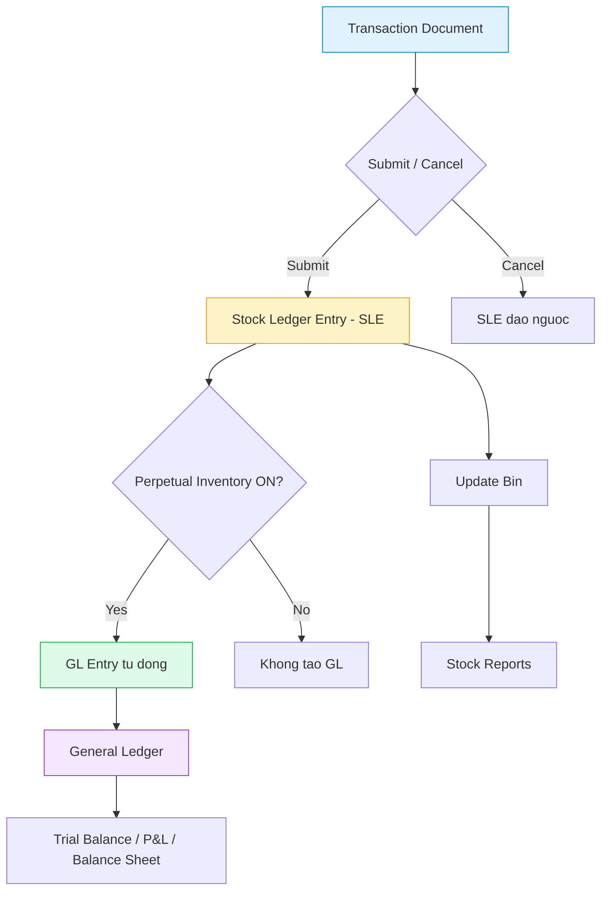

**Chi tiet tung buoc:**

| Buoc | Component | Database Table | Chuc nang |
|------|-----------|---------------|-----------|
| 1 | Transaction | `tabStock Entry`, `tabPurchase Receipt`, `tabDelivery Note` | Nguoi dung tao va submit chung tu |
| 2 | Stock Ledger Entry | `tabStock Ledger Entry` | Ghi nhan: item, warehouse, qty_after_transaction, valuation_rate, stock_value |
| 3 | Bin | `tabBin` | Cap nhat: actual_qty, planned_qty, reserved_qty, ordered_qty, projected_qty |
| 4 | GL Entry | `tabGL Entry` | But toan kep: account, debit, credit, against, voucher_type, voucher_no |

**Quan he giua cac bang:**

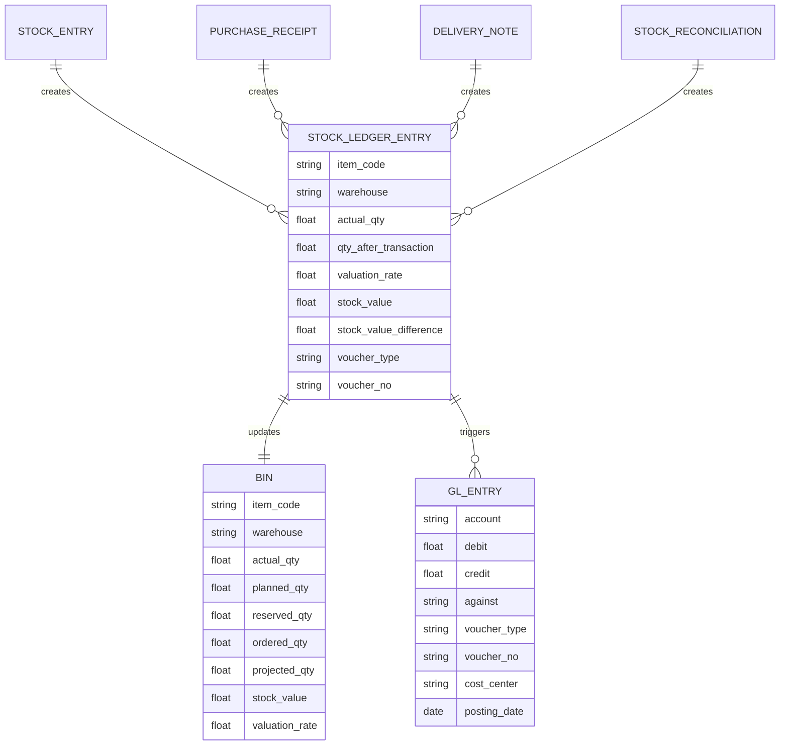

### 1.3. Bat/tat Perpetual Inventory

**Vi tri cau hinh:**

```
Stock Settings → Enable Perpetual Inventory = ✅ (mac dinh ON)
```

**Trong code ERPNext:**

```python
# erpnext/stock/doctype/stock_settings/stock_settings.py
class StockSettings(Document):
    def validate(self):
        # ...
        self.valuation_method = self.valuation_method or "FIFO"
```

**Khi Perpetual Inventory = ON:**
- Moi Stock Entry, Purchase Receipt, Delivery Note, Stock Reconciliation → tao GL Entry
- Gia tri ton kho trong so ke toan (GL) phai **khop** voi gia tri trong Stock Ledger (SLE)
- Default Accounts phai duoc cau hinh day du trong Company DocType

**Khi Perpetual Inventory = OFF:**
- Chi tao SLE, khong tao GL Entry
- Ke toan phai hach toan thu cong bang Journal Entry
- **KHONG KHUYEN NGHI** cho DCNET

> **Luu y:** Sau khi da co giao dich, KHONG DUOC tat Perpetual Inventory. Phai cau hinh truoc khi bat dau nhap lieu.

---

## 2. Bang GL Entry tu dong theo nghiep vu kho

### 2.1. Nhap mua hang (Purchase Receipt)

**ERPNext DocType:** `Purchase Receipt`

**Nguon nghiep vu:** Nha cung cap giao hang → Thu kho kiem nhan → Lap phieu nhap kho

**But toan GL Entry:**

| STT | No (Debit) | Co (Credit) | Dien giai |
|:---:|-----------|------------|-----------|
| 1 | TK 1561 - Gia mua hang hoa | TK 331 - Phai tra cho nguoi ban | Ghi nhan gia tri hang nhap kho |
| 2 | TK 1331 - Thue GTGT duoc khau tru | TK 331 - Phai tra cho nguoi ban | Thue VAT dau vao |

**Vi du cu the:**
- Nhap 10 gay golf TaylorMade, don gia 5.000.000 VND/cay, VAT 10%
- Gia tri hang: 50.000.000 VND
- VAT: 5.000.000 VND
- Tong phai tra NCC: 55.000.000 VND

| No (Debit) | So tien | Co (Credit) | So tien |
|-----------|--------:|------------|--------:|
| 1561 - Gia mua hang hoa | 50.000.000 | 331 - Phai tra NCC | 55.000.000 |
| 1331 - Thue GTGT dau vao | 5.000.000 | | |

**Luong ERPNext:**

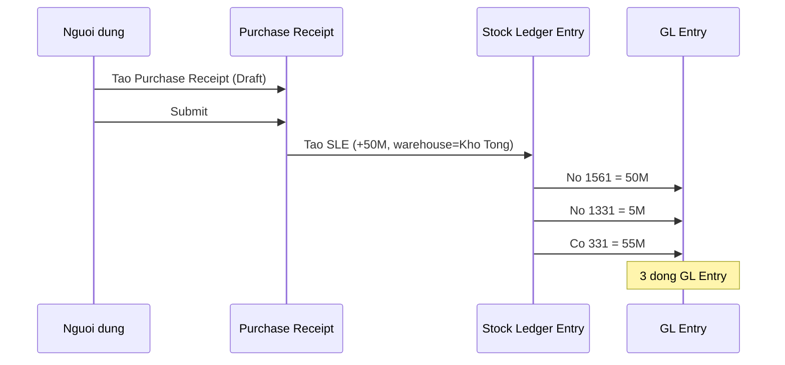

**Ma tai khoan COA v2:**
- `1561` (Gia mua hang hoa) — Account Type: `Stock`, Root Type: `Asset`
- `1331` (Thue GTGT duoc khau tru cua hang hoa, dich vu) — Account Type: `Tax`, Root Type: `Asset`
- `331` (Phai tra cho nguoi ban) — Account Type: `Payable`, Root Type: `Liability`

> **Luu y ERPNext:** Neu Purchase Receipt duoc tao **truoc** Purchase Invoice (chua co hoa don), he thong se dung tai khoan trung gian `151 - Hang mua dang di duong` (Stock Received But Not Billed) thay vi `331`:
>
> | No | Co | Dien giai |
> |---|---|-----------|
> | 1561 | 151 | Hang ve chua co hoa don |
>
> Khi nhan Purchase Invoice sau:
>
> | No | Co | Dien giai |
> |---|---|-----------|
> | 151 | 331 | Khop hoa don voi hang da nhan |
> | 1331 | 331 | VAT dau vao |

### 2.2. Xuat ban hang (Delivery Note + Sales Invoice)

**ERPNext DocType:** `Delivery Note` (xuat kho) + `Sales Invoice` (hoa don ban)

**Nguon nghiep vu:** Khach hang dat mua → Lap don hang → Xuat kho → Lap hoa don

**But toan GL Entry (khi Sales Invoice submit):**

| STT | No (Debit) | Co (Credit) | Dien giai |
|:---:|-----------|------------|-----------|
| 1 | TK 131 - Phai thu cua khach hang | TK 5111 - DT ban hang hoa | Ghi nhan doanh thu |
| 2 | TK 131 - Phai thu cua khach hang | TK 33311 - Thue GTGT dau ra | VAT dau ra |
| 3 | TK 632 - Gia von hang ban | TK 1561 - Gia mua hang hoa | Ket chuyen gia von (COGS) |

**Vi du cu the:**
- Ban 5 gay golf Callaway, gia ban 8.000.000 VND/cay, gia von 5.500.000 VND/cay, VAT 10%
- Doanh thu: 40.000.000 VND
- VAT dau ra: 4.000.000 VND
- Gia von: 27.500.000 VND

| No (Debit) | So tien | Co (Credit) | So tien |
|-----------|--------:|------------|--------:|
| 131 - Phai thu KH | 44.000.000 | 5111 - DT ban HH | 40.000.000 |
| | | 33311 - VAT dau ra | 4.000.000 |
| 632 - Gia von hang ban | 27.500.000 | 1561 - Gia mua HH | 27.500.000 |

**Tach doanh thu buon/le (COA v2):**

DCNET yeu cau tach bao cao doanh thu theo kenh ban:
- `51111` - Doanh thu ban buon (dai ly, B2B)
- `51112` - Doanh thu ban le (cua hang, POS)

Khi tao Sales Invoice, chon Income Account tuong ung:
- Ban buon: Income Account = `51111`
- Ban le: Income Account = `51112`

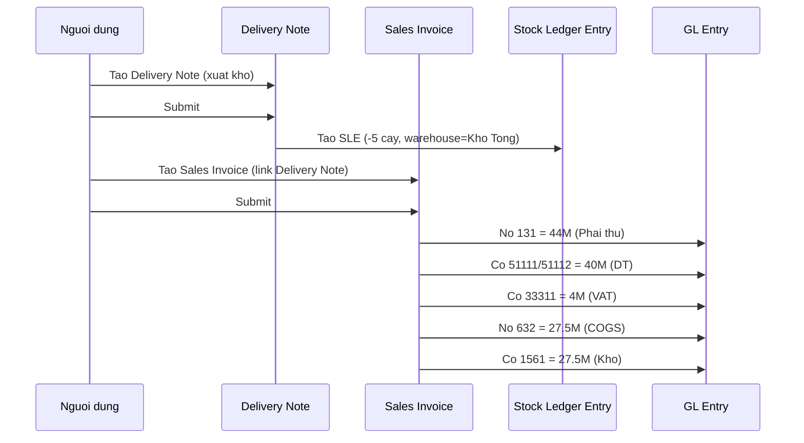

**Ma tai khoan COA v2:**
- `131` (Phai thu cua khach hang) — Account Type: `Receivable`
- `5111` (DT ban hang hoa) — is_group=1, chua `51111` va `51112`
- `51111` (DT ban buon) — Root Type: `Income`
- `51112` (DT ban le) — Root Type: `Income`
- `33311` (Thue GTGT dau ra) — Account Type: `Tax`
- `632` (Gia von hang ban) — Account Type: `Cost of Goods Sold`
- `1561` (Gia mua hang hoa) — Account Type: `Stock`

### 2.3. Chuyen kho noi bo (Stock Entry - Transfer)

**ERPNext DocType:** `Stock Entry` (Stock Entry Type = Material Transfer)

**Nguon nghiep vu:** Chi nhanh can hang → Lap yeu cau → Xuat kho nguon → Nhap kho dich

**But toan GL Entry:**

| STT | No (Debit) | Co (Credit) | Dien giai |
|:---:|-----------|------------|-----------|
| 1 | TK 1561 - Kho dich | TK 1561 - Kho nguon | Dieu chuyen noi bo, khong anh huong P&L |

**Vi du cu the:**
- Chuyen 20 hop bong Titleist tu Kho Tong TL sang Kho Chi nhanh HN
- Gia tri: 20 x 1.200.000 = 24.000.000 VND

| No (Debit) | So tien | Co (Credit) | So tien |
|-----------|--------:|------------|--------:|
| 1561 - Kho Chi nhanh HN | 24.000.000 | 1561 - Kho Tong TL | 24.000.000 |

**Dieu kien:** Moi Warehouse phai duoc **map** voi 1 Account trong Warehouse doctype. Khi 2 warehouse cung map voi TK 1561, GL Entry se ghi **khac nhau theo Cost Center** de phan biet.

**Truong hop dieu chuyen qua kho trung gian (Transit):**

Theo quy trinh DCNET (ERP_SPECIFICATION.md Section 4, Buoc 7):
1. Don vi xuat: Xuat tu Kho nguon → Kho Transit (151)
2. Don vi nhan: Xuat tu Kho Transit → Kho dich

| Buoc | No | Co | Dien giai |
|:----:|---|---|-----------|
| 1 | 151 - Hang mua dang di duong | 1561 - Kho nguon | Xuat ra kho transit |
| 2 | 1561 - Kho dich | 151 - Hang mua dang di duong | Nhan vao kho dich |

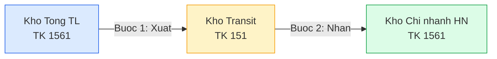

### 2.4. Nhap khau (Purchase Receipt + Landed Cost Voucher)

**ERPNext DocType:** `Purchase Receipt` + `Landed Cost Voucher`

**Nguon nghiep vu:** Nhap khau thiet bi golf tu nuoc ngoai (My, Nhat, Han Quoc...)

**But toan GL Entry (2 giai doan):**

**Giai doan 1: Nhan hang (Purchase Receipt)**

| STT | No (Debit) | Co (Credit) | Dien giai |
|:---:|-----------|------------|-----------|
| 1 | TK 1561 - Gia mua hang hoa (gia FOB) | TK 331 - Phai tra NCC nuoc ngoai | Gia tri hang (quy doi VND) |
| 2 | TK 1331 - Thue GTGT nhap khau | TK 33312 - Thue GTGT hang NK | VAT nhap khau |
| 3 | | TK 3333 - Thue xuat nhap khau | Thue nhap khau |

**Giai doan 2: Phan bo chi phi (Landed Cost Voucher)**

| STT | No (Debit) | Co (Credit) | Dien giai |
|:---:|-----------|------------|-----------|
| 4 | TK 1561 - Gia mua hang hoa (CP phan bo) | TK 331 - Phai tra don vi van chuyen | CP van chuyen quoc te |
| 5 | TK 1561 - Gia mua hang hoa (CP phan bo) | TK 1111/1121 - Tien mat/Ngan hang | CP hai quan, bao hiem |

**Vi du cu the:**
- Nhap 100 gay golf tu My, gia FOB = 100 USD/cay, ty gia 24.500 VND/USD
- Thue nhap khau 5%, VAT nhap khau 10%
- CP van chuyen: 30.000.000 VND, CP bao hiem: 5.000.000 VND

| Khoan muc | So tien (VND) |
|-----------|-------------:|
| Gia FOB (100 x 100 x 24.500) | 245.000.000 |
| Thue nhap khau 5% | 12.250.000 |
| VAT nhap khau 10% x (245M + 12.25M) | 25.725.000 |
| CP van chuyen | 30.000.000 |
| CP bao hiem | 5.000.000 |
| **Tong gia nhap kho** | **292.250.000** |
| (Tru VAT duoc khau tru) | **(266.525.000)** |

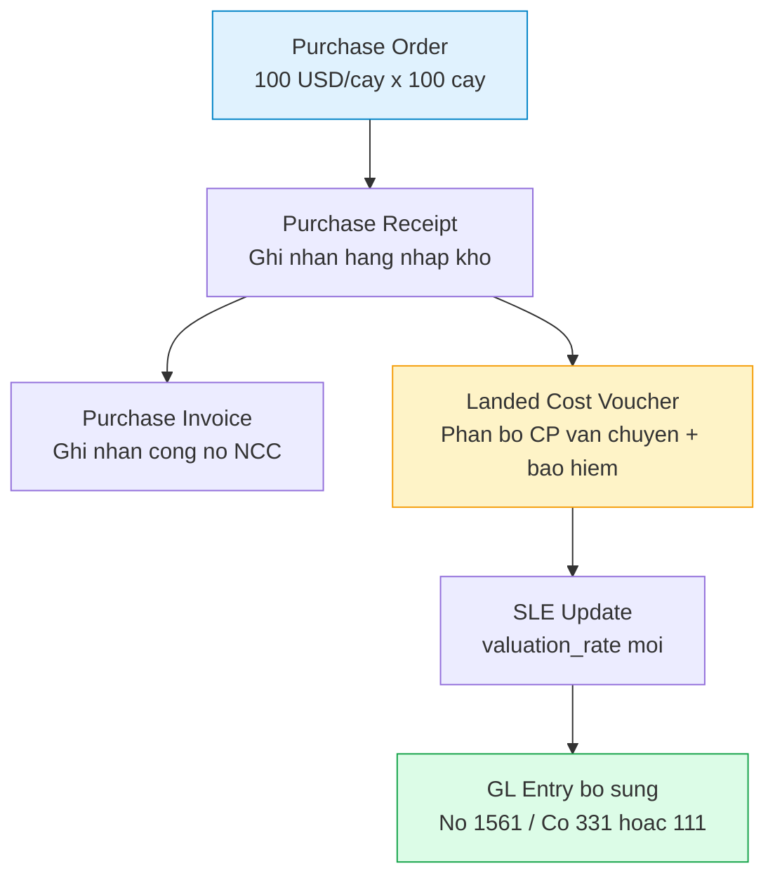

**Ma tai khoan COA v2:**
- `1561` (Gia mua hang hoa) — Account Type: `Stock`
- `1562` (Chi phi thu mua hang hoa) — Account Type: `Expenses Included In Asset Valuation`
- `331` (Phai tra cho nguoi ban) — Account Type: `Payable`
- `3333` (Thue xuat, nhap khau) — Account Type: `Tax`
- `33312` (Thue GTGT hang nhap khau) — Account Type: `Tax`
- `1331` (Thue GTGT duoc khau tru cua hang hoa, dich vu) — Account Type: `Tax`

### 2.5. Kiem ke - Chenh lech thua (Stock Reconciliation)

**ERPNext DocType:** `Stock Reconciliation`

**Nguon nghiep vu:** Kiem ke dinh ky, phat hien so luong thuc te > so luong tren he thong

**But toan GL Entry:**

| STT | No (Debit) | Co (Credit) | Dien giai |
|:---:|-----------|------------|-----------|
| 1 | TK 1561 - Gia mua hang hoa | TK 6329 - Dieu chinh hang ton kho | Ghi tang ton kho (chenh lech thua) |

**Hoac (truong hop ghi vao Thu nhap khac):**

| STT | No (Debit) | Co (Credit) | Dien giai |
|:---:|-----------|------------|-----------|
| 1 | TK 1561 - Gia mua hang hoa | TK 711 - Thu nhap khac | Hang thua kiem ke |

**Vi du cu the:**
- Kiem ke kho: Bong golf Titleist Pro V1 — He thong: 95 hop, thuc te: 100 hop
- Chenh lech thua: +5 hop x 1.200.000 = +6.000.000 VND

| No (Debit) | So tien | Co (Credit) | So tien |
|-----------|--------:|------------|--------:|
| 1561 - Gia mua HH | 6.000.000 | 6329 - Dieu chinh HTK | 6.000.000 |

**Ma tai khoan COA v2:**
- `6329` (Dieu chinh hang ton kho) — Account Type: `Stock Adjustment`, Root Type: `Expense`
- `711` (Thu nhap khac) — Root Type: `Income`

> **Luu y:** TK `6329` la tai khoan **moi them** trong COA v2, bat buoc cho Stock Reconciliation. ERPNext se dung tai khoan co Account Type = `Stock Adjustment` lam default.

### 2.6. Kiem ke - Chenh lech thieu

**ERPNext DocType:** `Stock Reconciliation`

**Nguon nghiep vu:** Kiem ke dinh ky, phat hien so luong thuc te < so luong tren he thong

**But toan GL Entry:**

| STT | No (Debit) | Co (Credit) | Dien giai |
|:---:|-----------|------------|-----------|
| 1 | TK 6329 - Dieu chinh hang ton kho | TK 1561 - Gia mua hang hoa | Ghi giam ton kho (chenh lech thieu) |

**Hoac (truong hop nghiem trong — mat mat, hu hong):**

| STT | No (Debit) | Co (Credit) | Dien giai |
|:---:|-----------|------------|-----------|
| 1 | TK 632 - Gia von hang ban | TK 1561 - Gia mua hang hoa | Tinh vao gia von |

**Vi du cu the:**
- Kiem ke kho: Gang tay golf — He thong: 50 doi, thuc te: 47 doi
- Chenh lech thieu: -3 doi x 800.000 = -2.400.000 VND

| No (Debit) | So tien | Co (Credit) | So tien |
|-----------|--------:|------------|--------:|
| 6329 - Dieu chinh HTK | 2.400.000 | 1561 - Gia mua HH | 2.400.000 |

**Ma tai khoan COA v2:**
- `6329` (Dieu chinh hang ton kho) — Account Type: `Stock Adjustment`
- `632` (Gia von hang ban) — Account Type: `Cost of Goods Sold`

### 2.7. Xuat CCDC (Stock Entry - Material Issue for CCDC)

**ERPNext DocType:** `Stock Entry` (Stock Entry Type = Material Issue)

**Nguon nghiep vu:** Bo phan yeu cau CCDC (cong cu, dung cu) → Kho xuat → Phan bo chi phi nhieu ky

**But toan GL Entry:**

| STT | No (Debit) | Co (Credit) | Dien giai |
|:---:|-----------|------------|-----------|
| 1 | TK 153 - Cong cu, dung cu | TK 1561 - Gia mua hang hoa | Xuat kho vao CCDC |
| 2 | TK 242 - Chi phi tra truoc | TK 153 - Cong cu, dung cu | Chuyen sang phan bo (nhieu ky) |

**Hoac (xuat thang vao chi phi):**

| STT | No (Debit) | Co (Credit) | Dien giai |
|:---:|-----------|------------|-----------|
| 1 | TK 6413 - CP dung cu, do dung (BH) | TK 1561 - Gia mua hang hoa | Xuat CCDC truc tiep vao chi phi ban hang |
| 1' | TK 6423 - CP do dung van phong (QLDN) | TK 1561 - Gia mua hang hoa | Xuat CCDC vao chi phi quan ly |

**Vi du cu the:**
- Xuat 10 bo dung cu fitting (do club) cho chi nhanh, gia 2.000.000/bo, phan bo 12 thang
- Gia tri: 20.000.000 VND

| No (Debit) | So tien | Co (Credit) | So tien |
|-----------|--------:|------------|--------:|
| 242 - CP tra truoc | 20.000.000 | 1561 - Gia mua HH | 20.000.000 |

Hang thang phan bo: 20.000.000 / 12 = 1.666.667 VND
| No (Debit) | So tien | Co (Credit) | So tien |
|-----------|--------:|------------|--------:|
| 6413 - CP dung cu (BH) | 1.666.667 | 242 - CP tra truoc | 1.666.667 |

**Ma tai khoan COA v2:**
- `153` (Cong cu, dung cu) — Root Type: `Asset`
- `1531` (Cong cu, dung cu chi tiet)
- `242` (Chi phi tra truoc) — Root Type: `Asset`
- `6413` (CP dung cu, do dung - ban hang) — Root Type: `Expense`
- `6423` (CP do dung van phong - QLDN) — Root Type: `Expense`

### 2.8. Nhap hang tra lai (Purchase Return)

**ERPNext DocType:** `Purchase Receipt` (is_return = 1) hoac `Purchase Invoice` (is_return = 1)

**Nguon nghiep vu:** Hang nhap bi loi/khong dat chat luong → Tra lai NCC

**But toan GL Entry (dao nguoc Section 2.1):**

| STT | No (Debit) | Co (Credit) | Dien giai |
|:---:|-----------|------------|-----------|
| 1 | TK 331 - Phai tra cho nguoi ban | TK 1561 - Gia mua hang hoa | Giam cong no NCC, giam ton kho |
| 2 | TK 331 - Phai tra cho nguoi ban | TK 1331 - Thue GTGT dau vao | Giam VAT dau vao |

**Vi du cu the:**
- Tra lai 2 gay golf bi loi, gia nhap 5.000.000/cay, VAT 10%

| No (Debit) | So tien | Co (Credit) | So tien |
|-----------|--------:|------------|--------:|
| 331 - Phai tra NCC | 11.000.000 | 1561 - Gia mua HH | 10.000.000 |
| | | 1331 - Thue GTGT | 1.000.000 |

> **ERPNext:** Khi tao Return, he thong tu dong tao SLE am (qty = -2) va GL Entry dao.

### 2.9. Xuat hang bi tra lai (Sales Return)

**ERPNext DocType:** `Sales Invoice` (is_return = 1) hoac `Delivery Note` (is_return = 1)

**Nguon nghiep vu:** Khach hang tra lai hang → Nhap kho lai → Giam doanh thu

**But toan GL Entry (dao nguoc Section 2.2):**

| STT | No (Debit) | Co (Credit) | Dien giai |
|:---:|-----------|------------|-----------|
| 1 | TK 5111 - DT ban hang hoa | TK 131 - Phai thu KH | Giam doanh thu |
| 2 | TK 33311 - Thue GTGT dau ra | TK 131 - Phai thu KH | Giam VAT dau ra |
| 3 | TK 1561 - Gia mua hang hoa | TK 632 - Gia von hang ban | Nhap lai kho (giam COGS) |

**Hoac (dung TK 5212 - Hang ban bi tra lai):**

| STT | No (Debit) | Co (Credit) | Dien giai |
|:---:|-----------|------------|-----------|
| 1 | TK 5212 - Hang ban bi tra lai | TK 131 - Phai thu KH | Ghi nhan hang tra lai (giam tru DT) |
| 2 | TK 33311 - Thue GTGT dau ra | TK 131 - Phai thu KH | Giam VAT dau ra |
| 3 | TK 1561 - Gia mua hang hoa | TK 632 - Gia von hang ban | Nhap lai kho |

**Vi du cu the:**
- KH tra lai 1 gay golf Callaway, gia ban 8.000.000, gia von 5.500.000, VAT 10%

| No (Debit) | So tien | Co (Credit) | So tien |
|-----------|--------:|------------|--------:|
| 5212 - Hang ban tra lai | 8.000.000 | 131 - Phai thu KH | 8.800.000 |
| 33311 - VAT dau ra | 800.000 | | |
| 1561 - Gia mua HH | 5.500.000 | 632 - Gia von HB | 5.500.000 |

**Ma tai khoan COA v2:**
- `5212` (Hang ban bi tra lai) — Root Type: `Income` (contra account)
- `5211` (Chiet khau thuong mai)
- `5213` (Giam gia hang ban)

### 2.10. Trade-in (Dac thu DCNET)

**ERPNext DocType:** Custom DocType (can phat trien) hoac su dung **Stock Entry** + **Sales Invoice** ket hop

**Nguon nghiep vu:** Khach mang san pham golf cu → Dinh gia → Tru vao gia san pham moi → Thanh toan chenh lech

**Nguon tai lieu:** `FEATURE_SPECIFICATION.md` Section 18, `docs/modules/14-trade-in/`

**But toan GL Entry (2 phan):**

**Phan 1: Nhap san pham cu vao kho Trade-in**

| STT | No (Debit) | Co (Credit) | Dien giai |
|:---:|-----------|------------|-----------|
| 1 | TK 1565 - Hang trade-in (hang cu thu lai) | TK 131 - Phai thu KH (giam phai thu) | Ghi nhan gia tri SP cu |

**Phan 2: Xuat san pham moi (but toan binh thuong nhu 2.2)**

| STT | No (Debit) | Co (Credit) | Dien giai |
|:---:|-----------|------------|-----------|
| 2 | TK 131 - Phai thu KH | TK 51111/51112 - DT ban hang | Doanh thu SP moi (gia ban day du) |
| 3 | TK 131 - Phai thu KH | TK 33311 - Thue GTGT dau ra | VAT SP moi |
| 4 | TK 632 - Gia von hang ban | TK 1561 - Gia mua hang hoa | COGS SP moi |

**Phan 3: Thanh toan chenh lech**

| STT | No (Debit) | Co (Credit) | Dien giai |
|:---:|-----------|------------|-----------|
| 5 | TK 1111/1121 - Tien mat/NH | TK 131 - Phai thu KH | KH tra tien chenh lech |

**Vi du cu the:**
- KH mang 1 bo gay cu Titleist → Dinh gia 15.000.000 VND
- KH mua 1 bo gay moi TaylorMade → Gia ban 25.000.000 VND + VAT 10%
- Chenh lech KH phai tra: 25.000.000 + 2.500.000 - 15.000.000 = 12.500.000 VND

| Buoc | No (Debit) | So tien | Co (Credit) | So tien |
|:----:|-----------|--------:|------------|--------:|
| 1 | 1565 - Hang trade-in | 15.000.000 | 131 - Phai thu KH | 15.000.000 |
| 2 | 131 - Phai thu KH | 27.500.000 | 51111 - DT ban buon | 25.000.000 |
| | | | 33311 - VAT dau ra | 2.500.000 |
| 3 | 632 - Gia von HB | 18.000.000 | 1561 - Gia mua HH | 18.000.000 |
| 4 | 1111 - Tien mat | 12.500.000 | 131 - Phai thu KH | 12.500.000 |

**Kiem tra so du 131:** 15.000.000 (Co) + 27.500.000 (No) - 12.500.000 (Co) = 0 ✅

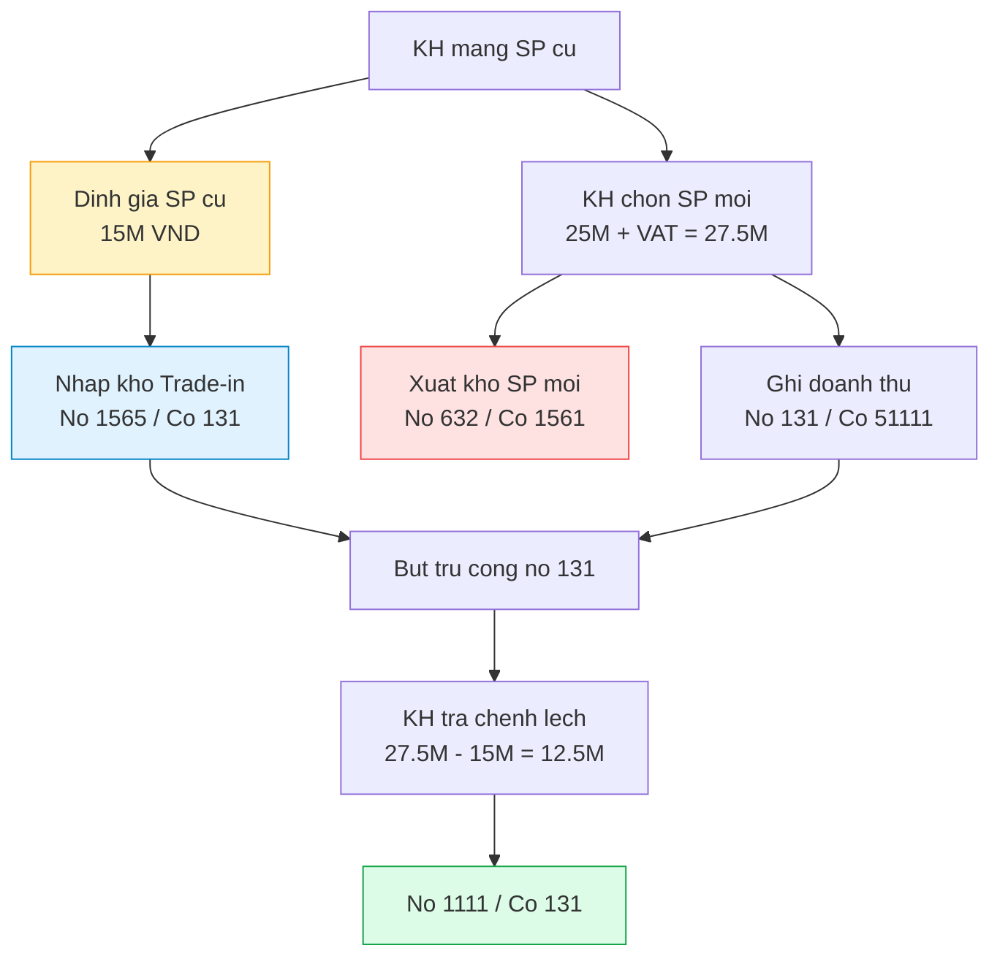

**Ma tai khoan COA v2:**
- `1565` (Hang trade-in - hang cu thu lai) — Account Type: `Stock`, Root Type: `Asset` **(TK moi them trong v2)**
- Can tao **Warehouse** rieng cho hang Trade-in, map voi TK `1565`

> **⚠️ Can clarify voi khach hang:**
> - Truong hop gia SP cu > gia SP moi → KH co duoc nhan tien chenh lech khong?
> - SP cu sau khi thu ve → xu ly the nao? (ban lai, thanh ly, tra hang cho hang?)
> - Co can tao hoa don cho SP cu khong? (anh huong thue)

---

## 3. Mapping Warehouse → Account (COA v2)

### 3.1. Co che Warehouse-Account Mapping

Trong ERPNext, **moi Warehouse** co the duoc **map** voi **mot GL Account**. Khi giao dich kho xay ra tai warehouse do, he thong se dung account tuong ung de tao GL Entry.

**Co che hoat dong (trong code ERPNext):**

```python
# erpnext/stock/utils.py
def get_warehouse_account_map(company):
    """
    Tra ve dict: {warehouse_name: account_name}
    Uu tien:
    1. Warehouse.account (neu co set rieng)
    2. Company.default_inventory_account (fallback)
    """
    accounts = frappe.get_all("Warehouse",
        filters={"company": company, "is_group": 0},
        fields=["name", "account"]
    )
    # ...
```

**Noi cau hinh:**
- **Warehouse DocType** → truong `account` (truong Stock Account)
- **Company DocType** → truong `default_inventory_account` (fallback)

**Quy tac:**
1. Neu Warehouse co set `account` rieng → dung account do
2. Neu khong → dung `Company.default_inventory_account`
3. Account phai co Account Type = `Stock` hoac `Stock Received But Not Billed`
4. Account phai co Root Type = `Asset`

### 3.2. Danh sach Warehouse → Account cho DCNET

#### Thang Long TM

| Warehouse | Account | TK | Mo ta | Ghi chu |
|-----------|---------|:---:|-------|---------|
| Kho Tong TL | Gia mua hang hoa | `1561` | Kho chinh chua hang hoa golf | Default |
| Kho CH Le Van Luong | Gia mua hang hoa | `1561` | Cua hang ban le | Cost Center rieng |
| Kho CH Hai Ba Trung | Gia mua hang hoa | `1561` | Cua hang ban le | Cost Center rieng |
| Kho Ky Gui TL | Hang hoa bat dong san | `1567` | Hang gui di ban (consignment) | Custom |
| Kho Transit TL | Hang mua dang di duong | `151` | Hang dang van chuyen | Transit warehouse |
| Kho Nguyen lieu TL | Nguyen lieu, vat lieu | `152` | NVL (neu co) | It su dung |
| Kho Trade-in TL | Hang trade-in | `1565` | SP cu thu lai tu KH | **Custom (moi)** |
| Kho CCDC TL | Cong cu, dung cu | `1531` | CCDC chua phan bo | |

#### Nhat Minh Sport

| Warehouse | Account | TK | Mo ta | Ghi chu |
|-----------|---------|:---:|-------|---------|
| Kho Tong NM | Gia mua hang hoa | `1561` | Kho chinh chua hang hoa golf | Default |
| Kho CH NM | Gia mua hang hoa | `1561` | Cua hang ban le | Cost Center rieng |
| Kho Ky Gui NM | Hang hoa bat dong san | `1567` | Hang gui di ban | Custom |
| Kho Xuat HD NM | Gia mua hang hoa | `1561` | Hang da xuat hoa don | |
| Kho Transit NM | Hang mua dang di duong | `151` | Hang dang van chuyen | Transit warehouse |
| Kho Trade-in NM | Hang trade-in | `1565` | SP cu thu lai tu KH | **Custom (moi)** |

> **Luu y:** 2 cong ty la 2 site rieng tren ERPNext (2 Company), nen moi Company co bo Warehouse rieng. Tai khoan ke toan (Account) cung duoc tao rieng cho moi Company nhung **theo cung COA v2**.

### 3.3. Default Accounts trong Company DocType

Khi tao Company trong ERPNext, can thiet lap cac Default Account sau (lien quan kho):

| Setting trong Company | Account | TK | Giai thich |
|----------------------|---------|:---:|-----------|
| `default_inventory_account` | Gia mua hang hoa | `1561` | TK mac dinh cho ton kho |
| `stock_received_but_not_billed` | Hang mua dang di duong | `151` | Hang ve chua co hoa don |
| `stock_adjustment_account` | Dieu chinh hang ton kho | `6329` | Chenh lech kiem ke |
| `default_expense_account` | Gia von hang ban | `632` | COGS mac dinh |
| `round_off_account` | Chenh lech lam tron | `4119` | Sai so lam tron |
| `write_off_account` | Dieu chinh hang ton kho | `6329` | Xoa so |
| `exchange_gain_loss_account` | DT hoat dong tai chinh / CP tai chinh | `515` / `6353` | Chenh lech ty gia |

> **QUAN TRONG:** Tat ca cac Default Account tren phai duoc set **TRUOC** khi bat dau nhap lieu. Thieu bat ky account nao se gay loi khi submit giao dich.

---

## 4. Phuong phap tinh gia von (Valuation Methods)

### 4.1. FIFO (First In First Out)

**Nguyen tac:** Hang nhap truoc — xuat truoc. Gia von hang xuat = gia cua lo hang nhap som nhat con ton.

**Cach tinh trong ERPNext:**

```
Nhap lo 1: 10 cay x 5.000.000 = 50.000.000
Nhap lo 2: 10 cay x 5.500.000 = 55.000.000
Xuat 15 cay → COGS = (10 x 5.000.000) + (5 x 5.500.000) = 77.500.000
```

**Uu diem:**
- Don gian, de hieu
- Phan anh dung dong tien (cashflow)
- Gia tri ton kho cuoi ky gan voi gia thi truong hien tai

**Nhuoc diem:**
- Gia von ban hang bien dong khi gia nhap thay doi
- ERPNext luu tru **queue** cac lo nhap → ton bo nho khi co nhieu giao dich

**Khi nao dung:** Hang hoa co han su dung, can xuat hang cu truoc (khong pho bien cho golf equipment)

### 4.2. Moving Average (Trung binh di dong)

**Nguyen tac:** Gia von duoc tinh lai **sau moi lan nhap hang** dua tren binh quan gia quyen.

**Cong thuc:**

```
Gia von trung binh = (Gia tri ton hien tai + Gia tri hang nhap moi) / (SL ton hien tai + SL nhap moi)
```

**Vi du trong ERPNext:**

```
Ton dau:  10 cay x 5.000.000 = 50.000.000  → Gia TB = 5.000.000
Nhap:     10 cay x 5.500.000 = 55.000.000
→ Gia TB moi = (50.000.000 + 55.000.000) / (10 + 10) = 5.250.000/cay

Xuat 15 cay → COGS = 15 x 5.250.000 = 78.750.000
Ton:      5 cay x 5.250.000 = 26.250.000
```

**Uu diem:**
- San bang bien dong gia (smooth)
- Tinh toan nhanh (O(1) cho moi giao dich)
- Phu hop hang hoa dong nhat (golf equipment)

**Nhuoc diem:**
- Gia von khong phan anh chinh xac gia cua lo cu the
- Khi gia bien dong lon, gia von co the chenh lech voi thuc te

**Khi nao dung:** Hang hoa dong nhat, nhap nhieu dot, gia tuong doi on dinh → **PHU HOP DCNET**

### 4.3. Trung binh thang (Monthly Average) - Yeu cau khach

**Nguon:** `ERP_SPECIFICATION.md` — Khach hang yeu cau tinh gia von theo "trung binh thang"

**Nguyen tac:** Gia von duoc tinh lai **1 lan cuoi moi thang**, dua tren tong gia tri nhap va ton dau ky.

**Cong thuc:**

```
Gia von TB thang = (GT ton dau thang + GT nhap trong thang) / (SL ton dau thang + SL nhap trong thang)
```

**Vi du:**

```
Ton dau thang 3:  10 cay x 5.000.000 = 50.000.000
Nhap ngay 05/03:  10 cay x 5.200.000 = 52.000.000
Nhap ngay 15/03:  10 cay x 5.500.000 = 55.000.000
Nhap ngay 25/03:   5 cay x 5.800.000 = 29.000.000

Gia TB thang 3 = (50M + 52M + 55M + 29M) / (10 + 10 + 10 + 5) = 5.314.286/cay

Tat ca giao dich xuat trong thang 3 deu dung gia 5.314.286/cay
```

**Van de:** ERPNext **KHONG HO TRO** trung binh thang. He thong chi co:
- FIFO
- Moving Average

De implement trung binh thang can:
1. Custom script chay cuoi moi thang
2. Tinh lai gia von cho tat ca giao dich xuat trong thang
3. Tao GL Entry dieu chinh chenh lech
4. **Rat phuc tap va de gay loi**

### 4.4. Phan tich xung dot: Moving Average vs Trung binh thang

| Tieu chi | Moving Average | Trung binh thang |
|----------|:--------------:|:----------------:|
| **Thoi diem tinh** | Real-time (moi giao dich) | Cuoi thang (batch) |
| **ERPNext support** | ✅ Native | ❌ Khong ho tro |
| **Do chinh xac** | Chinh xac tai thoi diem giao dich | Chinh xac cuoi thang |
| **Phuc tap trien khai** | Khong can custom | Can custom script phuc tap |
| **Hieu nang** | Tot (O(1) moi giao dich) | Kem (phai tinh lai hang thang) |
| **Phu hop TT200** | ✅ TT200 chap nhan | ✅ TT200 chap nhan |
| **Phu hop ERPNext** | ✅ Thien nhien | ❌ Chong lai ERPNext |
| **BC gia von** | Xem bat ky luc nao | Chi chinh xac cuoi thang |
| **Chenh lech so hoc** | Nho (lien tuc cap nhat) | Co the lon (cuoi thang moi tinh) |
| **Gia von lien do** | Khac nhau (tinh tai thoi diem) | Giong nhau (cung 1 gia TB thang) |

**Diem khac biet chinh:**

```
Moving Average:
  Xuat ngay 05/03: gia von = 5.000.000 (chua nhap them)
  Nhap ngay 05/03: 10 cay x 5.200.000 → gia TB moi = 5.100.000
  Xuat ngay 10/03: gia von = 5.100.000
  Nhap ngay 15/03: 10 cay x 5.500.000 → gia TB moi = 5.300.000
  Xuat ngay 20/03: gia von = 5.300.000

Trung binh thang:
  Xuat ngay 05/03: gia von = 5.314.286 (tinh cuoi thang, ap nguoc lai)
  Xuat ngay 10/03: gia von = 5.314.286 (cung 1 gia)
  Xuat ngay 20/03: gia von = 5.314.286 (cung 1 gia)
```

### 4.5. Giai phap de xuat

#### Phuong an A: Su dung Moving Average (DE XUAT)

**Mo ta:** Su dung truc tiep Moving Average — phuong phap native cua ERPNext.

**Ly do:**
1. **TT200 chap nhan ca hai** — Thong tu 200/2014/TT-BTC cho phep ca trung binh thang va binh quan gia quyen lien hoan (= Moving Average)
2. **Zero custom** — Khong can code them, giam rui ro bug
3. **Real-time** — Luon co gia von chinh xac tai thoi diem, khong can cho cuoi thang
4. **Hieu nang tot** — Khong can chay batch cuoi thang
5. **ERPNext ecosystem** — Tat ca bao cao, dashboard, API deu tuong thich

**Cau hinh:**

```
Stock Settings → Default Valuation Method = Moving Average
```

Hoac thiet lap cho tung Item Group:

```
Item Group → Default Valuation Method = Moving Average
```

**Do lech so hoc:** Thuc te, chenh lech giua Moving Average va trung binh thang **rat nho** (thuong < 1%) khi gia nhap khong bien dong qua lon. Voi hang golf (gia tuong doi on dinh theo thuong hieu/model), chenh lech la **khong dang ke**.

#### Phuong an B: Custom Monthly Average Script

**Mo ta:** Viet custom script chay cuoi moi thang de tinh lai gia von.

**Cac buoc implement:**

1. **Scheduled Job** chay vao ngay 01 hang thang (cho thang truoc)
2. Tinh gia TB thang cho tung Item + Warehouse
3. So sanh voi gia von ERPNext da tinh (Moving Average)
4. Tao **Journal Entry** dieu chinh chenh lech (No 632 / Co 1561 hoac nguoc lai)
5. Luu gia TB thang vao custom field cho bao cao

**Uoc tinh effort:** 3-4 tuan phat trien + 2 tuan test

**Rui ro:**
- Bug khi tinh lai gia von cho hang tram mat hang
- GL Entry dieu chinh gay kho khan khi doi chieu
- Khong tuong thich voi Stock Ledger (SLE van ghi theo Moving Average)
- Can test ky luong truoc khi go-live

**Ket luan:**

> **KHUYEN NGHI: PHUONG AN A (Moving Average)**
>
> Ly do: Giam 3-4 tuan effort, giam rui ro bug, tuong thich 100% voi ERPNext, TT200 chap nhan. Chenh lech so hoc khong dang ke cho nganh hang golf.
>
> **Can xac nhan voi khach hang** truoc khi bat dau code. Giai thich ro: "Moving Average = binh quan gia quyen lien hoan, TT200 chap nhan, chenh lech voi trung binh thang < 1%"

---

## 5. Landed Cost Voucher (Phan bo chi phi nhap khau)

### 5.1. Co che hoat dong

**Landed Cost Voucher (LCV)** la document trong ERPNext cho phep **phan bo cac chi phi bo sung** vao gia tri hang nhap kho sau khi da tao Purchase Receipt.

**Cac loai chi phi phan bo:**
- Chi phi van chuyen quoc te (Freight)
- Bao hiem hang hoa (Insurance)
- Phi hai quan (Customs Duty)
- Chi phi kiem dinh (Inspection)
- Chi phi khac (luu kho, boc xep...)

**Luong xu ly:**

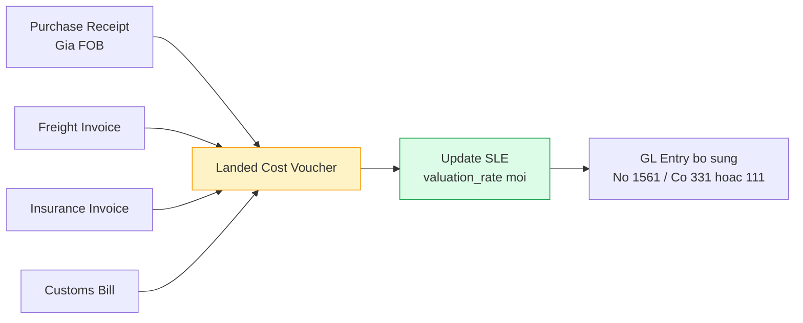

### 5.2. But toan ke toan

**But toan khi submit Landed Cost Voucher:**

| STT | No (Debit) | Co (Credit) | Dien giai |
|:---:|-----------|------------|-----------|
| 1 | TK 1561 - Gia mua hang hoa | TK 1562 - CP thu mua hang hoa | Phan bo CP vao gia von hang (qua TK 1562) |

**Hoac truc tiep:**

| STT | No (Debit) | Co (Credit) | Dien giai |
|:---:|-----------|------------|-----------|
| 1 | TK 1561 - Gia mua hang hoa | TK 331 - Phai tra NCC van chuyen | CP van chuyen (chua thanh toan) |
| 2 | TK 1561 - Gia mua hang hoa | TK 1111/1121 - Tien mat/NH | CP da thanh toan |

**ERPNext cach phan bo:**

LCV phan bo chi phi theo **ty le gia tri** hoac **ty le so luong** cua tung dong hang trong Purchase Receipt:

```
Phan bo theo gia tri:
  Item A: gia tri 60M / tong 100M = 60% → nhan 60% chi phi
  Item B: gia tri 40M / tong 100M = 40% → nhan 40% chi phi

Phan bo theo so luong:
  Item A: 30 cai / tong 50 cai = 60% → nhan 60% chi phi
  Item B: 20 cai / tong 50 cai = 40% → nhan 40% chi phi
```

### 5.3. Anh huong den gia von

Khi submit LCV, ERPNext se:

1. **Cap nhat `valuation_rate`** trong Stock Ledger Entry cua Purchase Receipt goc
2. **Tinh lai `stock_value`** cho tung item
3. **Tao GL Entry** bo sung (No 1561 them gia tri phan bo)
4. **Anh huong den COGS** — tat ca cac giao dich xuat SAU do se dung gia von moi (neu Moving Average)

**Vi du:**

```
Ban dau (Purchase Receipt):
  100 gay golf x 2.450.000 (gia FOB quy VND) = 245.000.000
  → valuation_rate = 2.450.000/cay

Sau LCV (them CP van chuyen 30M + bao hiem 5M = 35M):
  valuation_rate moi = (245.000.000 + 35.000.000) / 100 = 2.800.000/cay

Chenh lech: +350.000/cay → anh huong COGS khi xuat ban
```

### 5.4. Luong nghiep vu nhap khau DCNET

DCNET nhap khau **7 nhom san pham golf** tu nuoc ngoai:

| # | Nhom SP | Xuat xu chinh | Ghi chu |
|---|---------|--------------|---------|
| 1 | Clubs (Gay golf) | My, Nhat | Gia tri cao nhat |
| 2 | Balls (Bong golf) | My, Han Quoc | Nhap so luong lon |
| 3 | Accessories (Phu kien) | Da quoc gia | Da dang |
| 4 | Apparel (Quan ao) | Viet Nam, TQ, Han | Co the nhap khau |
| 5 | Shoes (Giay golf) | Han Quoc, My | |
| 6 | Bags (Tui golf) | Da quoc gia | |
| 7 | Equipment (Thiet bi) | My, Nhat | May fitting, simulator |

**Luong nghiep vu day du:**

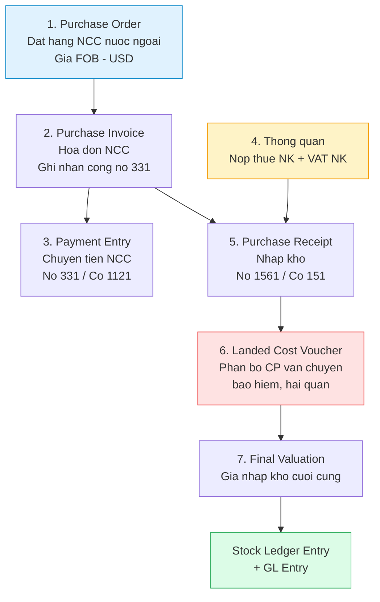

**Tai khoan lien quan:**
- `1561` (Gia mua hang hoa) — Stock
- `1562` (CP thu mua hang hoa) — Expenses Included In Asset Valuation
- `331` (Phai tra NCC) — Payable
- `3333` (Thue xuat nhap khau) — Tax
- `33312` (Thue GTGT hang nhap khau) — Tax
- `1331` (Thue GTGT duoc khau tru) — Tax
- `151` (Hang mua dang di duong) — Stock Received But Not Billed

---

## 6. Stock Reconciliation → GL Entry

### 6.1. Opening Stock (Ton kho dau ky)

**ERPNext DocType:** `Stock Reconciliation` (Purpose = Opening Stock)

**Nguon nghiep vu:** Chuyen doi tu BRAVO sang ERPNext — nhap so du ton kho dau ky

**Buoc thuc hien:**
1. Xuat du lieu ton kho tu BRAVO (ma hang, kho, so luong, gia tri)
2. Tao Stock Reconciliation voi Purpose = Opening Stock
3. Nhap tung dong: Item Code, Warehouse, Quantity, Valuation Rate

**But toan GL Entry:**

| STT | No (Debit) | Co (Credit) | Dien giai |
|:---:|-----------|------------|-----------|
| 1 | TK 1561 - Gia mua hang hoa | TK 4119 - Chenh lech lam tron | Nhap ton kho dau ky |

> **Luu y:** ERPNext su dung Temporary Opening account hoac Round Off account cho Opening Stock. Can cau hinh dung truoc khi nhap.
>
> Trong thuc te, Opening Stock thong qua **Journal Entry** voi:
> - No: 1561 (ton kho)
> - Co: 4211 (Loi nhuan chua phan phoi nam truoc) — de can bang Balance Sheet

**Du lieu migration tu BRAVO:**

| Truong BRAVO | Truong ERPNext | Ghi chu |
|-------------|---------------|---------|
| Ma vat tu | Item Code | Phai tao Item truoc |
| Ten kho | Warehouse | Phai tao Warehouse truoc |
| So luong ton | Qty | |
| Don gia | Valuation Rate | Gia von binh quan tu BRAVO |
| Thanh tien | Valuation Amount | = Qty x Valuation Rate |
| So lo | Batch No | Neu co tracking batch |
| Serial No | Serial No | Neu co tracking serial |

### 6.2. Stock Reconciliation (Kiem ke)

**ERPNext DocType:** `Stock Reconciliation` (Purpose = Stock Reconciliation)

**Nguon nghiep vu:** Kiem ke dinh ky (hang thang/quy) hoac dot xuat

**Cach hoat dong:**
1. In Stock Balance Report tu ERPNext → mang di kiem ke thuc te
2. Ghi nhan so luong thuc te vao Stock Reconciliation
3. He thong tu dong tinh chenh lech va tao SLE + GL Entry

**But toan GL Entry (tu dong):**

| Truong hop | No (Debit) | Co (Credit) |
|-----------|-----------|------------|
| Thua (thuc te > he thong) | 1561 | 6329 |
| Thieu (thuc te < he thong) | 6329 | 1561 |

### 6.3. But toan kiem ke chi tiet

**Truong hop 1: Hang thua**

```
He thong: 100 cai | Thuc te: 105 cai | Chenh lech: +5 cai
Gia von: 500.000/cai | Gia tri chenh lech: +2.500.000

No 1561 (Gia mua hang hoa)    2.500.000
    Co 6329 (Dieu chinh HTK)      2.500.000
```

**Truong hop 2: Hang thieu**

```
He thong: 100 cai | Thuc te: 97 cai | Chenh lech: -3 cai
Gia von: 500.000/cai | Gia tri chenh lech: -1.500.000

No 6329 (Dieu chinh HTK)      1.500.000
    Co 1561 (Gia mua hang hoa)    1.500.000
```

**Truong hop 3: Gia tri thay doi (so luong khong doi nhung gia tri khac)**

```
He thong: 100 cai x 500.000 = 50.000.000
Thuc te:  100 cai x 480.000 = 48.000.000
Chenh lech: -2.000.000

No 6329 (Dieu chinh HTK)      2.000.000
    Co 1561 (Gia mua hang hoa)    2.000.000
```

### 6.4. Custom: Freeze + Approval Workflow

**Van de:** ERPNext **khong co** co che "dong bang kho" (warehouse freeze) trong qua trinh kiem ke. Nghia la trong khi dang kiem ke, nguoi khac van co the nhap/xuat → gay sai lech.

**Giai phap custom cho DCNET:**

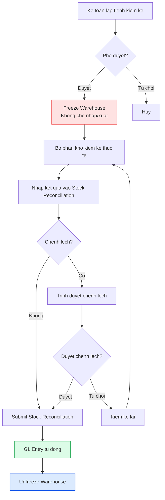

**Implementation:**

1. **Custom DocType: Stock Count Order** (Lenh kiem ke)
   - Tao boi ke toan
   - Workflow: Draft → Pending Approval → Approved → In Progress → Completed
   - Khi Approved → set `Warehouse.disabled = 1` (freeze)

2. **Override Stock Entry/Delivery Note validation:**
   - Kiem tra `Warehouse.disabled` truoc khi cho submit
   - Hien thong bao: "Kho dang kiem ke, khong the nhap/xuat"

3. **Approval cho chenh lech:**
   - Neu chenh lech > threshold (VD: 5.000.000 VND) → can approval cua Giam doc
   - Neu chenh lech nho → Thu kho tu duyet

> **Effort estimate:** 2-3 tuan custom development

---

## 7. Multi-currency trong giao dich kho

### 7.1. Mua hang ngoai te

DCNET nhap khau hang golf tu nuoc ngoai, thanh toan bang **USD**. Tuy nhien, ton kho **luon duoc ghi nhan bang VND** (base currency).

**Luong xu ly:**

```
1. Purchase Order: 100 USD/cay x 100 cay = 10.000 USD
2. Ty gia ngay nhap: 24.500 VND/USD
3. Purchase Receipt: Gia nhap kho = 100 x 24.500 = 2.450.000 VND/cay
4. Stock Ledger Entry: valuation_rate = 2.450.000 VND (luon VND)
5. GL Entry: No 1561 = 245.000.000 VND, Co 331 = 245.000.000 VND
```

**Quan trong:** Account trong ERPNext **phai dung base currency (VND)**. Da xu ly trong COA v2:
- TK 1112 (Ngoai te - Tien mat) → da sua Currency thanh **VND** (truoc la USD)
- TK 1122 (Ngoai te - TGNH) → da sua Currency thanh **VND**
- TK 1132 (Ngoai te - Tien dang chuyen) → da sua Currency thanh **VND**

### 7.2. Chenh lech ty gia

Chenh lech ty gia phat sinh khi:
1. **Ty gia ngay nhap hang** ≠ **ty gia ngay thanh toan**
2. **Ty gia cuoi ky** khi danh gia lai cac khoan muc tien te

**But toan chenh lech ty gia:**

| Truong hop | No (Debit) | Co (Credit) | Dien giai |
|-----------|-----------|------------|-----------|
| Lai ty gia (ty gia giam) | 331 | 515 | DT hoat dong tai chinh |
| Lo ty gia (ty gia tang) | 6353 | 331 | CP tai chinh |

**Vi du:**
```
Ngay nhap hang 01/03: 10.000 USD x 24.500 = 245.000.000 VND
Ngay thanh toan 15/03: 10.000 USD x 24.800 = 248.000.000 VND
Chenh lech lo: 3.000.000 VND

No 331 (Phai tra NCC)           245.000.000
No 6353 (Lo CL ty gia)           3.000.000
    Co 1121 (TGNH)                  248.000.000
```

**Ma tai khoan COA v2:**
- `515` (DT hoat dong tai chinh) — Root Type: `Income`
- `6353` (Lo chenh lech ty gia) — Root Type: `Expense` **(TK moi them trong v2)**
- `4131` (CL ty gia do danh gia lai cac khoan muc tien te co goc ngoai te)

### 7.3. Luu y COA

1. **Tat ca Account phai la VND** — ERPNext quan ly multi-currency tai **cap giao dich** (Payment Entry, Journal Entry), khong phai cap Account
2. **TK 1112, 1122, 1132** da duoc sua ve VND trong COA v2 (truoc la USD — SAI)
3. **Ty gia** duoc quan ly trong `Currency Exchange` doctype cua ERPNext
4. **Chenh lech ty gia cuoi ky** duoc xu ly bang `Exchange Rate Revaluation` doctype
5. ERPNext tu dong tinh chenh lech khi:
   - Payment Entry co ty gia khac ty gia cua Invoice
   - Chay Exchange Rate Revaluation cuoi ky

---

## 8. Default Accounts Setup trong Company DocType

### 8.1. Danh sach Default Accounts can thiet

**QUAN TRONG:** Day la cac cau hinh **BAT BUOC** phai thiet lap cho moi Company truoc khi bat dau nhap lieu. Thieu bat ky account nao se gay loi khi submit giao dich.

| # | Setting trong Company | Account | TK | Root Type | Mo ta |
|---|----------------------|---------|:---:|-----------|-------|
| 1 | `default_inventory_account` | Gia mua hang hoa | `1561` | Asset | TK mac dinh cho ton kho |
| 2 | `stock_received_but_not_billed` | Hang mua dang di duong | `151` | Asset | Hang ve chua co hoa don |
| 3 | `stock_adjustment_account` | Dieu chinh hang ton kho | `6329` | Expense | Chenh lech kiem ke |
| 4 | `default_expense_account` | Gia von hang ban | `632` | Expense | COGS mac dinh |
| 5 | `expenses_included_in_asset_valuation` | CP thu mua hang hoa | `1562` | Asset | CP cong vao gia von nhap |
| 6 | `round_off_account` | Chenh lech lam tron | `4119` | Equity | Sai so lam tron |
| 7 | `write_off_account` | Dieu chinh hang ton kho | `6329` | Expense | Xoa so nho |
| 8 | `default_receivable_account` | Phai thu cua khach hang | `131` | Asset | Cong no phai thu |
| 9 | `default_payable_account` | Phai tra cho nguoi ban | `331` | Liability | Cong no phai tra |
| 10 | `default_income_account` | DT ban buon | `51111` | Income | Doanh thu mac dinh |
| 11 | `cost_of_goods_sold_account` | Gia von hang ban | `632` | Expense | COGS |
| 12 | `round_off_cost_center` | Main - TM/NM | — | — | Cost Center cho lam tron |
| 13 | `exchange_gain_loss_account` | DT HDTC / CP TC | `515`/`6353` | Income/Expense | Chenh lech ty gia |
| 14 | `accumulated_depreciation_account` | Hao mon TSCD huu hinh | `2141` | Asset | Khau hao luy ke |
| 15 | `depreciation_expense_account` | CP khau hao TSCD (QLDN) | `6424` | Expense | Chi phi khau hao |

### 8.2. Warehouse Default Account Setup

Moi Warehouse can duoc cau hinh voi Account tuong ung:

**Buoc thuc hien:**

```
Stock > Warehouse > [Ten kho] > Account Settings > Account = [TK]
```

**Bang cau hinh:**

| Warehouse | Account | TK | Account Type |
|-----------|---------|:---:|:------------:|
| Kho Tong | Gia mua hang hoa | `1561` | Stock |
| Kho Chi nhanh | Gia mua hang hoa | `1561` | Stock |
| Kho Transit | Hang mua dang di duong | `151` | Stock Received But Not Billed |
| Kho Nguyen lieu | Nguyen lieu, vat lieu | `152` | Stock |
| Kho Trade-in | Hang trade-in (hang cu thu lai) | `1565` | Stock |
| Kho Ky Gui | Hang hoa bat dong san | `1567` | — |
| Kho Thanh pham | Thanh pham nhap kho | `1551` | Stock |

> **Luu y:**
> - Neu Warehouse khong set Account → he thong dung `default_inventory_account` (1561)
> - Kho Transit **nen** map voi `151` de tach biet hang dang van chuyen
> - Kho Trade-in **bat buoc** map voi `1565` de theo doi rieng hang cu

### 8.3. Stock Settings

| Setting | Gia tri khuyen nghi | Ghi chu |
|---------|:-------------------:|---------|
| `default_valuation_method` | Moving Average | Xem Section 4.5 |
| `allow_negative_stock` | No | Khong cho phep ton am |
| `auto_insert_price_list_rate_if_missing` | Yes | Tu dong cap nhat gia |
| `valuation_method` | Moving Average | Toan cong ty |
| `stock_frozen_upto` | (set khi kiem ke) | Dong bang kho |
| `over_delivery_receipt_allowance` | 0 | Khong cho nhan vuot |
| `show_barcode_field` | Yes | Hien thi truong barcode |
| `auto_indent` | Yes | Tu dong tao Material Request |

---

## 9. Bao cao ke toan lien quan kho

### 9.1. ERPNext Native Reports

ERPNext cung cap san cac bao cao sau (KHONG can custom):

| # | Ten bao cao | DocType/Report | Du lieu nguon | Ung dung |
|---|------------|---------------|--------------|---------|
| 1 | **Stock Balance** | Stock Balance | Bin / SLE | Ton kho theo warehouse + item |
| 2 | **Stock Ledger** | Stock Ledger | SLE | Chi tiet moi giao dich kho |
| 3 | **Stock Value** | Stock Projected Qty | SLE + Bin | Gia tri ton kho |
| 4 | **Stock Ageing** | Stock Ageing | SLE | Tuoi ton kho (ngay nhap) |
| 5 | **COGS by Item Group** | Gross Profit | GL Entry | Gia von theo nhom SP |
| 6 | **Batch-Wise Balance** | Batch-Wise Balance History | SLE | Ton theo lo |
| 7 | **Warehouse-Wise Stock** | Stock Balance | Bin | Ton theo kho |
| 8 | **Item-Wise Price List** | Item Price | Item Price | Bang gia theo item |
| 9 | **Purchase Register** | Purchase Register | PI + GL | So mua hang |
| 10 | **Sales Register** | Sales Register | SI + GL | So ban hang |

**Doi chieu GL → Stock:**

ERPNext co san **Stock and Account Value Comparison** report de doi chieu gia tri ton kho giua SLE va GL. Day la cong cu quan trong de phat hien sai lech.

### 9.2. Custom Reports can lam

DCNET yeu cau cac bao cao **theo format VN (TT200)** ma ERPNext khong co san:

| # | Ten bao cao | ID | Mo ta | Uu tien |
|---|------------|-----|------|:-------:|
| 1 | **BC Nhap xuat ton** | ERP-WH-021 | Bang ke nhap/xuat/ton theo thang, theo TT200 format | Critical |
| 2 | **BC Gia von hang ban chi tiet** | ERP-WH-025 | Chi tiet COGS theo item, lo, kho | High |
| 3 | **BC Gia tri ton kho theo kho** | ERP-WH-019 | Tong gia tri theo tung warehouse | High |
| 4 | **BC Doi chieu SLE vs GL** | Custom | So sanh gia tri ton kho giua SLE va GL | Critical |
| 5 | **BC Ton kho theo vi tri** | ERP-WH-024 | Theo custom Bin Location (can custom) | Medium |
| 6 | **BC Ton kho theo Serial** | ERP-WH-023 | Trang thai tung serial number | High |
| 7 | **BC Bien dong gia von** | Custom | Lich su thay doi valuation_rate theo thoi gian | High |

**Chi tiet BC Nhap xuat ton (Critical):**

Theo format TT200, bao cao can cac cot:

```
| Ma hang | Ten hang | DVT | Ton dau ky (SL/GT) | Nhap trong ky (SL/GT) | Xuat trong ky (SL/GT) | Ton cuoi ky (SL/GT) |
```

Cach implement:
1. Tao Script Report (Python + JS)
2. Query tu `tabStock Ledger Entry` group by item_code, warehouse
3. Tinh ton dau ky = SLE truoc ky bao cao
4. Nhap trong ky = SUM(actual_qty > 0) trong ky
5. Xuat trong ky = SUM(actual_qty < 0) trong ky
6. Ton cuoi ky = Ton dau + Nhap - Xuat

### 9.3. Reconciliation: Stock Value vs GL Balance

**Muc dich:** Dam bao **gia tri ton kho** trong Stock Ledger (SLE) **khop** voi **so du tai khoan kho** trong General Ledger (GL Entry).

**Tai sao can doi chieu?**

Trong ly thuyet, Perpetual Inventory dam bao SLE va GL luon dong bo. Nhung trong thuc te co the xay ra sai lech do:
- Bug trong code (hiem nhung co the)
- Manual Journal Entry sai (ghi truc tiep vao TK 1561)
- Stock Reconciliation adjustment
- Landed Cost Voucher sau khi da co xuat hang
- Cancel va amend document

**Cach doi chieu:**

```sql
-- Gia tri ton kho tu SLE (dung ERPNext API)
SELECT warehouse, SUM(stock_value_difference) as stock_value
FROM `tabStock Ledger Entry`
WHERE is_cancelled = 0
GROUP BY warehouse

-- So du GL tu GL Entry
SELECT account, SUM(debit) - SUM(credit) as balance
FROM `tabGL Entry`
WHERE account IN ('1561', '1565', '152', '151')
  AND is_cancelled = 0
GROUP BY account
```

**Ket qua mong doi:** `stock_value (SLE)` = `balance (GL)` cho moi cap warehouse/account

**Khi phat hien chenh lech:**
1. Chay `Stock and Account Value Comparison` report
2. Tim giao dich gay chenh lech (thuong la Journal Entry thu cong)
3. Tao Journal Entry dieu chinh de can bang
4. **Bao cho ke toan truong** truoc khi dieu chinh

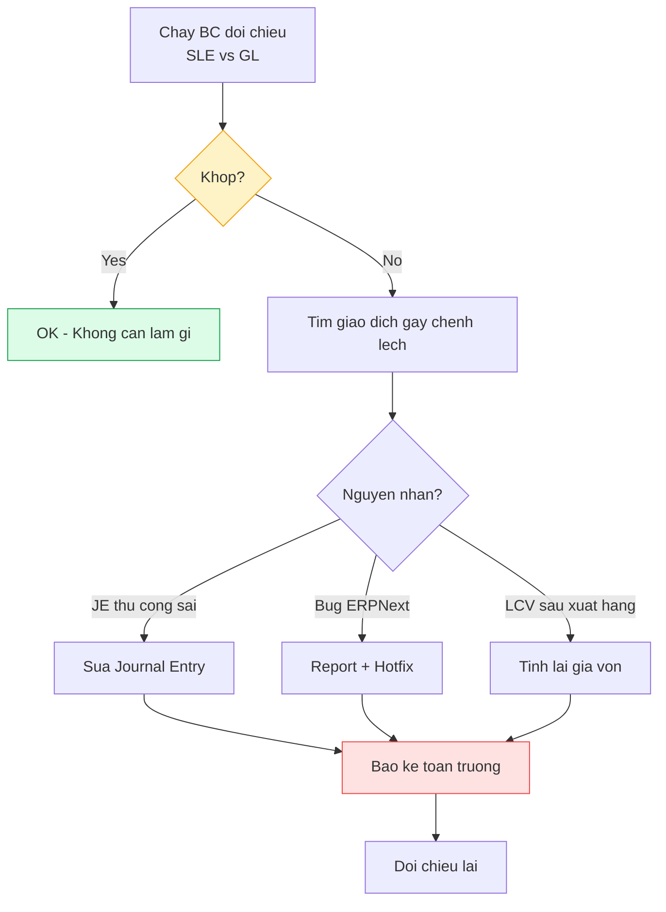

---

## 10. Van de can clarify voi khach hang

| # | Cau hoi | Anh huong | Do uu tien | Ghi chu |
|---|---------|-----------|:----------:|---------|
| 1 | **Phuong phap gia von: Moving Average hay Trung binh thang?** | Valuation method config, co the can 3-4 tuan custom | **Critical** | Khuyen nghi Moving Average (xem Section 4.5) |
| 2 | **Hang ky gui dung TK 1567 hay tao TK moi?** | Warehouse-Account mapping, COA update | High | 1567 = Hang hoa bat dong san (ten khong dung, nhung TT200 khong co TK rieng cho ky gui) |
| 3 | **Stock Adjustment dung TK 6329 hay 632?** | Default Accounts config | High | Khuyen nghi 6329 (tach biet voi COGS binh thuong) |
| 4 | **Trade-in TK 1565 tach rieng?** | Warehouse mapping, bao cao | High | Da tao trong COA v2, can confirm |
| 5 | **Kiem ke: Freeze can approval tu ai?** | Custom workflow | Medium | De xuat: Thu kho duyet chenh lech nho, GD duyet chenh lech lon |
| 6 | **Tan suat kiem ke?** | Scheduled job, warehouse freeze | Medium | Hang thang? Hang quy? Dot xuat? |
| 7 | **Co cho phep ton am (negative stock)?** | Stock Settings | High | Khuyen nghi: KHONG. Nhung can confirm |
| 8 | **Bao nhieu kho? Ten cu the?** | Warehouse setup | Critical | Can danh sach cu the tu khach |
| 9 | **Kho nao cho phep xuat truc tiep (khong can PO)?** | Workflow | Medium | VD: Kho CCDC co the xuat thang |
| 10 | **Transit warehouse: 1 kho chung hay moi tuyen 1 kho?** | Warehouse hierarchy | Medium | Khuyen nghi: 1 kho Transit chung |
| 11 | **Hang trade-in sau khi thu ve xu ly the nao?** | Workflow, bao cao | High | Ban lai? Thanh ly? Tra hang cho hang? |
| 12 | **Threshold chenh lech kiem ke can duyet GD?** | Custom workflow | Medium | VD: > 5.000.000 VND can GD duyet |
| 13 | **BC nhap xuat ton: Theo format BRAVO cu hay TT200 moi?** | Report development | High | Nen theo TT200 de chuan |

---

## Tong hop but toan GL Entry theo nghiep vu

**Bang tham chieu nhanh** — tat ca but toan tu dong khi Perpetual Inventory = ON:

| # | Nghiep vu | ERPNext DocType | No (Debit) | Co (Credit) | Ghi chu |
|---|-----------|----------------|-----------|------------|---------|
| 1 | Nhap mua hang | Purchase Receipt | 1561, 1331 | 331 (hoac 151) | Section 2.1 |
| 2 | Xuat ban hang | Sales Invoice | 131, 632 | 5111x, 33311, 1561 | Section 2.2 |
| 3 | Chuyen kho | Stock Entry (Transfer) | 1561-dich | 1561-nguon | Section 2.3 |
| 4 | Chuyen qua transit | Stock Entry (Transfer) | 151 / 1561 | 1561 / 151 | Section 2.3 |
| 5 | Nhap khau | PR + LCV | 1561, 1331 | 331, 3333, 33312 | Section 2.4 |
| 6 | Kiem ke thua | Stock Reconciliation | 1561 | 6329 | Section 2.5 |
| 7 | Kiem ke thieu | Stock Reconciliation | 6329 | 1561 | Section 2.6 |
| 8 | Xuat CCDC | Stock Entry (Issue) | 153/242/641x | 1561 | Section 2.7 |
| 9 | Tra hang NCC | Purchase Return | 331 | 1561, 1331 | Section 2.8 |
| 10 | Hang bi tra lai | Sales Return | 5212, 33311, 1561 | 131, 632 | Section 2.9 |
| 11 | Trade-in nhap | Custom | 1565 | 131 | Section 2.10 |
| 12 | Trade-in xuat | Sales Invoice | 131, 632 | 5111x, 33311, 1561 | Section 2.10 |
| 13 | Thu tien KH | Payment Entry | 1111/1121 | 131 | Lien quan |
| 14 | Chi tien NCC | Payment Entry | 331 | 1111/1121 | Lien quan |
| 15 | Khau hao TSCD | Journal Entry | 6424 | 2141 | Lien quan |
| 16 | CL ty gia (lai) | Payment Entry | 331 | 515 | Section 7.2 |
| 17 | CL ty gia (lo) | Payment Entry | 6353 | 331 | Section 7.2 |

---

## Tham khao

### Tai lieu noi bo

| Tai lieu | Duong dan |
|----------|-----------|
| Phan tich COA chi tiet | `docs/accounting/COA_ANALYSIS.md` |
| COA v2 (254 TK) | `docs/accounting/ChartOfAccountsImporter_v2.csv` |
| ERP Specification (Section 4 - Kho) | `docs/feature/ERP_SPECIFICATION.md` |
| Feature Specification (Section 18 - Trade-in) | `docs/feature/FEATURE_SPECIFICATION.md` |
| Import Process Specification | `docs/feature/IMPORT_PROCESS_SPECIFICATION.md` |
| Module Gap Analysis | `docs/erpnext-flows/MODULE_GAP_ANALYSIS.md` |
| Warehouse Workflow | `docs/modules/07-kho-hang/analysis/WAREHOUSE_WORKFLOW.md` |
| Warehouse Spec | `docs/modules/07-kho-hang/technical-spec/WAREHOUSE_SPEC.md` |
| SRS Thang Long TM | `docs/contract/DCNET_SRS_TM.md` (Section 3.7, 3.22-3.32) |
| SRS Nhat Minh Sport | `docs/contract/DCNET_SRS_NM.md` (Section 3.7, 3.22-3.32) |

### ERPNext Documentation

| Chu de | Tham khao |
|--------|-----------|
| Perpetual Inventory | ERPNext Docs > Stock > Perpetual Inventory |
| Stock Ledger Entry | ERPNext source: `erpnext/stock/doctype/stock_ledger_entry/` |
| GL Entry from Stock | ERPNext source: `erpnext/stock/stock_ledger.py` |
| Landed Cost Voucher | ERPNext Docs > Stock > Landed Cost Voucher |
| Stock Reconciliation | ERPNext Docs > Stock > Stock Reconciliation |
| Warehouse Account Map | ERPNext source: `erpnext/stock/utils.py` → `get_warehouse_account_map()` |
| Valuation Method | ERPNext Docs > Stock > Stock Settings |

### Luat va chuan ke toan

| Van ban | Noi dung lien quan |
|---------|-------------------|
| Thong tu 200/2014/TT-BTC | He thong tai khoan ke toan doanh nghiep |
| Chuan muc ke toan VN so 02 (VAS 02) | Hang ton kho — phuong phap tinh gia |
| Chuan muc ke toan VN so 10 (VAS 10) | Anh huong cua thay doi ty gia hoi doai |

---

## Nguoi thuc hien

- **Phan tich:** Claude Code (AI)
- **Review:** (cho review)
- **Ngay tao:** 16/02/2026
- **Ngay cap nhat:** 16/02/2026
- **Trang thai:** Draft — Can review boi ke toan truong va team dev
