# Kho ↔ Tat ca Module: Moi lien he chi tiet (Stock - Module Connections)

> **Module:** 07 - Kho hang | DCNET Flow
> **Phien ban:** 1.0 | **Ngay:** 16/02/2026
> **Cong ty:** Thang Long TM + Nhat Minh Sport (2 site rieng, code chung)
> **Nguon:** ERP_SPECIFICATION.md Section 4, FEATURE_SPECIFICATION.md Section 8/18, IMPORT_PROCESS_SPECIFICATION.md
> **Tham chieu:** COA_ANALYSIS.md, WAREHOUSE_WORKFLOW.md, MODULE_GAP_ANALYSIS.md

---

## Muc luc

1. [Tong quan kien truc ket noi](#1-tong-quan-kien-truc-ket-noi)
2. [Kho ↔ Buying (Mua hang)](#2-kho--buying-mua-hang)
3. [Kho ↔ Selling (Ban hang)](#3-kho--selling-ban-hang)
4. [Kho ↔ Accounting (Ke toan)](#4-kho--accounting-ke-toan)
5. [Kho ↔ Trade-in (Dac thu DCNET)](#5-kho--trade-in-dac-thu-dcnet)
6. [Kho ↔ Consignment (Ky gui) - Dac thu DCNET](#6-kho--consignment-ky-gui---dac-thu-dcnet)
7. [Kho ↔ Import Process (Nhap khau)](#7-kho--import-process-nhap-khau)
8. [Kho ↔ CRM/Customer](#8-kho--crmcustomer)
9. [Kho ↔ Website (Dong bo ton kho)](#9-kho--website-dong-bo-ton-kho)
10. [Batch & Serial Lifecycle Across Modules](#10-batch--serial-lifecycle-across-modules)
11. [Stock Alerts & Notifications](#11-stock-alerts--notifications)
12. [Roles & Permissions per Module Connection](#12-roles--permissions-per-module-connection)
13. [Tom tat & Recommendation](#13-tom-tat--recommendation)

---

## 1. Tong quan kien truc ket noi

### 1.1. Stock Module la trung tam

Module Kho (Stock) la **trung tam ket noi** cua toan bo he thong DCNET Flow. Moi giao dich mua, ban, nhap khau, trade-in, ky gui deu di qua kho va tu dong tao but toan ke toan (GL Entry) thong qua co che **Perpetual Inventory** cua ERPNext.

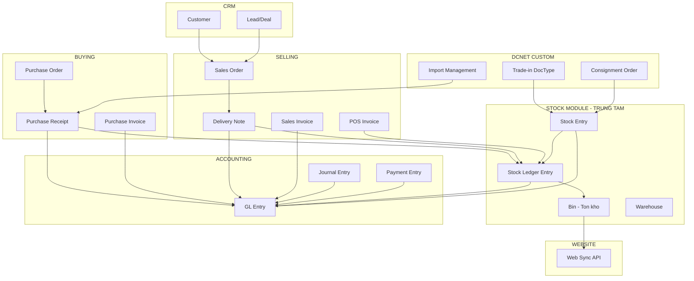
```mermaid
graph TB
    subgraph "STOCK MODULE - TRUNG TAM"
        SLE[Stock Ledger Entry]
        BIN[Bin - Ton kho]
        WH[Warehouse]
        SE[Stock Entry]
    end

    subgraph "BUYING"
        PO[Purchase Order]
        PR[Purchase Receipt]
        PI[Purchase Invoice]
    end

    subgraph "SELLING"
        SO[Sales Order]
        DN[Delivery Note]
        SI[Sales Invoice]
        POS[POS Invoice]
    end

    subgraph "ACCOUNTING"
        GL[GL Entry]
        JE[Journal Entry]
        PE[Payment Entry]
    end

    subgraph "DCNET CUSTOM"
        TI[Trade-in DocType]
        CS[Consignment Order]
        IM[Import Management]
    end

    subgraph "CRM"
        CUST[Customer]
        LEAD[Lead/Deal]
    end

    subgraph "WEBSITE"
        WEB[Web Sync API]
    end

    PO --> PR
    PR --> SLE
    PR --> GL
    PI --> GL

    SO --> DN
    DN --> SLE
    DN --> GL
    SI --> GL
    POS --> SLE

    SLE --> BIN
    SLE --> GL

    SE --> SLE
    SE --> GL

    TI --> SE
    CS --> SE
    IM --> PR

    CUST --> SO
    LEAD --> SO

    BIN --> WEB

    JE --> GL
    PE --> GL
```

### 1.2. Danh sach module ket noi

| # | Module | Ket noi qua | DocType chinh | Muc do | Ghi chu |
|---|--------|------------|---------------|--------|---------|
| 1 | **Buying** | Purchase Receipt | PO, PR, PI | Critical | Moi nhap kho mua hang |
| 2 | **Selling** | Delivery Note | SO, DN, SI, POS | Critical | Moi xuat kho ban hang |
| 3 | **Accounting** | GL Entry (Perpetual Inventory) | GL Entry, JE, PE | Critical | Tu dong tao but toan |
| 4 | **Trade-in** | Stock Entry (Receipt/Issue) | Custom DocType | High | Nhap SP cu, xuat SP moi |
| 5 | **Consignment** | Stock Entry (Transfer) | Custom Workflow 5 buoc | High | Ky gui TL ↔ NM |
| 6 | **Import** | PR + Landed Cost Voucher | PO, PR, LCV, Batch | High | Nhap khau 7 loai SP golf |
| 7 | **CRM/Customer** | Credit Limit check | Customer, SO | Medium | Kiem tra han muc truoc xuat kho |
| 8 | **Website** | API / Webhook | Bin, Item | Medium | Dong bo ton kho real-time |
| 9 | **Quality** | Quality Inspection | QI before PR | Low | Kiem tra chat luong truoc nhap kho |
| 10 | **Assets** | Stock Entry (Issue) | Asset, SE | Low | Xuat CCDC tu kho |

### 1.3. Ma tran anh huong

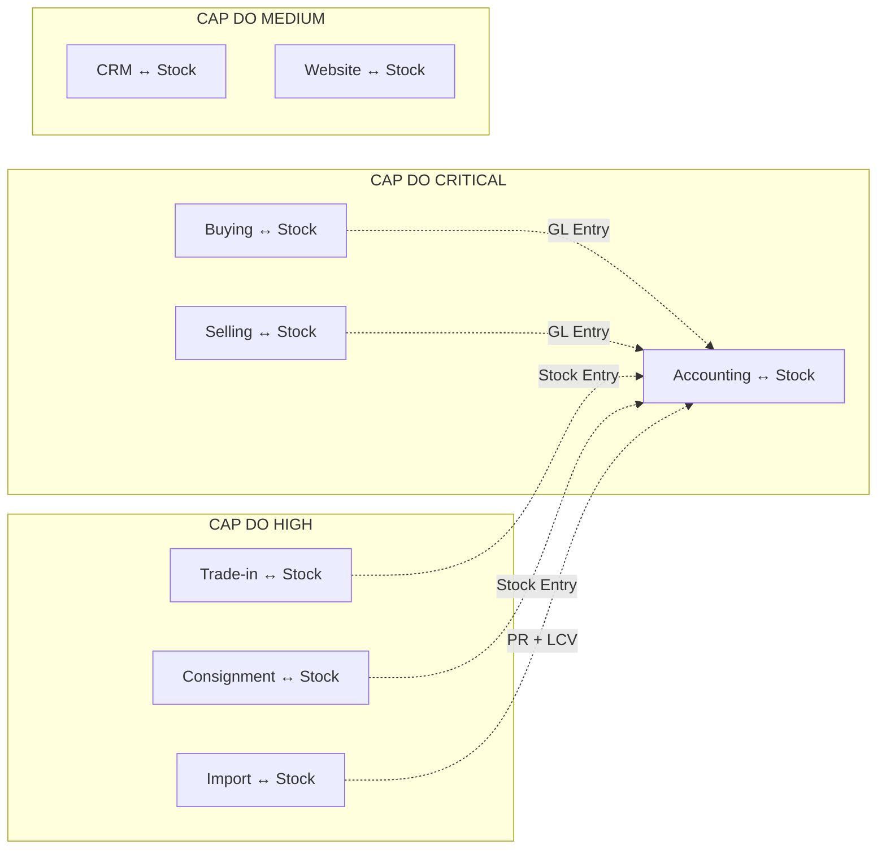
```mermaid
graph LR
    subgraph "CAP DO CRITICAL"
        A1[Buying ↔ Stock]
        A2[Selling ↔ Stock]
        A3[Accounting ↔ Stock]
    end

    subgraph "CAP DO HIGH"
        B1[Trade-in ↔ Stock]
        B2[Consignment ↔ Stock]
        B3[Import ↔ Stock]
    end

    subgraph "CAP DO MEDIUM"
        C1[CRM ↔ Stock]
        C2[Website ↔ Stock]
    end

    A1 -.->|GL Entry| A3
    A2 -.->|GL Entry| A3
    B1 -.->|Stock Entry| A3
    B2 -.->|Stock Entry| A3
    B3 -.->|PR + LCV| A3
```

---

## 2. Kho ↔ Buying (Mua hang)

> **Nguon:** ERP_SPECIFICATION.md Section 3, FEATURE_SPECIFICATION.md Section 8
> **ERPNext DocTypes:** Purchase Order, Purchase Receipt, Purchase Invoice, Stock Ledger Entry, Bin

### 2.1. Luong nghiep vu chi tiet

Quy trinh mua hang trong DCNET Flow gom **10 buoc** (theo ERP_SPECIFICATION.md Section 3.2):

1. **Ke hoach mua hang** - BP Mua hang lap ke hoach theo ky/nam
2. **Don hang mua (PO)** - Tao Purchase Order voi NCC
3. **Ke hoach giao hang** - Len lich nhan hang tu NCC
4. **De nghi nhap hang** - Yeu cau kho chuan bi nhan hang
5. **Phieu nhap mua (PR)** - **DAY LA DIEM KET NOI VOI KHO** - Ghi nhan nhap kho
6. **Chi phi mua hang** - Phan bo chi phi vao gia von (Landed Cost Voucher)
7. **Lenh xuat tra NCC** - Tra hang khong dat chat luong
8. **Phieu xuat tra NCC (Purchase Return)** - **KET NOI KHO LAN 2** - Xuat kho tra
9. **Xac nhan cong no** - Doi chieu cong no voi NCC
10. **De nghi thanh toan** - Lap de nghi thanh toan

### 2.2. Sequence Diagram: Mua hang → Nhap kho

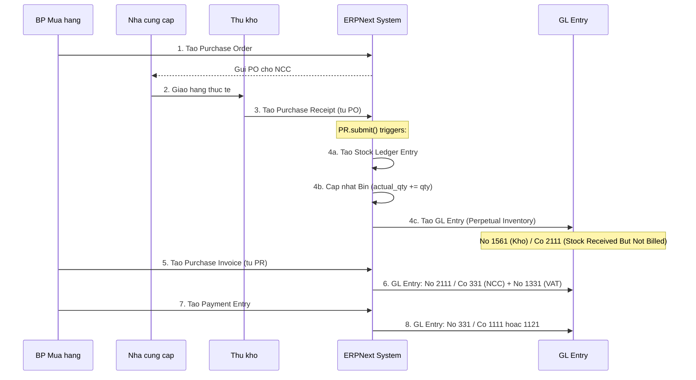
```mermaid
sequenceDiagram
    participant MH as BP Mua hang
    participant NCC as Nha cung cap
    participant KHO as Thu kho
    participant SYS as ERPNext System
    participant GL as GL Entry

    MH->>SYS: 1. Tao Purchase Order
    SYS-->>NCC: Gui PO cho NCC
    NCC->>KHO: 2. Giao hang thuc te
    KHO->>SYS: 3. Tao Purchase Receipt (tu PO)

    Note over SYS: PR.submit() triggers:
    SYS->>SYS: 4a. Tao Stock Ledger Entry
    SYS->>SYS: 4b. Cap nhat Bin (actual_qty += qty)
    SYS->>GL: 4c. Tao GL Entry (Perpetual Inventory)

    Note over GL: No 1561 (Kho) / Co 2111 (Stock Received But Not Billed)

    MH->>SYS: 5. Tao Purchase Invoice (tu PR)
    SYS->>GL: 6. GL Entry: No 2111 / Co 331 (NCC) + No 1331 (VAT)

    MH->>SYS: 7. Tao Payment Entry
    SYS->>GL: 8. GL Entry: No 331 / Co 1111 hoac 1121
```

### 2.3. DocType va Field mapping

| Source DocType | Target DocType | Linked Fields | Huong |
|---------------|---------------|---------------|-------|
| Purchase Order | Purchase Receipt | `supplier`, `items[]` (item_code, qty, rate, warehouse) | PO → PR (Get Items) |
| Purchase Receipt | Stock Ledger Entry | `item_code`, `warehouse`, `actual_qty`, `incoming_rate` | PR submit → SLE auto |
| Stock Ledger Entry | GL Entry | `stock_value_difference` → amount | SLE → GL auto |
| Purchase Receipt | Purchase Invoice | `supplier`, `items[]`, `purchase_receipt` | PR → PI (Get Items) |
| Purchase Order | Purchase Invoice | `supplier`, `items[]` | PO → PI (Get Items) |
| Purchase Return | Stock Ledger Entry | `item_code`, `warehouse`, `actual_qty` (am) | Return submit → SLE |

### 2.4. ERPNext Fields quan trong trong Purchase Receipt

| Field | DocType | Mo ta | Anh huong Stock |
|-------|---------|-------|-----------------|
| `posting_date` | Purchase Receipt | Ngay nhap kho | Thoi diem ghi nhan SLE |
| `set_warehouse` | Purchase Receipt | Kho nhan mac dinh | Target warehouse cho items |
| `items[].warehouse` | PR Item | Kho nhan cho tung item | Override set_warehouse |
| `items[].qty` | PR Item | So luong nhap | Bin.actual_qty += qty |
| `items[].rate` | PR Item | Don gia nhap | valuation_rate tinh toan |
| `items[].batch_no` | PR Item | So lo | Lien ket Batch |
| `items[].serial_no` | PR Item | So serial | Lien ket Serial No |
| `items[].rejected_qty` | PR Item | So luong tu choi | Nhap kho Rejected Warehouse |
| `items[].quality_inspection` | PR Item | Link QI | Kiem tra chat luong |

### 2.5. Truong hop dac biet

#### 2.5.1. PO partial delivery (nhieu dot nhap)

ERPNext ho tro nhap nhieu lan tu 1 PO. Moi Purchase Receipt chi nhap 1 phan so luong:

```
PO (100 cay gay) → PR #1 (40 cay) → PR #2 (35 cay) → PR #3 (25 cay)
```

- Field `per_received` tren PO tu dong cap nhat %
- PO status: `To Receive` → `To Receive and Bill` → `Completed`
- Bin.ordered_qty giam sau moi PR

#### 2.5.2. Quality Inspection truoc nhap kho

Doi voi san pham golf cao cap (gay, tui), can kiem tra chat luong truoc khi nhap:

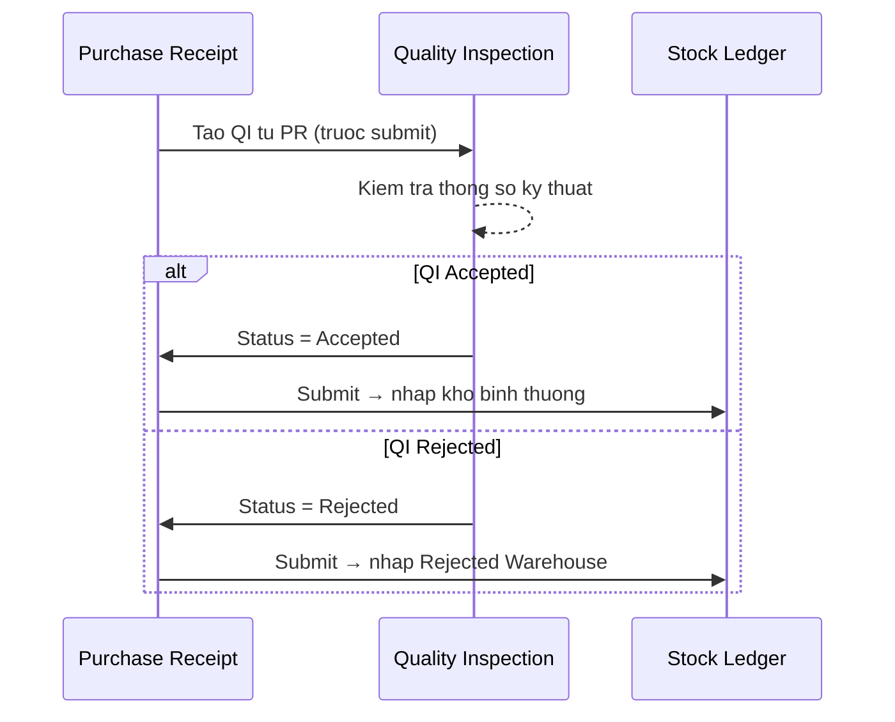
```mermaid
sequenceDiagram
    participant PR as Purchase Receipt
    participant QI as Quality Inspection
    participant SLE as Stock Ledger

    PR->>QI: Tao QI tu PR (truoc submit)
    QI-->>QI: Kiem tra thong so ky thuat
    alt QI Accepted
        QI->>PR: Status = Accepted
        PR->>SLE: Submit → nhap kho binh thuong
    else QI Rejected
        QI->>PR: Status = Rejected
        PR->>SLE: Submit → nhap Rejected Warehouse
    end
```

- Setting: `Stock Settings > Inspection Required Before Purchase`
- Quality Inspection Template: tao template cho tung loai san pham golf

#### 2.5.3. Purchase Return (tra hang NCC)

Khi hang bi loi, thuc hien tra hang NCC:

```
Purchase Receipt goc → Create Return (is_return=1) → SLE (qty am) → GL Entry (dao but toan)
```

- ERPNext tu dong tao PR voi `is_return=1`, `return_against` = PR goc
- SLE ghi nhan `actual_qty` am → Bin.actual_qty giam
- GL Entry tu dong dao: No 331 / Co 1561 (nguoc lai but toan nhap)

#### 2.5.4. Subcontracting (gia cong)

DCNET co the can gia cong (in logo, danh dau custom cho gay golf):

```
Subcontracting Order → Stock Entry (Transfer to Subcontractor) → Purchase Receipt (nhan hang gia cong)
```

- Field: `Purchase Order.subcontracting_type = "Subcontract"`
- Raw materials xuat tu kho DCNET → NCC gia cong → nhan lai thanh pham

### 2.6. ERPNext Settings lien quan

| Setting | Duong dan | Gia tri de xuat | Anh huong |
|---------|-----------|-----------------|-----------|
| `SO Required for PI` | Stock Settings | No | Cho phep tao PI khong can SO |
| `DN Required for PI` | Stock Settings | No | Cho phep tao PI khong can DN |
| `PR Required for PI` | Buying Settings | Warn | Canh bao khi tao PI khong co PR |
| `Auto Create Purchase Receipt` | Buying Settings | No | Khong tu dong tao PR |
| `Over Receipt Allowance (%)` | Stock Settings | 5% | Cho phep nhap thua 5% |

---

## 3. Kho ↔ Selling (Ban hang)

> **Nguon:** ERP_SPECIFICATION.md Section 2, FEATURE_SPECIFICATION.md Section 5/7
> **ERPNext DocTypes:** Sales Order, Delivery Note, Sales Invoice, POS Invoice, Pick List, Stock Reservation Entry

### 3.1. Luong ban buon (B2B - Wholesale)

Quy trinh ban buon trong DCNET Flow gom **12 buoc** (theo ERP_SPECIFICATION.md Section 2.0):

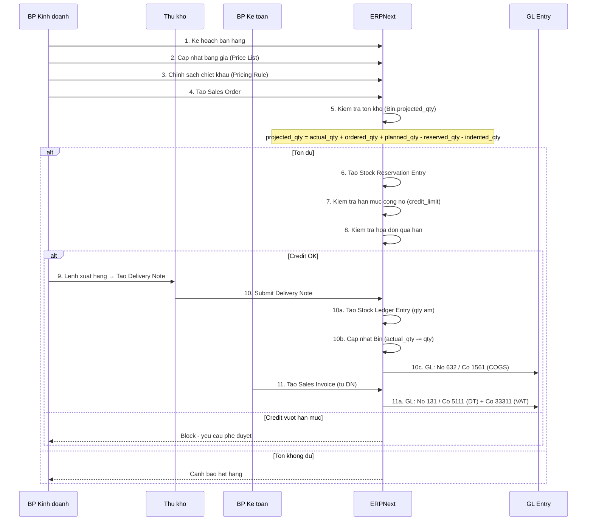
```mermaid
sequenceDiagram
    participant KD as BP Kinh doanh
    participant KHO as Thu kho
    participant KT as BP Ke toan
    participant SYS as ERPNext
    participant GL as GL Entry

    KD->>SYS: 1. Ke hoach ban hang
    KD->>SYS: 2. Cap nhat bang gia (Price List)
    KD->>SYS: 3. Chinh sach chiet khau (Pricing Rule)
    KD->>SYS: 4. Tao Sales Order

    SYS->>SYS: 5. Kiem tra ton kho (Bin.projected_qty)
    Note over SYS: projected_qty = actual_qty + ordered_qty + planned_qty - reserved_qty - indented_qty

    alt Ton du
        SYS->>SYS: 6. Tao Stock Reservation Entry
        SYS->>SYS: 7. Kiem tra han muc cong no (credit_limit)
        SYS->>SYS: 8. Kiem tra hoa don qua han

        alt Credit OK
            KD->>KHO: 9. Lenh xuat hang → Tao Delivery Note
            KHO->>SYS: 10. Submit Delivery Note
            SYS->>SYS: 10a. Tao Stock Ledger Entry (qty am)
            SYS->>SYS: 10b. Cap nhat Bin (actual_qty -= qty)
            SYS->>GL: 10c. GL: No 632 / Co 1561 (COGS)

            KT->>SYS: 11. Tao Sales Invoice (tu DN)
            SYS->>GL: 11a. GL: No 131 / Co 5111 (DT) + Co 33311 (VAT)
        else Credit vuot han muc
            SYS-->>KD: Block - yeu cau phe duyet
        end
    else Ton khong du
        SYS-->>KD: Canh bao het hang
    end
```

### 3.2. Luong ban le (POS - Retail)

Ban le tai cua hang su dung POS Invoice - ket hop ban hang + thanh toan + xuat kho trong 1 buoc:

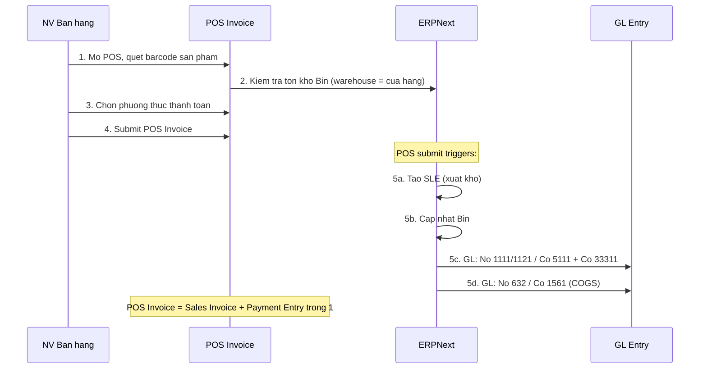
```mermaid
sequenceDiagram
    participant NV as NV Ban hang
    participant POS as POS Invoice
    participant SYS as ERPNext
    participant GL as GL Entry

    NV->>POS: 1. Mo POS, quet barcode san pham
    POS->>SYS: 2. Kiem tra ton kho Bin (warehouse = cua hang)
    NV->>POS: 3. Chon phuong thuc thanh toan
    NV->>POS: 4. Submit POS Invoice

    Note over SYS: POS submit triggers:
    SYS->>SYS: 5a. Tao SLE (xuat kho)
    SYS->>SYS: 5b. Cap nhat Bin
    SYS->>GL: 5c. GL: No 1111/1121 / Co 5111 + Co 33311
    SYS->>GL: 5d. GL: No 632 / Co 1561 (COGS)

    Note over POS: POS Invoice = Sales Invoice + Payment Entry trong 1
```

**Luu y POS cho DCNET:**
- Warehouse mac dinh = kho cua hang (VD: "Kho Ban Le TL", "Kho Ban Le NM")
- Quet barcode: `tem tu in: ma vat tu + ;; + so lo` hoac `tem NCC: so seri`
- In hoa don ban le ngay tai quay

### 3.3. Stock Reservation Entry

ERPNext v16 ho tro **Stock Reservation Entry (SRE)** de giu hang theo don:

```
Sales Order (submit) → Stock Reservation Entry (auto/manual) → Reserve stock in Bin
```

| Field | Mo ta | Anh huong Bin |
|-------|-------|---------------|
| `voucher_type` | "Sales Order" | Link den SO |
| `item_code` | Ma san pham | Item duoc reserve |
| `warehouse` | Kho giu hang | Kho cu the |
| `reserved_qty` | So luong giu | Bin.reserved_qty += qty |
| `delivered_qty` | So luong da giao | Giam khi DN submit |
| `status` | Reserved/Partially Delivered/Delivered | Trang thai |

**Cong thuc ton kho kha dung:**
```
available_qty = Bin.actual_qty - Bin.reserved_qty
projected_qty = actual_qty + ordered_qty + planned_qty - reserved_qty - indented_qty
```

**Dac biet cho DCNET:**
- Yeu cau spec: "Tru ton kho kha dung (giu theo don hang)" - ERP-WH-012
- Khi tao SO, tu dong reserve stock
- Khi huy SO, tu dong hoan tra reserve
- Khi submit DN tu SO, tu dong giam reserve

### 3.4. Pick List workflow

Pick List giup toi uu hoa quy trinh lay hang tu kho:

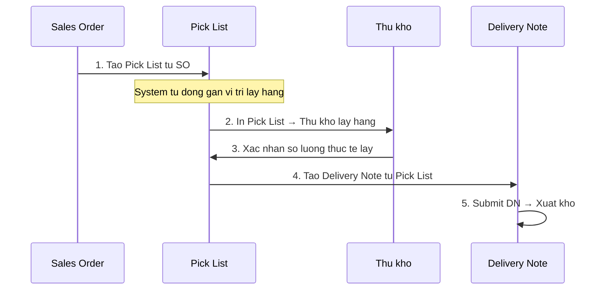
```mermaid
sequenceDiagram
    participant SO as Sales Order
    participant PL as Pick List
    participant KHO as Thu kho
    participant DN as Delivery Note

    SO->>PL: 1. Tao Pick List tu SO
    Note over PL: System tu dong gan vi tri lay hang
    PL->>KHO: 2. In Pick List → Thu kho lay hang
    KHO->>PL: 3. Xac nhan so luong thuc te lay
    PL->>DN: 4. Tao Delivery Note tu Pick List
    DN->>DN: 5. Submit DN → Xuat kho
```

**Pick List fields lien quan Stock:**
- `locations[]`: danh sach vi tri kho can lay
- `locations[].warehouse`: kho
- `locations[].qty`: so luong can lay
- `locations[].serial_no`: serial cu the
- `locations[].batch_no`: lo cu the

**Lien quan DCNET:**
- ERP-WH-011: Quan ly vi tri kho (Khu vuc + Ke + O) → Can custom de Pick List hien thi vi tri chi tiet

### 3.5. Truong hop dac biet

#### 3.5.1. Partial delivery (giao hang nhieu dot)

```
SO (50 cay gay) → DN #1 (20 cay) → DN #2 (20 cay) → DN #3 (10 cay)
```

- SO.`per_delivered` tu dong cap nhat %
- SO status: `To Deliver` → `To Deliver and Bill` → `Completed`
- Stock Reservation giam dan sau moi DN

#### 3.5.2. Back-to-back orders (PO tu SO)

Khi khong du ton kho, tao PO tu SO:

```
SO (khach dat) → Material Request → PO (dat NCC) → PR (nhap kho) → DN (giao khach)
```

- ERPNext: SO → Create Material Request → Create Purchase Order
- Dung cho truong hop khach dat hang truoc, DCNET dat NCC sau

#### 3.5.3. Sales Return (khach tra hang)

Theo quy trinh ban buon buoc 10-11 (ERP_SPECIFICATION.md):

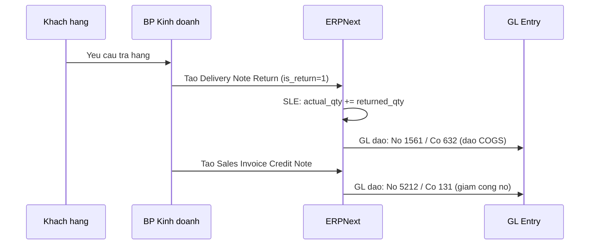
```mermaid
sequenceDiagram
    participant KH as Khach hang
    participant KD as BP Kinh doanh
    participant SYS as ERPNext
    participant GL as GL Entry

    KH->>KD: Yeu cau tra hang
    KD->>SYS: Tao Delivery Note Return (is_return=1)
    SYS->>SYS: SLE: actual_qty += returned_qty
    SYS->>GL: GL dao: No 1561 / Co 632 (dao COGS)

    KD->>SYS: Tao Sales Invoice Credit Note
    SYS->>GL: GL dao: No 5212 / Co 131 (giam cong no)
```

- DN Return: `is_return=1`, `return_against` = DN goc
- SI Credit Note: `is_return=1`, ghi nhan vao TK 5212 (Hang ban bi tra lai)

#### 3.5.4. Drop shipping

Khong ap dung cho DCNET (hang golf can kiem tra chat luong truoc khi giao).

---

## 4. Kho ↔ Accounting (Ke toan)

> **Nguon:** COA_ANALYSIS.md, ERP_SPECIFICATION.md Section 5
> **Co che:** Perpetual Inventory System
> **ERPNext DocTypes:** GL Entry, Stock Ledger Entry, Journal Entry, Payment Entry

### 4.1. Perpetual Inventory - Co che cot loi

ERPNext su dung **Perpetual Inventory** = moi bien dong kho tu dong tao but toan ke toan (GL Entry). Day la co che ket noi quan trong nhat giua Stock va Accounting.

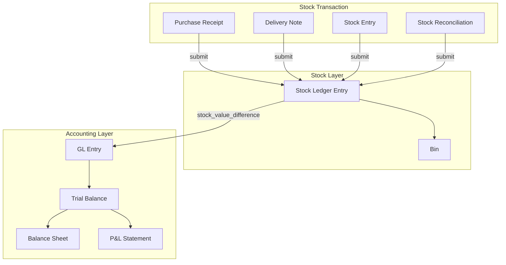
```mermaid
graph TB
    subgraph "Stock Transaction"
        PR[Purchase Receipt]
        DN[Delivery Note]
        SE[Stock Entry]
        SR[Stock Reconciliation]
    end

    subgraph "Stock Layer"
        SLE[Stock Ledger Entry]
        BIN[Bin]
    end

    subgraph "Accounting Layer"
        GL[GL Entry]
        TB[Trial Balance]
        BS[Balance Sheet]
        PL[P&L Statement]
    end

    PR -->|submit| SLE
    DN -->|submit| SLE
    SE -->|submit| SLE
    SR -->|submit| SLE

    SLE --> BIN
    SLE -->|stock_value_difference| GL

    GL --> TB
    TB --> BS
    TB --> PL
```

**Nguyen tac:**
- `Perpetual Inventory = ON` (mac dinh ERPNext v16)
- Moi SLE co `stock_value_difference` → tu dong tao GL Entry
- Gia tri kho (stock_value) luon dong bo voi so ke toan (GL balance cua TK Stock)

### 4.2. Bang GL Entry theo nghiep vu kho

| Nghiep vu | DocType ERPNext | No (Debit) | Co (Credit) | TK trong COA v2 |
|-----------|----------------|------------|-------------|------------------|
| **Nhap mua** | Purchase Receipt | 1561 (Kho hang) | Stock Received But Not Billed* | 1561 (Stock) |
| **Nhap mua (co PI)** | Purchase Invoice | Stock Received But Not Billed* | 331 (NCC) + 1331 (VAT) | 331 (Payable), 1331 (Tax) |
| **Xuat ban** | Delivery Note | 632 (Gia von) | 1561 (Kho hang) | 632 (COGS), 1561 (Stock) |
| **Hoa don ban** | Sales Invoice | 131 (Phai thu) | 5111/51111/51112 (DT) + 33311 (VAT) | 131 (Receivable) |
| **Nhap kho (khac)** | Stock Entry (Receipt) | 1561 (Kho hang) | 6329 (Stock Adjustment) | 1561, 6329 |
| **Xuat kho (khac)** | Stock Entry (Issue) | 6329 (Stock Adjustment) | 1561 (Kho hang) | 6329, 1561 |
| **Dieu chuyen** | Stock Entry (Transfer) | 1561 (Kho dich) | 1561 (Kho nguon) | 1561 (2 warehouse khac nhau) |
| **Kiem ke thua** | Stock Reconciliation | 1561 (Kho hang) | 6329 (Stock Adjustment) | 1561, 6329 |
| **Kiem ke thieu** | Stock Reconciliation | 6329 (Stock Adjustment) | 1561 (Kho hang) | 6329, 1561 |
| **Trade-in nhap** | Stock Entry (Receipt) | 1565 (Kho Trade-in) | 131/1111 (KH) | 1565 (Stock) |
| **Ky gui xuat** | Stock Entry (Transfer) | 1567 (Ky gui) | 1561 (Kho tong) | 1567, 1561 |

> (*) "Stock Received But Not Billed" la TK trung gian ERPNext tu dong tao, su dung khi PR va PI tao rieng biet.

### 4.3. Default Accounts mapping

Cac TK mac dinh can thiet lap trong **Company DocType** de Perpetual Inventory hoat dong:

| Default Account | TK trong COA v2 | Account Type | Bat buoc |
|----------------|-----------------|-------------|:--------:|
| Default Inventory Account | 1561 - Gia mua hang hoa | Stock | Yes |
| Stock Received But Not Billed | (Tu dong tao) | Stock Received But Not Billed | Yes |
| Stock Adjustment Account | 6329 - Dieu chinh HTK | Stock Adjustment | Yes |
| Expenses Included In Valuation | 1562 - CP thu mua | Expenses Included In Asset Valuation | Yes |
| Default COGS Account | 632 - Gia von hang ban | Cost of Goods Sold | Yes |
| Round Off Account | 4119 - CL lam tron | Round Off | Yes |

### 4.4. Phuong phap tinh gia von

| Phuong phap | ERPNext ho tro | Yeu cau DCNET | Ghi chu |
|-------------|:--------------:|:-------------:|---------|
| FIFO | Yes | Khong | First In First Out |
| Moving Average | Yes | **Co the** | Binh quan gia quyen tai thoi diem |
| Monthly Average | **Khong** | Co (spec goc) | Trung binh thang - ERPNext khong co |

**Van de can clarify voi khach hang:**
- ERP_SPECIFICATION.md ghi: "Tinh gia von hang xuat theo phuong phap trung binh thang"
- SRS ghi: "Binh quan gia quyen"
- ERPNext chi co **Moving Average** (tinh lai gia von moi khi co giao dich nhap)
- Can xac nhan khach chap nhan Moving Average thay cho trung binh thang

**Cau hinh:** `Stock Settings > Valuation Method = "Moving Average"` hoac set per Item Group

### 4.5. Sequence Diagram: Stock → Accounting flow day du

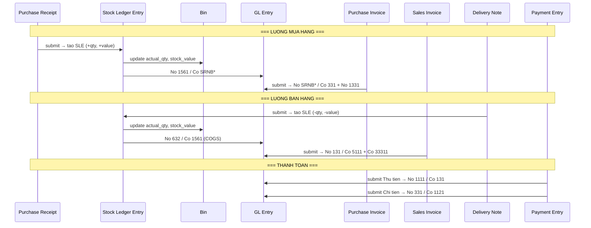
```mermaid
sequenceDiagram
    participant PR as Purchase Receipt
    participant SLE as Stock Ledger Entry
    participant BIN as Bin
    participant GL as GL Entry
    participant PI as Purchase Invoice
    participant SI as Sales Invoice
    participant DN as Delivery Note
    participant PE as Payment Entry

    Note over PR,PE: === LUONG MUA HANG ===
    PR->>SLE: submit → tao SLE (+qty, +value)
    SLE->>BIN: update actual_qty, stock_value
    SLE->>GL: No 1561 / Co SRNB*

    PI->>GL: submit → No SRNB* / Co 331 + No 1331

    Note over PR,PE: === LUONG BAN HANG ===
    DN->>SLE: submit → tao SLE (-qty, -value)
    SLE->>BIN: update actual_qty, stock_value
    SLE->>GL: No 632 / Co 1561 (COGS)

    SI->>GL: submit → No 131 / Co 5111 + Co 33311

    Note over PR,PE: === THANH TOAN ===
    PE->>GL: submit Thu tien → No 1111 / Co 131
    PE->>GL: submit Chi tien → No 331 / Co 1121
```

---

## 5. Kho ↔ Trade-in (Dac thu DCNET)

> **Nguon:** FEATURE_SPECIFICATION.md Section 18 - Quan ly Thu cu Doi moi
> **Custom DocType:** Trade-in Order (can custom development)
> **Estimated Effort:** 3-4 tuan (MODULE_GAP_ANALYSIS.md)

### 5.1. Nghiep vu Trade-in

Khach hang mang san pham golf cu (gay, tui, phu kien) → DCNET dinh gia SP cu → Tru gia tri vao gia SP moi → Khach chi tra chenh lech.

**Cac buoc:**
1. Khach mang SP cu den cua hang
2. NV dinh gia SP cu (dua tren tinh trang, model, nam san xuat)
3. Khach chon SP moi
4. Tinh toan: **Tien khach tra = Gia SP moi - Gia tri Trade-in - Voucher (neu co)**
5. Tao don hang, xuat SP moi, nhap SP cu vao kho Trade-in

### 5.2. Luong kho chi tiet

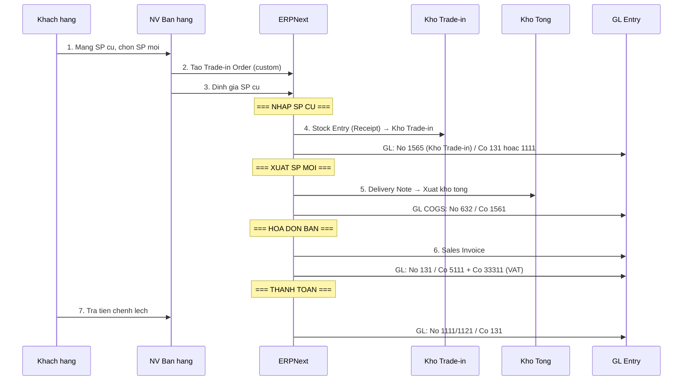
```mermaid
sequenceDiagram
    participant KH as Khach hang
    participant NV as NV Ban hang
    participant SYS as ERPNext
    participant KHO_TI as Kho Trade-in
    participant KHO_MAIN as Kho Tong
    participant GL as GL Entry

    KH->>NV: 1. Mang SP cu, chon SP moi
    NV->>SYS: 2. Tao Trade-in Order (custom)
    NV->>SYS: 3. Dinh gia SP cu

    Note over SYS: === NHAP SP CU ===
    SYS->>KHO_TI: 4. Stock Entry (Receipt) → Kho Trade-in
    SYS->>GL: GL: No 1565 (Kho Trade-in) / Co 131 hoac 1111

    Note over SYS: === XUAT SP MOI ===
    SYS->>KHO_MAIN: 5. Delivery Note → Xuat kho tong
    SYS->>GL: GL COGS: No 632 / Co 1561

    Note over SYS: === HOA DON BAN ===
    SYS->>GL: 6. Sales Invoice
    SYS->>GL: GL: No 131 / Co 5111 + Co 33311 (VAT)

    Note over SYS: === THANH TOAN ===
    KH->>NV: 7. Tra tien chenh lech
    SYS->>GL: GL: No 1111/1121 / Co 131
```

### 5.3. But toan ke toan chi tiet

**Truong hop 1: Gia SP moi > Gia tri Trade-in (binh thuong)**

```
VD: Gay cu dinh gia 5,000,000 VND, Gay moi gia 15,000,000 VND (chua VAT)

But toan 1 - Nhap SP cu:
  No 1565 (Kho Trade-in)    5,000,000
    Co 131 (Giam phai thu)     5,000,000

But toan 2 - Xuat SP moi (COGS):
  No 632 (Gia von)           8,000,000  (gia von thuc te)
    Co 1561 (Kho tong)          8,000,000

But toan 3 - Ghi nhan doanh thu:
  No 131 (Phai thu KH)     16,500,000  (15tr + 10% VAT)
    Co 5111 (Doanh thu)       15,000,000
    Co 33311 (VAT dau ra)      1,500,000

But toan 4 - Thu tien chenh lech:
  No 1111 (Tien mat)        11,500,000  (16.5tr - 5tr)
    Co 131 (Giam phai thu)    11,500,000
```

**Truong hop 2: Gia SP cu >= Gia SP moi**

> Cau hoi can clarify voi khach hang (COA_ANALYSIS.md Section 9.3):
> Khach hang co duoc nhan tien chenh lech khong?
> Neu co → can but toan hoan tien, anh huong cashflow.

### 5.4. Warehouse setup cho Trade-in

| Kho | Company | Account (TK) | Muc dich | Loai |
|-----|---------|-------------|---------|------|
| Kho Trade-in TL | Thang Long TM | 1565 | Nhan SP cu tai TL | Custom (Stock) |
| Kho Trade-in NM | Nhat Minh Sport | 1565 | Nhan SP cu tai NM | Custom (Stock) |

**Cau hinh Warehouse trong ERPNext:**
```python
# Warehouse DocType
{
    "warehouse_name": "Kho Trade-in TL",
    "company": "Thang Long TM",
    "warehouse_type": "Trade-in",  # Custom field
    "account": "1565 - Hang trade-in - TM",
    "is_group": 0,
    "disabled": 0
}
```

### 5.5. Xu ly SP cu sau trade-in

| Phuong an | Stock Entry Type | But toan | Ghi chu |
|-----------|-----------------|---------|---------|
| **Ban lai (refurbished)** | Transfer: Kho Trade-in → Kho Ban | No 1561 / Co 1565 | SP cu duoc lam moi, ban lai |
| **Thanh ly** | Issue: Kho Trade-in → (consumed) | No 811 / Co 1565 | Ban voi gia thap |
| **Tieu huy** | Issue: Kho Trade-in → (consumed) | No 632 hoac 811 / Co 1565 | Khong con gia tri |

---

## 6. Kho ↔ Consignment (Ky gui) - Dac thu DCNET

> **Nguon:** MODULE_GAP_ANALYSIS.md Section "CONSIGNMENT", IMPORT_PROCESS_SPECIFICATION.md Section 2
> **Custom DocType:** Consignment Order (can custom development)
> **Estimated Effort:** 4-5 tuan

### 6.1. Mo hinh ky gui TL ↔ NM

**Thang Long TM** la nha phan phoi chinh (authorized distributor) cua cac hang golf.
**Nhat Minh Sport** la dai ly cap 1, nhan hang ky gui tu Thang Long TM.

Mo hinh:
- TL giu quyen so huu hang hoa cho den khi NM ban duoc
- NM nhan hang vat ly nhung KHONG ghi nhan ton kho (off-balance-sheet) cho den khi mua chinh thuc
- Cuoi thang, tong hop so luong NM da ban → TL xuat hoa don cho NM → NM nhap mua chinh thuc

### 6.2. 5-step workflow chi tiet

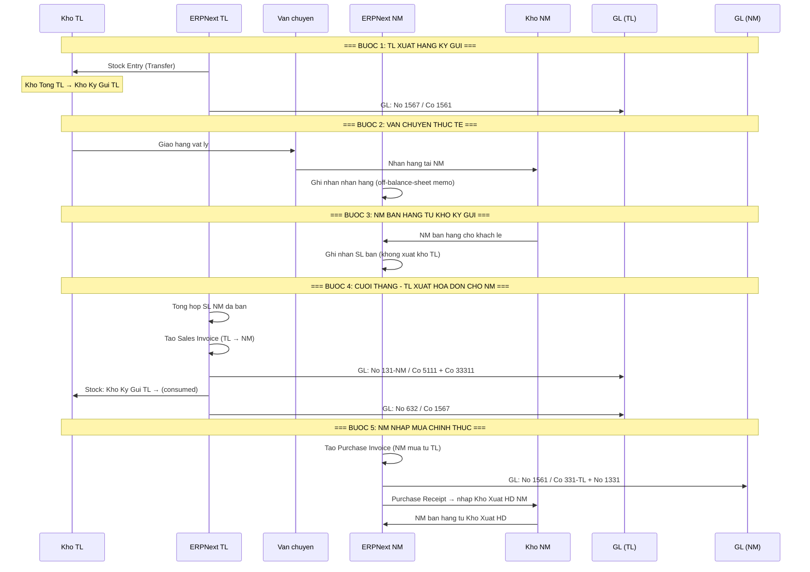
```mermaid
sequenceDiagram
    participant TL_KHO as Kho TL
    participant TL_SYS as ERPNext TL
    participant SHIP as Van chuyen
    participant NM_SYS as ERPNext NM
    participant NM_KHO as Kho NM
    participant GL_TL as GL (TL)
    participant GL_NM as GL (NM)

    Note over TL_KHO,GL_NM: === BUOC 1: TL XUAT HANG KY GUI ===
    TL_SYS->>TL_KHO: Stock Entry (Transfer)
    Note over TL_KHO: Kho Tong TL → Kho Ky Gui TL
    TL_SYS->>GL_TL: GL: No 1567 / Co 1561

    Note over TL_KHO,GL_NM: === BUOC 2: VAN CHUYEN THUC TE ===
    TL_KHO->>SHIP: Giao hang vat ly
    SHIP->>NM_KHO: Nhan hang tai NM
    NM_SYS->>NM_SYS: Ghi nhan nhan hang (off-balance-sheet memo)

    Note over TL_KHO,GL_NM: === BUOC 3: NM BAN HANG TU KHO KY GUI ===
    NM_KHO->>NM_SYS: NM ban hang cho khach le
    NM_SYS->>NM_SYS: Ghi nhan SL ban (khong xuat kho TL)

    Note over TL_KHO,GL_NM: === BUOC 4: CUOI THANG - TL XUAT HOA DON CHO NM ===
    TL_SYS->>TL_SYS: Tong hop SL NM da ban
    TL_SYS->>TL_SYS: Tao Sales Invoice (TL → NM)
    TL_SYS->>GL_TL: GL: No 131-NM / Co 5111 + Co 33311
    TL_SYS->>TL_KHO: Stock: Kho Ky Gui TL → (consumed)
    TL_SYS->>GL_TL: GL: No 632 / Co 1567

    Note over TL_KHO,GL_NM: === BUOC 5: NM NHAP MUA CHINH THUC ===
    NM_SYS->>NM_SYS: Tao Purchase Invoice (NM mua tu TL)
    NM_SYS->>GL_NM: GL: No 1561 / Co 331-TL + No 1331
    NM_SYS->>NM_KHO: Purchase Receipt → nhap Kho Xuat HD NM
    NM_KHO->>NM_SYS: NM ban hang tu Kho Xuat HD
```

### 6.3. Chi tiet tung buoc

#### Buoc 1: TL xuat hang ky gui

| Thong tin | Gia tri |
|-----------|---------|
| **DocType** | Stock Entry (Material Transfer) |
| **Source Warehouse** | Kho Tong TL |
| **Target Warehouse** | Kho Ky Gui TL |
| **But toan** | No 1567 (Hang gui di ban) / Co 1561 (Gia mua hang hoa) |
| **Hieu luc** | Hang van thuoc so huu TL |

#### Buoc 2: Van chuyen thuc te

| Thong tin | Gia tri |
|-----------|---------|
| **Chung tu** | Phieu giao nhan hang (custom print format) |
| **Tracking** | Transit status trong Consignment Order |
| **Ghi nhan tai NM** | Off-balance-sheet memo (ghi nho, khong hach toan) |

#### Buoc 3: NM ban hang

| Thong tin | Gia tri |
|-----------|---------|
| **Ghi nhan** | Danh sach SP da ban (serial, batch, qty) |
| **Kho** | NM chua nhap kho chinh thuc |
| **So lieu** | Luy ke trong thang → lam co so cho Buoc 4 |

#### Buoc 4: Cuoi thang - TL xuat hoa don

| Thong tin | Gia tri |
|-----------|---------|
| **DocType** | Sales Invoice (TL → NM) |
| **Items** | Tong hop SP NM da ban trong thang |
| **But toan TL** | No 131-NM / Co 5111 + Co 33311 (VAT) |
| **Stock TL** | No 632 / Co 1567 (xuat kho ky gui) |

#### Buoc 5: NM nhap mua chinh thuc

| Thong tin | Gia tri |
|-----------|---------|
| **DocType** | Purchase Invoice + Purchase Receipt (NM mua tu TL) |
| **But toan NM** | No 1561 / Co 331-TL + No 1331 (VAT) |
| **Target Warehouse** | Kho Xuat HD NM |
| **Sau do** | NM ban hang tu Kho Xuat HD (luong ban hang binh thuong) |

### 6.4. Warehouse types cho ky gui

| Kho | Company | Loai | TK | Muc dich |
|-----|---------|------|-----|---------|
| Kho Tong TL | Thang Long TM | Regular | 1561 | Kho chinh TL |
| **Kho Ky Gui TL** | Thang Long TM | Consignment Out | **1567** | Hang gui cho NM |
| Kho Ban Le TL | Thang Long TM | Regular | 1561 | Ban le tai cua hang TL |
| **Kho Ky Gui NM** | Nhat Minh Sport | Consignment In | **1567** | Nhan hang ky gui tu TL (off-balance) |
| **Kho Xuat HD NM** | Nhat Minh Sport | Regular | 1561 | Hang da mua chinh thuc |
| Kho Ban Le NM | Nhat Minh Sport | Regular | 1561 | Ban le tai cua hang NM |

### 6.5. Van de ke toan dac biet

**Quyen so huu:**
- Hang ky gui **VAN THUOC SO HUU TL** cho den khi NM mua (Buoc 5)
- TL ghi TK 157/1567 (Hang gui di ban) - con thuoc tai san TL
- NM **KHONG ghi nhan ton kho** (off-balance-sheet) - chi ghi nho de theo doi

**Rui ro:**
- Hang ton lau tai NM → TL phai theo doi aging
- Hang hu hong tai NM → Ai chiu trach nhiem?
- Chenh lech kiem ke giua TL va NM → Can doi soat dinh ky

### 6.6. Custom development can thiet

| Component | Mo ta | Effort |
|-----------|-------|--------|
| **Consignment Order DocType** | Master document theo doi toan bo quy trinh 5 buoc | 1 tuan |
| **Consignment Workflow** | State machine 5 buoc voi approval | 1 tuan |
| **Monthly Reconciliation** | Tu dong tong hop SL ban, tao Invoice | 1.5 tuan |
| **Dashboard** | Dashboard theo doi hang ky gui (SL, gia tri, aging) | 0.5 tuan |
| **Reports** | BC hang ky gui, BC doi soat, BC aging | 1 tuan |
| **Tong** | | **4-5 tuan** |

---

## 7. Kho ↔ Import Process (Nhap khau)

> **Nguon:** IMPORT_PROCESS_SPECIFICATION.md, ERP_SPECIFICATION.md Section 3.2 Buoc 5
> **ERPNext DocTypes:** Purchase Order, Purchase Receipt, Landed Cost Voucher, Batch, Serial No

### 7.1. 7 loai san pham golf

Theo IMPORT_PROCESS_SPECIFICATION.md Section 3, Thang Long TM nhap khau 7 loai san pham:

| # | Loai san pham | Chu ky dat hang | MOQ | Ghi chu |
|---|--------------|----------------|-----|---------|
| 1 | **Gay nam tiep theo** (New models) | Hang nam (T9-10) | Varies | Dat tai Singapore/Malaysia/Thai Lan |
| 2 | **Driver, FW, Rescue, Irons** | Hang thang (truoc ngay 4) | 10 pcs | Launch T1-2 |
| 3 | **Softgoods (US Specs)** | Hang thang (truoc ngay 5) | MOQ chung | Gop nhieu nuoc |
| 4 | **Gay P Series** | 2 nam/lan | 1,000-3,000 pcs | Dat truoc 3 thang |
| 5 | **Putters** | Hang nam | Defined | Dat truoc 3 thang |
| 6 | **Wedges** | Hang nam | Defined | Dat truoc 3 thang |
| 7 | **Quan ao & PK (JP Lines)** | 2 lan/nam | Season-based | Xuan/He: T6-7, Thu/Dong: T11-12 |

### 7.2. Luong nhap khau → Kho

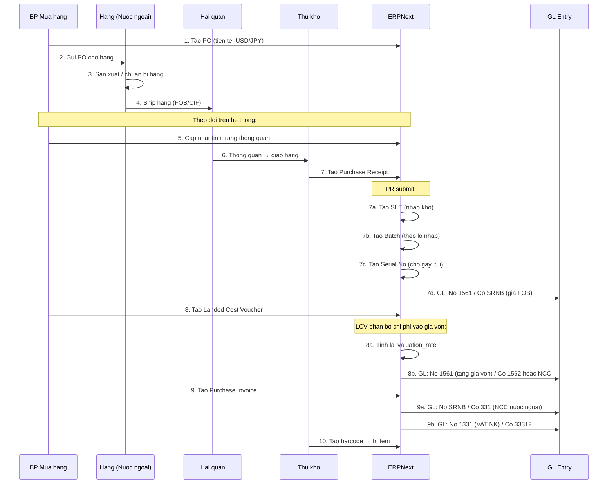
```mermaid
sequenceDiagram
    participant MH as BP Mua hang
    participant NCC as Hang (Nuoc ngoai)
    participant HQ as Hai quan
    participant KHO as Thu kho
    participant SYS as ERPNext
    participant GL as GL Entry

    MH->>SYS: 1. Tao PO (tien te: USD/JPY)
    MH->>NCC: 2. Gui PO cho hang
    NCC->>NCC: 3. San xuat / chuan bi hang
    NCC->>HQ: 4. Ship hang (FOB/CIF)

    Note over MH,SYS: Theo doi tren he thong:
    MH->>SYS: 5. Cap nhat tinh trang thong quan

    HQ->>KHO: 6. Thong quan → giao hang
    KHO->>SYS: 7. Tao Purchase Receipt

    Note over SYS: PR submit:
    SYS->>SYS: 7a. Tao SLE (nhap kho)
    SYS->>SYS: 7b. Tao Batch (theo lo nhap)
    SYS->>SYS: 7c. Tao Serial No (cho gay, tui)
    SYS->>GL: 7d. GL: No 1561 / Co SRNB (gia FOB)

    MH->>SYS: 8. Tao Landed Cost Voucher
    Note over SYS: LCV phan bo chi phi vao gia von:
    SYS->>SYS: 8a. Tinh lai valuation_rate
    SYS->>GL: 8b. GL: No 1561 (tang gia von) / Co 1562 hoac NCC

    MH->>SYS: 9. Tao Purchase Invoice
    SYS->>GL: 9a. GL: No SRNB / Co 331 (NCC nuoc ngoai)
    SYS->>GL: 9b. GL: No 1331 (VAT NK) / Co 33312

    KHO->>SYS: 10. Tao barcode → In tem
```

### 7.3. Landed Cost breakdown

Landed Cost Voucher (LCV) phan bo cac chi phi nhap khau vao gia von san pham:

| Chi phi | TK | Phuong phap phan bo | Mo ta |
|---------|-----|---------------------|-------|
| **Gia FOB** | 1561 (truc tiep qua PR) | Theo line item | Gia hang tai cang xuat |
| **Cuoc van chuyen** | 1561 (via LCV) | Theo trong luong/the tich | Shipping cost |
| **Bao hiem** | 1561 (via LCV) | Theo gia tri | Insurance |
| **Thue nhap khau** | 1561 (via LCV) | Theo HS code/muc thue | Import duty |
| **VAT nhap khau** | 1331 (Khau tru) | Khong phan bo vao gia von | Input VAT |
| **Phi hai quan** | 1561 (via LCV) | Deu (equally) | Customs clearance fee |
| **Phi luu kho** | 1561 (via LCV) | Theo the tich | Storage at port |
| **Phi kiem dinh** | 1561 (via LCV) | Theo so luong | Quality inspection |

**ERPNext Landed Cost Voucher fields:**

| Field | Mo ta |
|-------|-------|
| `purchase_receipts[]` | Danh sach PR can phan bo chi phi |
| `taxes[]` | Cac loai chi phi (description, account, amount) |
| `distribute_charges_based_on` | "Qty" / "Amount" / "Equally" |

**Cong thuc gia von nhap khau:**
```
Gia von 1 SP = Gia FOB + (Van chuyen phan bo) + (Bao hiem phan bo) + (Thue NK phan bo) + (CP khac phan bo)
```

### 7.4. Batch creation cho hang nhap

Moi dot nhap khau = 1 Batch. ERPNext Batch DocType:

| Field | Mo ta | VD |
|-------|-------|-----|
| `batch_id` | Ma lo (auto hoac manual) | "BATCH-2026-03-CLB-001" |
| `item` | Link Item | "PING-G430-DRIVER" |
| `manufacturing_date` | Ngay san xuat | Tu catalog hang |
| `expiry_date` | Han su dung (neu co) | Cho bong golf |
| `supplier` | NCC | "PING Korea" |
| `reference_doctype` | Purchase Receipt | PR-00001 |
| `reference_name` | PR name | |

**Quy tac dat ten Batch cho DCNET:**
```
{LOAI_SP}-{NAM}-{THANG}-{SEQ}
VD: CLB-2026-03-001 (Gay - thang 3/2026 - lo 1)
    APR-2026-SS-002 (Quan ao - Xuan/He 2026 - lo 2)
```

### 7.5. Barcode generation

Sau khi nhap kho, tao barcode → in tem → gan len san pham:

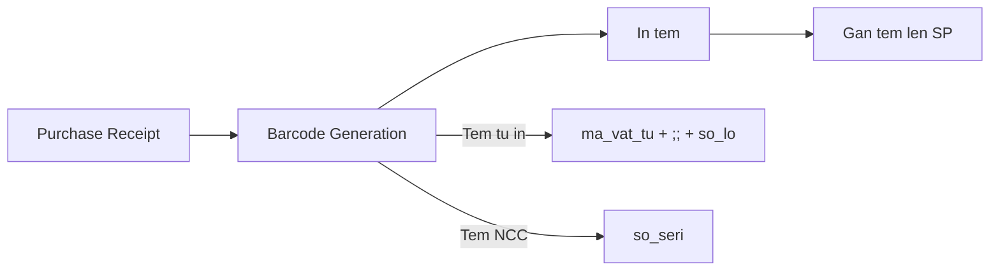
```mermaid
graph LR
    PR[Purchase Receipt] --> BC[Barcode Generation]
    BC --> PRINT[In tem]
    PRINT --> STICK[Gan tem len SP]

    BC -->|Tem tu in| B1["ma_vat_tu + ;; + so_lo"]
    BC -->|Tem NCC| B2["so_seri"]
```

**Su dung barcode tai cac module:**
- **Receipt (Nhap kho):** Quet barcode NCC de mapping voi he thong
- **Pick List:** Quet de xac nhan lay dung hang
- **Issue (Xuat kho):** Quet de xac nhan xuat dung hang
- **POS:** Quet de them SP vao hoa don ban le
- **Stock Reconciliation:** Quet de kiem ke

---

## 8. Kho ↔ CRM/Customer

> **Nguon:** ERP_SPECIFICATION.md Section 2.0 Buoc 7-8
> **ERPNext DocTypes:** Customer, Sales Order, Delivery Note

### 8.1. Credit check truoc khi xuat hang

Theo quy trinh ban buon (ERP_SPECIFICATION.md), truoc khi xuat hang can kiem tra:
1. **Han muc cong no** (credit_limit) - Buoc 7
2. **Hoa don qua han** - Buoc 8

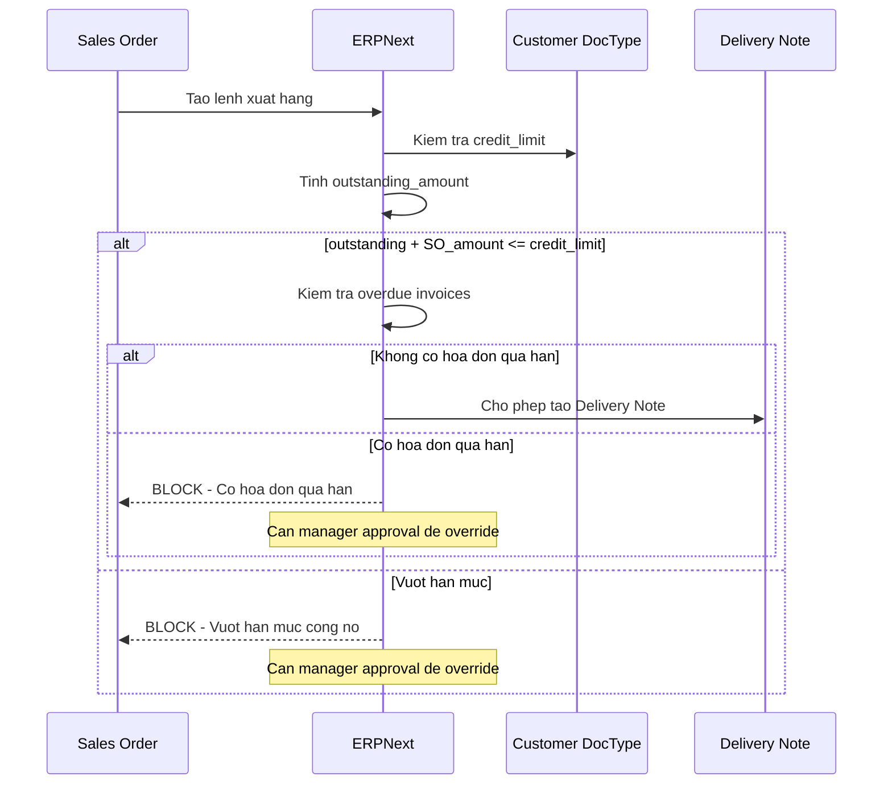
```mermaid
sequenceDiagram
    participant SO as Sales Order
    participant SYS as ERPNext
    participant CUST as Customer DocType
    participant DN as Delivery Note

    SO->>SYS: Tao lenh xuat hang
    SYS->>CUST: Kiem tra credit_limit
    SYS->>SYS: Tinh outstanding_amount

    alt outstanding + SO_amount <= credit_limit
        SYS->>SYS: Kiem tra overdue invoices
        alt Khong co hoa don qua han
            SYS->>DN: Cho phep tao Delivery Note
        else Co hoa don qua han
            SYS-->>SO: BLOCK - Co hoa don qua han
            Note over SYS: Can manager approval de override
        end
    else Vuot han muc
        SYS-->>SO: BLOCK - Vuot han muc cong no
        Note over SYS: Can manager approval de override
    end
```

### 8.2. Customer outstanding check

ERPNext cung cap utility de kiem tra du no khach hang:

```python
# ERPNext built-in
from erpnext.selling.doctype.customer.customer import get_credit_limit, get_customer_outstanding

# Lay han muc
credit_limit = get_credit_limit(customer, company)

# Lay du no hien tai
outstanding = get_customer_outstanding(customer, company)

# Kiem tra
if outstanding > credit_limit:
    frappe.throw("Vuot han muc cong no!")
```

### 8.3. Han muc cong no

| Field | DocType | Mo ta |
|-------|---------|-------|
| `credit_limit` | Customer | Han muc cong no tong |
| `bypass_credit_limit_check_at_sales_order` | Customer | Cho phep bo qua tai SO |
| `payment_terms` | Customer | Dieu khoan thanh toan |
| `default_currency` | Customer | VND |

**Cau hinh trong Selling Settings:**
- `Credit Limit` can be set per Customer or per Customer Group
- `Credit Controller`: Role co quyen override credit limit

### 8.4. Impact len stock operations

| Tinh huong | Anh huong Stock | Xu ly |
|-----------|-----------------|-------|
| KH vuot credit limit | Block tao DN | Manager approve → continue |
| KH co hoa don qua han | Block tao DN | KH thanh toan truoc → continue |
| KH bi hold (credit hold) | Block tao SO + DN | Giai toa hold → continue |
| KH da thanh toan | Tu dong giam outstanding | Cho phep tao DN moi |

---

## 9. Kho ↔ Website (Dong bo ton kho)

> **Nguon:** ERP_SPECIFICATION.md Section 7 (Ket noi Web ban hang)
> **Feature ID:** ERP-WEB-003 (Dong bo kho), ERP-WEB-005 (Dong bo ton kho real-time)

### 9.1. Yeu cau dong bo

Dong bo du lieu ton kho tu ERPNext sang website ban hang (WooCommerce hoac custom website) de:
- Hien thi trang thai "Con hang" / "Het hang"
- Hien thi so luong ton (tuy chon)
- Tu dong an san pham het hang
- Cap nhat khi co giao dich mua/ban

### 9.2. Co che dong bo

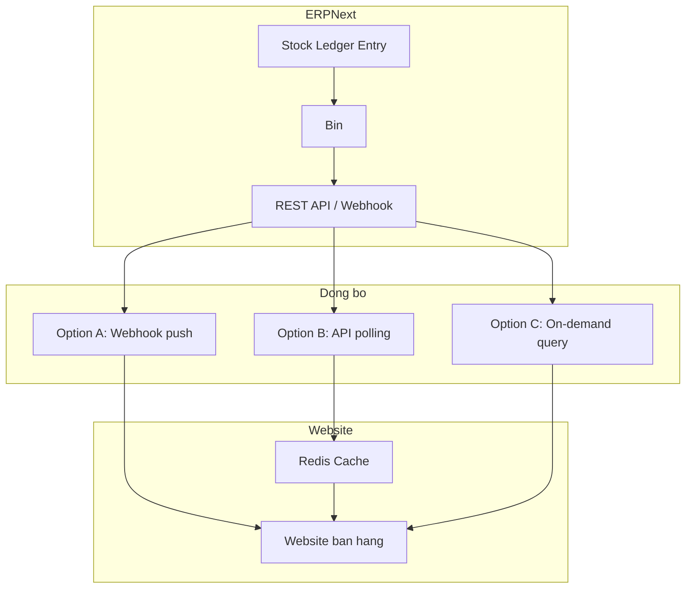
```mermaid
graph TB
    subgraph "ERPNext"
        SLE[Stock Ledger Entry]
        BIN[Bin]
        API[REST API / Webhook]
    end

    subgraph "Dong bo"
        OPT_A[Option A: Webhook push]
        OPT_B[Option B: API polling]
        OPT_C[Option C: On-demand query]
    end

    subgraph "Website"
        WEB[Website ban hang]
        CACHE[Redis Cache]
    end

    SLE --> BIN
    BIN --> API

    API --> OPT_A
    API --> OPT_B
    API --> OPT_C

    OPT_A --> WEB
    OPT_B --> CACHE
    CACHE --> WEB
    OPT_C --> WEB
```

**De xuat cho DCNET:** Su dung **Option A (Webhook)** ket hop **Option C (On-demand)**:

| Co che | Khi nao | Mo ta |
|--------|---------|-------|
| **Webhook** | Moi khi SLE duoc tao | ERPNext hook `on_update` cho Stock Ledger Entry → push to website |
| **On-demand** | Khi user xem trang san pham | Website goi API ERPNext de lay ton kho moi nhat |
| **Batch sync** | Moi dem 2:00 AM | Full sync toan bo ton kho de dam bao consistency |

### 9.3. Du lieu dong bo

| Field | Nguon ERPNext | Mo ta |
|-------|--------------|-------|
| `item_code` | Item.item_code | Ma san pham |
| `item_name` | Item.item_name | Ten san pham |
| `actual_qty` | Bin.actual_qty | Ton thuc te |
| `reserved_qty` | Bin.reserved_qty | Da giu cho don hang |
| `available_qty` | actual_qty - reserved_qty | **Ton kha dung** (hien thi) |
| `warehouse` | Bin.warehouse | Kho (chi dong bo kho website) |
| `in_stock` | available_qty > 0 | True/False |
| `stock_uom` | Item.stock_uom | Don vi tinh |

### 9.4. API Endpoint

```python
# ERPNext REST API - Lay ton kho
GET /api/method/erpnext.stock.utils.get_stock_balance_for
    ?item_code=PING-G430-DRIVER
    &warehouse=Kho Ban Le TL

# Response:
{
    "stock_qty": 15,
    "stock_value": 150000000
}

# Lay ton kho kha dung (custom API)
GET /api/method/dcnet_apps.stock.api.get_available_stock
    ?item_code=PING-G430-DRIVER
    &warehouse=Kho Ban Le TL

# Response:
{
    "actual_qty": 15,
    "reserved_qty": 3,
    "available_qty": 12,
    "in_stock": true
}
```

### 9.5. Performance considerations

| Van de | Giai phap |
|--------|-----------|
| Qua nhieu API calls | Cache ton kho trong Redis (TTL = 5 phut) |
| Website traffic cao | Rate limiting: max 100 req/min per endpoint |
| Dong bo cham | Webhook async (background job) |
| Data inconsistency | Batch sync moi dem de reconcile |
| Nhieu warehouse | Chi dong bo warehouse duoc danh dau "Website Warehouse" |

---

## 10. Batch & Serial Lifecycle Across Modules

> **Nguon:** ERP_SPECIFICATION.md Section 4.1.4-4.1.5, FEATURE_SPECIFICATION.md Section 8

### 10.1. Batch lifecycle

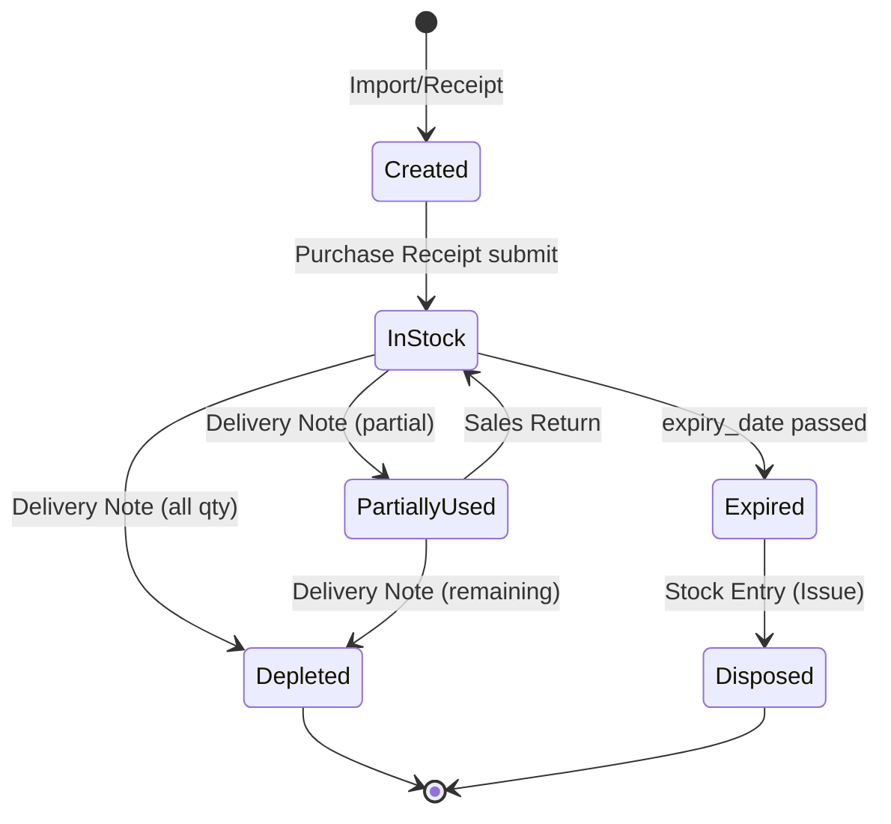
```mermaid
stateDiagram-v2
    [*] --> Created: Import/Receipt
    Created --> InStock: Purchase Receipt submit
    InStock --> PartiallyUsed: Delivery Note (partial)
    PartiallyUsed --> InStock: Sales Return
    InStock --> Depleted: Delivery Note (all qty)
    PartiallyUsed --> Depleted: Delivery Note (remaining)
    InStock --> Expired: expiry_date passed
    Depleted --> [*]
    Expired --> Disposed: Stock Entry (Issue)
    Disposed --> [*]
```

**Batch di chuyen qua cac module:**

| Giai doan | Module | DocType | Ghi nhan |
|-----------|--------|---------|---------|
| **Tao lo** | Import/Buying | Purchase Receipt | `batch_no` tao moi hoac auto |
| **Nhap kho** | Stock | Stock Ledger Entry | `batch_no` lien ket voi SLE |
| **Giu hang** | Selling | Stock Reservation Entry | Reserve theo batch cu the |
| **Xuat kho** | Selling | Delivery Note | `batch_no` trong DN Item |
| **Ban le** | POS | POS Invoice | `batch_no` scan hoac chon |
| **Tra hang** | Selling | DN Return | `batch_no` tu DN goc |
| **Kiem ke** | Stock | Stock Reconciliation | Kiem ke theo batch |
| **Trade-in** | Custom | Stock Entry | Nhap lo trade-in |
| **Ky gui** | Custom | Stock Entry | Transfer batch sang kho ky gui |
| **Het han** | Stock | Custom Alert | Canh bao batch sap het han |

### 10.2. Serial Number lifecycle

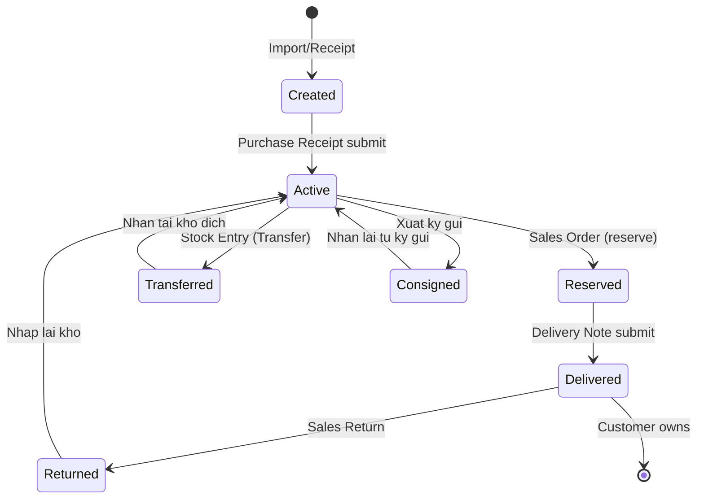
```mermaid
stateDiagram-v2
    [*] --> Created: Import/Receipt
    Created --> Active: Purchase Receipt submit
    Active --> Reserved: Sales Order (reserve)
    Reserved --> Delivered: Delivery Note submit
    Delivered --> Returned: Sales Return
    Returned --> Active: Nhap lai kho
    Active --> Transferred: Stock Entry (Transfer)
    Transferred --> Active: Nhan tai kho dich
    Active --> Consigned: Xuat ky gui
    Consigned --> Active: Nhan lai tu ky gui
    Delivered --> [*]: Customer owns
```

**Trang thai Serial trong DCNET** (theo ERP_SPECIFICATION.md Section 4.1.5):

| Trang thai | Mo ta | Bin impact |
|-----------|-------|-----------|
| **Ton** | Dang o trong kho | actual_qty includes |
| **Ky gui** | Da gui cho NM (consignment) | O kho ky gui |
| **Da ban** | Da giao cho khach hang | Khong con trong kho |

### 10.3. San pham nao can Batch? Serial?

| Loai SP | Batch | Serial | Ly do | VD |
|---------|:-----:|:------:|-------|-----|
| **Golf Clubs** (Gay) | Yes | **Yes** | Gia tri cao, can tracking tung cay | PING G430 Driver #A12345 |
| **Golf Balls** (Bong) | Yes | No | Tracking theo lo, khong tracking tung qua | Titleist ProV1 Batch-2026-01 |
| **Golf Bags** (Tui) | Yes | **Yes** | Gia tri trung-cao | Titleist StaDry Bag #B67890 |
| **Golf Apparel** (Quan ao) | Yes | No | Tracking theo lo (size, color) | Under Armour Polo Batch-SS2026 |
| **Golf Shoes** (Giay) | Yes | No | Tracking theo lo (size) | FootJoy Pro/SLX Batch-2026-02 |
| **Accessories** (Phu kien) | Yes | No | Tracking theo lo | Gang tay, kinh Batch-2026-03 |
| **Training Aids** (Dung cu tap) | No | No | Gia tri thap, khong can tracking | Tee, markers |

### 10.4. Barcode across modules

| Module | Su dung barcode | Hanh dong |
|--------|----------------|-----------|
| **Buying → Stock** (Receipt) | Quet barcode NCC | Matching voi Item trong he thong |
| **Stock** (Pick List) | Quet de xac nhan | Confirm dung SP, dung vi tri |
| **Selling → Stock** (Issue) | Quet khi xuat kho | Confirm serial/batch xuat |
| **POS** | Quet tai quay | Them SP vao hoa don ban le |
| **Stock Reconciliation** | Quet khi kiem ke | So sanh voi du lieu he thong |
| **Trade-in** | Quet SP cu | Nhan dien SP cu cua khach |
| **Consignment** | Quet khi giao/nhan | Confirm hang ky gui |

---

## 11. Stock Alerts & Notifications

> **Nguon:** ERP_SPECIFICATION.md Section 4.1 (ERP-WH-020 - Canh bao ton kho)

### 11.1. Reorder Level alerts

ERPNext built-in: Khi ton kho giam duoi muc reorder_level → tu dong tao **Material Request**.

| Field | DocType | Mo ta |
|-------|---------|-------|
| `reorder_level` | Item Reorder | Muc ton toi thieu |
| `reorder_qty` | Item Reorder | So luong dat lai |
| `warehouse` | Item Reorder | Kho ap dung |
| `material_request_type` | Item Reorder | "Purchase" hoac "Transfer" |

**Cau hinh:**
```
Stock Settings > Notify by Email on Creation of Automatic Material Request = Yes
Stock Settings > Auto Create Material Request = Yes (chay qua scheduled job)
```

### 11.2. Low stock alerts (Custom DCNET)

Ngoai reorder level, DCNET can canh bao khi ton thap hon safety stock:

```python
# Custom notification rule
# Trigger: on Stock Ledger Entry insert
# Condition: Bin.actual_qty < Item.safety_stock

Notification:
    Subject: "[DCNET] Canh bao ton kho thap: {item_name}"
    Recipients: Thu kho, Truong kho
    Message: "San pham {item_code} - {item_name} tai {warehouse}
              chi con {actual_qty} {stock_uom}.
              Muc an toan: {safety_stock}"
```

### 11.3. Expiring batch alerts (Custom DCNET)

Canh bao lo hang sap het han su dung (ap dung cho bong golf, gang tay):

```python
# Scheduled job: chay moi ngay 8:00 AM
# Query batches expiring trong 30/60/90 ngay toi

SELECT b.batch_id, b.item, b.expiry_date,
       DATEDIFF(b.expiry_date, CURDATE()) as days_remaining
FROM `tabBatch` b
WHERE b.expiry_date IS NOT NULL
  AND b.expiry_date BETWEEN CURDATE() AND DATE_ADD(CURDATE(), INTERVAL 90 DAY)
  AND EXISTS (SELECT 1 FROM `tabStock Ledger Entry` sle
              WHERE sle.batch_no = b.name AND sle.actual_qty > 0)
ORDER BY b.expiry_date
```

| Moc canh bao | Muc do | Hanh dong |
|-------------|--------|-----------|
| 90 ngay | Info | Thong bao thu kho |
| 60 ngay | Warning | Thong bao truong kho + ke hoach xuat |
| 30 ngay | Critical | Thong bao quan ly + de xuat giam gia/thanh ly |

### 11.4. Negative stock warning

| Setting | Gia tri de xuat | Mo ta |
|---------|-----------------|-------|
| `Allow Negative Stock` (global) | **No** | Khong cho phep ton am toan he thong |
| `allow_negative_stock` (per Warehouse) | Co the | Mot so kho dac biet cho phep |

Khi co giao dich lam ton kho am (va khong cho phep), ERPNext se throw error:
```
frappe.exceptions.ValidationError:
"Insufficient Stock for Item {item_code} in Warehouse {warehouse}.
Available: {available_qty}, Required: {required_qty}"
```

### 11.5. Slow-moving stock

Canh bao hang ton lau khong co giao dich (> 90 ngay):

```python
# Custom report: Slow-moving Stock Report
# Logic: Items co SLE cuoi cung > 90 ngay truoc

SELECT b.item_code, b.warehouse, b.actual_qty, b.stock_value,
       MAX(sle.posting_date) as last_movement,
       DATEDIFF(CURDATE(), MAX(sle.posting_date)) as days_idle
FROM `tabBin` b
LEFT JOIN `tabStock Ledger Entry` sle
    ON sle.item_code = b.item_code AND sle.warehouse = b.warehouse
WHERE b.actual_qty > 0
GROUP BY b.item_code, b.warehouse
HAVING days_idle > 90
ORDER BY days_idle DESC
```

---

## 12. Roles & Permissions per Module Connection

> **Nguon:** FEATURE_SPECIFICATION.md Section 12 (Role & Permission)
> **ERPNext:** Role-based permission, Workflow State permission

### 12.1. Permission matrix

| Role | Purchase Receipt (Buying→Stock) | Delivery Note (Selling→Stock) | GL Entry (Accounting→Stock) | Stock Entry | Consignment | Trade-in |
|------|:------:|:-------:|:---------:|:-----------:|:-----------:|:---------:|
| **Thu kho** | Create, Submit | Create, Submit | View only | Create, Submit | Execute transfer | Nhap SP cu |
| **Truong kho** | Create, Submit, Amend | Create, Submit, Amend | View only | Create, Submit, Amend | Approve | Approve |
| **NV Mua hang** | Create | View only | View only | View only | View only | - |
| **NV Ban hang** | - | Create | View only | - | View SO ky gui | Tao Trade-in Order |
| **Ke toan** | View, Cancel | View, Cancel | Create, View | View only | View, Approve invoice | View |
| **Ke toan truong** | All | All | All | All | Approve all | Approve all |
| **Quan ly** | All | All | All | All | All | All |

### 12.2. Workflow permissions lien quan Stock

| Workflow State | Ai chuyen trang thai | Module lien quan |
|---------------|---------------------|-----------------|
| PR: Draft → Submitted | Thu kho | Buying → Stock |
| PR: Submitted → Cancelled | Ke toan truong | Buying → Stock (dao) |
| DN: Draft → Submitted | Thu kho | Selling → Stock |
| DN: Submitted → Cancelled | Ke toan truong | Selling → Stock (dao) |
| SE: Draft → Submitted | Thu kho | Stock internal |
| SE: Transfer Pending → Received | Thu kho nhan | Consignment |
| Consignment: Pending → Invoiced | Ke toan | Consignment → Accounting |

### 12.3. Warehouse-level permission

ERPNext cho phep phan quyen theo Warehouse:

```python
# User Permission
{
    "user": "thukho_tl@dcnet.vn",
    "allow": "Warehouse",
    "for_value": "Kho Tong TL"
}
# → User nay chi thao tac duoc voi "Kho Tong TL"
```

**De xuat phan quyen Warehouse cho DCNET:**

| User Group | Warehouse | Ly do |
|-----------|-----------|-------|
| Thu kho TL | Kho Tong TL, Kho Ban Le TL, Kho Trade-in TL | Kho cua TL |
| Thu kho NM | Kho Ban Le NM, Kho Xuat HD NM | Kho cua NM |
| Thu kho Ky gui TL | Kho Ky Gui TL | Rieng kho ky gui TL |
| Thu kho Ky gui NM | Kho Ky Gui NM | Rieng kho ky gui NM |
| Ke toan TL | All TL warehouses | Xem tat ca kho TL |
| Ke toan NM | All NM warehouses | Xem tat ca kho NM |
| Admin | All warehouses | Full access |

---

## 13. Tom tat & Recommendation

### 13.1. Ma tran ket noi tong hop

| Module | Ket noi | DocType | Direction | Tan suat | Custom |
|--------|---------|---------|-----------|----------|--------|
| Buying | PR, PI, PO | Purchase Receipt → SLE → GL | Buying → Stock → Accounting | Hang ngay | Khong |
| Selling | DN, SI, SO | Delivery Note → SLE → GL | Selling → Stock → Accounting | Hang ngay | Khong |
| Accounting | GL, JE | SLE → GL Entry (auto) | Stock → Accounting (auto) | Moi transaction | Khong |
| POS | POS Invoice | POS → SLE + GL (1 buoc) | POS → Stock + Accounting | Hang ngay | Khong |
| Trade-in | Stock Entry | SE (Receipt + Issue) → SLE → GL | Custom → Stock → Accounting | Khi co trade-in | **Co** |
| Consignment | Stock Entry | SE (Transfer) → SLE → GL | Custom → Stock → Accounting | Hang thang | **Co** |
| Import | PR + LCV | PR → SLE, LCV → revalue → GL | Buying → Stock → Accounting | Theo dot nhap | Khong |
| CRM | Credit check | Customer → SO → DN block | CRM → Selling → Stock | Moi ban buon | It |
| Website | API/Webhook | Bin → API → Website | Stock → Website | Real-time | **Co** |

### 13.2. Thu tu trien khai de xuat

Dua tren dependency va muc do phuc tap:

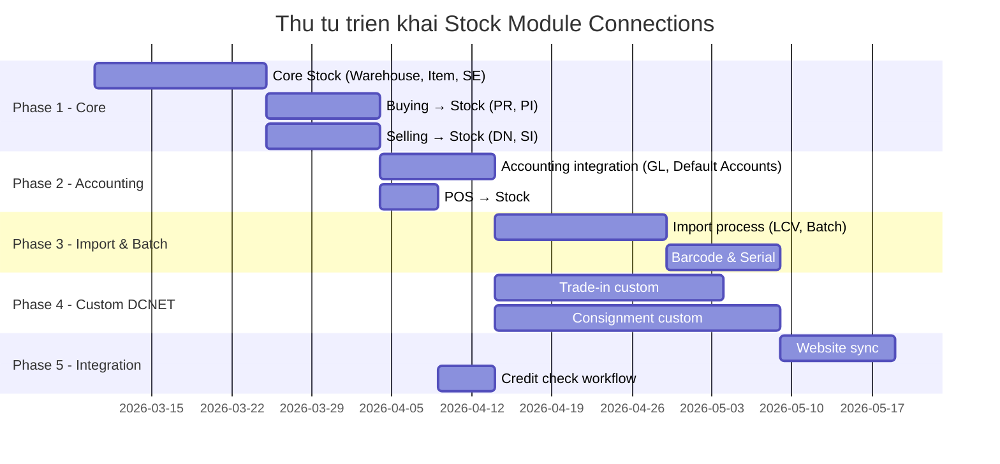
```mermaid
gantt
    title Thu tu trien khai Stock Module Connections
    dateFormat  YYYY-MM-DD
    section Phase 1 - Core
    Core Stock (Warehouse, Item, SE)           :p1a, 2026-03-10, 15d
    Buying → Stock (PR, PI)                     :p1b, after p1a, 10d
    Selling → Stock (DN, SI)                    :p1c, after p1a, 10d
    section Phase 2 - Accounting
    Accounting integration (GL, Default Accounts):p2a, after p1b, 10d
    POS → Stock                                 :p2b, after p1c, 5d
    section Phase 3 - Import & Batch
    Import process (LCV, Batch)                 :p3a, after p2a, 15d
    Barcode & Serial                            :p3b, after p3a, 10d
    section Phase 4 - Custom DCNET
    Trade-in custom                             :p4a, after p2a, 20d
    Consignment custom                          :p4b, after p2a, 25d
    section Phase 5 - Integration
    Website sync                                :p5a, after p3b, 10d
    Credit check workflow                       :p5b, after p2b, 5d
```

**Chi tiet:**

| Giai doan | Noi dung | Thoi gian | Phu thuoc |
|-----------|---------|-----------|-----------|
| **1. Core Stock** | Warehouse setup, Item config, Stock Entry | 2 tuan | Khong |
| **2. Buying → Stock** | PO → PR → SLE → GL | 1.5 tuan | Phase 1 |
| **3. Selling → Stock** | SO → DN → SLE → GL + POS | 1.5 tuan | Phase 1 |
| **4. Accounting** | Default Accounts, COA mapping, Perpetual Inventory test | 1.5 tuan | Phase 2-3 |
| **5. Import process** | LCV, Batch creation, multi-currency PO | 2 tuan | Phase 4 |
| **6. Barcode** | Barcode generation, label printing, scan integration | 1.5 tuan | Phase 5 |
| **7. Trade-in** | Custom DocType, workflow, Stock Entry integration | 3 tuan | Phase 4 |
| **8. Consignment** | Custom 5-step workflow, monthly reconciliation | 4-5 tuan | Phase 4 |
| **9. Website sync** | API, webhook, cache | 1.5 tuan | Phase 6 |
| **10. Credit check** | Customer credit limit, approval workflow | 1 tuan | Phase 3 |

### 13.3. Rui ro chinh

| # | Rui ro | Muc do | Giam thieu |
|---|--------|--------|-----------|
| 1 | **Phuong phap gia von** - ERPNext khong co "trung binh thang", khach yeu cau trung binh thang | **Cao** | Xac nhan voi khach: chap nhan Moving Average? Neu khong, can custom calculator chay cuoi thang |
| 2 | **Consignment accounting** - Phuc tap, 2 company rieng, off-balance-sheet | **Cao** | Design ky, test end-to-end voi ke toan truong. Pilot 1 thang truoc go-live |
| 3 | **Perpetual Inventory sai TK** - Thieu Account Type trong COA | **Cao** | Da fix trong COA v2. Bat buoc test GL entry sau moi loai giao dich |
| 4 | **Barcode integration** - Can tich hop may scan, nhieu format | **Trung binh** | Chon 1 format chuan (Code128), test voi may scan cua khach |
| 5 | **Website sync performance** - Nhieu giao dich → nhieu webhook | **Trung binh** | Cache + batch sync + rate limiting |
| 6 | **Multi-company stock transfer** - TL va NM la 2 company rieng | **Trung binh** | ERPNext ho tro Inter Company Transaction. Test ky luong Consignment |
| 7 | **Data migration** - Ton kho dau ky tu BRAVO | **Cao** | Stock Reconciliation de nhap opening. Can mapping Item code BRAVO → ERPNext |

### 13.4. Checklist truoc khi trien khai

- [ ] Xac nhan phuong phap gia von voi khach (Moving Average vs Trung binh thang)
- [ ] Import COA v2 va verify Account Types
- [ ] Setup Warehouse hierarchy cho ca 2 company
- [ ] Cau hinh Default Accounts trong Company DocType
- [ ] Cau hinh Stock Settings (Perpetual Inventory ON, Valuation Method)
- [ ] Tao Item Groups va Item templates cho 7 loai SP golf
- [ ] Setup Batch naming rule
- [ ] Setup Serial No naming rule
- [ ] Xac nhan barcode format voi khach
- [ ] Design Consignment Order DocType
- [ ] Design Trade-in Order DocType
- [ ] Setup User Permissions theo Warehouse
- [ ] Test end-to-end: PO → PR → SLE → GL → SI → DN → PE

---

## Tham chieu

| Tai lieu | Duong dan |
|---------|-----------|
| Warehouse Workflow | `docs/modules/07-kho-hang/analysis/WAREHOUSE_WORKFLOW.md` |
| COA Analysis | `docs/accounting/COA_ANALYSIS.md` |
| ERP Specification | `docs/feature/ERP_SPECIFICATION.md` (Section 2, 3, 4, 5) |
| CRM Feature Specification | `docs/feature/FEATURE_SPECIFICATION.md` (Section 8, 18) |
| Import Process | `docs/feature/IMPORT_PROCESS_SPECIFICATION.md` |
| Module Gap Analysis | `docs/erpnext-flows/MODULE_GAP_ANALYSIS.md` |
| Sales Order Ecosystem | `docs/erpnext-flows/SALES_ORDER_ECOSYSTEM_WORKFLOW.md` |
| Pricing Wholesale/Retail | `docs/erpnext-flows/PRICING_WHOLESALE_RETAIL_WORKFLOW.md` |
| SRS Thang Long TM | `docs/contract/DCNET_SRS_TM.md` (Section 3.7, 3.12, 3.14) |
| SRS Nhat Minh Sport | `docs/contract/DCNET_SRS_NM.md` (Section 3.7, 3.12) |

---

**Nguoi thuc hien:** Claude Code (AI)
**Review:** (Cho review)
**Ngay:** 16/02/2026
