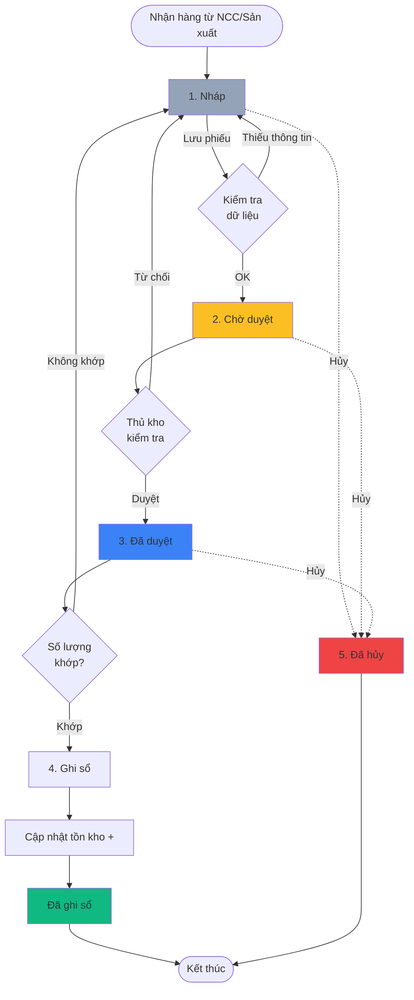
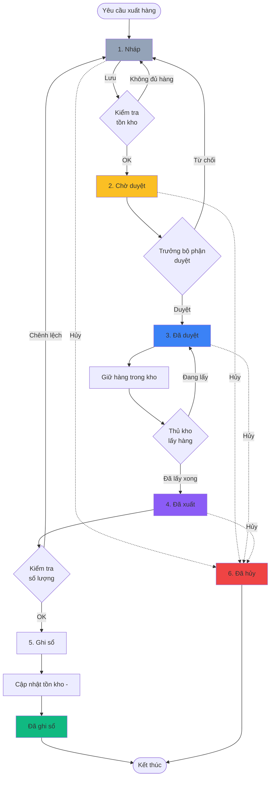
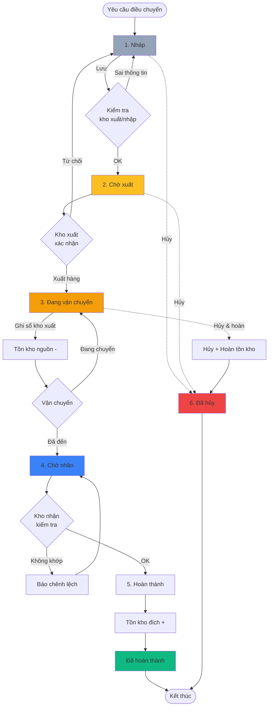
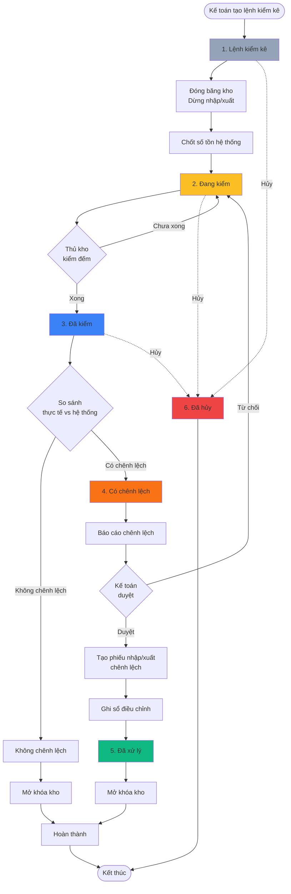
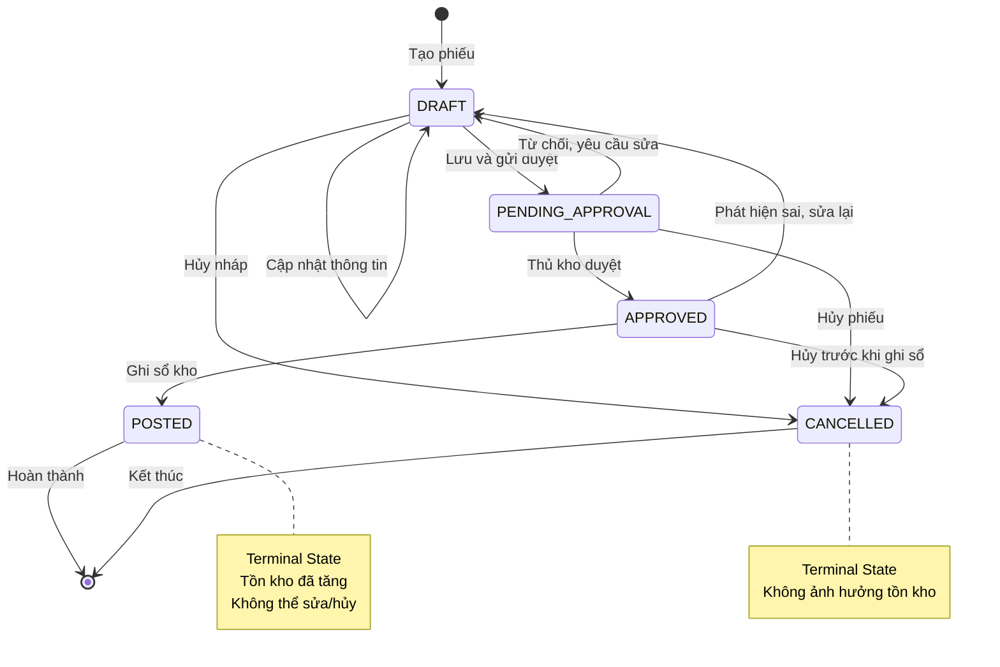
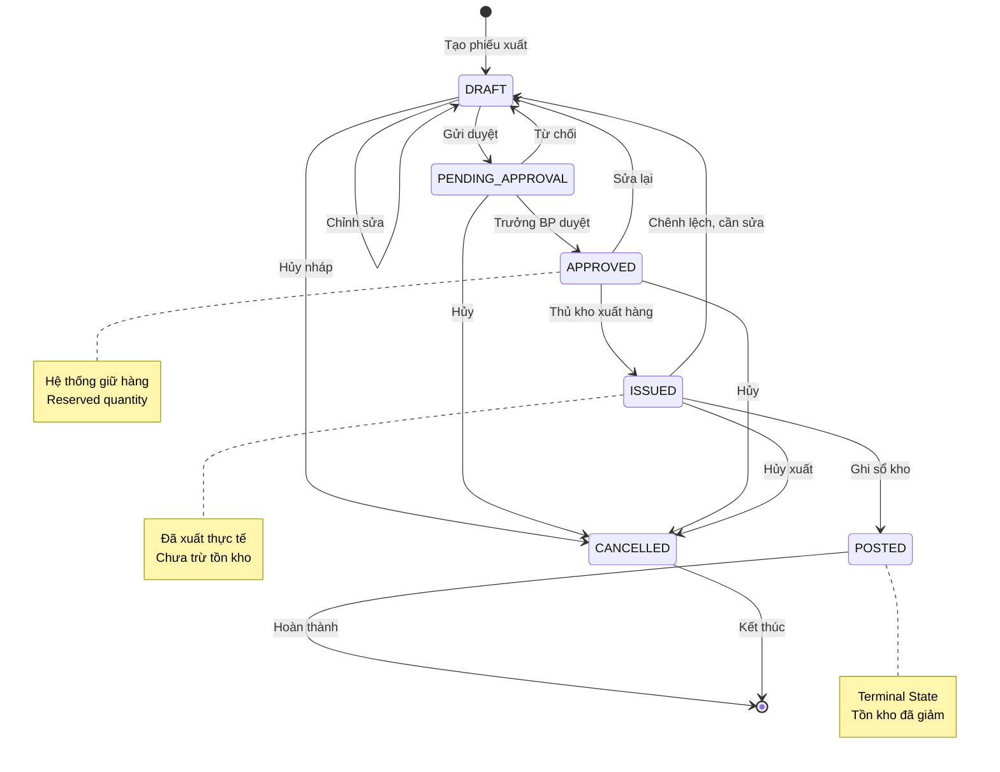
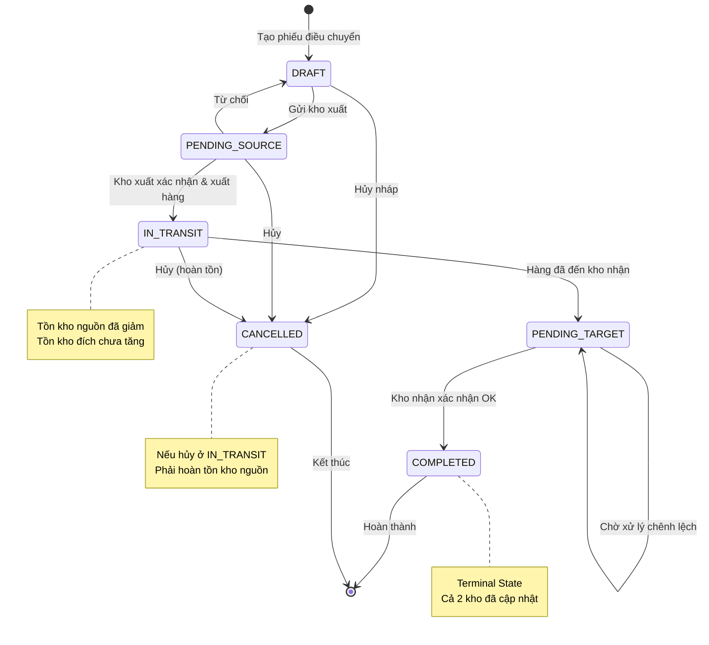
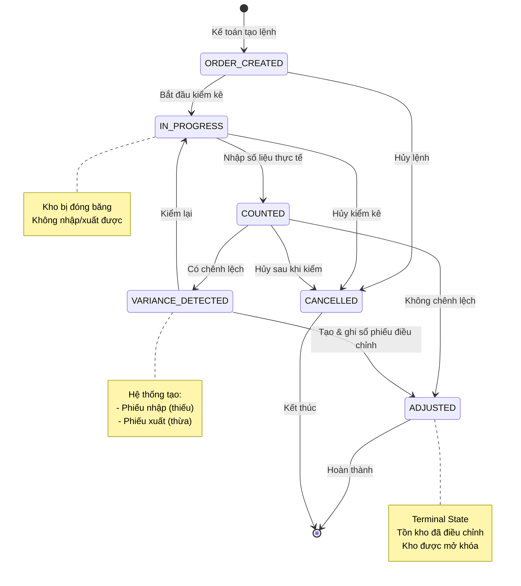

# Module Warehouse - Trạng thái (Status)

> **Phiên bản**: v1.0 - Comprehensive
> **Ngày cập nhật**: 2026-01-14
> **Trạng thái**: Draft - Chờ khách hàng Nhật Minh phê duyệt
> **Nguồn**: ERP_SPECIFICATION.md Section 4 (lines 455-641)

---

## 📋 Tổng quan

Module Warehouse quản lý 4 loại chứng từ chính, mỗi loại có workflow và status riêng:

1. **Phiếu nhập kho** (Goods Receipt / Stock Entry IN)
2. **Phiếu xuất kho** (Goods Issue / Stock Entry OUT)
3. **Phiếu điều chuyển kho** (Stock Transfer)
4. **Phiếu kiểm kê** (Stock Reconciliation)

Mỗi chứng từ có quy trình phê duyệt, ghi sổ (posting), và ảnh hưởng đến số tồn kho.

---

## 📋 1. Danh sách trạng thái theo loại chứng từ

### 1.1. Phiếu nhập kho (Goods Receipt)

| # | Trạng thái | Code | Màu | Mô tả | Loại |
| --- | --- | --- | --- | --- | --- |
| 1 | **Nháp** | `DRAFT` | #94a3b8 | Phiếu đang soạn thảo, chưa lưu | Active |
| 2 | **Chờ duyệt** | `PENDING_APPROVAL` | #fbbf24 | Đã lưu, chờ thủ kho/quản lý duyệt | Active |
| 3 | **Đã duyệt** | `APPROVED` | #3b82f6 | Đã được phê duyệt, chưa ghi sổ | Active |
| 4 | **Đã ghi sổ** | `POSTED` | #10b981 | Đã ghi nhận vào sổ kho (tồn kho +) | Terminal |
| 5 | **Đã hủy** | `CANCELLED` | #ef4444 | Hủy phiếu (không tính tồn) | Terminal |

### 1.2. Phiếu xuất kho (Goods Issue)

| # | Trạng thái | Code | Màu | Mô tả | Loại |
| --- | --- | --- | --- | --- | --- |
| 1 | **Nháp** | `DRAFT` | #94a3b8 | Phiếu đang soạn thảo | Active |
| 2 | **Chờ duyệt** | `PENDING_APPROVAL` | #fbbf24 | Chờ thủ kho/quản lý duyệt | Active |
| 3 | **Đã duyệt** | `APPROVED` | #3b82f6 | Đã duyệt, chờ xuất hàng | Active |
| 4 | **Đã xuất** | `ISSUED` | #8b5cf6 | Đã xuất hàng thực tế, chưa ghi sổ | Active |
| 5 | **Đã ghi sổ** | `POSTED` | #10b981 | Đã ghi sổ kho (tồn kho -) | Terminal |
| 6 | **Đã hủy** | `CANCELLED` | #ef4444 | Hủy phiếu | Terminal |

### 1.3. Phiếu điều chuyển kho (Stock Transfer)

| # | Trạng thái | Code | Màu | Mô tả | Loại |
| --- | --- | --- | --- | --- | --- |
| 1 | **Nháp** | `DRAFT` | #94a3b8 | Phiếu đang soạn thảo | Active |
| 2 | **Chờ xuất** | `PENDING_SOURCE` | #fbbf24 | Chờ kho xuất xác nhận | Active |
| 3 | **Đã xuất** | `IN_TRANSIT` | #f59e0b | Đã xuất từ kho nguồn, đang vận chuyển | Active |
| 4 | **Chờ nhận** | `PENDING_TARGET` | #3b82f6 | Hàng đã đến, chờ kho nhận xác nhận | Active |
| 5 | **Đã hoàn thành** | `COMPLETED` | #10b981 | Đã nhận và ghi sổ 2 bên | Terminal |
| 6 | **Đã hủy** | `CANCELLED` | #ef4444 | Hủy điều chuyển | Terminal |

### 1.4. Phiếu kiểm kê (Stock Reconciliation)

| # | Trạng thái | Code | Màu | Mô tả | Loại |
| --- | --- | --- | --- | --- | --- |
| 1 | **Lệnh kiểm kê** | `ORDER_CREATED` | #94a3b8 | Kế toán tạo lệnh kiểm kê | Active |
| 2 | **Đang kiểm** | `IN_PROGRESS` | #fbbf24 | Thủ kho đang thực hiện kiểm | Active |
| 3 | **Đã kiểm** | `COUNTED` | #3b82f6 | Đã nhập số liệu thực tế | Active |
| 4 | **Có chênh lệch** | `VARIANCE_DETECTED` | #f97316 | Phát hiện chênh lệch | Active |
| 5 | **Đã xử lý** | `ADJUSTED` | #10b981 | Đã tạo phiếu nhập/xuất chênh lệch | Terminal |
| 6 | **Đã hủy** | `CANCELLED` | #ef4444 | Hủy kiểm kê | Terminal |

### Phân loại

- **Active**: Trạng thái hoạt động, có thể chuyển sang trạng thái khác
- **Terminal**: Trạng thái kết thúc, không thể chuyển đổi (chỉ Admin mới sửa được)

---

## 🔄 2. Workflow chi tiết theo loại chứng từ

### 2.1. Workflow: Phiếu nhập kho



### 2.2. Workflow: Phiếu xuất kho



### 2.3. Workflow: Phiếu điều chuyển kho



### 2.4. Workflow: Phiếu kiểm kê



---

## 🔄 3. State Machine Diagrams

### 3.1. State Machine: Phiếu nhập kho



### 3.2. State Machine: Phiếu xuất kho



### 3.3. State Machine: Phiếu điều chuyển



### 3.4. State Machine: Phiếu kiểm kê



---

## 🗄️ 4. Database Schema - Status Related

### 4.1. Bảng `stock_entries` - Phiếu nhập/xuất kho

```sql
CREATE TABLE stock_entries (
    id BIGINT PRIMARY KEY AUTO_INCREMENT,

    -- Basic info
    entry_type ENUM('RECEIPT', 'ISSUE', 'TRANSFER', 'OPENING', 'ADJUSTMENT') NOT NULL,
    entry_number VARCHAR(50) UNIQUE NOT NULL COMMENT 'Số phiếu (auto-generated)',
    entry_date DATE NOT NULL COMMENT 'Ngày lập phiếu',

    -- Status fields
    status ENUM('DRAFT', 'PENDING_APPROVAL', 'APPROVED', 'ISSUED', 'POSTED', 'CANCELLED')
        DEFAULT 'DRAFT' NOT NULL,

    -- Warehouse info
    source_warehouse_id BIGINT NULL COMMENT 'Kho xuất (cho ISSUE/TRANSFER)',
    target_warehouse_id BIGINT NULL COMMENT 'Kho nhập (cho RECEIPT/TRANSFER)',

    -- Reference documents
    purchase_order_id BIGINT NULL COMMENT 'Tham chiếu PO (nhập mua)',
    sales_order_id BIGINT NULL COMMENT 'Tham chiếu SO (xuất bán)',
    supplier_id BIGINT NULL COMMENT 'Nhà cung cấp (nhập)',
    customer_id BIGINT NULL COMMENT 'Khách hàng (xuất)',

    -- Details
    description TEXT NULL COMMENT 'Nội dung/Lý do',
    notes TEXT NULL COMMENT 'Ghi chú',

    -- Approval workflow
    created_by BIGINT NOT NULL,
    approved_by BIGINT NULL,
    approved_at TIMESTAMP NULL,
    posted_by BIGINT NULL,
    posted_at TIMESTAMP NULL COMMENT 'Ngày ghi sổ',

    -- Accounting
    is_cost_calculated BOOLEAN DEFAULT FALSE COMMENT 'Đã tính giá vốn chưa',
    cost_calculation_date DATE NULL,

    -- Timestamps
    created_at TIMESTAMP DEFAULT CURRENT_TIMESTAMP,
    updated_at TIMESTAMP DEFAULT CURRENT_TIMESTAMP ON UPDATE CURRENT_TIMESTAMP,
    cancelled_at TIMESTAMP NULL,

    -- Indexes
    INDEX idx_status (status),
    INDEX idx_entry_type_status (entry_type, status),
    INDEX idx_entry_date (entry_date),
    INDEX idx_posted_at (posted_at),
    INDEX idx_source_warehouse (source_warehouse_id),
    INDEX idx_target_warehouse (target_warehouse_id),
    INDEX idx_purchase_order (purchase_order_id),
    INDEX idx_sales_order (sales_order_id),

    FOREIGN KEY (source_warehouse_id) REFERENCES warehouses(id),
    FOREIGN KEY (target_warehouse_id) REFERENCES warehouses(id),
    FOREIGN KEY (created_by) REFERENCES users(id),
    FOREIGN KEY (approved_by) REFERENCES users(id)
);
```

### 4.2. Bảng `stock_entry_items` - Chi tiết phiếu

```sql
CREATE TABLE stock_entry_items (
    id BIGINT PRIMARY KEY AUTO_INCREMENT,
    stock_entry_id BIGINT NOT NULL,

    -- Product info
    product_id BIGINT NOT NULL,
    product_name VARCHAR(255) NOT NULL,
    uom VARCHAR(50) NOT NULL COMMENT 'Đơn vị tính',

    -- Quantity
    quantity DECIMAL(15, 3) NOT NULL,
    actual_quantity DECIMAL(15, 3) NULL COMMENT 'SL thực tế (khi xuất/kiểm)',

    -- Lot & Serial tracking
    lot_number VARCHAR(100) NULL COMMENT 'Số lô',
    serial_numbers JSON NULL COMMENT 'Danh sách serial (array)',

    -- Location
    shelf_location VARCHAR(100) NULL COMMENT 'Vị trí kệ',

    -- Pricing
    unit_price DECIMAL(15, 2) NULL COMMENT 'Đơn giá',
    total_amount DECIMAL(15, 2) NULL COMMENT 'Thành tiền',

    -- Valuation (for costing)
    valuation_rate DECIMAL(15, 2) NULL COMMENT 'Giá vốn',
    stock_value DECIMAL(15, 2) NULL COMMENT 'Giá trị tồn',

    created_at TIMESTAMP DEFAULT CURRENT_TIMESTAMP,

    INDEX idx_stock_entry (stock_entry_id),
    INDEX idx_product (product_id),
    INDEX idx_lot (lot_number),

    FOREIGN KEY (stock_entry_id) REFERENCES stock_entries(id) ON DELETE CASCADE,
    FOREIGN KEY (product_id) REFERENCES products(id)
);
```

### 4.3. Bảng `stock_transfers` - Phiếu điều chuyển kho

```sql
CREATE TABLE stock_transfers (
    id BIGINT PRIMARY KEY AUTO_INCREMENT,

    -- Basic info
    transfer_number VARCHAR(50) UNIQUE NOT NULL,
    transfer_date DATE NOT NULL,

    -- Status fields
    status ENUM('DRAFT', 'PENDING_SOURCE', 'IN_TRANSIT', 'PENDING_TARGET', 'COMPLETED', 'CANCELLED')
        DEFAULT 'DRAFT' NOT NULL,

    -- Warehouses
    source_warehouse_id BIGINT NOT NULL COMMENT 'Kho xuất',
    target_warehouse_id BIGINT NOT NULL COMMENT 'Kho nhận',
    intermediate_warehouse_id BIGINT NULL COMMENT 'Kho trung gian (nếu có)',

    -- Request reference
    internal_request_id BIGINT NULL COMMENT 'Đề nghị xuất kho nội bộ',

    -- Details
    description TEXT NULL,
    shipping_method VARCHAR(100) NULL COMMENT 'Phương thức vận chuyển',
    tracking_number VARCHAR(100) NULL COMMENT 'Mã vận đơn',

    -- Workflow tracking
    created_by BIGINT NOT NULL,
    source_approved_by BIGINT NULL,
    source_approved_at TIMESTAMP NULL,
    target_received_by BIGINT NULL,
    target_received_at TIMESTAMP NULL,
    completed_at TIMESTAMP NULL,

    -- Stock ledger references
    source_stock_entry_id BIGINT NULL COMMENT 'Phiếu xuất tại kho nguồn',
    target_stock_entry_id BIGINT NULL COMMENT 'Phiếu nhập tại kho đích',

    -- Variance handling
    has_variance BOOLEAN DEFAULT FALSE COMMENT 'Có chênh lệch không',
    variance_notes TEXT NULL,

    created_at TIMESTAMP DEFAULT CURRENT_TIMESTAMP,
    updated_at TIMESTAMP DEFAULT CURRENT_TIMESTAMP ON UPDATE CURRENT_TIMESTAMP,

    INDEX idx_status (status),
    INDEX idx_source_warehouse (source_warehouse_id),
    INDEX idx_target_warehouse (target_warehouse_id),
    INDEX idx_transfer_date (transfer_date),

    FOREIGN KEY (source_warehouse_id) REFERENCES warehouses(id),
    FOREIGN KEY (target_warehouse_id) REFERENCES warehouses(id),
    FOREIGN KEY (source_stock_entry_id) REFERENCES stock_entries(id),
    FOREIGN KEY (target_stock_entry_id) REFERENCES stock_entries(id)
);
```

### 4.4. Bảng `stock_reconciliations` - Phiếu kiểm kê

```sql
CREATE TABLE stock_reconciliations (
    id BIGINT PRIMARY KEY AUTO_INCREMENT,

    -- Basic info
    reconciliation_number VARCHAR(50) UNIQUE NOT NULL,
    reconciliation_date DATE NOT NULL,

    -- Status fields
    status ENUM('ORDER_CREATED', 'IN_PROGRESS', 'COUNTED', 'VARIANCE_DETECTED', 'ADJUSTED', 'CANCELLED')
        DEFAULT 'ORDER_CREATED' NOT NULL,

    -- Warehouse
    warehouse_id BIGINT NOT NULL,

    -- Reconciliation type
    recon_type ENUM('PERIODIC', 'SPOT_CHECK', 'YEAR_END') DEFAULT 'PERIODIC',

    -- Details
    description TEXT NULL,

    -- Freeze period
    freeze_started_at TIMESTAMP NULL COMMENT 'Thời điểm đóng băng kho',
    freeze_ended_at TIMESTAMP NULL COMMENT 'Thời điểm mở khóa kho',
    is_warehouse_frozen BOOLEAN DEFAULT FALSE,

    -- System snapshot
    system_snapshot_at TIMESTAMP NULL COMMENT 'Thời điểm chốt tồn hệ thống',

    -- Variance summary
    total_variance_qty DECIMAL(15, 3) DEFAULT 0 COMMENT 'Tổng SL chênh lệch',
    total_variance_value DECIMAL(15, 2) DEFAULT 0 COMMENT 'Tổng giá trị chênh',

    -- Adjustment references
    adjustment_receipt_id BIGINT NULL COMMENT 'Phiếu nhập chênh lệch (thiếu)',
    adjustment_issue_id BIGINT NULL COMMENT 'Phiếu xuất chênh lệch (thừa)',

    -- Workflow
    created_by BIGINT NOT NULL COMMENT 'Kế toán tạo lệnh',
    counted_by BIGINT NULL COMMENT 'Thủ kho kiểm đếm',
    counted_at TIMESTAMP NULL,
    approved_by BIGINT NULL COMMENT 'Kế toán duyệt chênh lệch',
    approved_at TIMESTAMP NULL,

    created_at TIMESTAMP DEFAULT CURRENT_TIMESTAMP,
    updated_at TIMESTAMP DEFAULT CURRENT_TIMESTAMP ON UPDATE CURRENT_TIMESTAMP,

    INDEX idx_status (status),
    INDEX idx_warehouse (warehouse_id),
    INDEX idx_reconciliation_date (reconciliation_date),
    INDEX idx_frozen (is_warehouse_frozen),

    FOREIGN KEY (warehouse_id) REFERENCES warehouses(id),
    FOREIGN KEY (adjustment_receipt_id) REFERENCES stock_entries(id),
    FOREIGN KEY (adjustment_issue_id) REFERENCES stock_entries(id)
);
```

### 4.5. Bảng `stock_reconciliation_items` - Chi tiết kiểm kê

```sql
CREATE TABLE stock_reconciliation_items (
    id BIGINT PRIMARY KEY AUTO_INCREMENT,
    stock_reconciliation_id BIGINT NOT NULL,

    -- Product
    product_id BIGINT NOT NULL,
    lot_number VARCHAR(100) NULL,
    serial_number VARCHAR(100) NULL,
    shelf_location VARCHAR(100) NULL,

    -- System quantity (snapshot)
    system_quantity DECIMAL(15, 3) NOT NULL COMMENT 'Tồn kho hệ thống',
    system_value DECIMAL(15, 2) NULL COMMENT 'Giá trị hệ thống',

    -- Actual quantity (counted)
    actual_quantity DECIMAL(15, 3) NULL COMMENT 'Số lượng thực tế',

    -- Variance
    variance_quantity DECIMAL(15, 3) NULL COMMENT 'Chênh lệch SL',
    variance_value DECIMAL(15, 2) NULL COMMENT 'Chênh lệch giá trị',
    variance_percentage DECIMAL(5, 2) NULL COMMENT '% chênh lệch',

    -- Notes
    remarks TEXT NULL COMMENT 'Ghi chú (lý do chênh lệch)',

    created_at TIMESTAMP DEFAULT CURRENT_TIMESTAMP,

    INDEX idx_reconciliation (stock_reconciliation_id),
    INDEX idx_product (product_id),
    INDEX idx_lot (lot_number),

    FOREIGN KEY (stock_reconciliation_id) REFERENCES stock_reconciliations(id) ON DELETE CASCADE,
    FOREIGN KEY (product_id) REFERENCES products(id)
);
```

### 4.6. Bảng `stock_ledger` - Sổ kho (Audit Trail)

```sql
CREATE TABLE stock_ledger (
    id BIGINT PRIMARY KEY AUTO_INCREMENT,

    -- Transaction reference
    voucher_type ENUM('STOCK_ENTRY', 'STOCK_TRANSFER', 'STOCK_RECONCILIATION'),
    voucher_id BIGINT NOT NULL COMMENT 'ID của phiếu gốc',
    voucher_number VARCHAR(50) NOT NULL COMMENT 'Số phiếu',

    -- Transaction details
    posting_date DATE NOT NULL,
    posting_time TIME NOT NULL,

    -- Product & Location
    product_id BIGINT NOT NULL,
    warehouse_id BIGINT NOT NULL,
    lot_number VARCHAR(100) NULL,
    serial_number VARCHAR(100) NULL,

    -- Quantity movement
    actual_qty DECIMAL(15, 3) NOT NULL COMMENT 'Số lượng nhập (+) / xuất (-)',
    qty_after_transaction DECIMAL(15, 3) NOT NULL COMMENT 'Tồn kho sau giao dịch',

    -- Valuation
    incoming_rate DECIMAL(15, 2) NULL COMMENT 'Đơn giá nhập',
    valuation_rate DECIMAL(15, 2) NULL COMMENT 'Giá vốn',
    stock_value DECIMAL(15, 2) NULL COMMENT 'Giá trị tồn',
    stock_value_difference DECIMAL(15, 2) NULL COMMENT 'Chênh lệch giá trị',

    -- User tracking
    created_by BIGINT NOT NULL,
    created_at TIMESTAMP DEFAULT CURRENT_TIMESTAMP,

    INDEX idx_voucher (voucher_type, voucher_id),
    INDEX idx_product_warehouse (product_id, warehouse_id),
    INDEX idx_posting_date (posting_date),
    INDEX idx_warehouse_date (warehouse_id, posting_date),

    FOREIGN KEY (product_id) REFERENCES products(id),
    FOREIGN KEY (warehouse_id) REFERENCES warehouses(id)
);
```

### 4.7. Bảng `activity_log` - Lịch sử thay đổi

```sql
CREATE TABLE activity_log (
    id BIGINT PRIMARY KEY AUTO_INCREMENT,

    -- Subject
    subject_type VARCHAR(255) COMMENT 'StockEntry, StockTransfer, StockReconciliation',
    subject_id BIGINT COMMENT 'ID của document',

    -- Event
    event VARCHAR(255) COMMENT 'status_changed, approved, posted, cancelled...',

    -- Changes
    properties JSON COMMENT '{
        "old": {"status": "DRAFT"},
        "new": {"status": "PENDING_APPROVAL"},
        "reason": "Đã kiểm tra đầy đủ, gửi duyệt"
    }',

    -- User
    causer_type VARCHAR(255) COMMENT 'User',
    causer_id BIGINT,

    -- IP & Location
    ip_address VARCHAR(45) NULL,
    user_agent TEXT NULL,

    created_at TIMESTAMP DEFAULT CURRENT_TIMESTAMP,

    INDEX idx_subject (subject_type, subject_id),
    INDEX idx_event (event),
    INDEX idx_created_at (created_at)
);
```

---

## 📊 5. Ma trận chuyển đổi trạng thái

### 5.1. Phiếu nhập kho (Goods Receipt)

| Từ ↓ / Sang → | DRAFT | PENDING_APPROVAL | APPROVED | POSTED | CANCELLED |
| --- | --- | --- | --- | --- | --- |
| **DRAFT** | - | ✅ | ❌ | ❌ | ✅ |
| **PENDING_APPROVAL** | ✅ | - | ✅ | ❌ | ✅ |
| **APPROVED** | ✅ | ❌ | - | ✅ | ✅ |
| **POSTED** | ❌ | ❌ | ❌ | - | ❌ |
| **CANCELLED** | ❌ | ❌ | ❌ | ❌ | - |

**Lưu ý:**
- ✅ = Được phép chuyển
- ❌ = Không được phép
- POSTED và CANCELLED là **Terminal States** (chỉ Admin mới sửa được)

### 5.2. Phiếu xuất kho (Goods Issue)

| Từ ↓ / Sang → | DRAFT | PENDING_APPROVAL | APPROVED | ISSUED | POSTED | CANCELLED |
| --- | --- | --- | --- | --- | --- | --- |
| **DRAFT** | - | ✅ | ❌ | ❌ | ❌ | ✅ |
| **PENDING_APPROVAL** | ✅ | - | ✅ | ❌ | ❌ | ✅ |
| **APPROVED** | ✅ | ❌ | - | ✅ | ❌ | ✅ |
| **ISSUED** | ✅ | ❌ | ❌ | - | ✅ | ✅ |
| **POSTED** | ❌ | ❌ | ❌ | ❌ | - | ❌ |
| **CANCELLED** | ❌ | ❌ | ❌ | ❌ | ❌ | - |

**Đặc biệt:**
- APPROVED → ISSUED: Thủ kho đã xuất hàng thực tế
- ISSUED → DRAFT: Phát hiện sai, cần sửa lại (chưa ghi sổ)
- ISSUED → POSTED: Ghi sổ kho (trừ tồn kho)

### 5.3. Phiếu điều chuyển kho (Stock Transfer)

| Từ ↓ / Sang → | DRAFT | PENDING_SOURCE | IN_TRANSIT | PENDING_TARGET | COMPLETED | CANCELLED |
| --- | --- | --- | --- | --- | --- | --- |
| **DRAFT** | - | ✅ | ❌ | ❌ | ❌ | ✅ |
| **PENDING_SOURCE** | ✅ | - | ✅ | ❌ | ❌ | ✅ |
| **IN_TRANSIT** | ❌ | ❌ | - | ✅ | ❌ | ✅* |
| **PENDING_TARGET** | ❌ | ❌ | ❌ | - | ✅ | ❌ |
| **COMPLETED** | ❌ | ❌ | ❌ | ❌ | - | ❌ |
| **CANCELLED** | ❌ | ❌ | ❌ | ❌ | ❌ | - |

**Lưu ý đặc biệt:**
- ✅* = Được phép nhưng phải hoàn tồn kho nguồn
- Khi hủy ở trạng thái IN_TRANSIT, hệ thống tự động tạo phiếu nhập hoàn trả vào kho nguồn

### 5.4. Phiếu kiểm kê (Stock Reconciliation)

| Từ ↓ / Sang → | ORDER_CREATED | IN_PROGRESS | COUNTED | VARIANCE_DETECTED | ADJUSTED | CANCELLED |
| --- | --- | --- | --- | --- | --- | --- |
| **ORDER_CREATED** | - | ✅ | ❌ | ❌ | ❌ | ✅ |
| **IN_PROGRESS** | ❌ | - | ✅ | ❌ | ❌ | ✅ |
| **COUNTED** | ❌ | ✅ | - | ✅ | ✅ | ✅ |
| **VARIANCE_DETECTED** | ❌ | ✅ | ❌ | - | ✅ | ❌ |
| **ADJUSTED** | ❌ | ❌ | ❌ | ❌ | - | ❌ |
| **CANCELLED** | ❌ | ❌ | ❌ | ❌ | ❌ | - |

**Logic đặc biệt:**
- COUNTED → ADJUSTED: Không có chênh lệch (fast path)
- COUNTED → VARIANCE_DETECTED: Có chênh lệch, cần xử lý
- VARIANCE_DETECTED → IN_PROGRESS: Kế toán yêu cầu kiểm lại
- VARIANCE_DETECTED → ADJUSTED: Tạo phiếu nhập/xuất điều chỉnh

---

## 📈 6. Business Rules - Quy tắc nghiệp vụ

### 6.1. Rule: Phê duyệt phiếu nhập kho

**Điều kiện:**
- Trạng thái = PENDING_APPROVAL
- Người duyệt có quyền `Approve Stock Receipt`

**Kiểm tra:**
1. Kiểm tra thông tin NCC (nếu nhập mua)
2. Kiểm tra số lượng > 0
3. Kiểm tra lot number (nếu bắt buộc)
4. Kiểm tra serial number (nếu có)

**Hành động khi duyệt:**
```
1. Cập nhật status = APPROVED
2. Ghi lại approved_by, approved_at
3. INSERT activity_log (event = 'approved')
4. Gửi notification cho người tạo phiếu
```

**Hành động khi từ chối:**
```
1. Cập nhật status = DRAFT
2. INSERT activity_log (event = 'rejected', reason)
3. Gửi notification cho người tạo phiếu
```

---

### 6.2. Rule: Ghi sổ phiếu nhập kho

**Điều kiện:**
- Trạng thái = APPROVED
- Người thực hiện có quyền `Post Stock Entry`

**Kiểm tra:**
1. Tất cả items phải có đầy đủ thông tin
2. Nếu bắt buộc lot/serial → Phải có đầy đủ
3. Không được trùng serial number với phiếu khác

**Hành động:**
```sql
BEGIN TRANSACTION;

-- 1. Cập nhật status phiếu
UPDATE stock_entries
SET status = 'POSTED',
    posted_by = {user_id},
    posted_at = NOW()
WHERE id = {entry_id};

-- 2. Tạo stock ledger entries
INSERT INTO stock_ledger (
    voucher_type, voucher_id, voucher_number,
    posting_date, posting_time,
    product_id, warehouse_id,
    lot_number, serial_number,
    actual_qty, qty_after_transaction,
    incoming_rate, valuation_rate,
    stock_value, stock_value_difference,
    created_by
)
SELECT
    'STOCK_ENTRY',
    se.id,
    se.entry_number,
    se.entry_date,
    NOW(),
    sei.product_id,
    se.target_warehouse_id,
    sei.lot_number,
    -- Expand serial_numbers array thành nhiều rows
    COALESCE(sei.quantity, 0) AS actual_qty,
    -- Calculate qty_after_transaction...
FROM stock_entries se
JOIN stock_entry_items sei ON sei.stock_entry_id = se.id
WHERE se.id = {entry_id};

-- 3. Cập nhật tồn kho
UPDATE inventory_balances ib
JOIN stock_entry_items sei ON sei.product_id = ib.product_id
SET ib.available_qty = ib.available_qty + sei.quantity,
    ib.updated_at = NOW()
WHERE sei.stock_entry_id = {entry_id}
  AND ib.warehouse_id = {target_warehouse_id};

-- 4. Activity log
INSERT INTO activity_log (subject_type, subject_id, event, properties, causer_id)
VALUES ('StockEntry', {entry_id}, 'posted',
        JSON_OBJECT('status_from', 'APPROVED', 'status_to', 'POSTED'),
        {user_id});

COMMIT;
```

**Rollback nếu lỗi:**
- Duplicate serial number
- Không tìm thấy product
- Warehouse không tồn tại

---

### 6.3. Rule: Ghi sổ phiếu xuất kho

**Điều kiện:**
- Trạng thái = ISSUED
- Đã xuất hàng thực tế
- Người thực hiện có quyền `Post Stock Entry`

**Kiểm tra:**
1. Kiểm tra tồn kho khả dụng (available_qty >= quantity)
2. Kiểm tra lot/serial (nếu có) phải tồn tại trong kho
3. Không được xuất âm kho (trừ khi warehouse cho phép negative stock)

**Hành động:**
```sql
BEGIN TRANSACTION;

-- 1. Kiểm tra tồn kho
SELECT
    ib.available_qty,
    sei.quantity,
    (ib.available_qty - sei.quantity) AS remaining
FROM inventory_balances ib
JOIN stock_entry_items sei ON sei.product_id = ib.product_id
WHERE sei.stock_entry_id = {entry_id}
  AND ib.warehouse_id = {source_warehouse_id}
FOR UPDATE; -- Lock row

-- 2. Nếu remaining < 0 và warehouse.allow_negative = FALSE → ROLLBACK

-- 3. Cập nhật status
UPDATE stock_entries
SET status = 'POSTED',
    posted_by = {user_id},
    posted_at = NOW()
WHERE id = {entry_id};

-- 4. Tạo stock ledger (actual_qty âm)
INSERT INTO stock_ledger (...)
SELECT
    'STOCK_ENTRY',
    se.id,
    se.entry_number,
    se.entry_date,
    NOW(),
    sei.product_id,
    se.source_warehouse_id,
    sei.lot_number,
    -1 * sei.actual_quantity AS actual_qty, -- Âm
    -- Calculate qty_after_transaction...
FROM stock_entries se
JOIN stock_entry_items sei ON sei.stock_entry_id = se.id
WHERE se.id = {entry_id};

-- 5. Trừ tồn kho
UPDATE inventory_balances ib
JOIN stock_entry_items sei ON sei.product_id = ib.product_id
SET ib.available_qty = ib.available_qty - sei.actual_quantity,
    ib.updated_at = NOW()
WHERE sei.stock_entry_id = {entry_id}
  AND ib.warehouse_id = {source_warehouse_id};

-- 6. Activity log
INSERT INTO activity_log (...)
VALUES ('StockEntry', {entry_id}, 'posted', ...);

COMMIT;
```

**Error handling:**
- Insufficient stock → Thông báo "Không đủ hàng trong kho"
- Negative stock not allowed → "Kho không cho phép xuất âm"

---

### 6.4. Rule: Điều chuyển kho - Kho xuất xác nhận

**Điều kiện:**
- Trạng thái = PENDING_SOURCE
- Người xác nhận là nhân viên kho xuất
- Có quyền `Approve Stock Transfer`

**Kiểm tra:**
1. Kiểm tra tồn kho kho nguồn
2. Kiểm tra lot/serial có tồn tại không

**Hành động:**
```sql
BEGIN TRANSACTION;

-- 1. Tạo phiếu xuất tại kho nguồn
INSERT INTO stock_entries (
    entry_type, entry_number, entry_date,
    status, source_warehouse_id,
    description, created_by
)
VALUES (
    'TRANSFER',
    CONCAT('XDC-', st.transfer_number),
    st.transfer_date,
    'POSTED', -- Ghi sổ luôn
    st.source_warehouse_id,
    CONCAT('Điều chuyển: ', st.description),
    {user_id}
);

SET @source_entry_id = LAST_INSERT_ID();

-- 2. Copy items từ stock_transfer
INSERT INTO stock_entry_items (stock_entry_id, product_id, quantity, ...)
SELECT @source_entry_id, product_id, quantity, ...
FROM stock_transfer_items
WHERE stock_transfer_id = {transfer_id};

-- 3. Ghi sổ kho nguồn (trừ tồn)
INSERT INTO stock_ledger (...)
SELECT ..., -1 * quantity AS actual_qty, ... -- Âm
FROM stock_entry_items
WHERE stock_entry_id = @source_entry_id;

UPDATE inventory_balances ib
JOIN stock_entry_items sei ON sei.product_id = ib.product_id
SET ib.available_qty = ib.available_qty - sei.quantity
WHERE sei.stock_entry_id = @source_entry_id
  AND ib.warehouse_id = {source_warehouse_id};

-- 4. Cập nhật stock_transfer
UPDATE stock_transfers
SET status = 'IN_TRANSIT',
    source_stock_entry_id = @source_entry_id,
    source_approved_by = {user_id},
    source_approved_at = NOW()
WHERE id = {transfer_id};

-- 5. Activity log
INSERT INTO activity_log (...)
VALUES ('StockTransfer', {transfer_id}, 'source_approved', ...);

COMMIT;
```

**Notification:**
- Gửi thông báo cho kho nhận: "Hàng đang vận chuyển"

---

### 6.5. Rule: Điều chuyển kho - Kho nhận xác nhận

**Điều kiện:**
- Trạng thái = PENDING_TARGET
- Người xác nhận là nhân viên kho nhận

**Kiểm tra:**
1. Kiểm tra số lượng nhận có khớp với số lượng xuất không
2. Nếu không khớp → Báo chênh lệch, cho phép nhập ghi chú

**Hành động (không chênh lệch):**
```sql
BEGIN TRANSACTION;

-- 1. Tạo phiếu nhập tại kho đích
INSERT INTO stock_entries (
    entry_type, entry_number, entry_date,
    status, target_warehouse_id,
    description, created_by
)
VALUES (
    'TRANSFER',
    CONCAT('NDC-', st.transfer_number),
    CURDATE(),
    'POSTED',
    st.target_warehouse_id,
    CONCAT('Nhận điều chuyển: ', st.description),
    {user_id}
);

SET @target_entry_id = LAST_INSERT_ID();

-- 2. Copy items
INSERT INTO stock_entry_items (stock_entry_id, product_id, quantity, ...)
SELECT @target_entry_id, product_id, quantity, ...
FROM stock_transfer_items
WHERE stock_transfer_id = {transfer_id};

-- 3. Ghi sổ kho đích (cộng tồn)
INSERT INTO stock_ledger (...)
SELECT ..., quantity AS actual_qty, ... -- Dương
FROM stock_entry_items
WHERE stock_entry_id = @target_entry_id;

UPDATE inventory_balances ib
JOIN stock_entry_items sei ON sei.product_id = ib.product_id
SET ib.available_qty = ib.available_qty + sei.quantity
WHERE sei.stock_entry_id = @target_entry_id
  AND ib.warehouse_id = {target_warehouse_id};

-- 4. Cập nhật stock_transfer
UPDATE stock_transfers
SET status = 'COMPLETED',
    target_stock_entry_id = @target_entry_id,
    target_received_by = {user_id},
    target_received_at = NOW(),
    completed_at = NOW()
WHERE id = {transfer_id};

-- 5. Activity log
INSERT INTO activity_log (...)
VALUES ('StockTransfer', {transfer_id}, 'completed', ...);

COMMIT;
```

**Hành động (có chênh lệch):**
```sql
-- 1. Cập nhật has_variance = TRUE
UPDATE stock_transfers
SET has_variance = TRUE,
    variance_notes = {user_input_notes}
WHERE id = {transfer_id};

-- 2. Tạo task cho quản lý kho giải quyết
INSERT INTO tasks (title, description, assigned_to, ...)
VALUES (
    'Xử lý chênh lệch điều chuyển kho',
    CONCAT('Phiếu: ', transfer_number, ' - Chênh lệch: ...'),
    {warehouse_manager_id},
    ...
);

-- 3. Gửi notification
-- (Email/SMS cho Warehouse Manager)
```

---

### 6.6. Rule: Kiểm kê - Đóng băng kho

**Điều kiện:**
- Trạng thái = ORDER_CREATED
- Kế toán khởi động kiểm kê

**Hành động:**
```sql
BEGIN TRANSACTION;

-- 1. Đóng băng kho
UPDATE stock_reconciliations
SET status = 'IN_PROGRESS',
    is_warehouse_frozen = TRUE,
    freeze_started_at = NOW(),
    system_snapshot_at = NOW()
WHERE id = {recon_id};

-- 2. Chốt số tồn hệ thống
INSERT INTO stock_reconciliation_items (
    stock_reconciliation_id,
    product_id,
    lot_number,
    shelf_location,
    system_quantity,
    system_value
)
SELECT
    {recon_id},
    ib.product_id,
    ib.lot_number,
    ib.shelf_location,
    ib.available_qty,
    ib.available_qty * ib.valuation_rate AS system_value
FROM inventory_balances ib
WHERE ib.warehouse_id = {warehouse_id}
  AND ib.available_qty != 0; -- Chỉ lấy sản phẩm có tồn

-- 3. Cập nhật warehouse
UPDATE warehouses
SET is_frozen = TRUE,
    frozen_reason = CONCAT('Kiểm kê: ', recon_number)
WHERE id = {warehouse_id};

-- 4. Activity log
INSERT INTO activity_log (...)
VALUES ('StockReconciliation', {recon_id}, 'started', ...);

COMMIT;
```

**Validation:**
- Khi kho đang frozen, tất cả transaction nhập/xuất sẽ bị reject:
```sql
-- Trong API create stock entry
IF EXISTS (
    SELECT 1 FROM warehouses
    WHERE id IN ({source_warehouse_id}, {target_warehouse_id})
      AND is_frozen = TRUE
) THEN
    SIGNAL SQLSTATE '45000'
    SET MESSAGE_TEXT = 'Kho đang kiểm kê, không thể nhập/xuất';
END IF;
```

---

### 6.7. Rule: Kiểm kê - Xử lý chênh lệch

**Điều kiện:**
- Trạng thái = COUNTED hoặc VARIANCE_DETECTED
- Kế toán duyệt xử lý chênh lệch

**Logic:**
```sql
BEGIN TRANSACTION;

-- 1. Tính chênh lệch
UPDATE stock_reconciliation_items
SET variance_quantity = actual_quantity - system_quantity,
    variance_value = (actual_quantity - system_quantity) * valuation_rate,
    variance_percentage = ((actual_quantity - system_quantity) / system_quantity) * 100
WHERE stock_reconciliation_id = {recon_id};

-- 2. Tổng hợp chênh lệch
UPDATE stock_reconciliations sr
SET total_variance_qty = (
        SELECT SUM(ABS(variance_quantity))
        FROM stock_reconciliation_items
        WHERE stock_reconciliation_id = sr.id
    ),
    total_variance_value = (
        SELECT SUM(ABS(variance_value))
        FROM stock_reconciliation_items
        WHERE stock_reconciliation_id = sr.id
    )
WHERE sr.id = {recon_id};

-- 3. Phân loại: Thiếu vs Thừa
-- 3a. Tạo phiếu nhập cho hàng THIẾU (variance < 0)
IF EXISTS (
    SELECT 1 FROM stock_reconciliation_items
    WHERE stock_reconciliation_id = {recon_id}
      AND variance_quantity < 0
) THEN
    INSERT INTO stock_entries (
        entry_type, entry_number, entry_date,
        status, target_warehouse_id,
        description, created_by
    )
    VALUES (
        'ADJUSTMENT',
        CONCAT('XCCK-', sr.reconciliation_number),
        CURDATE(),
        'POSTED',
        sr.warehouse_id,
        CONCAT('Xuất chênh lệch kiểm kê: ', sr.reconciliation_number),
        {user_id}
    );

    SET @adjustment_issue_id = LAST_INSERT_ID();

    -- Copy items (chỉ lấy variance < 0)
    INSERT INTO stock_entry_items (stock_entry_id, product_id, quantity, ...)
    SELECT @adjustment_issue_id, product_id, ABS(variance_quantity), ...
    FROM stock_reconciliation_items
    WHERE stock_reconciliation_id = {recon_id}
      AND variance_quantity < 0;

    -- Ghi sổ (trừ tồn)
    -- ... (tương tự phiếu xuất)

    UPDATE stock_reconciliations
    SET adjustment_issue_id = @adjustment_issue_id
    WHERE id = {recon_id};
END IF;

-- 3b. Tạo phiếu nhập cho hàng THỪA (variance > 0)
IF EXISTS (
    SELECT 1 FROM stock_reconciliation_items
    WHERE stock_reconciliation_id = {recon_id}
      AND variance_quantity > 0
) THEN
    INSERT INTO stock_entries (
        entry_type, entry_number, entry_date,
        status, target_warehouse_id,
        description, created_by
    )
    VALUES (
        'ADJUSTMENT',
        CONCAT('NCCK-', sr.reconciliation_number),
        CURDATE(),
        'POSTED',
        sr.warehouse_id,
        CONCAT('Nhập chênh lệch kiểm kê: ', sr.reconciliation_number),
        {user_id}
    );

    SET @adjustment_receipt_id = LAST_INSERT_ID();

    -- Copy items (chỉ lấy variance > 0)
    INSERT INTO stock_entry_items (stock_entry_id, product_id, quantity, ...)
    SELECT @adjustment_receipt_id, product_id, variance_quantity, ...
    FROM stock_reconciliation_items
    WHERE stock_reconciliation_id = {recon_id}
      AND variance_quantity > 0;

    -- Ghi sổ (cộng tồn)
    -- ...

    UPDATE stock_reconciliations
    SET adjustment_receipt_id = @adjustment_receipt_id
    WHERE id = {recon_id};
END IF;

-- 4. Cập nhật status kiểm kê
UPDATE stock_reconciliations
SET status = 'ADJUSTED',
    approved_by = {user_id},
    approved_at = NOW()
WHERE id = {recon_id};

-- 5. Mở khóa kho
UPDATE warehouses
SET is_frozen = FALSE,
    frozen_reason = NULL
WHERE id = {warehouse_id};

UPDATE stock_reconciliations
SET is_warehouse_frozen = FALSE,
    freeze_ended_at = NOW()
WHERE id = {recon_id};

-- 6. Activity log
INSERT INTO activity_log (...)
VALUES ('StockReconciliation', {recon_id}, 'adjusted', ...);

COMMIT;
```

**Notification:**
- Gửi báo cáo chênh lệch cho:
  - Kế toán trưởng
  - Quản lý kho
  - Giám đốc (nếu chênh lệch > threshold)

---

### 6.8. Rule: Hủy phiếu đã ghi sổ (Admin only)

**Điều kiện:**
- User có quyền `ADMIN` hoặc `Cancel Posted Entry`
- Lý do hủy phải được ghi rõ

**Hành động:**
```sql
BEGIN TRANSACTION;

-- 1. Tạo phiếu đảo (reverse entry)
-- Ví dụ: Phiếu nhập đã ghi sổ → Tạo phiếu xuất đảo
INSERT INTO stock_entries (
    entry_type, entry_number, entry_date,
    status, source_warehouse_id,
    description, created_by,
    is_reversed_entry, reversed_from_id
)
SELECT
    CASE
        WHEN entry_type = 'RECEIPT' THEN 'ISSUE'
        WHEN entry_type = 'ISSUE' THEN 'RECEIPT'
        ELSE entry_type
    END,
    CONCAT('HB-', entry_number),
    CURDATE(),
    'POSTED',
    target_warehouse_id, -- Đảo ngược
    CONCAT('HỦY PHIẾU: ', description, ' | Lý do: ', {cancel_reason}),
    {admin_user_id},
    TRUE,
    id
FROM stock_entries
WHERE id = {original_entry_id};

SET @reverse_entry_id = LAST_INSERT_ID();

-- 2. Copy items (đảo dấu số lượng)
INSERT INTO stock_entry_items (stock_entry_id, product_id, quantity, ...)
SELECT @reverse_entry_id, product_id, quantity, ... -- Giữ nguyên số lượng (logic đảo ở entry_type)
FROM stock_entry_items
WHERE stock_entry_id = {original_entry_id};

-- 3. Ghi sổ phiếu đảo
-- ... (tương tự posting bình thường)

-- 4. Đánh dấu phiếu gốc
UPDATE stock_entries
SET status = 'CANCELLED',
    cancelled_at = NOW(),
    reversed_by_id = @reverse_entry_id
WHERE id = {original_entry_id};

-- 5. Activity log
INSERT INTO activity_log (...)
VALUES ('StockEntry', {original_entry_id}, 'cancelled_admin',
        JSON_OBJECT('reversed_by', @reverse_entry_id, 'reason', {cancel_reason}),
        {admin_user_id});

COMMIT;
```

**Audit:**
- Ghi log rất chi tiết cho mọi thao tác cancel
- Yêu cầu phê duyệt từ 2 admin (nếu giá trị > threshold)

---

### 6.9. Rule: Tính giá vốn hàng xuất

**Điều kiện:**
- Tất cả phiếu xuất trong tháng đã ghi sổ (status = POSTED)
- Kế toán thực hiện chức năng "Tính giá vốn hàng xuất"
- Phương pháp: Trung bình tháng

**Hành động:**
```sql
BEGIN TRANSACTION;

SET @month = {target_month}; -- '2026-01'

-- 1. Tính tổng giá trị tồn đầu tháng + nhập trong tháng
CREATE TEMPORARY TABLE temp_valuation AS
SELECT
    sl.product_id,
    sl.warehouse_id,

    -- Tồn đầu tháng
    SUM(CASE
        WHEN sl.posting_date < @month THEN sl.actual_qty
        ELSE 0
    END) AS opening_qty,
    SUM(CASE
        WHEN sl.posting_date < @month THEN sl.stock_value_difference
        ELSE 0
    END) AS opening_value,

    -- Nhập trong tháng
    SUM(CASE
        WHEN sl.posting_date >= @month
         AND sl.posting_date < DATE_ADD(@month, INTERVAL 1 MONTH)
         AND sl.actual_qty > 0
        THEN sl.actual_qty
        ELSE 0
    END) AS receipt_qty,
    SUM(CASE
        WHEN sl.posting_date >= @month
         AND sl.posting_date < DATE_ADD(@month, INTERVAL 1 MONTH)
         AND sl.actual_qty > 0
        THEN sl.stock_value_difference
        ELSE 0
    END) AS receipt_value,

    -- Xuất trong tháng (chưa có giá vốn)
    SUM(CASE
        WHEN sl.posting_date >= @month
         AND sl.posting_date < DATE_ADD(@month, INTERVAL 1 MONTH)
         AND sl.actual_qty < 0
        THEN ABS(sl.actual_qty)
        ELSE 0
    END) AS issue_qty

FROM stock_ledger sl
WHERE sl.posting_date <= DATE_ADD(@month, INTERVAL 1 MONTH)
GROUP BY sl.product_id, sl.warehouse_id;

-- 2. Tính giá vốn trung bình
UPDATE temp_valuation
SET valuation_rate = (opening_value + receipt_value) / NULLIF(opening_qty + receipt_qty, 0);

-- 3. Cập nhật giá vốn vào stock_ledger (cho các phiếu xuất)
UPDATE stock_ledger sl
JOIN temp_valuation tv ON tv.product_id = sl.product_id
                       AND tv.warehouse_id = sl.warehouse_id
SET sl.valuation_rate = tv.valuation_rate,
    sl.stock_value_difference = sl.actual_qty * tv.valuation_rate,
    sl.stock_value = (
        SELECT SUM(actual_qty * tv.valuation_rate)
        FROM stock_ledger sl2
        WHERE sl2.product_id = sl.product_id
          AND sl2.warehouse_id = sl.warehouse_id
          AND sl2.id <= sl.id
    )
WHERE sl.posting_date >= @month
  AND sl.posting_date < DATE_ADD(@month, INTERVAL 1 MONTH)
  AND sl.actual_qty < 0 -- Chỉ phiếu xuất
  AND sl.valuation_rate IS NULL; -- Chưa tính

-- 4. Đánh dấu đã tính giá vốn
UPDATE stock_entries
SET is_cost_calculated = TRUE,
    cost_calculation_date = CURDATE()
WHERE entry_date >= @month
  AND entry_date < DATE_ADD(@month, INTERVAL 1 MONTH)
  AND entry_type = 'ISSUE'
  AND status = 'POSTED';

DROP TEMPORARY TABLE temp_valuation;

COMMIT;
```

**Validation:**
- Không cho phép tính giá vốn nếu còn phiếu chưa ghi sổ trong tháng
- Nếu đã tính rồi, phải "Hủy tính giá vốn" trước khi tính lại

---

### 6.10. Rule: Validation - Xuất âm kho

**Logic:**
```sql
-- Trong API create stock issue
CREATE TRIGGER before_stock_issue_post
BEFORE UPDATE ON stock_entries
FOR EACH ROW
BEGIN
    DECLARE v_allow_negative BOOLEAN;
    DECLARE v_available_qty DECIMAL(15, 3);
    DECLARE v_required_qty DECIMAL(15, 3);

    IF NEW.status = 'POSTED' AND NEW.entry_type = 'ISSUE' THEN
        -- Lấy setting warehouse
        SELECT allow_negative_stock INTO v_allow_negative
        FROM warehouses
        WHERE id = NEW.source_warehouse_id;

        -- Kiểm tra từng item
        SELECT
            ib.available_qty,
            sei.actual_quantity
        INTO v_available_qty, v_required_qty
        FROM stock_entry_items sei
        JOIN inventory_balances ib ON ib.product_id = sei.product_id
        WHERE sei.stock_entry_id = NEW.id
          AND ib.warehouse_id = NEW.source_warehouse_id
        LIMIT 1;

        IF v_available_qty < v_required_qty AND v_allow_negative = FALSE THEN
            SIGNAL SQLSTATE '45000'
            SET MESSAGE_TEXT = 'Không đủ hàng trong kho. Không cho phép xuất âm.';
        END IF;
    END IF;
END;
```

---

## ⏱️ 7. SLA & Thời gian xử lý

### 7.1. SLA theo loại chứng từ

| Loại chứng từ | Trạng thái | Thời gian khuyến nghị | Hành động khi quá hạn |
| --- | --- | --- | --- |
| **Phiếu nhập kho** | PENDING_APPROVAL | 4h - 8h | Cảnh báo thủ kho/quản lý |
| | APPROVED → POSTED | Trong ngày | Nhắc nhở ghi sổ |
| **Phiếu xuất kho** | PENDING_APPROVAL | 2h - 4h | Cảnh báo trưởng BP |
| | APPROVED → ISSUED | 2h - 4h | Nhắc thủ kho lấy hàng |
| | ISSUED → POSTED | Trong ngày | Nhắc ghi sổ |
| **Phiếu điều chuyển** | PENDING_SOURCE | 4h - 8h | Nhắc kho xuất |
| | IN_TRANSIT | 1-3 ngày (tùy khoảng cách) | Track vận đơn |
| | PENDING_TARGET | 4h | Nhắc kho nhận |
| **Phiếu kiểm kê** | IN_PROGRESS | 1-3 ngày (tùy quy mô kho) | Nhắc thủ kho |
| | VARIANCE_DETECTED | 1 ngày | Nhắc kế toán duyệt |

### 7.2. Metrics quan trọng

**1. Thời gian ghi sổ trung bình (Average Posting Time)**
```
Posting Time = AVG(posted_at - created_at)
Ví dụ: Trung bình 6 giờ từ lúc tạo phiếu đến khi ghi sổ
```

**2. Tỷ lệ phiếu bị từ chối (Rejection Rate)**
```
Rejection Rate = (Số phiếu DRAFT sau khi từ chối) / (Tổng số phiếu gửi duyệt)
Mục tiêu: < 5%
```

**3. Tỷ lệ chênh lệch kiểm kê (Variance Rate)**
```
Variance Rate = (Tổng giá trị chênh lệch) / (Tổng giá trị tồn kho)
Mục tiêu: < 2%
```

**4. Thời gian đóng băng kho (Freeze Duration)**
```
Freeze Duration = freeze_ended_at - freeze_started_at
Mục tiêu: < 3 ngày
```

---

## 🎯 8. Permissions & Roles

### 8.1. Quyền theo vai trò

| Vai trò | Quyền |
| --- | --- |
| **Thủ kho** | - Tạo/Sửa phiếu nhập/xuất (DRAFT)<br>- Phê duyệt phiếu nhập (PENDING → APPROVED)<br>- Xác nhận xuất hàng (APPROVED → ISSUED)<br>- Xem tồn kho<br>- In tem mã vạch |
| **Trưởng bộ phận** | - Phê duyệt phiếu xuất (PENDING → APPROVED)<br>- Xem báo cáo xuất nhập theo BP |
| **Kế toán kho** | - Ghi sổ phiếu (APPROVED/ISSUED → POSTED)<br>- Tạo lệnh kiểm kê<br>- Duyệt xử lý chênh lệch<br>- Tính giá vốn hàng xuất<br>- Xem toàn bộ báo cáo kho |
| **Quản lý kho** | - Tất cả quyền của Thủ kho<br>- Phê duyệt điều chuyển kho<br>- Xử lý chênh lệch<br>- Cấu hình kho (allow_negative_stock) |
| **Admin** | - Tất cả quyền<br>- Hủy phiếu đã ghi sổ<br>- Sửa dữ liệu lịch sử |

### 8.2. Permission matrix

| Action | Thủ kho | Trưởng BP | Kế toán | QL Kho | Admin |
| --- | --- | --- | --- | --- | --- |
| Tạo phiếu nhập/xuất | ✅ | ❌ | ✅ | ✅ | ✅ |
| Sửa phiếu DRAFT | ✅ | ❌ | ✅ | ✅ | ✅ |
| Duyệt phiếu nhập | ✅ | ❌ | ❌ | ✅ | ✅ |
| Duyệt phiếu xuất | ❌ | ✅ | ❌ | ✅ | ✅ |
| Xác nhận xuất hàng | ✅ | ❌ | ❌ | ✅ | ✅ |
| Ghi sổ kho | ❌ | ❌ | ✅ | ✅ | ✅ |
| Tạo điều chuyển kho | ✅ | ❌ | ❌ | ✅ | ✅ |
| Duyệt điều chuyển | ❌ | ❌ | ❌ | ✅ | ✅ |
| Tạo lệnh kiểm kê | ❌ | ❌ | ✅ | ✅ | ✅ |
| Nhập số liệu kiểm kê | ✅ | ❌ | ❌ | ✅ | ✅ |
| Duyệt chênh lệch | ❌ | ❌ | ✅ | ✅ | ✅ |
| Tính giá vốn | ❌ | ❌ | ✅ | ❌ | ✅ |
| Hủy phiếu DRAFT/PENDING | ✅ | ✅ | ✅ | ✅ | ✅ |
| Hủy phiếu POSTED | ❌ | ❌ | ❌ | ❌ | ✅ |

---

## 🔮 9. Kế hoạch mở rộng (Future)

### 9.1. Phase 2: Thêm trạng thái chi tiết

Nếu cần tracking chi tiết hơn:

| Loại chứng từ | Trạng thái mới | Khi nào dùng |
| --- | --- | --- |
| **Phiếu nhập kho** | `QUALITY_CHECK` | Đang kiểm tra chất lượng hàng nhập |
| | `PARTIAL_RECEIVED` | Nhận một phần hàng (phân lô) |
| **Phiếu xuất kho** | `PICKING` | Đang lấy hàng từ kệ |
| | `PACKING` | Đang đóng gói |
| | `READY_TO_SHIP` | Sẵn sàng giao hàng |
| **Phiếu điều chuyển** | `PARTIAL_TRANSFERRED` | Chuyển từng phần |
| | `WAITING_VEHICLE` | Chờ xe vận chuyển |

### 9.2. Phase 3: Tích hợp IoT & Barcode Scanner

- **Auto-scan**: Tự động cập nhật trạng thái khi quét mã vạch
- **Real-time tracking**: GPS tracking cho hàng đang vận chuyển
- **Smart alerts**: Cảnh báo khi hàng gần hết hạn (lot tracking)

### 9.3. Phase 4: Workflow automation

- **Auto-approval**: Tự động duyệt nếu giá trị < threshold
- **Scheduled reconciliation**: Tự động tạo lệnh kiểm kê định kỳ
- **Cost calculation**: Tự động tính giá vốn cuối tháng

---

## 📖 10. References

**Internal Documents:**
- [WAREHOUSE_WORKFLOW.md](./WAREHOUSE_WORKFLOW.md) - Workflow tổng thể
- [WAREHOUSE_DIAGRAMS.md](./WAREHOUSE_DIAGRAMS.md) - ERD và UI diagrams
- [ERP_SPECIFICATION.md](../../feature/ERP_SPECIFICATION.md) - Đặc tả ERP (Section 4)

**ERPNext Documentation:**
- [Stock Entry](https://docs.erpnext.com/docs/user/manual/en/stock/stock-entry)
- [Stock Reconciliation](https://docs.erpnext.com/docs/user/manual/en/stock/stock-reconciliation)
- [Warehouse](https://docs.erpnext.com/docs/user/manual/en/stock/warehouse)

**Related Modules:**
- `Purchase` - Phiếu nhập từ PO
- `Sales` - Phiếu xuất từ SO
- `Accounting` - Tính giá vốn, hạch toán

---

## 📝 Appendix A: Status Code Reference

### A.1. Stock Entry Status Codes

```python
# Python Enum definition (for backend)
from enum import Enum

class StockEntryStatus(Enum):
    DRAFT = "DRAFT"
    PENDING_APPROVAL = "PENDING_APPROVAL"
    APPROVED = "APPROVED"
    ISSUED = "ISSUED"  # Only for ISSUE type
    POSTED = "POSTED"
    CANCELLED = "CANCELLED"

    @property
    def is_terminal(self):
        return self in [StockEntryStatus.POSTED, StockEntryStatus.CANCELLED]

    @property
    def can_edit(self):
        return self == StockEntryStatus.DRAFT

    @property
    def can_cancel(self):
        return self not in [StockEntryStatus.POSTED, StockEntryStatus.CANCELLED]
```

### A.2. Stock Transfer Status Codes

```python
class StockTransferStatus(Enum):
    DRAFT = "DRAFT"
    PENDING_SOURCE = "PENDING_SOURCE"
    IN_TRANSIT = "IN_TRANSIT"
    PENDING_TARGET = "PENDING_TARGET"
    COMPLETED = "COMPLETED"
    CANCELLED = "CANCELLED"

    @property
    def is_terminal(self):
        return self in [StockTransferStatus.COMPLETED, StockTransferStatus.CANCELLED]
```

### A.3. Stock Reconciliation Status Codes

```python
class StockReconciliationStatus(Enum):
    ORDER_CREATED = "ORDER_CREATED"
    IN_PROGRESS = "IN_PROGRESS"
    COUNTED = "COUNTED"
    VARIANCE_DETECTED = "VARIANCE_DETECTED"
    ADJUSTED = "ADJUSTED"
    CANCELLED = "CANCELLED"

    @property
    def is_terminal(self):
        return self in [StockReconciliationStatus.ADJUSTED, StockReconciliationStatus.CANCELLED]
```

---

## 📝 Appendix B: Sample API Endpoints

### B.1. Stock Entry Endpoints

```
POST   /api/warehouse/stock-entries
GET    /api/warehouse/stock-entries
GET    /api/warehouse/stock-entries/{id}
PATCH  /api/warehouse/stock-entries/{id}
DELETE /api/warehouse/stock-entries/{id}

# Status transitions
POST   /api/warehouse/stock-entries/{id}/submit        # DRAFT → PENDING
POST   /api/warehouse/stock-entries/{id}/approve       # PENDING → APPROVED
POST   /api/warehouse/stock-entries/{id}/issue         # APPROVED → ISSUED (xuất)
POST   /api/warehouse/stock-entries/{id}/post          # APPROVED/ISSUED → POSTED
POST   /api/warehouse/stock-entries/{id}/cancel        # → CANCELLED
```

### B.2. Stock Transfer Endpoints

```
POST   /api/warehouse/stock-transfers
GET    /api/warehouse/stock-transfers
GET    /api/warehouse/stock-transfers/{id}

# Status transitions
POST   /api/warehouse/stock-transfers/{id}/submit              # DRAFT → PENDING_SOURCE
POST   /api/warehouse/stock-transfers/{id}/approve-source      # PENDING → IN_TRANSIT
POST   /api/warehouse/stock-transfers/{id}/mark-arrived        # IN_TRANSIT → PENDING_TARGET
POST   /api/warehouse/stock-transfers/{id}/receive             # PENDING_TARGET → COMPLETED
POST   /api/warehouse/stock-transfers/{id}/report-variance     # Report chênh lệch
```

### B.3. Stock Reconciliation Endpoints

```
POST   /api/warehouse/stock-reconciliations
GET    /api/warehouse/stock-reconciliations
GET    /api/warehouse/stock-reconciliations/{id}

# Status transitions
POST   /api/warehouse/stock-reconciliations/{id}/start         # ORDER → IN_PROGRESS
POST   /api/warehouse/stock-reconciliations/{id}/submit-count  # IN_PROGRESS → COUNTED
POST   /api/warehouse/stock-reconciliations/{id}/adjust        # COUNTED/VARIANCE → ADJUSTED
```

---

**Lịch sử thay đổi:**
- 2026-01-14: v1.0 - Tạo file, 800+ lines comprehensive warehouse status documentation
  - 4 loại chứng từ: Nhập, Xuất, Điều chuyển, Kiểm kê
  - Chi tiết workflow, state machine, database schema
  - Business rules: Phê duyệt, ghi sổ, kiểm kê, tính giá vốn
  - Transition matrix, SLA, permissions
  - Nguồn: ERP_SPECIFICATION.md Section 4 (lines 455-641)
