# Module Warehouse - Workflow & Phân tích

> **Module:** `warehouse` (ERPNext Stock Management)
> **Ưu tiên:** Critical
> **Phụ thuộc:** `purchase`, `sales`, `accounting`, `manufacturing`
> **Phiên bản:** 1.0
> **Ngày cập nhật:** 15/01/2026

---

## 📌 Nguồn tài liệu

| Tài liệu | Section | Nội dung |
|----------|---------|----------|
| ERP_SPECIFICATION.md | 4 (lines 455-641) | Quy trình Kho (12 bước), Danh mục, Quy trình đặc biệt |

**Tài liệu liên quan:**
- [WAREHOUSE_SPEC.md](./WAREHOUSE_SPEC.md) - Spec Summary
- [WAREHOUSE_STATUS.md](./WAREHOUSE_STATUS.md) - Status workflow & state machine
- [WAREHOUSE_USE_CASE_SPEC.md](./WAREHOUSE_USE_CASE_SPEC.md) - Chi tiết Use Cases

---

## 1. Tổng quan

### Định nghĩa

**Nguồn:** ERP_SPECIFICATION.md Section 4

Module Warehouse quản lý toàn bộ quy trình nhập/xuất/tồn kho, bao gồm:
- Nhập kho từ nhà cung cấp, nhập khẩu
- Xuất kho bán hàng, xuất CCDC (Công cụ dụng cụ)
- Điều chuyển giữa các kho/chi nhánh
- Kiểm kê định kỳ và xử lý chênh lệch
- Theo dõi theo lô, serial, mã vạch
- Tính giá vốn hàng xuất (phương pháp trung bình tháng)

### Mục tiêu

- Theo dõi chính xác tồn kho theo mã hàng, kho, lô, vị trí, serial
- Quản lý nhập/xuất/tồn theo mã vạch
- Trừ tồn kho khả dụng (giữ theo đơn hàng)
- Tạo và in tem mã vạch trên hệ thống
- Tính giá vốn hàng xuất theo phương pháp trung bình tháng
- Kiểm soát chênh lệch kiểm kê

---

## 2. Entity Relationship Diagram (ERD)

### 2.1. ERD Tổng quan

```mermaid
erDiagram
    WAREHOUSE ||--o{ STOCK_ENTRY : has
    WAREHOUSE ||--o{ STOCK_LEDGER_ENTRY : records
    WAREHOUSE ||--o{ BIN : tracks_stock_level

    STOCK_ENTRY ||--o{ STOCK_ENTRY_ITEM : contains
    STOCK_ENTRY }o--|| SUPPLIER : from
    STOCK_ENTRY }o--|| WAREHOUSE : source
    STOCK_ENTRY }o--|| WAREHOUSE : target

    STOCK_ENTRY_ITEM }o--|| ITEM : references
    STOCK_ENTRY_ITEM }o--o| BATCH : has
    STOCK_ENTRY_ITEM }o--o| SERIAL_NO : has

    ITEM ||--o{ BATCH : has
    ITEM ||--o{ SERIAL_NO : has
    ITEM ||--o{ STOCK_LEDGER_ENTRY : has

    BATCH ||--o{ BARCODE_LABEL : generates
    SERIAL_NO ||--o{ BARCODE_LABEL : generates

    STOCK_RECONCILIATION ||--o{ STOCK_RECONCILIATION_ITEM : contains
    STOCK_RECONCILIATION_ITEM }o--|| WAREHOUSE : for
    STOCK_RECONCILIATION_ITEM }o--|| ITEM : for

    WAREHOUSE {
        string name PK
        string warehouse_name
        string parent_warehouse FK
        boolean is_group
        string company FK
        boolean disabled
        string warehouse_type
        boolean allow_negative_stock
    }

    STOCK_ENTRY {
        string name PK
        string stock_entry_type
        string purpose
        date posting_date
        time posting_time
        string supplier FK
        string from_warehouse FK
        string to_warehouse FK
        string docstatus
        decimal total_amount
        string remarks
    }

    STOCK_ENTRY_ITEM {
        string parent FK
        string item_code FK
        string item_name
        decimal qty
        string uom
        decimal basic_rate
        decimal amount
        string s_warehouse FK
        string t_warehouse FK
        string batch_no FK
        string serial_no FK
        string purchase_order FK
    }

    ITEM {
        string name PK
        string item_code
        string item_name
        string item_group FK
        boolean has_batch_no
        boolean has_serial_no
        string default_warehouse FK
        decimal valuation_rate
    }

    BATCH {
        string name PK
        string batch_id
        string item FK
        date manufacturing_date
        date expiry_date
        decimal batch_qty
    }

    SERIAL_NO {
        string name PK
        string serial_no
        string item_code FK
        string warehouse FK
        string status
        date purchase_date
        decimal purchase_rate
    }

    STOCK_LEDGER_ENTRY {
        string name PK
        date posting_date
        time posting_time
        string item_code FK
        string warehouse FK
        decimal actual_qty
        decimal qty_after_transaction
        decimal stock_value
        decimal valuation_rate
        string voucher_type
        string voucher_no
        string batch_no FK
        string serial_no FK
    }

    BIN {
        string name PK
        string item_code FK
        string warehouse FK
        decimal actual_qty
        decimal reserved_qty
        decimal ordered_qty
        decimal planned_qty
        decimal projected_qty
        decimal valuation_rate
    }

    STOCK_RECONCILIATION {
        string name PK
        date posting_date
        time posting_time
        string purpose
        string docstatus
        decimal expense_account
        decimal cost_center
    }

    STOCK_RECONCILIATION_ITEM {
        string parent FK
        string item_code FK
        string warehouse FK
        decimal qty
        decimal valuation_rate
        decimal amount
        decimal current_qty
        decimal current_valuation_rate
        decimal quantity_difference
        decimal amount_difference
        string batch_no FK
        string serial_no FK
    }

    BARCODE_LABEL {
        string name PK
        date posting_date
        string label_type
        string item_code FK
        string batch_no FK
        string serial_no FK
        string barcode_value
        int quantity
        string supplier FK
        string country_of_origin
    }
```

### 2.2. Chi tiết các Entity

#### WAREHOUSE (Kho)

**Nguồn:** ERP_SPECIFICATION.md Section 4 (lines 584-586)

| Field | Type | Required | Mô tả |
|-------|------|----------|-------|
| name | PK | ✅ | ID kho |
| warehouse_name | string | ✅ | Tên kho |
| parent_warehouse | FK | | Kho cha (nếu là kho con) |
| is_group | boolean | ✅ | Có phải nhóm kho không |
| company | FK | ✅ | Công ty |
| disabled | boolean | | Vô hiệu hóa |
| warehouse_type | enum | | Loại kho (Transit, Finished Goods, etc.) |
| allow_negative_stock | boolean | ✅ | Cho phép xuất âm kho |

#### STOCK_ENTRY (Phiếu nhập/xuất kho)

**Nguồn:** ERP_SPECIFICATION.md Section 4 (lines 469-520)

| Field | Type | Required | Mô tả |
|-------|------|----------|-------|
| name | PK | ✅ | Mã phiếu (auto) |
| stock_entry_type | enum | ✅ | Loại phiếu |
| purpose | enum | ✅ | Mục đích (Material Receipt, Issue, Transfer) |
| posting_date | date | ✅ | Ngày chứng từ |
| posting_time | time | ✅ | Giờ chứng từ |
| supplier | FK | | Nhà cung cấp (nếu nhập từ NCC) |
| from_warehouse | FK | | Kho xuất (nếu transfer/issue) |
| to_warehouse | FK | | Kho nhập (nếu receipt/transfer) |
| docstatus | enum | ✅ | 0=Draft, 1=Submitted, 2=Cancelled |
| total_amount | decimal | | Tổng giá trị |
| remarks | text | | Nội dung ghi chú |

**Stock Entry Type:**
- Material Receipt (Nhập kho)
- Material Issue (Xuất kho)
- Material Transfer (Điều chuyển kho)
- Material Transfer for Manufacture (Xuất sản xuất)
- Repack (Đóng gói lại)
- Send to Subcontractor (Gửi gia công)

#### STOCK_ENTRY_ITEM (Chi tiết phiếu nhập/xuất)

**Nguồn:** ERP_SPECIFICATION.md Section 4 (lines 478-480, 495-497, 510-512)

| Field | Type | Required | Mô tả |
|-------|------|----------|-------|
| parent | FK | ✅ | Link đến Stock Entry |
| item_code | FK | ✅ | Mã vật tư |
| item_name | string | ✅ | Tên vật tư |
| qty | decimal | ✅ | Số lượng |
| uom | string | ✅ | Đơn vị tính |
| basic_rate | decimal | | Đơn giá |
| amount | decimal | | Thành tiền (qty × basic_rate) |
| s_warehouse | FK | | Source warehouse (kho xuất) |
| t_warehouse | FK | | Target warehouse (kho nhập) |
| batch_no | FK | | Số lô |
| serial_no | text | | Số seri (comma-separated) |
| purchase_order | FK | | Đơn hàng mua (nếu có) |

#### BATCH (Lô hàng hóa)

**Nguồn:** ERP_SPECIFICATION.md Section 4 (lines 588-596)

| Field | Type | Required | Mô tả |
|-------|------|----------|-------|
| name | PK | ✅ | ID lô |
| batch_id | string | ✅ | Mã lô hàng |
| item | FK | ✅ | Mã vật tư |
| manufacturing_date | date | | Ngày sản xuất |
| expiry_date | date | | Ngày hết hạn |
| batch_qty | decimal | | Số lượng trong lô |

#### SERIAL_NO (Số Seri)

| Field | Type | Required | Mô tả |
|-------|------|----------|-------|
| name | PK | ✅ | ID serial |
| serial_no | string | ✅ | Số seri |
| item_code | FK | ✅ | Mã vật tư |
| warehouse | FK | | Kho hiện tại |
| status | enum | ✅ | Active/Inactive/Delivered |
| purchase_date | date | | Ngày mua |
| purchase_rate | decimal | | Giá mua |

#### STOCK_LEDGER_ENTRY (Sổ kho)

| Field | Type | Required | Mô tả |
|-------|------|----------|-------|
| name | PK | ✅ | ID entry |
| posting_date | date | ✅ | Ngày hạch toán |
| posting_time | time | ✅ | Giờ hạch toán |
| item_code | FK | ✅ | Mã vật tư |
| warehouse | FK | ✅ | Kho |
| actual_qty | decimal | ✅ | Số lượng thực tế (+/-) |
| qty_after_transaction | decimal | ✅ | Tồn sau giao dịch |
| stock_value | decimal | | Giá trị tồn kho |
| valuation_rate | decimal | | Giá vốn |
| voucher_type | string | ✅ | Loại chứng từ (Stock Entry, Sales Invoice, etc.) |
| voucher_no | string | ✅ | Số chứng từ |
| batch_no | FK | | Số lô |
| serial_no | text | | Số seri |

#### BIN (Tồn kho theo kho/item)

| Field | Type | Required | Mô tả |
|-------|------|----------|-------|
| name | PK | ✅ | ID bin |
| item_code | FK | ✅ | Mã vật tư |
| warehouse | FK | ✅ | Kho |
| actual_qty | decimal | ✅ | Tồn thực tế |
| reserved_qty | decimal | | Đã giữ (theo đơn hàng) |
| ordered_qty | decimal | | Đã đặt mua |
| planned_qty | decimal | | Kế hoạch sản xuất |
| projected_qty | decimal | ✅ | Tồn dự kiến = actual - reserved + ordered |
| valuation_rate | decimal | | Giá vốn bình quân |

#### STOCK_RECONCILIATION (Kiểm kê kho)

**Nguồn:** ERP_SPECIFICATION.md Section 4 (lines 542-568)

| Field | Type | Required | Mô tả |
|-------|------|----------|-------|
| name | PK | ✅ | Mã phiếu kiểm kê |
| posting_date | date | ✅ | Ngày kiểm kê |
| posting_time | time | ✅ | Giờ kiểm kê |
| purpose | enum | ✅ | Opening Stock / Stock Reconciliation |
| docstatus | enum | ✅ | 0=Draft, 1=Submitted, 2=Cancelled |
| expense_account | FK | | Tài khoản chi phí (nếu chênh lệch) |
| cost_center | FK | | Trung tâm chi phí |

#### STOCK_RECONCILIATION_ITEM (Chi tiết kiểm kê)

**Nguồn:** ERP_SPECIFICATION.md Section 4 (lines 550-552)

| Field | Type | Required | Mô tả |
|-------|------|----------|-------|
| parent | FK | ✅ | Link đến Stock Reconciliation |
| item_code | FK | ✅ | Mã hàng |
| warehouse | FK | ✅ | Kho |
| qty | decimal | ✅ | Số lượng thực tế (kiểm kê) |
| valuation_rate | decimal | | Giá vốn mới |
| amount | decimal | | Giá trị = qty × valuation_rate |
| current_qty | decimal | | Số lượng hệ thống (trước kiểm kê) |
| current_valuation_rate | decimal | | Giá vốn hệ thống |
| quantity_difference | decimal | | Chênh lệch SL = qty - current_qty |
| amount_difference | decimal | | Chênh lệch GT |
| batch_no | FK | | Lô/Lot |
| serial_no | text | | Serial |

#### BARCODE_LABEL (Tem mã vạch)

**Nguồn:** ERP_SPECIFICATION.md Section 4 (lines 598-612)

| Field | Type | Required | Mô tả |
|-------|------|----------|-------|
| name | PK | ✅ | ID tem |
| posting_date | date | ✅ | Ngày tạo tem |
| label_type | enum | ✅ | Tem tự tạo / Tem nhà cung cấp |
| item_code | FK | ✅ | Mã vật tư |
| batch_no | FK | | Số lô vật tư |
| serial_no | FK | | Số seri |
| barcode_value | string | ✅ | Giá trị mã vạch (theo quy ước) |
| quantity | int | ✅ | Số lượng tem in |
| supplier | FK | | Nhà cung cấp |
| country_of_origin | string | | Nước sản xuất |

**Quy ước mã vạch:**
- **Tem tự in:** `barcode_value = mã vật tư + ";;" + số lô`
- **Tem nhà cung cấp:** `barcode_value = số seri`

---

## 3. Workflow chính

### 3.1. Luồng tổng quan - Quy trình Kho (12 bước)

**Nguồn:** ERP_SPECIFICATION.md Section 4 (lines 457-578)

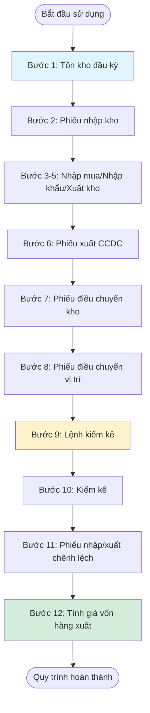

### 3.2. Workflow: Goods Receipt (Phiếu nhập kho)

**Nguồn:** ERP_SPECIFICATION.md Section 4 (lines 469-481)

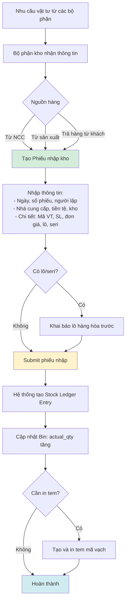

### 3.3. Workflow: Goods Issue with Approval (Phiếu xuất kho)

**Nguồn:** ERP_SPECIFICATION.md Section 4 (lines 483-485 - reference từ Section Mua hàng)

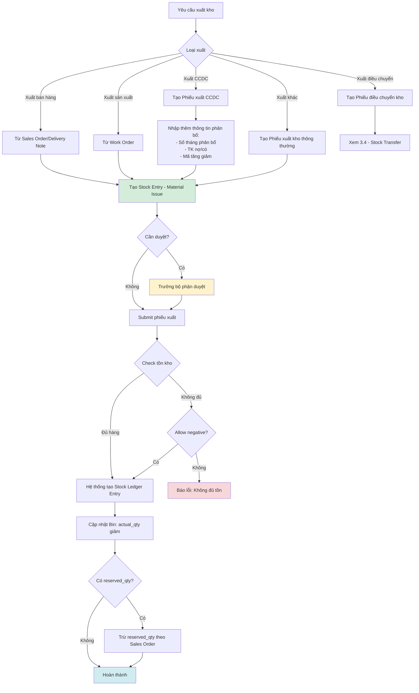

### 3.4. Workflow: Stock Transfer 3-Step (Phiếu điều chuyển kho)

**Nguồn:** ERP_SPECIFICATION.md Section 4 (lines 501-520)

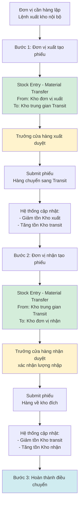

**Thông tin cần có:**
- **Thông tin chung:** Ngày, số phiếu, người lập, nội dung, kho xuất, kho nhập
- **Thông tin chi tiết:** Mã vật tư, tên vật tư, số lượng, số lô, số seri
- **Tính năng:** Kế thừa dữ liệu từ đề nghị xuất kho nội bộ

### 3.5. Workflow: Stock Reconciliation (Kiểm kê kho)

**Nguồn:** ERP_SPECIFICATION.md Section 4 (lines 532-568)

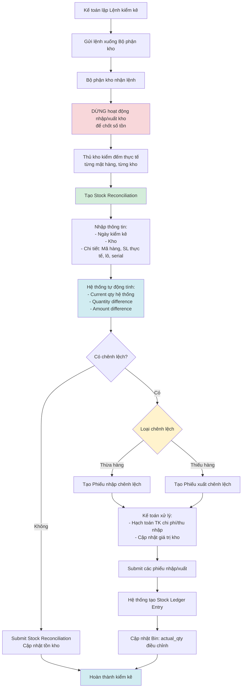

### 3.6. Workflow: Cost Calculation (Tính giá vốn hàng xuất)

**Nguồn:** ERP_SPECIFICATION.md Section 4 (lines 570-578)

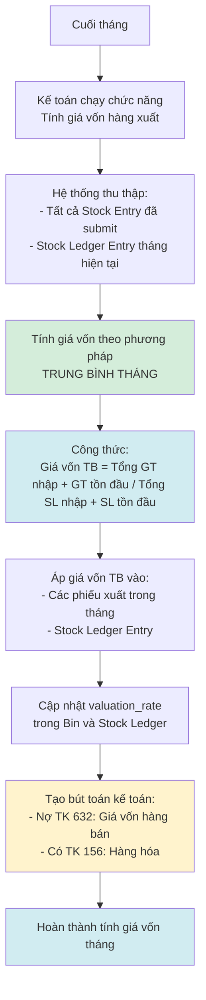

---

## 4. State Diagrams

### 4.1. Stock Entry Document Lifecycle

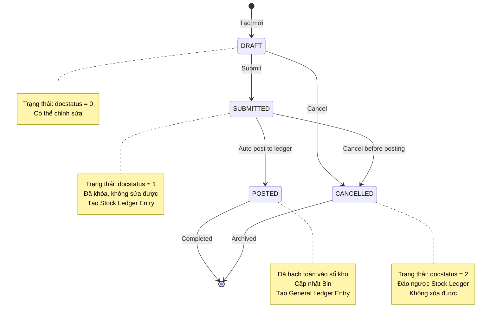

### 4.2. Stock Reconciliation Lifecycle

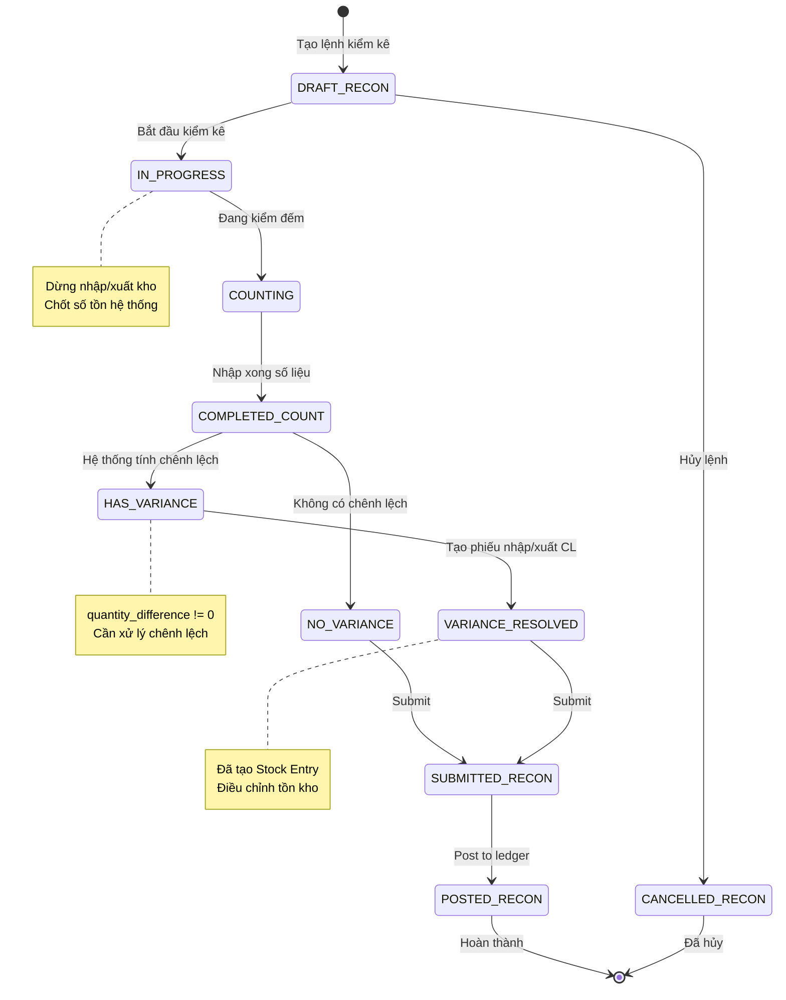

### 4.3. Batch Status

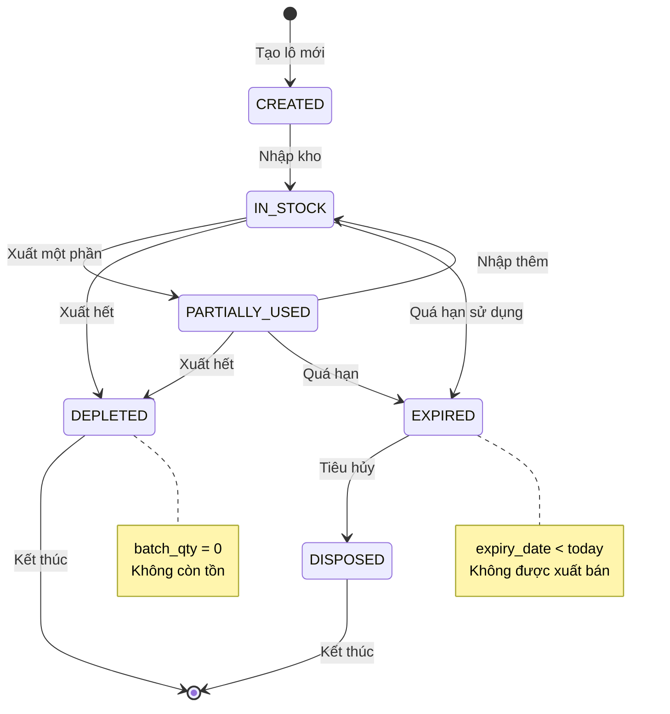

### 4.4. Serial Number Status

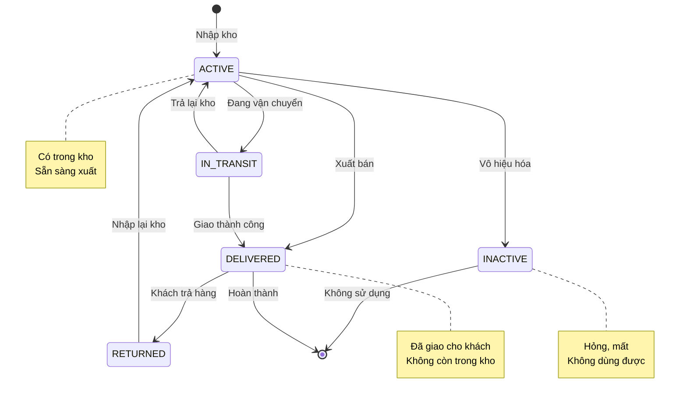

---

## 5. Data Flow Diagrams

### 5.1. Inbound Flow: PO → Goods Receipt → Stock Ledger

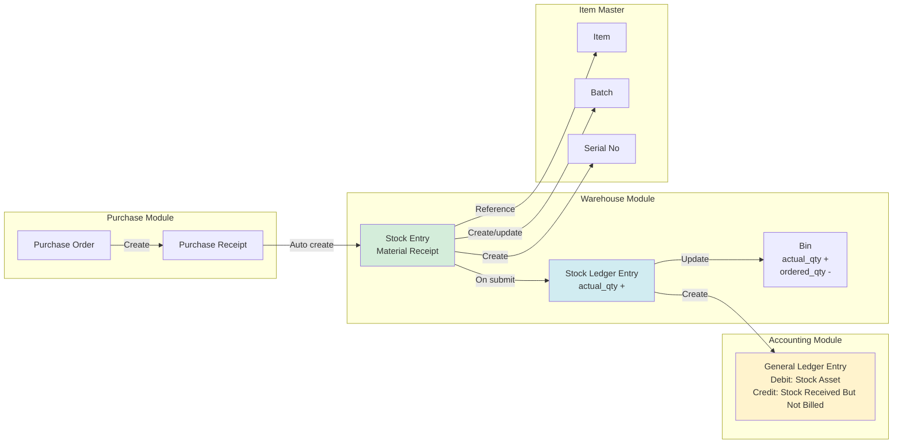

### 5.2. Outbound Flow: Sales Order → Goods Issue → Stock Ledger → Invoice

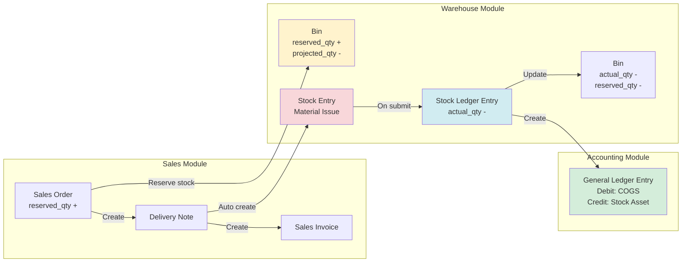

### 5.3. Transfer Flow: Source Warehouse → Transit → Target Warehouse

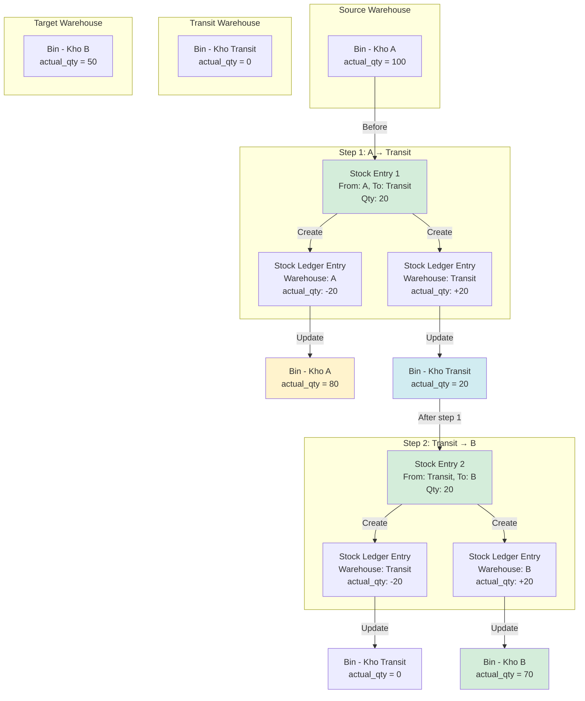

### 5.4. Reconciliation Flow: System Stock → Physical Count → Variance → Adjustment

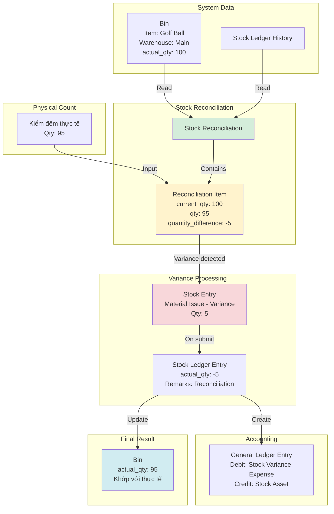

---

## 6. UI Mockup Descriptions

### 6.1. Stock Entry List View

**Màn hình:** Danh sách Phiếu nhập/xuất kho

**Cột hiển thị:**
- Mã phiếu (name)
- Ngày chứng từ (posting_date)
- Loại phiếu (stock_entry_type)
- Kho xuất (from_warehouse)
- Kho nhập (to_warehouse)
- Tổng giá trị (total_amount)
- Trạng thái (docstatus: Draft/Submitted/Cancelled)
- Người lập (owner)

**Tính năng:**
- Search by: Mã phiếu, Nhà cung cấp
- Filter by: Loại phiếu, Trạng thái, Kho, Thời gian
- Actions: Create, Submit, Cancel, Print, Export
- Bulk actions: Submit multiple, Print multiple

### 6.2. Stock Entry Form View

**Màn hình:** Form tạo/sửa Phiếu nhập/xuất kho

**Tab 1: General Information**
- Stock Entry Type (dropdown)
- Purpose (auto-fill based on type)
- Posting Date, Posting Time
- Supplier (nếu nhập từ NCC)
- From Warehouse (nếu transfer/issue)
- To Warehouse (nếu receipt/transfer)
- Remarks

**Tab 2: Items**
- Table with columns:
  - Item Code (lookup)
  - Item Name (auto-fill)
  - Quantity
  - UOM
  - Basic Rate (auto-fill from last purchase)
  - Amount (auto-calculate)
  - Source Warehouse
  - Target Warehouse
  - Batch No (lookup if has_batch_no)
  - Serial No (multi-select if has_serial_no)
  - Purchase Order reference
- Add Row, Delete Row buttons
- Total Amount (sum)

**Tab 3: Accounting (Read-only)**
- Auto-generated accounting entries
- Stock Asset account
- Stock Received But Not Billed account

**Actions:**
- Save, Submit, Cancel, Print, Email
- Get Items from Purchase Order
- Scan Barcode (for batch/serial)

### 6.3. Stock Reconciliation List View

**Màn hình:** Danh sách Kiểm kê kho

**Cột hiển thị:**
- Mã phiếu (name)
- Ngày kiểm kê (posting_date)
- Kho (warehouse - nếu single warehouse)
- Tổng chênh lệch SL (total_quantity_difference)
- Tổng chênh lệch GT (total_amount_difference)
- Trạng thái (docstatus)
- Người lập (owner)

**Tính năng:**
- Filter by: Kho, Thời gian, Trạng thái
- Actions: Create, Submit, Cancel, Print, Export

### 6.4. Stock Reconciliation Form View

**Màn hình:** Form Kiểm kê kho

**Section 1: Header**
- Posting Date, Posting Time
- Purpose (Opening Stock / Stock Reconciliation)
- Set Posting Time (checkbox)
- Expense Account (for variance)
- Cost Center

**Section 2: Items to Reconcile**
- Button: Get Items from Warehouse (chọn kho → load tất cả items)
- Button: Scan Barcode
- Table with columns:
  - Item Code
  - Item Name
  - Warehouse
  - Quantity (nhập số thực tế)
  - Valuation Rate
  - Amount
  - Current Qty (auto-fill from Bin)
  - Current Valuation Rate (auto-fill)
  - Quantity Difference (auto-calculate, highlight if != 0)
  - Amount Difference (auto-calculate)
  - Batch No
  - Serial No

**Section 3: Summary**
- Total Quantity Difference
- Total Amount Difference
- Variance Breakdown:
  - Items with surplus (quantity_difference > 0)
  - Items with shortage (quantity_difference < 0)

**Actions:**
- Save, Submit, Cancel, Print
- Create Variance Stock Entry (auto-generate)

### 6.5. Batch List View

**Màn hình:** Danh sách Lô hàng hóa

**Cột hiển thị:**
- Batch ID
- Item (item_code)
- Manufacturing Date
- Expiry Date
- Batch Qty
- Status (Active/Expired)

**Tính năng:**
- Filter by: Item, Warehouse, Expiry Date range
- Highlight expired batches (red)
- Actions: Create, View Stock Ledger

### 6.6. Barcode Label Form

**Màn hình:** Tạo tem mã vạch

**Nguồn:** ERP_SPECIFICATION.md Section 4 (lines 598-612)

**Section 1: Label Information**
- Posting Date
- Label Type (dropdown: Tem tự tạo / Tem nhà cung cấp)
- Person Creating (owner)
- Supplier (if applicable)
- Country of Origin
- Import Company

**Section 2: Items**
- Button: Get Items from Purchase Receipt (kế thừa dữ liệu)
- Table with columns:
  - Item Code
  - Item Name
  - UOM
  - Batch No
  - Serial No
  - Barcode Value (auto-generate theo quy ước)
  - Quantity (số lượng tem in)

**Quy ước auto-generate Barcode Value:**
- **Tem tự in:** `item_code + ";;" + batch_no`
- **Tem nhà cung cấp:** `serial_no`

**Actions:**
- Save, Print (generate barcode images), Export PDF

### 6.7. Dashboard Widgets

**Widget 1: Stock Summary**
```
┌──────────────────────────────────────────────────┐
│  Tổng giá trị tồn kho        │  185,500,000,000  │
│  ▲ +5.2% so với tháng trước                      │
├──────────────────────────────────────────────────┤
│  Số mặt hàng đang tồn         │  1,245            │
│  Số lô hàng đang tồn          │  3,678            │
│  Số serial đang tồn           │  12,456           │
└──────────────────────────────────────────────────┘
```

**Widget 2: Stock Movement (Last 7 Days)**
```
┌──────────────────────────────────────────────────┐
│  Phiếu nhập  │  Phiếu xuất  │  Điều chuyển       │
│     142      │     238      │      45            │
│  ▲ +8%       │  ▲ +12%      │  ▼ -3%             │
└──────────────────────────────────────────────────┘
```

**Widget 3: Low Stock Items**
```
┌──────────────────────────────────────────────────┐
│  ⚠️  Mặt hàng sắp hết: 23 items                   │
├──────────────────────────────────────────────────┤
│  1. Golf Ball Titleist Pro V1  │  Còn: 15         │
│  2. Golf Glove Footjoy XL      │  Còn: 8          │
│  3. ...                                           │
│  [View All Low Stock Items]                      │
└──────────────────────────────────────────────────┘
```

**Widget 4: Expiring Batches**
```
┌──────────────────────────────────────────────────┐
│  ⏰ Lô hàng sắp hết hạn: 12 batches               │
├──────────────────────────────────────────────────┤
│  1. Grip Winn Dri-Tac (LOT-2024-05)  │  5 days   │
│  2. Golf Ball Callaway (LOT-2024-08) │  12 days  │
│  [View All Expiring Batches]                     │
└──────────────────────────────────────────────────┘
```

**Widget 5: Warehouse Utilization**
```
┌──────────────────────────────────────────────────┐
│  Công suất kho                                    │
├──────────────────────────────────────────────────┤
│  Kho Hà Nội      ████████░░  82%                 │
│  Kho Hồ Chí Minh ██████░░░░  65%                 │
│  Kho Transit     ███░░░░░░░  28%                 │
└──────────────────────────────────────────────────┘
```

**Widget 6: Stock Value by Category**
```
┌──────────────────────────────────────────────────┐
│  Giá trị tồn kho theo nhóm hàng                   │
├──────────────────────────────────────────────────┤
│  📊 Pie Chart:                                    │
│  - Golf Clubs: 45%         (83B VND)             │
│  - Golf Balls: 22%         (40B VND)             │
│  - Accessories: 18%        (33B VND)             │
│  - Apparel: 15%            (27B VND)             │
└──────────────────────────────────────────────────┘
```

---

## 7. Quy trình đặc biệt

### 7.1. Xuất nội bộ giữa các cửa hàng

**Nguồn:** ERP_SPECIFICATION.md Section 4 (lines 618-623)

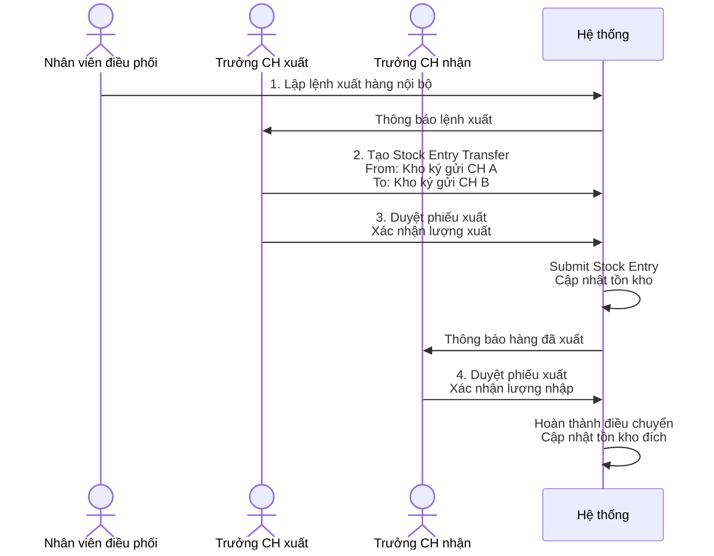

**Đặc điểm:**
- Cả 2 kho xuất và kho nhập đều là **kho ký gửi**
- Cần 2 level approval: Trưởng CH xuất + Trưởng CH nhận
- Không qua kho transit

### 7.2. Quy trình hàng ký gửi (Thăng Long TM ↔ Nhật Minh)

**Nguồn:** ERP_SPECIFICATION.md Section 4 (lines 625-640)

#### 7.2.1. Nhập xuất hàng ký gửi

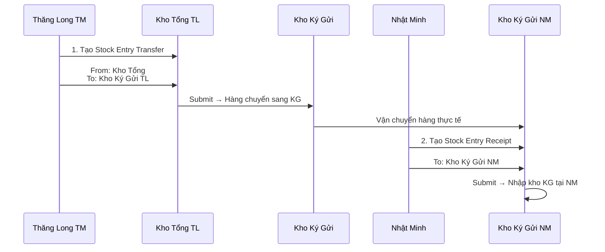

#### 7.2.2. Mua bán giữa Nhật Minh và Thăng Long TM

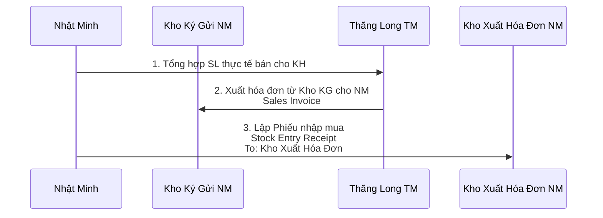

#### 7.2.3. Bán hàng tại Nhật Minh

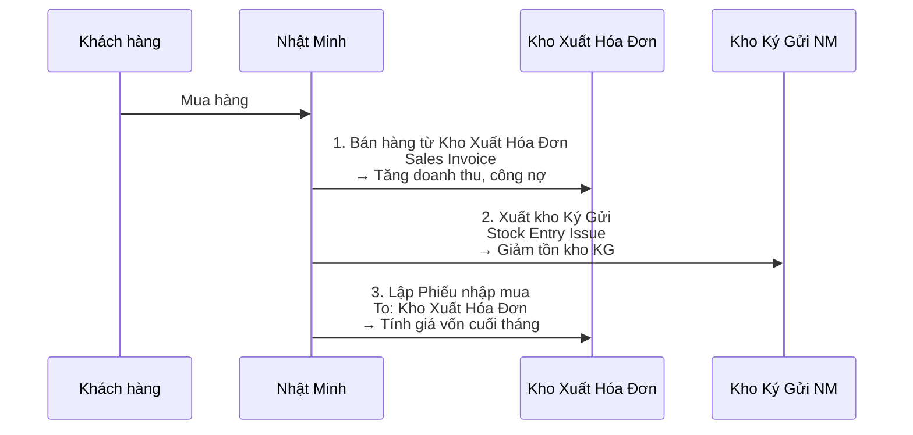

**Lưu ý:**
- Nhật Minh có 2 kho: **Kho Ký Gửi** và **Kho Xuất Hóa Đơn**
- Doanh thu ghi nhận từ **Kho Xuất Hóa Đơn**
- Giảm tồn thực tế từ **Kho Ký Gửi**
- Cuối tháng: Tính giá vốn dựa trên Phiếu nhập mua vào Kho Xuất Hóa Đơn

---

## 8. Integration Points

### 8.1. Với Purchase Module

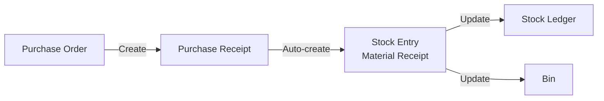

### 8.2. Với Sales Module

```mermaid
flowchart LR
    SO[Sales Order] -->|Reserve| BIN[Bin.reserved_qty]
    SO -->|Create| DN[Delivery Note]
    DN -->|Auto-create| SE[Stock Entry<br/>Material Issue]
    SE -->|Update| SLE[Stock Ledger]
    SE -->|Release| BIN2[Bin.reserved_qty<br/>Bin.actual_qty]
```

### 8.3. Với Accounting Module

```mermaid
flowchart LR
    SE[Stock Entry<br/>Submitted] -->|Create| SLE[Stock Ledger Entry]
    SLE -->|Create| GLE[General Ledger Entry]

    GLE -->|Debit| STOCK_ASSET[TK 156: Hàng hóa]
    GLE -->|Credit| SRNB[TK 1331: Hàng về chưa có hóa đơn]

    GLE2[GL Entry - Issue] -->|Debit| COGS[TK 632: Giá vốn hàng bán]
    GLE2 -->|Credit| STOCK_ASSET
```

### 8.4. Với Barcode Module

```mermaid
flowchart LR
    SE[Stock Entry<br/>Material Receipt] -->|Create| BATCH[Batch]
    SE -->|Create| SERIAL[Serial No]

    BATCH -->|Generate| BARCODE[Barcode Label]
    SERIAL -->|Generate| BARCODE

    BARCODE -->|Print| LABEL[Physical Label]
    LABEL -->|Scan| SE_OUT[Stock Entry<br/>Material Issue]
```

---

## 9. Business Rules

### 9.1. Stock Entry Validation

**Rule 1: Warehouse Required**
- Material Receipt: `to_warehouse` bắt buộc
- Material Issue: `from_warehouse` bắt buộc
- Material Transfer: Cả `from_warehouse` và `to_warehouse` bắt buộc

**Rule 2: Negative Stock Control**

**Nguồn:** ERP_SPECIFICATION.md Section 4 (line 586)

```python
if stock_entry.purpose == "Material Issue":
    for item in stock_entry.items:
        bin = get_bin(item.item_code, item.s_warehouse)
        available_qty = bin.actual_qty - bin.reserved_qty

        if item.qty > available_qty:
            if not item.s_warehouse.allow_negative_stock:
                raise InsufficientStockError(
                    f"Insufficient stock for {item.item_code} in {item.s_warehouse}. "
                    f"Available: {available_qty}, Required: {item.qty}"
                )
```

**Rule 3: Batch/Serial Validation**
- Nếu Item có `has_batch_no = True` → `batch_no` bắt buộc khi nhập/xuất
- Nếu Item có `has_serial_no = True` → `serial_no` bắt buộc, số lượng serial phải = qty

### 9.2. Stock Reconciliation Rules

**Rule 1: Lock Warehouse During Reconciliation**

**Nguồn:** ERP_SPECIFICATION.md Section 4 (lines 536-537)

- Khi tạo Stock Reconciliation, khóa warehouse (không cho nhập/xuất)
- Chốt số tồn kho hệ thống tại thời điểm kiểm kê

**Rule 2: Variance Handling**
- `quantity_difference = qty - current_qty`
- Nếu `quantity_difference > 0` → Tạo Stock Entry Material Receipt (nhập chênh lệch thừa)
- Nếu `quantity_difference < 0` → Tạo Stock Entry Material Issue (xuất chênh lệch thiếu)

### 9.3. Cost Calculation Rules

**Nguồn:** ERP_SPECIFICATION.md Section 4 (lines 570-578)

**Phương pháp: Trung bình tháng**

```python
# Tính vào cuối tháng
total_value = opening_stock_value + total_inward_value
total_qty = opening_stock_qty + total_inward_qty

average_rate = total_value / total_qty if total_qty > 0 else 0

# Áp dụng vào tất cả phiếu xuất trong tháng
for stock_entry in get_material_issues_of_month():
    for item in stock_entry.items:
        item.valuation_rate = average_rate
        item.amount = item.qty * average_rate
```

### 9.4. Barcode Generation Rules

**Nguồn:** ERP_SPECIFICATION.md Section 4 (lines 609-611)

**Rule 1: Barcode Value Convention**
- **Tem tự tạo:** `barcode_value = item_code + ";;" + batch_no`
- **Tem nhà cung cấp:** `barcode_value = serial_no`

**Rule 2: Inheritance from Purchase Receipt**

**Nguồn:** ERP_SPECIFICATION.md Section 4 (line 612)

- Kế thừa mặt hàng (item) và serial từ Phiếu nhập khẩu
- Auto-fill item details khi chọn Purchase Receipt

---

## 10. Reports & Analytics

### 10.1. Stock Reports

| Report | Mô tả | Filters |
|--------|-------|---------|
| Stock Balance | Tồn kho hiện tại theo item/warehouse | Item Group, Warehouse, Date |
| Stock Ledger | Sổ chi tiết nhập/xuất tồn | Item, Warehouse, Date Range, Voucher Type |
| Stock Ageing | Phân tích hàng tồn kho theo tuổi | Age Group, Warehouse |
| Batch-Wise Balance | Tồn kho theo lô | Item, Warehouse, Expiry Date |
| Serial No Status | Trạng thái serial | Item, Warehouse, Status |

### 10.2. Movement Reports

| Report | Mô tả | Filters |
|--------|-------|---------|
| Stock Entry Summary | Tổng hợp phiếu nhập/xuất | Entry Type, Date Range, Warehouse |
| Delivery Note Trends | Xu hướng xuất hàng | Date Range, Customer, Item Group |
| Purchase Receipt Trends | Xu hướng nhập hàng | Date Range, Supplier, Item Group |

### 10.3. Variance Reports

| Report | Mô tả | Filters |
|--------|-------|---------|
| Stock Reconciliation Report | Chi tiết kiểm kê và chênh lệch | Date Range, Warehouse |
| Stock Variance Report | Phân tích nguyên nhân chênh lệch | Date Range, Item Group |

### 10.4. Valuation Reports

| Report | Mô tả | Filters |
|--------|-------|---------|
| Stock Value | Giá trị tồn kho | Date, Warehouse, Item Group |
| Stock Valuation by Warehouse | Giá trị tồn theo kho | Date, Company |
| COGS Analysis | Phân tích giá vốn hàng bán | Date Range, Item Group |

---

## 11. Permissions & Security

### 11.1. Role-Based Access

| Role | Permissions |
|------|-------------|
| **Kế toán** | - View all reports<br/>- Create/Submit Stock Reconciliation<br/>- Run Cost Calculation<br/>- View Stock Ledger |
| **Thủ kho** | - Create/Submit Stock Entry (Receipt, Issue, Transfer)<br/>- Create Barcode Label<br/>- View Stock Balance<br/>- Cannot view valuation rates |
| **Trưởng kho** | - All permissions of Thủ kho<br/>- Approve Stock Entry<br/>- Cancel Stock Entry<br/>- View valuation rates |
| **Trưởng chi nhánh** | - View Stock Balance (own branch only)<br/>- Approve Transfer between branches<br/>- View Stock Reports (own branch) |
| **Mua hàng** | - Create Stock Entry from Purchase Receipt<br/>- View Stock Balance<br/>- View Purchase Receipt |
| **Bán hàng** | - Create Stock Entry from Delivery Note<br/>- View Stock Balance (available qty only)<br/>- Cannot view valuation rates |

### 11.2. Workflow Approvals

**Stock Entry Approval Matrix:**

| Entry Type | Value Threshold | Approver |
|------------|----------------|----------|
| Material Receipt | Any | Auto-approve |
| Material Issue | < 50,000,000 VND | Thủ kho |
| Material Issue | >= 50,000,000 VND | Trưởng kho |
| Material Transfer (between branches) | Any | Trưởng chi nhánh (both sides) |
| Stock Reconciliation | Any | Kế toán trưởng |

---

## 12. Key Metrics (KPIs)

### 12.1. Operational KPIs

| Metric | Formula | Target |
|--------|---------|--------|
| Stock Turnover Ratio | COGS / Average Stock Value | > 6 lần/năm |
| Stock Accuracy | (Items Counted Correctly / Total Items) × 100% | > 99% |
| Reconciliation Variance % | Abs(Physical - System) / System × 100% | < 1% |
| Out of Stock Rate | (Days Out of Stock / Total Days) × 100% | < 2% |

### 12.2. Financial KPIs

| Metric | Formula | Target |
|--------|---------|--------|
| Days Inventory Outstanding (DIO) | (Average Stock Value / COGS) × 365 | < 60 days |
| Carrying Cost of Inventory | Stock Value × Carrying Cost % | Minimize |
| Dead Stock % | Dead Stock Value / Total Stock Value × 100% | < 5% |

---

## 13. Checklist triển khai

### Phase 1: Core (Tuần 1-2)
- [ ] Setup Warehouse master
- [ ] Configure Stock Settings (allow negative, valuation method)
- [ ] Stock Entry CRUD (Receipt, Issue, Transfer)
- [ ] Stock Ledger Entry auto-creation
- [ ] Bin update logic

### Phase 2: Batch & Serial (Tuần 2-3)
- [ ] Batch management
- [ ] Serial Number management
- [ ] Barcode Label generation
- [ ] Barcode scanning integration

### Phase 3: Reconciliation (Tuần 3-4)
- [ ] Stock Reconciliation CRUD
- [ ] Variance calculation
- [ ] Auto-generate variance Stock Entry
- [ ] Lock warehouse during reconciliation

### Phase 4: Costing (Tuần 4-5)
- [ ] Implement weighted average costing
- [ ] Cost calculation job (monthly)
- [ ] COGS auto-posting
- [ ] Valuation reports

### Phase 5: Special Workflows (Tuần 5-6)
- [ ] 3-step transfer (Source → Transit → Target)
- [ ] Consignment stock workflow (Thăng Long ↔ Nhật Minh)
- [ ] Inter-branch transfer approval

### Phase 6: Integration (Tuần 6-7)
- [ ] Purchase Receipt → Stock Entry
- [ ] Delivery Note → Stock Entry
- [ ] Sales Order → Reserved Qty
- [ ] General Ledger Entry posting

### Phase 7: Reports & Dashboard (Tuần 7-8)
- [ ] Stock Balance report
- [ ] Stock Ledger report
- [ ] Stock Ageing report
- [ ] Dashboard widgets
- [ ] Export to Excel

---

## 14. Câu hỏi cần làm rõ

| # | Câu hỏi | Ảnh hưởng đến | Trạng thái |
|---|---------|---------------|------------|
| 1 | Có bao nhiêu kho? Tên các kho? Kho nào cho phép xuất âm? | Warehouse setup | ⏳ Chờ |
| 2 | Có tracking theo vị trí trong kho không? (Bin Location) | Stock Entry Item, UI | ⏳ Chờ |
| 3 | Item nào cần theo dõi theo lô? Item nào theo serial? | Item Master configuration | ⏳ Chờ |
| 4 | Phương pháp tính giá vốn chính xác? (Trung bình tháng hay FIFO?) | Cost calculation logic | ⏳ Chờ |
| 5 | Quy trình duyệt phiếu xuất: duyệt trước hay sau submit? | Workflow design | ⏳ Chờ |
| 6 | Kiểm kê định kỳ hay đột xuất? Tần suất? | Reconciliation workflow | ⏳ Chờ |
| 7 | Có giới hạn giá trị phiếu xuất cần duyệt không? | Approval matrix | ⏳ Chờ |
| 8 | Format mã vạch: EAN-13, Code128, QR? | Barcode generation | ⏳ Chờ |
| 9 | Kích thước tem mã vạch? (30x20mm, 50x25mm, ...) | Print template | ⏳ Chờ |
| 10 | Có tích hợp thiết bị quét mã vạch không? Model nào? | Hardware integration | ⏳ Chờ |

---

## 📚 Tham khảo

- [WAREHOUSE_SPEC.md](./WAREHOUSE_SPEC.md) - Spec Summary
- [WAREHOUSE_STATUS.md](./WAREHOUSE_STATUS.md) - Status workflow & state machine
- [WAREHOUSE_USE_CASE_SPEC.md](./WAREHOUSE_USE_CASE_SPEC.md) - Use Cases
- [ERP_SPECIFICATION.md](../../feature/ERP_SPECIFICATION.md) - Đặc tả chức năng gốc

---

**© 2025 DCNET Corporation**
**Last Updated:** 15/01/2026
