# Module Warehouse - Diagrams

> **Nguồn:** `/docs/feature/ERP_SPECIFICATION.md` Section 4 - Quản lý Kho (lines 455-641)
> **Lưu ý:** Diagrams dựa trên đặc tả YÊU CẦU, không dựa trên code hiện tại

---

## 1. ERD - Entity Relationship Diagram

**Nguồn:** ERP_SPECIFICATION.md Section 4 (lines 455-641)

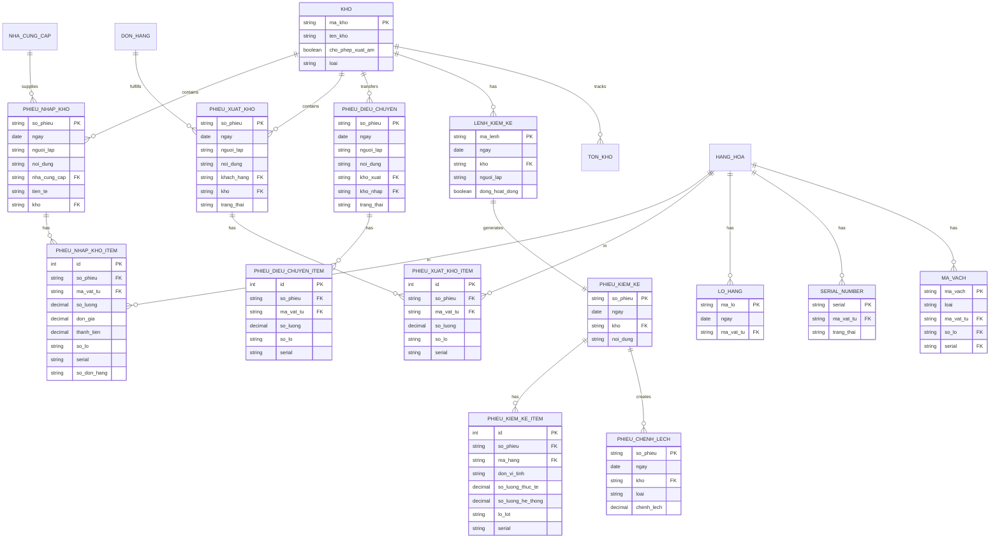
```mermaid
erDiagram
    KHO ||--o{ PHIEU_NHAP_KHO : contains
    KHO ||--o{ PHIEU_XUAT_KHO : contains
    KHO ||--o{ PHIEU_DIEU_CHUYEN : transfers
    KHO ||--o{ LENH_KIEM_KE : has
    KHO ||--o{ TON_KHO : tracks

    PHIEU_NHAP_KHO ||--o{ PHIEU_NHAP_KHO_ITEM : has
    PHIEU_XUAT_KHO ||--o{ PHIEU_XUAT_KHO_ITEM : has
    PHIEU_DIEU_CHUYEN ||--o{ PHIEU_DIEU_CHUYEN_ITEM : has
    PHIEU_KIEM_KE ||--o{ PHIEU_KIEM_KE_ITEM : has

    HANG_HOA ||--o{ PHIEU_NHAP_KHO_ITEM : in
    HANG_HOA ||--o{ PHIEU_XUAT_KHO_ITEM : in
    HANG_HOA ||--o{ LO_HANG : has
    HANG_HOA ||--o{ SERIAL_NUMBER : has
    HANG_HOA ||--o{ MA_VACH : has

    NHA_CUNG_CAP ||--o{ PHIEU_NHAP_KHO : supplies
    DON_HANG ||--o{ PHIEU_XUAT_KHO : fulfills

    LENH_KIEM_KE ||--|| PHIEU_KIEM_KE : generates
    PHIEU_KIEM_KE ||--o{ PHIEU_CHENH_LECH : creates

    KHO {
        string ma_kho PK
        string ten_kho
        boolean cho_phep_xuat_am
        string loai
    }

    PHIEU_NHAP_KHO {
        string so_phieu PK
        date ngay
        string nguoi_lap
        string noi_dung
        string nha_cung_cap FK
        string tien_te
        string kho FK
    }

    PHIEU_NHAP_KHO_ITEM {
        int id PK
        string so_phieu FK
        string ma_vat_tu FK
        decimal so_luong
        decimal don_gia
        decimal thanh_tien
        string so_lo
        string serial
        string so_don_hang
    }

    PHIEU_XUAT_KHO {
        string so_phieu PK
        date ngay
        string nguoi_lap
        string noi_dung
        string khach_hang FK
        string kho FK
        string trang_thai
    }

    PHIEU_XUAT_KHO_ITEM {
        int id PK
        string so_phieu FK
        string ma_vat_tu FK
        decimal so_luong
        string so_lo
        string serial
    }

    PHIEU_DIEU_CHUYEN {
        string so_phieu PK
        date ngay
        string nguoi_lap
        string noi_dung
        string kho_xuat FK
        string kho_nhap FK
        string trang_thai
    }

    PHIEU_DIEU_CHUYEN_ITEM {
        int id PK
        string so_phieu FK
        string ma_vat_tu FK
        decimal so_luong
        string so_lo
        string serial
    }

    LENH_KIEM_KE {
        string ma_lenh PK
        date ngay
        string kho FK
        string nguoi_lap
        boolean dong_hoat_dong
    }

    PHIEU_KIEM_KE {
        string so_phieu PK
        date ngay
        string kho FK
        string noi_dung
    }

    PHIEU_KIEM_KE_ITEM {
        int id PK
        string so_phieu FK
        string ma_hang FK
        string don_vi_tinh
        decimal so_luong_thuc_te
        decimal so_luong_he_thong
        string lo_lot
        string serial
    }

    PHIEU_CHENH_LECH {
        string so_phieu PK
        date ngay
        string kho FK
        string loai
        decimal chenh_lech
    }

    LO_HANG {
        string ma_lo PK
        date ngay
        string ma_vat_tu FK
    }

    SERIAL_NUMBER {
        string serial PK
        string ma_vat_tu FK
        string trang_thai
    }

    MA_VACH {
        string ma_vach PK
        string loai
        string ma_vat_tu FK
        string so_lo FK
        string serial FK
    }
```

---

## 2. SD-01: Goods Receipt Process

**Mô tả:** Quy trình nhập kho hàng hóa từ nhà cung cấp

**Nguồn:** ERP_SPECIFICATION.md Section 4, Bước 2 (lines 469-481)

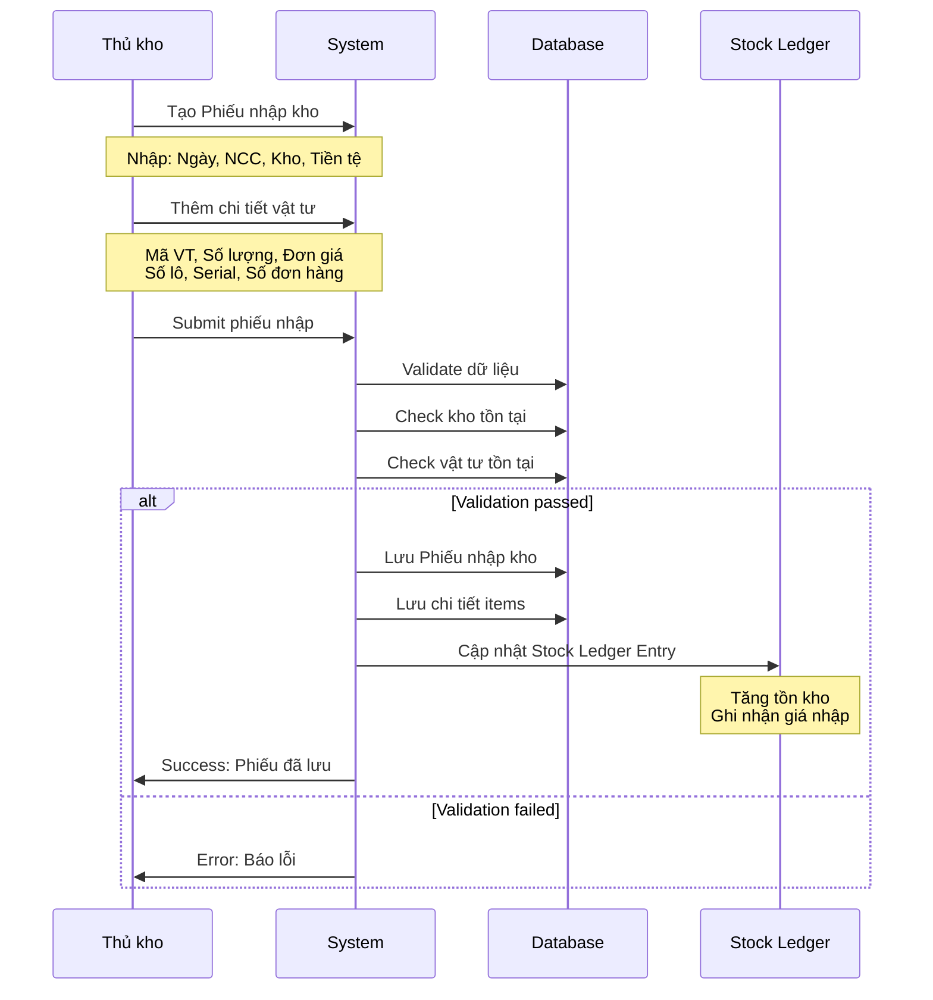
```mermaid
sequenceDiagram
    participant TK as Thủ kho
    participant SYS as System
    participant DB as Database
    participant SL as Stock Ledger

    TK->>SYS: Tạo Phiếu nhập kho
    Note over TK,SYS: Nhập: Ngày, NCC, Kho, Tiền tệ
    TK->>SYS: Thêm chi tiết vật tư
    Note over TK,SYS: Mã VT, Số lượng, Đơn giá<br/>Số lô, Serial, Số đơn hàng
    TK->>SYS: Submit phiếu nhập

    SYS->>DB: Validate dữ liệu
    SYS->>DB: Check kho tồn tại
    SYS->>DB: Check vật tư tồn tại

    alt Validation passed
        SYS->>DB: Lưu Phiếu nhập kho
        SYS->>DB: Lưu chi tiết items
        SYS->>SL: Cập nhật Stock Ledger Entry
        Note over SL: Tăng tồn kho<br/>Ghi nhận giá nhập
        SYS->>TK: Success: Phiếu đã lưu
    else Validation failed
        SYS->>TK: Error: Báo lỗi
    end
```

---

## 3. SD-02: Goods Issue with Approval

**Mô tả:** Quy trình xuất kho có kiểm tra credit và duyệt

**Nguồn:** ERP_SPECIFICATION.md Section 4, Bước 3-5 (lines 483-485)

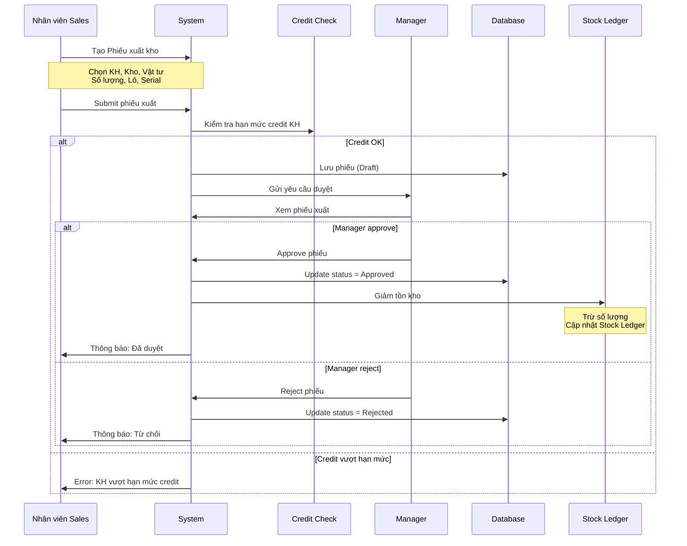
```mermaid
sequenceDiagram
    participant NVS as Nhân viên Sales
    participant SYS as System
    participant CRD as Credit Check
    participant MGR as Manager
    participant DB as Database
    participant SL as Stock Ledger

    NVS->>SYS: Tạo Phiếu xuất kho
    Note over NVS,SYS: Chọn KH, Kho, Vật tư<br/>Số lượng, Lô, Serial
    NVS->>SYS: Submit phiếu xuất

    SYS->>CRD: Kiểm tra hạn mức credit KH

    alt Credit OK
        SYS->>DB: Lưu phiếu (Draft)
        SYS->>MGR: Gửi yêu cầu duyệt
        MGR->>SYS: Xem phiếu xuất

        alt Manager approve
            MGR->>SYS: Approve phiếu
            SYS->>DB: Update status = Approved
            SYS->>SL: Giảm tồn kho
            Note over SL: Trừ số lượng<br/>Cập nhật Stock Ledger
            SYS->>NVS: Thông báo: Đã duyệt
        else Manager reject
            MGR->>SYS: Reject phiếu
            SYS->>DB: Update status = Rejected
            SYS->>NVS: Thông báo: Từ chối
        end
    else Credit vượt hạn mức
        SYS->>NVS: Error: KH vượt hạn mức credit
    end
```

---

## 4. SD-03: Stock Transfer (3-Step Process)

**Mô tả:** Quy trình điều chuyển kho giữa các chi nhánh qua kho trung gian

**Nguồn:** ERP_SPECIFICATION.md Section 4, Bước 7 (lines 501-520)

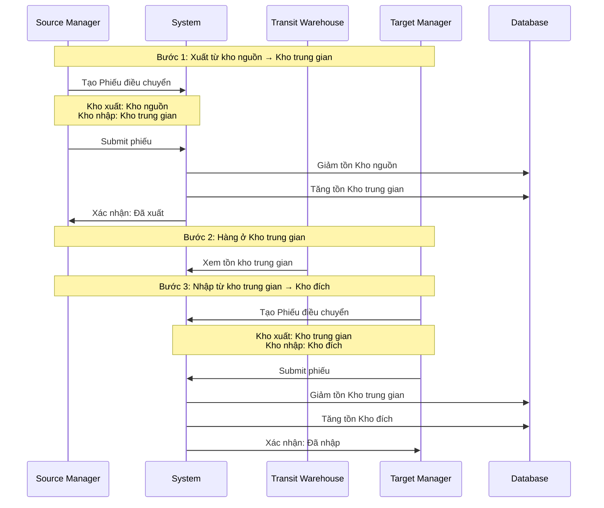
```mermaid
sequenceDiagram
    participant SRC as Source Manager
    participant SYS as System
    participant TRA as Transit Warehouse
    participant TGT as Target Manager
    participant DB as Database

    Note over SRC,TGT: Bước 1: Xuất từ kho nguồn → Kho trung gian
    SRC->>SYS: Tạo Phiếu điều chuyển
    Note over SRC,SYS: Kho xuất: Kho nguồn<br/>Kho nhập: Kho trung gian
    SRC->>SYS: Submit phiếu
    SYS->>DB: Giảm tồn Kho nguồn
    SYS->>DB: Tăng tồn Kho trung gian
    SYS->>SRC: Xác nhận: Đã xuất

    Note over SRC,TGT: Bước 2: Hàng ở Kho trung gian
    TRA->>SYS: Xem tồn kho trung gian

    Note over SRC,TGT: Bước 3: Nhập từ kho trung gian → Kho đích
    TGT->>SYS: Tạo Phiếu điều chuyển
    Note over TGT,SYS: Kho xuất: Kho trung gian<br/>Kho nhập: Kho đích
    TGT->>SYS: Submit phiếu
    SYS->>DB: Giảm tồn Kho trung gian
    SYS->>DB: Tăng tồn Kho đích
    SYS->>TGT: Xác nhận: Đã nhập
```

---

## 5. SD-04: Stock Reconciliation Process

**Mô tả:** Quy trình kiểm kê kho có đóng băng hoạt động

**Nguồn:** ERP_SPECIFICATION.md Section 4, Bước 9-11 (lines 532-568)

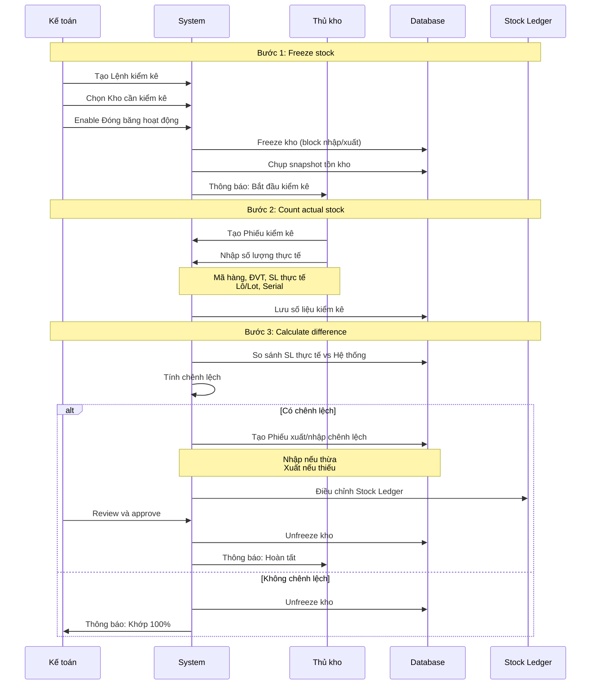
```mermaid
sequenceDiagram
    participant KT as Kế toán
    participant SYS as System
    participant TK as Thủ kho
    participant DB as Database
    participant SL as Stock Ledger

    Note over KT,SL: Bước 1: Freeze stock
    KT->>SYS: Tạo Lệnh kiểm kê
    KT->>SYS: Chọn Kho cần kiểm kê
    KT->>SYS: Enable Đóng băng hoạt động
    SYS->>DB: Freeze kho (block nhập/xuất)
    SYS->>DB: Chụp snapshot tồn kho
    SYS->>TK: Thông báo: Bắt đầu kiểm kê

    Note over KT,SL: Bước 2: Count actual stock
    TK->>SYS: Tạo Phiếu kiểm kê
    TK->>SYS: Nhập số lượng thực tế
    Note over TK,SYS: Mã hàng, ĐVT, SL thực tế<br/>Lô/Lot, Serial
    SYS->>DB: Lưu số liệu kiểm kê

    Note over KT,SL: Bước 3: Calculate difference
    SYS->>DB: So sánh SL thực tế vs Hệ thống
    SYS->>SYS: Tính chênh lệch

    alt Có chênh lệch
        SYS->>DB: Tạo Phiếu xuất/nhập chênh lệch
        Note over SYS,DB: Nhập nếu thừa<br/>Xuất nếu thiếu
        SYS->>SL: Điều chỉnh Stock Ledger
        KT->>SYS: Review và approve
        SYS->>DB: Unfreeze kho
        SYS->>TK: Thông báo: Hoàn tất
    else Không chênh lệch
        SYS->>DB: Unfreeze kho
        SYS->>KT: Thông báo: Khớp 100%
    end
```

---

## 6. SD-05: Cost Calculation (Weighted Average)

**Mô tả:** Quy trình tính giá vốn hàng xuất theo phương pháp trung bình tháng

**Nguồn:** ERP_SPECIFICATION.md Section 4, Bước 12 (lines 570-579)

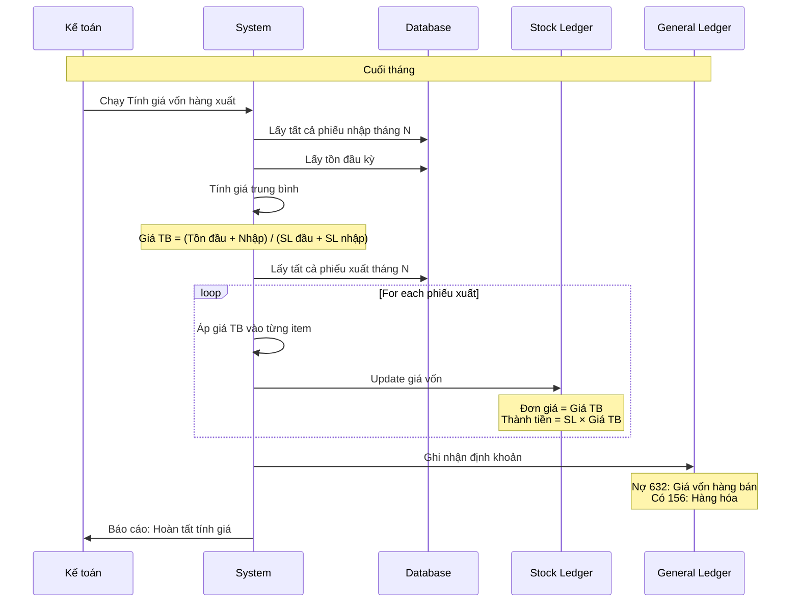
```mermaid
sequenceDiagram
    participant KT as Kế toán
    participant SYS as System
    participant DB as Database
    participant SL as Stock Ledger
    participant GL as General Ledger

    Note over KT,GL: Cuối tháng
    KT->>SYS: Chạy Tính giá vốn hàng xuất

    SYS->>DB: Lấy tất cả phiếu nhập tháng N
    SYS->>DB: Lấy tồn đầu kỳ

    SYS->>SYS: Tính giá trung bình
    Note over SYS: Giá TB = (Tồn đầu + Nhập) / (SL đầu + SL nhập)

    SYS->>DB: Lấy tất cả phiếu xuất tháng N

    loop For each phiếu xuất
        SYS->>SYS: Áp giá TB vào từng item
        SYS->>SL: Update giá vốn
        Note over SL: Đơn giá = Giá TB<br/>Thành tiền = SL × Giá TB
    end

    SYS->>GL: Ghi nhận định khoản
    Note over GL: Nợ 632: Giá vốn hàng bán<br/>Có 156: Hàng hóa

    SYS->>KT: Báo cáo: Hoàn tất tính giá
```

---

## 7. SD-06: Barcode Label Generation

**Mô tả:** Quy trình tạo và in tem mã vạch cho hàng hóa

**Nguồn:** ERP_SPECIFICATION.md Section 4, In tem mã vạch (lines 598-612)

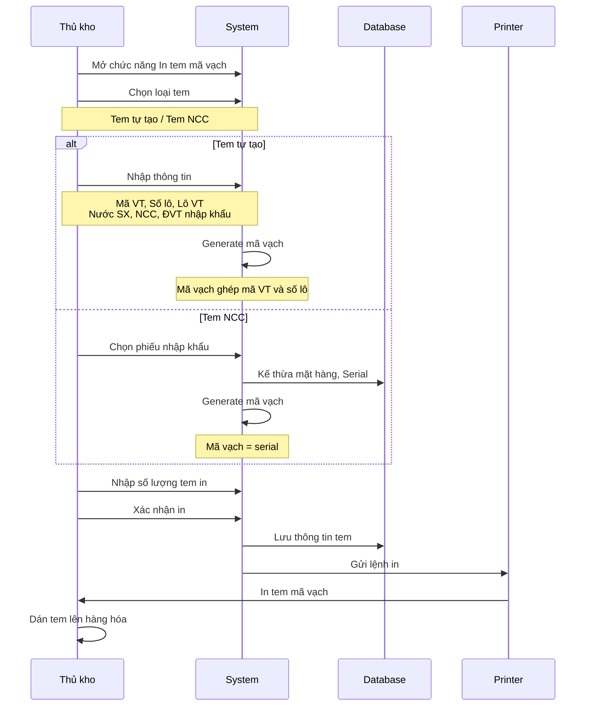
```mermaid
sequenceDiagram
    participant TK as Thủ kho
    participant SYS as System
    participant DB as Database
    participant PRN as Printer

    TK->>SYS: Mở chức năng In tem mã vạch
    TK->>SYS: Chọn loại tem
    Note over TK,SYS: Tem tự tạo / Tem NCC

    alt Tem tự tạo
        TK->>SYS: Nhập thông tin
        Note over TK,SYS: Mã VT, Số lô, Lô VT<br/>Nước SX, NCC, ĐVT nhập khẩu
        SYS->>SYS: Generate mã vạch
        Note over SYS: Mã vạch ghép mã VT và số lô
    else Tem NCC
        TK->>SYS: Chọn phiếu nhập khẩu
        SYS->>DB: Kế thừa mặt hàng, Serial
        SYS->>SYS: Generate mã vạch
        Note over SYS: Mã vạch = serial
    end

    TK->>SYS: Nhập số lượng tem in
    TK->>SYS: Xác nhận in

    SYS->>DB: Lưu thông tin tem
    SYS->>PRN: Gửi lệnh in
    PRN->>TK: In tem mã vạch

    TK->>TK: Dán tem lên hàng hóa
```

---

## 8. SD-07: Inter-branch Transfer

**Mô tả:** Quy trình xuất nội bộ giữa các cửa hàng có duyệt

**Nguồn:** ERP_SPECIFICATION.md Section 4, Xuất nội bộ (lines 616-623)

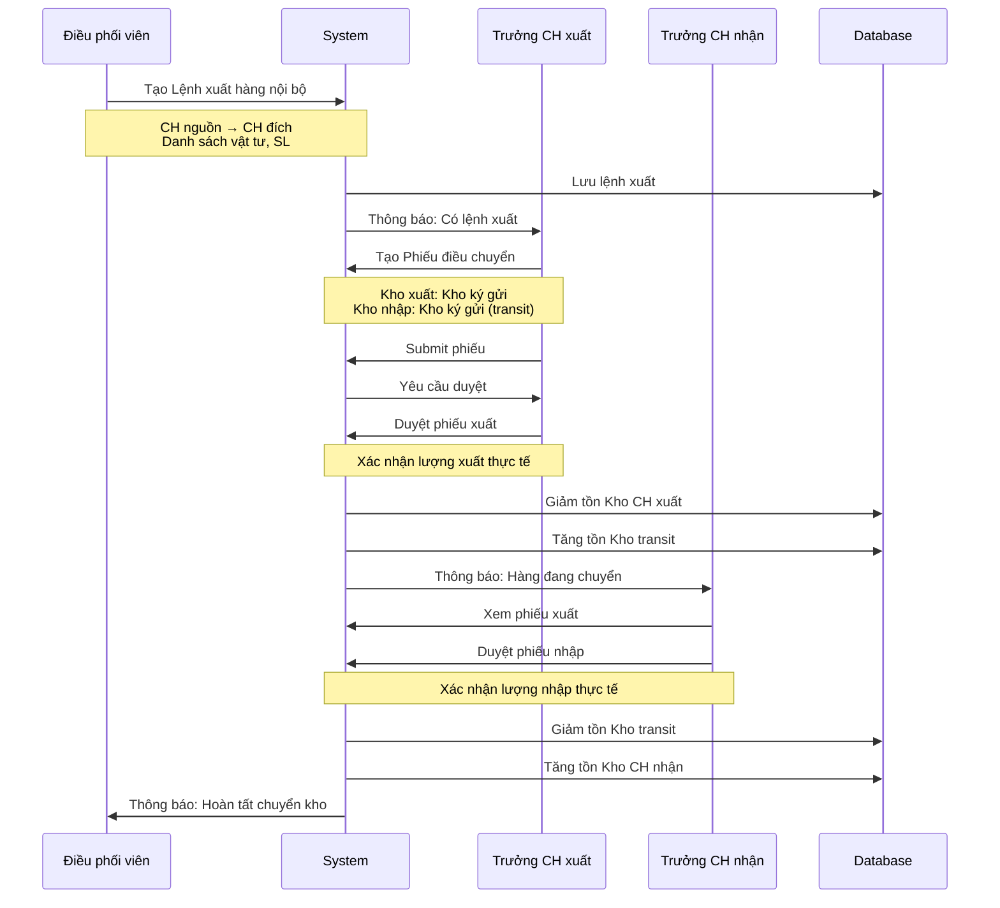
```mermaid
sequenceDiagram
    participant DP as Điều phối viên
    participant SYS as System
    participant SRC as Trưởng CH xuất
    participant TGT as Trưởng CH nhận
    participant DB as Database

    DP->>SYS: Tạo Lệnh xuất hàng nội bộ
    Note over DP,SYS: CH nguồn → CH đích<br/>Danh sách vật tư, SL
    SYS->>DB: Lưu lệnh xuất
    SYS->>SRC: Thông báo: Có lệnh xuất

    SRC->>SYS: Tạo Phiếu điều chuyển
    Note over SRC,SYS: Kho xuất: Kho ký gửi<br/>Kho nhập: Kho ký gửi (transit)
    SRC->>SYS: Submit phiếu
    SYS->>SRC: Yêu cầu duyệt

    SRC->>SYS: Duyệt phiếu xuất
    Note over SRC,SYS: Xác nhận lượng xuất thực tế
    SYS->>DB: Giảm tồn Kho CH xuất
    SYS->>DB: Tăng tồn Kho transit
    SYS->>TGT: Thông báo: Hàng đang chuyển

    TGT->>SYS: Xem phiếu xuất
    TGT->>SYS: Duyệt phiếu nhập
    Note over TGT,SYS: Xác nhận lượng nhập thực tế
    SYS->>DB: Giảm tồn Kho transit
    SYS->>DB: Tăng tồn Kho CH nhận
    SYS->>DP: Thông báo: Hoàn tất chuyển kho
```

---

## 9. SD-08: Consignment Stock Process

**Mô tả:** Quy trình hàng ký gửi giữa Thăng Long TM và Nhật Minh

**Nguồn:** ERP_SPECIFICATION.md Section 4, Hàng ký gửi (lines 625-639)

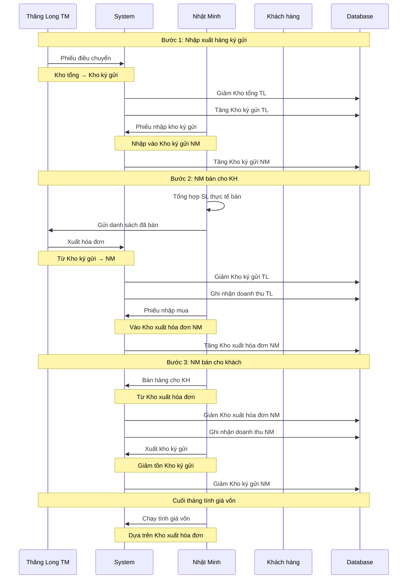
```mermaid
sequenceDiagram
    participant TL as Thăng Long TM
    participant SYS as System
    participant NM as Nhật Minh
    participant KH as Khách hàng
    participant DB as Database

    Note over TL,DB: Bước 1: Nhập xuất hàng ký gửi
    TL->>SYS: Phiếu điều chuyển
    Note over TL,SYS: Kho tổng → Kho ký gửi
    SYS->>DB: Giảm Kho tổng TL
    SYS->>DB: Tăng Kho ký gửi TL

    NM->>SYS: Phiếu nhập kho ký gửi
    Note over NM,SYS: Nhập vào Kho ký gửi NM
    SYS->>DB: Tăng Kho ký gửi NM

    Note over TL,DB: Bước 2: NM bán cho KH
    NM->>NM: Tổng hợp SL thực tế bán
    NM->>TL: Gửi danh sách đã bán

    TL->>SYS: Xuất hóa đơn
    Note over TL,SYS: Từ Kho ký gửi → NM
    SYS->>DB: Giảm Kho ký gửi TL
    SYS->>DB: Ghi nhận doanh thu TL

    NM->>SYS: Phiếu nhập mua
    Note over NM,SYS: Vào Kho xuất hóa đơn NM
    SYS->>DB: Tăng Kho xuất hóa đơn NM

    Note over TL,DB: Bước 3: NM bán cho khách
    NM->>SYS: Bán hàng cho KH
    Note over NM,SYS: Từ Kho xuất hóa đơn
    SYS->>DB: Giảm Kho xuất hóa đơn NM
    SYS->>DB: Ghi nhận doanh thu NM

    NM->>SYS: Xuất kho ký gửi
    Note over NM,SYS: Giảm tồn Kho ký gửi
    SYS->>DB: Giảm Kho ký gửi NM

    Note over TL,DB: Cuối tháng tính giá vốn
    NM->>SYS: Chạy tính giá vốn
    Note over NM,SYS: Dựa trên Kho xuất hóa đơn
```

---

## 10. AD-01: Goods Receipt Activity Flow

**Mô tả:** Sơ đồ hoạt động nhập kho đầy đủ

**Nguồn:** ERP_SPECIFICATION.md Section 4, Bước 2 (lines 469-481)

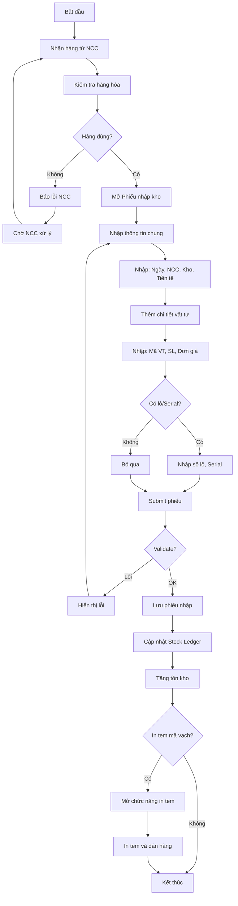
```mermaid
flowchart TD
    A[Bắt đầu] --> B[Nhận hàng từ NCC]
    B --> C[Kiểm tra hàng hóa]
    C --> D{Hàng đúng?}

    D -->|Không| E[Báo lỗi NCC]
    E --> F[Chờ NCC xử lý]
    F --> B

    D -->|Có| G[Mở Phiếu nhập kho]
    G --> H[Nhập thông tin chung]
    H --> I["Nhập: Ngày, NCC, Kho, Tiền tệ"]
    I --> J[Thêm chi tiết vật tư]
    J --> K["Nhập: Mã VT, SL, Đơn giá"]
    K --> L{"Có lô/Serial?"}

    L -->|Có| M[Nhập số lô, Serial]
    L -->|Không| N[Bỏ qua]

    M --> O[Submit phiếu]
    N --> O

    O --> P{Validate?}
    P -->|Lỗi| Q[Hiển thị lỗi]
    Q --> H

    P -->|OK| R[Lưu phiếu nhập]
    R --> S[Cập nhật Stock Ledger]
    S --> T[Tăng tồn kho]
    T --> U{In tem mã vạch?}

    U -->|Có| V[Mở chức năng in tem]
    V --> W[In tem và dán hàng]
    U -->|Không| X[Kết thúc]
    W --> X
```

---

## 11. AD-02: Goods Issue with Credit Check

**Mô tả:** Sơ đồ hoạt động xuất kho có kiểm tra credit

**Nguồn:** ERP_SPECIFICATION.md Section 4, Bước 3-5 (lines 483-485)

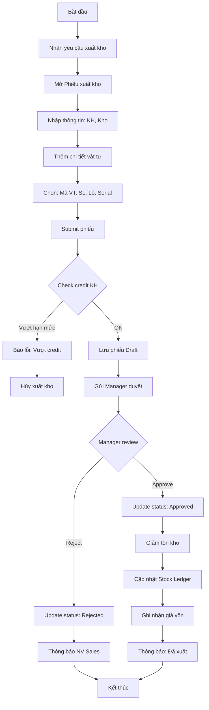
```mermaid
flowchart TD
    A[Bắt đầu] --> B[Nhận yêu cầu xuất kho]
    B --> C[Mở Phiếu xuất kho]
    C --> D["Nhập thông tin: KH, Kho"]
    D --> E[Thêm chi tiết vật tư]
    E --> F["Chọn: Mã VT, SL, Lô, Serial"]
    F --> G[Submit phiếu]

    G --> H{Check credit KH}
    H -->|Vượt hạn mức| I["Báo lỗi: Vượt credit"]
    I --> J[Hủy xuất kho]

    H -->|OK| K[Lưu phiếu Draft]
    K --> L[Gửi Manager duyệt]
    L --> M{Manager review}

    M -->|Reject| N["Update status: Rejected"]
    N --> O[Thông báo NV Sales]
    O --> P[Kết thúc]

    M -->|Approve| Q["Update status: Approved"]
    Q --> R[Giảm tồn kho]
    R --> S[Cập nhật Stock Ledger]
    S --> T[Ghi nhận giá vốn]
    T --> U["Thông báo: Đã xuất"]
    U --> P
```

---

## 12. AD-03: Stock Transfer Complete Flow

**Mô tả:** Sơ đồ hoạt động điều chuyển kho 3 bước

**Nguồn:** ERP_SPECIFICATION.md Section 4, Bước 7 (lines 501-520)

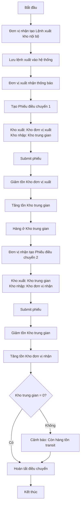
```mermaid
flowchart TD
    A[Bắt đầu] --> B[Đơn vị nhận tạo Lệnh xuất kho nội bộ]
    B --> C[Lưu lệnh xuất vào hệ thống]

    C --> D[Đơn vị xuất nhận thông báo]
    D --> E[Tạo Phiếu điều chuyển 1]
    E --> F["Kho xuất: Kho đơn vị xuất<br/>Kho nhập: Kho trung gian"]
    F --> G[Submit phiếu]
    G --> H[Giảm tồn Kho đơn vị xuất]
    H --> I[Tăng tồn Kho trung gian]

    I --> J[Hàng ở Kho trung gian]
    J --> K[Đơn vị nhận tạo Phiếu điều chuyển 2]
    K --> L["Kho xuất: Kho trung gian<br/>Kho nhập: Kho đơn vị nhận"]
    L --> M[Submit phiếu]
    M --> N[Giảm tồn Kho trung gian]
    N --> O[Tăng tồn Kho đơn vị nhận]

    O --> P{"Kho trung gian = 0?"}
    P -->|Có| Q[Hoàn tất điều chuyển]
    P -->|Không| R["Cảnh báo: Còn hàng tồn transit"]
    R --> Q
    Q --> S[Kết thúc]
```

---

## 13. AD-04: Stock Reconciliation Flow

**Mô tả:** Sơ đồ hoạt động kiểm kê kho đầy đủ

**Nguồn:** ERP_SPECIFICATION.md Section 4, Bước 9-11 (lines 532-568)

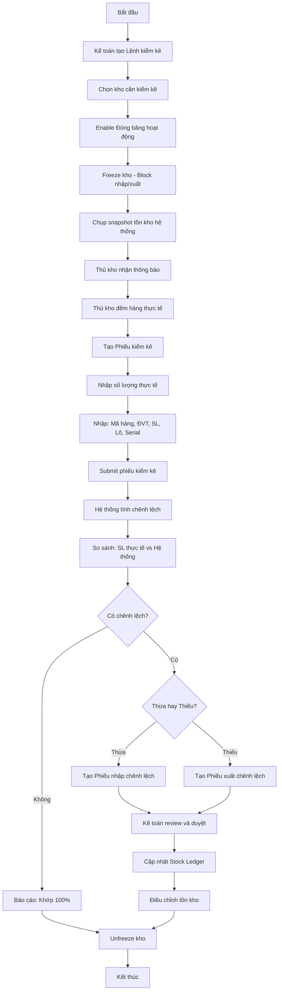
```mermaid
flowchart TD
    A[Bắt đầu] --> B[Kế toán tạo Lệnh kiểm kê]
    B --> C[Chọn kho cần kiểm kê]
    C --> D[Enable Đóng băng hoạt động]
    D --> E["Freeze kho - Block nhập/xuất"]
    E --> F[Chụp snapshot tồn kho hệ thống]

    F --> G[Thủ kho nhận thông báo]
    G --> H[Thủ kho đếm hàng thực tế]
    H --> I[Tạo Phiếu kiểm kê]
    I --> J[Nhập số lượng thực tế]
    J --> K["Nhập: Mã hàng, ĐVT, SL, Lô, Serial"]
    K --> L[Submit phiếu kiểm kê]

    L --> M[Hệ thống tính chênh lệch]
    M --> N["So sánh: SL thực tế vs Hệ thống"]

    N --> O{Có chênh lệch?}

    O -->|Không| P["Báo cáo: Khớp 100%"]
    P --> Q[Unfreeze kho]
    Q --> R[Kết thúc]

    O -->|Có| S{Thừa hay Thiếu?}
    S -->|Thừa| T[Tạo Phiếu nhập chênh lệch]
    S -->|Thiếu| U[Tạo Phiếu xuất chênh lệch]

    T --> V[Kế toán review và duyệt]
    U --> V
    V --> W[Cập nhật Stock Ledger]
    W --> X[Điều chỉnh tồn kho]
    X --> Q
```

---

## 14. AD-05: Batch Tracking Lifecycle

**Mô tả:** Sơ đồ hoạt động quản lý lô hàng hóa

**Nguồn:** ERP_SPECIFICATION.md Section 4, Danh mục lô (lines 588-596)

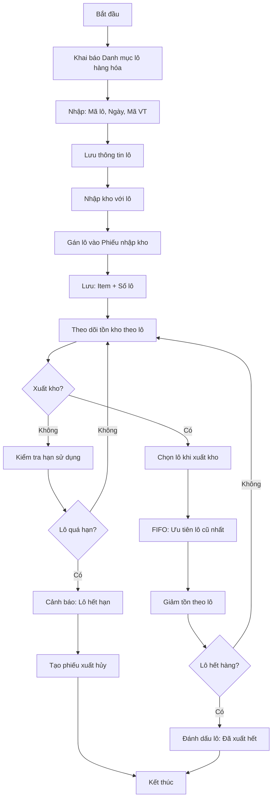
```mermaid
flowchart TD
    A[Bắt đầu] --> B[Khai báo Danh mục lô hàng hóa]
    B --> C["Nhập: Mã lô, Ngày, Mã VT"]
    C --> D[Lưu thông tin lô]

    D --> E[Nhập kho với lô]
    E --> F[Gán lô vào Phiếu nhập kho]
    F --> G["Lưu: Item + Số lô"]

    G --> H[Theo dõi tồn kho theo lô]
    H --> I{Xuất kho?}

    I -->|Có| J[Chọn lô khi xuất kho]
    J --> K["FIFO: Ưu tiên lô cũ nhất"]
    K --> L[Giảm tồn theo lô]
    L --> M{Lô hết hàng?}

    M -->|Có| N["Đánh dấu lô: Đã xuất hết"]
    M -->|Không| H

    I -->|Không| O[Kiểm tra hạn sử dụng]
    O --> P{Lô quá hạn?}

    P -->|Có| Q["Cảnh báo: Lô hết hạn"]
    Q --> R[Tạo phiếu xuất hủy]
    R --> S[Kết thúc]

    P -->|Không| H
    N --> S
```

---

## 15. AD-06: Serial Number Lifecycle

**Mô tả:** Sơ đồ hoạt động quản lý Serial Number

**Nguồn:** ERP_SPECIFICATION.md Section 4, In tem mã vạch (lines 598-612)

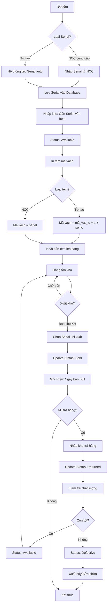
```mermaid
flowchart TD
    A[Bắt đầu] --> B{Loại Serial?}

    B -->|NCC cung cấp| C[Nhập Serial từ NCC]
    B -->|Tự tạo| D[Hệ thống tạo Serial auto]

    C --> E[Lưu Serial vào Database]
    D --> E

    E --> F["Nhập kho: Gán Serial vào Item"]
    F --> G["Status: Available"]
    G --> H[In tem mã vạch]

    H --> I{Loại tem?}
    I -->|Tự tạo| J["Mã vạch = mã_vat_tu + ;; + so_lo"]
    I -->|NCC| K["Mã vạch = serial"]

    J --> L[In và dán tem lên hàng]
    K --> L

    L --> M[Hàng tồn kho]
    M --> N{Xuất kho?}

    N -->|Bán cho KH| O[Chọn Serial khi xuất]
    O --> P["Update Status: Sold"]
    P --> Q["Ghi nhận: Ngày bán, KH"]

    N -->|Chờ bán| M

    Q --> R{KH trả hàng?}
    R -->|Có| S[Nhập kho trả hàng]
    S --> T["Update Status: Returned"]
    T --> U[Kiểm tra chất lượng]
    U --> V{Còn tốt?}

    V -->|Có| W["Status: Available"]
    V -->|Không| X["Status: Defective"]
    X --> Y["Xuất hủy/Sửa chữa"]

    W --> M
    Y --> Z[Kết thúc]
    R -->|Không| Z
```

---

## 16. Component Diagram - Warehouse Module

**Mô tả:** Kiến trúc module Warehouse và tích hợp

**Nguồn:** ERP_SPECIFICATION.md Section 4 (lines 455-641)

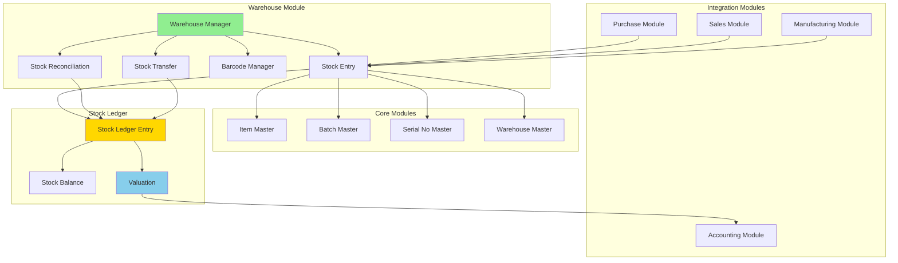
```mermaid
flowchart TB
    subgraph "Warehouse Module"
        WM[Warehouse Manager]
        SE[Stock Entry]
        SR[Stock Reconciliation]
        BC[Barcode Manager]
        ST[Stock Transfer]
    end

    subgraph "Core Modules"
        ITEM[Item Master]
        BATCH[Batch Master]
        SERIAL[Serial No Master]
        WH[Warehouse Master]
    end

    subgraph "Integration Modules"
        PUR[Purchase Module]
        SAL[Sales Module]
        ACC[Accounting Module]
        MFG[Manufacturing Module]
    end

    subgraph "Stock Ledger"
        SLE[Stock Ledger Entry]
        SLB[Stock Balance]
        VAL[Valuation]
    end

    WM --> SE
    WM --> SR
    WM --> BC
    WM --> ST

    SE --> ITEM
    SE --> BATCH
    SE --> SERIAL
    SE --> WH

    SE --> SLE
    SR --> SLE
    ST --> SLE

    SLE --> SLB
    SLE --> VAL

    PUR --> SE
    SAL --> SE
    MFG --> SE

    VAL --> ACC

    style WM fill:#90EE90
    style SLE fill:#FFD700
    style VAL fill:#87CEEB
```

---

## 17. Class Diagram - Core Warehouse Classes

**Mô tả:** Các class chính của module Warehouse

**Nguồn:** ERP_SPECIFICATION.md Section 4 (lines 455-641)

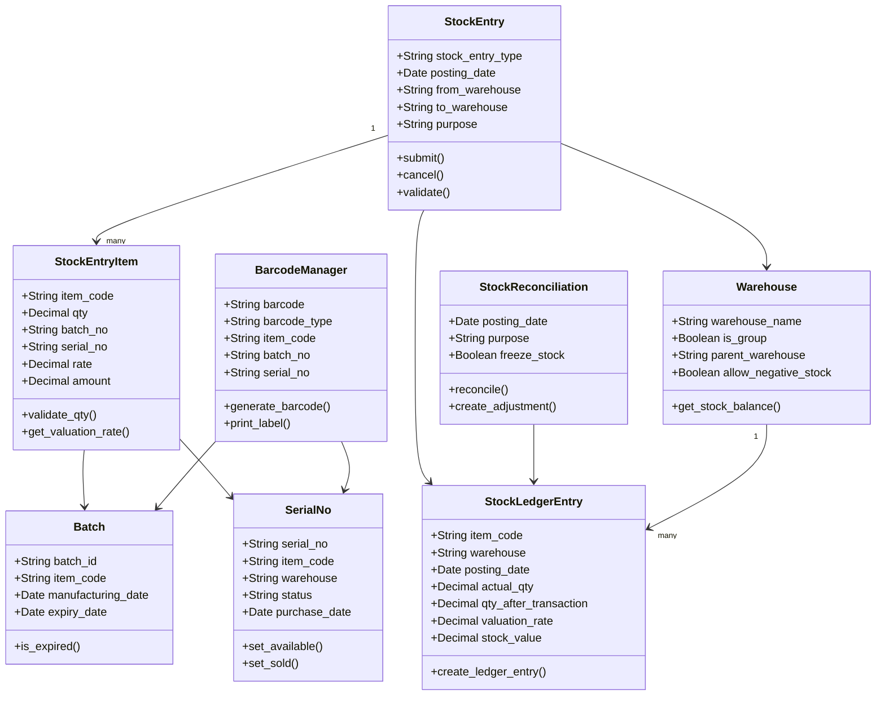
```mermaid
classDiagram
    class StockEntry {
        +String stock_entry_type
        +Date posting_date
        +String from_warehouse
        +String to_warehouse
        +String purpose
        +submit()
        +cancel()
        +validate()
    }

    class StockEntryItem {
        +String item_code
        +Decimal qty
        +String batch_no
        +String serial_no
        +Decimal rate
        +Decimal amount
        +validate_qty()
        +get_valuation_rate()
    }

    class Warehouse {
        +String warehouse_name
        +Boolean is_group
        +String parent_warehouse
        +Boolean allow_negative_stock
        +get_stock_balance()
    }

    class StockLedgerEntry {
        +String item_code
        +String warehouse
        +Date posting_date
        +Decimal actual_qty
        +Decimal qty_after_transaction
        +Decimal valuation_rate
        +Decimal stock_value
        +create_ledger_entry()
    }

    class Batch {
        +String batch_id
        +String item_code
        +Date manufacturing_date
        +Date expiry_date
        +is_expired()
    }

    class SerialNo {
        +String serial_no
        +String item_code
        +String warehouse
        +String status
        +Date purchase_date
        +set_available()
        +set_sold()
    }

    class StockReconciliation {
        +Date posting_date
        +String purpose
        +Boolean freeze_stock
        +reconcile()
        +create_adjustment()
    }

    class BarcodeManager {
        +String barcode
        +String barcode_type
        +String item_code
        +String batch_no
        +String serial_no
        +generate_barcode()
        +print_label()
    }

    StockEntry "1" --> "many" StockEntryItem
    StockEntry --> Warehouse
    StockEntry --> StockLedgerEntry
    StockEntryItem --> Batch
    StockEntryItem --> SerialNo
    StockReconciliation --> StockLedgerEntry
    BarcodeManager --> Batch
    BarcodeManager --> SerialNo
    Warehouse "1" --> "many" StockLedgerEntry
```

---

## 18. State Diagram - Stock Entry Status

**Mô tả:** Trạng thái của Phiếu nhập/xuất kho

**Nguồn:** ERP_SPECIFICATION.md Section 4 (lines 455-641)

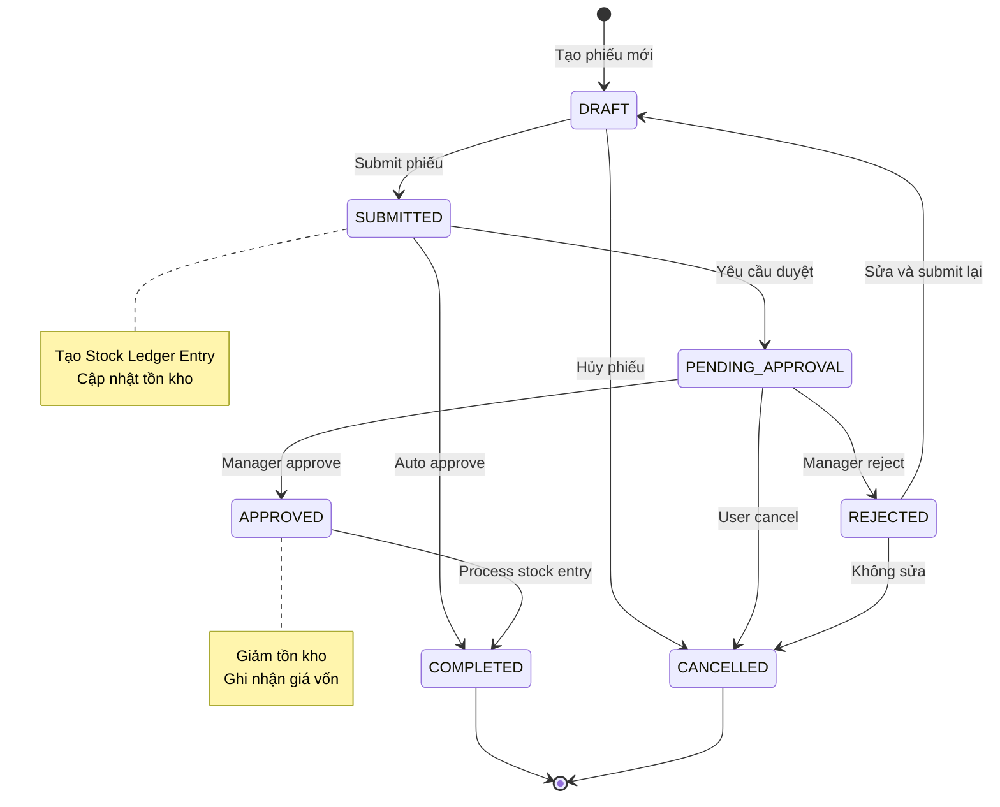
```mermaid
stateDiagram-v2
    [*] --> DRAFT: Tạo phiếu mới

    DRAFT --> SUBMITTED: Submit phiếu
    DRAFT --> CANCELLED: Hủy phiếu

    SUBMITTED --> PENDING_APPROVAL: Yêu cầu duyệt
    SUBMITTED --> COMPLETED: Auto approve

    PENDING_APPROVAL --> APPROVED: Manager approve
    PENDING_APPROVAL --> REJECTED: Manager reject
    PENDING_APPROVAL --> CANCELLED: User cancel

    APPROVED --> COMPLETED: Process stock entry
    REJECTED --> DRAFT: Sửa và submit lại
    REJECTED --> CANCELLED: Không sửa

    COMPLETED --> [*]
    CANCELLED --> [*]

    note right of SUBMITTED
        Tạo Stock Ledger Entry
        Cập nhật tồn kho
    end note

    note right of APPROVED
        Giảm tồn kho
        Ghi nhận giá vốn
    end note
```

---

## 19. State Diagram - Stock Reconciliation Flow

**Mô tả:** Trạng thái của quy trình Kiểm kê

**Nguồn:** ERP_SPECIFICATION.md Section 4, Bước 9-11 (lines 532-568)

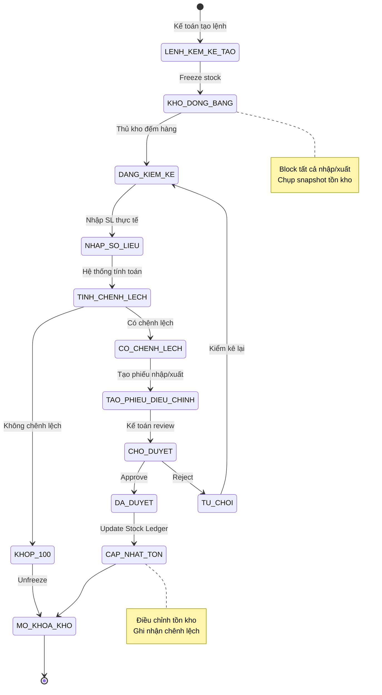
```mermaid
stateDiagram-v2
    [*] --> LENH_KEM_KE_TAO: Kế toán tạo lệnh

    LENH_KEM_KE_TAO --> KHO_DONG_BANG: Freeze stock

    KHO_DONG_BANG --> DANG_KIEM_KE: Thủ kho đếm hàng

    DANG_KIEM_KE --> NHAP_SO_LIEU: Nhập SL thực tế

    NHAP_SO_LIEU --> TINH_CHENH_LECH: Hệ thống tính toán

    TINH_CHENH_LECH --> KHOP_100: Không chênh lệch
    TINH_CHENH_LECH --> CO_CHENH_LECH: Có chênh lệch

    CO_CHENH_LECH --> TAO_PHIEU_DIEU_CHINH: Tạo phiếu nhập/xuất

    TAO_PHIEU_DIEU_CHINH --> CHO_DUYET: Kế toán review

    CHO_DUYET --> DA_DUYET: Approve
    CHO_DUYET --> TU_CHOI: Reject

    TU_CHOI --> DANG_KIEM_KE: Kiểm kê lại

    DA_DUYET --> CAP_NHAT_TON: Update Stock Ledger
    KHOP_100 --> MO_KHOA_KHO: Unfreeze

    CAP_NHAT_TON --> MO_KHOA_KHO

    MO_KHOA_KHO --> [*]

    note right of KHO_DONG_BANG
        Block tất cả nhập/xuất
        Chụp snapshot tồn kho
    end note

    note right of CAP_NHAT_TON
        Điều chỉnh tồn kho
        Ghi nhận chênh lệch
    end note
```

---

## 20. Deployment Diagram - Warehouse Architecture

**Mô tả:** Kiến trúc triển khai module Warehouse

**Nguồn:** ERP_SPECIFICATION.md Section 4 (lines 455-641)

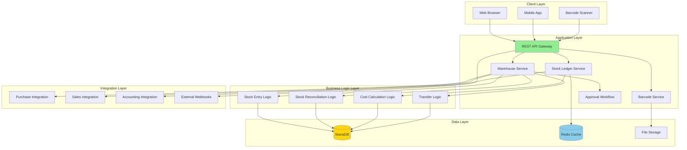
```mermaid
flowchart TB
    subgraph "Client Layer"
        WEB[Web Browser]
        MOBILE[Mobile App]
        BARCODE[Barcode Scanner]
    end

    subgraph "Application Layer"
        API[REST API Gateway]
        WH_SERVICE[Warehouse Service]
        STOCK_SERVICE[Stock Ledger Service]
        BARCODE_SERVICE[Barcode Service]
        APPROVAL_SERVICE[Approval Workflow]
    end

    subgraph "Business Logic Layer"
        SE_LOGIC[Stock Entry Logic]
        SR_LOGIC[Stock Reconciliation Logic]
        COST_LOGIC[Cost Calculation Logic]
        TRANSFER_LOGIC[Transfer Logic]
    end

    subgraph "Data Layer"
        DB[(MariaDB)]
        CACHE[(Redis Cache)]
        FILES[File Storage]
    end

    subgraph "Integration Layer"
        PURCHASE_INT[Purchase Integration]
        SALES_INT[Sales Integration]
        ACCOUNTING_INT[Accounting Integration]
        WEBHOOK[External Webhooks]
    end

    WEB --> API
    MOBILE --> API
    BARCODE --> API

    API --> WH_SERVICE
    API --> STOCK_SERVICE
    API --> BARCODE_SERVICE

    WH_SERVICE --> SE_LOGIC
    WH_SERVICE --> SR_LOGIC
    WH_SERVICE --> TRANSFER_LOGIC
    STOCK_SERVICE --> COST_LOGIC

    WH_SERVICE --> APPROVAL_SERVICE

    SE_LOGIC --> DB
    SR_LOGIC --> DB
    COST_LOGIC --> DB
    TRANSFER_LOGIC --> DB

    STOCK_SERVICE --> CACHE
    BARCODE_SERVICE --> FILES

    WH_SERVICE --> PURCHASE_INT
    WH_SERVICE --> SALES_INT
    STOCK_SERVICE --> ACCOUNTING_INT
    API --> WEBHOOK

    style API fill:#90EE90
    style DB fill:#FFD700
    style CACHE fill:#87CEEB
```

---

**Nguồn:** `/docs/feature/ERP_SPECIFICATION.md` Section 4 - Quản lý Kho (lines 455-641)
**Ngày cập nhật:** 2026-01-15
**Trạng thái:** Đặc tả YÊU CẦU - Code phải implement theo diagrams này
