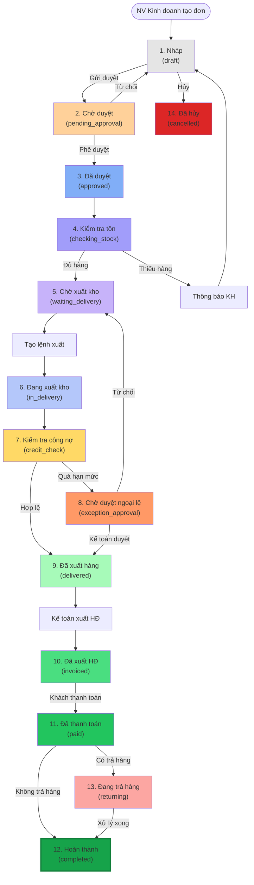
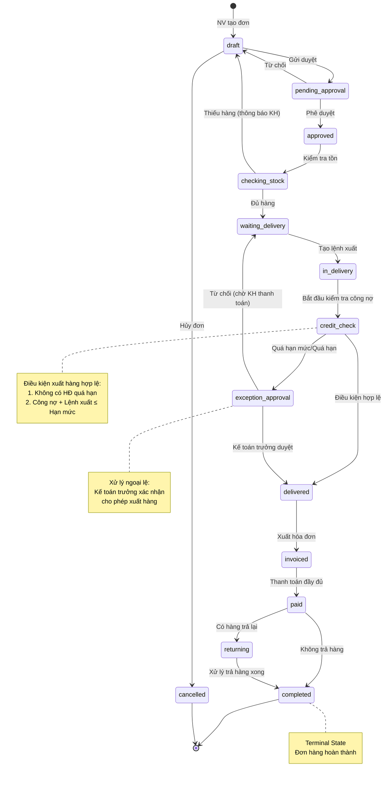
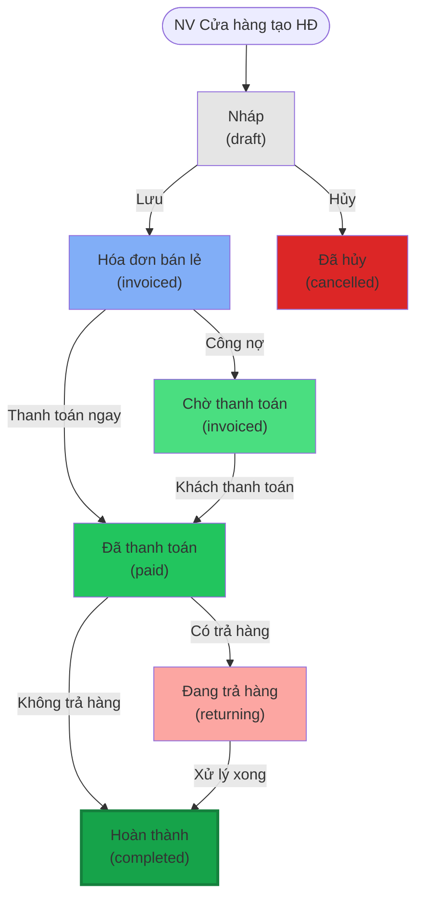

# Module Sales Order - Trạng thái (Status)

> **Phiên bản**: v1.0 - Cơ bản
> **Ngày cập nhật**: 2026-01-14
> **Trạng thái**: Đề xuất - Chờ khách hàng Nhật Minh phê duyệt
> **Nguồn:** ERP_SPECIFICATION.md Section 2

---

## 📋 Danh sách trạng thái - Sales Order

| # | Trạng thái | Code | Màu | Mô tả | Loại | Bước |
|---|------------|------|-----|-------|------|------|
| 1 | **Nháp** | `draft` | #e5e5e5 | Đơn hàng đang soạn thảo | Draft | - |
| 2 | **Chờ duyệt** | `pending_approval` | #ffd19a | Đơn hàng chờ duyệt | Active | Bước 4 |
| 3 | **Đã duyệt** | `approved` | #81aef7 | Đơn hàng đã được phê duyệt | Active | Bước 4 |
| 4 | **Kiểm tra tồn** | `checking_stock` | #a19dfa | Đang kiểm tra tồn kho | Active | Bước 5 |
| 5 | **Chờ xuất kho** | `waiting_delivery` | #c7b3fa | Chờ tạo lệnh xuất | Active | Bước 6 |
| 6 | **Đang xuất kho** | `in_delivery` | #b4c7fa | Đã tạo lệnh xuất, chờ kho xuất | Active | Bước 6 |
| 7 | **Kiểm tra công nợ** | `credit_check` | #ffd966 | Kiểm tra hạn mức & công nợ quá hạn | Active | Bước 7,8 |
| 8 | **Chờ duyệt ngoại lệ** | `exception_approval` | #ff9966 | Quá hạn mức, chờ Kế toán trưởng duyệt | Active | Bước 8 |
| 9 | **Đã xuất hàng** | `delivered` | #a7fab9 | Hàng đã xuất khỏi kho | Active | Bước 9 |
| 10 | **Đã xuất HĐ** | `invoiced` | #4ade80 | Đã xuất hóa đơn | Active | Bước 9 |
| 11 | **Đã thanh toán** | `paid` | #22c55e | Đã thanh toán đầy đủ | Terminal | - |
| 12 | **Hoàn thành** | `completed` | #16a34a | Hoàn thành (có thể có trả hàng) | Terminal | - |
| 13 | **Đang trả hàng** | `returning` | #fca6a2 | Đang xử lý trả hàng | Active | Bước 10,11 |
| 14 | **Đã hủy** | `cancelled` | #dc2626 | Đơn hàng bị hủy | Terminal | - |

### Phân loại

- **Draft**: Trạng thái nháp, chưa gửi duyệt
- **Active**: Trạng thái đang hoạt động, có thể chuyển sang trạng thái khác
- **Terminal**: Trạng thái kết thúc, không thể chuyển sang trạng thái khác (trừ trả hàng)

---

## 🔄 Workflow - Luồng chuyển đổi (Bán buôn)

### Sơ đồ tổng quan - 12 bước



### State Machine Diagram - Sales Order



---

## 📊 Workflow - Bán lẻ (Simplified)

### Sơ đồ Bán lẻ - 3 bước



**Lưu ý:**
- Bán lẻ đơn giản hơn, không cần phê duyệt
- Xuất hàng và xuất HĐ cùng lúc
- Thanh toán ngay hoặc công nợ (theo chính sách)

---

## 🔍 Chi tiết chuyển đổi trạng thái

### 1. Draft → Pending Approval

**Điều kiện:**
- Đơn hàng đã điền đầy đủ thông tin bắt buộc
- Có ít nhất 1 sản phẩm
- Khách hàng hợp lệ

**Validation:**
- Kiểm tra bảng giá còn hiệu lực
- Kiểm tra chính sách chiết khấu (nếu có)
- Tính toán tổng tiền

**Trigger:** NV Kinh doanh click "Gửi duyệt"

---

### 2. Pending Approval → Approved

**Điều kiện:**
- Người duyệt có quyền phê duyệt
- Kiểm tra giá bán, chiết khấu hợp lý

**Validation:**
- Xác thực chữ ký/quyền duyệt
- Log lại người duyệt, thời gian

**Trigger:** Quản lý/Trưởng phòng KD click "Phê duyệt"

---

### 3. Approved → Checking Stock

**Điều kiện:**
- Đơn hàng đã được phê duyệt

**Action:**
- Gọi API kiểm tra tồn kho khả dụng
- Trừ tồn kho khả dụng (giữ hàng cho đơn)

**Trigger:** Tự động sau khi duyệt

---

### 4. Checking Stock → Waiting Delivery

**Điều kiện:**
- Tồn kho đủ cho tất cả các item trong đơn
- Tồn kho khả dụng = Tồn kho thực tế - Đã giữ cho đơn khác

**Action:**
- Đánh dấu tồn kho "reserved" cho đơn này
- Thông báo cho bộ phận kho

**Trigger:** Tự động sau khi check tồn

**Exception:**
- Nếu thiếu hàng → Thông báo KH → Quay về Draft

---

### 5. Waiting Delivery → In Delivery

**Điều kiện:**
- Đã đến ngày dự kiến giao hàng
- Hoặc NV KD tạo lệnh xuất thủ công

**Action:**
- Tạo "Lệnh xuất hàng" (Delivery Note)
- Kế thừa dữ liệu từ Sales Order
- Gửi thông báo cho bộ phận kho

**Trigger:** NV KD click "Tạo lệnh xuất"

---

### 6. In Delivery → Credit Check

**Điều kiện:**
- Lệnh xuất đã được tạo
- Bộ phận kho đã chuẩn bị hàng (có thể là sub-status)

**Action:**
- Gọi API kiểm tra hạn mức công nợ
- Gọi API kiểm tra hóa đơn quá hạn

**Trigger:** Tự động khi lệnh xuất được tạo

---

### 7. Credit Check → Delivered (Happy Path)

**Điều kiện xuất hàng hợp lệ:**
1. Khách hàng **KHÔNG** có hóa đơn quá hạn
2. `Công nợ hiện tại + Lệnh xuất đã duyệt chưa xuất + Lệnh xuất hiện tại ≤ Hạn mức công nợ`

**Action:**
- Bộ phận kho xuất hàng
- Cập nhật thông tin thực xuất (Serial, Lô, Số lượng thực tế)
- Trừ tồn kho thực tế
- Thông báo cho KH (SMS/Email/Zalo)

**Trigger:** Bộ phận kho click "Xác nhận đã xuất hàng"

---

### 8. Credit Check → Exception Approval (Exception Path)

**Điều kiện:**
- Có hóa đơn quá hạn, HOẶC
- Công nợ + Lệnh xuất > Hạn mức

**Action:**
- Cảnh báo (Alert) cho NV KD
- Gửi yêu cầu duyệt cho Kế toán trưởng
- Tạm giữ lệnh xuất

**Trigger:** Tự động khi không đạt điều kiện credit check

---

### 9. Exception Approval → Delivered

**Điều kiện:**
- Kế toán trưởng xác nhận cho phép xuất hàng

**Action:**
- Ghi log lý do duyệt ngoại lệ
- Chuyển sang Delivered (tương tự bước 7)

**Trigger:** Kế toán trưởng click "Duyệt ngoại lệ"

---

### 10. Exception Approval → Waiting Delivery (Reject)

**Điều kiện:**
- Kế toán trưởng từ chối duyệt

**Action:**
- Thông báo cho KH cần thanh toán công nợ cũ
- Chuyển về "Chờ xuất kho"
- Giữ nguyên reserved stock

**Trigger:** Kế toán trưởng click "Từ chối"

---

### 11. Delivered → Invoiced

**Điều kiện:**
- Hàng đã xuất khỏi kho
- Bộ phận kế toán nhận được thông tin thực xuất

**Action:**
- Kế toán tạo "Hóa đơn bán buôn"
- Kế thừa dữ liệu từ lệnh xuất (số lượng thực xuất, serial, lô)
- Tự động lấy bảng giá, chính sách chiết khấu theo ngày HĐ
- **Cảnh báo** nếu giá trên lệnh xuất ≠ giá trên HĐ

**Trigger:** Kế toán click "Xuất hóa đơn"

---

### 12. Invoiced → Paid

**Điều kiện:**
- Khách hàng đã thanh toán đầy đủ

**Action:**
- Tạo "Phiếu thu tiền mặt" hoặc "Báo có ngân hàng"
- Cập nhật công nợ khách hàng
- Đối trừ công nợ với hóa đơn

**Trigger:**
- Kế toán click "Ghi nhận thanh toán"
- Hoặc tự động từ Ngân hàng API (bank reconciliation)

---

### 13. Paid → Completed (No Return)

**Điều kiện:**
- Đã thanh toán đầy đủ
- Không có yêu cầu trả hàng

**Action:**
- Đánh dấu đơn hàng hoàn thành
- Tính thưởng cho NV (nếu có)
- Tính thưởng đạt kế hoạch doanh số (Bước 12)

**Trigger:** Tự động sau N ngày, hoặc thủ công

---

### 14. Paid → Returning (Has Return)

**Điều kiện:**
- Khách hàng yêu cầu trả hàng
- Trong thời gian cho phép trả hàng

**Action:**
- Tạo "Lệnh nhập hàng trả lại" (Bước 10)
- Kiểm tra serial có trong HĐ bán không
- Bộ phận kho nhập hàng trả lại
- Kế toán tạo "Phiếu hàng bán trả lại" (Bước 11)

**Trigger:** NV KD click "Tạo lệnh trả hàng"

---

### 15. Returning → Completed

**Điều kiện:**
- Đã xử lý xong trả hàng
- Đã hoàn tiền hoặc ghi nhận giảm trừ công nợ

**Action:**
- Cập nhật tồn kho (nhập lại hàng trả về)
- Điều chỉnh doanh số, báo cáo
- Đánh dấu đơn hàng hoàn thành (có ghi chú trả hàng)

**Trigger:** Kế toán click "Hoàn tất xử lý trả hàng"

---

## 🗄️ Database Schema - Status Management

### Sales Order Status Fields

```sql
-- Bảng Sales Order
CREATE TABLE `tabSales Order` (
    `name` VARCHAR(140) PRIMARY KEY,  -- SO-YYMMDD-XXXX
    `status` VARCHAR(30) NOT NULL DEFAULT 'draft',
    `workflow_state` VARCHAR(30),  -- Frappe Workflow state
    `docstatus` INT(1) DEFAULT 0,  -- 0=Draft, 1=Submitted, 2=Cancelled

    -- Order info
    `customer` VARCHAR(140) NOT NULL,
    `transaction_date` DATE NOT NULL,
    `delivery_date` DATE,
    `grand_total` DECIMAL(18,6) DEFAULT 0.0,

    -- Workflow tracking
    `approved_by` VARCHAR(140),
    `approved_at` DATETIME,
    `credit_checked_by` VARCHAR(140),
    `credit_checked_at` DATETIME,
    `exception_approved_by` VARCHAR(140),
    `exception_approval_reason` TEXT,

    -- Stock & delivery
    `stock_reserved` TINYINT(1) DEFAULT 0,
    `delivery_note` VARCHAR(140),  -- Link to Delivery Note

    -- Invoice & payment
    `sales_invoice` VARCHAR(140),  -- Link to Sales Invoice
    `payment_status` VARCHAR(30),  -- Unpaid, Partially Paid, Paid
    `outstanding_amount` DECIMAL(18,6) DEFAULT 0.0,

    -- Return handling
    `has_return` TINYINT(1) DEFAULT 0,
    `return_note` VARCHAR(140),  -- Link to Return Note

    -- Timestamps
    `creation` DATETIME(6),
    `modified` DATETIME(6),
    `modified_by` VARCHAR(140)
);

-- Bảng trạng thái log (Status History)
CREATE TABLE `tabSales Order Status Log` (
    `name` VARCHAR(140) PRIMARY KEY,
    `parent` VARCHAR(140) NOT NULL,  -- Sales Order name
    `parenttype` VARCHAR(140) DEFAULT 'Sales Order',

    `from_status` VARCHAR(30),
    `to_status` VARCHAR(30) NOT NULL,
    `changed_by` VARCHAR(140) NOT NULL,
    `changed_at` DATETIME(6) NOT NULL,
    `reason` TEXT,

    KEY `parent` (`parent`)
);
```

### Status Transition Matrix (Database)

```sql
-- Bảng Workflow Transitions (Config)
CREATE TABLE `tabSales Order Workflow Transition` (
    `name` VARCHAR(140) PRIMARY KEY,
    `from_status` VARCHAR(30) NOT NULL,
    `to_status` VARCHAR(30) NOT NULL,
    `allowed_roles` TEXT,  -- JSON array: ["Sales User", "Sales Manager"]
    `conditions` TEXT,  -- JSON conditions
    `actions` TEXT,  -- JSON actions to execute
    `is_auto` TINYINT(1) DEFAULT 0,  -- Auto transition?

    UNIQUE KEY `transition` (`from_status`, `to_status`)
);
```

---

## 🔐 Permissions - Quyền theo trạng thái

### Vai trò (Roles)

| Vai trò | Mô tả | Quyền chính |
|---------|-------|-------------|
| **Sales User** | Nhân viên kinh doanh | Tạo đơn, Gửi duyệt, Tạo lệnh xuất |
| **Sales Manager** | Quản lý kinh doanh | Phê duyệt đơn hàng |
| **Stock User** | Nhân viên kho | Xác nhận xuất hàng, Nhập hàng trả lại |
| **Accounts User** | Kế toán | Xuất hóa đơn, Ghi nhận thanh toán |
| **Accounts Manager** | Kế toán trưởng | Duyệt ngoại lệ công nợ |
| **System Manager** | Quản trị hệ thống | Toàn quyền |

### Ma trận quyền theo trạng thái

| Status | Sales User | Sales Manager | Stock User | Accounts User | Accounts Manager |
|--------|------------|---------------|------------|---------------|------------------|
| **draft** | ✅ Edit, Delete | ✅ Edit, Delete | ❌ Read | ❌ Read | ✅ Read |
| **pending_approval** | ❌ Read | ✅ Approve, Reject | ❌ Read | ❌ Read | ✅ Read |
| **approved** | ✅ Read, Create DO | ✅ Read | ❌ Read | ❌ Read | ✅ Read |
| **checking_stock** | ✅ Read | ✅ Read | ❌ Read | ❌ Read | ✅ Read |
| **waiting_delivery** | ✅ Read, Create DO | ✅ Read | ❌ Read | ❌ Read | ✅ Read |
| **in_delivery** | ✅ Read | ✅ Read | ✅ Confirm Delivery | ❌ Read | ✅ Read |
| **credit_check** | ✅ Read | ✅ Read | ✅ Read | ❌ Read | ✅ Approve Exception |
| **exception_approval** | ✅ Read | ✅ Read | ❌ Read | ❌ Read | ✅ Approve, Reject |
| **delivered** | ✅ Read | ✅ Read | ✅ Read | ✅ Create Invoice | ✅ Read |
| **invoiced** | ✅ Read | ✅ Read | ✅ Read | ✅ Record Payment | ✅ Read |
| **paid** | ✅ Read, Create Return | ✅ Read | ✅ Process Return | ✅ Read | ✅ Read |
| **completed** | ✅ Read | ✅ Read | ✅ Read | ✅ Read | ✅ Read |
| **returning** | ✅ Read | ✅ Read | ✅ Confirm Return | ✅ Create Credit Note | ✅ Read |
| **cancelled** | ✅ Read | ✅ Read | ✅ Read | ✅ Read | ✅ Read |

**Chú thích:**
- ✅ **Read**: Xem
- ✅ **Edit**: Sửa
- ✅ **Delete**: Xóa
- ✅ **Approve**: Phê duyệt
- ✅ **Reject**: Từ chối
- ❌ **No access**: Không có quyền

---

## 📐 Business Rules

### Rule 1: Automatic Status Transition

**Điều kiện:**
- Một số trạng thái chuyển tự động dựa trên events:
  - `approved` → `checking_stock` (auto)
  - `checking_stock` → `waiting_delivery` (auto, nếu đủ hàng)
  - `in_delivery` → `credit_check` (auto)

**Implementation:**
- Sử dụng Frappe Workflow hooks
- `on_update()` method để trigger auto transitions

---

### Rule 2: Reserved Stock Management

**Quy tắc:**
- Khi chuyển sang `waiting_delivery`, tồn kho khả dụng bị trừ (reserved)
- Nếu đơn hủy (`cancelled`), reserved stock được giải phóng
- Reserved stock timeout: 7 ngày (sau đó tự động giải phóng nếu không xuất)

**Formula:**
```
Available Stock = Actual Stock - Reserved Stock (from all orders in waiting_delivery/in_delivery)
```

---

### Rule 3: Credit Limit Validation

**Quy tắc:**
- Kiểm tra tại `credit_check` status
- Formula:
  ```
  Current Outstanding + Pending Deliveries + Current Order Amount ≤ Credit Limit
  ```
- Nếu vi phạm → `exception_approval`
- Nếu có HĐ quá hạn (>30 ngày) → `exception_approval` (bất kể hạn mức)

---

### Rule 4: Price Validation

**Quy tắc:**
- Khi xuất HĐ (`delivered` → `invoiced`), kiểm tra:
  - Giá trên Delivery Note = Giá trên Sales Invoice
  - Nếu khác → Cảnh báo (nhưng vẫn cho phép, ghi log)

**Lý do:**
- Giá có thể thay đổi giữa ngày đặt hàng và ngày xuất HĐ
- Cần audit trail để kiểm tra sau

---

### Rule 5: Return Policy

**Quy tắc:**
- Chỉ cho phép trả hàng khi status = `paid` hoặc `completed`
- Kiểm tra Serial Number phải có trong HĐ bán ban đầu
- Thời hạn trả hàng: Tùy chính sách (VD: 7 ngày, 30 ngày)
- Số lượng trả ≤ Số lượng đã bán

---

## 📊 Status Reporting

### Dashboard Metrics

| Metric | Mô tả | Formula |
|--------|-------|---------|
| **Pending Approval** | Đơn chờ duyệt | COUNT(status = 'pending_approval') |
| **Waiting Delivery** | Đơn chờ xuất | COUNT(status IN ('waiting_delivery', 'in_delivery')) |
| **Credit Issues** | Đơn vướng công nợ | COUNT(status = 'exception_approval') |
| **Delivered Today** | Đã xuất hôm nay | COUNT(status = 'delivered' AND DATE(modified) = TODAY) |
| **Pending Invoices** | Chờ xuất HĐ | COUNT(status = 'delivered') |
| **Outstanding Amount** | Công nợ chưa thu | SUM(outstanding_amount WHERE status = 'invoiced') |
| **Completed This Month** | Hoàn thành tháng này | COUNT(status = 'completed' AND MONTH(modified) = THIS_MONTH) |

---

## 🚨 Exception Handling

### Exception 1: Insufficient Stock

**Trigger:** `checking_stock` → Thiếu hàng

**Actions:**
1. Gửi email/thông báo cho KH
2. Đề xuất sản phẩm thay thế (nếu có)
3. Chuyển về `draft` để NV sửa đơn

**Responsible:** NV Kinh doanh

---

### Exception 2: Credit Limit Exceeded

**Trigger:** `credit_check` → Quá hạn mức

**Actions:**
1. Chuyển sang `exception_approval`
2. Gửi thông báo cho Kế toán trưởng
3. Đính kèm thông tin: Hạn mức, Công nợ hiện tại, Đơn hàng pending

**Responsible:** Kế toán trưởng

---

### Exception 3: Overdue Invoices

**Trigger:** `credit_check` → Có HĐ quá hạn

**Actions:**
1. Chuyển sang `exception_approval`
2. Liệt kê danh sách HĐ quá hạn
3. Yêu cầu KH thanh toán trước khi xuất hàng mới

**Responsible:** Kế toán trưởng

---

### Exception 4: Price Mismatch

**Trigger:** `delivered` → `invoiced` → Giá khác nhau

**Actions:**
1. Cảnh báo (Warning, không block)
2. Ghi log vào Status History
3. Yêu cầu Kế toán xác nhận lý do

**Responsible:** Kế toán

---

## 📝 Status Change Log Example

```json
{
  "order_id": "SO-2024-0001",
  "status_history": [
    {
      "from_status": null,
      "to_status": "draft",
      "changed_by": "sale.user1@dcnet.vn",
      "changed_at": "2024-01-15 09:00:00",
      "reason": "Order created"
    },
    {
      "from_status": "draft",
      "to_status": "pending_approval",
      "changed_by": "sale.user1@dcnet.vn",
      "changed_at": "2024-01-15 09:15:00",
      "reason": "Submitted for approval"
    },
    {
      "from_status": "pending_approval",
      "to_status": "approved",
      "changed_by": "sales.manager@dcnet.vn",
      "changed_at": "2024-01-15 10:30:00",
      "reason": "Approved by Sales Manager"
    },
    {
      "from_status": "approved",
      "to_status": "checking_stock",
      "changed_by": "system",
      "changed_at": "2024-01-15 10:30:01",
      "reason": "Auto transition after approval"
    },
    {
      "from_status": "checking_stock",
      "to_status": "waiting_delivery",
      "changed_by": "system",
      "changed_at": "2024-01-15 10:30:05",
      "reason": "Stock available, reserved 50 units"
    }
  ]
}
```

---

## 🔄 Transition Matrix (Summary)

| From | To | Trigger | Auto | Roles |
|------|----|---------|----- |-------|
| `draft` | `pending_approval` | Submit | ❌ | Sales User |
| `draft` | `cancelled` | Cancel | ❌ | Sales User, Sales Manager |
| `pending_approval` | `approved` | Approve | ❌ | Sales Manager |
| `pending_approval` | `draft` | Reject | ❌ | Sales Manager |
| `approved` | `checking_stock` | Auto | ✅ | System |
| `checking_stock` | `waiting_delivery` | Stock OK | ✅ | System |
| `checking_stock` | `draft` | Stock Insufficient | ❌ | Sales User |
| `waiting_delivery` | `in_delivery` | Create DO | ❌ | Sales User |
| `in_delivery` | `credit_check` | Auto | ✅ | System |
| `credit_check` | `delivered` | Credit OK | ❌ | Stock User |
| `credit_check` | `exception_approval` | Credit Failed | ✅ | System |
| `exception_approval` | `delivered` | Approve | ❌ | Accounts Manager |
| `exception_approval` | `waiting_delivery` | Reject | ❌ | Accounts Manager |
| `delivered` | `invoiced` | Create Invoice | ❌ | Accounts User |
| `invoiced` | `paid` | Record Payment | ❌ | Accounts User |
| `paid` | `completed` | No Return | ✅/❌ | Auto or Manual |
| `paid` | `returning` | Create Return | ❌ | Sales User |
| `returning` | `completed` | Return Processed | ❌ | Accounts User |

---

## 📌 Implementation Notes

### Frappe Framework Integration

**Workflow State Field:**
```python
# sales_order.py (DocType)
def before_save(self):
    # Auto status update based on business logic
    if self.docstatus == 0:
        self.status = "draft"
    elif self.docstatus == 1:
        self.update_status_based_on_workflow()

def update_status_based_on_workflow(self):
    # Check stock
    if self.workflow_state == "approved":
        self.check_and_reserve_stock()

    # Check credit
    if self.workflow_state == "in_delivery":
        self.check_credit_limit()
```

**Hooks:**
```python
# hooks.py
doc_events = {
    "Sales Order": {
        "on_submit": "dcnet_apps.sales_order.on_submit",
        "on_cancel": "dcnet_apps.sales_order.on_cancel",
        "on_update_after_submit": "dcnet_apps.sales_order.on_update_after_submit"
    }
}
```

---

**Nguồn:** ERP_SPECIFICATION.md Section 2 (lines 46-298)
**Tổng kết:** 14 trạng thái, 23 transitions, hỗ trợ cả Bán buôn (12 bước) và Bán lẻ (3 bước)
