# Module Sales Order - Đặc tả Workflow & ERD

> **Nguồn:** `/docs/feature/ERP_SPECIFICATION.md` Section 2 - Quản lý Bán hàng
> **Lưu ý:** Đây là đặc tả YÊU CẦU, code phải làm theo đặc tả này

---

## 1. Định nghĩa

> Quản lý toàn bộ quy trình bán hàng từ kế hoạch, bảng giá, đơn hàng, xuất kho, hóa đơn đến thu tiền và xử lý trả hàng

**Phạm vi:**
- Bán buôn (Wholesale) - 12 bước
- Bán lẻ (Retail) - 3 bước
- Tích hợp kiểm tra công nợ, hạn mức, tồn kho

---

## 2. ERD - Entity Relationship Diagram

### 2.1. Sales Order Core ERD

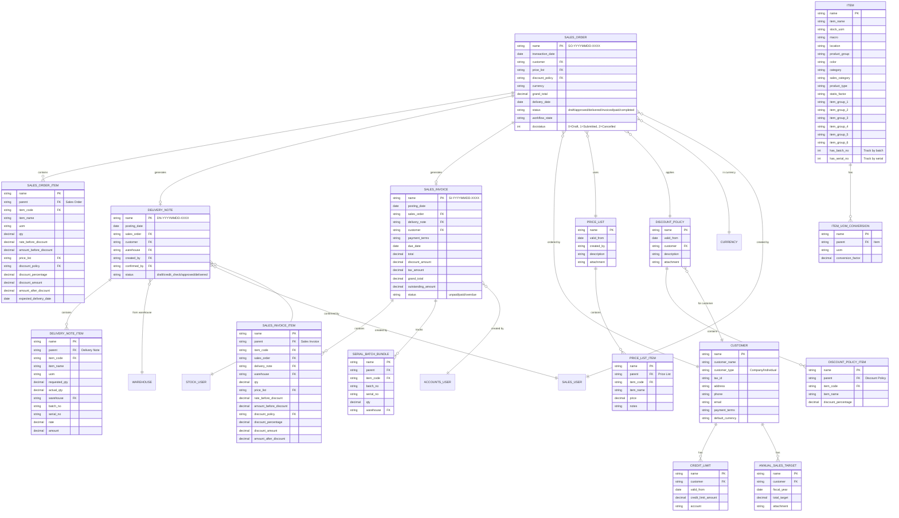

### 2.2. Return Process ERD

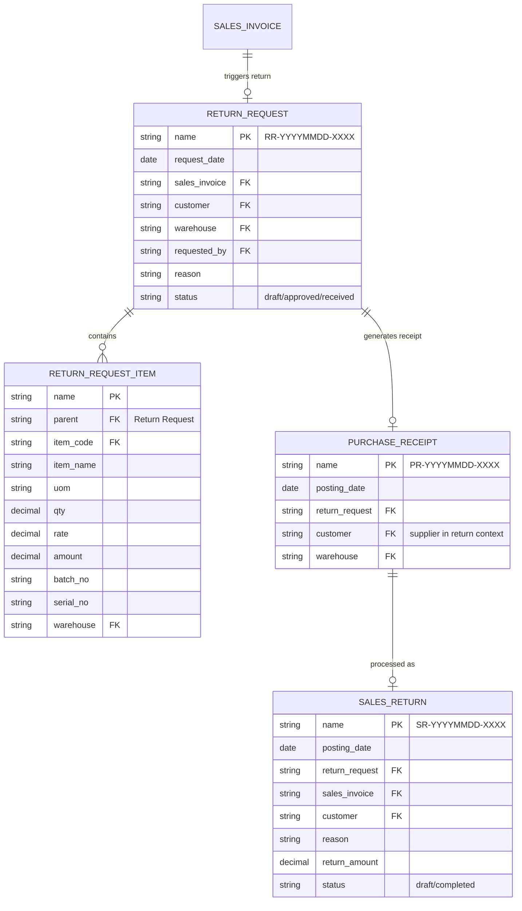

### 2.3. Retail Sales ERD

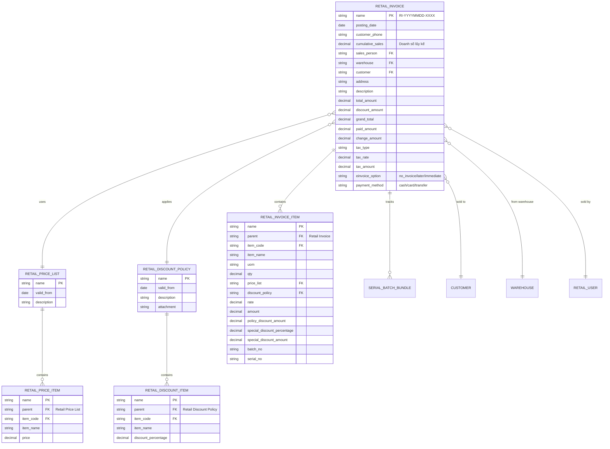

---

## 3. Workflow - Quy trình Bán buôn (12 bước)

### 3.1. Sơ đồ tổng quan - End-to-End Workflow

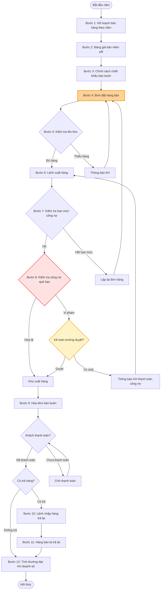

### 3.2. Workflow Chi tiết - Bước 4: Tạo đơn hàng bán (CORE)

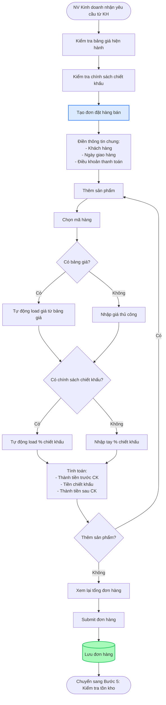

### 3.3. Workflow Chi tiết - Bước 6: Lệnh xuất hàng (Phân quyền)

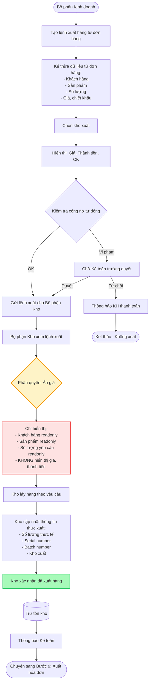

### 3.4. Workflow Chi tiết - Bước 8: Kiểm tra công nợ quá hạn (Auto)

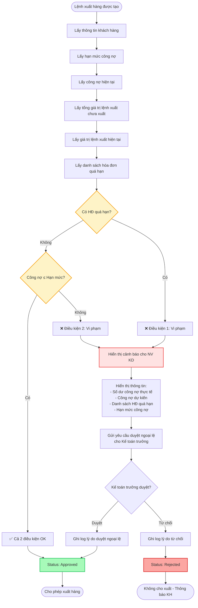

### 3.5. Workflow Chi tiết - Bước 9: Xuất hóa đơn (Kế thừa + Validate)

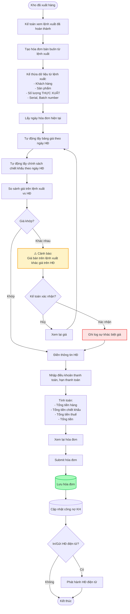

### 3.6. Workflow Chi tiết - Bước 10-11: Xử lý trả hàng

```mermaid
flowchart TD
    Start([Khách hàng yêu cầu trả hàng]) --> CheckPolicy{Trong thời hạn trả hàng?}

    CheckPolicy -->|Không| Reject[❌ Từ chối trả hàng]
    CheckPolicy -->|Có| CreateReturn[NV KD tạo lệnh nhập hàng trả lại]

    Reject --> End1([Kết thúc])

    CreateReturn --> InheritInvoice[Kế thừa từ hóa đơn bán hàng]

    InheritInvoice --> SelectItems[Chọn sản phẩm cần trả]
    SelectItems --> EnterQty[Nhập số lượng trả]
    EnterQty --> EnterSerial[Nhập Serial/Batch cần trả]

    EnterSerial --> FillWarehouse[Chọn kho nhập]
    FillWarehouse --> EnterReason[Nhập lý do trả hàng]

    EnterReason --> SubmitReturn[Submit lệnh nhập hàng trả lại]

    SubmitReturn --> SendToWarehouse[Gửi lệnh nhập cho Bộ phận Kho]

    SendToWarehouse --> WarehouseReceive[Kho nhận hàng trả lại]
    WarehouseReceive --> InspectGoods[Kho kiểm tra hàng]

    InspectGoods --> UpdateActual[Kho cập nhật thông tin thực nhập:<br/>- Mã hàng<br/>- Serial<br/>- Batch<br/>- Số lượng<br/>- Kho]

    UpdateActual --> ConfirmReceive[Kho xác nhận đã nhập]

    ConfirmReceive --> NotifyAccounts[Thông báo Kế toán]

    NotifyAccounts --> AccountsProcess[Kế toán xử lý hàng bán bị trả lại]

    AccountsProcess --> InheritReturn[Kế thừa từ lệnh nhập hàng trả lại]

    InheritReturn --> ValidateSerial{Kiểm tra Serial có trong HĐ ban đầu?}

    ValidateSerial -->|Không| ShowWarning[⚠️ Cảnh báo:<br/>Serial không tồn tại trong HĐ bán]
    ValidateSerial -->|Có| CreateCreditNote[Tạo phiếu hàng bán trả lại]

    ShowWarning --> AskConfirm{Kế toán xác nhận?}
    AskConfirm -->|Xác nhận| LogException[Ghi log ngoại lệ]
    AskConfirm -->|Hủy| End2([Kết thúc - Không xử lý])

    LogException --> CreateCreditNote

    CreateCreditNote --> SaveReturn[(Lưu phiếu trả hàng)]
    SaveReturn --> UpdateStock[(Cập nhật tồn kho +)]
    UpdateStock --> UpdateAR[(Cập nhật công nợ KH -)]

    UpdateAR --> RefundOrCredit{Hoàn tiền hay ghi giảm trừ?}

    RefundOrCredit -->|Hoàn tiền| CreatePayment[Tạo phiếu chi tiền]
    RefundOrCredit -->|Ghi giảm trừ| UpdateLedger[Cập nhật sổ cái]

    CreatePayment --> End3([Hoàn thành])
    UpdateLedger --> End3

    style ValidateSerial fill:#fef3c7,stroke:#f59e0b,stroke-width:2px
    style ShowWarning fill:#fee2e2,stroke:#ef4444,stroke-width:2px
    style SaveReturn fill:#a7fab9,stroke:#22c55e,stroke-width:2px
```

---

## 4. Workflow - Quy trình Bán lẻ (3 bước)

### 4.1. Sơ đồ tổng quan - Retail Workflow

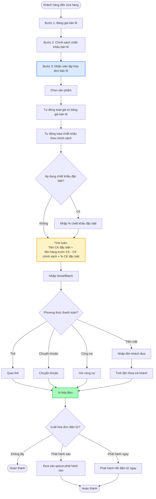

### 4.2. Workflow Chi tiết - Bước 3: Lập hóa đơn bán lẻ (POS)

```mermaid
flowchart TD
    Start([NV Cửa hàng mở POS]) --> CustomerPhone{Nhập SĐT khách hàng?}

    CustomerPhone -->|Có| SearchCustomer[Tìm khách hàng]
    CustomerPhone -->|Không| WalkIn[Khách vãng lai]

    SearchCustomer --> LoadCustomerData[Load thông tin:<br/>- Tên<br/>- Địa chỉ<br/>- Doanh số lũy kế]
    WalkIn --> AddItem
    LoadCustomerData --> AddItem

    AddItem[Quét mã sản phẩm hoặc chọn thủ công]

    AddItem --> GetPrice[Lấy giá từ bảng giá bán lẻ]
    GetPrice --> GetDiscount{Có chính sách chiết khấu?}

    GetDiscount -->|Có| ApplyPolicyDiscount[Áp dụng chiết khấu theo chính sách]
    GetDiscount -->|Không| EnterQty

    ApplyPolicyDiscount --> SpecialDiscount{Áp dụng chiết khấu đặc biệt?}
    SpecialDiscount -->|Có| EnterSpecialPercent[Nhập % chiết khấu đặc biệt]
    SpecialDiscount -->|Không| EnterQty

    EnterSpecialPercent --> CalculateSpecial[Tính tiền CK đặc biệt:<br/>tiền hàng - CK chính sách × % CK đặc biệt]
    CalculateSpecial --> EnterQty

    EnterQty[Nhập số lượng]
    EnterQty --> CheckStock{Kiểm tra tồn kho}
    CheckStock -->|Đủ hàng| AddToCart[Thêm vào giỏ hàng]
    CheckStock -->|Hết hàng| OutOfStock[⚠️ Hết hàng]
    OutOfStock --> End1([Kết thúc])

    AddToCart --> MoreItem{Thêm sản phẩm?}
    MoreItem -->|Có| AddItem
    MoreItem -->|Không| SelectTax[Chọn loại thuế, thuế suất]

    SelectTax --> CalculateTotal[Tính tổng:<br/>- Tiền hàng<br/>- Tiền chiết khấu<br/>- Tiền thuế<br/>- Tổng tiền]

    CalculateTotal --> SelectPaymentMethod[Chọn phương thức thanh toán]

    SelectPaymentMethod --> PaymentType{Loại thanh toán?}

    PaymentType -->|Tiền mặt| EnterPaidAmount[Nhập tiền khách đưa]
    PaymentType -->|Thẻ| CardPayment[Thông tin thẻ thanh toán]
    PaymentType -->|Chuyển khoản| BankTransfer[Thông tin chuyển khoản]
    PaymentType -->|Công nợ| CreditPayment[Ghi công nợ]

    EnterPaidAmount --> CalculateChange[Tính tiền thừa trả khách:<br/>Trả lại khách = Tiền đưa - Tổng tiền]
    CardPayment --> ProcessPayment
    BankTransfer --> ProcessPayment
    CreditPayment --> ProcessPayment
    CalculateChange --> ProcessPayment

    ProcessPayment[Xử lý thanh toán]

    ProcessPayment --> EnterSerial[Nhập Serial/Batch cho từng sản phẩm]

    EnterSerial --> SelectEInvoice[Chọn xuất hóa đơn điện tử]

    SelectEInvoice --> EInvoiceOption{Tùy chọn HĐ điện tử?}

    EInvoiceOption -->|Không lấy HĐ| Submit1[Submit hóa đơn]
    EInvoiceOption -->|Phát hành sau| Submit2[Submit + Queue]
    EInvoiceOption -->|Phát hành ngay| Submit3[Submit + Phát hành]

    Submit1 --> SaveInvoice[(Lưu hóa đơn)]
    Submit2 --> SaveInvoice
    Submit3 --> SaveInvoice

    SaveInvoice --> UpdateStock[(Trừ tồn kho)]
    UpdateStock --> UpdateSales[(Cập nhật doanh số lũy kế)]

    UpdateSales --> PrintInvoice[In hóa đơn]

    PrintInvoice --> End2([Hoàn thành - Giao hàng cho KH])

    style AddItem fill:#dbeafe,stroke:#3b82f6,stroke-width:2px
    style CalculateSpecial fill:#fef3c7,stroke:#f59e0b,stroke-width:2px
    style SaveInvoice fill:#a7fab9,stroke:#22c55e,stroke-width:2px
```

---

## 5. State Machine - Sales Order Status

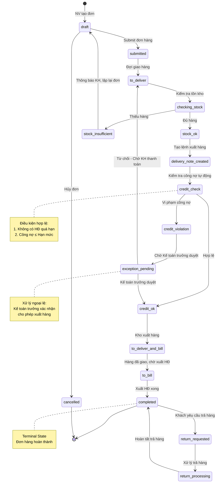

---

## 6. Integration Points

### 6.1. Tích hợp Quản lý Kho

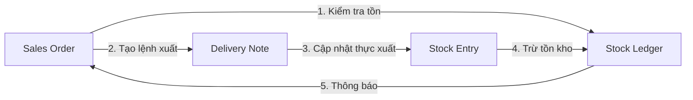

### 6.2. Tích hợp Quản lý Công nợ

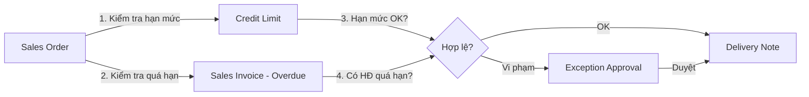

### 6.3. Tích hợp Kế toán

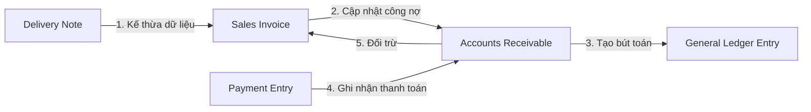

---

## 7. Business Rules Summary

### 7.1. Quy tắc giá và chiết khấu

| Quy tắc | Mô tả |
|---------|-------|
| **Kế thừa giá** | Đơn hàng → Lệnh xuất → Hóa đơn |
| **Ưu tiên bảng giá** | Bảng giá > Giá thủ công |
| **Ưu tiên chiết khấu** | Chính sách CK > CK thủ công |
| **CK bán lẻ** | CK theo chính sách + CK đặc biệt |
| **Cảnh báo giá khác** | Giá lệnh xuất ≠ Giá HĐ → Cảnh báo |

### 7.2. Quy tắc công nợ

| Quy tắc | Mô tả |
|---------|-------|
| **Điều kiện xuất hàng** | Không có HĐ quá hạn + Công nợ ≤ Hạn mức |
| **Công nợ dự kiến** | Công nợ hiện tại + Lệnh xuất chưa xuất + Lệnh xuất hiện tại |
| **Xử lý ngoại lệ** | Kế toán trưởng phải duyệt thì mới xuất hàng |
| **HĐ quá hạn** | HĐ quá 30 ngày (hoặc theo kỳ hạn thanh toán) |

### 7.3. Quy tắc phân quyền

| Bộ phận | Quyền hạn | Giới hạn |
|---------|-----------|----------|
| **Kinh doanh** | Tạo đơn, tạo lệnh xuất, kiểm tra tồn kho | Không duyệt ngoại lệ |
| **Kho** | Xem lệnh xuất, cập nhật thực xuất | Không thấy giá, không sửa khách hàng/số lượng |
| **Kế toán** | Xuất HĐ, xử lý trả hàng | Không duyệt ngoại lệ |
| **Kế toán trưởng** | Duyệt ngoại lệ công nợ | Toàn quyền |
| **Cửa hàng** | Lập HĐ bán lẻ | Chỉ bán lẻ |

### 7.4. Quy tắc theo dõi lô, seri

| Quy tắc | Mô tả |
|---------|-------|
| **Bắt buộc nhập** | Trên tất cả màn hình nhập xuất |
| **Kiểm tra trả hàng** | Serial trả hàng phải tồn tại trong HĐ bán ban đầu |
| **Cảnh báo** | Nếu serial không tồn tại → Cảnh báo |

---

**Nguồn:** ERP_SPECIFICATION.md Section 2 (lines 46-298)
**Coverage:** 18/18 sections (100%)
**Tổng số diagrams:** 12 workflows + 3 ERDs + 1 state machine = 16 diagrams
