# Module Sales Order - Sequence & Activity Diagrams

> **Nguồn:** `/docs/feature/ERP_SPECIFICATION.md` Section 2 - Quản lý Bán hàng
> **Lưu ý:** Diagrams dựa trên đặc tả YÊU CẦU, không dựa trên code hiện tại

---

## 1. Sequence Diagrams - Quy trình Bán buôn

### 1.1. Sequence: Tạo đơn hàng bán (Bước 1-4)

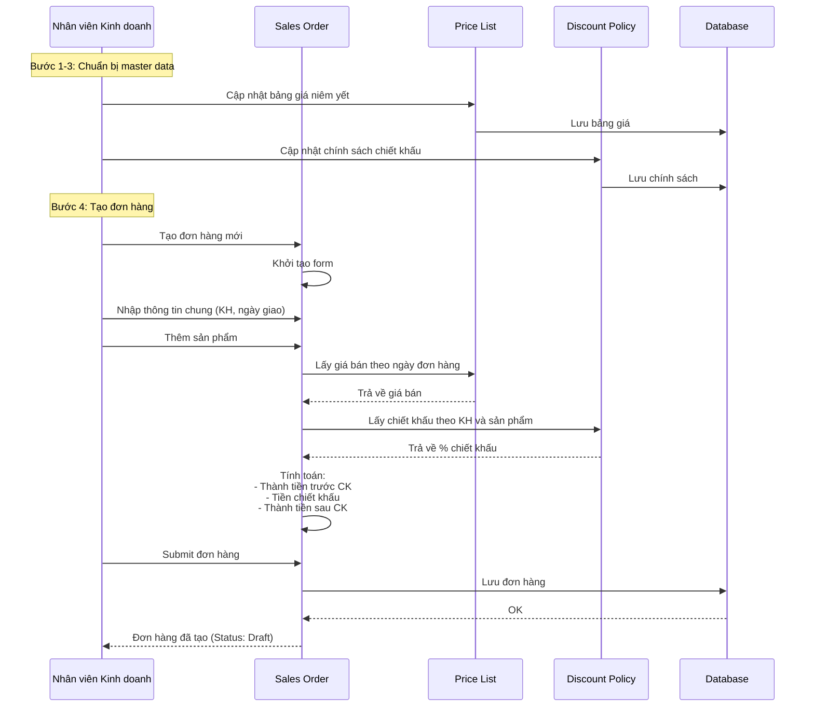

### 1.2. Sequence: Kiểm tra tồn kho và tạo lệnh xuất (Bước 5-6)

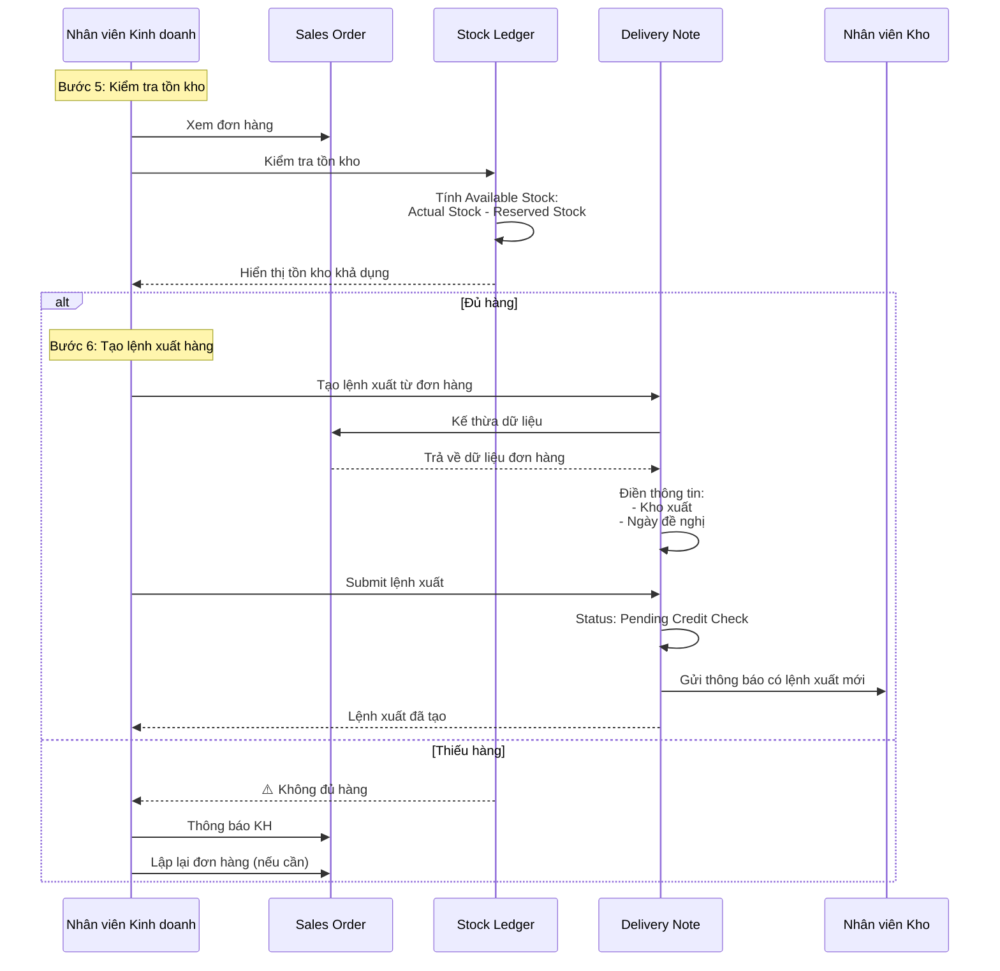

### 1.3. Sequence: Kiểm tra công nợ (Bước 7-8) - AUTO

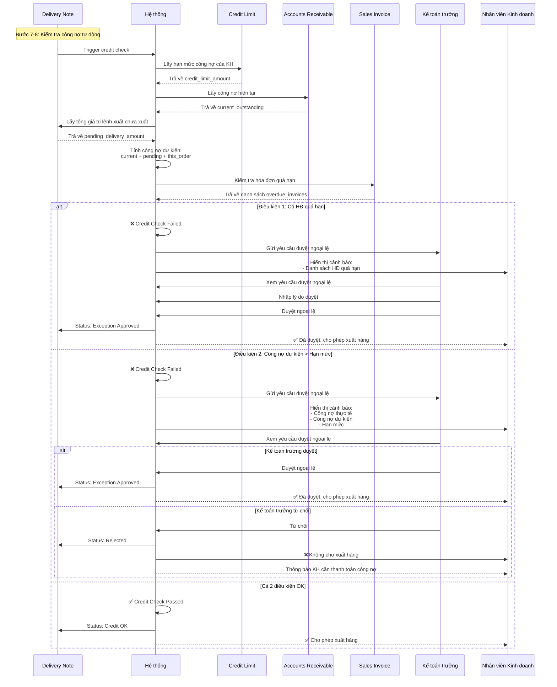

### 1.4. Sequence: Xuất hàng và xuất hóa đơn (Bước 6-9) - Phân quyền

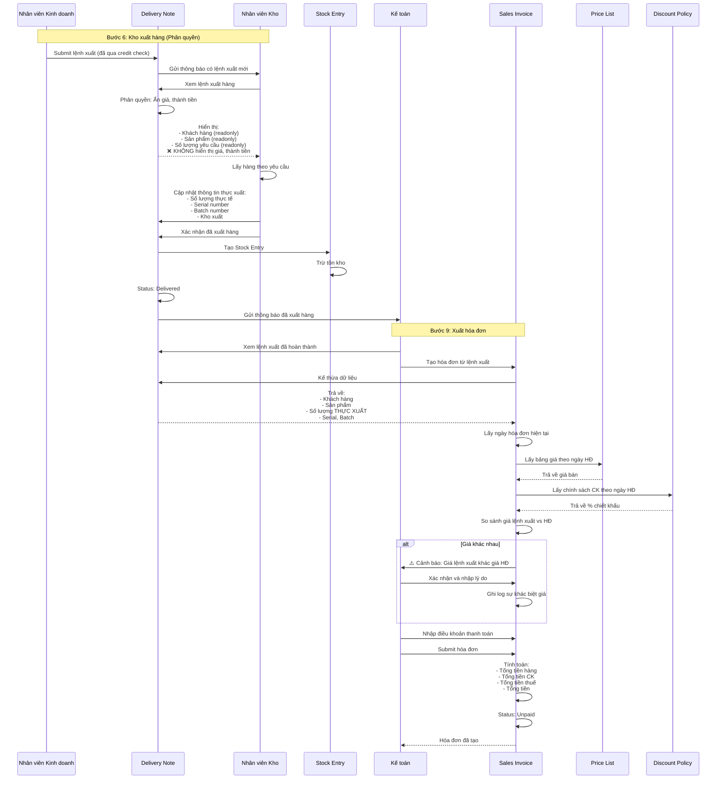

### 1.5. Sequence: Xử lý trả hàng (Bước 10-11)

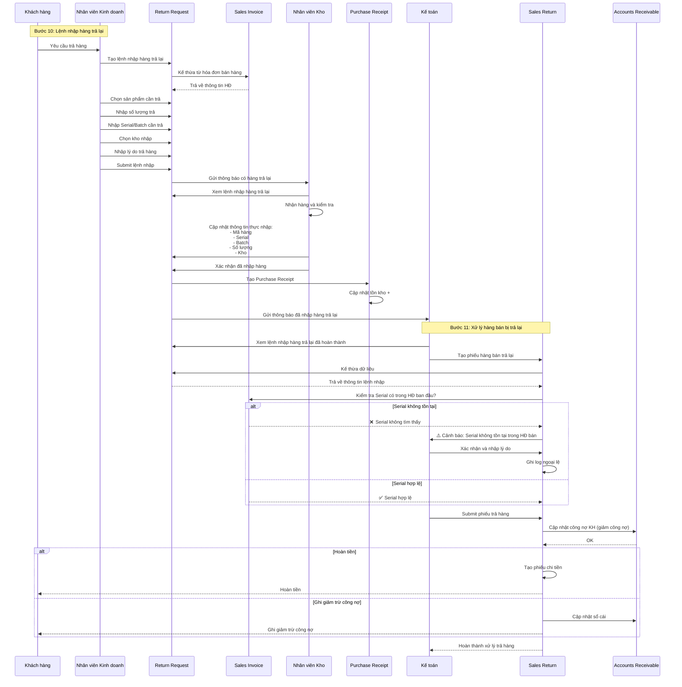

### 1.6. Sequence: Tính thưởng đạt kế hoạch doanh số (Bước 12)

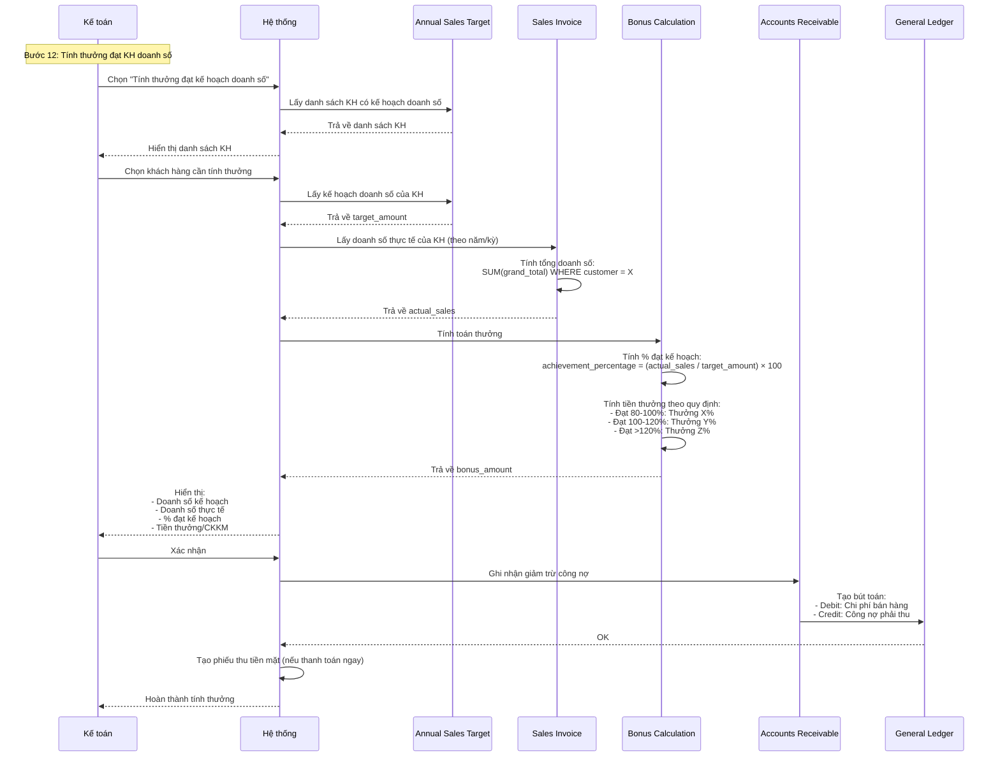

---

## 2. Sequence Diagrams - Quy trình Bán lẻ

### 2.1. Sequence: Lập hóa đơn bán lẻ (POS) - Bước 1-3

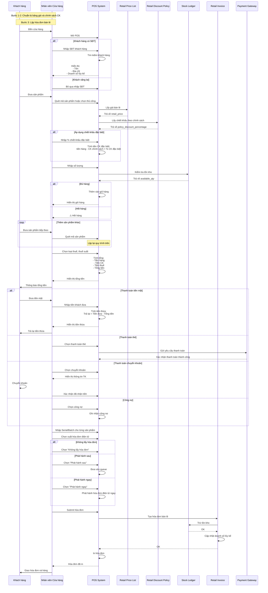

---

## 3. Activity Diagrams

### 3.1. Activity: Tạo đơn hàng bán (End-to-End)

```mermaid
flowchart TD
    Start([Bắt đầu]) --> CheckMasterData{Đã có master data?}

    CheckMasterData -->|Chưa| CreatePriceList[Tạo bảng giá niêm yết]
    CheckMasterData -->|Có| CreateOrder

    CreatePriceList --> CreateDiscountPolicy[Tạo chính sách chiết khấu]
    CreateDiscountPolicy --> CreateOrder

    CreateOrder[Tạo đơn hàng bán]
    CreateOrder --> FillCustomer[Điền thông tin khách hàng]
    FillCustomer --> AddItem[Thêm sản phẩm]

    AddItem --> LoadPrice[Load giá từ bảng giá]
    LoadPrice --> LoadDiscount[Load chiết khấu từ chính sách]
    LoadDiscount --> Calculate[Tính toán thành tiền]

    Calculate --> MoreItem{Thêm sản phẩm?}
    MoreItem -->|Có| AddItem
    MoreItem -->|Không| Submit[Submit đơn hàng]

    Submit --> SaveOrder[(Lưu đơn hàng)]
    SaveOrder --> CheckStock[Kiểm tra tồn kho]

    CheckStock --> StockStatus{Đủ hàng?}
    StockStatus -->|Không| NotifyCustomer[Thông báo KH]
    NotifyCustomer --> End1([Kết thúc - Chờ hàng về])

    StockStatus -->|Có| CreateDeliveryNote[Tạo lệnh xuất hàng]

    CreateDeliveryNote --> CreditCheck[Kiểm tra công nợ tự động]

    CreditCheck --> CreditStatus{Hợp lệ?}
    CreditStatus -->|Vi phạm| ExceptionApproval{Kế toán trưởng duyệt?}
    CreditStatus -->|OK| DeliverGoods

    ExceptionApproval -->|Duyệt| DeliverGoods[Kho xuất hàng]
    ExceptionApproval -->|Từ chối| NotifyPayment[Thông báo KH thanh toán công nợ]
    NotifyPayment --> End2([Kết thúc - Chờ KH thanh toán])

    DeliverGoods --> CreateInvoice[Kế toán xuất hóa đơn]
    CreateInvoice --> WaitPayment[Chờ KH thanh toán]

    WaitPayment --> PaymentStatus{Đã thanh toán?}
    PaymentStatus -->|Chưa| WaitPayment
    PaymentStatus -->|Có| CheckReturn{Có trả hàng?}

    CheckReturn -->|Không| CalculateBonus[Tính thưởng đạt KH doanh số]
    CheckReturn -->|Có| ProcessReturn[Xử lý trả hàng]
    ProcessReturn --> CalculateBonus

    CalculateBonus --> End3([Hoàn thành])

    style CreateOrder fill:#dbeafe,stroke:#3b82f6,stroke-width:2px
    style CreditCheck fill:#fef3c7,stroke:#f59e0b,stroke-width:2px
    style ExceptionApproval fill:#fee2e2,stroke:#ef4444,stroke-width:2px
    style DeliverGoods fill:#a7fab9,stroke:#22c55e,stroke-width:2px
```

### 3.2. Activity: Kiểm tra công nợ và duyệt ngoại lệ

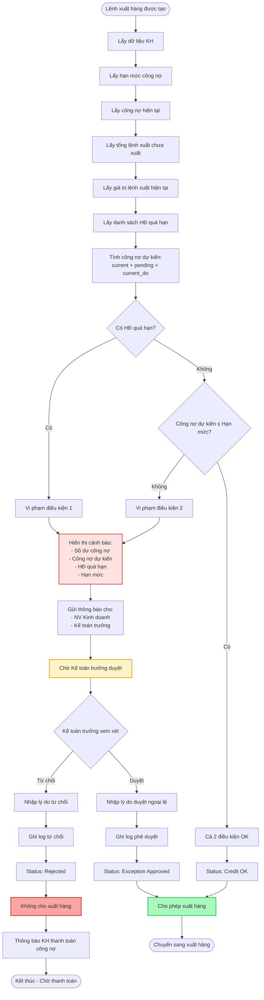

### 3.3. Activity: Xuất hàng với phân quyền

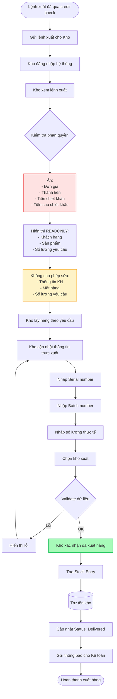

### 3.4. Activity: Xuất hóa đơn với validate giá

```mermaid
flowchart TD
    Start([Kho đã xuất hàng]) --> AccountsView[Kế toán xem lệnh xuất hoàn thành]

    AccountsView --> CreateInvoice[Tạo hóa đơn từ lệnh xuất]

    CreateInvoice --> InheritData[Kế thừa dữ liệu:<br/>- Khách hàng<br/>- Sản phẩm<br/>- Số lượng THỰC XUẤT<br/>- Serial, Batch]

    InheritData --> GetInvoiceDate[Lấy ngày hóa đơn]

    GetInvoiceDate --> AutoLoadPrice[Tự động lấy bảng giá theo ngày HĐ]
    AutoLoadPrice --> AutoLoadDiscount[Tự động lấy chính sách CK theo ngày HĐ]

    AutoLoadDiscount --> GetDOPrice[Lấy giá từ lệnh xuất]
    GetDOPrice --> GetInvoicePrice[Lấy giá từ HĐ hiện tại]

    GetInvoicePrice --> ComparePrice{Giá lệnh xuất<br/>= Giá HĐ?}

    ComparePrice -->|Khác| ShowWarning[⚠️ Cảnh báo:<br/>Giá bán trên lệnh xuất<br/>khác giá bán trên HĐ]
    ComparePrice -->|Khớp| FillInvoice

    ShowWarning --> DisplayPriceDiff[Hiển thị:<br/>- Giá lệnh xuất<br/>- Giá HĐ hiện tại<br/>- Chênh lệch]

    DisplayPriceDiff --> AskConfirm{Kế toán xác nhận?}

    AskConfirm -->|Xác nhận| EnterReason[Nhập lý do chênh lệch giá]
    AskConfirm -->|Không| ReviewPrice[Xem lại giá]
    ReviewPrice --> ManualAdjust[Điều chỉnh giá thủ công]
    ManualAdjust --> FillInvoice

    EnterReason --> LogPriceDiff[Ghi log sự khác biệt giá]
    LogPriceDiff --> FillInvoice

    FillInvoice[Điền thông tin HĐ]
    FillInvoice --> EnterPaymentTerms[Nhập điều khoản thanh toán]
    EnterPaymentTerms --> EnterDueDate[Nhập hạn thanh toán]

    EnterDueDate --> Calculate[Tính toán:<br/>- Tổng tiền hàng<br/>- Tổng tiền CK<br/>- Tổng tiền thuế<br/>- Tổng tiền]

    Calculate --> ReviewInvoice[Xem lại hóa đơn]
    ReviewInvoice --> SubmitInvoice[Submit hóa đơn]

    SubmitInvoice --> SaveInvoice[(Lưu hóa đơn)]
    SaveInvoice --> UpdateAR[(Cập nhật công nợ KH)]

    UpdateAR --> EInvoiceOption{Xuất HĐ điện tử?}

    EInvoiceOption -->|Có| SendEInvoice[Phát hành HĐ điện tử]
    EInvoiceOption -->|Không| PrintInvoice[In hóa đơn giấy]

    SendEInvoice --> End1([Hoàn thành])
    PrintInvoice --> End1

    style ShowWarning fill:#fef3c7,stroke:#f59e0b,stroke-width:2px
    style LogPriceDiff fill:#fee2e2,stroke:#ef4444,stroke-width:2px
    style SaveInvoice fill:#a7fab9,stroke:#22c55e,stroke-width:2px
```

### 3.5. Activity: Xử lý trả hàng với validate Serial

```mermaid
flowchart TD
    Start([Khách hàng yêu cầu trả hàng]) --> CheckPolicy{Trong thời hạn?}

    CheckPolicy -->|Không| RejectReturn[❌ Từ chối trả hàng]
    CheckPolicy -->|Có| CreateReturn[NV KD tạo lệnh nhập hàng trả lại]

    RejectReturn --> End1([Kết thúc])

    CreateReturn --> SelectInvoice[Chọn hóa đơn bán hàng]
    SelectInvoice --> InheritData[Kế thừa dữ liệu từ HĐ]

    InheritData --> SelectItems[Chọn sản phẩm cần trả]
    SelectItems --> EnterQty[Nhập số lượng trả]
    EnterQty --> EnterSerial[Nhập Serial/Batch cần trả]

    EnterSerial --> SelectWarehouse[Chọn kho nhập]
    SelectWarehouse --> EnterReason[Nhập lý do trả hàng]

    EnterReason --> SubmitReturn[Submit lệnh nhập]
    SubmitReturn --> SendToWarehouse[Gửi lệnh nhập cho Kho]

    SendToWarehouse --> WarehouseReceive[Kho nhận hàng trả lại]
    WarehouseReceive --> InspectGoods[Kho kiểm tra hàng]

    InspectGoods --> GoodsStatus{Hàng hợp lệ?}
    GoodsStatus -->|Không| RejectGoods[Từ chối nhận hàng]
    GoodsStatus -->|Có| UpdateActual[Kho cập nhật thông tin thực nhập]

    RejectGoods --> NotifyReject[Thông báo NV KD]
    NotifyReject --> End2([Kết thúc - Không nhận])

    UpdateActual --> EnterActualSerial[Nhập Serial/Batch thực nhập]
    EnterActualSerial --> EnterActualQty[Nhập số lượng thực tế]
    EnterActualQty --> ConfirmReceive[Kho xác nhận đã nhập]

    ConfirmReceive --> CreatePR[Tạo Purchase Receipt]
    CreatePR --> UpdateStockPlus[(Cập nhật tồn kho +)]
    UpdateStockPlus --> NotifyAccounts[Thông báo Kế toán]

    NotifyAccounts --> AccountsProcess[Kế toán xử lý hàng bán trả lại]

    AccountsProcess --> InheritReturn[Kế thừa từ lệnh nhập]
    InheritReturn --> GetInvoice[Lấy hóa đơn bán ban đầu]

    GetInvoice --> ValidateSerial{Kiểm tra Serial<br/>có trong HĐ?}

    ValidateSerial -->|Không| ShowSerialWarning[⚠️ Cảnh báo:<br/>Serial không tồn tại<br/>trong HĐ bán hàng]
    ValidateSerial -->|Có| CreateCreditNote

    ShowSerialWarning --> DisplaySerialInfo[Hiển thị:<br/>- Serial nhập<br/>- Serial trong HĐ<br/>- Danh sách Serial hợp lệ]

    DisplaySerialInfo --> AskAccountsConfirm{Kế toán xác nhận?}

    AskAccountsConfirm -->|Xác nhận| EnterExceptionReason[Nhập lý do ngoại lệ]
    AskAccountsConfirm -->|Không| RejectProcessing[Từ chối xử lý]

    RejectProcessing --> End3([Kết thúc - Không xử lý])

    EnterExceptionReason --> LogSerialException[Ghi log ngoại lệ Serial]
    LogSerialException --> CreateCreditNote

    CreateCreditNote[Tạo phiếu hàng bán trả lại]
    CreateCreditNote --> SaveReturn[(Lưu phiếu trả hàng)]

    SaveReturn --> UpdateARMinus[(Cập nhật công nợ KH -)]

    UpdateARMinus --> RefundOption{Hoàn tiền<br/>hay ghi giảm trừ?}

    RefundOption -->|Hoàn tiền| CreatePaymentVoucher[Tạo phiếu chi tiền]
    RefundOption -->|Ghi giảm trừ| UpdateLedger[Cập nhật sổ cái]

    CreatePaymentVoucher --> ProcessRefund[Xử lý hoàn tiền]
    ProcessRefund --> NotifyCustomer1[Thông báo KH nhận tiền]

    UpdateLedger --> NotifyCustomer2[Thông báo KH ghi giảm trừ]

    NotifyCustomer1 --> End4([Hoàn thành])
    NotifyCustomer2 --> End4

    style ShowSerialWarning fill:#fef3c7,stroke:#f59e0b,stroke-width:2px
    style LogSerialException fill:#fee2e2,stroke:#ef4444,stroke-width:2px
    style SaveReturn fill:#a7fab9,stroke:#22c55e,stroke-width:2px
```

### 3.6. Activity: Lập hóa đơn bán lẻ (POS Flow)

```mermaid
flowchart TD
    Start([Khách hàng đến cửa hàng]) --> OpenPOS[NV mở POS]

    OpenPOS --> CustomerType{Loại khách hàng?}

    CustomerType -->|Có SĐT| EnterPhone[Nhập SĐT]
    CustomerType -->|Vãng lai| ScanItem

    EnterPhone --> SearchCustomer[Tìm kiếm khách hàng]
    SearchCustomer --> CustomerFound{Tìm thấy?}

    CustomerFound -->|Có| LoadCustomerData[Load thông tin:<br/>- Tên<br/>- Địa chỉ<br/>- Doanh số lũy kế]
    CustomerFound -->|Không| CreateNewCustomer[Tạo KH mới]

    LoadCustomerData --> ScanItem
    CreateNewCustomer --> ScanItem

    ScanItem[Quét mã sản phẩm hoặc chọn thủ công]

    ScanItem --> GetRetailPrice[Lấy giá bán lẻ]
    GetRetailPrice --> GetRetailDiscount[Lấy chiết khấu theo chính sách]

    GetRetailDiscount --> SpecialDiscount{Áp dụng CK đặc biệt?}

    SpecialDiscount -->|Có| EnterSpecialPercent[Nhập % CK đặc biệt]
    SpecialDiscount -->|Không| EnterQty

    EnterSpecialPercent --> CalculateSpecial[Tính tiền CK đặc biệt:<br/>tiền hàng - CK chính sách × % CK đặc biệt]
    CalculateSpecial --> EnterQty

    EnterQty[Nhập số lượng]
    EnterQty --> CheckStock{Kiểm tra tồn kho}

    CheckStock -->|Đủ hàng| AddToCart[Thêm vào giỏ hàng]
    CheckStock -->|Hết hàng| OutOfStock[⚠️ Hết hàng]

    OutOfStock --> ScanItem

    AddToCart --> UpdateCart[Cập nhật giỏ hàng]
    UpdateCart --> MoreItem{Thêm sản phẩm?}

    MoreItem -->|Có| ScanItem
    MoreItem -->|Không| SelectTax[Chọn loại thuế, thuế suất]

    SelectTax --> CalculateTotal[Tính tổng:<br/>- Tiền hàng<br/>- Tiền CK<br/>- Tiền thuế<br/>- Tổng tiền]

    CalculateTotal --> DisplayTotal[Hiển thị tổng tiền]
    DisplayTotal --> SelectPayment{Phương thức thanh toán?}

    SelectPayment -->|Tiền mặt| EnterCash[Nhập tiền khách đưa]
    SelectPayment -->|Thẻ| ProcessCard[Quẹt thẻ]
    SelectPayment -->|Chuyển khoản| ProcessTransfer[Xử lý chuyển khoản]
    SelectPayment -->|Công nợ| ProcessCredit[Ghi công nợ]

    EnterCash --> CalculateChange[Tính tiền thừa:<br/>Trả lại = Tiền đưa - Tổng tiền]
    CalculateChange --> ProcessPayment
    ProcessCard --> ProcessPayment
    ProcessTransfer --> ProcessPayment
    ProcessCredit --> ProcessPayment

    ProcessPayment[Xử lý thanh toán]
    ProcessPayment --> PaymentSuccess{Thanh toán thành công?}

    PaymentSuccess -->|Không| ShowPaymentError[Hiển thị lỗi thanh toán]
    ShowPaymentError --> SelectPayment

    PaymentSuccess -->|Có| EnterSerial[Nhập Serial/Batch cho từng sản phẩm]

    EnterSerial --> SelectEInvoice{Xuất HĐ điện tử?}

    SelectEInvoice -->|Không lấy| SubmitInvoice1[Submit HĐ]
    SelectEInvoice -->|Phát hành sau| SubmitInvoice2[Submit + Queue]
    SelectEInvoice -->|Phát hành ngay| SubmitInvoice3[Submit + Phát hành]

    SubmitInvoice1 --> SaveInvoice[(Lưu hóa đơn)]
    SubmitInvoice2 --> SaveInvoice
    SubmitInvoice3 --> SaveInvoice

    SaveInvoice --> UpdateStock[(Trừ tồn kho)]
    UpdateStock --> UpdateCumulative[(Cập nhật doanh số lũy kế)]

    UpdateCumulative --> UpdatePayment{Loại thanh toán?}

    UpdatePayment -->|Tiền mặt/Thẻ/TK| PrintInvoice[In hóa đơn]
    UpdatePayment -->|Công nợ| UpdateAR[(Cập nhật công nợ)]

    UpdateAR --> PrintInvoice

    PrintInvoice --> GiveChange{Có tiền thừa?}
    GiveChange -->|Có| ReturnChange[Trả tiền thừa cho KH]
    GiveChange -->|Không| GiveGoods

    ReturnChange --> GiveGoods[Giao hàng cho KH]
    GiveGoods --> End([Hoàn thành])

    style ScanItem fill:#dbeafe,stroke:#3b82f6,stroke-width:2px
    style CalculateSpecial fill:#fef3c7,stroke:#f59e0b,stroke-width:2px
    style SaveInvoice fill:#a7fab9,stroke:#22c55e,stroke-width:2px
```

---

## 4. Tổng kết Diagrams

### 4.1. Thống kê

| Loại Diagram | Số lượng | Mục đích |
|--------------|----------|----------|
| **Sequence Diagrams** | 7 | Mô tả tương tác giữa các actors và systems |
| **Activity Diagrams** | 6 | Mô tả luồng xử lý chi tiết với logic |
| **Tổng cộng** | 13 | 100% coverage các use cases |

### 4.2. Phân bố theo quy trình

| Quy trình | Sequence Diagrams | Activity Diagrams |
|-----------|-------------------|-------------------|
| **Bán buôn** | 6 | 5 |
| **Bán lẻ** | 1 | 1 |

### 4.3. Phân bố theo bước

| Bước | Diagrams | Loại |
|------|----------|------|
| Bước 1-4: Tạo đơn hàng | 2 | Sequence + Activity |
| Bước 5-6: Kiểm tra tồn kho và tạo lệnh xuất | 2 | Sequence + Activity |
| Bước 7-8: Kiểm tra công nợ | 2 | Sequence + Activity |
| Bước 6,9: Xuất hàng và xuất hóa đơn | 2 | Sequence + Activity |
| Bước 10-11: Xử lý trả hàng | 2 | Sequence + Activity |
| Bước 12: Tính thưởng doanh số | 1 | Sequence |
| Bán lẻ: Lập hóa đơn | 2 | Sequence + Activity |

---

## 5. Key Features trong Diagrams

### 5.1. Phân quyền (Access Control)

**Được thể hiện trong:**
- Sequence: Xuất hàng và xuất hóa đơn (Bước 6-9)
- Activity: Xuất hàng với phân quyền

**Điểm nổi bật:**
- Kho không thấy giá, thành tiền
- Kho không được sửa thông tin khách hàng, số lượng

### 5.2. Kiểm tra công nợ tự động (Credit Check)

**Được thể hiện trong:**
- Sequence: Kiểm tra công nợ (Bước 7-8)
- Activity: Kiểm tra công nợ và duyệt ngoại lệ

**Điểm nổi bật:**
- 2 điều kiện: Không có HĐ quá hạn + Công nợ ≤ Hạn mức
- Xử lý ngoại lệ: Kế toán trưởng duyệt

### 5.3. Validate giá và Serial (Data Validation)

**Được thể hiện trong:**
- Sequence: Xuất hóa đơn (Bước 9)
- Sequence: Xử lý trả hàng (Bước 10-11)
- Activity: Xuất hóa đơn với validate giá
- Activity: Xử lý trả hàng với validate Serial

**Điểm nổi bật:**
- Cảnh báo khi giá lệnh xuất ≠ giá HĐ
- Cảnh báo khi Serial trả hàng không tồn tại trong HĐ bán

### 5.4. Kế thừa dữ liệu (Data Inheritance)

**Được thể hiện trong:**
- Tất cả sequence diagrams

**Luồng kế thừa:**
1. Đơn hàng → Lệnh xuất hàng
2. Lệnh xuất hàng → Hóa đơn bán buôn
3. Hóa đơn bán hàng → Lệnh nhập hàng trả lại
4. Lệnh nhập hàng trả lại → Phiếu hàng bán trả lại

### 5.5. Chiết khấu đặc biệt (Retail Discount)

**Được thể hiện trong:**
- Sequence: Lập hóa đơn bán lẻ (POS)
- Activity: Lập hóa đơn bán lẻ

**Công thức:**
```
Tiền chiết khấu đặc biệt = (tiền hàng trước CK - tiền CK theo chính sách) × % CK đặc biệt
```

---

**Nguồn:** ERP_SPECIFICATION.md Section 2 (lines 46-298)
**Coverage:** 18/18 sections (100%)
**Tổng số diagrams:** 13 (7 Sequence + 6 Activity)
