# Đặc tả Use Cases - Module Sales Order (Quản lý Bán hàng)

**Dự án:** DCNET Flow - Nhật Minh Sports
**Module:** Sales Order Management
**Phiên bản:** 1.0
**Nguồn:** ERP_SPECIFICATION.md (Section 2)
**Ngày:** 14/01/2026

---

## 📋 Mục lục

1. [Định nghĩa Sales Order](#1-định-nghĩa-sales-order)
2. [Danh sách Actors và Vai trò](#2-danh-sách-actors-và-vai-trò)
3. [Ma trận Phân quyền](#3-ma-trận-phân-quyền)
4. [Chi tiết Use Cases](#4-chi-tiết-use-cases)
5. [Use Case Diagram](#5-use-case-diagram)

---

## 1. Định nghĩa Sales Order

> **Định nghĩa từ khách hàng:**
>
> Quản lý toàn bộ quy trình bán hàng từ kế hoạch, bảng giá, đơn hàng, xuất kho, hóa đơn đến thu tiền và xử lý trả hàng

**Đặc điểm:**
- Hỗ trợ 2 kênh: Bán buôn (12 bước) và Bán lẻ (3 bước)
- Tích hợp kiểm tra công nợ, hạn mức, tồn kho
- Phân quyền theo bộ phận: Kinh doanh, Kho, Kế toán
- Kế thừa dữ liệu: Đơn hàng → Lệnh xuất → Hóa đơn → Trả hàng

---

## 2. Danh sách Actors và Vai trò

**Nguồn:** ERP_SPECIFICATION.md Section 2

### 2.1. Nhân viên Kinh doanh (Sales User)

**Mô tả:** Nhân viên phụ trách bán hàng

**Quyền hạn:**
- Cập nhật kế hoạch bán hàng theo năm
- Quản lý bảng giá niêm yết
- Quản lý chính sách chiết khấu
- Tạo đơn đặt hàng bán
- Kiểm tra tồn kho
- Tạo lệnh xuất hàng
- Kiểm tra hạn mức công nợ
- Tạo lệnh nhập hàng trả lại

**Giới hạn:**
- Không được duyệt ngoại lệ công nợ (cần Kế toán trưởng)

---

### 2.2. Nhân viên Kho (Stock User)

**Mô tả:** Nhân viên quản lý kho

**Quyền hạn:**
- Xem lệnh xuất hàng (không thấy giá)
- Cập nhật thông tin thực xuất (seri, lô, số lượng)
- Xác nhận xuất hàng
- Cập nhật thông tin thực nhập (trả hàng)

**Giới hạn:**
- Không nhìn thấy đơn giá, thành tiền
- Không được sửa thông tin khách hàng, mặt hàng, số lượng yêu cầu

---

### 2.3. Kế toán (Accounts User)

**Mô tả:** Nhân viên kế toán

**Quyền hạn:**
- Xuất hóa đơn bán buôn
- Xử lý hàng bán bị trả lại
- Tính thưởng đạt kế hoạch doanh số
- Ghi nhận thanh toán

**Giới hạn:**
- Không được duyệt ngoại lệ công nợ (cần Kế toán trưởng)

---

### 2.4. Kế toán trưởng (Accounts Manager)

**Mô tả:** Quản lý kế toán

**Quyền hạn:**
- Tất cả quyền của Kế toán
- **Duyệt ngoại lệ công nợ** (khi khách hàng quá hạn mức hoặc có HĐ quá hạn)

---

### 2.5. Nhân viên Cửa hàng (Retail User)

**Mô tả:** Nhân viên bán hàng tại cửa hàng

**Quyền hạn:**
- Lập hóa đơn bán lẻ
- Xem bảng giá bán lẻ
- Áp dụng chính sách chiết khấu bán lẻ

---

### 2.6. System (Tự động)

**Mô tả:** Hệ thống tự động thực hiện các tác vụ

**Chức năng:**
- Tự động kiểm tra hạn mức công nợ
- Tự động kiểm tra hóa đơn quá hạn
- Tự động lấy bảng giá, chính sách chiết khấu theo ngày
- Cảnh báo khi giá bán trên lệnh xuất khác với giá bán trên hóa đơn
- Tự động tính toán chiết khấu đặc biệt (bán lẻ)

---

## 3. Ma trận Phân quyền

**Nguồn:** ERP_SPECIFICATION.md Section 2 (lines 46-298)

| Use Case | Sales User | Stock User | Accounts User | Accounts Manager | Retail User | System |
| --- | --- | --- | --- | --- | --- | --- |
| **UC-01: Cập nhật kế hoạch bán hàng** | ✓ | - | - | ✓ | - | - |
| **UC-02: Quản lý bảng giá niêm yết** | ✓ | - | - | ✓ | - | - |
| **UC-03: Quản lý chính sách chiết khấu** | ✓ | - | - | ✓ | - | - |
| **UC-04: Tạo đơn đặt hàng bán ⭐** | ✓ | - | - | ✓ | - | - |
| **UC-05: Kiểm tra tồn kho** | ✓ | ✓ | - | - | - | - |
| **UC-06: Tạo lệnh xuất hàng** | ✓ | ✓ (xác nhận) | - | - | - | - |
| **UC-07: Kiểm tra hạn mức công nợ** | ✓ (xem) | - | ✓ | ✓ | - | ✓ (auto) |
| **UC-08: Kiểm tra công nợ quá hạn** | ✓ (xem) | - | ✓ | ✓ | - | ✓ (auto) |
| **UC-09: Xuất hóa đơn bán buôn** | - | - | ✓ | ✓ | - | - |
| **UC-10: Xử lý lệnh nhập hàng trả lại** | ✓ | ✓ | - | - | - | - |
| **UC-11: Xử lý hàng bán bị trả lại** | - | - | ✓ | ✓ | - | - |
| **UC-12: Tính thưởng đạt kế hoạch doanh số** | - | - | ✓ | ✓ | - | - |
| **UC-13: Quản lý bảng giá bán lẻ** | ✓ | - | - | ✓ | ✓ (xem) | - |
| **UC-14: Quản lý chiết khấu bán lẻ** | ✓ | - | - | ✓ | ✓ (xem) | - |
| **UC-15: Lập hóa đơn bán lẻ** | - | - | - | - | ✓ | - |
| **UC-16: Quản lý danh mục khách hàng** | ✓ | - | ✓ | ✓ | - | - |
| **UC-17: Quản lý danh mục vật tư hàng hóa** | ✓ | ✓ | ✓ | ✓ | ✓ | - |
| **UC-18: Quản lý kế hoạch doanh số năm** | ✓ | - | ✓ | ✓ | - | - |

**Chú thích:**
- ✓ = Có quyền thực hiện
- ✓ (xem) = Chỉ xem, không chỉnh sửa
- ✓ (auto) = Tự động thực hiện
- - = Không có quyền

---

## 4. Chi tiết Use Cases

### QUY TRÌNH BÁN BUÔN (WHOLESALE) - 12 Use Cases

**Nguồn:** ERP_SPECIFICATION.md Section 2 (lines 48-227)

---

### UC-01: Cập nhật kế hoạch bán hàng theo năm

**ID:** UC-01
**Tên:** Cập nhật kế hoạch bán hàng
**Actors:** Sales User, Accounts Manager
**Nguồn:** ERP_SPECIFICATION.md Section 2 - Bước 1 (lines 50-56)

**Mô tả:**
Cập nhật kế hoạch theo năm cho từng KH để tính thưởng doanh số khi đạt kế hoạch năm.

**Precondition:**
- User đã đăng nhập vào hệ thống
- User có quyền Kinh doanh

**Main Flow:**
1. User chọn "Kế hoạch bán hàng"
2. Hệ thống hiển thị form nhập thông tin
3. User nhập thông tin kế hoạch theo năm cho từng khách hàng
4. User submit form
5. Hệ thống lưu thông tin

**Postcondition:**
- Kế hoạch bán hàng được lưu trong hệ thống
- Dùng để tính thưởng tại Bước 12

**Business Rules:**
- Kế hoạch theo năm
- Bộ phận: Kinh doanh
- Tần suất: Theo năm

---

### UC-02: Quản lý bảng giá niêm yết

**ID:** UC-02
**Tên:** Quản lý bảng giá niêm yết
**Actors:** Sales User, Accounts Manager
**Nguồn:** ERP_SPECIFICATION.md Section 2 - Bước 2 (lines 58-70)

**Mô tả:**
Cập nhật giá bán cho từng mặt hàng theo từng thời điểm.

**Precondition:**
- User đã đăng nhập vào hệ thống
- User có quyền Kinh doanh

**Main Flow:**
1. User chọn "Bảng giá niêm yết"
2. Hệ thống hiển thị form nhập thông tin
3. User nhập **Thông tin chung:**
   - Ngày hiệu lực
   - Số bảng giá
   - Người lập
   - Nội dung
4. User nhập **Thông tin chi tiết:**
   - Mã hàng hóa
   - Tên hàng hóa
   - Giá bán
   - Ghi chú
5. User đính kèm file quyết định giá (nếu có)
6. User submit form
7. Hệ thống lưu bảng giá

**Postcondition:**
- Bảng giá được lưu và áp dụng từ ngày hiệu lực
- Sử dụng khi tạo đơn hàng bán (Bước 4)

**Business Rules:**
- Bộ phận: Kinh doanh
- Tần suất: Khi có thay đổi
- Hỗ trợ đính kèm file

---

### UC-03: Quản lý chính sách chiết khấu bán buôn

**ID:** UC-03
**Tên:** Quản lý chính sách chiết khấu
**Actors:** Sales User, Accounts Manager
**Nguồn:** ERP_SPECIFICATION.md Section 2 - Bước 3 (lines 72-84)

**Mô tả:**
Cập nhật tỷ lệ chiết khấu cho từng KH theo từng mặt hàng để lên đơn hàng.

**Precondition:**
- User đã đăng nhập vào hệ thống
- User có quyền Kinh doanh

**Main Flow:**
1. User chọn "Chính sách chiết khấu bán buôn"
2. Hệ thống hiển thị form nhập thông tin
3. User nhập **Thông tin chung:**
   - Ngày áp dụng
   - Đối tượng (Khách hàng)
   - Nội dung
4. User nhập **Thông tin chi tiết:**
   - Mã hàng hóa
   - Tên hàng hóa
   - Tỷ lệ chiết khấu
5. User đính kèm file (nếu có)
6. User submit form
7. Hệ thống lưu chính sách chiết khấu

**Postcondition:**
- Chính sách chiết khấu được lưu và áp dụng từ ngày hiệu lực
- Sử dụng khi tạo đơn hàng bán (Bước 4)

**Business Rules:**
- Bộ phận: Kinh doanh
- Tần suất: Khi có thay đổi
- Chiết khấu theo khách hàng và mặt hàng

---

### UC-04: Tạo đơn đặt hàng bán ⭐ (CORE)

**ID:** UC-04
**Tên:** Tạo đơn đặt hàng bán
**Actors:** Sales User
**Nguồn:** ERP_SPECIFICATION.md Section 2 - Bước 4 (lines 86-100)

**Mô tả:**
Sau khi có nhu cầu từ KH, NVKD lập đơn hàng bán để ghi nhận.

**Precondition:**
- User đã đăng nhập vào hệ thống
- User có quyền Kinh doanh
- Đã có bảng giá niêm yết (Bước 2)
- Đã có chính sách chiết khấu (Bước 3) hoặc nhập tay

**Main Flow:**
1. User chọn "Tạo đơn đặt hàng bán"
2. Hệ thống hiển thị form nhập thông tin
3. User nhập **Thông tin chung:**
   - Ngày
   - Số đơn hàng (auto)
   - Tiền tệ
   - Khách hàng
   - Địa chỉ
   - Người liên hệ
   - Người lập
   - Điều khoản giao hàng
   - Điều khoản thanh toán
   - Phương thức thanh toán
4. User nhập **Thông tin chi tiết:**
   - Mã hàng
   - Tên hàng
   - Đơn vị tính
   - Số lượng
   - Đơn giá trước chiết khấu (từ bảng giá)
   - Thành tiền trước chiết khấu
   - Số bảng giá
   - Số chính sách chiết khấu (hoặc nhập tay % chiết khấu)
   - % chiết khấu
   - Tiền chiết khấu
   - Thành tiền sau chiết khấu
   - Ngày dự kiến giao
5. User submit form
6. Hệ thống tạo đơn hàng bán
7. Hệ thống lưu thông tin

**Alternative Flow:**
- **AF-1:** Nếu không nhập số chính sách chiết khấu, cho phép nhập tay tỷ lệ chiết khấu

**Postcondition:**
- Đơn hàng được tạo và lưu trong hệ thống
- Chuyển sang Bước 5: Kiểm tra tồn kho

**Business Rules:**
- Bộ phận: Kinh doanh
- Tần suất: Hàng ngày
- Kế thừa giá từ bảng giá và chính sách chiết khấu
- Cho phép nhập tay chiết khấu nếu không có chính sách

---

### UC-05: Kiểm tra tồn kho

**ID:** UC-05
**Tên:** Kiểm tra tồn kho
**Actors:** Sales User, Stock User
**Nguồn:** ERP_SPECIFICATION.md Section 2 - Bước 5 (lines 102-108)

**Mô tả:**
Bộ phận KD kiểm tra tham khảo tồn kho xem còn đủ hàng hóa để xuất kho.

**Precondition:**
- User đã đăng nhập vào hệ thống
- Đã có đơn hàng bán (Bước 4)

**Main Flow:**
1. User chọn đơn hàng cần kiểm tra tồn kho
2. Hệ thống hiển thị thông tin tồn kho hiện tại cho từng mặt hàng
3. User xem tồn kho và phản hồi cho KH

**Postcondition:**
- User biết được tồn kho còn đủ hay không
- Chuyển sang Bước 6: Tạo lệnh xuất hàng (nếu đủ hàng)

**Business Rules:**
- Bộ phận: Kinh doanh
- Tần suất: Hàng ngày
- Chỉ xem, không cập nhật tồn kho

---

### UC-06: Tạo lệnh xuất hàng

**ID:** UC-06
**Tên:** Tạo lệnh xuất hàng
**Actors:** Sales User, Stock User
**Nguồn:** ERP_SPECIFICATION.md Section 2 - Bước 6 (lines 110-143)

**Mô tả:**
Sau khi có đơn hàng đến lịch giao hàng, bộ phận KD lập lệnh xuất hàng gửi tới bộ phận kho.

**Precondition:**
- User đã đăng nhập vào hệ thống
- Đã có đơn hàng bán (Bước 4)
- Đã kiểm tra tồn kho (Bước 5)

**Main Flow:**
1. Sales User chọn "Tạo lệnh xuất hàng" từ đơn hàng
2. Hệ thống kế thừa dữ liệu từ đơn hàng
3. Hệ thống hiển thị form lệnh xuất hàng với **Thông tin chung:**
   - Ngày đề nghị
   - Người đề nghị
   - Kho xuất
   - Khách hàng
4. Hệ thống hiển thị **Thông tin chi tiết:**
   - Mã vật tư
   - Tên vật tư
   - Đvt
   - Số lượng
   - Đơn giá trước chiết khấu
   - Thành tiền
   - Số chính sách chiết khấu
   - % chiết khấu
   - Tiền chiết khấu
   - Tiền sau chiết khấu
5. Sales User submit lệnh xuất
6. Hệ thống kiểm tra hạn mức và công nợ quá hạn (Bước 7, 8)
7. Hệ thống gửi lệnh xuất cho bộ phận kho
8. Stock User xem lệnh xuất (không thấy giá)
9. Stock User cập nhật thông tin thực xuất:
   - Mặt hàng
   - Seri
   - Lô
   - Kho
   - Số lượng
10. Stock User xác nhận đã xuất hàng

**Postcondition:**
- Lệnh xuất hàng được tạo và gửi cho kho
- Kho cập nhật thông tin thực xuất
- Chuyển sang Bước 9: Xuất hóa đơn

**Business Rules:**
- Bộ phận: Kinh doanh (tạo), Kho (xác nhận)
- Kế thừa dữ liệu từ đơn hàng
- **Phân quyền:** Kho không thấy đơn giá, thành tiền
- **Phân quyền:** Kho không được sửa thông tin khách hàng, mặt hàng, số lượng yêu cầu
- Hiển thị số dư công nợ thực tế, công nợ dự kiến, số hóa đơn quá hạn

---

### UC-07: Kiểm tra hạn mức công nợ

**ID:** UC-07
**Tên:** Kiểm tra hạn mức công nợ
**Actors:** Sales User (xem), Accounts User, Accounts Manager, System (auto)
**Nguồn:** ERP_SPECIFICATION.md Section 2 - Bước 7 (lines 136-150)

**Mô tả:**
Bộ phận KD kiểm tra hạn mức công nợ của KH.

**Precondition:**
- User đã đăng nhập vào hệ thống
- Đã có lệnh xuất hàng (Bước 6)

**Main Flow:**
1. User chọn "Hạn mức công nợ"
2. Hệ thống hiển thị thông tin:
   - Ngày áp dụng
   - Tài khoản công nợ
   - Mã khách hàng
   - Tên khách hàng
   - Giá trị hạn mức
3. User xem hạn mức công nợ của KH
4. Nếu hết hạn mức, User lập lại đơn hàng, hợp đồng gửi lại KH

**Postcondition:**
- User biết được hạn mức công nợ của KH
- Chuyển sang Bước 8: Kiểm tra công nợ quá hạn

**Business Rules:**
- Bộ phận: Kinh doanh, Kế toán
- Tần suất: Hàng ngày
- Hỗ trợ đính kèm file

---

### UC-08: Kiểm tra công nợ quá hạn

**ID:** UC-08
**Tên:** Kiểm tra công nợ quá hạn
**Actors:** Sales User (xem), Accounts Manager (duyệt), System (auto)
**Nguồn:** ERP_SPECIFICATION.md Section 2 - Bước 8 (lines 152-162)

**Mô tả:**
Bộ phận KD kiểm tra xem nếu có hóa đơn quá hạn hoặc quá hạn mức không để làm cơ sở cho quyết định có xuất hàng cho KH không.

**Precondition:**
- User đã đăng nhập vào hệ thống
- Đã có lệnh xuất hàng (Bước 6)

**Main Flow:**
1. Hệ thống tự động kiểm tra điều kiện xuất hàng hợp lệ:
   - **Điều kiện 1:** Khách hàng không có hóa đơn quá hạn
   - **Điều kiện 2:** Giá trị công nợ hiện tại + giá trị trên các lệnh xuất đã duyệt chưa xuất + giá trị trên lệnh xuất hàng hiện tại ≤ Hạn mức công nợ
2. **Nếu thỏa mãn:** Hệ thống cho phép xuất hàng → Chuyển sang Bước 9
3. **Nếu không thỏa mãn:** Hệ thống hiện cảnh báo
4. Hệ thống gửi yêu cầu duyệt ngoại lệ cho Kế toán trưởng
5. Kế toán trưởng xác nhận lệnh xuất
6. Nếu duyệt → Cho phép xuất hàng
7. Nếu từ chối → Thông báo KH cần thanh toán công nợ

**Alternative Flow:**
- **AF-1:** Kế toán trưởng từ chối → Lập lại đơn hàng, hợp đồng gửi lại KH

**Postcondition:**
- Lệnh xuất được duyệt hoặc bị từ chối
- Nếu duyệt → Chuyển sang Bước 9: Xuất hóa đơn

**Business Rules:**
- **Xử lý ngoại lệ:** Kế toán trưởng phải xác nhận thì lệnh xuất mới hợp lệ
- Cảnh báo khi vi phạm điều kiện

---

### UC-09: Xuất hóa đơn bán buôn

**ID:** UC-09
**Tên:** Xuất hóa đơn bán buôn
**Actors:** Accounts User
**Nguồn:** ERP_SPECIFICATION.md Section 2 - Bước 9 (lines 164-182)

**Mô tả:**
Kế toán thực hiện xuất hóa đơn cho khách.

**Precondition:**
- User đã đăng nhập vào hệ thống
- User có quyền Kế toán
- Đã có lệnh xuất hàng (Bước 6)
- Kho đã xuất hàng

**Main Flow:**
1. Accounts User chọn "Xuất hóa đơn bán buôn" từ lệnh xuất hàng
2. Hệ thống kế thừa dữ liệu từ lệnh xuất hàng
3. Hệ thống tự động lấy số bảng giá, số chính sách chiết khấu theo ngày hóa đơn
4. Hệ thống hiển thị form hóa đơn với **Thông tin chung:**
   - Ngày chứng từ
   - Khách hàng
   - Hình thức thanh toán
   - Số hóa đơn
   - Hạn thanh toán
   - Mã tiền tệ
   - Tổng tiền hàng
   - Tổng tiền chiết khấu
   - Tổng tiền thuế
   - Tổng tiền
5. Hệ thống hiển thị **Thông tin chi tiết:**
   - Mã vật tư
   - Tên vật tư
   - Đvt
   - Số đơn hàng
   - Số lệnh xuất hàng
   - Kho hàng
   - Số lượng
   - Số bảng giá bán
   - Đơn giá trước chiết khấu
   - Thành tiền trước chiết khấu
   - Số chính sách chiết khấu
   - % chiết khấu
   - Tiền chiết khấu
   - Thành tiền sau chiết khấu
6. Hệ thống hiển thị **Thông tin chi tiết lô, seri:**
   - Số lô
   - Số seri
   - Số lượng
7. Hệ thống kiểm tra giá bán trên lệnh xuất với giá bán trên hóa đơn
8. **Nếu khác:** Hệ thống cảnh báo
9. Accounts User xác nhận và xuất hóa đơn

**Postcondition:**
- Hóa đơn được xuất và lưu trong hệ thống
- Cập nhật công nợ khách hàng

**Business Rules:**
- Bộ phận: Kế toán
- Tần suất: Hàng ngày
- Kế thừa dữ liệu từ lệnh xuất hàng
- Tự động lấy bảng giá, chính sách chiết khấu theo ngày hóa đơn
- Cảnh báo nếu giá bán trên lệnh xuất khác với giá bán trên hóa đơn

---

### UC-10: Xử lý lệnh nhập hàng trả lại

**ID:** UC-10
**Tên:** Xử lý lệnh nhập hàng trả lại
**Actors:** Sales User, Stock User
**Nguồn:** ERP_SPECIFICATION.md Section 2 - Bước 10 (lines 184-201)

**Mô tả:**
Kinh doanh thực hiện yêu cầu kho nhập hàng trả lại nếu có hàng bán bị trả lại.

**Precondition:**
- User đã đăng nhập vào hệ thống
- Đã có hóa đơn bán hàng (Bước 9)
- Khách hàng yêu cầu trả hàng

**Main Flow:**
1. Sales User chọn "Tạo lệnh nhập hàng trả lại" từ hóa đơn bán hàng
2. Hệ thống kế thừa dữ liệu từ hóa đơn bán hàng
3. Hệ thống hiển thị form lệnh nhập hàng với **Thông tin chung:**
   - Ngày đề nghị
   - Người đề nghị
   - Kho nhập
   - Khách hàng
4. Hệ thống hiển thị **Thông tin chi tiết:**
   - Mã vật tư
   - Tên vật tư
   - Đvt
   - Số lượng
   - Đơn giá
   - Thành tiền
5. Hệ thống hiển thị **Thông tin chi tiết lô, seri:**
   - Mã lô
   - Số seri
   - Kho
   - Số lượng
6. Sales User submit lệnh nhập
7. Hệ thống gửi lệnh nhập cho bộ phận kho
8. Stock User xem lệnh nhập
9. Stock User cập nhật thông tin thực nhập:
   - Mã hàng
   - Mã lô
   - Số seri
   - Số lượng
10. Stock User xác nhận đã nhập hàng

**Postcondition:**
- Lệnh nhập hàng trả lại được tạo và gửi cho kho
- Kho cập nhật thông tin thực nhập
- Chuyển sang Bước 11: Xử lý hàng bán bị trả lại

**Business Rules:**
- Bộ phận: Kinh doanh (tạo), Kho (xác nhận)
- Tần suất: Khi có phát sinh
- Kế thừa dữ liệu từ hóa đơn
- Kho cập nhật thông tin thực nhập làm cơ sở cho kế toán

---

### UC-11: Xử lý hàng bán bị trả lại

**ID:** UC-11
**Tên:** Xử lý hàng bán bị trả lại
**Actors:** Accounts User
**Nguồn:** ERP_SPECIFICATION.md Section 2 - Bước 11 (lines 203-218)

**Mô tả:**
Bộ phận kế toán kế thừa danh sách mặt hàng, seri, số lô từ lệnh nhập hàng trả lại để ghi nhận hàng bán bị trả lại.

**Precondition:**
- User đã đăng nhập vào hệ thống
- User có quyền Kế toán
- Đã có lệnh nhập hàng trả lại (Bước 10)
- Kho đã nhập hàng trả lại

**Main Flow:**
1. Accounts User chọn "Xử lý hàng bán bị trả lại" từ lệnh nhập hàng
2. Hệ thống kế thừa dữ liệu từ lệnh nhập hàng trả lại
3. Hệ thống hiển thị form với **Thông tin chung:**
   - Ngày
   - Số phiếu
   - Thông tin khách hàng
   - Lý do
4. Hệ thống hiển thị **Thông tin chi tiết:**
   - Mã hàng
   - Tên hàng
   - Đơn vị tính
   - Số lượng
   - Kho nhập
   - Ngày dự kiến giao
   - Số đơn hàng
   - Số hóa đơn
   - Ghi chú
5. Hệ thống hiển thị **Thông tin chi tiết lô, seri:**
   - Số lô
   - Số seri
   - Số lượng
6. Hệ thống kiểm tra nếu seri nhập không tồn tại trên hóa đơn bán hàng của KH trả lại
7. **Nếu không tồn tại:** Hệ thống cảnh báo
8. Accounts User xác nhận và xử lý phiếu trả hàng

**Postcondition:**
- Phiếu hàng bán trả lại được tạo và lưu trong hệ thống
- Cập nhật tồn kho
- Cập nhật công nợ khách hàng (giảm công nợ hoặc hoàn tiền)

**Business Rules:**
- Bộ phận: Kế toán
- Tần suất: Khi có phát sinh
- Kế thừa dữ liệu từ lệnh nhập hàng trả lại
- Kiểm tra seri phải tồn tại trên hóa đơn bán hàng ban đầu

---

### UC-12: Tính thưởng đạt kế hoạch doanh số

**ID:** UC-12
**Tên:** Tính thưởng đạt kế hoạch doanh số
**Actors:** Accounts User, Accounts Manager
**Nguồn:** ERP_SPECIFICATION.md Section 2 - Bước 12 (lines 220-226)

**Mô tả:**
Dùng cho bộ phận kế toán tính toán, ghi nhận lại chương trình chiết khấu, khuyến mại KH được hưởng làm căn cứ thu tiền từ KH.

**Precondition:**
- User đã đăng nhập vào hệ thống
- User có quyền Kế toán
- Đã có kế hoạch bán hàng theo năm (Bước 1)
- Đã có doanh số thực tế

**Main Flow:**
1. Accounts User chọn "Tính thưởng đạt kế hoạch doanh số"
2. Hệ thống hiển thị danh sách khách hàng có kế hoạch doanh số
3. User chọn khách hàng cần tính thưởng
4. Hệ thống tính toán:
   - Doanh số thực tế
   - Doanh số kế hoạch
   - % đạt kế hoạch
   - Tiền thưởng/chiết khấu/khuyến mại
5. User xác nhận
6. Hệ thống ghi nhận vào báo có, phiếu thu tiền mặt

**Postcondition:**
- Thưởng đạt kế hoạch doanh số được tính toán và ghi nhận
- Cập nhật công nợ khách hàng

**Business Rules:**
- Bộ phận: Kế toán
- Tần suất: Khi có phát sinh (thường cuối năm hoặc cuối kỳ)
- Dựa trên kế hoạch doanh số năm (Bước 1)

---

### QUY TRÌNH BÁN LẺ (RETAIL) - 3 Use Cases

**Nguồn:** ERP_SPECIFICATION.md Section 2 (lines 230-267)

---

### UC-13: Quản lý bảng giá bán lẻ

**ID:** UC-13
**Tên:** Quản lý bảng giá bán lẻ
**Actors:** Sales User, Accounts Manager, Retail User (xem)
**Nguồn:** ERP_SPECIFICATION.md Section 2 - Bước 1 (lines 232-238)

**Mô tả:**
Cập nhật giá bán cho từng mặt hàng theo từng thời điểm.

**Precondition:**
- User đã đăng nhập vào hệ thống
- User có quyền Kinh doanh

**Main Flow:**
1. User chọn "Bảng giá bán lẻ"
2. Hệ thống hiển thị form nhập thông tin (tương tự UC-02)
3. User nhập thông tin bảng giá
4. User submit form
5. Hệ thống lưu bảng giá

**Postcondition:**
- Bảng giá bán lẻ được lưu và áp dụng
- Sử dụng khi lập hóa đơn bán lẻ (Bước 3)

**Business Rules:**
- Bộ phận: Kinh doanh
- Tần suất: Khi có thay đổi
- Bảng giá bán lẻ có thể khác với bảng giá bán buôn

---

### UC-14: Quản lý chiết khấu bán lẻ

**ID:** UC-14
**Tên:** Quản lý chiết khấu bán lẻ
**Actors:** Sales User, Accounts Manager, Retail User (xem)
**Nguồn:** ERP_SPECIFICATION.md Section 2 - Bước 2 (lines 240-252)

**Mô tả:**
Cập nhật tỷ lệ chiết khấu cho khách lẻ theo từng mặt hàng.

**Precondition:**
- User đã đăng nhập vào hệ thống
- User có quyền Kinh doanh

**Main Flow:**
1. User chọn "Chính sách chiết khấu bán lẻ"
2. Hệ thống hiển thị form nhập thông tin
3. User nhập **Thông tin chung:**
   - Ngày áp dụng
   - Nội dung
4. User nhập **Thông tin chi tiết:**
   - Mã hàng hóa
   - Tên hàng hóa
   - Tỷ lệ chiết khấu
5. User đính kèm file (nếu có)
6. User submit form
7. Hệ thống lưu chính sách chiết khấu

**Postcondition:**
- Chính sách chiết khấu bán lẻ được lưu và áp dụng
- Sử dụng khi lập hóa đơn bán lẻ (Bước 3)

**Business Rules:**
- Bộ phận: Kinh doanh
- Tần suất: Khi có thay đổi
- Chiết khấu theo mặt hàng (không theo khách hàng như bán buôn)

---

### UC-15: Lập hóa đơn bán lẻ

**ID:** UC-15
**Tên:** Lập hóa đơn bán lẻ
**Actors:** Retail User
**Nguồn:** ERP_SPECIFICATION.md Section 2 - Bước 3 (lines 254-267)

**Mô tả:**
Nhân viên bán hàng tại cửa hàng thực hiện lập phiếu bán hàng cho KH.

**Precondition:**
- User đã đăng nhập vào hệ thống
- User có quyền Cửa hàng
- Đã có bảng giá bán lẻ (Bước 1)
- Đã có chính sách chiết khấu bán lẻ (Bước 2)

**Main Flow:**
1. Retail User chọn "Lập hóa đơn bán lẻ"
2. Hệ thống hiển thị form nhập thông tin
3. User nhập **Thông tin chung:**
   - Ngày
   - Số chứng từ
   - Số điện thoại KH
   - Doanh số lũy kế (tự động)
   - Nhân viên kinh doanh
   - Kho
   - Khách hàng
   - Địa chỉ
   - Diễn giải
   - Tiền hàng
   - Tiền chiết khấu
   - Tổng tiền
   - Trả lại khách
   - Tiền thanh toán
   - Tab thẻ thanh toán
   - Loại thuế
   - Thuế suất
   - Tiền thuế
   - Yêu cầu xuất hóa đơn điện tử (Không lấy hóa đơn, phát hành hóa đơn sau, phát hành hóa đơn ngay)
4. User nhập **Thông tin chi tiết hàng hóa:**
   - Mã hàng
   - Tên vật tư hàng hóa
   - Đvt
   - Số bảng giá
   - Số chính sách chiết khấu
   - Đơn giá
   - Thành tiền
   - Tiền chiết khấu theo chính sách
   - Tỷ lệ chiết khấu đặc biệt
   - Tiền chiết khấu đặc biệt
5. User nhập **Thông tin chi tiết lô, seri:**
   - Số lô
   - Số seri
   - Số lượng
6. Hệ thống tự động tính: **Tiền chiết khấu đặc biệt = (tiền hàng trước chiết khấu - tiền chiết khấu theo chính sách) × tỷ lệ chiết khấu đặc biệt**
7. User submit form
8. Hệ thống xuất hóa đơn và trừ tồn kho
9. Hệ thống in hóa đơn (nếu cần)

**Postcondition:**
- Hóa đơn bán lẻ được tạo và lưu trong hệ thống
- Tồn kho được trừ
- Cập nhật công nợ (nếu không thanh toán ngay)

**Business Rules:**
- Bộ phận: Cửa hàng
- Tần suất: Hàng ngày
- Công thức chiết khấu đặc biệt: (tiền hàng trước CK theo chính sách) × % CK đặc biệt
- Hỗ trợ xuất hóa đơn điện tử (3 tùy chọn)

---

### DANH MỤC LIÊN QUAN (MASTER DATA) - 3 Use Cases

**Nguồn:** ERP_SPECIFICATION.md Section 2 (lines 271-296)

---

### UC-16: Quản lý danh mục khách hàng

**ID:** UC-16
**Tên:** Quản lý danh mục khách hàng
**Actors:** Sales User, Accounts User, Accounts Manager
**Nguồn:** ERP_SPECIFICATION.md Section 2 - Danh mục (lines 273-277)

**Mô tả:**
Dùng để khai báo danh mục các đối tượng như: nhà cung cấp, khách hàng, đối tượng nội bộ.

**Precondition:**
- User đã đăng nhập vào hệ thống

**Main Flow:**
1. User chọn "Danh mục đối tượng"
2. Hệ thống hiển thị form nhập thông tin
3. User nhập **Thông tin chung:**
   - Mã đối tượng
   - Tên đối tượng
   - Loại đối tượng (Nhà cung cấp, Khách hàng, Nội bộ)
   - Địa chỉ
   - Mã số thuế
   - Người đại diện
   - Điện thoại
   - Email
   - Nhóm đối tượng
   - Thông tin tài khoản ngân hàng
   - Phương thức thanh toán
   - Kỳ hạn thanh toán
4. User submit form
5. Hệ thống lưu danh mục khách hàng

**Postcondition:**
- Danh mục khách hàng được tạo và lưu trong hệ thống
- Sử dụng khi tạo đơn hàng, hóa đơn

**Business Rules:**
- Master data cho toàn bộ hệ thống
- Hỗ trợ cả Nhà cung cấp, Khách hàng, Đối tượng nội bộ

---

### UC-17: Quản lý danh mục vật tư hàng hóa

**ID:** UC-17
**Tên:** Quản lý danh mục vật tư hàng hóa
**Actors:** Sales User, Stock User, Accounts User, Retail User
**Nguồn:** ERP_SPECIFICATION.md Section 2 - Danh mục (lines 279-286)

**Mô tả:**
Quản lý danh mục sản phẩm, hàng hóa.

**Precondition:**
- User đã đăng nhập vào hệ thống

**Main Flow:**
1. User chọn "Danh mục vật tư hàng hóa"
2. Hệ thống hiển thị form nhập thông tin
3. User nhập **Thông tin chung:**
   - Mã hàng
   - Tên hàng hóa
   - Đơn vị tính
   - Macro
   - Location
   - Product group
   - Color
   - Category
   - Phân loại doanh số
   - Product type
   - Statis factor
   - Nhóm 1-6
4. User nhập **Thông tin đơn vị tính quy đổi:**
   - Đơn vị tính
   - Hệ số quy đổi
5. User chọn **Theo dõi lô** (nếu cần)
6. User submit form
7. Hệ thống lưu danh mục vật tư

**Postcondition:**
- Danh mục vật tư được tạo và lưu trong hệ thống
- Sử dụng khi tạo đơn hàng, bảng giá, phiếu xuất nhập

**Business Rules:**
- Master data cho toàn bộ hệ thống
- **Theo dõi lô:** Trên tất cả màn hình nhập xuất phải cập nhật mã lô
- Hỗ trợ đơn vị tính quy đổi

---

### UC-18: Quản lý kế hoạch doanh số năm

**ID:** UC-18
**Tên:** Quản lý kế hoạch doanh số năm
**Actors:** Sales User, Accounts User, Accounts Manager
**Nguồn:** ERP_SPECIFICATION.md Section 2 - Danh mục (lines 288-296)

**Mô tả:**
Dùng để nhập giá trị doanh số tiêu thụ theo kế hoạch của từng KH.

**Precondition:**
- User đã đăng nhập vào hệ thống
- User có quyền Kinh doanh

**Main Flow:**
1. User chọn "Kế hoạch doanh số năm"
2. Hệ thống hiển thị form nhập thông tin
3. User nhập **Thông tin chung:**
   - Ngày áp dụng
   - Khách hàng
   - Tổng doanh số
4. User nhập **Thông tin chi tiết:**
   - Chủng loại
   - % doanh số
   - Tiền doanh số
5. User đính kèm file (nếu có)
6. User submit form
7. Hệ thống lưu kế hoạch doanh số

**Postcondition:**
- Kế hoạch doanh số năm được lưu trong hệ thống
- Sử dụng để tính thưởng tại UC-12

**Business Rules:**
- Master data cho tính thưởng doanh số
- Hỗ trợ đính kèm file

---

## 5. Use Case Diagram

```mermaid
graph TD
    subgraph "Sales Order System"
        subgraph "Quy trình Bán buôn"
            UC01[UC-01: Kế hoạch bán hàng]
            UC02[UC-02: Bảng giá niêm yết]
            UC03[UC-03: Chính sách chiết khấu]
            UC04[UC-04: Tạo đơn hàng ⭐]
            UC05[UC-05: Kiểm tra tồn kho]
            UC06[UC-06: Lệnh xuất hàng]
            UC07[UC-07: Hạn mức công nợ]
            UC08[UC-08: Công nợ quá hạn]
            UC09[UC-09: Hóa đơn bán buôn]
            UC10[UC-10: Nhập hàng trả lại]
            UC11[UC-11: Hàng bán trả lại]
            UC12[UC-12: Thưởng doanh số]
        end

        subgraph "Quy trình Bán lẻ"
            UC13[UC-13: Bảng giá bán lẻ]
            UC14[UC-14: Chiết khấu bán lẻ]
            UC15[UC-15: Hóa đơn bán lẻ]
        end

        subgraph "Danh mục Master"
            UC16[UC-16: Danh mục khách hàng]
            UC17[UC-17: Danh mục vật tư]
            UC18[UC-18: Kế hoạch doanh số]
        end
    end

    SalesUser[Nhân viên Kinh doanh]
    StockUser[Nhân viên Kho]
    AccountsUser[Kế toán]
    AccountsManager[Kế toán trưởng]
    RetailUser[Nhân viên Cửa hàng]
    System[Hệ thống]

    SalesUser --> UC01
    SalesUser --> UC02
    SalesUser --> UC03
    SalesUser --> UC04
    SalesUser --> UC05
    SalesUser --> UC06
    SalesUser --> UC07
    SalesUser --> UC10
    SalesUser --> UC13
    SalesUser --> UC14
    SalesUser --> UC16
    SalesUser --> UC17
    SalesUser --> UC18

    StockUser --> UC05
    StockUser --> UC06
    StockUser --> UC10
    StockUser --> UC17

    AccountsUser --> UC09
    AccountsUser --> UC11
    AccountsUser --> UC12
    AccountsUser --> UC16
    AccountsUser --> UC17
    AccountsUser --> UC18

    AccountsManager --> UC01
    AccountsManager --> UC02
    AccountsManager --> UC03
    AccountsManager --> UC08
    AccountsManager --> UC13
    AccountsManager --> UC14
    AccountsManager --> UC16
    AccountsManager --> UC17
    AccountsManager --> UC18

    RetailUser --> UC13
    RetailUser --> UC14
    RetailUser --> UC15
    RetailUser --> UC17

    System --> UC07
    System --> UC08
```

---

## Tổng kết

**Tổng số Use Cases:** 18

**Phân bố:**
- Quy trình Bán buôn: 12 use cases (UC-01 → UC-12)
- Quy trình Bán lẻ: 3 use cases (UC-13 → UC-15)
- Danh mục Master Data: 3 use cases (UC-16 → UC-18)

**Core Use Case:**
- **UC-04: Tạo đơn đặt hàng bán** - Trung tâm của quy trình

**Điểm quan trọng:**
- Phân quyền chặt chẽ: Kho không thấy giá, Kế toán trưởng duyệt ngoại lệ
- Kế thừa dữ liệu: Đơn hàng → Lệnh xuất → Hóa đơn → Trả hàng
- Kiểm tra công nợ tự động: Hạn mức + Hóa đơn quá hạn
- Theo dõi lô, seri: Bắt buộc trên tất cả màn hình nhập xuất

---

**Nguồn:** ERP_SPECIFICATION.md Section 2 (lines 46-298)
**Coverage:** 18/18 sections (100%)
